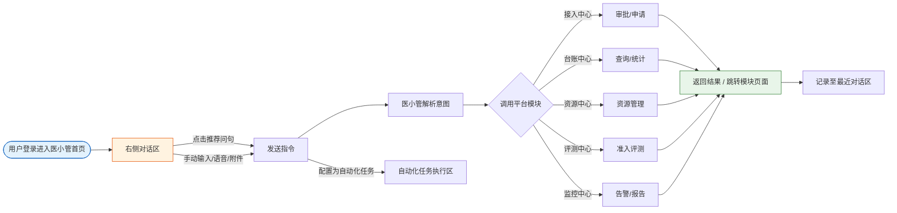
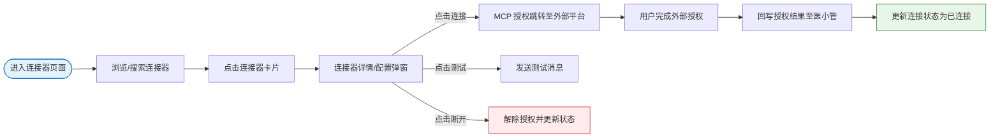
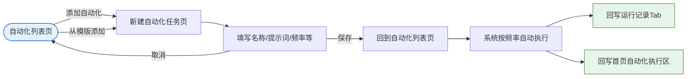

# 医小管智能体-需求说明

# 一、医小管智能体落地页说明

面向平台默认落地场景，为用户提供**对话式统一入口**能力："医小管"作为拟人化 AI 助手，让用户无需理解菜单结构，即可通过自然语言对话直接触达并完成**智能体建设需求管理、智能体接入、统一台账、准入评测、运行监控**五大模块的全部操作。

<aside>
⚠️

**平台一级菜单声明（避免终端页面生成错误）**：

平台左侧一级菜单**全局固定**，自上而下依次为：

1. **首页**（即本页面所属模块，默认入口）
2. **智能体建设需求管理**
3. **智能体接入中心**
4. **统一台账中心**
5. **医院资源管理中心**
6. **统一准入评测沙盒**
7. **统一运行监控**

本文档描述的「医小管智能体落地页」内容**仅在「首页」模块内渲染**，不影响上述 7 个平台一级菜单项的结构与顺序；Demo 实现时需严格保留左侧一级菜单。

</aside>

<aside>
ℹ️

**当前阶段说明**：

1. 本页面对应平台左侧一级菜单的**第一个模块**（**首页**），为平台**默认落地页 / 登录后默认首页**；
2. 页面内部采用**三层布局结构**（参考 CoreAgent）：**第一层—平台一级菜单栏**（全局固定 7 个模块）、**第二层—首页内左侧管理栏**（工具/品牌/工作台/自动化任务执行/最近对话）、**第三层—首页内右侧对话区**（医小管对话主区）；
3. 对话能力以自然语言触发平台内五大业务模块的操作，具体字段与交互以下方章节为准。
</aside>

### 1.1 页面布局与导航

<aside>
🧭

**首页模块内部采用三层布局结构（参考 CoreAgent 三层布局）**：

- **第一层—平台一级菜单栏**（全局固定，不属于本页面内部实现）：首页、智能体建设需求管理、智能体接入中心、统一台账中心、医院资源管理中心、统一准入评测沙盒、统一运行监控，共 7 个模块。
- **第二层—首页内左侧管理栏**（固定）：自上而下依次为工具区、品牌区、工作台区、自动化任务执行区、最近对话区，共 5 大区域（**用户账户信息与个人设置入口统一由系统右上角提供，不在本栏实现**）。
- **第三层—首页内右侧对话区**（主操作区）：自上而下依次为问候区、推荐问句区、指令输入区，共 3 大区域。

Demo 路由需严格按此结构实现：

1. 本文档描述的医小管落地页内容仅在**首页**模块内渲染（即第二层 + 第三层），**不影响**第一层平台一级菜单栏的结构与顺序；
2. 本页面不额外挂出二级菜单；
3. 所有五大业务模块操作均可通过第三层对话区以自然语言触发，同时保留第一层一级菜单直达入口。
</aside>

<aside>
🔒

**访问范围**：

1. 本页面面向**院内所有已认证用户**（信息科管理员、科室管理员）开放；
2. 推荐问句区根据登录角色（信息科管理员 / 科室管理员）动态展示对应视角的问句；
3. 最近对话、自动化任务执行记录仅创建者本人可见；
4. 侧边栏一级入口对所有授权角色可见。
</aside>

### 1.2 核心区域清单

<aside>
📌

下表所列区域均位于**首页模块内部**（第二层与第三层），平台一级菜单栏（第一层）不在本文档实现范围内，仅作为外部依赖保留。

</aside>

| **编号** | **区域名称** | **所属层级** | **主要用途** | **使用角色** |
| --- | --- | --- | --- | --- |
| 1.1 | 工具区 | 第二层·首页内左侧管理栏 | 提供导航栏收起/展开、对话任务搜索等基础工具入口 | 信息科管理员 / 科室管理员 |
| 1.2 | 品牌区 | 第二层·首页内左侧管理栏 | 展示医小管产品标识、名称与版本号，点击标识可返回首页 | 信息科管理员 / 科室管理员 |
| 1.3 | 工作台区 | 第二层·首页内左侧管理栏 | 提供新建对话、连接器管理、自动化任务配置等核心工作入口 | 信息科管理员 / 科室管理员 |
| 1.4 | 自动化任务执行区 | 第二层·首页内左侧管理栏 | 呈现当前用户已设置的自动化任务的执行记录 | 任务创建者本人 |
| 1.5 | 最近对话区 | 第二层·首页内左侧管理栏 | 展示当前用户最近的会话列表，支持点击恢复历史对话 | 对话创建者本人 |
| 2.1 | 问候区 | 第三层·首页内右侧对话区 | 展示医小管拟人形象、能力说明与问候语 | 信息科管理员 / 科室管理员 |
| 2.2 | 推荐问句区 | 第三层·首页内右侧对话区 | 基于登录角色动态展示推荐问句，点击即可发起对话 | 信息科管理员 / 科室管理员 |
| 2.3 | 指令输入区 | 第三层·首页内右侧对话区 | 用户以文字/语音/附件方式向医小管发送指令的核心输入入口 | 信息科管理员 / 科室管理员 |

### 1.3 对话触达与任务执行流程

<aside>
🔄

用户登录后默认进入本页面，在右侧对话区通过"点击推荐问句"或"手动输入指令"两种方式发起对话；医小管解析意图后调用平台五大模块能力，返回结果或跳转至对应模块页面；对话过程与自动化任务执行结果均记录于左侧导航栏对应区域，便于后续回溯。

</aside>



---

## 1.4第二层：首页内左侧管理栏

<aside>
📍

本章节描述区域均位于首页模块内部的左侧（三层布局中的第二层），**与平台一级菜单栏（第一层）相互独立**，不可与一级菜单合并实现。

</aside>

### 1.4.1 工具区

<aside>
🛠️

位于首页内左侧管理栏顶部，提供导航栏收起/展开、对话任务搜索两个基础工具入口，首页内固定展示。

</aside>

**图标/按钮 与 交互说明**

| **图标** | **说明** |
| --- | --- |
| 收起/展开左侧导航栏 | 点击后，收起/展开左侧导航栏 |
| 搜索对话任务 | 点击后，弹出搜索框，可通过关键词搜索想要寻找的对话任务 |

### 1.4.2 品牌区

<aside>
🏷️

展示医小管产品标识、名称与当前版本号，点击产品标识可返回首页。

</aside>

**字段**

| **字段** | **说明** |
| --- | --- |
| 产品名称 | 医小管 |
| 版本号 | 当前版本，如 v1.0 |

### 1.4.3 工作台区

<aside>
🧰

提供新建对话、连接器管理、自动化任务配置三大核心工作入口；其中「自动化任务」支持配置任务名称、触发方式与关联功能模块。

</aside>

**字段**

| **字段** | **说明** |
| --- | --- |
| 新建对话 | 开新会话、清空上下文并聚焦输入框 |
| 连接器 | 管理消息通知可连接的外部系统，如微信、飞书、邮箱、短信等 |
| 自动化任务 | 创建/配置定时或触发式任务的入口
配置字段：
·任务名称：如今日全院/本科室智能体运行情况报告
·触发方式：定时触发，每日几点
·关联功能模块：智能体建设需求管理中心、智能体接入中心、统一台账中心、准入评测中心、运行监控中心 |

### 1.4.4 自动化任务执行区

<aside>
⏱️

呈现当前用户已配置的自动化任务的执行记录，按最近执行时间倒序排列。

</aside>

**字段**

| **字段** | **说明** |
| --- | --- |
| 任务名称 | 已设置好的自动化任务名称 |
| 时间 | 相对时间，如 22 分钟前 |

### 1.4.5 最近对话区

<aside>
💬

展示当前用户最近的会话列表，点击会话标题可恢复对应的历史对话上下文。

</aside>

**字段**

| **字段** | **说明** |
| --- | --- |
| 会话标题 | 首条指令摘要或自定义名，点击恢复对话，如"审批影像科接入申请" |
| 时间 | 相对时间，如 22 分钟前 |

---

## 1.5 第三层：首页内右侧对话区

<aside>
📍

本章节描述区域均位于首页模块内部的右侧主操作区（三层布局中的第三层），**与平台一级菜单栏（第一层）相互独立**。

</aside>

### 1.5.1 问候区

<aside>
👋

位于首页内右侧对话区顶部，展示医小管拟人形象、能力说明与问候语，帮助用户快速理解产品定位。

</aside>

**字段**

| **字段** | **说明** |
| --- | --- |
| 医小管形象 | 动态拟人图标 |
| 能力说明 | 接入、台账、资源、评测、监控，一句话就能办 |
| 问候语 | 您好，我是医小管，请问有什么能帮到您？ |

### 1.5.2 推荐问句区

<aside>
✨

基于登录用户角色（信息科管理员 / 科室管理员）动态展示推荐问句列表；点击任意问句即可自动填入指令输入区并发起对话。

</aside>

**字段**

| **视角** | **推荐问句** |
| --- | --- |
| 信息科管理员 | 1. 列出本院所有待审批的智能体接入申请，并按提交时间排序
2. 汇总各科室提报的智能体建设需求
3. 按科室统计全院已上线智能体的数量和分类
4. 本月准入评测的通过率、平均得分是多少？有哪些未通过的？
5. 最近 24 小时哪个智能体调用失败最多？帮我看看原因
6. 现在有哪些未处理的高优先级告警？按严重程度排序
7. 生成一份本月全院智能体运行管理情况报告 …… |
| 科室管理员 | 1. 我们科室现在可以用哪些智能体？
2. 我想提报一个新的智能体建设需求，帮我登记
3. 我提交的接入申请现在审批到哪一步了？
4. 我们科室这个月智能体的调用量和成功率怎么样？
5. 最近 24 小时哪个智能体调用失败最多？帮我看看原因
6. 现在有哪些未处理的高优先级告警？按严重程度排序
7. 生成一份本月本科室智能体运行管理情况报告 …… |

### 1.5.3 指令输入区

<aside>
⌨️

位于首页内右侧对话区底部，作为用户与医小管交互的核心入口，支持多行文本、附件、语音等多种输入方式，并支持模型与连接器选择。

</aside>

**字段**

| **字段** | **说明** |
| --- | --- |
| 输入框 | 多行输入，自适应高度 |
| 附件上传 | 文档 / 图片 / 链接，点击或拖入 |
| 语音输入 | 语音转文字 |
| 发送按钮 | 点击 / Enter 发送 |
| 停止生成 | 执行中出现 |
| 模型选择 | 自动 / deepseekV4…… / 自定义 |
| 连接器选择 | 管理消息通知可连接的外部系统，如微信、飞书、邮箱、短信等 |

---

## 1.6 附录：医小管对话触达能力说明

<aside>
🧠

医小管作为平台的**对话式统一入口**，通过自然语言解析用户意图并调用平台五大模块能力，实现"一句话办公"，降低用户对菜单结构的学习成本。

</aside>

- **触发时机**：用户在指令输入区通过"文字输入 / 语音输入 / 附件上传 / 点击推荐问句"四种方式触发对话；也可通过工作台区【自动化任务】配置定时/触发式任务，由系统自动执行。
- **触达模块**：
    1. 智能体建设需求管理中心；
    2. 智能体接入中心；
    3. 统一台账中心；
    4. 准入评测中心；
    5. 运行监控中心。
- **输出形式**：文本回答、结构化列表、跳转对应模块页面、生成报告文件（Word / PDF）、消息推送（通过连接器至微信 / 飞书 / 邮箱 / 短信）等。
- **兜底策略**：若医小管无法理解用户意图或平台内无匹配能力，则返回提示"暂未理解您的诉求，请尝试换种表述或从推荐问句中选择"，并保留原始对话上下文。

# 二、连接器页面说明

面向医小管消息通知与外部系统联动场景，为用户提供**统一的连接器管理入口**，支持通过 **MCP 协议**接入微信、企业微信、QQ、飞书、钉钉、QQ 邮箱等常见 IM/邮箱/短信通道，实现「连接器发现—授权—配置—状态管理—测试—断开」全生命周期管理。

### 2.1 核心区域清单

| **编号** | **区域名称** | **所属层级** | **主要用途** | **使用角色** |
| --- | --- | --- | --- | --- |
| 3.1 | 连接器卡片列表 | 连接器列表页 | 提供页面标题与返回入口，展示可接入的连接器，支持查看状态、发起连接、查看连接器详情等操作 | 信息科管理员 / 科室管理员 |
| 3.2 | 连接器详情/配置弹窗 | 连接器页面·二级弹窗 | 展示连接器详细信息、并提供断开等操作 | 信息科管理员 / 科室管理员 |

### 2.2 连接与授权流程

用户从首页工作台区或指令输入区进入连接器页面，浏览/搜索目标连接器 → 点击卡片进入详情弹窗 → 触发 MCP 授权跳转 → 在外部连接器平台完成授权 → 回写授权结果至医小管 → 更新连接状态为「已连接」。后续可在弹窗内进行连接测试或断开。



---

## 2.3  连接器功能说明

### 2.3.1  连接器卡片列表页

**列表页字段**

| **字段** | **说明** |
| --- | --- |
| 页面标题 | 固定文案「连接器」，并附带icon |
| 返回按钮 | 点击返回调用方页面（首页或指令输入区），保留原对话上下文 |
| 连接器图标 | 展示连接器官方 Logo（如微信、飞书、钉钉等），便于用户快速识别 |
| 连接器名称 | 连接器的中文名称，如「企业微信」「飞书」「QQ 邮箱」 |
| 连接器描述 | 描述连接器作用 |
| 连接状态 | 1.未使用此连接器：不展示状态圆点
2.已使用此连接器：展示状态圆点
· 已连接（绿色）：授权有效，可正常收发消息
· 异常（红色）：授权失效/网络不通/额度超限等 |
| 主操作按钮 | 根据状态动态展示：
1.未使用此连接器：展示「连接」icon，点击触发 MCP 授权跳转
2.已使用此连接器：展示「管理」icon，点击进入配置弹窗 |

**内置连接器清单**

| **连接器** | **说明** |
| --- | --- |
| 微信 | 接入个人微信，用于接收医小管推送的报告、告警等消息 |
| 企业微信 | 接入医院企业微信组织，用于组织内通知与工作群消息推送 |
| QQ | 接入个人 QQ，用于接收消息通知 |
| 飞书 | 接入飞书账号/机器人，用于飞书群/私聊消息推送 |
| 钉钉 | 接入钉钉账号/机器人，用于钉钉群/工作通知消息推送 |
| QQ 邮箱 | 接入 QQ 邮箱，用于接收报告、附件等邮件通知 |
| 企业邮箱 | 接入医院企业邮箱，用于正式邮件通知 |
| 短信网关 | 接入运营商短信通道，用于紧急告警短信推送 |

### 2.3.2 连接器详情页

**字段**

| **字段** | **说明** |
| --- | --- |
| 连接器名称 | 与卡片名称一致，如「企业微信」 |
| 连接器说明 | 介绍该连接器用途、支持能力（消息推送 / 附件发送 / 群通知等） |
| 连接状态 | 与卡片状态保持同步
1.未使用此连接器：不展示状态圆点
2.已使用此连接器：展示状态圆点
· 已连接（绿色原点）：授权有效，可正常收发消息
· 异常（红色原点）：授权失效/网络不通/额度超限等 |
| 操作按钮 | 根据状态动态展示：
1.未使用此连接器：展示「连接」按钮，点击触发 MCP 授权跳转
2.已使用此连接器：展示「解绑」「去试试」按钮，解除授权
· 点击「解绑」按钮，解除授权
·点击「去试试」按钮，跳转到新建对话窗口，自动选择当前连接器带入提示词。 |
| 关闭按钮 | 关闭弹窗，返回连接器卡片列表 |

# 三、自动化功能说明

提供**自动化任务管理入口**，让医小管按设定频率自动执行重复任务（如「每日智能体运行报告」「每日 AI 新闻推送」），并通过已授权的连接器推送结果。

<aside>
ℹ️

**入口与结构**：

- **入口**：首页 → 工作台区 → 自动化任务（二级页面）；
- **两个子页**：列表页（定时任务 / 运行记录）、新建/编辑任务页；
- **执行结果**：同步至首页「自动化任务执行区」（见 1.4）。
</aside>

### 3.1 核心区域清单

| **编号** | **区域名称** | **所属层级** | **主要用途** | **使用角色** |
| --- | --- | --- | --- | --- |
| 4.1 | 自动化列表页面 | 自动化功能·列表页 | 展示当前用户已创建的自动化任务与运行记录，支持搜索、批量管理、模版添加、新建等操作 | 任务创建者本人 |
| 4.2 | 新建/编辑自动化任务页面 | 自动化功能·表单页 | 提供自动化任务的名称、提示词、连接器、执行频率、生效区间等全量配置入口 | 任务创建者本人 |
| 4.3 | 自动化任务执行记录区 | 首页·左侧导航（1.4 节） | 以相对时间列表展示最近自动化任务执行记录，支持展开/收起、点击查看执行详情 | 任务创建者本人 |

### 3.2 任务创建与执行流程

用户从自动化列表页点击「添加自动化」或「从模版添加」进入表单页 → 填写名称/提示词/频率等字段 → 保存后回到列表页 → 系统按频率自动执行 → 执行结果回写至「运行记录」Tab 与首页自动化执行区。



---

### 3.3 自动化列表页面

自动化功能默认落地页，顶部提供「定时任务 / 运行记录」两个 Tab 与顶部操作栏，下方以列表形式展示当前用户已创建的自动化任务，支持搜索、批量管理与从模版添加。

**顶部 Tab 与操作栏字段**

| **字段** | **说明** |
| --- | --- |
| Tab页：定时任务 | 默认选中 Tab，展示当前用户已创建的所有自动化任务 |
| Tab页：运行记录 | 切换后展示历史执行记录列表，包含任务名称、执行时间、执行结果（成功/失败）与耗时 |
| 搜索自动化/记录 | 按任务名称关键词搜索；切换 Tab 后搜索目标同步切换为定时任务或运行记录 |
| 批量管理 | 点击后列表项左侧出现多选框，支持批量删除自动化任务，顶部同步展示已选数量与批量操作按钮 |
| 从模版添加 | 点击后弹出模版选择弹窗（如「每日 AI 新闻推送」「周报自动生成」等），选中后跳转至新建页并预填模版字段 |
| 添加自动化 | 主操作按钮（黑色实心），点击跳转至「新建自动化任务」页面（见 4.2） |

**列表区字段（定时任务 Tab）**

| **字段** | **说明** |
| --- | --- |
| 分组标题 | 按已启动和暂停状态分组展示，分为「目前」和「暂停」 |
| 任务名称 | 创建时填写的自动化任务名称 |
| 触发频率描述 | 以自然语言展示任务触发频率，如「每天 09:00」「每小时」「单次 2026-07-10 15:00」 |
| 下次执行倒计时 | 列表项右侧展示相对时间，如「16 小时后执行」；已禁用时展示「已暂停」 |
| 行内悬停操作 | 鼠标悬停列表项时右侧出现「启用/禁用」开关与「⋯ 更多」菜单（编辑 / 复制 / 立即执行一次 / 删除） |
| 点击列表项 | 点击任务名称/任意区域跳转至「编辑自动化任务」页（字段与 4.2 完全相同），可修改后保存 |

**列表区字段（运行记录 Tab）**

| **字段** | **说明** |
| --- | --- |
| 任务名称 | 产生本次记录的自动化任务名称，点击可跳转至对应任务编辑页 |
| 执行时间 | 下次执行时间 |
| 倒计时 | 展示距离现在要执行的时间 |
| 输出消息摸要 | 展示本次任务执行结果的首段摸要（默认一行截断），点击列表项跳转至执行详情弹窗查看完整内容 |
| 行内悬停操作 | 悬停时分状态展示按钮：
1.当前：展示「测试运行、暂停、删除」操作按钮
2.暂停：展示「测试运行、恢复、删除」操作按钮
按钮说明：
·测试运行：点击此按钮，会在定时任务下，创建一条新的对话记录（记录命名规则：定时任务名称-yyyy-mm-dd-hh-mm-ss）
·暂停：暂停此定时任务的调度
·恢复：恢复此定时任务的调度
·删除：删除此任务 |

### 3.3.1 新建/编辑自动化任务页面

点击列表页「添加自动化」或列表项后进入的表单页，提供自动化任务的名称、提示词、连接器、执行频率、生效区间等全量配置入口，新建与编辑共用同一套字段。

**顶部导航与操作**

| **字段** | **说明** |
| --- | --- |
| 面包屑导航 | 固定展示「自动化 / 添加自动化任务」（编辑时为「自动化 / 编辑自动化任务」），点击「自动化」可返回列表页 |
| 取消按钮 | 位于页面右上角，点击后弹出二次确认（存在未保存修改时），确认后丢弃修改并返回列表页 |
| 保存按钮 | 位于页面右上角（黑色实心），点击后校验必填字段，校验通过后保存任务并返回列表页；保存后按频率自动执行 |

**表单字段**

| **字段** | **说明** |
| --- | --- |
| 自动化任务名称（必填） | 单行输入框，限制 1–50 个字符；为任务的唯一可读名称 |
| 提示词（必填） | 多行输入框，用于描述本次自动化任务需完成的具体内容 |
| 提示词 - 模型选择 | 提示词框内左下角，默认「Auto」，点击展开可选模型列表（deepseekV4 / GPT / 自定义等） |
| 连接器（可选） | 下拉选择器，支持多选，展示当前用户**已授权且为已连接状态**的连接器（微信/企业微信/飞书/钉钉/QQ 邮箱等）；
辅助说明「勾选即授权该连接器在任务中免确认使用」；
未选时默认将结果回写到自动化任务执行区与运行记录 Tab |
| 执行频率（必填） | 以子 Tab 形式提供三种模式：周期 / 按间隔 / 单次，具体字段见下方「执行频率子字段」表 |
| 生效日期区间（可选） | 日期区间选择器，选择任务生效的开始日期与结束日期；留空时默认「始终生效」
仅在执行执行频率为：周期、按间隔时，才展示此字段 |
| 周期 | 两字段组合：
· 周期下拉：每天 / 每周 / 每月，选中「每周」时额外展示周一～周日多选，选中「每月」时额外展示日期（1～31）多选
· 时间选择器：默认 09:00，支持到分钟粒度 |
| 按间隔 | 三字段组合：
· 间隔数值：默认 1，支持正整数输入
· 间隔单位：小时 / 分钟（下拉）
· 星期多选：周一 / 周二 / … / 周日，默认全选；仅在选中的星期内按间隔执行 |
| 单次 | 单一字段：
· 日期时间选择器：选择具体执行日期与时间（需为当前时间之后），任务在该时点仅执行一次 |

### 3.3.2 自动化任务执行记录区（首页左侧）

对应首页左侧「自动化任务执行区」（参见 1.4 节），**按自动化任务分组展示**：每个自动化任务作为一个可折叠分组，分组下包含该任务历次调度生成的子任务，按执行时间倒序排列。

**字段**

| **字段** | **说明** |
| --- | --- |
| 分组名（一级） | 自动化任务名称；
左侧带折叠/展开图标（▾/▸），点击可折叠或展开该分组下的所有子任务 |
| 子任务名（二级） | 自动化任务每次调度生成的子任务，
命名规则：自动化任务名称-yyyy-mm-dd-hh-mm-ss |
| 时间 | 子任务右侧展示相对执行时间，如「刚刚」「22 分钟前」「2 小时前」 |

**层级结构示意**

```
▾ 每日 AI 新闻推送                    （一级：自动化任务名称）
     每日 AI 新闻推送-2026-07-08-15-00-00   刚刚
     每日 AI 新闻推送-2026-07-08-14-22-11   38 分钟前
     每日 AI 新闻推送-2026-07-08-14-18-05   42 分钟前
```

## 3.4 其他说明

- **异常处理**：
    1. 保存时必填字段缺失 → 对应字段高亮报错并提示「请填写名称/提示词/执行频率」；
    2. 自动执行失败 → 运行记录展示「失败」状态，详情弹窗展示失败原因（提示词解析失败 / 连接器断开 / 模型限频等），并提供「重新执行」按钮；
    3. 连接器授权过期/断开 → 保存/执行时提示「连接器已断开，请先重新连接」，并提供快捷跳转至连接器页。
- **权限范围**：
    1. 自动化任务仅**创建者本人**可见/可编辑，不支持跨用户共享；