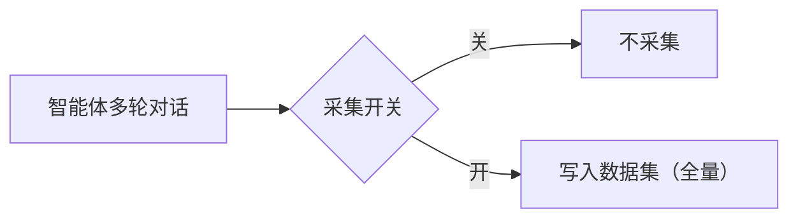
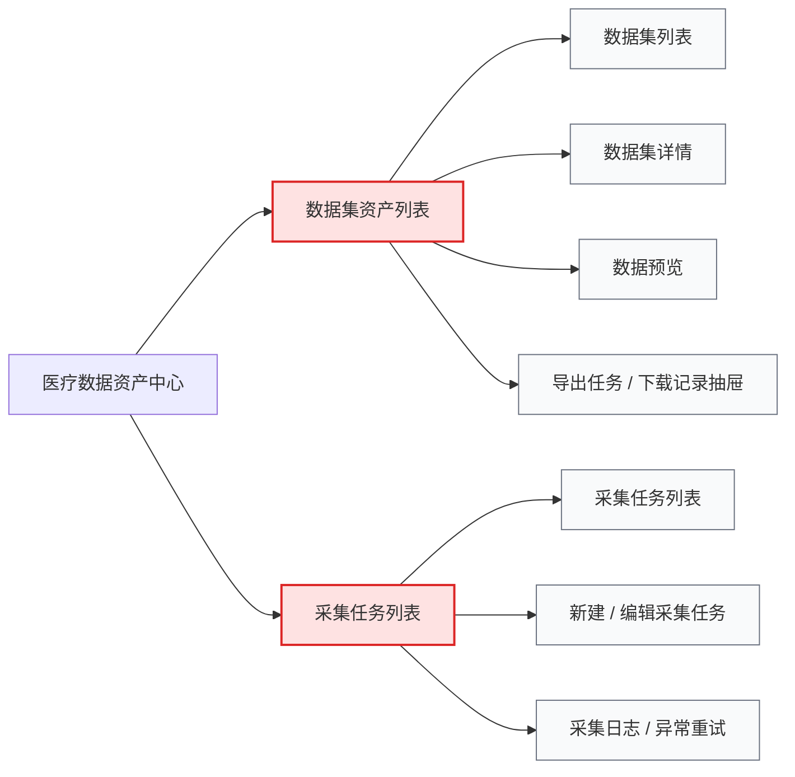

# 医疗数据资产中心-需求说明文档

## 文档信息

| **项目** | **内容** |
| --- | --- |
| 所属平台 | 医疗智能体统一管理运营平台（AgentOps） |
| 所属模块 | 模块 10：医疗数据资产中心 |
| 文档版本 | V1.0 |
| 创建日期 | 2026-05-27 |

---

## 一、模块定位

### 1.1 模块概述

自动收集智能体的**多轮对话全量数据并支持数据**导出，供线下做模型微调，迭代进化的模型再接入平台，形成数据飞轮。

### 1.2 核心目标

| **阶段** | **做什么** | **验收标准** |
| --- | --- | --- |
| P0 | 自动采集智能体多轮对话**全量数据** | 对话 100% 入库，可按智能体筛选 |
| P0 | 支持JSON格式导出 | 导出包可直接用于线下 SFT / DPO 微调 |

### 1.3 模块边界

| **范围** | **✅ 包含** |
| --- | --- |
| 数据 | 智能体多轮对话**全量**（prompt + response） |
| 采集 | 单智能体级开关（默认开启，全量入库） |
| 导出 | JSON格式数据集导出 |

### 1.4 用户角色

本期仅涉及两类角色，标注员 / 审核员等随远期能力一并启用。

| **角色** | **职责** |
| --- | --- |
| 平台管理员 | 配置采集开关、维护数据集、管理导出任务 |
| 数据使用方 | 浏览数据集、申请并下载已授权数据，用于线下模型训练 |

---

## 二、核心流程

平台内自动采集智能体多轮对话全量数据，以 JSON 格式导出供线下微调，新模型回流平台开启下一轮迭代。

### 2.3 数据采集（P0）

智能体每产生一段多轮对话，按**单智能体级开关**判断是否入库——开关开启即**全量采集**，不做采样、不做条件过滤。

### 2.4 数据导出（P0）

数据使用方选定数据集→ 生成 **JSON 导出包** → 下载到线下做微调训练。本期仅支持 JSON导出。

---

## 三、设计要点

本期按 P0 → P1 → 远期 优先级聚焦 4 条核心设计要点，对应后续模块功能与页面设计依据。

| **编号** | **要点** | **说明** |
| --- | --- | --- |
| D1 | 多轮对话全量采集（P0） | **单智能体级开关**，开关开启即**全量入库**，不做采样、不做条件过滤；仅采集对话数据（prompt + response），不含 Trace 日志。通过 Callback Handler 自动回流，异步非阻塞，失败进入异常重试队列；数据集 Schema 预定义，保障下游导出一致性 |
| D2 | JSON 单一格式导出（P0） | 本期仅支持 **JSON 格式**导出包，结构对齐主流 SFT / DPO 微调框架。 |

---

## 四、导航结构

本模块在平台中作为「医疗数据资产中心」一级菜单，包含2 个二级功能入口：

1.通过「采集任务列表」完成数据采集配置

2.通过「数据集资产列表」完成数据集统计、管理、预览与导出。

形成「配置采集任务 → 对话全量入库 → 数据集资产管理 → 发起导出 → 查看导出任务 / 下载记录」的业务闭环。

---

## 五、模块功能说明

本期仅保留 P0 范围的【数据采集】与【数据集与导出】两条核心主线，对应 §四 的「采集任务列表」与「数据集资产列表」两个一级入口。详细标注、数据脱敏、L1-L4 分级共享审批等能力本期不实现，统一归入 §5.3 远期能力。

### 5.1 数据采集管理（P0）

面向「采集任务列表」入口，完成从智能体对话到数据集的全量数据回流。

| **编号** | **功能** | **说明** |
| --- | --- | --- |
| F1.1 | 对话数据自动采集 | 通过智能体调用链回调机制（Callback Handler）自动采集**多轮对话全量数据**（用户 prompt + 智能体 response）；异步非阻塞，不影响对话响应性能 |
| F1.2 | 采集任务管理 | 以「采集任务」为最小配置单位，绑定一个智能体到一个目标数据集；支持新建、编辑、复制、删除采集任务 |
| F1.3 | 采集开关管理 | **单智能体级开关**，默认开启即**全量入库**，不做采样、不做条件过滤；支持按智能体批量启停 |
| F1.4 | 异常队列与重试 | 采集失败记录自动进入异常队列，记录失败原因（格式校验失败、连接超时等），支持一键重试或手动处理 |

### 5.2 数据资产管理（P0）

面向「数据集资产列表」入口，完成从资产管理到 JSON 导出的闭环。

| **编号** | **功能** | **说明** |
| --- | --- | --- |
| F2.1 | 数据集 Schema 管理 | 预定义数据集字段结构（对话内容、智能体名称、所属科室、元数据），保障数据格式统一与下游导出一致性 |
| F2.2 | 数据集资产目录 | 统一展示已采集数据集列表：名称、描述、记录数、所属智能体 / 科室、Schema 字段结构、创建 / 更新时间 |
| F2.3 | 数据预览 | 浏览数据集记录列表与完整多轮对话详情，支持全文搜索、按元数据筛选、按采集时间排序 |
| F2.4 | JSON 导出包生成 | 本期仅支持 **JSON 格式**导出包，结构对齐主流 SFT / DPO 微调框架；其他格式（HuggingFace / CSV 等）作为远期能力 |
| F2.5 | 导出访问日志 | 记录每次数据导出（访问人 / 时间 / 数据集 / 字段范围 / 记录数），推送至审计中心 |

---

## 六、核心页面清单

按 §四 导航结构组织，本期共 7 个核心页面（P0），分属「数据集资产列表」与「采集任务列表」两个一级入口。远期能力相关页面（详细标注、脱敏、分级共享审批等）本期不实现，详见 §5.3。

### 页面总览

| **分组** | **页面名称** | **编号** | **简要说明** |
| --- | --- | --- | --- |
| 📊 数据集资产列表（P0） | 数据集列表页 | D1.1 | 浏览全部数据集，查看核心统计指标，发起导出 |
| 📊 数据集资产列表（P0） | 数据集详情页 | D1.2 | 查看 Schema、元数据、关联采集任务与操作入口 |
| 📊 数据集资产列表（P0） | 数据预览页 | D1.3 | 浏览数据集记录列表与完整多轮对话详情 |
| 📊 数据集资产列表（P0） | 导出任务与下载记录抽屉 | D1.4 | 发起导出 + 查看任务进度、历史下载与有效期 |
| 🎯 采集任务列表（P0） | 采集任务列表页 | D2.1 | 管理智能体采集任务，启停采集开关 |
| 🎯 采集任务列表（P0） | 新建/编辑采集任务页 | D2.2 | 绑定智能体与目标数据集，配置采集开关 |
| 🎯 采集任务列表（P0） | 采集日志与异常重试 | D2.3 | 查看采集日志，处理异常队列与一键重试 |

### 6.1 数据集资产列表（D1.1 – D1.4）

#### D1.1 数据集列表页

「数据集资产列表」一级入口默认页面，统一浏览全部已采集数据集，并发起导出。

> **页面说明**：页面不设顶部统计指标卡片（如数据集数量 / 记录总数 / 今日新增 / 近 7 日新增）。列表本身已含「记录总数 / 今日新增」字段，避免重复；单个数据集的详细统计在 D1.2 详情页呈现。
> 

**字段说明**

| **字段** | **类型** | **说明** |
| --- | --- | --- |
| 数据集名称 | 文本链接 | 数据集唯一标识，点击进入详情页（D1.2） |
| 描述 | 文本 | 数据集用途简要描述 |
| 所属智能体 | 标签 | 关联的智能体名称 |
| 所属科室 | 标签 | 数据集所属医疗科室 |
| 记录总数 | 数值 | 累计入库的多轮对话条数 |
| 今日新增 | 数值 | 当日新采集记录数 |
| Schema 版本 | 文本 | 当前数据集字段结构版本号 |
| 创建时间 | 时间 | ISO 时间格式 |
| 更新时间 | 时间 | 最近一次写入时间 |
| 操作 | 按钮组 | 预览（→ D1.3）/ 导出（→ D1.4）/ 详情（→ D1.2） |

**交互说明**

- **筛选区默认只展示一行**：名称/描述搜索框 + 所属智能体 + 所属科室 + 记录总数 + 今日新增，右侧提供「重置 / 查询」按钮
- 点击「展开」可展示更多筛选条件（如创建时间范围、更新时间范围、Schema 版本等），再次点击「收起」还原为一行；筛选状态在页面刷新后保留
- 列表默认按「更新时间」倒序排列，支持按记录总数 / 今日新增切换排序
- 点击「导出」右侧滑出导出抽屉（D1.4），预勾全部字段，可取消勾选以缩小导出面
- 点击行任意位置（除操作列外）进入数据集详情页
- 右上角「导出任务与下载记录」按钮打开全局抽屉（D1.4）

#### D1.2 数据集详情页

查看单个数据集的完整元信息，上下游贯通采集任务与导出记录。

**字段说明**

| **字段/区块** | **类型** | **说明** |
| --- | --- | --- |
| 数据集头部 | 信息区 | 图标 / 名称 / 描述，管理员可点击「编辑」修改名称与描述 |
| 统计概览 | 指标卡组 | 记录总数、今日新增、近 7 日新增、关联采集任务数 |
| Schema 字段结构 | 只读表格 | 字段名、字段类型、是否必填、字段描述（本期不允许修改已有结构） |
| 元数据配置 | 表格 | 智能体名称、所属科室、Token 数、响应耗时等元数据字段 |
| 关联采集任务 | 列表 | 任务名称、关联智能体、开关状态、最近采集时间，点击跳转 D2.2 |
| 操作入口 | 按钮组 | 数据预览（→ D1.3）/ 导出（→ D1.4）/ 编辑数据集 |

**交互说明**

- 顶部 Tab 切换：「概览 / Schema / 关联采集任务 / 导出记录」
- Schema 字段结构为只读展示，本期不提供字段增删改
- 关联采集任务 Tab 中点击行可跳转 D2.2 编辑该任务
- 「导出记录」Tab 内嵌 D1.4 该数据集的历史导出记录
- 顶部「返回列表」按钮返回 D1.1

#### D1.3 数据预览页

以只读方式逐条浏览数据集记录，用于导出前抽检与快速查阅。

**字段说明**

| **字段/区块** | **类型** | **说明** |
| --- | --- | --- |
| 记录列表 | 列表表格 | 对话摘要（前 50 字）、智能体名称、采集时间、Token 数 |
| 对话详情面板 | 侧边面板 | 点击记录展开完整多轮对话，气泡式渲染 prompt / response |
| 元数据面板 | 信息卡 | 该记录的 Token 数、响应耗时、所属采集任务、智能体名称 |
| 搜索框 | 文本输入 | 全文搜索对话内容 |
| 筛选器 | 筛选器组 | 按智能体、采集时间、响应耗时范围筛选 |
| 排序 | 下拉 | 按采集时间 / Token 数正倒序 |

**交互说明**

- 列表默认按采集时间倒序排列
- 对话详情面板为右侧滑出式，支持键盘上下方向键翻页浏览
- 仅查看不修改：本期不支持对原始记录的编辑或删除
- 顶部「返回数据集」按钮回到 D1.2
- 顶部「导出当前筛选结果」按钮可将当前筛选 / 搜索后的记录作为导出范围传入 D1.4

#### D1.4 导出任务与下载记录抽屉

从 D1.1 / D1.2 / D1.3 触发的右侧抽屉，集「发起导出」+「查看任务状态与历史下载」于一体。

**字段说明**

| **区块** | **字段** | **说明** |
| --- | --- | --- |
| 新建导出 | 数据集 | 只读，来自上下文；从全局抽屉打开时可下拉切换 |
| 新建导出 | 字段范围 | 多选，从 Schema 中勾选要导出的字段，默认全选 |
| 新建导出 | 记录范围 | 选项：全部 / 按采集时间范围 / 按当前筛选结果 / 按记录数上限 |
| 新建导出 | 导出格式 | 单选，本期仅 JSON（其他格式置灰且标「远期」提示） |
| 任务列表 | 任务 ID | 系统自动生成 |
| 任务列表 | 提交时间 / 提交人 | 记录提交信息 |
| 任务列表 | 状态 | 排队中 / 打包中 / 已完成 / 已过期 / 失败 |
| 任务列表 | 记录数 / 文件大小 | 打包完成后显示实际导出记录数与压缩包大小 |
| 任务列表 | 下载链接 | 仅「已完成」状态可点击，同时显示有效期倒计时（默认 7 天） |
| 任务列表 | 操作 | 重新打包 / 取消 / 删除记录 / 查看失败原因 |

**交互说明**

- 提交导出后任务进入「排队中」状态，抽屉内进度条自动刷新
- 完成后站内通知 + 抽屉顶部高亮提示，下载链接默认 7 天有效
- 链接过期后可点击「重新打包」生成新链接，原任务保留历史
- 失败任务点击「查看失败原因」弹窗显示详细错误信息
- 抽屉顶部「只看我提交的」开关默认开启，可切换查看全部人员的任务记录

### 6.2 采集任务列表（D2.1 – D2.3）

#### D2.1 采集任务列表页

「采集任务列表」一级入口默认页面，集中管理智能体采集任务与采集开关。

> **页面说明**：页面不设顶部统计指标卡片（如采集任务数 / 已启用 / 今日采集总量 / 累计采集量），也不再提供独立的「采集监控看板」入口与功能；列表本身已含按任务维度的「今日采集量 / 累计采集量 / 异常数」字段列，全量趋势与指标看板本期不实现，统一归入远期能力。
> 

**字段说明**

| **字段** | **类型** | **说明** |
| --- | --- | --- |
| 任务名称 | 文本链接 | 采集任务标识，点击进入编辑（D2.2） |
| 关联智能体 | 标签 | 任务绑定的智能体 |
| 目标数据集 | 链接 | 数据回流的数据集，点击跳转 D1.2 |
| 采集开关 | 开关 | 开启即全量入库；关闭则停止采集，不影响已有记录 |
| 今日采集量 | 数值 | 当日入库记录数 |
| 累计采集量 | 数值 | 该任务启用以来的累计入库数 |
| 最近采集时间 | 时间 | 最近一次成功写入时间 |
| 异常数 | 数值 | 异常队列中待处理记录数，>0 时红色高亮，点击跳转 D2.3 |
| 创建时间 / 创建人 | 时间 / 用户 | 记录任务创建信息 |
| 操作 | 按钮组 | 编辑 / 查看日志（→ D2.3） / 复制 / 删除 |

**交互说明**

- 顶部「新建采集任务」按钮跳转 D2.2
- **筛选区默认只展示一行**：任务名称搜索框 + 关联智能体 + 所属科室 + 目标数据集 + 全部状态（开关状态），右侧提供「重置 / 查询」按钮
- 点击「展开」可展示更多筛选条件（如创建时间范围、最近采集时间范围、是否含异常等），再次点击「收起」还原为一行；筛选状态在页面刷新后保留
- 行内「采集开关」切换即时生效，关闭时弹窗二次确认防误操作
- 「查看日志」跳转 D2.3，自动按当前任务过滤
- 删除任务需二次确认；已有记录不会被删除，仅停止后续采集

#### D2.2 新建/编辑采集任务页

表单页面，配置智能体 → 目标数据集的绑定关系。

**字段说明**

| **字段** | **类型** | **说明** |
| --- | --- | --- |
| 任务名称 | 文本 | 必填，系统内唯一 |
| 任务描述 | 文本域 | 可选，说明任务用途 |
| 关联智能体 | 下拉单选 | 必填，从已注册智能体中选择；已被其他任务绑定的智能体置灰不可选 |
| 目标数据集 | 下拉单选 + 「新建」入口 | 必填；可点击「新建数据集」弹窗配置 Schema 后返回 |
| 采集开关 | 开关 | 默认开启；开关状态在任务列表同步可见 |
| 数据集 Schema 预览 | 只读表格 | 选定目标数据集后实时展示其字段结构，便于核对 |
| 测试连接 | 按钮 | 验证 Callback Handler 可达性，返回响应耗时与状态码 |

**交互说明**

- 选定智能体后自动校验是否已绑定其他任务，重复绑定时以错误提示阻止提交
- 选定目标数据集后即时预览 Schema，避免字段不匹配
- 底部提供「保存并启用」与「保存为草稿」两个动作：草稿默认关闭采集开关
- 编辑模式下：关联智能体与目标数据集不可修改（避免数据混入），仅可修改名称 / 描述 / 开关
- 取消时如有未保存修改，弹窗二次确认

#### D2.3 采集日志与异常重试

集中查看采集成功 / 失败日志，处理异常队列中的记录。

**字段说明**

| **字段** | **类型** | **说明** |
| --- | --- | --- |
| Tab 切换 | Tab | 全部 / 成功 / 异常；默认进入「异常」Tab |
| 任务名称 | 文本 | 关联采集任务，点击跳转 D2.2 |
| 智能体 | 标签 | 记录所属智能体 |
| 记录摘要 | 文本 | 对话片段摘要（前 50 字） |
| 失败原因 | 标签 | 格式校验失败 / 连接超时 / Schema 不匹配 / 未知错误 等 |
| 失败次数 | 数值 | 已重试次数，超过阈值自动标记为「需人工介入」 |
| 最近失败时间 | 时间 | 最后一次失败的时间戳 |
| 操作 | 按钮组 | 重试 / 查看详情 / 标记忽略 / 删除 |

**交互说明**

- 顶部支持按任务、失败原因、时间范围、智能体筛选
- 列表顶部提供批量操作栏：批量重试、批量标记忽略、批量删除
- 一键重试后记录状态变为「重试中」，成功后自动从异常队列移除并追加到「成功」Tab
- 「查看详情」弹窗显示完整 payload、错误堆栈、对话上下文，便于排查
- 已标记忽略的记录默认隐藏，可通过筛选器「包含已忽略」展示
- 「全部」Tab 下提供导出 CSV 日志按钮，用于离线排查