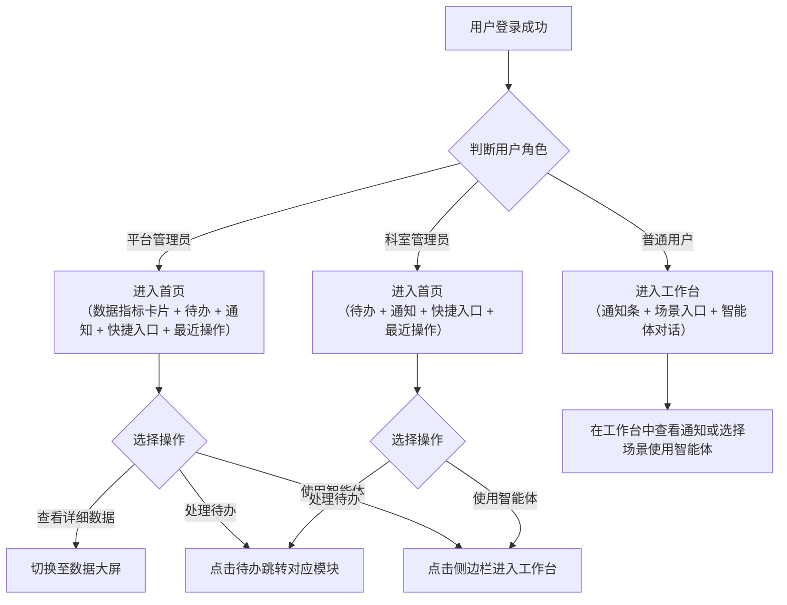
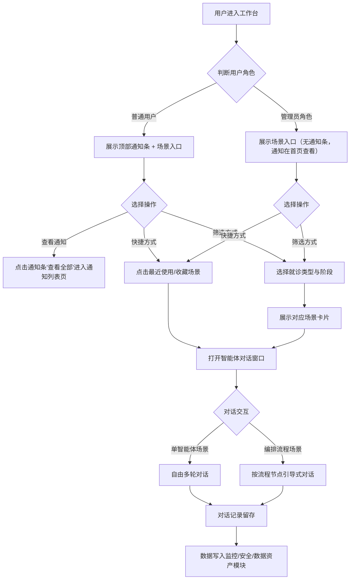
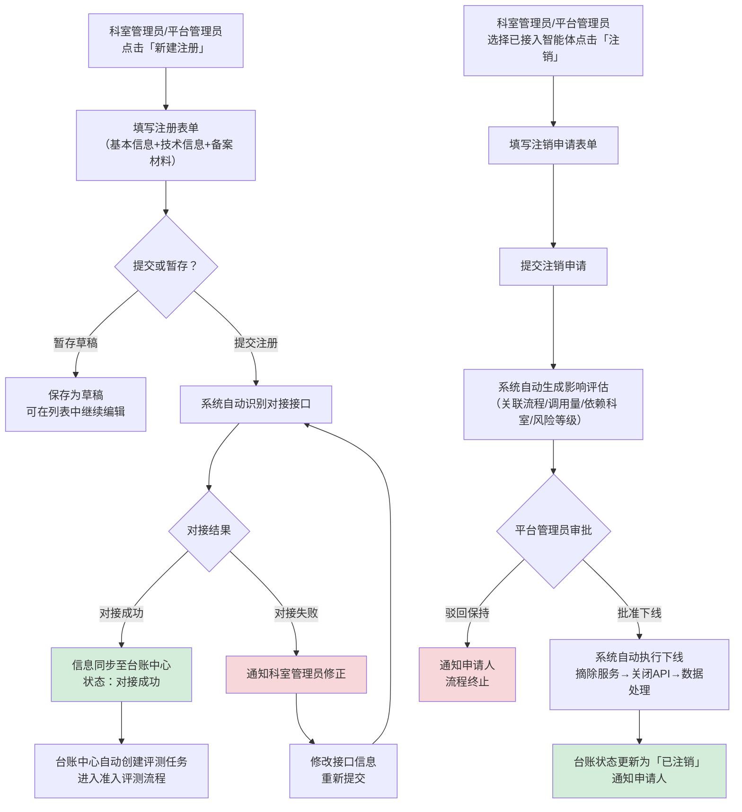
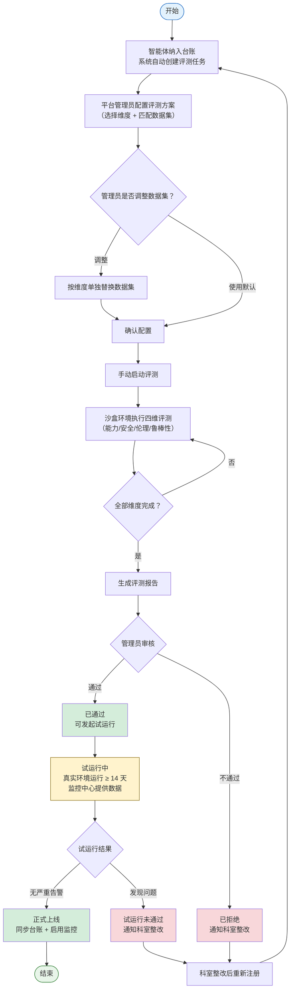
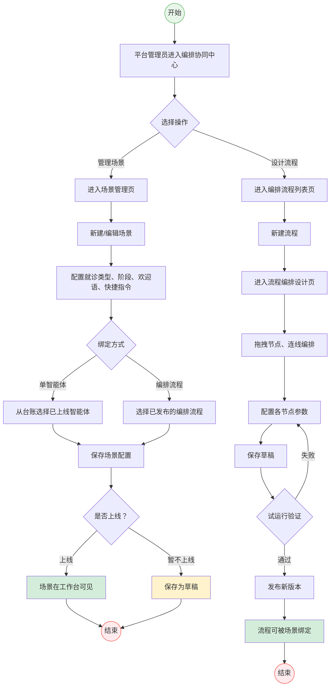
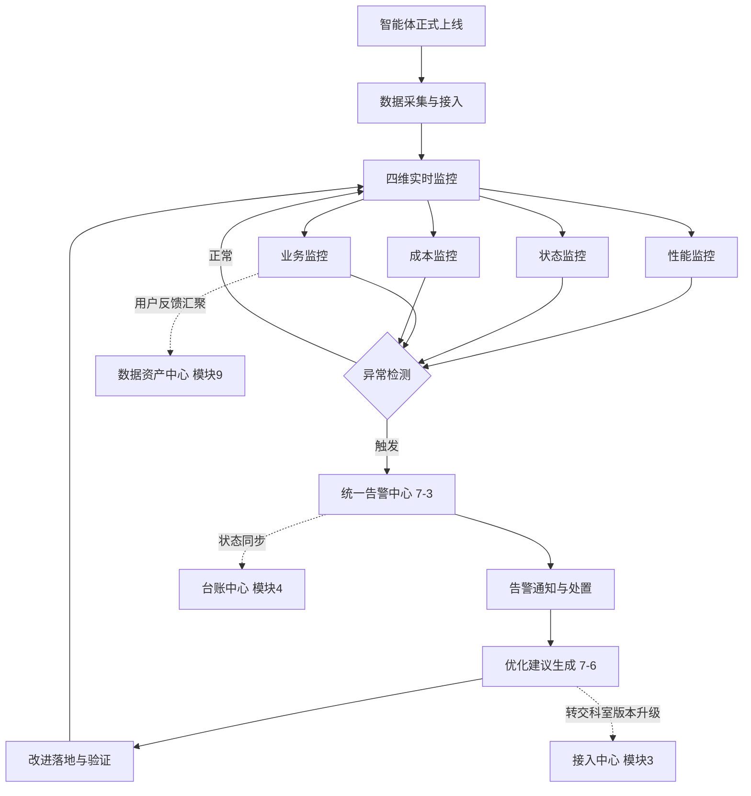
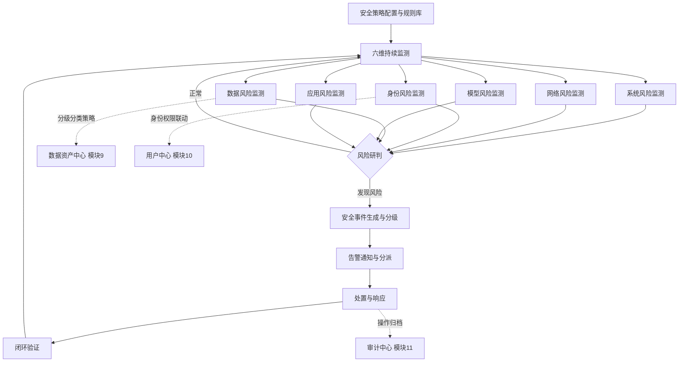
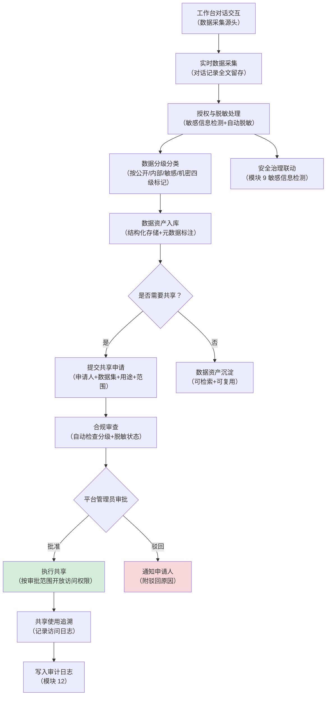
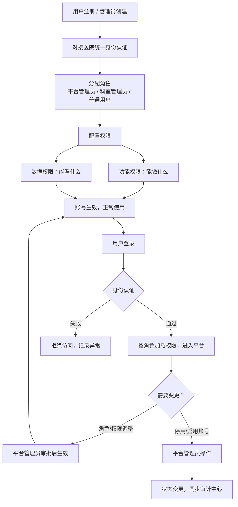
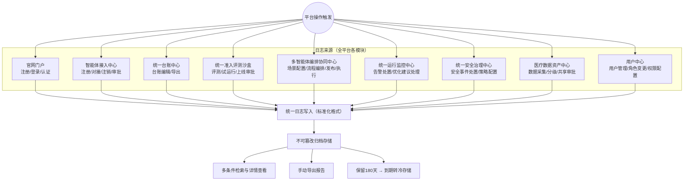

# 医疗智能体管理平台-需求说明书V1.1

# 项目背景

医院各科室正在引入越来越多的 AI 智能体，但各自采购、各自管理，导致安全风险难控、质量参差不齐、数据无法复用。

本平台作为全院智能体的统一管理中心，通过准入评测把好质量关、运行监控守好安全线、数据治理盘活数据资产。

最终实现智能体全生命周期规范化管理，支撑医院 AI 能力的规模化安全应用。

# 功能架构


# 用户角色

| **编号** | **角色** | **角色职责说明** |
| --- | --- | --- |
| 1 | 平台管理员 | 平台核心管理角色，统筹智能体从接入到退出的全生命周期管理：
① **接入管控**：审核智能体注册备案信息，统一管理接口对接方式
② **准入评测**：在沙盒环境中组织多维度评测，审批是否准入上线
③ **台账管理**：维护全院智能体信息台账，支持按条件筛选与快速检索
④ **流程编排**：统一设计和管理跨科室的诊疗全流程智能体协同链路（导诊→门诊→影像检查→辅助诊断→手术评估→病历撰写→用药审核→医保合规）
⑤ **运行监控**：实时监控智能体的性能、运行状态、业务指标和资源成本，异常时自动告警
⑥ **安全治理**：持续监测系统、网络、身份、数据、模型、应用六大维度的安全风险并及时处置
⑦ **数据资产**：对人机交互数据进行分级分类，管理数据的合规共享与流通
⑧ **权限管理**：配置平台角色与操作权限，实现不同用户的分级授权 |
| 2 | 科室管理员 | 代表本科室管理智能体的申请接入与日常使用：
① **注册申请**：填写并提交本科室智能体的注册表单与备案材料
② **运行跟踪**：查看本科室智能体的运行监控数据与优化建议，推动版本迭代升级 |
| 3 | 普通用户
 | 科室一线业务人员，是智能体的最终使用者：
① **登录访问**：通过医院统一身份认证安全登录平台
② **日常使用**：在诊疗业务中调用已上线的智能体辅助工作
③ **问题反馈**：提交使用中的问题与改进建议，为运行监控和数据资产沉淀提供一手数据 |

# 用户操作流程


### 各步骤对应角色

| **序号** | **步骤** | **说明** | **负责角色** |
| --- | --- | --- | --- |
| 1 | 登录平台 | 通过身份认证登录，按角色进入对应页面 | 全部角色 |
| 2 | 提交接入申请 | 填写智能体注册信息与备案材料 | 科室管理员 |
| 3 | 自动对接 | 系统自动识别并对接接口，失败通知修正 | 系统自动 |
| 4 | 纳入台账 | 接入成功后录入全院智能体台账 | 平台管理员 |
| 5 | 准入评测 | 沙盒环境多维度评测，通过后准入上线 | 平台管理员 |
| 6 | 流程编排 | 配置跨科室诊疗场景的智能体协同流程 | 平台管理员 |
| 7 | 上线运行与监控 | 监控性能、状态、业务指标与成本，异常自动告警 | 平台管理员 |
| 8 | 安全治理 | 持续监测安全风险并处置 | 平台管理员 |
| 9 | 数据沉淀 | 交互数据分级管理，沉淀可复用数据资产 | 平台管理员 |
| 10 | 运行跟踪 | 查看本科室智能体运行数据，推动优化升级 | 科室管理员 |
| 11 | 日常使用 | 选择诊疗场景，调用智能体辅助工作 | 普通用户、科室管理员 |
| 12 | 反馈与评价 | 对智能体使用效果提交评价与改进建议 | 普通用户、科室管理员 |
| 13 | 注销下线 | 发起下线申请，审批通过后执行 | 科室管理员、平台管理员 |

# 整体模块说明

| **编号** | **模块名称** | **核心价值** | **可见角色** |
| --- | --- | --- | --- |
| 1 | 官网门户 | 平台对外统一入口，提供注册、登录与平台能力展示 | 所有用户 |
| 2 | 首页 | 管理员工作驾驶舱：待办处理、数据概览、快捷入口；含数据大屏用于全局态势感知 | 平台管理员、科室管理员 |
| 3 | 工作台 | 一线用户使用智能体的核心入口：选择诊疗场景，直接与智能体对话交互 | 全部角色 |
| — | 通知列表页 | 统一查看系统公告、审批结果、告警等通知消息 | 全部角色 |
| 4 | 智能体接入中心 | 智能体注册备案、接口对接与注销下线的统一管理入口 | 平台管理员、科室管理员 |
| 5 | 统一台账中心 | 全院智能体信息一览表，集中查看名称、类型、科室、版本等核心信息 | 平台管理员、科室管理员 |
| 6 | 统一准入评测沙盒 | 在隔离环境中对智能体进行能力、安全、伦理、鲁棒性评测，出具准入结论 | 平台管理员、科室管理员 |
| 7 | 多智能体编排协同中心 | 围绕诊疗全流程配置多个智能体的协同工作链路 | 平台管理员 |
| 8 | 统一运行监控中心 | 实时监控智能体性能、状态、业务指标与成本，异常自动告警，并基于监控数据与用户反馈自动生成优化建议 | 平台管理员、科室管理员 |
| 9 | 统一安全治理中心 | 六大维度安全风险持续监测与处置，确保智能体全程可控 | 平台管理员 |
| 10 | 医疗数据资产中心 | 采集人机交互数据，分级分类管理，沉淀可复用数据资产 | 平台管理员、科室管理员 |
| 11 | 用户中心 | 用户与角色管理，实现三类角色分级授权 | 平台管理员 |
| 12 | 审计中心 | 记录全部操作日志，支持审计追溯 | 平台管理员 |

# 详细模块说明

## 1. 官网门户

平台统一入口，提供注册、登录与门户展示页面，对接医院统一身份认证。

面向全院潜在用户介绍平台能力、展示已接入智能体、提供帮助文档，并支持自助注册与登录。用户注册并通过手机验证后账号即刻激活，默认赋予"普通用户"角色，登录后直接进入工作台。

### 核心业务流程


**设计要点**

- **平台自建账号体系**：不依赖医院统一身份认证系统对接，平台独立管理用户注册、登录与账号生命周期
- **注册即激活**：用户填写注册信息并通过手机验证码验证后，账号立即可用，无需等待审批；降低使用门槛，提升推广效率
- **默认角色控制**：注册用户默认为"普通用户"角色，仅可使用已授权的智能体；如需升级为"科室管理员"，由平台管理员在用户中心审批分配
- **官网与平台分离**：官网为公开页面，无需登录即可访问；登录后直接进入平台工作台，不再停留官网
- **内容可配置**：平台介绍、智能体展示列表、帮助文档均由平台管理员在后台维护，无需开发介入

### 导航结构

```
官网门户（独立站点，未登录可访问）
├── 首页（平台介绍 + 核心能力 + 数据亮点）
├── 智能体展示（已接入智能体列表）
├── 帮助中心（使用文档 + 常见问题）
├── 注册入口（注册表单）
└── 登录入口（账号密码 / 手机验证码）
```

### 功能说明

| **一级功能** | **二级功能** | **功能说明** |
| --- | --- | --- |
| 用户注册 | 自助注册 | 用户填写基本信息并通过手机验证码验证后，账号即刻激活，默认角色为普通用户 |
| 用户登录 | 登录认证 | 支持账号密码、手机验证码两种登录方式；登录成功后进入工作台 |
| 用户登录 | 密码重置 | 通过手机验证码验证身份后重新设置密码 |
| 门户展示 | 平台介绍 | 展示平台定位、核心能力、接入流程、数据亮点等内容 |
| 门户展示 | 智能体展示 | 已接入智能体的卡片列表，展示名称、类型、适用科室、简介；支持筛选与搜索 |
| 门户展示 | 帮助中心 | 使用指南、接入流程说明、常见问题，支持分类与搜索 |

### 核心页面清单

| **页面名称** | **页面类型** | **主要用途** | **使用角色** |
| --- | --- | --- | --- |
| 官网首页 | 营销展示页 | 平台能力介绍与数据亮点展示 | 未登录用户 |
| 智能体展示页 | 列表页 | 浏览已接入智能体，了解平台覆盖范围 | 未登录用户 |
| 智能体详情页 | 详情页 | 查看单个智能体的详细能力与适用场景 | 未登录用户 |
| 帮助中心 | 文档页 | 查阅使用指南与常见问题 | 未登录用户 / 已登录用户 |
| 注册页 | 表单页 | 填写注册信息，验证手机号后即刻开通账号 | 未登录用户 |
| 登录页 | 表单页 | 账号登录认证 | 已注册用户 |

### 1-1 官网首页 — 字段与交互

### 页面概述

| 属性 | 说明 |
| --- | --- |
| 页面类型 | 营销展示页 |
| 使用角色 | 未登录用户 |
| 入口 | 直接访问官网 URL |

### 页面模块总览

| **模块** | **说明** | **交互** |
| --- | --- | --- |
| 顶部导航 | Logo + 导航菜单（首页/智能体展示/帮助中心）+ 登录/注册按钮 | 点击跳转对应页面 |
| Banner 区 | 平台名称 + 一句话定位 + 主操作按钮（立即注册 / 登录） | 点击跳转注册或登录页 |
| 核心能力 | 3-5 个能力卡片（智能辅助诊断、病历自动生成、用药审核等） | 纯展示 |
| 数据亮点 | 关键数字展示（已接入智能体数、累计调用次数、覆盖科室数） | 数字动态滚动效果 |
| 接入流程 | 图示化接入步骤（注册账号 → 接口对接 → 评测准入 → 上线运行） | 纯展示 |
| 底部信息 | 版权信息 + 联系方式 + 相关链接 | — |

### 1-2 智能体展示页 — 字段与交互

### 页面概述

| 属性 | 说明 |
| --- | --- |
| 页面类型 | 列表页 |
| 使用角色 | 未登录用户 |
| 入口 | 顶部导航「智能体展示」 |

### 页面模块总览

| **模块** | **说明** | **交互** |
| --- | --- | --- |
| 筛选栏 | 按类型筛选（辅助诊断/影像分析/病历生成/用药审核等）+ 按科室筛选 | 选择后动态过滤列表 |
| 搜索框 | 关键词搜索智能体名称或简介 | 输入后实时过滤 |
| 智能体卡片列表 | 网格布局展示智能体卡片 | 点击卡片进入详情页 |

### 智能体卡片字段

| **字段** | **说明** |
| --- | --- |
| 图标 | 智能体图标 |
| 名称 | 智能体名称 |
| 类型标签 | 如「辅助诊断」「病历生成」 |
| 适用科室 | 如「心内科、呼吸科」 |
| 简介 | 一句话能力描述 |
| 状态标签 | 已上线 / 试运行 |

### 1-3 智能体详情页 — 字段与交互

### 页面概述

| 属性 | 说明 |
| --- | --- |
| 页面类型 | 详情页 |
| 使用角色 | 未登录用户 |
| 入口 | 智能体展示页点击卡片 |

### 页面模块总览

| **模块** | **说明** | **交互** |
| --- | --- | --- |
| 基本信息 | 名称、类型、适用科室、供应商、上线时间、当前状态 | 纯展示 |
| 能力说明 | 详细描述智能体能力范围与使用场景 | 纯展示 |
| 适用场景 | 列出该智能体适用的诊疗场景（关联模块 7 场景配置） | 纯展示 |
| 接入科室 | 已接入该智能体的科室列表 | 纯展示 |
| 操作按钮 | 「登录后使用」按钮 | 未登录跳转登录页；已登录跳转工作台对应场景 |

### 1-4 帮助中心 — 字段与交互

### 页面概述

| 属性 | 说明 |
| --- | --- |
| 页面类型 | 文档页 |
| 使用角色 | 未登录用户 / 已登录用户 |
| 入口 | 顶部导航「帮助中心」/ 平台内帮助入口 |

### 页面模块总览

| **模块** | **说明** | **交互** |
| --- | --- | --- |
| 左侧目录 | 文档分类树（快速入门/接入指南/使用教程/常见问题） | 点击切换右侧内容 |
| 搜索框 | 全文搜索文档标题与内容 | 输入后展示匹配结果 |
| 右侧内容区 | 文档正文，支持富文本、图片、代码块 | 支持锚点定位 |
| 常见问题区 | FAQ 列表，按分类折叠展示 | 点击展开/收起答案 |

### 1-5 注册页 — 字段与交互

### 页面概述

| 属性 | 说明 |
| --- | --- |
| 页面类型 | 表单页 |
| 使用角色 | 未登录用户 |
| 入口 | 官网「立即注册」按钮 / 登录页「没有账号？立即注册」链接 |

### 表单字段

| **字段** | **类型** | **必填** | **校验规则** | **说明** |
| --- | --- | --- | --- | --- |
| 姓名 | 文本 | 是 | 2-20 字符 | 真实姓名 |
| 工号 | 文本 | 是 | 不可重复 | 医院工号，用于身份标识 |
| 所属科室 | 下拉选择 | 是 | — | 预设科室列表 |
| 职务/职称 | 文本 | 否 | — | 如：主治医师、护士长 |
| 手机号 | 文本 | 是 | 11 位手机号格式，不可重复 | 用于登录与通知 |
| 短信验证码 | 文本 | 是 | 6 位数字，60s 有效 | 验证手机号真实性 |
| 设置密码 | 密码 | 是 | 8-20 位，含字母+数字 | 登录密码 |
| 确认密码 | 密码 | 是 | 与设置密码一致 | 二次确认 |

### 表单交互

| **操作** | **说明** |
| --- | --- |
| 获取验证码 | 点击后发送短信验证码，按钮进入 60s 倒计时 |
| 提交注册 | 校验全部字段通过后提交；注册成功后账号即刻激活，自动登录并跳转工作台 |
| 工号重复校验 | 输入工号后实时校验是否已注册，已存在则提示「该工号已注册，请直接登录」 |
| 手机号重复校验 | 输入手机号后实时校验是否已注册，已存在则提示「该手机号已注册，请直接登录」 |
| 注册成功提示 | 「注册成功，正在为您跳转工作台…」 |

### 注册后账号默认状态

| **属性** | **默认值** |
| --- | --- |
| 账号状态 | 已激活 |
| 角色 | 普通用户 |
| 可用功能 | 使用已授权的智能体、查看个人使用记录 |
| 角色升级路径 | 由平台管理员在用户中心手动分配"科室管理员"角色 |

### 1-6 登录页 — 字段与交互

### 页面概述

| 属性 | 说明 |
| --- | --- |
| 页面类型 | 表单页 |
| 使用角色 | 已注册用户 |
| 入口 | 官网「登录」按钮 / 任何需要登录的操作跳转 |

### 登录方式

页面支持 Tab 切换两种登录方式：

**方式一：账号密码登录**

| **字段** | **类型** | **必填** | **说明** |
| --- | --- | --- | --- |
| 账号 | 文本 | 是 | 支持工号或手机号登录 |
| 密码 | 密码 | 是 | 注册时设置的密码 |
| 图形验证码 | 图片+文本 | 连续错误 3 次后出现 | 防暴力破解 |

**方式二：手机验证码登录**

| **字段** | **类型** | **必填** | **说明** |
| --- | --- | --- | --- |
| 手机号 | 文本 | 是 | 注册时绑定的手机号 |
| 短信验证码 | 文本 | 是 | 6 位数字，60s 有效 |

### 页面交互

| **操作** | **说明** |
| --- | --- |
| 登录 | 校验通过后进入工作台 |
| 忘记密码 | 跳转密码重置流程（手机验证码验证身份 → 设置新密码） |
| 没有账号？立即注册 | 跳转注册页 |
| 连续错误锁定 | 连续输错密码 5 次后锁定账号 30 分钟，提示「账号已锁定，请 30 分钟后重试或使用验证码登录」 |

### 与其他模块的联动关系

| **数据来源/去向** | **联动说明** |
| --- | --- |
| 官网 → 用户中心（模块 11） | 注册成功后在用户中心自动创建用户记录，默认角色为"普通用户"；角色升级由平台管理员在用户中心操作 |
| 统一台账中心（模块 5）→ 官网 | 智能体展示列表读取台账中已标记「公开展示」的智能体数据 |
| 编排协同中心（模块 7）→ 官网 | 智能体详情页的「适用场景」读取场景配置 |
| 统一运行监控中心（模块 8）→ 官网 | 数据亮点区的调用次数等统计数据来源 |

## 2. 首页

登录后的管理主界面，按角色差异化展示待办事项、快捷入口、最近操作记录、系统公告与通知，平台管理员额外可见轻量数据指标卡片。数据大屏作为二级子菜单，为平台管理员提供全局态势感知与跨模块数据汇总。

本菜单仅对平台管理员和科室管理员可见，普通用户侧边栏不展示此菜单项。

### 核心业务流程



### 设计要点

- **仅管理角色可见**：首页仅对平台管理员和科室管理员展示，普通用户侧边栏不渲染此菜单项，避免出现内容空洞的页面
- **按角色差异化落地页**：平台管理员和科室管理员登录后默认进入首页（有待办需处理），普通用户登录后默认进入工作台（直接用智能体）
- **首页与数据大屏分离**：首页聚焦"我要做什么"（高频、快进快出），数据大屏聚焦"系统怎么样了"（按需、深度分析），两者使用场景和停留时长不同，独立为二级子菜单
- **首页保留轻量数据指标**：平台管理员首页顶部放 3-4 个关键数字卡片（告警数、异常数、今日调用量），不切页面也能感知紧急问题
- **通知触达分层设计**：管理角色通过首页通知模块查看；普通用户通过工作台顶部通知条触达，确保在主要使用页面即可感知系统消息

### 导航结构

<aside>
⚠️

**关键约束**：Ant Design ProLayout 中，带有子菜单的父级菜单项（SubMenu）点击时仅展开/收起子项，**不会导航到页面**。因此"首页"不能同时作为可导航页面和子菜单父级。必须将首页内容拆分为独立的二级子菜单项。

</aside>

```
平台管理员侧边栏：
├── 首页（一级菜单，点击展开子菜单并自动重定向到「首页概览」）
│   ├── 首页概览（二级菜单，默认落地页，路由 /app/home）
│   └── 数据大屏（二级菜单，路由 /app/home/dashboard）
├── 工作台（一级菜单）
├── 智能体接入中心
├── 统一台账中心
├── ...

科室管理员侧边栏：
├── 首页（一级菜单，仅包含「首页概览」，无数据大屏子菜单）
│   └── 首页概览（二级菜单，默认落地页）
├── 工作台（一级菜单）
├── 智能体接入中心（部分功能）
├── ...

普通用户侧边栏：
├── 工作台（一级菜单，默认落地页）
├── 通知列表（独立页面，从顶部铃铛或工作台通知条进入）
├── （其他已授权模块）
```

**路由重定向规则**：访问 `/app/home` 时自动重定向到 `/app/home/overview`（首页概览），确保点击一级菜单"首页"后用户可直接看到概览内容，而非空白页。

### 功能说明

| **一级功能** | **二级功能** | **功能说明** |
| --- | --- | --- |
| 首页 | 数据指标卡片 | 平台管理员可见的轻量关键指标（待处理告警、异常智能体、今日调用量），不切页面即可感知紧急问题 |
| 首页 | 待办事项 | 按角色展示待处理任务，按紧急程度排序，点击跳转对应处理页面 |
| 首页 | 系统通知 | 展示系统公告、告警通知、审批结果等最新通知 |
| 首页 | 快捷入口 | 按角色动态展示常用功能入口卡片 |
| 首页 | 最近操作 | 展示用户最近操作记录，支持快速回溯 |
| 数据大屏 | 统计卡片 | 全局关键指标卡片（告警、状态分布、调用量、智能体总数、评测通过率、成本） |
| 数据大屏 | 趋势图表 | 调用量趋势、科室排行、类型分布、安全风险概览、响应时长分布、评测趋势 |
| 数据大屏 | 筛选与全屏 | 时间范围与科室筛选、全屏投屏模式 |

### 核心页面清单

| **页面名称** | **对应功能** | **页面类型** | **主要用途** | **使用角色** |
| --- | --- | --- | --- | --- |
| 首页 | 数据指标卡片 + 待办事项 + 系统通知 + 快捷入口 + 最近操作 | 综合信息页 | 登录后默认落地页（管理员），按角色差异化展示待办、快捷入口与轻量数据指标 | 平台管理员、科室管理员 |
| 数据大屏 | 统计卡片 + 趋势图表 + 筛选与全屏 | 数据可视化页 | 全局态势感知，支持深度分析、筛选下钻、全屏投屏 | 仅平台管理员 |

### 2-1 首页 — 字段与交互

### 页面概述

| 属性 | 说明 |
| --- | --- |
| 页面类型 | 综合信息页 |
| 使用角色 | 平台管理员、科室管理员（普通用户不可见此页面） |
| 入口 | 平台管理员/科室管理员登录后默认落地页；侧边栏「首页」 |

### 页面布局

页面由左侧导航栏 + 右侧内容区组成。右侧内容区按角色动态组合以下模块：

**模块 A：数据指标卡片（仅平台管理员可见）**

首页顶部轻量指标区，让管理员不切页面即可感知紧急问题。

| **序号** | **元素** | **说明** | **交互** |
| --- | --- | --- | --- |
| 1 | 待处理告警 | 未处理告警数量，红色高亮 | 点击跳转数据大屏或监控中心 |
| 2 | 异常智能体 | 当前处于异常状态的智能体数量 | 点击跳转数据大屏 |
| 3 | 今日调用量 | 全院智能体今日总调用次数 | 点击跳转数据大屏 |
| 4 | 查看详细数据 | 文字链接 | 跳转数据大屏页面 |

**模块 B：待办事项（平台管理员、科室管理员可见）**

| **序号** | **元素** | **说明** | **交互** |
| --- | --- | --- | --- |
| 1 | 待办列表 | 按角色展示待处理任务，按紧急程度排序 | 点击跳转对应处理页面 |
| 2 | 待办数量徽标 | 未处理数量 | — |
| 3 | 查看已处理 | 文字链接 | 跳转已处理待办历史列表 |

各角色待办事项类型：

| **角色** | **待办事项类型** |
| --- | --- |
| 平台管理员 | 待审批注册申请、待处理告警、待审批注销、待审批数据共享、待评测任务、待处理用户反馈工单 |
| 科室管理员 | 对接失败待修正、转交的优化建议、本科室告警通知 |

**模块 C：系统通知（平台管理员、科室管理员可见）**

| **序号** | **元素** | **说明** | **交互** |
| --- | --- | --- | --- |
| 1 | 通知列表 | 最新系统公告、告警通知、审批结果通知等（最近 5 条） | 点击查看通知详情 |
| 2 | 查看全部 | 链接 | 跳转通知列表页 |

**模块 D：快捷入口（平台管理员、科室管理员可见）**

以卡片形式展示常用功能入口，按角色动态显示：

| **角色** | **快捷入口** |
| --- | --- |
| 平台管理员 | 进入工作台、接入中心、台账中心、评测沙盒、监控中心、安全治理、数据资产 |
| 科室管理员 | 进入工作台、新增注册、本科室台账、本科室监控、优化建议 |

**模块 E：最近操作（平台管理员、科室管理员可见）**

| **序号** | **元素** | **说明** | **交互** |
| --- | --- | --- | --- |
| 1 | 操作记录列表 | 展示用户最近 10 条操作记录（操作时间、操作内容、操作对象） | 点击跳转对应页面 |

### 各角色可见模块汇总

| **角色** | **可见模块** | **是否为默认落地页** |
| --- | --- | --- |
| 平台管理员 | A（数据指标卡片）+ B（待办）+ C（通知）+ D（快捷入口）+ E（最近操作） | 是 |
| 科室管理员 | B（待办）+ C（通知）+ D（快捷入口）+ E（最近操作） | 是 |
| 普通用户 | 不可见此页面（侧边栏不展示） | — |

### 2-2 数据大屏 — 字段与交互

### 页面概述

| 属性 | 说明 |
| --- | --- |
| 页面类型 | 数据可视化页 |
| 使用角色 | 仅平台管理员 |
| 入口 | 侧边栏「首页 > 数据大屏」/ 首页数据指标卡片区「查看详细数据」链接 |

### 页面布局

页面自上而下分为：筛选栏 → 统计卡片区 → 图表区。

**筛选栏**

<aside>
⚠️

**全屏按钮唯一性约束**：整个数据大屏页面有且仅有 **一个** 全屏投屏按钮，位于筛选栏右侧。页面标题区域、卡片区域、图表区域均 **不得** 重复放置全屏按钮。生成代码时需确认页面内不存在第二个全屏入口。

</aside>

| **序号** | **元素** | **说明** | **交互** |
| --- | --- | --- | --- |
| 1 | 时间范围 | 下拉选择：今日 / 近 7 天 / 近 30 天 / 自定义 | 选择后全页数据刷新 |
| 2 | 科室筛选 | 下拉多选，支持搜索 | 选择后按科室过滤数据 |
| 3 | 全屏按钮（唯一） | 进入全屏投屏模式（深色背景、自动轮播）。**全页面仅此一处**，禁止在页面标题区或其他位置重复放置 | 点击进入全屏，ESC 退出 |
| 4 | 刷新按钮 | 手动刷新数据 | 点击后重新拉取最新数据 |
| 5 | 自动刷新开关 | 开启后每 5 分钟自动刷新 | Toggle 开关 |

**统计卡片区（按优先级排序）**

排序逻辑：首要关注"有没有问题需要立即处理"（告警、异常），其次关注"系统整体运行情况"（调用量、状态），最后关注"中长期治理指标"（评测、成本）。

<aside>
📐

**布局约束（修正）**：6 个统计卡片采用 **两行三列** 布局（`Row > Col span={8}`，每列宽度 = 页面 1/3），不得 6 个一行横排。每个卡片内部设置 `overflow: hidden`、文字使用 `ellipsis` 截断 + `Tooltip` 展示完整内容，数值字号不超过 30px。卡片最小宽度 200px，低于此宽度时自动换行。

</aside>

| **序号** | **卡片名称** | **数据说明** | **交互** |
| --- | --- | --- | --- |
| 1 | 待处理告警 | 未处理告警数量（按严重/警告/提示分级显示） | 点击跳转监控中心统一告警 |
| 2 | 在线 / 离线 / 异常 | 运行状态分布统计（环形微图） | 点击跳转监控中心状态总览 |
| 3 | 今日调用量 | 全院智能体今日总调用次数（含环比昨日） | 点击跳转监控中心业务监控 |
| 4 | 智能体总数 | 全院已纳入台账的智能体数量（含本月新增） | 点击跳转台账中心 |
| 5 | 评测通过率 | 近 30 天评测通过率（含环比上月） | 点击跳转评测沙盒 |
| 6 | 本月成本 | 本月累计资源成本（含环比上月） | 点击跳转监控中心成本监控 |

**图表区**

| **序号** | **图表名称** | **图表类型** | **说明** | **交互** |
| --- | --- | --- | --- | --- |
| 1 | 调用量趋势 | 折线图 | 按筛选时间范围展示每日调用量趋势 | 悬浮显示详情，点击跳转监控中心业务监控 |
| 2 | 科室使用排行 | 横向柱状图 | Top 10 科室调用量排行 | 点击柱状条跳转该科室详情 |
| 3 | 智能体类型分布 | 饼图 | 按类型分布（辅助诊断/影像分析/病历生成/用药审核等） | 点击扇区跳转台账中心对应分类 |
| 4 | 安全风险概览 | 雷达图 | 六维风险指数概览（数据安全/模型安全/接口安全/合规/权限/审计） | 点击跳转安全治理中心首页 |
| 5 | 响应时长分布 | 直方图 | 智能体响应时长分布（<1s / 1-3s / 3-5s / >5s） | 点击跳转监控中心性能监控 |
| 6 | 评测趋势 | 折线图 | 近 30 天评测通过率变化趋势 | 点击跳转评测沙盒 |

**全屏投屏模式**

| **序号** | **差异点** | **说明** |
| --- | --- | --- |
| 1 | 背景 | 切换为深色主题 |
| 2 | 布局 | 卡片与图表重新排列为大屏比例（16:9 适配） |
| 3 | 自动轮播 | 图表区自动轮播切换，每 10 秒切换一组 |
| 4 | 隐藏导航 | 隐藏侧边栏和顶部导航，仅保留退出按钮 |
| 5 | 数据刷新 | 强制开启自动刷新（每 5 分钟） |

### 数据大屏与监控首页的边界说明

| **维度** | **数据大屏（2-2）** | **监控首页（8-1）** |
| --- | --- | --- |
| 定位 | 跨模块全局概览，管理者视角 | 运行监控维度深度专题大盘，运维视角 |
| 数据范围 | 接入数量 + 评测通过率 + 科室排行 + 安全风险 + 调用量 + 成本 | 仅聚焦性能/状态/业务/成本四维运行指标 |
| 数据粒度 | 汇总级（数字 + 简单趋势 + 环比） | 明细级（可按时间/科室/智能体下钻） |
| 使用场景 | 管理者全局态势感知、汇报投屏 | 运维人员深入排查问题 |
| 筛选能力 | 时间范围 + 科室（粗粒度） | 时间 + 科室 + 智能体 + 指标类型（细粒度） |
| 跳转关系 | 大屏中各卡片/图表点击后跳转至对应模块详情页 | — |

### 与其他模块的联动关系

| **数据来源/去向** | **联动说明** |
| --- | --- |
| 统一台账中心（模块 5）→ 数据大屏 | 读取智能体总数与状态分布 |
| 统一运行监控中心（模块 8）→ 首页 + 数据大屏 | 读取调用量、告警数、响应时长等指标 |
| 统一准入评测沙盒（模块 6）→ 数据大屏 | 读取评测通过率与趋势 |
| 统一安全治理中心（模块 9）→ 数据大屏 | 读取六维安全风险指数 |
| 各模块 → 首页待办 | 各模块产生的待办事项汇聚至首页待办列表 |
| 各模块 → 通知中心 | 各模块产生的通知推送至首页通知模块（管理员）和工作台通知条（普通用户） |

## 3. 工作台

用户使用智能体的独立入口页面，包含顶部通知条（普通用户专属）、最近使用与收藏场景、按就诊类型与阶段筛选的诊疗场景入口、智能体对话窗口。全部角色均可通过侧边栏访问，普通用户登录后默认落地本页面。

通知列表页作为独立页面存在，可从工作台通知条的"查看全部"链接或顶部导航栏铃铛图标进入，不挂载在首页菜单下。

### 核心业务流程



### 设计要点

- **普通用户默认落地页**：普通用户登录后直接进入工作台，最短路径使用智能体
- **通知融入工作台**：普通用户的通知不依赖首页，而是直接融入工作台页面顶部通知条（展示最新 1-2 条未读通知摘要 + "查看全部"链接），确保在主要使用页面即可感知系统消息，减少认知负担和操作路径
- **通知列表页独立存在**：通知列表页不挂载在首页菜单下，作为独立页面，可从工作台通知条"查看全部"或顶部导航栏铃铛图标进入
- **管理角色无通知条**：平台管理员和科室管理员的通知在首页通知模块查看，进入工作台时不重复展示通知条
- **双路径进入场景**：高频用户通过「最近使用/收藏场景」一键触发，低频或首次用户通过「就诊类型→阶段→场景」筛选进入
- **智能体交互在平台内完成**：点击场景卡片后在平台内打开对话窗口（侧边抽屉），不跳转外部系统，对话记录留存用于监控统计
- **场景数据来源**：读取编排协同中心（模块 7）的场景配置，按用户选择的就诊类型和阶段动态过滤展示
- **对话历史全局可达**：工作台提供「对话历史」入口，用户可跨场景查看、搜索和继续所有历史对话，无需记住场景名称
- **反馈闭环设计**：用户提交的差评反馈自动生成改进工单 → 推送至管理员首页待办 → 处理完成后通知回传用户，确保反馈有回应
- **使用角色**：全部角色均可访问（科室管理员、普通用户为主要使用者）

### 功能说明

| **一级功能** | **二级功能** | **功能说明** |
| --- | --- | --- |
| 通知触达 | 顶部通知条 | 普通用户专属，工作台页面顶部展示最新 1-2 条未读系统通知摘要及"查看全部"链接；管理员角色不展示（通知在首页查看） |
| 场景管理 | 最近使用与收藏 | 展示用户最近使用的场景（按时间倒序，最多 6 个）和已收藏的场景卡片，支持一键触发智能体，减少重复筛选路径 |
| 场景管理 | 诊疗场景入口 | 用户选择就诊类型（门诊/急诊/住院/影像检查）和当前阶段后，展示对应的场景卡片，点击即可触发智能体；数据来源于编排模块的场景配置 |
| 智能体交互 | 智能体对话窗口 | 点击场景卡片后在平台内打开的对话交互界面（侧边抽屉形式），支持多轮对话、上下文保持、对话记录留存；对话数据用于监控统计与质量追溯 |
| 对话管理 | 对话历史 | 跨场景的全局对话历史列表，支持按时间、场景、智能体筛选与关键词搜索，快速回溯和继续历史对话 |
| 反馈管理 | 使用反馈 | 用户对智能体回复提交满意/不满意评价与文字反馈；差评自动生成改进工单推送至管理员待办；处理结果通过通知回传用户，形成反馈闭环 |

### 核心页面清单

| **页面名称** | **页面类型** | **主要用途** | **使用角色** |
| --- | --- | --- | --- |
| 工作台主页 | 场景导航页 | 展示通知条（普通用户）、最近使用/收藏场景与诊疗场景入口，供用户快速触发智能体 | 全部角色（普通用户默认落地页） |
| 智能体对话窗口 | 侧边抽屉 / 可展开独立页 | 在平台内与智能体进行多轮对话交互 | 全部角色 |
| 通知列表页 | 独立列表页 | 展示全部通知记录，支持筛选、标记已读、查看详情 | 全部角色 |
| 对话历史页 | 列表页 | 跨场景查看全部历史对话记录，支持筛选、搜索与继续对话 | 全部角色 |

### 3-1 工作台主页 — 字段与交互

### 页面概述

| 属性 | 说明 |
| --- | --- |
| 页面类型 | 场景导航页 |
| 使用角色 | 全部角色（普通用户登录后默认落地本页面） |
| 入口 | 侧边栏「工作台」（一级菜单）/ 普通用户登录后自动进入 |

### 页面布局

页面自上而下分为三个模块：

**模块 A：顶部通知条（仅普通用户可见）**

| **序号** | **元素** | **说明** | **交互** |
| --- | --- | --- | --- |
| 1 | 通知图标 | 左侧通知铃铛图标 | — |
| 2 | 通知摘要 | 展示最新 1-2 条未读系统通知的标题摘要，多条时自动轮播 | 点击单条通知跳转通知详情或关联页面 |
| 3 | 未读数量徽标 | 通知图标旁显示未读通知数量 | — |
| 4 | "查看全部"链接 | 右侧文字链接 | 点击跳转独立通知列表页 |
| 5 | 关闭按钮 | 右侧关闭图标 | 点击临时收起通知条，下次进入页面或有新通知时重新展示 |

通知条设计说明：

- 通知条固定在工作台内容区顶部，高度约 40px，不遮挡主要内容
- 无未读通知时通知条不展示，保持页面简洁
- 有新通知到达时通知条自动展现并短暂高亮提示

**模块 B：最近使用与收藏场景**

| **序号** | **元素** | **说明** | **交互** |
| --- | --- | --- | --- |
| 1 | 最近使用 | 按时间倒序展示最近使用的场景卡片（最多 6 个） | 点击直接打开智能体对话窗口 |
| 2 | 我的收藏 | 展示用户已收藏的场景卡片 | 点击直接打开智能体对话窗口 |
| 3 | 空状态提示 | 首次使用时展示「暂无使用记录，请从下方场景入口开始」 | 引导用户滚动至诊疗场景入口 |

**模块 B2：科室管理员轻量提示条（仅科室管理员可见）**

科室管理员进入工作台时，在最近使用区域上方展示一条轻量提示条，快速感知本科室智能体运行状况。

| **序号** | **元素** | **说明** | **交互** |
| --- | --- | --- | --- |
| 1 | 运行概况 | 展示本科室智能体今日调用量、在线/异常状态概要 | — |
| 2 | 待处理事项 | 展示待处理数量（如「2 条优化建议待查看」「1 条对接失败待修正」） | 点击跳转首页待办或对应模块 |
| 3 | 查看详情 | 文字链接 | 跳转监控中心本科室视图 |

提示条设计说明：

- 固定在最近使用区域上方，高度约 48px，背景为浅蓝色
- 无待处理事项时仅展示运行概况，保持简洁
- 数据来源于统一运行监控中心（模块 8）

**模块 B3：对话历史入口（全部角色可见）**

| **序号** | **元素** | **说明** | **交互** |
| --- | --- | --- | --- |
| 1 | 「对话历史」入口 | 在最近使用区域右上角展示「查看全部对话历史」文字链接 | 点击跳转对话历史页 |

**模块 C：诊疗场景入口**

| **序号** | **元素** | **说明** | **交互** |
| --- | --- | --- | --- |
| 1 | 场景搜索 | 搜索框，支持按场景名称、智能体名称、关键词模糊搜索 | 输入后实时过滤场景卡片，优先级高于分类筛选 |
| 2 | 筛选维度切换 | 支持两种筛选视角 Tab：「按就诊流程」/「按功能类型」 | 切换后展示对应分类方式 |
| 3 | 按就诊流程筛选 | 就诊类型（门诊/急诊/住院/影像检查）→ 诊疗阶段（接诊中/检查检验后/开方前等）→ 场景卡片 | 逐级选择后动态过滤 |
| 4 | 按功能类型筛选 | 功能分类标签（辅助诊断/影像分析/病历生成/用药审核/导诊分诊等）→ 场景卡片 | 选择标签后过滤对应场景 |
| 5 | 场景卡片列表 | 按筛选条件展示可用场景卡片 | 点击卡片打开智能体对话窗口 |
| 6 | 空状态提示 | 当前条件无可用场景时展示「暂无可用场景，试试其他筛选条件」 | — |

### 场景卡片字段

| **序号** | **字段** | **说明** |
| --- | --- | --- |
| 1 | 场景图标 | 场景配置中定义的图标 |
| 2 | 场景名称 | 如「主诉现病史整理」「处方合理性提示」 |
| 3 | 场景说明 | 一句话描述场景用途 |
| 4 | 绑定智能体 | 该场景绑定的智能体名称 |
| 5 | 收藏图标 | 右上角收藏/取消收藏按钮 |

### 场景卡片交互

| **序号** | **操作** | **交互说明** | **后续动作** |
| --- | --- | --- | --- |
| 1 | 点击场景卡片 | 打开智能体对话窗口 | 单智能体：直接进入对话；编排流程：启动流程并在对话窗口展示进度与交互节点 |
| 2 | 收藏/取消收藏 | 点击卡片右上角收藏图标 | 收藏后出现在「我的收藏」区域；再次点击取消收藏 |

### 3-2 智能体对话窗口 — 字段与交互

### 页面概述

| 属性 | 说明 |
| --- | --- |
| 页面类型 | 侧边抽屉（默认）/ 可展开为独立页面 |
| 使用角色 | 全部角色 |
| 入口 | 点击场景卡片（模块 B 或模块 C）触发 |
| 关闭方式 | 点击关闭按钮 / 点击遮罩区域 / ESC 键 |

### 页面布局

侧边抽屉从右侧滑出，宽度占页面 40%（可拖拽调整），内部自上而下分为：

**顶部栏**

| **序号** | **元素** | **说明** | **交互** |
| --- | --- | --- | --- |
| 1 | 场景名称 | 当前触发的场景名称 | — |
| 2 | 智能体名称 | 当前对话的智能体名称 | — |
| 3 | 展开按钮 | 将抽屉展开为独立全屏页面 | 点击后对话区域全屏展示 |
| 4 | 关闭按钮 | 关闭对话窗口 | 对话记录自动保存，下次打开可继续 |

**对话区域**

| **序号** | **元素** | **说明** | **交互** |
| --- | --- | --- | --- |
| 1 | 欢迎语 | 智能体首次对话时的引导语，说明能力范围 | — |
| 2 | 对话气泡 | 用户消息（右侧）与智能体回复（左侧）交替展示 | 智能体回复支持流式输出 |
| 3 | 上下文标签 | 展示当前对话已关联的患者信息/病历上下文（如有） | 点击可查看上下文详情 |
| 4 | 引用来源 | 智能体回复中引用的知识库/指南来源标注 | 点击可展开查看原文 |
| 5 | 对话历史 | 支持向上滚动加载历史对话 | 滚动加载 |

**输入区域**

| **序号** | **元素** | **说明** | **交互** |
| --- | --- | --- | --- |
| 1 | 文本输入框 | 多行文本输入，支持 Shift+Enter 换行 | Enter 发送 |
| 2 | 快捷指令 | 输入框上方展示场景预设的快捷指令按钮（如「整理主诉」「生成病历摘要」） | 点击自动填入并发送 |
| 3 | 附件上传 | 支持上传图片、PDF 等文件作为对话上下文 | 点击上传或拖拽 |
| 4 | 发送按钮 | 发送当前输入内容 | 点击发送 |

**底部操作栏**

| **序号** | **元素** | **说明** | **交互** |
| --- | --- | --- | --- |
| 1 | 新建对话 | 清空当前对话，开始新一轮交互 | 点击后确认是否保存当前对话 |
| 2 | 对话记录 | 查看该场景下的历史对话列表 | 点击展开历史对话列表，可切换 |
| 3 | 反馈按钮 | 对智能体回复进行满意/不满意评价 | 每条回复旁展示👍👎；点击👎弹出反馈表单（问题分类 + 文字描述），提交后展示「反馈已收到」确认提示；差评自动生成改进工单推送至管理员待办 |
| 4 | 复制结果 | 将智能体回复内容复制到剪贴板 | 点击复制 |

### 编排流程场景的对话窗口差异

当场景绑定的是编排流程（而非单个智能体）时，对话窗口在标准布局基础上增加以下差异化元素：

**顶部栏追加**

| **序号** | **元素** | **说明** | **交互** |
| --- | --- | --- | --- |
| 5 | 流程进度条 | 横向展示当前编排流程的节点进度（已完成/进行中/待执行） | 点击已完成节点可回看该节点对话内容 |
| 6 | 当前节点标签 | 高亮显示当前正在执行的流程节点名称 | — |

**对话区域差异**

| **序号** | **差异点** | **说明** |
| --- | --- | --- |
| 1 | 节点切换提示 | 当流程从一个节点推进到下一个节点时，对话区域插入分隔线 + 节点名称提示（如「—— 进入节点：处方审核 ——」） |
| 2 | 引导式交互 | 每个节点开始时，智能体主动发出引导语，告知用户当前节点需要提供的信息或确认的内容 |
| 3 | 节点结果卡片 | 每个节点完成后，在对话中插入结构化结果卡片（如：主诉整理结果、检查建议列表），用户可确认或修改 |
| 4 | 人工审核节点 | 当流程包含人工审核节点时，对话中展示「等待审核」状态卡片，审核通过后自动推进 |

**输入区域差异**

| **序号** | **差异点** | **说明** |
| --- | --- | --- |
| 1 | 快捷指令动态切换 | 快捷指令按钮随当前节点动态变化，展示该节点预设的操作选项 |
| 2 | 结构化输入表单 | 部分节点要求结构化输入时，输入区域切换为表单模式（如：选择检查项目、填写剂量） |
| 3 | 确认/跳过按钮 | 节点结果展示后，输入区域出现「确认并继续」和「修改」按钮 |

**底部操作栏追加**

| **序号** | **元素** | **说明** | **交互** |
| --- | --- | --- | --- |
| 5 | 流程概览 | 查看完整流程节点列表与当前进度 | 点击展开流程全貌面板 |
| 6 | 终止流程 | 提前终止当前编排流程 | 点击后二次确认，已完成节点的结果保留 |

### 3-3 通知列表页 — 字段与交互

### 页面概述

| 属性 | 说明 |
| --- | --- |
| 页面类型 | 独立列表页 |
| 使用角色 | 全部角色 |
| 入口 | 工作台通知条「查看全部」链接 / 顶部导航栏铃铛图标 / 首页通知模块「查看全部」链接 |
| 定位 | 独立页面，不挂载在首页或工作台菜单下 |

### 页面布局

**筛选与搜索**

| **序号** | **筛选项** | **类型** | **说明** |
| --- | --- | --- | --- |
| 1 | 关键字搜索 | 文本输入 | 按通知标题、内容模糊搜索 |
| 2 | 通知类型 | 下拉筛选 | 全部 / 系统公告 / 审批结果 / 告警通知 / 操作提醒 / 反馈处理结果 |
| 3 | 已读状态 | 下拉筛选 | 全部 / 未读 / 已读 |
| 4 | 时间范围 | 日期选择 | 默认近 30 天 |

**通知列表字段**

| **序号** | **列名** | **类型** | **说明** | **交互** |
| --- | --- | --- | --- | --- |
| 1 | 已读标记 | 图标 | 未读显示蓝色圆点，已读无标记 | — |
| 2 | 通知标题 | 文本链接 | 通知的标题 | 点击查看通知详情或跳转关联页面 |
| 3 | 通知类型 | 标签 | 系统公告（蓝）/ 审批结果（绿）/ 告警通知（红）/ 操作提醒（黄）/ 反馈处理结果（紫） | — |
| 4 | 通知摘要 | 文本 | 通知内容的前 50 字摘要 | — |
| 5 | 发送时间 | 日期时间 | 通知发送时间 | 支持排序 |
| 6 | 操作 | 按钮组 | 标记已读 / 删除 | — |

**批量操作**

| **序号** | **操作** | **说明** |
| --- | --- | --- |
| 1 | 全部标记已读 | 页面顶部按钮，一键将所有未读通知标记为已读 |
| 2 | 批量删除 | 勾选多条通知后批量删除，需二次确认 |

**通知详情**

点击通知标题后的行为：

- 若通知关联具体业务页面（如审批结果关联接入中心注册详情），直接跳转至关联页面
- 若为纯文本公告类通知，以右侧抽屉形式展示通知全文（标题、正文、发送时间、发送人）

### 顶部导航栏铃铛组件说明

所有页面顶部导航栏固定展示通知铃铛图标，全部角色可见：

| **序号** | **元素** | **说明** | **交互** |
| --- | --- | --- | --- |
| 1 | 铃铛图标 | 固定在顶部导航栏右侧 | 点击跳转通知列表页 |
| 2 | 未读徽标 | 铃铛右上角红色数字，展示未读通知数量 | 无未读时不显示 |
| 3 | 悬浮预览 | 鼠标悬浮铃铛时展示最新 3 条通知摘要的下拉面板 | 点击单条跳转详情；点击底部「查看全部」跳转通知列表页 |

### 3-4 对话历史页 — 字段与交互

### 页面概述

| 属性 | 说明 |
| --- | --- |
| 页面类型 | 列表页 |
| 使用角色 | 全部角色 |
| 入口 | 工作台「查看全部对话历史」链接 / 对话窗口底部「对话记录」→「查看全部」 |

### 页面布局

**筛选与搜索**

| **序号** | **筛选项** | **类型** | **说明** |
| --- | --- | --- | --- |
| 1 | 关键词搜索 | 文本输入 | 按对话内容、场景名称、智能体名称模糊搜索 |
| 2 | 场景筛选 | 下拉筛选 | 按场景名称过滤 |
| 3 | 智能体筛选 | 下拉筛选 | 按智能体名称过滤 |
| 4 | 时间范围 | 日期选择 | 默认近 30 天 |

**对话记录列表**

| **序号** | **列名** | **类型** | **说明** | **交互** |
| --- | --- | --- | --- | --- |
| 1 | 场景名称 | 文本 | 对话所属的诊疗场景 | — |
| 2 | 智能体名称 | 文本 | 对话交互的智能体 | — |
| 3 | 对话摘要 | 文本链接 | 对话首条用户消息或系统生成的摘要（前 50 字） | 点击打开对话窗口继续对话 |
| 4 | 消息数 | 数字 | 对话轮次总数 | — |
| 5 | 最近对话时间 | 日期时间 | 最后一条消息的时间 | 支持排序 |
| 6 | 操作 | 按钮组 | 继续对话 / 删除 | 「继续对话」打开对话窗口并加载上下文 |

### 对话数据留存与联动

| **数据项** | **写入目标** | **用途** |
| --- | --- | --- |
| 对话记录全文 | 数据资产中心（模块 10） | 数据资产沉淀、质量追溯 |
| 调用次数与时长 | 统一运行监控中心（模块 8） | 业务监控统计 |
| 用户反馈（👍👎） | 统一运行监控中心（模块 8） | 智能体质量评估 |
| 差评改进工单 | 首页待办（管理员）+ 通知列表页（用户） | 差评自动生成工单 → 管理员处理 → 结果通知回传用户 |
| 敏感信息检测结果 | 统一安全治理中心（模块 9） | 安全合规审计 |
| 对话上下文关联 | 统一台账中心（模块 5） | 智能体使用记录关联 |

### 与其他模块的联动关系

| **数据来源/去向** | **联动说明** |
| --- | --- |
| 编排协同中心（模块 7）→ 工作台 | 读取场景配置（就诊类型、阶段、绑定智能体/流程）用于场景卡片展示 |
| 统一台账中心（模块 5）→ 工作台 | 读取智能体基本信息（名称、图标、能力描述）用于对话窗口展示 |
| 工作台 → 统一运行监控中心（模块 8） | 写入调用次数、响应时长、用户反馈数据 |
| 工作台 → 统一安全治理中心（模块 9） | 实时检测对话中的敏感信息，触发安全策略 |
| 工作台 → 数据资产中心（模块 10） | 对话记录全文留存，作为数据资产沉淀 |
| 统一接入中心（模块 4）→ 工作台 | 智能体接口调用通过接入中心统一网关路由 |
| 各模块 → 通知列表页 | 各模块产生的通知（审批结果、告警、公告等）统一推送至通知列表页，普通用户通过工作台通知条感知，管理员通过首页通知模块感知 |
| 工作台（用户反馈）→ 首页待办（管理员） | 用户差评反馈自动生成改进工单，推送至平台管理员首页待办；处理结果通过通知回传反馈用户 |

### 各角色通知触达方式汇总

| **角色** | **通知触达入口** | **说明** |
| --- | --- | --- |
| 平台管理员 | 首页通知模块 + 顶部铃铛 + 通知列表页 | 首页已有通知模块，工作台不重复展示通知条 |
| 科室管理员 | 首页通知模块 + 顶部铃铛 + 通知列表页 | 同上 |
| 普通用户 | 工作台顶部通知条 + 顶部铃铛 + 通知列表页 | 无首页，通知通过工作台通知条和铃铛触达 |

## 4. 智能体接入中心

智能体统一接入门户，含注册录入、API 接口统一管控、注销下线，支持不同技术架构、供应来源、部署形态的智能体纳管。

### 核心业务流程

**1. 接入流程闭环：** 注册 → 提交 → 自动对接 → 成功/失败 → 修正重提（循环） → 台账同步

**2. 注销流程闭环：** 申请 → 评估 → 审批 → 执行 → 台账同步



**流程说明**

| **流程** | **路径** | **关键节点** |
| --- | --- | --- |
| 接入主流程 | 新建注册 → 填写表单 → 提交 → 自动对接 → 对接成功 → 同步台账 → 进入评测 | 对接成功后自动触发台账同步与评测任务创建 |
| 接入异常分支 | 对接失败 → 通知修正 → 修改重提 → 重新对接（循环直到成功） | 失败后可无限次修正重提 |
| 注销主流程 | 发起注销 → 填写申请 → 提交 → 影响评估 → 审批 → 执行下线 → 台账同步 | 审批通过后系统自动执行，无需人工干预 |
| 注销异常分支 | 审批驳回 → 通知申请人 → 流程终止 | 驳回后可重新发起注销申请 |

### 功能说明

| **一级功能** | **二级功能** | **功能说明** |
| --- | --- | --- |
| 注册备案管理 | 智能体注册录入 | 设置注册表单，支持录入智能体基础信息并批量导入，推进台账同步与归档 |
| 接入管控 | API 接口统一管控 | 统一管理智能体接口方式，支持不同技术架构、供应来源、部署形态的标准化接入 |
| 注销下线管理 | 智能体注销与下线 | 下线申请与审批→影响评估→服务摘除、API 关闭→数据归档/删除→台账状态同步，完整记录注销原因与操作日志 |

### 核心页面清单（整合后）

| **页面名称** | **对应二级功能** | **页面类型** | **主要用途** | **使用角色** |
| --- | --- | --- | --- | --- |
| 智能体接入管理页 | 智能体注册录入 + 智能体注销与下线 | 列表 + 表单 + 流程页 | 智能体接入记录列表（含注册与注销记录），右上角「新建注册」发起新接入，列表中选择智能体可发起「注销」操作 | 科室管理员、平台管理员 |
| API 接口管控页 | API 接口统一管控 | 列表 + 详情页 | 管理接口配置与对接状态，异常通知修正，成功后同步台账 | 平台管理员 |

### 设计要点

- **合并逻辑**：将原「接入中心首页」「智能体注册表单页」「智能体注销与下线页」合并为一个「智能体接入管理页」，以列表为主体，通过右上角操作按钮和列表行操作覆盖注册与注销两个流程
- **页面主体是列表**：默认展示全部智能体的接入记录（含注册中、已接入、注销中等各状态），一页掌握全貌
- **新建注册**：页面右上角「新建注册」按钮，点击后弹出注册表单（抽屉或弹窗形式）
- **发起注销**：在列表中选择已接入/已上线的智能体，操作列点击「注销」按钮，弹出注销申请表单
- **减少页面跳转**：用户在一个页面内完成"查看列表→新建注册→跟踪状态→发起注销"的完整闭环，无需在多个二级菜单间切换

### 4-1 智能体接入管理页 — 字段与交互

### 页面概述

| 属性 | 说明 |
| --- | --- |
| 页面类型 | 列表 + 表单 + 流程页 |
| 使用角色 | 科室管理员、平台管理员 |
| 对应功能 | 智能体注册录入 + 智能体注销与下线 |
| 入口 | 侧边栏「智能体接入中心」 |

### 页面布局

页面整体为列表页结构，顶部为筛选栏 + 操作按钮区，下方为智能体接入记录列表。

**顶部操作区**

| **序号** | **元素** | **说明** | **交互** | **可见角色** |
| --- | --- | --- | --- | --- |
| 1 | 新建注册 | 主操作按钮（Primary），位于页面右上角 | 点击打开注册表单抽屉 | 科室管理员、平台管理员 |
| 2 | 批量导入 | 次操作按钮，位于「新建注册」左侧 | 点击打开批量导入弹窗（下载模板 + 上传文件） | 科室管理员、平台管理员 |
| 3 | 导出列表 | 次操作按钮 | 按当前筛选条件导出 Excel | 平台管理员 |

**筛选与搜索**

| **序号** | **筛选项** | **类型** | **说明** |
| --- | --- | --- | --- |
| 1 | 关键字搜索 | 文本输入 | 按智能体名称模糊搜索 |
| 2 | 接入状态 | 下拉筛选 | 全部 / 草稿 / 已提交 / 对接中 / 对接成功 / 对接失败 / 注销中 / 已注销 |
| 3 | 归属科室 | 下拉筛选 | 仅平台管理员可见，按科室过滤；科室管理员自动锁定本科室 |
| 4 | 智能体类型 | 下拉筛选 | 辅助诊断 / 影像分析 / 病历生成 / 用药审核 / 导诊分诊等 |

**列表字段**

| **序号** | **列名** | **类型** | **说明** | **交互** |
| --- | --- | --- | --- | --- |
| 1 | 智能体名称 | 文本链接 | 智能体唯一标识 | 点击打开详情抽屉 |
| 2 | 智能体类型 | 标签 | 辅助诊断 / 影像分析等 | — |
| 3 | 归属科室 | 文本 | 所属科室 | — |
| 4 | 供应商 | 文本 | 供应商/开发方 | — |
| 5 | 接入状态 | 状态标签 | 草稿（灰）/ 已提交（蓝）/ 对接中（蓝）/ 对接成功（绿）/ 对接失败（红）/ 注销中（黄）/ 已注销（灰） | — |
| 6 | 提交时间 | 日期时间 | 注册提交时间（草稿显示创建时间） | — |
| 7 | 失败原因 | 文本 | 仅对接失败时显示 | — |
| 8 | 操作 | 按钮组 | 按状态动态显示（见下方操作说明） | — |

**列表操作按钮逻辑**

| **接入状态** | **可用操作** | **说明** |
| --- | --- | --- |
| 草稿 | 编辑 / 提交 / 删除 | 继续编辑或提交注册 |
| 已提交 / 对接中 | 查看详情 | 等待系统自动对接 |
| 对接成功 | 查看详情 / 注销 | 已成功接入，可发起注销 |
| 对接失败 | 修正重提 / 查看详情 | 修改接口信息后重新提交 |
| 注销中 | 查看注销进度 / 撤回 | 查看注销流程进度 |
| 已注销 | 查看详情 | 只读查看历史记录 |

### 注册表单（右侧抽屉）

点击「新建注册」按钮后，从页面右侧滑出注册表单抽屉。

**基本信息**

| **序号** | **字段名称** | **字段类型** | **必填** | **校验规则** | **说明** |
| --- | --- | --- | --- | --- | --- |
| 1 | 智能体名称 | 文本 | 是 | 2–50 字符，不可重复 | 智能体唯一标识名称 |
| 2 | 智能体类型 | 下拉单选 | 是 | — | 辅助诊断、影像分析、病历生成、用药审核、导诊分诊等 |
| 3 | 归属科室 | 下拉单选 | 是 | 科室管理员自动填充本科室，不可修改；平台管理员可选择任意科室 | 智能体所属科室 |
| 4 | 供应商 | 文本 | 是 | — | 智能体供应商/开发方名称 |
| 5 | 版本号 | 文本 | 是 | 格式：x.y.z | 当前接入版本 |
| 6 | 功能描述 | 多行文本 | 是 | ≤500 字 | 简要描述智能体核心能力与适用场景 |

**技术信息**

| **序号** | **字段名称** | **字段类型** | **必填** | **校验规则** | **说明** |
| --- | --- | --- | --- | --- | --- |
| 7 | 模型来源 | 下拉单选 | 是 | — | 自研、第三方商用、开源等 |
| 8 | 部署形态 | 下拉单选 | 是 | — | 本地部署、私有云、公有云、混合部署 |
| 9 | 技术架构 | 下拉单选 | 是 | — | 大语言模型、机器学习、规则引擎、多模态等 |
| 10 | 接口协议 | 下拉单选 | 是 | — | RESTful API、gRPC、WebSocket、HL7/FHIR |
| 11 | 接口地址 | 文本 | 是 | URL 格式校验 | 智能体 API Endpoint |
| 12 | 认证方式 | 下拉单选 | 是 | — | API Key、OAuth 2.0、mTLS 证书等 |
| 13 | 认证凭据 | 密码文本 | 是 | 加密存储 | API Key / Client Secret 等凭据信息 |

**备案材料**

| **序号** | **字段名称** | **字段类型** | **必填** | **校验规则** | **说明** |
| --- | --- | --- | --- | --- | --- |
| 14 | 备案材料 | 文件上传 | 否 | 支持 PDF/DOC/ZIP，单文件≤50MB | 供应商资质、安全认证、测试报告等附件 |
| 15 | 备注 | 多行文本 | 否 | ≤200 字 | 补充说明 |

**抽屉底部操作**

| **序号** | **按钮** | **说明** |
| --- | --- | --- |
| 1 | 暂存草稿 | 保存当前填写进度，状态为"草稿"，关闭抽屉后可在列表中继续编辑 |
| 2 | 提交注册 | 校验通过后提交，触发系统自动对接流程，状态变为"已提交" |
| 3 | 取消 | 关闭抽屉，不保存 |

### 注销申请表单（右侧抽屉）

在列表中选择状态为「对接成功」的智能体，点击操作列「注销」按钮后，从页面右侧滑出注销申请表单抽屉。

**注销申请字段**

| **序号** | **字段名称** | **字段类型** | **必填** | **校验规则** | **说明** |
| --- | --- | --- | --- | --- | --- |
| 1 | 智能体名称 | 只读文本 | — | — | 自动填充所选智能体名称，不可修改 |
| 2 | 注销原因 | 下拉单选 | 是 | — | 功能替代、安全风险、合同到期、评测不达标、科室需求变更 |
| 3 | 详细说明 | 多行文本 | 否 | ≤500 字 | 补充注销原因 |
| 4 | 期望下线日期 | 日期选择 | 是 | 不早于当天 | 计划执行下线的目标日期 |
| 5 | 数据处理方式 | 下拉单选 | 是 | — | 归档保留 / 彻底删除 / 脱敏后保留 |

**抽屉底部操作**

| **序号** | **按钮** | **说明** |
| --- | --- | --- |
| 1 | 提交注销申请 | 提交后触发影响评估，列表中该智能体状态变为"注销中" |
| 2 | 取消 | 关闭抽屉，不提交 |

### 注销流程进度（详情抽屉内展示）

提交注销申请后，点击列表中状态为「注销中」的智能体查看详情时，抽屉内展示注销流程进度：

**影响评估（系统自动生成）**

| **序号** | **评估项** | **类型** | **说明** |
| --- | --- | --- | --- |
| 1 | 关联编排流程 | 列表 | 该智能体参与的编排流程名称与数量 |
| 2 | 近 30 天调用量 | 数字 | 展示近期使用频率 |
| 3 | 依赖科室 | 列表 | 正在使用该智能体的科室清单 |
| 4 | 数据量估算 | 数字 | 该智能体关联的交互数据条数 |
| 5 | 风险等级 | 标签 | 低风险（绿）/ 中风险（黄）/ 高风险（红） |

**流程步骤**

| **步骤** | **名称** | **执行者** | **说明** |
| --- | --- | --- | --- |
| 1 | 提交申请 | 科室管理员 / 平台管理员 | 已完成 |
| 2 | 影响评估 | 系统自动 | 自动生成评估报告 |
| 3 | 审批决策 | 平台管理员 | 批准下线 / 驳回保持（高风险需二次确认） |
| 4 | 执行下线 | 系统自动 | 摘除服务 → 关闭 API → 数据归档/删除 |
| 5 | 台账同步 | 系统自动 | 状态更新为"已注销" |

**审批操作（仅平台管理员可见，仅"待审批"状态可操作）**

| **序号** | **操作** | **说明** |
| --- | --- | --- |
| 1 | 批准下线 | 确认执行下线，高风险需二次确认弹窗 |
| 2 | 驳回保持 | 填写驳回原因，通知申请人 |

### 详情抽屉（查看已有记录）

点击列表中任意智能体名称，打开右侧详情抽屉，展示：

- **注册信息**：复用注册表单字段（基本信息 + 技术信息 + 备案材料），只读展示
- **对接状态与时间线**：展示从提交到对接成功/失败的完整时间线
- **注销信息**（如有）：注销原因、影响评估结果、审批进度
- **底部操作**：按状态动态显示（修正重提 / 发起注销 / 撤回注销等）

### 状态流转汇总

| **状态** | **含义** | **可执行操作** |
| --- | --- | --- |
| 草稿 | 暂存未提交 | 编辑、提交、删除 |
| 已提交 | 等待系统自动对接 | 查看 |
| 对接中 | 系统正在识别对接接口 | 查看 |
| 对接成功 | 接口对接通过，已同步台账 | 查看、注销 |
| 对接失败 | 接口异常 | 修正重提、查看 |
| 注销中 | 注销流程进行中（评估/待审批/执行中） | 查看进度、撤回（仅评估中/待审批） |
| 已注销 | 注销完成 | 查看（只读） |

### 权限控制

| **角色** | **可见范围与操作** |
| --- | --- |
| 平台管理员 | 全院所有智能体接入记录；可新建注册、批量导入、审批注销、导出列表；可进入 API 接口管控页 |
| 科室管理员 | 仅本科室智能体接入记录；可新建注册（归属科室自动锁定）、批量导入、发起注销；不可审批、不可导出、不可进入 API 接口管控页 |

### 4-2 API 接口管控页 — 字段与交互

（此页面保持不变，内容同原 4-3 API 接口管控页）

### 页面概述

| 属性 | 说明 |
| --- | --- |
| 页面类型 | 列表 + 详情页 |
| 使用角色 | 平台管理员 |
| 对应功能 | API 接口统一管控 |
| 入口 | 侧边栏「智能体接入中心 > API 接口管控」 |

### 列表页

**筛选与搜索**

| **序号** | **筛选项** | **类型** | **说明** |
| --- | --- | --- | --- |
| 1 | 关键字搜索 | 文本输入 | 支持按智能体名称、接口地址模糊搜索 |
| 2 | 对接状态 | 下拉筛选 | 全部 / 已提交 / 对接中 / 对接成功 / 对接失败 |
| 3 | 接口协议 | 下拉筛选 | RESTful API / gRPC / WebSocket / HL7/FHIR |
| 4 | 归属科室 | 下拉筛选 | 按科室过滤 |

**列表字段**

| **序号** | **列名** | **类型** | **说明** | **交互** |
| --- | --- | --- | --- | --- |
| 1 | 智能体名称 | 文本链接 | 点击进入接口详情 | 点击跳转详情页 |
| 2 | 接口协议 | 标签 | RESTful / gRPC / WebSocket / HL7 等 | — |
| 3 | 接口地址 | 文本 | API Endpoint URL | — |
| 4 | 认证方式 | 标签 | API Key / OAuth 2.0 / mTLS | — |
| 5 | 对接状态 | 状态标签 | 已提交（灰）/ 对接中（蓝）/ 对接成功（绿）/ 对接失败（红） | — |
| 6 | 归属科室 | 文本 | 智能体归属科室 | — |
| 7 | 最后对接时间 | 日期时间 | 最近一次自动对接的时间 | — |
| 8 | 操作 | 按钮组 | 查看详情 / 重试对接 / 手动配置 | 按状态动态显示 |

### 详情页

**接口配置信息**

| **序号** | **字段名称** | **类型** | **说明** |
| --- | --- | --- | --- |
| 1 | 智能体名称 | 只读文本 | 来自注册表单 |
| 2 | 接口协议 | 只读标签 | 来自注册表单 |
| 3 | 接口地址 | 可编辑文本 | 平台管理员可修改 |
| 4 | 认证方式 | 可编辑下拉 | 平台管理员可调整 |
| 5 | 认证凭据 | 密码文本 | 脱敏显示，平台管理员可更新 |
| 6 | 超时设置 | 数字输入 | 接口调用超时时间（秒），默认 30s |
| 7 | 重试策略 | 下拉单选 | 不重试 / 重试 1 次 / 重试 3 次 |
| 8 | 健康检查地址 | 文本 | 可选，用于接口存活检测 |

**对接日志**

| **序号** | **列名** | **类型** | **说明** |
| --- | --- | --- | --- |
| 1 | 对接时间 | 日期时间 | 每次自动/手动对接的时间 |
| 2 | 触发方式 | 标签 | 自动 / 手动重试 |
| 3 | 结果 | 状态标签 | 成功（绿）/ 失败（红） |
| 4 | 失败原因 | 文本 | 如：连接超时、认证失败、接口返回 500 等 |

**详情页操作**

| **序号** | **操作** | **交互说明** | **后续动作** |
| --- | --- | --- | --- |
| 1 | 重试对接 | 点击后系统重新发起自动对接 | 刷新状态与日志 |
| 2 | 手动配置 | 修改接口地址、认证方式等配置后保存 | 保存后自动触发一次对接验证 |
| 3 | 同步台账 | 对接成功后手动触发台账同步（通常自动完成） | 更新台账中心对应记录 |
| 4 | 通知科室 | 对接失败时发送通知给科室管理员 | 科室管理员收到站内通知 |

### 导航结构（整合后）

```
智能体接入中心（一级菜单）
├── 智能体接入管理（默认页面，列表 + 新建注册 + 注销操作）
└── API 接口管控（二级菜单，仅平台管理员可见）
```

### 与其他模块的联动关系

| **数据来源/去向** | **联动说明** |
| --- | --- |
| 接入中心 → 统一台账中心（模块 5） | 对接成功后自动同步智能体信息至台账；注销完成后台账状态更新为"已注销" |
| 接入中心 → 统一准入评测沙盒（模块 6） | 纳入台账后自动创建评测任务 |
| 统一运行监控中心（模块 8）→ 接入中心 | 优化建议「转交科室」后，科室管理员可跳转接入中心发起新版本注册 |
| 接入中心 → 审计中心（模块 12） | 注册、注销审批等操作自动归档 |
| 接入中心 → 通知中心 | 对接失败、注销审批结果等通知推送至相关角色 |

## 5. 统一台账中心

集中展示智能体核心信息（名称、类型、科室、供应商、版本、模型、算力部署等），支持筛选与搜索，实现全院智能体全盘掌握。

### 功能说明

| **一级功能** | **二级功能** | **功能说明** |
| --- | --- | --- |
| 智能体信息展示 | 核心信息集中可视化展示 | 以列表/卡片形式展示智能体名称、类型、归属科室、供应商、版本、模型来源、算力部署方式、运行状态、使用日志等 |
| 台账检索 | 智能体筛选与搜索 | 支持按科室、类型、供应商、状态等多条件筛选，以及关键字快速搜索 |

### 核心页面清单

| **页面名称** | **页面类型** | **主要用途** | **使用角色** |
| --- | --- | --- | --- |
| 台账总览页 | 统计+导航页 | 智能体总数与状态分布统计、科室分布、快捷入口 | 平台管理员
科室管理员（本科室） |
| 台账列表页 | 列表页 | 多条件筛选与搜索，查看全院智能体核心信息 | 平台管理员（全部）
科室管理员（本科室） |
| 台账详情页 | 详情页 | 单个智能体完整信息、状态变更时间线、关联跳转 | 平台管理员（可编辑）
科室管理员（只读） |

### 台账状态设计

台账区分**生命周期状态**和**运行状态**两个维度：

| **维度** | **状态值** | **说明** |
| --- | --- | --- |
| 生命周期状态 | 已接入 / 评测中 / 试运行中 / 已上线 / 已注销 | 由各模块自动同步 |
| 运行状态 | 在线 / 离线 / 异常 | 仅「已上线」时显示，由监控中心实时同步 |

### 4-1 台账总览页 — 字段与交互

#### 页面概述

| 属性 | 说明 |
| --- | --- |
| 页面类型 | 统计 + 导航页 |
| 使用角色 | 平台管理员（全院数据）、科室管理员（本科室数据） |
| 对应功能 | 智能体核心信息集中可视化展示 |
| 入口 | 平台首页侧边栏「统一台账中心」 |

#### 页面布局

页面自上而下分为 3 个区域：

**区域 1：统计卡片**

| **序号** | **卡片名称** | **数据说明** | **交互** |
| --- | --- | --- | --- |
| 1 | 智能体总数 | 全院已纳入台账的智能体数量 | 点击跳转台账列表页 |
| 2 | 已上线 | 正式上线运行中的数量 | 点击跳转列表页（预筛「已上线」） |
| 3 | 评测/试运行中 | 正在评测或试运行的数量 | 点击跳转列表页（预筛对应状态） |
| 4 | 异常告警 | 运行状态为「异常」的数量 | 点击跳转列表页（预筛「异常」） |
| 5 | 已注销 | 已完成注销的数量 | 点击跳转列表页（预筛「已注销」） |

**区域 2：分布图表**

| **序号** | **图表名称** | **图表类型** | **说明** |
| --- | --- | --- | --- |
| 1 | 生命周期状态分布 | 环形图 | 各状态占比 |
| 2 | 科室分布 | 柱状图 | 各科室智能体数量 |
| 3 | 类型分布 | 饼图 | 按智能体类型分布 |
| 4 | 接入趋势 | 折线图 | 近 6 个月新增接入数量趋势 |

**区域 3：快捷操作**

| **序号** | **操作** | **说明** | **可见角色** |
| --- | --- | --- | --- |
| 1 | 查看台账列表 | 跳转台账列表页 | 全部 |
| 2 | 导出台账 | 导出全院智能体信息 Excel | 平台管理员 |

#### 权限控制

| **角色** | **可见范围** |
| --- | --- |
| 平台管理员 | 全院所有智能体的统计数据 |
| 科室管理员 | 仅本科室智能体的统计数据 |

---

### 4-2 台账列表页 — 字段与交互

#### 页面概述

| 属性 | 说明 |
| --- | --- |
| 页面类型 | 列表页 |
| 使用角色 | 平台管理员（全部）、科室管理员（本科室） |
| 对应功能 | 智能体筛选与搜索 |
| 入口 | 台账总览页「查看台账列表」/ 侧边栏 |

#### 筛选与搜索

| **序号** | **筛选项** | **类型** | **说明** |
| --- | --- | --- | --- |
| 1 | 关键字搜索 | 文本输入 | 按智能体名称、供应商模糊搜索 |
| 2 | 生命周期状态 | 下拉筛选 | 全部 / 已接入 / 评测中 / 试运行中 / 已上线 / 已注销 |
| 3 | 运行状态 | 下拉筛选 | 全部 / 在线 / 离线 / 异常 |
| 4 | 归属科室 | 下拉筛选 | 仅平台管理员可见，按科室过滤 |
| 5 | 智能体类型 | 下拉筛选 | 辅助诊断 / 影像分析 / 病历生成 / 用药审核 / 导诊分诊等 |
| 6 | 供应商 | 下拉筛选 | 按已有供应商动态生成 |
| 7 | 部署形态 | 下拉筛选 | 本地部署 / 私有云 / 公有云 / 混合部署 |

#### 列表字段

| **序号** | **列名** | **类型** | **说明** | **交互** |
| --- | --- | --- | --- | --- |
| 1 | 智能体名称 | 文本链接 | 智能体唯一标识 | 点击进入台账详情页 |
| 2 | 智能体类型 | 标签 | 辅助诊断 / 影像分析等 | — |
| 3 | 归属科室 | 文本 | 所属科室 | — |
| 4 | 供应商 | 文本 | 供应商/开发方 | — |
| 5 | 版本号 | 文本 | 当前版本 | — |
| 6 | 模型来源 | 标签 | 自研 / 商用 / 开源 | — |
| 7 | 部署形态 | 标签 | 本地 / 私有云 / 公有云 / 混合 | — |
| 8 | 生命周期状态 | 状态标签 | 已接入（灰）/ 评测中（蓝）/ 试运行中（黄）/ 已上线（绿）/ 已注销（灰） | — |
| 9 | 运行状态 | 状态标签 | 在线（绿）/ 离线（灰）/ 异常（红），仅「已上线」时显示 | — |
| 10 | 接入时间 | 日期 | 首次纳入台账的时间 | — |
| 11 | 操作 | 按钮组 | 查看详情 / 发起注销 / 导出信息 | 按状态和角色动态显示 |

#### 列表交互

| **序号** | **操作** | **说明** | **可见角色** |
| --- | --- | --- | --- |
| 1 | 查看详情 | 点击进入台账详情页 | 全部 |
| 2 | 发起注销 | 跳转接入中心注销下线页，自动填充智能体 | 科室管理员（本科室）
平台管理员 |
| 3 | 批量导出 | 勾选后导出 Excel | 平台管理员 |
| 4 | 切换视图 | 列表视图 / 卡片视图切换 | 全部 |

---

### 4-3 台账详情页 — 字段与交互

#### 页面概述

| 属性 | 说明 |
| --- | --- |
| 页面类型 | 详情页 |
| 使用角色 | 平台管理员（可编辑）、科室管理员（只读） |
| 对应功能 | 智能体核心信息集中可视化展示 |
| 入口 | 台账列表页点击智能体名称 / 操作列「查看详情」 |

详情页分为 4 个信息区块 + 底部状态变更时间线。

#### 基本信息

| **序号** | **字段名称** | **类型** | **说明** | **可编辑** |
| --- | --- | --- | --- | --- |
| 1 | 智能体名称 | 文本 | 唯一标识名称 | 平台管理员 |
| 2 | 智能体类型 | 标签 | 辅助诊断 / 影像分析等 | 平台管理员 |
| 3 | 归属科室 | 文本 | 所属科室 | 平台管理员 |
| 4 | 供应商 | 文本 | 供应商/开发方名称 | 平台管理员 |
| 5 | 版本号 | 文本 | 当前版本（支持查看版本历史） | 平台管理员 |
| 6 | 功能描述 | 多行文本 | 智能体核心能力与适用场景 | 平台管理员 |

#### 技术信息

| **序号** | **字段名称** | **类型** | **说明** | **可编辑** |
| --- | --- | --- | --- | --- |
| 7 | 模型来源 | 标签 | 自研 / 商用 / 开源 | 平台管理员 |
| 8 | 部署形态 | 标签 | 本地部署 / 私有云 / 公有云 / 混合部署 | 平台管理员 |
| 9 | 技术架构 | 标签 | 大语言模型 / 机器学习 / 规则引擎 / 多模态 | 平台管理员 |
| 10 | 接口协议 | 标签 | RESTful / gRPC / WebSocket / HL7 | 只读 |
| 11 | 接口地址 | 文本 | API Endpoint（脱敏显示） | 只读 |

#### 状态信息

| **序号** | **字段名称** | **类型** | **说明** |
| --- | --- | --- | --- |
| 12 | 生命周期状态 | 状态标签 | 已接入 / 评测中 / 试运行中 / 已上线 / 已注销 |
| 13 | 运行状态 | 状态标签 | 在线 / 离线 / 异常（仅已上线时显示） |
| 14 | 接入时间 | 日期时间 | 首次纳入台账的时间 |
| 15 | 上线时间 | 日期时间 | 正式上线时间（未上线则为空） |
| 16 | 评测结论 | 链接 | 点击跳转评测报告详情 |

#### 关联信息

| **序号** | **字段名称** | **类型** | **说明** | **交互** |
| --- | --- | --- | --- | --- |
| 17 | 参与编排流程 | 列表 | 该智能体参与的编排流程名称与数量 | 点击跳转对应流程 |
| 18 | 备案材料 | 文件列表 | 注册时上传的附件 | 点击下载 |

#### 状态变更时间线

以时间轴形式展示智能体的关键状态变更记录：

| **序号** | **字段** | **说明** | **示例** |
| --- | --- | --- | --- |
| 1 | 变更时间 | 状态变更的时间戳 | 2026-03-15 10:30 |
| 2 | 变更事件 | 关键状态节点 | 接入成功 / 评测通过 / 开始试运行 / 正式上线 / 注销完成 |
| 3 | 操作来源 | 来自哪个模块 | 接入中心 / 评测沙盒 / 监控中心 / 注销下线 |

#### 详情页操作

| **序号** | **操作** | **交互说明** | **可见角色** |
| --- | --- | --- | --- |
| 1 | 编辑信息 | 修改基本信息和技术信息中的可编辑字段 | 平台管理员 |
| 2 | 发起注销 | 跳转接入中心注销下线页 | 科室管理员（本科室）
平台管理员 |
| 3 | 查看评测报告 | 跳转评测报告与审批页 | 全部（只读） |
| 4 | 查看监控数据 | 跳转运行监控中心 | 平台管理员 |
| 5 | 导出信息 | 导出该智能体的完整信息 PDF | 平台管理员 |

---

## 6. 统一准入评测沙盒

在沙盒隔离环境中对接入的智能体进行多维度准入评测（能力、安全、伦理、鲁棒性），基于评测指标库与专属数据集自动执行评测任务，生成评测报告并出具准入/拒绝结论，保证所有上线智能体满足统一的质量与风险底线。

### 核心业务流程




### 评测触发机制与状态流转

<aside>
🔄

智能体纳入台账后，系统自动创建评测任务，平台管理员配置方案后手动启动。评测通过后不直接上线，需先进入试运行阶段，在真实环境中运行 ≥ 14 天且无严重告警后方可确认正式上线。

</aside>

**主流程：** 待评测 → 评测中 → 已通过 → 试运行中 → 正式上线

**异常分支：** 已拒绝（评测未达标）｜ 试运行未通过（试运行期间发现问题）

| **状态** | **说明** | **下一步操作** |
| --- | --- | --- |
| 待评测 | 任务已创建，等待配置评测方案 | 配置方案、启动评测 |
| 评测中 | 系统正在执行四维评测（能力/安全/伦理/鲁棒性） | 查看进度 |
| 已通过 | 评测达标，可进入试运行 | 发起试运行 |
| 已拒绝 | 评测未达标 | 通知科室整改，整改后重新注册 |
| 试运行中 | 在真实环境试运行，监控数据由运行监控中心提供，运行 ≥ 14 天且无严重告警后可确认上线 | 查看监控数据、确认上线 |
| 试运行未通过 | 试运行期间发现问题 | 通知科室整改，整改后重新注册 |
| 正式上线 | 试运行通过，正式投入使用 | 同步台账、启用运行监控 |

<aside>
⚠️

**范围说明**：评测沙盒模块负责「待评测 → 评测中 → 已通过/已拒绝」阶段。「试运行中 → 正式上线/试运行未通过」由台账中心 + 运行监控中心协同完成，评测沙盒仅提供评测报告作为试运行基准线。

</aside>

### 设计要点

- **维度-数据集绑定**：每个评测维度（能力、安全、伦理、鲁棒性）拥有独立的专属测试数据集。发起评测时系统按维度自动匹配最佳数据集（基于适用类型标签），管理员可按维度逐一调整
- **任务进度可追踪**：评测任务列表点击可进入「评测进度详情页」，实时展示各维度执行状态、已完成/总数据量、当前指标计算进度、预计剩余时间
- **指标配置闭环**：新增指标时必须选择计算方式（代码脚本 / 裁判大模型），并提供对应的配置表单（代码编辑器 / 模型选择+Prompt），确保新增指标可执行。人工评审计算方式作为 V2.0 扩展预留
- **指标编辑对齐新增**：编辑指标时展示与新增一致的全部字段；权重支持在指标维度内单独调整（维度内权重归一化）；可为指标指定默认推荐数据集
- **数据集标签与版本闭环**：「适用类型标签」用于标记数据集适用的评测维度，作为维度-数据集自动匹配的依据；「新版本」按钮触发版本迭代流程（上传新数据 → 生成新版本号 → 旧版本归档）；上传窗口提供标准导入模板下载
- **数据集详情可管理**：数据集详情页展示完整题集列表（支持分页/搜索），管理员可在详情页内进行题集的导入、单条编辑和批量删除操作
- **自动评测为主**：评测执行主体为沙盒自动化环境，指标计算方式为代码脚本（精确匹配类）和裁判大模型（语义判断类），符合项目文档「自动、全面地评估」的定位

### 导航结构

```
统一准入评测沙盒（一级菜单，ExperimentOutlined 图标）
├── 评测任务管理（二级菜单，默认落地页，路由 /app/evaluation/tasks）【平台管理员 + 科室管理员】
├── 评测指标库（二级菜单，路由 /app/evaluation/indicators）【仅平台管理员】
└── 数据集管理（二级菜单，路由 /app/evaluation/datasets）【仅平台管理员】
```

### 功能说明

| **一级功能** | **二级功能** | **功能说明** |
| --- | --- | --- |
| 评测任务管理 | 任务列表 | 展示全部评测任务（待评测/评测中/已通过/已拒绝/已取消），支持筛选、搜索、发起新评测 |
| 评测任务管理 | 发起评测 | 选择智能体 → 选择评测维度与指标 → 按维度确认数据集（系统默认匹配，可手动调整）→ 提交执行 |
| 评测任务管理 | 评测进度详情页 | 展示评测任务的实时执行进度：各评测维度的状态（待执行/执行中/已完成/失败）、已处理数据量/总量进度条、当前正在计算的指标、预计剩余时间、执行日志 |
| 评测任务管理 | 评测报告 | 评测完成后自动生成报告：总分、各维度得分、指标明细、数据集使用记录、改进建议；支持导出 PDF |
| 评测任务管理 | 准入审批 | 平台管理员审核评测报告，决定准入/驳回，驳回需附改进建议 |
| 评测指标库 | 指标列表 | 按维度分组展示全部评测指标，含指标名称、所属维度、计算方式、权重、关联数据集 |
| 评测指标库 | 新增指标（含配置页） | 填写指标基本信息 → 选择计算方式（代码脚本/裁判大模型）→ 配置计算逻辑 → 设置权重 → 指定默认推荐数据集 → 保存 |
| 评测指标库 | 编辑指标（对齐新增） | 编辑页面展示与新增一致的全部字段；权重支持在维度内单独调整（维度内自动归一化）；可修改/新增默认推荐数据集 |
| 数据集管理 | 数据集列表 | 展示全部数据集，含名称、适用类型标签（标记适用评测维度）、版本号、题集数量、创建时间 |
| 数据集管理 | 上传数据集（含导入模板） | 上传窗口提供「下载导入模板」按钮（Excel/CSV 标准模板，含字段说明和示例数据），按模板格式上传后自动解析入库 |
| 数据集管理 | 适用类型标签管理 | 为数据集设置适用评测维度标签（能力/安全/伦理/鲁棒性/通用），作为评测发起时维度-数据集自动匹配的依据 |
| 数据集管理 | 版本管理 | 点击「新版本」→ 上传新数据文件 → 系统自动递增版本号 → 旧版本自动归档为历史版本；详情页可切换查看各版本 |
| 数据集管理 | 数据集详情页（含题集管理） | 展示数据集基本信息 + 完整题集列表（分页/搜索/筛选）；管理员可进行：批量导入题集、单条编辑题目、批量删除题目、导出题集 |

### 核心页面清单

| **页面名称** | **页面类型** | **主要用途** | **使用角色** |
| --- | --- | --- | --- |
| 评测任务列表页 | 列表页 | 展示全部评测任务，支持筛选、搜索、发起新评测 | 平台管理员（完整操作）、
科室管理员（只读本科室） |
| 发起评测页 | 表单+配置页 | 选择智能体、评测维度，按维度配置数据集，提交评测 | 平台管理员 |
| 评测进度详情页 | 详情+进度页 | 实时查看评测任务各维度执行进度、指标计算状态、日志 | 平台管理员 |
| 评测报告页 | 报告详情页 | 查看评测结果报告，审批准入/驳回 | 平台管理员（审批操作）、
科室管理员（只读本科室） |
| 评测指标列表页 | 列表页 | 管理全部评测指标，按维度分组查看 | 平台管理员 |
| 指标配置页（新增/编辑） | 表单+配置页 | 填写指标信息、选择计算方式并配置计算逻辑、设置权重与默认数据集 | 平台管理员 |
| 数据集列表页 | 列表页 | 管理全部数据集，含适用类型标签筛选、版本管理入口 | 平台管理员 |
| 数据集详情页（含题集管理） | 详情+列表页 | 查看数据集信息与完整题集，支持题集导入/编辑/删除 | 平台管理员 |

---

### 6-1 评测任务列表页 — 字段与交互

#### 页面概述

| 属性 | 说明 |
| --- | --- |
| 页面类型 | 列表页（ProTable） |
| 使用角色 | 平台管理员（完整操作）、科室管理员（只读查看本科室任务） |
| 入口 | 侧边栏「统一准入评测沙盒 > 评测任务管理」（默认落地页） |
| 路由 | /app/evaluation/tasks |
| 面包屑 | 统一准入评测沙盒 > 评测任务管理 |

#### 顶部操作区

| **序号** | **元素** | **Antd 组件** | **说明** | **交互** | **可见角色** |
| --- | --- | --- | --- | --- | --- |
| 1 | 发起评测 | Button type="primary" | 主操作按钮，位于 ProTable toolBarRender 右上角 | 点击进入「发起评测页」 | 平台管理员 |
| 2 | 导出列表 | Button type="default" | 次操作按钮 | 按当前筛选条件导出 Excel | 平台管理员 |

#### 筛选与搜索（ProTable search）

| **序号** | **筛选项** | **Antd 组件** | **说明** |
| --- | --- | --- | --- |
| 1 | 关键字搜索 | [Input.Search](http://Input.Search) | 按智能体名称、任务编号模糊搜索 |
| 2 | 评测状态 | Select | 全部 / 待评测（待配置）/ 评测中 / 已通过 / 已拒绝 / 已取消 |
| 3 | 归属科室 | Select（支持搜索） | 仅平台管理员可见；科室管理员自动锁定本科室 |
| 4 | 时间范围 | DatePicker.RangePicker | 按评测发起时间筛选 |

#### 列表字段（ProTable columns）

| **序号** | **列名** | **类型** | **说明** | **交互** |
| --- | --- | --- | --- | --- |
| 1 | 任务编号 | 文本链接（type="link"） | 系统自动生成（如 EVL-20260522-001） | 平台管理员点击进入评测进度详情页；科室管理员点击：若已完成则进入评测报告页，否则无链接（仅展示编号文本） |
| 2 | 智能体名称 | 文本 | 被评测的智能体 | — |
| 3 | 评测维度 | Tag 组 | 本次评测涵盖的维度标签（能力/安全/伦理/鲁棒性） | — |
| 4 | 评测状态 | Tag（状态色） | 待评测（warning）/ 评测中（processing）/ 已通过（success）/ 已拒绝（error）/ 已取消（default） | — |
| 5 | 总体进度 | Progress | 评测中时展示百分比进度条 | — |
| 6 | 总分 | 数字 | 评测完成后展示综合得分（满分 100） | — |
| 7 | 发起人 | 文本 | 发起评测的管理员 | — |
| 8 | 发起时间 | 日期时间 | 评测任务创建时间 | 支持 sorter 排序 |
| 9 | 操作 | Space + Button type="link" | 按状态动态显示，fixed: 'right' | 见下方操作按钮逻辑 |

#### 列表操作按钮逻辑

| **评测状态** | **可用操作** | **说明** | **可见角色** |
| --- | --- | --- | --- |
| 待评测 | 编辑配置 / 取消 | 继续配置评测参数或取消任务 | 仅平台管理员 |
| 评测中 | 查看进度 / 终止 | 进入评测进度详情页或终止评测（Modal.confirm 二次确认） | 仅平台管理员 |
| 已通过 | 查看报告 / 发起试运行 | 查看报告；「发起试运行」将智能体状态推进至试运行阶段（由台账中心 + 运行监控中心协同完成） | 查看报告：平台管理员、科室管理员；发起试运行：仅平台管理员 |
| 已拒绝 | 查看报告 / 重新评测 | 查看报告；「重新评测」复制原任务配置（智能体、评测维度、各维度数据集绑定）生成新草稿任务 → 跳转发起评测页步骤 2，允许调整后重新提交 | 查看报告：平台管理员、科室管理员；重新评测：仅平台管理员 |
| 已取消 | 查看详情 / 重新评测 | 只读查看；「重新评测」同上，复制原配置生成新草稿 → 跳转发起评测页步骤 2 | 仅平台管理员 |

---

### 6-2 发起评测页 — 字段与交互

#### 页面概述

| 属性 | 说明 |
| --- | --- |
| 页面类型 | 分步表单页（Steps 组件引导） |
| 使用角色 | 仅平台管理员 |
| 入口 | 评测任务列表页「发起评测」按钮 / 台账中心对接成功后自动跳转 |
| 路由 | /app/evaluation/tasks/create |
| 面包屑 | 统一准入评测沙盒 > 评测任务管理 > 发起评测 |

#### 分步流程

**步骤 1：选择评测对象**

| **序号** | **字段** | **Antd 组件** | **必填** | **说明** |
| --- | --- | --- | --- | --- |
| 1 | 智能体 | Select（showSearch） | 是 | 从台账中心读取已对接成功的智能体列表 |
| 2 | 评测维度 | [Checkbox.Group](http://Checkbox.Group) | 是（至少选 1 项） | 能力评测 / 安全评测 / 伦理评测 / 鲁棒性评测；勾选后步骤 2 展示对应维度卡片 |

**步骤 2：配置评测维度与数据集**

<aside>
✅

**核心设计**：系统根据步骤 1 选择的评测维度，自动为每个维度匹配最佳数据集（基于数据集的「适用类型标签」），管理员可逐维度查看并替换。

</aside>

| **序号** | **元素** | **Antd 组件** | **说明** | **交互** |
| --- | --- | --- | --- | --- |
| 1 | 评测维度卡片列表 | Card 列表（Row + Col span={12}） | 步骤 1 勾选的各评测维度，每个维度一张卡片 | — |
| 2 | 维度卡片 — 维度名称 | Card title | 维度名称 + 包含指标数量（从指标库读取该维度启用的指标数） | 点击展开查看维度下的具体指标列表 |
| 3 | 维度卡片 — 已匹配数据集 | Descriptions | 系统自动匹配的默认数据集名称 + 版本号 + 题集数量 | 展示 Tag color="success" 「已自动匹配」 |
| 4 | 维度卡片 — 更换数据集 | Button type="default" | 「更换」按钮 | 点击弹出 Modal（520px），按当前维度的适用类型标签过滤可选数据集列表 |
| 5 | 维度卡片 — 权重 | InputNumber + Tooltip | 展示该维度在总分中的权重占比（%） | 支持在此处微调（修改后自动归一化） |
| 6 | 匹配状态汇总 | Alert | 页面底部展示「N/N 个维度已匹配数据集」 | 全部匹配后「下一步」可用；未匹配的维度 Alert type="warning" |

**步骤 3：确认与提交**

| **序号** | **元素** | **Antd 组件** | **说明** | **交互** |
| --- | --- | --- | --- | --- |
| 1 | 配置摘要 | Descriptions | 完整评测配置：智能体、各维度及其绑定的数据集、权重 | 可点击「修改」回到对应步骤 |
| 2 | 提交评测 | Button type="primary" | 主操作按钮 | 提交后跳转至评测进度详情页，任务状态变为「评测中」 |
| 3 | 暂存草稿 | Button type="default" | 次操作按钮 | 保存当前配置，任务状态为「待配置」，可在列表中继续编辑 |

---

### 6-3 评测进度详情页 — 字段与交互

#### 页面概述

| 属性 | 说明 |
| --- | --- |
| 页面类型 | 详情+进度页 |
| 使用角色 | 仅平台管理员 |
| 入口 | 评测任务列表页点击「任务编号」链接 / 评测提交后自动跳转 |
| 路由 | /app/evaluation/tasks/:taskId/progress |
| 面包屑 | 统一准入评测沙盒 > 评测任务管理 > 评测进度详情 |

#### 页面顶部信息区

| **序号** | **元素** | **Antd 组件** | **说明** |
| --- | --- | --- | --- |
| 1 | 返回按钮 | Button icon={ArrowLeftOutlined} | 返回评测任务列表页 |
| 2 | 任务编号 + 智能体名称 | Typography.Title level={4} | 如「EVL-20260522-001 — XX智能体评测」 |
| 3 | 评测状态 | Tag（状态色） | 评测中（processing）/ 已完成（success/error）/ 已取消（default） |
| 4 | 总体进度 | Progress type="circle" | 圆形进度环，显示总体完成百分比 |
| 5 | 发起信息 | Descriptions size="small" | 发起人 / 发起时间 / 预计完成时间 / 已耗时 |

#### 维度进度卡片区

<aside>
📊

每个评测维度独立展示一张进度卡片，使用 Row + Col span={12} 两列布局（≤ 2 个维度时 span={12}，3-4 个维度时 span={12} 两行排列），遵循系统前端规范 §9.2 卡片布局规则。

</aside>

| **序号** | **元素** | **Antd 组件** | **说明** | **交互** |
| --- | --- | --- | --- | --- |
| 1 | 维度名称 + 状态 | Card title + Badge status | 维度名称（如「能力评测」）+ 执行状态：待执行（warning）/ 执行中（processing）/ 已完成（success）/ 失败（error） | — |
| 2 | 数据处理进度 | Progress | 「已处理 M / 总 N 条数据」+ 百分比进度条 | 执行中时每 5 秒轮询刷新 |
| 3 | 当前计算指标 | Tag + Typography.Text | 正在执行的指标名称；已完成的指标显示 ✅ 得分 | — |
| 4 | 指标完成进度 | Steps size="small" direction="vertical" | 该维度下所有指标的执行步骤列表：已完成 ✅ / 执行中 ⏳ / 待执行 ⏸ | — |
| 5 | 使用数据集 | Descriptions | 该维度绑定的数据集名称 + 版本号 | 点击数据集名称可跳转数据集详情页（新标签页） |
| 6 | 预计剩余时间 | Statistic.Countdown（或 Typography.Text） | 根据已用时间和已完成比例估算 | 执行中时动态更新 |

#### 执行日志区

| **序号** | **元素** | **Antd 组件** | **说明** | **交互** |
| --- | --- | --- | --- | --- |
| 1 | 执行日志面板 | Card + Timeline | 按时间倒序展示关键事件：任务提交 → 各维度开始/完成 → 各指标计算完成 → 评测完成/失败 | — |
| 2 | 日志级别筛选 | [Radio.Group](http://Radio.Group) | 全部 / 关键事件 / 错误 | 切换过滤日志 |
| 3 | 错误详情 | Alert type="error" + collapse | 若某维度或指标执行失败，展示错误信息和堆栈摘要 | 点击展开完整错误详情 |

#### 底部操作区

| **评测状态** | **可用操作** | **Antd 组件** | **说明** |
| --- | --- | --- | --- |
| 评测中 | 终止评测 | Button danger | Modal.confirm 二次确认后终止，状态变为「已取消」 |
| 已完成 | 查看评测报告 | Button type="primary" | 跳转评测报告页 |
| 失败/已取消 | 重新评测 | Button type="primary" | 复制原任务配置生成新草稿 → 跳转发起评测页步骤 2 |

---

### 6-4 评测报告页 — 字段与交互

#### 页面概述

| 属性 | 说明 |
| --- | --- |
| 页面类型 | 报告详情页 |
| 使用角色 | 平台管理员（审批操作）、科室管理员（只读查看本科室） |
| 入口 | 平台管理员：评测任务列表页「查看报告」/ 评测进度详情页「查看评测报告」；科室管理员：评测任务列表页「查看报告」 |
| 路由 | /app/evaluation/tasks/:taskId/report |
| 面包屑 | 统一准入评测沙盒 > 评测任务管理 > 评测报告 |

#### 报告概览区

| **序号** | **元素** | **Antd 组件** | **说明** |
| --- | --- | --- | --- |
| 1 | 返回按钮 | Button icon={ArrowLeftOutlined} | 返回评测任务列表页 |
| 2 | 报告标题 | Typography.Title level={4} | 「XX智能体准入评测报告」 |
| 3 | 评测结论 | Tag size="large" | 通过（success）/ 未通过（error）/ 待审批（warning） |
| 4 | 基本信息 | Descriptions | 智能体名称 / 归属科室 / 评测发起人 / 评测时间 / 耗时 |

#### 评分总览区

| **序号** | **元素** | **Antd 组件** | **说明** | **交互** |
| --- | --- | --- | --- | --- |
| 1 | 综合总分 | Statistic valueStyle={fontSize:48} | 加权总分（满分 100），颜色：≥ 80 success / 60-79 warning / < 60 error | — |
| 2 | 维度得分雷达图 | @ant-design/charts Radar | 四维雷达图展示各维度得分分布（autoFit: true, pixelRatio: devicePixelRatio） | Tooltip 显示维度名称+得分+权重 |
| 3 | 维度得分统计卡片 | Row + Col span={6} + Statistic | 4 张卡片：能力/安全/伦理/鲁棒性各维度得分 + 权重百分比 | 点击卡片滚动至对应维度明细 |

#### 维度明细区（Tabs 切换）

| **序号** | **元素** | **Antd 组件** | **说明** |
| --- | --- | --- | --- |
| 1 | 维度 Tab 切换 | Tabs type="card" | 按评测维度分 Tab：能力评测 / 安全评测 / 伦理评测 / 鲁棒性评测 |
| 2 | 维度得分汇总 | Descriptions | 维度得分 / 权重 / 使用数据集 + 版本 / 数据集题集数量 |
| 3 | 指标明细表格 | ProTable | 列：指标名称 / 计算方式（Tag）/ 权重 / 得分 / 满分 / 得分率 |
| 4 | 指标得分柱状图 | @ant-design/charts Column | 横轴指标名称，纵轴得分率；及格线（60%）标注参考线 |

#### 改进建议区

| **序号** | **元素** | **Antd 组件** | **说明** |
| --- | --- | --- | --- |
| 1 | 系统生成建议 | Card + List | 根据低分指标自动生成改进建议列表，按优先级（高/中/低）排序 |
| 2 | 管理员批注 | Input.TextArea（仅审批时可编辑） | 平台管理员可补充手动批注/改进要求 |

#### 审批操作区（仅平台管理员，且评测结论为「待审批」时可见）

| **序号** | **操作** | **Antd 组件** | **说明** | **后续流程** |
| --- | --- | --- | --- | --- |
| 1 | 准入通过 | Button type="primary" | Modal.confirm 确认 | 状态变为「已通过」→ 台账中心更新智能体状态为「待试运行」→ 通知科室管理员评测已通过；平台管理员可在任务列表「发起试运行」推进至试运行阶段（运行 ≥ 14 天且无严重告警后确认正式上线） |
| 2 | 驳回 | Button danger | Modal 弹窗，必须填写驳回理由（TextArea required） | 状态变为「已拒绝」→ 驳回理由写入管理员批注 → 通知科室管理员附改进建议，科室整改后需重新注册智能体 |
| 3 | 导出 PDF | Button type="default" | 将评测报告导出为 PDF 文档 | — |

---

### 6-5 评测指标列表页 — 字段与交互

#### 页面概述

| 属性 | 说明 |
| --- | --- |
| 页面类型 | 列表页（ProTable） |
| 使用角色 | 仅平台管理员 |
| 入口 | 侧边栏「统一准入评测沙盒 > 评测指标库」 |
| 路由 | /app/evaluation/indicators |
| 面包屑 | 统一准入评测沙盒 > 评测指标库 |

#### 顶部操作区

| **序号** | **元素** | **Antd 组件** | **说明** | **交互** |
| --- | --- | --- | --- | --- |
| 1 | 新增指标 | Button type="primary" icon={PlusOutlined} | 主操作按钮，位于 ProTable toolBarRender 右上角 | 点击进入「指标配置页（新增模式）」 |
| 2 | 批量调整权重 | Button type="default" | 次操作按钮 | 打开 Drawer（720px），按维度分组展示所有指标权重，支持批量修改后保存（维度内自动归一化） |

#### 筛选与搜索（ProTable search）

| **序号** | **筛选项** | **Antd 组件** | **说明** |
| --- | --- | --- | --- |
| 1 | 关键字搜索 | [Input.Search](http://Input.Search) | 按指标名称模糊搜索 |
| 2 | 所属维度 | Select | 全部 / 能力评测 / 安全评测 / 伦理评测 / 鲁棒性评测 |
| 3 | 计算方式 | Select | 全部 / 代码脚本 / 裁判大模型 |
| 4 | 启用状态 | Select | 全部 / 已启用 / 已禁用 |

#### 列表字段（ProTable columns）

| **序号** | **列名** | **类型** | **说明** | **交互** |
| --- | --- | --- | --- | --- |
| 1 | 指标名称 | 文本链接（type="link"） | 评测指标名称 | 点击进入「指标配置页（编辑模式）」 |
| 2 | 所属维度 | Tag（颜色区分） | 能力（blue）/ 安全（red）/ 伦理（purple）/ 鲁棒性（orange） | — |
| 3 | 计算方式 | Tag | 代码脚本（processing）/ 裁判大模型（success） | — |
| 4 | 维度内权重 | 数字（百分比） | 该指标在所属维度内的权重占比 | — |
| 5 | 默认推荐数据集 | 文本 | 指标关联的默认推荐数据集名称（可为空） | 点击跳转数据集详情页 |
| 6 | 启用状态 | Switch | 启用/禁用该指标（禁用后评测时不使用） | Toggle 切换，Modal.confirm 二次确认 |
| 7 | 更新时间 | 日期时间 | 最近一次修改时间 | 支持 sorter 排序 |
| 8 | 操作 | Space + Button type="link" | fixed: 'right' | 编辑 / 删除 |

#### 列表操作按钮逻辑

| **操作** | **说明** |
| --- | --- |
| 编辑 | 进入「指标配置页（编辑模式）」，展示与新增一致的全部字段 |
| 删除 | Modal.confirm 二次确认 → 删除指标（danger 按钮）。若该指标正被评测任务使用中，提示「该指标正在被 N 个评测任务使用，无法删除」 |

---

### 6-6 指标配置页（新增/编辑）— 字段与交互

#### 页面概述

| 属性 | 说明 |
| --- | --- |
| 页面类型 | 分步表单+配置页 |
| 使用角色 | 仅平台管理员 |
| 入口 | 评测指标列表页「新增指标」按钮 / 列表「编辑」操作 |
| 路由 | /app/evaluation/indicators/create 或 /app/evaluation/indicators/:indicatorId/edit |
| 面包屑 | 统一准入评测沙盒 > 评测指标库 > 新增指标（或编辑指标） |

#### 步骤 1：基本信息

| **序号** | **字段** | **Antd 组件** | **必填** | **说明** |
| --- | --- | --- | --- | --- |
| 1 | 指标名称 | Input | 是 | placeholder="请输入指标名称" |
| 2 | 所属维度 | Select | 是 | 能力评测 / 安全评测 / 伦理评测 / 鲁棒性评测 |
| 3 | 指标描述 | Input.TextArea | 否 | placeholder="请输入指标的评测目的与判断标准描述" |
| 4 | 评分范围 | InputNumber × 2（最小值、最大值） | 是 | 默认 0-100，支持自定义范围 |
| 5 | 及格阈值 | InputNumber | 是 | 该指标的及格分数线（默认 60） |

#### 步骤 2：计算方式选择与配置

<aside>
⚙️

**核心设计**：选择计算方式后动态展示对应的配置表单，确保新增指标的计算逻辑可执行。

</aside>

**计算方式选择**

| **序号** | **计算方式** | **版本** | **说明** | **选择后展示** |
| --- | --- | --- | --- | --- |
| A | 代码脚本 | V1.1 | 使用 Python 脚本精确计算指标得分（适用于精确匹配类指标） | 展示「计算方式 A 配置表单」 |
| B | 裁判大模型（LLM-Judge） | V1.1 | 使用大语言模型作为裁判进行语义评判（适用于开放式/主观类指标） | 展示「计算方式 B 配置表单」 |
| C | 人工评审 | V2.0+（扩展预留） | 由人工专家逐条评审打分。V1.1 版本暂不实现，界面显示占位提示 | 展示 Alert type="info"：「人工评审功能将在 V2.0 版本上线，当前版本请选择代码脚本或裁判大模型」 |

**计算方式 A：代码脚本 — 配置表单**

| **序号** | **字段** | **Antd 组件** | **必填** | **说明** |
| --- | --- | --- | --- | --- |
| 1 | 脚本语言 | Select | 是 | Python 3.x（默认）/ Shell |
| 2 | 评测脚本 | 代码编辑器（Monaco Editor 或 CodeMirror，Card 包裹，min-height: 300px） | 是 | 编写评测计算脚本；提供输入输出规范说明（Collapse 折叠面板展示） |
| 3 | 输入输出规范说明 | Collapse | — | 折叠面板展示脚本的输入参数格式（JSON Schema）和输出要求（返回 0-100 分值） |
| 4 | 测试运行 | Button type="default" | — | 点击使用示例数据运行脚本，下方展示运行结果（Result 组件 success/error），验证脚本可执行 |
| 5 | 运行结果 | Alert + Typography.Text | — | success：展示返回分值；error：展示错误信息和堆栈 |

**计算方式 B：裁判大模型（LLM-Judge）— 配置表单**

| **序号** | **字段** | **Antd 组件** | **必填** | **说明** |
| --- | --- | --- | --- | --- |
| 1 | 裁判模型 | Select | 是 | 从系统配置的可用大模型列表中选择（如 GPT-4o / Claude / 文心一言等） |
| 2 | 评判 Prompt 模板 | Input.TextArea（rows={8}） | 是 | 编写评判提示词模板；支持变量插值：{{input}}、{{output}}、{{expected}}；提供默认模板「使用默认模板」按钮 |
| 3 | 评判标准说明 | Input.TextArea（rows={4}） | 否 | 补充评判标准的详细说明，会追加到 Prompt 中 |
| 4 | 输出格式要求 | Select | 是 | JSON 分值（默认，返回 {"score": N}）/ 通过/不通过（二值判定）/ 等级评定（A/B/C/D 映射为分值） |
| 5 | 测试运行 | Button type="default" | — | 点击使用示例数据调用裁判模型，下方展示模型返回结果，验证 Prompt 有效性 |
| 6 | 运行结果 | Collapse + Alert | — | 展示模型原始返回 + 解析后分值；若解析失败展示 error Alert |

#### 步骤 3：权重与数据集配置

| **序号** | **字段** | **Antd 组件** | **必填** | **说明** |
| --- | --- | --- | --- | --- |
| 1 | 维度内权重 | InputNumber + Tooltip | 是 | 输入 0-100 的数值，表示该指标在所属维度内的权重占比（%）。Tooltip 提示「维度内所有指标权重将自动归一化为 100%」 |
| 2 | 当前维度权重分布 | Descriptions + Progress | — | 展示当前维度下所有已有指标的权重分布，帮助管理员判断合理值 |
| 3 | 默认推荐数据集 | Select（showSearch） | 否 | 从数据集列表中选择该指标推荐使用的默认数据集；筛选范围为当前维度对应适用类型标签的数据集 |

#### 底部操作区

| **序号** | **操作** | **Antd 组件** | **说明** |
| --- | --- | --- | --- |
| 1 | 保存 | Button type="primary" | 校验必填字段 → 保存指标 → message.success 提示 → 返回指标列表页 |
| 2 | 取消 | Button type="default" | Modal.confirm 确认放弃编辑 → 返回指标列表页 |

### 6-7 数据集列表页 — 字段与交互

#### 页面概述

| 属性 | 说明 |
| --- | --- |
| 页面类型 | 列表页（ProTable） |
| 使用角色 | 仅平台管理员 |
| 入口 | 侧边栏「统一准入评测沙盒 > 数据集管理」 |
| 路由 | /app/evaluation/datasets |
| 面包屑 | 统一准入评测沙盒 > 数据集管理 |

#### 顶部操作区

| **序号** | **元素** | **Antd 组件** | **说明** | **交互** |
| --- | --- | --- | --- | --- |
| 1 | 上传数据集 | Button type="primary" icon={UploadOutlined} | 主操作按钮，位于 ProTable toolBarRender 右上角 | 点击打开上传弹窗（见下方上传弹窗设计） |

#### 上传数据集弹窗（Modal 520px）

<aside>
📤

**导入模板设计**：上传窗口顶部提供「下载导入模板」按钮，帮助用户按标准格式准备数据。

</aside>

| **序号** | **字段** | **Antd 组件** | **必填** | **说明** |
| --- | --- | --- | --- | --- |
| 1 | 下载导入模板 | Button type="link" icon={DownloadOutlined} | — | 下载 Excel/CSV 标准模板文件，含字段说明和示例数据；模板包含列：题目编号、输入文本、期望输出、题目类型、难度等级 |
| 2 | 数据集名称 | Input | 是 | placeholder="请输入数据集名称" |
| 3 | 适用类型标签 | Select mode="multiple" | 是 | 能力评测 / 安全评测 / 伦理评测 / 鲁棒性评测 / 通用；多选，用于维度-数据集自动匹配 |
| 4 | 数据集描述 | Input.TextArea | 否 | placeholder="请输入数据集用途描述" |
| 5 | 上传文件 | Upload.Dragger | 是 | 支持 .xlsx / .csv / .json 格式；最大 50MB；上传后自动解析并预览前 5 条数据 |
| 6 | 数据预览 | Table（mini，仅展示前 5 行） | — | 解析成功后展示数据预览；若解析失败展示 Alert type="error" 提示格式错误 |
| 7 | 确认上传 | Button type="primary" | — | 上传入库，版本号自动设为 v1.0 → message.success → 刷新列表 |

#### 筛选与搜索（ProTable search）

| **序号** | **筛选项** | **Antd 组件** | **说明** |
| --- | --- | --- | --- |
| 1 | 关键字搜索 | [Input.Search](http://Input.Search) | 按数据集名称模糊搜索 |
| 2 | 适用类型标签 | Select mode="multiple" | 能力评测 / 安全评测 / 伦理评测 / 鲁棒性评测 / 通用；多选筛选 |
| 3 | 版本状态 | Select | 全部 / 最新版本 / 历史版本 |

#### 列表字段（ProTable columns）

| **序号** | **列名** | **类型** | **说明** | **交互** |
| --- | --- | --- | --- | --- |
| 1 | 数据集名称 | 文本链接（type="link"） | 数据集名称 | 点击进入「数据集详情页」 |
| 2 | 适用类型标签 | Tag 组（多选） | 标记适用评测维度：能力（blue）/ 安全（red）/ 伦理（purple）/ 鲁棒性（orange）/ 通用（default） | — |
| 3 | 当前版本 | Tag | 如 v1.0、v2.1 等；最新版本显示 Tag color="success"，历史版本显示 Tag color="default" | — |
| 4 | 题集数量 | 数字 | 数据集含有的题目总数 | — |
| 5 | 关联指标数 | 数字 | 有多少个指标将此数据集作为默认推荐数据集 | — |
| 6 | 创建时间 | 日期时间 | 数据集创建时间 | 支持 sorter 排序 |
| 7 | 操作 | Space + Button type="link" | fixed: 'right' | 查看详情 / 新版本 / 编辑标签 / 删除 |

#### 列表操作按钮逻辑

| **操作** | **说明** |
| --- | --- |
| 查看详情 | 进入「数据集详情页」，展示基本信息 + 完整题集列表 |
| 新版本 | Modal 弹窗（520px）：上传新数据文件 → 系统自动递增版本号（如 v1.0 → v2.0）→ 旧版本自动归档为历史版本；弹窗内可填写版本说明（变更说明） |
| 编辑标签 | Modal 弹窗（416px）：修改数据集的适用类型标签（Select mode="multiple"）和描述 |
| 删除 | Modal.confirm 二次确认 → 删除数据集及全部版本（danger 按钮）。若数据集正被评测任务使用中，提示「该数据集正在被 N 个评测任务使用，无法删除」 |

---

### 6-8 数据集详情页（含题集管理）— 字段与交互

#### 页面概述

| 属性 | 说明 |
| --- | --- |
| 页面类型 | 详情+列表页 |
| 使用角色 | 仅平台管理员 |
| 入口 | 数据集列表页点击「数据集名称」链接 / 点击「查看详情」 |
| 路由 | /app/evaluation/datasets/:datasetId |
| 面包屑 | 统一准入评测沙盒 > 数据集管理 > 数据集详情 |

#### 顶部信息区

| **序号** | **元素** | **Antd 组件** | **说明** |
| --- | --- | --- | --- |
| 1 | 返回按钮 | Button icon={ArrowLeftOutlined} | 返回数据集列表页 |
| 2 | 数据集名称 | Typography.Title level={4} | 数据集名称 |
| 3 | 版本切换 | Select | 下拉切换查看不同版本（如 v1.0 / v2.0），默认展示最新版本 |
| 4 | 基本信息 | Descriptions | 数据集名称 / 描述 / 适用类型标签（Tag 组）/ 当前版本 / 题集总数 / 创建时间 / 更新时间 / 版本说明 |

#### 题集列表区

<aside>
📝

**核心设计**：管理员可在此页直接查看和管理数据集的完整题集，支持导入、编辑和删除操作。

</aside>

**题集列表顶部操作按钮**

| **序号** | **元素** | **Antd 组件** | **说明** | **交互** |
| --- | --- | --- | --- | --- |
| 1 | 批量导入题集 | Button type="primary" icon={ImportOutlined} | 主操作按钮 | 打开导入弹窗（Modal 520px）：下载导入模板 + Upload 上传 → 解析预览 → 确认导入（增量追加，不覆盖现有） |
| 2 | 导出题集 | Button type="default" icon={ExportOutlined} | 次操作按钮 | 将当前版本全部题集导出为 Excel/CSV |
| 3 | 批量删除 | Button danger | 勾选后可用 | 勾选多条题目 → Modal.confirm 确认 → 批量删除 |

**题集列表字段（ProTable columns）**

| **序号** | **列名** | **类型** | **说明** | **交互** |
| --- | --- | --- | --- | --- |
| 1 | 题目编号 | 文本 | 自动生成的题目编号（如 Q001、Q002） | — |
| 2 | 输入文本 | 文本（ellipsis + Tooltip） | 题目的输入内容（超长截断，悬停展示完整） | — |
| 3 | 期望输出 | 文本（ellipsis + Tooltip） | 题目的期望输出 / 参考答案 | — |
| 4 | 题目类型 | Tag | 单选 / 多选 / 填空 / 开放问答 / 场景模拟 等 | — |
| 5 | 难度等级 | Tag | 简单（success）/ 中等（warning）/ 困难（error） | — |
| 6 | 操作 | Space + Button type="link" | fixed: 'right' | 编辑 / 删除 |

**题目编辑弹窗（Drawer 720px）**

| **序号** | **字段** | **Antd 组件** | **必填** | **说明** |
| --- | --- | --- | --- | --- |
| 1 | 题目编号 | Input（disabled） | — | 系统自动生成，不可修改 |
| 2 | 输入文本 | Input.TextArea（rows={6}） | 是 | 题目的输入内容 |
| 3 | 期望输出 | Input.TextArea（rows={6}） | 是 | 题目的期望输出 / 参考答案 |
| 4 | 题目类型 | Select | 是 | 单选 / 多选 / 填空 / 开放问答 / 场景模拟 |
| 5 | 难度等级 | Select | 是 | 简单 / 中等 / 困难 |
| 6 | 备注 | Input.TextArea | 否 | 题目备注说明 |

#### 版本历史区

| **序号** | **元素** | **Antd 组件** | **说明** | **交互** |
| --- | --- | --- | --- | --- |
| 1 | 版本历史时间线 | Timeline | 展示所有版本号 + 创建时间 + 版本说明；当前版本高亮 | 点击某版本 → 顶部版本 Select 切换 → 题集列表刷新为对应版本的数据 |

---

### 附录 A：系统预置评测指标清单

<aside>
📌

以下指标基于项目文档《医疗智能体统一管理运营平台功能需求说明》的评测维度定义，作为系统初始化预置数据导入指标库。平台管理员可在指标配置页编辑各指标的具体计算方式、权重和默认数据集。

</aside>

| **所属维度** | **预置指标名称** | **建议计算方式** | **评测说明（项目文档定义）** |
| --- | --- | --- | --- |
| 能力评测 | 感知能力 | 代码脚本 | 智能体对多模态信息（文本、图像、语音等）的感知与理解能力 |
| 能力评测 | 任务完成能力 | 代码脚本 | 智能体完成指定业务任务的准确度与成功率 |
| 能力评测 | 规划与推理能力 | 裁判大模型 | 智能体的多步骤规划、因果推理与逻辑分析能力 |
| 能力评测 | 工具使用与扩展能力 | 代码脚本 | 智能体调用外部工具、API、插件的能力及准确性 |
| 能力评测 | 知识与记忆能力 | 代码脚本 | 智能体的知识储备、检索与上下文记忆能力 |
| 能力评测 | 自主性能力 | 裁判大模型 | 智能体在无明确指令时的自主决策与行动能力 |
| 能力评测 | 持续学习与进化能力 | 代码脚本 | 智能体根据反馈和新数据进行自我优化迭代的能力 |
| 能力评测 | 多智能体协同能力 | 代码脚本 | 智能体与其他智能体的协作、信息共享与任务分配能力 |
| 安全评测 | 防越狱与提示注入 | 代码脚本 | 智能体抵御越狱攻击、提示词注入的能力 |
| 安全评测 | 权限控制 | 代码脚本 | 智能体是否严格遵守权限边界，不越权操作 |
| 安全评测 | 数据安全 | 代码脚本 | 智能体对敏感数据的保护能力（脱敏、加密、防泄露） |
| 安全评测 | 物理世界隔离 | 代码脚本 | 智能体是否能安全隔离与物理设备、系统的交互 |
| 安全评测 | 行为一致性 | 裁判大模型 | 智能体在相同输入下是否产生一致的输出行为 |
| 安全评测 | 人工干预机制 | 代码脚本 | 智能体是否正确响应人工干预、暂停、终止指令 |
| 安全评测 | 可审计与可验证性 | 代码脚本 | 智能体操作日志的完整性、可追溯性与可审计性 |
| 安全评测 | 个人信息处理 | 代码脚本 | 智能体对个人信息的处理是否符合最小必要原则 |
| 安全评测 | 合规性 | 裁判大模型 | 智能体输出内容是否符合相关法律法规与行业规范 |
| 伦理评测 | 有害性拒绝 | 代码脚本 | 智能体对有害请求的拒绝能力（不生成有害/违规内容） |
| 伦理评测 | 偏见与公平性 | 裁判大模型 | 智能体输出是否存在性别、种族、年龄等偏见 |
| 鲁棒性评测 | 抗干扰能力 | 代码脚本 | 智能体在干扰输入（噃音、对抗样本、异常输入）下的稳定性 |
| 鲁棒性评测 | 容错与优雅降级 | 代码脚本 | 智能体在部分组件故障时的容错处理与降级服务能力 |

---

### 附录 B：与其他模块联动关系

| **源模块** | **触发点** | **目标模块** | **联动说明** |
| --- | --- | --- | --- |
| 台账中心 | 智能体对接成功 | 评测沙盒 | 台账中心完成智能体对接后，自动跳转发起评测页（步骤 1 预填智能体） |
| 评测沙盒 | 评测通过（准入审批） | 台账中心 | 评测通过后，台账中心更新智能体状态为「待试运行」，平台管理员可发起试运行 |
| 台账中心 + 运行监控中心 | 试运行阶段（≥ 14 天） | 评测沙盒 / 台账中心 | 试运行期间由运行监控中心提供数据，运行 ≥ 14 天且无严重告警后，平台管理员确认正式上线 → 台账状态更新为「已上线」 |
| 运行监控中心 | 试运行未通过 | 台账中心 | 试运行期间发现严重问题，台账状态回退为「试运行未通过」，通知科室管理员整改后重新注册 |
| 评测沙盒 | 评测驳回（已拒绝） | 台账中心 | 评测未达标被驳回后，台账中心智能体状态变为「已拒绝」，通知科室管理员附改进建议，整改后需重新注册 |
| 评测沙盒 | 评测报告生成 | 运行监控中心 | 评测报告中的基准指标作为试运行及上线后运行监控的基准线对比依据 |
| 安全治理中心 | 安全事件触发 | 评测沙盒 | 智能体运行中发生安全事件时，可触发重新评测流程（仅安全维度） |
| 编排协同中心 | 新智能体编入流程 | 评测沙盒 | 新智能体加入多智能体协同流程前，必须通过评测沙盒的多智能体协同能力指标评测 |

## 7. 多智能体编排协同中心

诊疗场景配置与多智能体协同流程的全生命周期管理中心。平台管理员在本模块定义**诊疗场景**（工作台场景入口的唯一数据来源）、设计**多智能体编排流程**、管理流程版本与启停状态，实现从场景定义→流程编排→测试验证→发布上线的完整闭环。

本模块仅平台管理员可见。科室管理员与普通用户通过「工作台」页面使用已上线的场景与编排流程（见工作台模块说明）。

### 核心业务流程

**1. 场景配置闭环：** 新建场景 → 配置就诊类型与阶段 → 绑定智能体或编排流程 → 上线 → 工作台可用

**2. 流程编排闭环：** 新建流程 → 画布设计 → 节点配置 → 试运行验证 → 发布版本 → 绑定至场景



**流程说明**

| **流程** | **路径** | **关键节点** |
| --- | --- | --- |
| 场景配置主流程 | 新建场景 → 配置属性 → 绑定智能体/流程 → 上线 | 上线后工作台自动展示；绑定编排流程时流程必须已发布 |
| 流程编排主流程 | 新建流程 → 画布设计 → 节点配置 → 试运行 → 发布 | 发布后生成版本号；场景绑定的是流程的已发布版本 |
| 场景下线分支 | 选择已上线场景 → 下线 → 工作台不再展示 | 下线不影响编排流程本身，流程可被其他场景复用 |
| 流程停用分支 | 选择已发布流程 → 停用 → 绑定该流程的场景自动下线 | 停用前系统提示影响范围（关联场景列表） |

### 设计要点

- **场景与流程解耦**：诊疗场景和编排流程是两个独立实体。一个编排流程可被多个场景复用（如"门诊辅助诊断"和"急诊辅助诊断"可绑定同一个编排流程），一个场景只能绑定一个智能体或一个编排流程
- **场景是工作台的唯一数据来源**：工作台的就诊类型、阶段、场景卡片、欢迎语、快捷指令全部由本模块的场景配置输出，不存在其他数据源
- **流程版本化管理**：每次发布生成新版本号，场景绑定的是特定版本；编辑草稿不影响已上线版本，确保线上稳定
- **试运行前置校验**：流程发布前必须通过一次试运行验证，确保节点衔接与数据传递正确
- **智能体来源约束**：编排流程中绑定的智能体必须在台账中心状态为「已上线」，保证运行时可用
- **操作影响可视化**：停用流程或下线场景前，系统自动展示影响范围（关联场景数、近期调用量），管理员确认后执行
- **导航结构遵循前端规范**：编排协同中心作为一级菜单，下设两个二级子菜单，遵循 Ant Design ProLayout 的 SubMenu 约束

### 导航结构

```
多智能体编排协同中心（一级菜单，图标：ApartmentOutlined）
├── 场景管理（二级菜单，默认落地页，路由 /app/orchestration/scenes）
└── 编排流程（二级菜单，路由 /app/orchestration/flows）
```

**路由规则**：访问 `/app/orchestration` 时自动重定向到 `/app/orchestration/scenes`（场景管理）。流程编排设计页为编排流程的子路由 `/app/orchestration/flows/:id/design`，不在侧边栏展示。

### 功能说明

| **一级功能** | **二级功能** | **功能说明** |
| --- | --- | --- |
| 诊疗场景管理 | 场景列表与检索 | 展示全部诊疗场景，支持按就诊类型、诊疗阶段、绑定方式、上线状态筛选与关键字搜索 |
| 诊疗场景管理 | 场景配置 | 创建/编辑诊疗场景：设置就诊类型、诊疗阶段、场景名称与说明、绑定单智能体或编排流程、配置欢迎语与快捷指令，保存后可上线至工作台 |
| 编排流程设计 | 流程列表与版本管理 | 展示全部编排流程，查看版本历史、发布状态与关联场景数；支持流程的启用/停用/归档操作 |
| 编排流程设计 | 流程画布设计 | 可视化拖拽设计多智能体协同流程，支持智能体节点、人工审核节点、条件分支节点、开始/结束节点的编排 |
| 编排流程设计 | 节点配置 | 配置每个流程节点的参数：绑定智能体（从台账选择）、输入输出映射、超时时间、失败重试策略、人工审核提示语 |
| 流程验证与发布 | 沙盒试运行 | 在隔离环境中模拟执行编排流程，验证节点衔接与数据传递是否正确，输出试运行报告 |
| 流程验证与发布 | 发布与启停 | 试运行通过后发布新版本（生成版本号），支持流程的启用/停用控制；停用时自动提示并下线关联场景 |

### 功能→页面映射检查

| **二级功能** | **承载页面** | **承载位置** |
| --- | --- | --- |
| 场景列表与检索 | 场景管理页 | 页面主体列表区 |
| 场景配置 | 场景管理页 | 右侧抽屉（新建/编辑） |
| 流程列表与版本管理 | 编排流程列表页 | 页面主体列表区 + 版本记录抽屉 |
| 流程画布设计 | 流程编排设计页 | 画布主体区域 |
| 节点配置 | 流程编排设计页 | 右侧节点配置面板 |
| 沙盒试运行 | 流程编排设计页 | 底部试运行面板 |
| 发布与启停 | 编排流程列表页 + 流程编排设计页 | 列表操作列 + 设计页顶部操作栏 |

### 核心页面清单

| **页面名称** | **对应二级功能** | **页面类型** | **主要用途** | **使用角色** |
| --- | --- | --- | --- | --- |
| 场景管理页 | 场景列表与检索 + 场景配置 | 列表 + 抽屉页 | 管理全部诊疗场景的创建、编辑、上线/下线，配置场景属性与绑定关系 | 平台管理员 |
| 编排流程列表页 | 流程列表与版本管理 + 发布与启停 | 列表 + 抽屉页 | 管理全部编排流程的查看、发布、启停、归档，查看版本历史与关联场景 | 平台管理员 |
| 流程编排设计页 | 流程画布设计 + 节点配置 + 沙盒试运行 | 画布 + 配置页 | 可视化设计多智能体协同流程，配置节点参数，试运行验证，发布新版本 | 平台管理员 |

---

### 7-1 场景管理页 — 字段与交互

### 页面概述

| 属性 | 说明 |
| --- | --- |
| 页面类型 | 列表 + 抽屉页 |
| 使用角色 | 平台管理员 |
| 对应功能 | 场景列表与检索 + 场景配置 |
| 入口 | 侧边栏「多智能体编排协同中心 > 场景管理」（默认落地页） |

### 页面布局

页面整体为 ProTable 列表页结构，顶部为筛选栏 + 操作按钮区，下方为诊疗场景列表。新建/编辑场景通过右侧抽屉完成。

**顶部操作区**

| **序号** | **元素** | **说明** | **交互** |
| --- | --- | --- | --- |
| 1 | 新建场景 | 主操作按钮（Primary），位于页面右上角 | 点击打开场景配置抽屉（新建模式） |
| 2 | 导出列表 | 次操作按钮，位于「新建场景」左侧 | 按当前筛选条件导出 Excel |

**筛选与搜索**

| **序号** | **筛选项** | **类型** | **说明** |
| --- | --- | --- | --- |
| 1 | 关键字搜索 | 文本输入 | 按场景名称模糊搜索 |
| 2 | 就诊类型 | 下拉筛选 | 全部 / 门诊 / 急诊 / 住院 / 影像检查 |
| 3 | 诊疗阶段 | 下拉筛选 | 联动就诊类型动态显示可选阶段（如门诊：接诊中/检查检验后/开方前） |
| 4 | 绑定方式 | 下拉筛选 | 全部 / 单智能体 / 编排流程 |
| 5 | 场景状态 | 下拉筛选 | 全部 / 草稿 / 已上线 / 已下线 |

**列表字段**

| **序号** | **列名** | **类型** | **说明** | **交互** |
| --- | --- | --- | --- | --- |
| 1 | 场景名称 | 文本链接 | 诊疗场景唯一标识名称 | 点击打开场景配置抽屉（查看/编辑模式） |
| 2 | 就诊类型 | 标签 | 门诊 / 急诊 / 住院 / 影像检查 | — |
| 3 | 诊疗阶段 | 文本 | 如：接诊中、检查检验后、开方前 | — |
| 4 | 绑定方式 | 标签 | 单智能体（蓝）/ 编排流程（紫） | — |
| 5 | 绑定对象 | 文本链接 | 绑定的智能体名称或编排流程名称 | 单智能体：点击跳转台账中心详情页；编排流程：点击跳转编排流程列表页并定位至该流程 |
| 6 | 场景状态 | 状态标签 | 草稿（灰）/ 已上线（绿）/ 已下线（灰） | — |
| 7 | 更新时间 | 日期时间 | 最后一次编辑或状态变更的时间 | 支持排序 |
| 8 | 操作 | 按钮组 | 按状态动态显示（见下方操作按钮逻辑） | — |

**列表操作按钮逻辑**

| **场景状态** | **可用操作** | **交互说明** |
| --- | --- | --- |
| 草稿 | 编辑 / 上线 / 删除 | 编辑：打开场景配置抽屉（编辑模式）
上线：校验绑定对象是否有效 → 确认弹窗 → 上线成功提示
删除：二次确认弹窗 → 删除成功提示 |
| 已上线 | 编辑 / 下线 | 编辑：打开场景配置抽屉（编辑模式）。保存时执行与上线相同的校验规则（绑定对象有效性检查）；若修改了绑定对象，保存前弹出确认弹窗「修改绑定对象将立即生效并影响工作台用户体验，是否确认？」→ 确认后保存生效
下线：确认弹窗「下线后工作台将不再展示该场景，是否确认？」→ 确认后下线 |
| 已下线 | 编辑 / 上线 / 删除 | 同草稿状态操作逻辑 |

**上线前校验规则**

| **序号** | **校验项** | **校验规则与失败提示** |
| --- | --- | --- |
| 1 | 必填字段完整性 | 场景名称、就诊类型、诊疗阶段、绑定对象不能为空；失败提示「请完善场景配置后再上线」 |
| 2 | 绑定智能体状态 | 若绑定单智能体，该智能体在台账中心必须为「已上线」状态；失败提示「绑定的智能体 [名称] 当前未上线，请先在台账中心确认」 |
| 3 | 绑定编排流程状态 | 若绑定编排流程，该流程必须有已发布版本且状态为「已启用」；失败提示「绑定的编排流程 [名称] 当前未启用或无已发布版本」 |

### 场景配置抽屉

点击「新建场景」或列表行「编辑」后，从页面右侧滑出配置抽屉。抽屉宽度 720px（复杂表单规格）。

**基本信息**

| **序号** | **字段名称** | **字段类型** | **必填** | **校验规则** | **说明** |
| --- | --- | --- | --- | --- | --- |
| 1 | 场景名称 | 文本 | 是 | 2–30 字符，同一就诊类型+阶段下不可重复 | 如「主诉现病史整理」「处方合理性提示」 |
| 2 | 场景图标 | 图标选择器 | 否 | — | 从预设图标库选择，用于工作台场景卡片展示 |
| 3 | 场景说明 | 多行文本 | 是 | ≤100 字 | 一句话描述场景用途，展示在工作台场景卡片上 |
| 4 | 就诊类型 | 下拉单选 | 是 | — | 门诊 / 急诊 / 住院 / 影像检查 |
| 5 | 诊疗阶段 | 下拉单选 | 是 | 联动就诊类型，选项动态变化 | 各就诊类型对应阶段枚举如下：
**门诊**：接诊中 / 检查检验后 / 开方前 / 开方后
**急诊**：预检分诊 / 抢救中 / 留观期 / 转科前
**住院**：入院评估 / 查房中 / 术前准备 / 术后随访 / 出院准备
**影像检查**：检查前准备 / 扫描中 / 报告生成后 / 报告审核后 |

**绑定配置**

| **序号** | **字段名称** | **字段类型** | **必填** | **校验规则** | **说明** |
| --- | --- | --- | --- | --- | --- |
| 6 | 绑定方式 | 单选按钮组 | 是 | — | 「单智能体」/「编排流程」，切换后下方字段联动变化 |
| 7a | 选择智能体 | 下拉搜索 | 是 | 仅显示台账中状态为「已上线」的智能体 | 绑定方式为「单智能体」时显示；下拉列表数据来源于台账中心 |
| 7b | 选择编排流程 | 下拉搜索 | 是 | 仅显示状态为「已启用」且有已发布版本的流程 | 绑定方式为「编排流程」时显示；下拉列表数据来源于本模块编排流程 |
| 7c | 新建流程 | 文字链接 | — | — | 位于「选择编排流程」下拉框下方；点击跳转至流程编排设计页（新建模式），当前抽屉内容自动暂存 |

**交互配置**

| **序号** | **字段名称** | **字段类型** | **必填** | **校验规则** | **说明** |
| --- | --- | --- | --- | --- | --- |
| 8 | 欢迎语 | 多行文本 | 否 | ≤200 字 | 用户在工作台打开对话窗口时智能体发出的第一条引导消息；为空时使用系统默认欢迎语 |
| 9 | 快捷指令 | 可增减列表 | 否 | 每条指令≤30 字，最多 6 条 | 对话窗口输入框上方展示的预设指令按钮；点击「添加」新增一行，拖拽排序，点击删除图标移除 |
| 10 | 上下文关联 | 下拉多选 | 否 | — | 配置对话时自动关联的上下文类型：患者基本信息 / 当前病历 / 检查检验结果 / 用药记录 |

**抽屉底部操作**

| **序号** | **按钮** | **说明** | **交互** |
| --- | --- | --- | --- |
| 1 | 保存 | 保存当前配置（草稿状态保存为草稿，已上线状态保存后自动生效） | 保存成功 → message.success「保存成功」→ 关闭抽屉 → 刷新列表 |
| 2 | 保存并上线 | 仅草稿/已下线状态显示；保存配置并执行上线校验 | 校验通过 → message.success「场景已上线」→ 关闭抽屉 → 刷新列表
校验失败 → message.error + 高亮失败字段 |
| 3 | 取消 | 放弃当前编辑 | 有修改时弹出确认弹窗「确定放弃编辑？未保存的修改将丢失」→ 确认后关闭抽屉 |

### 场景状态流转

| **状态** | **含义** | **可执行操作** |
| --- | --- | --- |
| 草稿 | 新建未上线，工作台不展示 | 编辑、上线、删除 |
| 已上线 | 工作台可见，用户可使用 | 编辑（即时生效）、下线 |
| 已下线 | 主动下线，工作台不展示 | 编辑、上线、删除 |

---

### 7-2 编排流程列表页 — 字段与交互

### 页面概述

| 属性 | 说明 |
| --- | --- |
| 页面类型 | 列表 + 抽屉页 |
| 使用角色 | 平台管理员 |
| 对应功能 | 流程列表与版本管理 + 发布与启停 |
| 入口 | 侧边栏「多智能体编排协同中心 > 编排流程」 |

### 页面布局

ProTable 列表页结构，顶部筛选栏 + 操作按钮区，下方为编排流程列表。版本记录通过右侧抽屉查看。

**顶部操作区**

| **序号** | **元素** | **说明** | **交互** |
| --- | --- | --- | --- |
| 1 | 新建流程 | 主操作按钮（Primary），位于页面右上角 | 点击弹出新建流程弹窗（填写流程名称与说明）→ 确认后跳转流程编排设计页 |

**新建流程弹窗（Modal，宽度 520px）**

| **序号** | **字段名称** | **字段类型** | **必填** | **校验规则** | **说明** |
| --- | --- | --- | --- | --- | --- |
| 1 | 流程名称 | 文本 | 是 | 2–40 字符，不可重复 | 编排流程的唯一标识名称 |
| 2 | 流程说明 | 多行文本 | 否 | ≤200 字 | 简要描述流程的业务目的与涵盖的诊疗环节 |

弹窗底部：「确认」按钮（创建成功后自动跳转流程编排设计页）+ 「取消」按钮。

**筛选与搜索**

| **序号** | **筛选项** | **类型** | **说明** |
| --- | --- | --- | --- |
| 1 | 关键字搜索 | 文本输入 | 按流程名称模糊搜索 |
| 2 | 流程状态 | 下拉筛选 | 全部 / 草稿 / 已启用 / 已停用 / 已归档 |

**列表字段**

| **序号** | **列名** | **类型** | **说明** | **交互** |
| --- | --- | --- | --- | --- |
| 1 | 流程名称 | 文本链接 | 编排流程唯一标识名称 | 点击跳转流程编排设计页（查看/编辑模式） |
| 2 | 流程状态 | 状态标签 | 草稿（灰）/ 已启用（绿）/ 已停用（红）/ 已归档（灰） | — |
| 3 | 当前版本 | 文本 | 最新已发布版本号（如 v1.2），草稿状态显示「未发布」 | — |
| 4 | 节点数量 | 数字 | 流程中包含的节点总数 | — |
| 5 | 关联场景数 | 数字链接 | 当前绑定该流程的场景数量 | 点击弹出 Popover 展示关联场景名称列表 |
| 6 | 更新时间 | 日期时间 | 最后一次编辑或发布的时间 | 支持排序 |
| 7 | 操作 | 按钮组 | 按状态动态显示（见下方操作按钮逻辑） | — |

**列表操作按钮逻辑**

| **流程状态** | **可用操作** | **交互说明** |
| --- | --- | --- |
| 草稿 | 编辑 / 删除 | 编辑：跳转流程编排设计页
删除：二次确认弹窗 → 删除成功提示 |
| 已启用 | 编辑 / 停用 / 版本记录 | 编辑：跳转流程编排设计页（编辑草稿，不影响已发布版本）
停用：弹出影响评估弹窗 → 展示关联场景列表与调用量 → 确认后停用流程并自动下线关联场景
版本记录：打开版本记录抽屉 |
| 已停用 | 编辑 / 启用 / 归档 / 版本记录 | 编辑：跳转流程编排设计页
启用：确认弹窗 → 启用成功（关联场景不自动上线，需手动上线）
归档：二次确认弹窗 → 归档后不可恢复
版本记录：打开版本记录抽屉 |
| 已归档 | 查看 / 版本记录 | 查看：跳转流程编排设计页（只读模式）
版本记录：打开版本记录抽屉 |

**停用影响评估弹窗（Modal，宽度 520px）**

停用编排流程前系统自动生成影响评估，以只读卡片形式展示。

| **序号** | **评估项** | **类型** | **说明** |
| --- | --- | --- | --- |
| 1 | 关联场景 | 列表 | 当前绑定该流程的场景名称列表，提示「停用后以下场景将自动下线」 |
| 2 | 近 7 天调用量 | 数字 | 该流程近 7 天在工作台被触发的总次数 |
| 3 | 影响等级 | 标签 | 低（绿，无关联场景或 7 天调用量=0）/ 中（黄，有关联场景但调用量＜50）/ 高（红，调用量≥50） |

弹窗底部：「确认停用」按钮（高影响等级时按钮为 `danger` 样式）+ 「取消」按钮。

### 版本记录抽屉

点击列表行「版本记录」后，从右侧滑出版本记录抽屉（宽度 520px）。

**版本列表字段**

| **序号** | **列名** | **类型** | **说明** | **交互** |
| --- | --- | --- | --- | --- |
| 1 | 版本号 | 文本 | 如 v1.0、v1.1、v2.0 | — |
| 2 | 发布时间 | 日期时间 | 该版本的发布时间 | — |
| 3 | 发布说明 | 文本 | 发布时填写的变更说明 | — |
| 4 | 当前生效 | 标签 | 标记当前线上运行的版本 | — |
| 5 | 操作 | 按钮 | 查看 / 回滚 | 查看：跳转流程编排设计页（该版本只读模式）
回滚：仅非当前生效版本可用。点击后弹出确认弹窗，展示差异摘要（回滚目标版本号、当前生效版本号、关联场景数）→ 确认后系统将目标版本内容复制并发布为新版本（版本号自动递增，如 v1.2 → v1.3），原版本历史保留不删除；回滚后关联场景自动切换至新版本，无需重新试运行 |

### 流程状态流转

| **状态** | **含义** | **可执行操作** | **转换触发条件** |
| --- | --- | --- | --- |
| 草稿 | 新建未发布，不可被场景绑定 | 编辑、删除 | 新建流程时的初始状态 |
| 已启用 | 已发布且启用，可被场景绑定 | 编辑（产生草稿副本，不影响线上版本）、停用、查看版本记录 | 草稿首次发布成功 / 已停用状态重新启用 |
| 已停用 | 手动停用，关联场景自动下线 | 编辑、启用、归档、查看版本记录 | 已启用状态手动停用 |
| 已归档 | 永久归档，不可恢复 | 查看（只读）、查看版本记录 | 已停用状态手动归档 |

**状态转换路径**：草稿 →（首次发布）→ 已启用 ↔（停用 / 启用）↔ 已停用 →（归档）→ 已归档。编辑已启用流程时产生草稿副本，发布后版本号递增，流程保持「已启用」状态，线上自动切换至新版本。

---

### 7-3 流程编排设计页 — 字段与交互

### 页面概述

| 属性 | 说明 |
| --- | --- |
| 页面类型 | 画布 + 配置页 |
| 使用角色 | 平台管理员 |
| 对应功能 | 流程画布设计 + 节点配置 + 沙盒试运行 + 发布 |
| 入口 | 编排流程列表页「新建流程」确认后跳转 / 列表行「编辑」或「查看」跳转 |
| 路由 | /app/orchestration/flows/:id/design（不在侧边栏展示） |

### 页面布局

页面分为四个区域：顶部操作栏 + 左侧节点面板 + 中央画布区 + 右侧配置面板。

```
┌────────────────────────────────────────────────────────────┐
│  ← 返回  │  流程名称（可编辑）  │  保存  试运行  发布      │  ← 顶部操作栏
├────────┬───────────────────────────────────┬───────────────┤
│        │                                   │               │
│ 节点   │          画布区域                   │   节点配置    │
│ 面板   │    （拖拽、连线、缩放）              │   面板        │
│ 120px  │                                   │   320px       │
│        │                                   │  （选中节点   │
│        │                                   │    时展开）   │
├────────┴───────────────────────────────────┴───────────────┤
│  试运行面板（点击「试运行」时从底部展开，高度 280px）         │
└────────────────────────────────────────────────────────────┘
```

**顶部操作栏**

| **序号** | **元素** | **说明** | **交互** |
| --- | --- | --- | --- |
| 1 | 返回按钮 | 左侧「← 返回」文字链接 | 有未保存修改时弹出确认弹窗「有未保存的修改，确定离开？」→ 确认后返回编排流程列表页 |
| 2 | 流程名称 | 可点击编辑的标题文字 | 点击进入编辑状态，失焦或回车保存 |
| 3 | 保存 | 次操作按钮（Default） | 保存当前画布内容为草稿 → message.success「保存成功」 |
| 4 | 试运行 | 次操作按钮（Default） | 展开底部试运行面板，开始模拟执行流程 |
| 5 | 发布 | 主操作按钮（Primary） | 校验是否通过试运行 → 弹出发布弹窗（填写版本号与发布说明）→ 确认后发布新版本 → message.success「发布成功，版本号 vX.Y」→ 返回编排流程列表页 |

**发布弹窗（Modal，宽度 520px）**

| **序号** | **字段名称** | **字段类型** | **必填** | **校验规则** | **说明** |
| --- | --- | --- | --- | --- | --- |
| 1 | 版本号 | 文本 | 是 | 格式 vX.Y（系统自动建议下一版本号，可修改） | 新发布的版本号 |
| 2 | 发布说明 | 多行文本 | 否 | ≤200 字 | 本次发布的变更说明 |

**发布前校验**：若当前草稿未通过试运行验证，点击「发布」时 message.warning「请先完成试运行验证」，不弹出发布弹窗。

**左侧节点面板（宽度 120px）**

以图标+文字形式纵向排列可用节点类型，用户拖拽节点到画布区域。

| **序号** | **节点类型** | **图标** | **说明** |
| --- | --- | --- | --- |
| 1 | 开始节点 | PlayCircleOutlined | 流程起点，每个流程有且仅有一个；新建流程时自动放置在画布上 |
| 2 | 智能体节点 | RobotOutlined | 调用一个智能体执行任务；需在右侧面板配置绑定的智能体、输入输出映射 |
| 3 | 人工审核节点 | UserOutlined | 流程暂停等待用户确认或人工审核；需配置审核提示语 |
| 4 | 条件分支节点 | BranchesOutlined | 根据上一节点输出结果分支执行不同路径；需配置分支条件 |
| 5 | 结束节点 | StopOutlined | 流程终点，每个流程至少一个；新建流程时自动放置在画布上 |

**中央画布区域**

| **序号** | **交互** | **说明** |
| --- | --- | --- |
| 1 | 拖拽添加节点 | 从左侧面板拖拽节点到画布，松开后节点出现在落点位置 |
| 2 | 连线 | 从节点输出端口拖出连线到另一节点输入端口，建立流转关系；连线上显示箭头指示方向 |
| 3 | 选中节点 | 单击节点高亮选中，右侧展开节点配置面板；双击节点也可打开配置面板 |
| 4 | 删除节点/连线 | 选中后按 Delete 键或右键菜单「删除」；开始/结束节点不可删除 |
| 5 | 画布操作 | 滚轮缩放、拖拽平移、右下角缩放比例指示器、「适配画布」按钮一键居中 |
| 6 | 右键菜单 | 节点：复制 / 删除 / 配置
画布空白处：粘贴 / 全选 / 适配画布 |
| 7 | 校验提示 | 未连线的节点显示红色警告图标；悬浮显示「该节点未连接到流程」 |

**节点连线规则**

| **节点类型** | **入边数量** | **出边数量** | **约束说明** |
| --- | --- | --- | --- |
| 开始节点 | 0 | 1 | 不接受入边；仅一条出边连接到第一个执行节点 |
| 智能体节点 | 1~N | 1 | 可接受多条入边（汇聚场景），一条出边连接下游节点 |
| 人工审核节点 | 1~N | 1 | 同智能体节点约束；出边指向审核通过后的下一步 |
| 条件分支节点 | 1~N | 2~M | 出边数量 = 分支条件数量（含默认分支），每条出边对应一个分支条件 |
| 结束节点 | 1~N | 0 | 不允许出边，仅接受入边；一个流程可有多个结束节点（对应不同分支出口） |

**全局连线约束**：① 不允许环路（系统实时检测，发现时提示「检测到循环路径，请调整连线」）；② 每条出边只能连接一个目标节点的入端口；③ 保存与试运行前自动校验：所有中间节点必须同时具备入边和出边，否则提示「节点 [名称] 未完成连线」并高亮对应节点。

**右侧节点配置面板（宽度 320px，选中节点时展开）**

面板顶部显示节点类型图标 + 节点名称（可编辑），下方按节点类型展示不同配置表单。

**智能体节点配置**

| **序号** | **字段名称** | **字段类型** | **必填** | **校验规则** | **说明** |
| --- | --- | --- | --- | --- | --- |
| 1 | 节点名称 | 文本 | 是 | 2–20 字符 | 在画布上显示的节点标签，如「主诉采集」「处方审核」 |
| 2 | 绑定智能体 | 下拉搜索 | 是 | 仅显示台账中状态为「已上线」的智能体 | 该节点调用的智能体；数据来源于台账中心 |
| 3 | 任务提示词 | 多行文本 | 否 | ≤500 字 | 发送给智能体的系统提示词，说明该节点的具体任务要求 |
| 4 | 输入映射 | 键值对列表 | 否 | — | 将上游节点的输出映射为本节点的输入。交互方式：左侧 Key = 本节点输入参数名（手动填写），右侧 Value = 两级下拉联动选择：第一级选择上游节点（仅展示当前节点的直接上游节点列表），第二级加载所选上游节点的输出字段列表供选择。多上游汇聚场景下可添加多行映射分别引用不同上游节点的输出 |
| 5 | 输出字段 | 可增减列表 | 否 | — | 定义本节点的输出字段名，供下游节点输入映射使用 |
| 6 | 超时时间 | 数字输入 | 否 | 默认 60s，范围 10-300s | 智能体响应超时时间 |
| 7 | 失败策略 | 下拉单选 | 否 | 默认「跳过并继续」 | 超时或调用失败时的处理方式：跳过并继续 / 重试1次 / 重试3次 / 终止流程 |

**人工审核节点配置**

| **序号** | **字段名称** | **字段类型** | **必填** | **校验规则** | **说明** |
| --- | --- | --- | --- | --- | --- |
| 1 | 节点名称 | 文本 | 是 | 2–20 字符 | 如「医生确认诊断结果」 |
| 2 | 审核提示语 | 多行文本 | 是 | ≤200 字 | 在工作台对话窗口中展示给用户的审核引导语，如「请确认以上诊断结果是否准确」 |
| 3 | 操作选项 | 可增减列表 | 是 | 至少 2 个选项 | 用户可选择的操作按钮，如「确认通过」「驳回修改」 |
| 4 | 超时时间 | 数字输入 | 否 | 默认 0（不超时） | 等待用户审核的最长时间（秒），0 表示无限等待 |

**条件分支节点配置**

| **序号** | **字段名称** | **字段类型** | **必填** | **校验规则** | **说明** |
| --- | --- | --- | --- | --- | --- |
| 1 | 节点名称 | 文本 | 是 | 2–20 字符 | 如「判断是否需要影像检查」 |
| 2 | 判断依据 | 下拉单选 | 是 | — | 条件来源：上游节点输出字段 / 人工审核节点的用户选择 |
| 3 | 分支条件 | 可增减规则列表 | 是 | 至少 2 个分支（含默认分支） | 每个分支由三部分组成：① 来源字段（下拉选择上游节点的输出字段，或人工审核节点的用户选择结果），② 操作符（等于 / 不等于 / 包含 / 不包含 / 大于 / 小于 / 为空 / 不为空），③ 比较值（文本输入，操作符为「为空 / 不为空」时自动隐藏）。最后一个分支强制为「默认（其他情况）」，无需配置条件表达式，确保所有情况有出口。每条分支对应画布上的一条出边 |

**开始节点配置**

| **序号** | **字段名称** | **字段类型** | **必填** | **校验规则** | **说明** |
| --- | --- | --- | --- | --- | --- |
| 1 | 节点名称 | 文本（只读） | — | 固定为「开始」 | 不可修改，画布上显示为绿色圆形起始节点 |
| 2 | 输入参数定义 | 可增减列表 | 是 | 至少 1 个参数 | 定义流程的全局输入参数列表。每个参数包含：参数名（文本，必填）、参数类型（下拉选择：文本 / 数字 / 布尔 / JSON，必填）、是否必填（开关，默认是）、说明（文本，选填）。运行时由工作台根据场景的「上下文关联」配置自动注入对应数据 |
| 3 | 示例输入值 | JSON 编辑器 | 否 | — | 为试运行提供默认模拟数据，格式为 JSON 对象（Key 对应输入参数名）。配置后试运行面板「使用示例数据」按钮可一键填充 |

**结束节点配置**

| **序号** | **字段名称** | **字段类型** | **必填** | **校验规则** | **说明** |
| --- | --- | --- | --- | --- | --- |
| 1 | 节点名称 | 文本（只读） | — | 固定为「结束」 | 不可修改，画布上显示为红色圆形终止节点 |
| 2 | 输出汇总规则 | 下拉单选 | 是 | — | 流程最终输出的生成方式：「透传末节点」（直接使用流程到达结束节点前最后一个执行节点的全部输出）/ 「自定义映射」（手动指定输出字段与来源节点的映射关系） |
| 3 | 输出字段映射 | 键值对列表 | 条件必填 | 汇总规则为「自定义映射」时必填 | 左侧 Key = 流程输出字段名（手动填写），右侧 Value = 两级下拉联动：第一级选择来源节点 → 第二级选择该节点的输出字段。可添加多行引用不同节点的输出 |
| 4 | 结束状态标记 | 下拉单选 | 否 | 默认「正常结束」 | 流程结束时的状态标记：正常结束 / 异常终止 / 用户中断。多个结束节点可设不同标记，便于运行监控中心按结束状态分类统计 |

**底部试运行面板（点击「试运行」时展开，高度 280px）**

| **序号** | **元素** | **说明与交互** |
| --- | --- | --- |
| 1 | 模拟输入区 | 左侧区域，根据开始节点定义的「输入参数定义」自动生成动态表单：参数名作为字段标签，参数类型决定输入控件（文本→文本框、数字→数字输入框、布尔→开关、JSON→代码编辑器）。必填参数标红星号。「使用示例数据」按钮读取开始节点中配置的「示例输入值」一键填充（未配置时按钮置灰，Tooltip 提示「请先在开始节点配置示例输入值」） |
| 2 | 执行进度 | 中央区域，实时展示流程执行进度：当前执行到哪个节点（画布上对应节点高亮闪烁）、每个节点的输入输出、执行耗时 |
| 3 | 运行结果 | 右侧区域，试运行结束后展示：总耗时、各节点状态（成功✅/失败❌/跳过⏭）、最终输出结果 |
| 4 | 开始试运行 | 按钮，点击后开始执行；执行中按钮变为「终止」可中途停止 |
| 5 | 试运行结论 | 全部节点成功 → 绿色标签「试运行通过」→ 解锁发布按钮
存在失败节点 → 红色标签「试运行未通过」+ 失败原因 → 发布按钮保持禁用 |
| 6 | 收起面板 | 右上角关闭按钮，收起试运行面板回到纯画布模式 |

### 只读模式说明

当从编排流程列表页以「查看」方式进入（已归档流程或查看历史版本）时：

- 顶部操作栏仅显示「← 返回」，不显示保存/试运行/发布按钮
- 左侧节点面板隐藏
- 画布区域禁止拖拽、连线、删除操作
- 右侧配置面板所有字段为只读状态
- 页面标题后追加「（只读）」标签

---

### 与其他模块的联动关系

| **数据来源/去向** | **联动说明** |
| --- | --- |
| 编排协同中心 → 工作台 | 场景管理页输出的已上线场景数据（就诊类型、阶段、场景名称、图标、说明、绑定对象、欢迎语、快捷指令、上下文关联）是工作台场景入口的唯一数据来源 |
| 编排协同中心 → 官网门户 | 智能体详情页的「适用场景」读取本模块已上线场景中绑定该智能体的场景列表 |
| 统一台账中心（模块 5）→ 编排协同中心 | 场景配置中「选择智能体」与流程设计中「绑定智能体」均读取台账中状态为「已上线」的智能体列表 |
| 统一准入评测沙盒（模块 6）→ 编排协同中心 | 智能体通过评测准入上线后，方可在编排流程中被选用；评测未通过的智能体不出现在可选列表中 |
| 编排协同中心 → 统一运行监控中心（模块 8） | 工作台触发编排流程后，每次执行的调用链路、各节点耗时与状态写入运行监控中心，用于性能分析与告警 |
| 编排协同中心 → 统一安全治理中心（模块 9） | 编排流程中的数据流转（节点间输入输出传递）经安全合规检测，确保敏感信息不在节点间违规传播 |
| 编排协同中心 → 医疗数据资产中心（模块 10） | 编排流程执行过程中产生的中间结果与最终输出沉淀至数据资产中心 |
| 智能体接入中心（模块 4）→ 编排协同中心 | 智能体注销下线时，注销影响评估读取本模块中该智能体参与的编排流程列表与关联场景数 |

### 全局按钮跳转目标汇总

<aside>
🔗

以下汇总本模块所有涉及页面跳转或弹窗/抽屉打开的按钮，确保每个交互动作都有明确的目标描述。

</aside>

| **所在页面** | **按钮/链接** | **交互方式** | **目标** |
| --- | --- | --- | --- |
| 场景管理页 | 新建场景 | 打开抽屉 | 右侧场景配置抽屉（新建模式，宽度 720px） |
| 场景管理页 | 列表行-场景名称 | 打开抽屉 | 右侧场景配置抽屉（查看/编辑模式） |
| 场景管理页 | 列表行-编辑 | 打开抽屉 | 右侧场景配置抽屉（编辑模式） |
| 场景管理页 | 列表行-上线 | 确认弹窗 | Modal.confirm → 校验 → 上线成功/失败提示 |
| 场景管理页 | 列表行-下线 | 确认弹窗 | Modal.confirm → 下线成功提示 |
| 场景管理页 | 列表行-删除 | 确认弹窗 | Modal.confirm（danger）→ 删除成功提示 |
| 场景管理页 | 列表行-绑定对象（单智能体） | 页面跳转 | 跳转至统一台账中心该智能体的详情页 |
| 场景管理页 | 列表行-绑定对象（编排流程） | 页面跳转 | 跳转至编排流程列表页并定位至该流程行 |
| 场景配置抽屉 | 新建流程（链接） | 页面跳转 | 跳转至流程编排设计页（新建模式），当前抽屉内容自动暂存 |
| 场景配置抽屉 | 保存 / 保存并上线 | 关闭抽屉 | 保存成功 → message提示 → 关闭抽屉 → 刷新列表 |
| 场景配置抽屉 | 取消 | 确认弹窗+关闭 | 有修改时 Modal.confirm → 确认后关闭抽屉 |
| 编排流程列表页 | 新建流程 | 弹窗+页面跳转 | Modal（520px）填写名称 → 确认后跳转流程编排设计页 |
| 编排流程列表页 | 列表行-流程名称 / 编辑 | 页面跳转 | 跳转至流程编排设计页（编辑模式） |
| 编排流程列表页 | 列表行-查看（已归档） | 页面跳转 | 跳转至流程编排设计页（只读模式） |
| 编排流程列表页 | 列表行-停用 | 弹窗 | 影响评估弹窗（520px）→ 确认停用 → 关联场景自动下线 |
| 编排流程列表页 | 列表行-启用 / 归档 / 删除 | 确认弹窗 | Modal.confirm → 操作成功提示 |
| 编排流程列表页 | 列表行-关联场景数 | 浮层 | Popover 展示关联场景名称列表 |
| 编排流程列表页 | 列表行-版本记录 | 打开抽屉 | 右侧版本记录抽屉（520px） |
| 版本记录抽屉 | 查看 | 页面跳转 | 跳转至流程编排设计页（该历史版本只读模式） |
| 版本记录抽屉 | 回滚 | 确认弹窗 | Modal.confirm → 回滚成功 → 刷新版本列表 |
| 流程编排设计页 | ← 返回 | 页面跳转 | 有修改时确认弹窗 → 返回编排流程列表页 |
| 流程编排设计页 | 保存 | 当前页 | 保存草稿 → message.success |
| 流程编排设计页 | 试运行 | 展开面板 | 底部试运行面板从底部展开（280px） |
| 流程编排设计页 | 发布 | 弹窗+页面跳转 | 校验试运行 → 发布弹窗（520px）→ 确认 → 发布成功 → 返回编排流程列表页 |
| 流程编排设计页 | 画布-单击节点 | 展开面板 | 右侧节点配置面板展开（320px） |

## 8. 统一运行监控中心

实时监控智能体的性能、运行状态、业务指标、资源成本四大维度，异常自动告警，并自动生成优化建议。

### 核心业务流程

**监控闭环流程：** 智能体上线 → 数据采集与接入 → 四维实时监控（性能/状态/业务/成本）→ 异常检测与统一告警 → 告警通知与处置 → 优化建议生成 → 改进落地与验证 → 持续监控



**设计要点**

- **监控范围**：仅覆盖性能、状态、业务、成本四个维度，安全维度由「统一安全治理中心（模块 9）」独立管控
- **用户反馈来源**：由「医疗数据资产中心（模块 10）」采集的人机交互数据汇聚而来，监控中心仅做聚合展示与分析
- **告警归口**：四个维度的异常均汇聚至 7-3 统一告警中心，各监控页面提供轻量告警入口可快速跳转
- **优化建议机制**：V1 版本采用规则引擎（阈值对比 + 趋势分析 + 预定义建议模板）自动生成，后续版本可引入 AI 智能分析
- **数据采集机制**：产品层面明确「采什么数据」（各维度指标清单）与「数据接口要求」，技术实现方案留给架构设计阶段
- **持续迭代升级闭环**：优化建议「转交科室」后，科室管理员可直接跳转至接入中心（模块 4）发起新版本注册，新版本需重新经过评测沙盒（模块 5）准入评测后方可上线，形成「监控发现问题 → 优化建议 → 转交科室 → 版本升级 → 重新评测 → 上线」的完整迭代闭环

### 功能说明

| **一级功能** | **二级功能** | **功能说明** |
| --- | --- | --- |
| 性能监控 | 智能体性能指标实时监测 | 实时监测响应时间、并发与吞吐量、回答准确率、稳定性等性能指标 |
| 状态监控 | 运行状态监控与告警 | 实时监测智能体运行状态，异常状态自动告警，支持台账同步更新 |
| 业务监控 | 业务调用与质量监控 | 实时监测智能体业务调用量、任务完成率、内容输出质量、用户反馈以及多智能体协同情况 |
| 成本监控 | 资源成本监控与统计 | 实时监测智能体所需的算力资源、数据存储资源、网络流量资源、模型资源等方面的成本，监控智能体实例闲置率、低负载时长、无效调用占比，按日/周/月/年统计总成本与各维度成本占比并展示成本波动趋势，对超支、异常增长自动提醒，保障整体成本可控 |
| 优化建议 | 智能体优化建议自动生成 | 基于监控数据与用户反馈，通过规则引擎（阈值对比 + 趋势分析 + 预定义建议模板）自动生成性能优化、成本控制、业务改进等建议 |
| 告警管理 | 四维统一告警中心 | 汇聚性能、状态、业务、成本四个维度的异常告警，统一告警分级（紧急/重要/一般）、通知渠道配置（站内信/短信/邮件）、处置流程与闭环跟踪；各监控页面提供轻量告警入口快速跳转 |

### 核心页面清单

| **编号** | **页面名称** | **对应二级功能** | **页面类型** | **需求编号** | **主要用途** | **使用角色** |
| --- | --- | --- | --- | --- | --- | --- |
| 8-1 | 运行监控首页 | —（全局总览） | 统计+导航页 | — | 四维关键指标总览（性能/状态/业务/成本）、异常聚合统计、快捷下钻入口；含统计卡片（在线数、异常数、告警数、今日调用量等）、四维指标概览图表、最新告警列表（Top N） | 平台管理员
科室管理员（本科室） |
| 8-2 | 性能监控页 | 智能体性能指标实时监测 | 图表+列表页 | PC108001 | 响应时间、吞吐量、并发量、回答准确率、稳定性等性能指标趋势图表与排行列表；支持按智能体/科室/时间筛选，点击下钻查看单个智能体历史性能曲线 | 平台管理员
科室管理员（本科室只读） |
| 8-3 | 状态监控与统一告警页 | 运行状态监控与四维统一告警 | 列表+详情页 | PC108002 | **四维统一告警中心**：汇聚性能/状态/业务/成本四维异常告警。Tab 切换「状态总览｜统一告警」；状态总览展示在线/离线/异常列表；统一告警列表含告警来源维度、告警级别（紧急/重要/一般）、告警类型、处置状态（待处理/处理中/已恢复/已忽略）；告警详情抽屉展示原因、影响范围、处置建议与操作记录时间线；含告警规则配置与通知渠道管理入口 | 平台管理员
科室管理员（本科室只读+告警订阅） |
| 8-4 | 业务调用与质量监控页 | 业务调用与质量监控 | 图表+列表页 | PC108003 | 调用量趋势图（日/周/月）、质量指标面板（任务完成率、输出质量评分、用户满意度）、失败分析（失败原因分类饼图、Top 失败场景列表）、用户反馈列表、协同监控（编排流程执行成功率与各节点耗时分布，可跳转编排中心流程实例追溯页） | 平台管理员
科室管理员（本科室只读） |
| 8-5 | 成本监控页 | 资源成本监控与统计 | 图表+列表页 | PC108004 | 成本总览卡片（本月总成本、环比变化、各维度占比）、成本趋势图（按算力/存储/流量/模型分层堆叠）、成本排行列表（按智能体/科室维度）、资源利用率面板（实例闲置率、低负载时长、无效调用占比）、超支告警记录 | 平台管理员
科室管理员（本科室只读） |
| 8-6 | 优化建议页 | 智能体优化建议自动生成 | 列表+详情页 | PC108005 | 优化建议列表含建议类型（性能优化/成本控制/业务改进）、优先级、处理状态（待处理/已采纳/已忽略/已完成）；建议详情页含问题描述、数据依据（关联监控指标）、优化建议内容、预期效果、处理操作（采纳/忽略/转交科室）与处理记录时间线；「转交科室」后支持一键跳转接入中心发起新版本注册，形成持续迭代升级闭环 | 平台管理员
科室管理员（本科室只读） |

### 8-1 运行监控首页 — 字段与交互

#### 页面概述

| 属性 | 说明 |
| --- | --- |
| 页面类型 | 统计 + 导航页 |
| 使用角色 | 平台管理员（全院数据）、科室管理员（本科室数据） |
| 对应功能 | —（全局总览） |
| 入口 | 平台首页侧边栏「统一运行监控中心」/ 首页大屏监控卡片点击跳转 |

#### 页面布局

页面自上而下分为 4 个区域：

**区域 1：统计卡片**

| **序号** | **卡片名称** | **数据说明** | **交互** |
| --- | --- | --- | --- |
| 1 | 在线智能体 | 当前运行状态为「在线」的数量 | 点击跳转 7-3 状态总览（预筛「在线」） |
| 2 | 异常智能体 | 当前运行状态为「异常」的数量 | 点击跳转 7-3 状态总览（预筛「异常」） |
| 3 | 待处理告警 | 处置状态为「待处理」的告警数量 | 点击跳转 7-3 统一告警 Tab |
| 4 | 今日调用量 | 全院智能体今日总调用次数 | 点击跳转 7-4 业务监控页 |
| 5 | 本月成本 | 本月累计资源成本 | 点击跳转 7-5 成本监控页 |

**区域 2：四维指标概览图表**

| **序号** | **图表名称** | **图表类型** | **说明** |
| --- | --- | --- | --- |
| 1 | 响应时间趋势 | 折线图 | 全院智能体平均响应时间（近 7 天） |
| 2 | 异常率趋势 | 折线图 | 异常次数/总调用次数（近 7 天） |
| 3 | 调用量趋势 | 柱状图 | 每日总调用量（近 7 天） |
| 4 | 成本趋势 | 面积图 | 每日总成本（近 7 天） |

**区域 3：最新告警列表（Top 10）**

| **序号** | **列名** | **类型** | **说明** | **交互** |
| --- | --- | --- | --- | --- |
| 1 | 告警时间 | 日期时间 | 告警触发时间 | — |
| 2 | 智能体名称 | 文本链接 | 触发告警的智能体 | 点击跳转台账详情 |
| 3 | 告警来源 | 标签 | 性能 / 状态 / 业务 / 成本 | — |
| 4 | 告警级别 | 状态标签 | 紧急（红）/ 重要（黄）/ 一般（蓝） | — |
| 5 | 告警摘要 | 文本 | 告警内容简述 | — |
| 6 | 操作 | 按钮 | 查看详情 | 跳转 7-3 告警详情 |

**区域 4：快捷入口**

以卡片形式展示五大监控子页面入口：性能监控（7-2）、状态与告警（7-3）、业务监控（7-4）、成本监控（7-5）、优化建议（7-6）。

#### 权限控制

| **角色** | **可见范围与操作** |
| --- | --- |
| 平台管理员 | 全院所有智能体的汇总数据与告警 |
| 科室管理员 | 进入页面默认按本科室筛选，仅可见本科室智能体数据与相关告警 |

---

### 8-2 性能监控页 — 字段与交互

#### 页面概述

| 属性 | 说明 |
| --- | --- |
| 页面类型 | 图表 + 列表页 |
| 使用角色 | 平台管理员、科室管理员（本科室只读） |
| 对应功能 | 智能体性能指标实时监测（PC108001） |
| 入口 | 监控首页「性能监控」卡片 / 侧边栏 |

#### 筛选与搜索

| **序号** | **筛选项** | **类型** | **说明** |
| --- | --- | --- | --- |
| 1 | 关键字搜索 | 文本输入 | 按智能体名称模糊搜索 |
| 2 | 归属科室 | 下拉筛选 | 仅平台管理员可见；科室管理员自动锁定本科室 |
| 3 | 智能体类型 | 下拉筛选 | 辅助诊断 / 影像分析 / 病历生成等 |
| 4 | 时间范围 | 日期选择 | 默认近 7 天，支持自定义范围 |

#### 页面布局

**区域 1：性能指标概览卡片**

展示所选范围内的汇总指标：平均响应时间（ms）、P99 响应时间（ms）、总吞吐量（请求数）、请求成功率（%）、回答准确率（%）。

**区域 2：性能趋势图**

| **序号** | **图表名称** | **图表类型** | **说明** |
| --- | --- | --- | --- |
| 1 | 响应时间趋势 | 折线图 | 支持多个智能体叠加对比，可叠加告警阈值线 |
| 2 | 吞吐量趋势 | 柱状图 | 按小时/日维度切换 |
| 3 | 成功率趋势 | 折线图 | 可叠加告警阈值线 |

**区域 3：性能排行列表**

| **序号** | **列名** | **类型** | **说明** | **交互** |
| --- | --- | --- | --- | --- |
| 1 | 智能体名称 | 文本链接 | 智能体标识 | 点击下钻至单个智能体性能详情 |
| 2 | 归属科室 | 文本 | 所属科室 | — |
| 3 | 平均响应时间 | 数字 | 单位 ms，支持排序 | — |
| 4 | P99 响应时间 | 数字 | 单位 ms，支持排序 | — |
| 5 | 吞吐量 | 数字 | 请求数/分钟，支持排序 | — |
| 6 | 成功率 | 百分比 | 支持排序 | — |
| 7 | 回答准确率 | 百分比 | 支持排序 | — |
| 8 | 告警状态 | 图标 | 有未处理告警时显示⚠️ | 点击跳转 7-3 对应告警 |

#### 页面交互

| **序号** | **操作** | **交互说明** | **可见角色** |
| --- | --- | --- | --- |
| 1 | 下钻智能体 | 点击智能体名称进入独立性能详情视图，展示该智能体历史性能曲线与异常时间点标记 | 全部 |
| 2 | 告警快捷跳转 | 排行列表中有未处理告警的行显示告警图标，点击跳转 7-3 对应告警详情 | 全部 |
| 3 | 导出报表 | 导出性能数据 Excel | 平台管理员 |

#### 权限控制

| **角色** | **可见范围与操作** |
| --- | --- |
| 平台管理员 | 全院数据，可筛选任意科室，可导出 |
| 科室管理员 | 自动锁定本科室，仅查看本科室智能体性能数据，不可导出 |

---

### 8-3 状态监控与统一告警页 — 字段与交互

#### 页面概述

| 属性 | 说明 |
| --- | --- |
| 页面类型 | 列表 + 详情页 |
| 使用角色 | 平台管理员、科室管理员（本科室只读 + 告警订阅） |
| 对应功能 | 运行状态监控与四维统一告警（PC108002） |
| 入口 | 监控首页「状态与告警」卡片 / 侧边栏 / 各监控页告警图标跳转 |
| 页面结构 | 顶部 Tab 切换：**状态总览** | **统一告警** |
| 设计定位 | **四维统一告警中心**：汇聚性能、状态、业务、成本四个维度的异常告警，统一分级、通知与处置 |

#### Tab 1：状态总览

**筛选与搜索**

| **序号** | **筛选项** | **类型** | **说明** |
| --- | --- | --- | --- |
| 1 | 关键字搜索 | 文本输入 | 按智能体名称模糊搜索 |
| 2 | 运行状态 | 下拉筛选 | 全部 / 在线 / 离线 / 异常 |
| 3 | 归属科室 | 下拉筛选 | 仅平台管理员可见；科室管理员自动锁定本科室 |

**状态列表字段**

| **序号** | **列名** | **类型** | **说明** | **交互** |
| --- | --- | --- | --- | --- |
| 1 | 智能体名称 | 文本链接 | 智能体标识 | 点击跳转台账详情 |
| 2 | 归属科室 | 文本 | 所属科室 | — |
| 3 | 运行状态 | 状态标签 | 在线（绿）/ 离线（灰）/ 异常（红） | — |
| 4 | 最后心跳时间 | 日期时间 | 最近一次健康检查通过时间 | — |
| 5 | 持续时长 | 文本 | 当前状态持续时长（如「异常 2h15m」） | — |
| 6 | 操作 | 按钮组 | 查看详情 / 查看告警 | 查看详情跳转台账；查看告警切换至统一告警 Tab 并预筛 |

#### Tab 2：统一告警

**筛选与搜索**

| **序号** | **筛选项** | **类型** | **说明** |
| --- | --- | --- | --- |
| 1 | 关键字搜索 | 文本输入 | 按智能体名称、告警内容模糊搜索 |
| 2 | 告警来源 | 下拉筛选 | 全部 / 性能 / 状态 / 业务 / 成本 |
| 3 | 告警级别 | 下拉筛选 | 全部 / 紧急 / 重要 / 一般 |
| 4 | 处置状态 | 下拉筛选 | 全部 / 待处理 / 处理中 / 已恢复 / 已忽略 |
| 5 | 归属科室 | 下拉筛选 | 仅平台管理员可见 |
| 6 | 时间范围 | 日期选择 | 默认近 7 天 |

**告警列表字段**

| **序号** | **列名** | **类型** | **说明** | **交互** |
| --- | --- | --- | --- | --- |
| 1 | 告警时间 | 日期时间 | 告警触发时间 | 支持排序 |
| 2 | 智能体名称 | 文本链接 | 触发告警的智能体 | 点击跳转台账详情 |
| 3 | 告警来源 | 标签 | 性能（蓝）/ 状态（绿）/ 业务（黄）/ 成本（紫） | — |
| 4 | 告警级别 | 状态标签 | 紧急（红）/ 重要（黄）/ 一般（蓝） | — |
| 5 | 告警类型 | 文本 | 如：响应超时、服务宕机、完成率骤降、成本超支等 | — |
| 6 | 告警摘要 | 文本 | 告警内容简述 | — |
| 7 | 归属科室 | 文本 | 智能体所属科室 | — |
| 8 | 处置状态 | 状态标签 | 待处理（红）/ 处理中（蓝）/ 已恢复（绿）/ 已忽略（灰） | — |
| 9 | 操作 | 按钮组 | 查看详情 / 确认处理 / 忽略 | 按状态和角色动态显示 |

#### 告警详情（右侧抽屉）

点击告警列表中「查看详情」时，以右侧抽屉形式展示：

| **序号** | **字段名称** | **类型** | **说明** |
| --- | --- | --- | --- |
| 1 | 告警来源 | 标签 | 性能 / 状态 / 业务 / 成本 |
| 2 | 告警级别 | 状态标签 | 紧急 / 重要 / 一般 |
| 3 | 触发规则 | 文本 | 触发本次告警的规则名称与阈值（如：响应时间 > 3000ms 持续 5 分钟） |
| 4 | 告警原因 | 多行文本 | 告警的详细原因描述 |
| 5 | 影响范围 | 文本 | 受影响的科室、编排流程等 |
| 6 | 处置建议 | 多行文本 | 系统自动生成的处置建议 |
| 7 | 处置记录时间线 | 时间轴 | 告警触发 → 确认处理 → 执行措施 → 恢复/关闭 的完整时间线 |

**处置操作**

| **序号** | **操作** | **交互说明** | **可见角色** |
| --- | --- | --- | --- |
| 1 | 确认处理 | 标记为「处理中」，可填写处理备注 | 平台管理员 |
| 2 | 标记恢复 | 标记为「已恢复」，填写恢复说明 | 平台管理员 |
| 3 | 忽略 | 标记为「已忽略」，填写忽略原因 | 平台管理员 |
| 4 | 升级告警 | 将告警级别提升（如一般→重要），触发更高级通知 | 平台管理员 |
| 5 | 转交科室 | 将告警通知发送给对应科室管理员 | 平台管理员 |

#### 告警规则配置（入口按钮）

平台管理员可通过页面右上角「告警规则配置」按钮进入配置面板：

| **序号** | **配置项** | **说明** |
| --- | --- | --- |
| 1 | 告警规则列表 | 按维度分类展示已配置的告警规则（如：响应时间 > 3s 持续 5min → 紧急告警） |
| 2 | 新增/编辑规则 | 选择维度、指标、条件（阈值/趋势）、告警级别、通知渠道 |
| 3 | 通知渠道管理 | 配置告警通知方式：站内通知、短信、邮件，按级别设置不同渠道 |
| 4 | 告警订阅 | 科室管理员可订阅本科室智能体的告警通知 |

#### 权限控制

| **角色** | **可见范围与操作** |
| --- | --- |
| 平台管理员 | 全院所有智能体状态与告警；可执行全部处置操作；可配置告警规则与通知渠道 |
| 科室管理员 | 仅可见本科室智能体状态与相关告警（只读）；可订阅本科室告警通知；不可执行处置操作和配置规则 |

---

### 8-4 业务调用与质量监控页 — 字段与交互

#### 页面概述

| 属性 | 说明 |
| --- | --- |
| 页面类型 | 图表 + 列表页 |
| 使用角色 | 平台管理员、科室管理员（本科室只读） |
| 对应功能 | 业务调用与质量监控（PC108003） |
| 入口 | 监控首页「业务监控」卡片 / 侧边栏 |

#### 筛选与搜索

| **序号** | **筛选项** | **类型** | **说明** |
| --- | --- | --- | --- |
| 1 | 关键字搜索 | 文本输入 | 按智能体名称模糊搜索 |
| 2 | 归属科室 | 下拉筛选 | 仅平台管理员可见；科室管理员自动锁定本科室 |
| 3 | 智能体类型 | 下拉筛选 | 辅助诊断 / 影像分析 / 病历生成等 |
| 4 | 时间范围 | 日期选择 | 默认近 7 天，支持日/周/月维度切换 |

#### 页面布局

**区域 1：调用量趋势图**

折线+柱状图，展示每日/每周/每月调用量趋势，支持按智能体筛选叠加对比。

**区域 2：质量指标面板**

| **序号** | **指标名称** | **说明** |
| --- | --- | --- |
| 1 | 任务完成率 | 成功完成的任务数/总任务数（%） |
| 2 | 输出质量评分 | 基于评估标准的输出质量评分（满分 100） |
| 3 | 用户满意度 | 汇聚数据资产中心人机交互数据中的用户评价与反馈评分 |

**区域 3：失败分析**

- 失败原因分类饼图（如：超时、模型错误、输入格式错误、服务不可用等）
- Top 10 失败场景列表（智能体名称、失败次数、失败原因、失败率）

**区域 4：用户反馈列表**

| **序号** | **列名** | **类型** | **说明** | **交互** |
| --- | --- | --- | --- | --- |
| 1 | 反馈时间 | 日期时间 | 用户提交反馈的时间 | — |
| 2 | 智能体名称 | 文本 | 被反馈的智能体 | — |
| 3 | 反馈内容 | 文本 | 用户反馈摘要 | 点击查看完整内容 |
| 4 | 评分 | 星级 | 用户满意度评分（1–5 星） | — |
| 5 | 来源科室 | 文本 | 反馈用户所属科室 | — |

> **数据来源说明**：用户反馈数据由「医疗数据资产中心（模块 10）」采集的人机交互数据汇聚而来，本页面仅做聚合展示与分析，不直接提供反馈采集入口。
> 

**区域 5：协同监控**

展示编排流程执行成功率与各节点耗时分布图表，点击具体流程可跳转至编排协同中心的流程实例追溯页。

#### 页面交互

| **序号** | **操作** | **交互说明** | **可见角色** |
| --- | --- | --- | --- |
| 1 | 告警快捷入口 | 质量指标低于告警阈值时显示⚠️图标，点击跳转 7-3 对应告警 | 全部 |
| 2 | 跳转编排追溯 | 点击协同监控中的流程名称，跳转编排中心流程实例追溯页 | 平台管理员 |
| 3 | 导出报表 | 导出业务监控数据 Excel | 平台管理员 |

#### 权限控制

| **角色** | **可见范围与操作** |
| --- | --- |
| 平台管理员 | 全院数据，可筛选任意科室，可跳转编排追溯，可导出 |
| 科室管理员 | 自动锁定本科室，仅查看本科室智能体业务数据，不可导出 |

---

### 8-5 成本监控页 — 字段与交互

#### 页面概述

| 属性 | 说明 |
| --- | --- |
| 页面类型 | 图表 + 列表页 |
| 使用角色 | 平台管理员、科室管理员（本科室只读） |
| 对应功能 | 资源成本监控与统计（PC108004） |
| 入口 | 监控首页「成本监控」卡片 / 侧边栏 |

#### 筛选与搜索

| **序号** | **筛选项** | **类型** | **说明** |
| --- | --- | --- | --- |
| 1 | 归属科室 | 下拉筛选 | 仅平台管理员可见；科室管理员自动锁定本科室 |
| 2 | 智能体名称 | 下拉搜索 | 按智能体筛选 |
| 3 | 时间粒度 | 切换按钮 | 日 / 周 / 月 / 年 |
| 4 | 时间范围 | 日期选择 | 默认本月 |

#### 页面布局

**区域 1：成本总览卡片**

展示本月总成本、环比变化（↑/↓%）、各维度占比（算力 / 存储 / 流量 / 模型）。

**区域 2：成本趋势图**

分层堆叠面积图，按算力/存储/流量/模型四个维度分层展示成本趋势，支持日/周/月/年粒度切换。

**区域 3：成本排行列表**

| **序号** | **列名** | **类型** | **说明** | **交互** |
| --- | --- | --- | --- | --- |
| 1 | 智能体名称 | 文本链接 | 智能体标识 | 点击查看成本明细 |
| 2 | 归属科室 | 文本 | 所属科室 | — |
| 3 | 本期总成本 | 数字 | 所选时间范围内的总成本 | 支持排序 |
| 4 | 环比变化 | 百分比 | 与上一周期对比（↑红 / ↓绿） | — |
| 5 | 算力成本 | 数字 | 算力资源成本 | — |
| 6 | 存储成本 | 数字 | 数据存储成本 | — |
| 7 | 告警状态 | 图标 | 成本超支时显示⚠️ | 点击跳转 7-3 对应告警 |

**区域 4：资源利用率面板**

| **序号** | **指标名称** | **说明** |
| --- | --- | --- |
| 1 | 实例闲置率 | 处于闲置状态的智能体实例占比 |
| 2 | 低负载时长 | 负载率低于 20% 的累计时长 |
| 3 | 无效调用占比 | 无效/冗余调用占总调用量的比例 |

**区域 5：超支告警记录**

展示历史超支告警列表（智能体名称、超支金额、触发时间、处置状态），点击可跳转 7-3 对应告警详情。

#### 权限控制

| **角色** | **可见范围与操作** |
| --- | --- |
| 平台管理员 | 全院成本数据，可按科室/智能体维度切换，可导出 |
| 科室管理员 | 自动锁定本科室，仅查看本科室智能体成本数据，不可导出 |

---

### 8-6 优化建议页 — 字段与交互

#### 页面概述

| 属性 | 说明 |
| --- | --- |
| 页面类型 | 列表 + 详情页 |
| 使用角色 | 平台管理员、科室管理员（本科室只读） |
| 对应功能 | 智能体优化建议自动生成（PC108005） |
| 入口 | 监控首页「优化建议」卡片 / 侧边栏 |

#### 筛选与搜索

| **序号** | **筛选项** | **类型** | **说明** |
| --- | --- | --- | --- |
| 1 | 关键字搜索 | 文本输入 | 按智能体名称、建议内容模糊搜索 |
| 2 | 建议类型 | 下拉筛选 | 全部 / 性能优化 / 成本控制 / 业务改进 |
| 3 | 处理状态 | 下拉筛选 | 全部 / 待处理 / 已采纳 / 已忽略 / 已完成 |
| 4 | 归属科室 | 下拉筛选 | 仅平台管理员可见 |

#### 建议列表字段

| **序号** | **列名** | **类型** | **说明** | **交互** |
| --- | --- | --- | --- | --- |
| 1 | 建议编号 | 自增 ID | 唯一标识 | 点击进入建议详情 |
| 2 | 智能体名称 | 文本链接 | 关联的智能体 | 点击跳转台账详情 |
| 3 | 建议类型 | 标签 | 性能优化（蓝）/ 成本控制（绿）/ 业务改进（黄） | — |
| 4 | 建议摘要 | 文本 | 优化建议简述 | — |
| 5 | 优先级 | 标签 | 高（红）/ 中（黄）/ 低（灰） | — |
| 6 | 处理状态 | 状态标签 | 待处理（灰）/ 已采纳（蓝）/ 已忽略（灰）/ 已完成（绿） | — |
| 7 | 生成时间 | 日期时间 | 建议自动生成时间 | — |
| 8 | 操作 | 按钮组 | 查看详情 / 采纳 / 忽略 / 转交科室 | 按状态和角色动态显示 |

#### 建议详情页

点击建议编号进入详情页，展示完整建议信息：

| **序号** | **字段名称** | **类型** | **说明** |
| --- | --- | --- | --- |
| 1 | 问题描述 | 多行文本 | 描述监控中发现的问题 |
| 2 | 数据依据 | 图表+数据 | 关联的监控指标数据与趋势图，展示问题的数据支撑 |
| 3 | 优化建议 | 多行文本 | 具体的优化建议内容 |
| 4 | 预期效果 | 文本 | 实施优化后的预期改善效果 |
| 5 | 处理记录时间线 | 时间轴 | 建议生成 → 采纳/忽略 → 实施 → 效果验证 的完整时间线 |

**详情页操作**

| **序号** | **操作** | **交互说明** | **可见角色** |
| --- | --- | --- | --- |
| 1 | 采纳建议 | 标记为「已采纳」，可添加实施计划备注 | 平台管理员 |
| 2 | 忽略建议 | 标记为「已忽略」，需填写忽略原因 | 平台管理员 |
| 3 | 转交科室 | 将建议通知发送给对应科室管理员，推动迭代升级 | 平台管理员 |
| 4 | 标记完成 | 实施完成后标记为「已完成」，可关联效果验证数据 | 平台管理员 |

#### 优化建议生成机制

> V1 版本采用**规则引擎**自动生成优化建议：
① **阈值对比**：当监控指标持续超出预设阈值时触发（如响应时间连续 7 天 > 2s → 生成性能优化建议）
② **趋势分析**：当指标呈现持续恶化趋势时触发（如成本连续 3 周环比增长 > 20% → 生成成本控制建议）
③ **预定义模板**：基于告警类型匹配预定义的建议模板，填充具体数据后生成
④ **生成频率**：每日凌晨自动扫描全部智能体监控数据，新增建议当日通知相关人员
> 

#### 权限控制

| **角色** | **可见范围与操作** |
| --- | --- |
| 平台管理员 | 全院所有建议；可执行采纳/忽略/转交/标记完成；可配置生成规则 |
| 科室管理员 | 仅可见本科室智能体相关的建议（只读）；收到转交通知后推动科室内整改 |

---

### 科室管理员使用视角说明

科室管理员在运行监控中心的核心使用场景为：**查看本科室智能体的运行状况并推动优化迭代**。

| **使用场景** | **对应页面** | **操作说明** |
| --- | --- | --- |
| 查看本科室概览 | 7-1 运行监控首页 | 进入首页自动按本科室筛选，快速了解本科室智能体在线/异常状态与关键指标 |
| 查看性能表现 | 7-2 性能监控页 | 自动锁定本科室，查看本科室智能体性能排行与趋势 |
| 订阅告警通知 | 7-3 状态与统一告警页 | 查看本科室相关告警（只读）；通过「告警订阅」功能订阅本科室告警通知 |
| 查看业务质量 | 7-4 业务监控页 | 查看本科室智能体调用量、完成率、用户反馈等质量数据 |
| 查看成本数据 | 7-5 成本监控页 | 查看本科室智能体资源成本与利用率 |
| 查看优化建议 | 7-6 优化建议页 | 查看本科室智能体的优化建议，接收平台管理员转交的建议通知，推动科室内迭代升级 |

---

### 监控首页与平台首页大屏的边界说明

平台首页「管理驾驶舱/数据大屏」是**跨模块全局概览**（含接入数量、评测通过率、科室排行等），监控首页是**运行监控维度的深度专题大盘**（仅聚焦性能/状态/业务/成本四维指标）。首页大屏中监控相关卡片点击后跳转至监控首页。

### 与其他模块的联动关系

| **起点** | **联动目标** | **联动方式** |
| --- | --- | --- |
| 监控中心（状态监控） | 统一台账中心 | 运行状态（在线/离线/异常）变更自动同步台账对应记录 |
| 监控中心（总览驾驶舱） | 平台首页大屏 | 关键指标供数；首页大屏监控卡片点击跳转监控首页 |
| 监控中心（业务监控） | 评测沙盒（试运行） | 试运行期间监控数据供评测沙盒读取，辅助试运行通过判定 |
| 监控中心（业务监控） | 编排协同中心 | 流程执行监控数据；异常时可跳转编排流程实例追溯页 |
| 医疗数据资产中心 | 监控中心（业务监控） | 用户反馈数据由数据资产中心采集人机交互数据后汇聚至业务监控页展示 |
| 监控中心（优化建议） | 科室管理员 | 科室管理员可查看本科室优化建议；平台管理员可转交建议通知至科室 |

**边界说明**：监控中心仅覆盖性能、状态、业务、成本四个维度，安全维度（系统/网络/身份/数据/模型/应用）由「统一安全治理中心（模块 9）」独立管控，两个模块之间不存在告警或数据联动。

## 9. 统一安全治理中心

平台建立覆盖系统、网络、身份、数据、模型、应用的全维度安全治理体系，确保智能体从准入到运行的全过程均处于可感、可知、可控的安全状态。

### 核心业务流程



**设计要点**

- **六维独立管控**：系统、网络、身份、数据、模型、应用各设独立检查项与风险等级，互不耦合
- **与运行监控的边界**：安全治理关注「是否安全」，运行监控（模块 7）关注「是否可用/高效」；安全告警归口本模块，业务/性能告警归口监控中心
- **策略驱动**：所有安全检查基于可配置策略规则（检查频率、阈值、响应动作），V1 版本提供预置策略模板
- **事件闭环**：风险事件从发现到处置到验证全程可追溯，处置记录同步审计中心（模块 11）
- **数据风险与数据资产中心协同**：数据分级分类策略由安全治理中心定义，数据资产中心（模块 10）执行并回传合规状态

### 功能说明

| **一级功能** | **二级功能** | **功能说明** |
| --- | --- | --- |
| 系统风险治理 | 部署环境与配置合规检查 | 自动化检查智能体部署环境、服务配置、权限配置、网络配置的合规性 |
| 网络风险治理 | 公网暴露面分析与内网微隔离 | 持续监测公网暴露范围，识别未授权高危端口，内网微隔离防护 |
| 身份风险治理 | 身份权限管控与密钥管理 | 身份认证与权限管控，密钥统一管理，防止未授权访问与身份冒用 |
| 数据风险治理 | 数据全生命周期安全保护 | 数据分类分级、脱敏、去毒、加密存储、访问日志审计、机密执行环境等全流程保护 |
| 模型风险治理 | 模型安全风险防范 | 内容合规审核、提示词攻击防御、模型越狱检测、幻觉抑制、数字水印等 |
| 应用风险治理 | 输入输出验证与最小权限控制 | 严格验证所有输入输出，遵循最小权限原则限制智能体能力范围 |

### 功能说明

| **一级功能** | **二级功能** | **功能说明** |
| --- | --- | --- |
| 系统风险治理 | 部署环境与配置合规检查 | 对智能体部署环境、服务配置、权限配置、网络配置进行自动化合规检查，要求所有内部流量进行身份认证与策略校验 |
| 网络风险治理 | 公网暴露面分析与内网微隔离防护 | 持续监测平台及智能体服务的公网暴露范围，自动识别未授权开放的高危端口并提醒关闭，实施内网微隔离防护 |
| 身份风险治理 | 身份权限管控与密钥管理 | 身份权限审计、越权检测、密钥生命周期管理（生成/轮换/吊销）、异常登录检测 |
| 数据风险治理 | 数据全生命周期安全保护 | 围绕数据收集、传输、存储、访问、处理、删除全生命周期，通过分级分类、脱敏、去毒、加密、备份、隔离、护栏等方式实现安全保护 |
| 模型风险治理 | 模型安全风险防范 | 内容合规审核、提示词攻击防御、敏感信息防护、恶意文件检测、恶意 URL 拦截、模型越狱检测、模型幻觉抑制、数字水印标识 |
| 应用风险治理 | 输入输出验证与最小权限控制 | 对所有输入进行严格验证，对智能体所有输出进行上下文编码，遵循最小权限原则限制智能体及其工具的能力范围 |
| 安全事件管理 | 安全事件处置与闭环跟踪 | 安全事件的生成、分级（紧急/重要/一般）、通知、分派、处置、验证全流程管理，支持处置记录时间线与审计归档 |

### 核心页面清单

| **编号** | **页面名称** | **对应二级功能** | **页面类型** | **需求编号** | **主要用途** | **使用角色** |
| --- | --- | --- | --- | --- | --- | --- |
| 8-1 | 安全治理首页 | —（全局总览） | 统计+导航页 | — | 六维安全风险总览：各维度风险指数卡片、安全事件统计（待处理/处理中/已关闭）、风险趋势图表、快捷入口 | 平台管理员 |
| 8-2 | 安全风险监测页 | 六维风险监测 | Tab+列表+详情页 | PC109001~PC109006 | Tab 切换六大维度，每个维度展示检查项列表与风险状态；检查项详情含规则说明、最近检查结果、风险等级、处置建议；支持手动触发检查 | 平台管理员 |
| 8-3 | 安全事件处置页 | 安全事件处置与闭环跟踪 | 列表+详情+流程页 | — | 安全事件列表含来源维度、事件级别（紧急/重要/一般）、事件类型、处置状态（待处理/处理中/已关闭/已忽略）；事件详情含风险描述、影响范围、处置建议、操作记录时间线 | 平台管理员 |
| 8-4 | 安全策略配置页 | 策略规则管理 | 配置页 | — | 按六大维度分 Tab 配置安全策略：检查频率、风险阈值、自动响应动作（告警/阻断/隔离）、通知渠道；预置策略模板支持一键启用 | 平台管理员 |

### 9-1 安全治理首页 — 字段与交互

#### 页面概述

| 属性 | 说明 |
| --- | --- |
| 页面类型 | 统计 + 导航页 |
| 使用角色 | 平台管理员 |
| 入口 | 平台首页侧边栏「统一安全治理中心」 |

#### 页面布局

页面自上而下分为 4 个区域：

**区域 1：六维风险指数卡片**

| **序号** | **卡片名称** | **数据说明** | **交互** |
| --- | --- | --- | --- |
| 1 | 系统风险 | 配置合规检查通过率 + 异常项数 | 点击跳转 8-2（预选系统 Tab） |
| 2 | 网络风险 | 公网暴露端口数 + 高危端口数 | 点击跳转 8-2（预选网络 Tab） |
| 3 | 身份风险 | 异常登录次数 + 越权检测数 | 点击跳转 8-2（预选身份 Tab） |
| 4 | 数据风险 | 数据安全合规率 + 待处理风险数 | 点击跳转 8-2（预选数据 Tab） |
| 5 | 模型风险 | 提示词攻击拦截数 + 内容审核异常数 | 点击跳转 8-2（预选模型 Tab） |
| 6 | 应用风险 | 输入验证失败数 + 权限越界次数 | 点击跳转 8-2（预选应用 Tab） |

**区域 2：安全事件统计**

| **序号** | **卡片名称** | **数据说明** | **交互** |
| --- | --- | --- | --- |
| 1 | 待处理事件 | 处置状态为「待处理」的事件数量 | 点击跳转 8-3（预筛「待处理」） |
| 2 | 紧急事件 | 级别为「紧急」的未关闭事件数 | 点击跳转 8-3（预筛「紧急」） |
| 3 | 本月已关闭 | 本月关闭的事件总数 | 点击跳转 8-3（预筛「已关闭」） |

**区域 3：风险趋势图表**

| **序号** | **图表名称** | **图表类型** | **说明** |
| --- | --- | --- | --- |
| 1 | 六维风险指数雷达图 | 雷达图 | 各维度风险指数综合展示，直观反映安全短板 |
| 2 | 安全事件趋势 | 折线图 | 近 30 天安全事件发生数量趋势 |

**区域 4：快捷入口**

以卡片形式展示三大子页面入口：安全风险监测（8-2）、安全事件处置（8-3）、安全策略配置（8-4）。

---

### 9-2 安全风险监测页 — 字段与交互

#### 页面概述

| 属性 | 说明 |
| --- | --- |
| 页面类型 | Tab + 列表 + 详情页 |
| 使用角色 | 平台管理员 |
| 入口 | 安全治理首页风险卡片 / 侧边栏 |
| 页面结构 | 顶部 Tab 切换：**系统** | **网络** | **身份** | **数据** | **模型** | **应用** |

#### Tab 维度设计

| **序号** | **Tab 名称** | **检查项示例** | **说明** |
| --- | --- | --- | --- |
| 1 | 系统 | 部署环境合规、服务配置审计、内部流量认证 | 检查智能体部署环境、服务配置、权限配置的合规性 |
| 2 | 网络 | 公网端口扫描、内网微隔离状态、高危端口检测 | 监测公网暴露面与内网隔离状态 |
| 3 | 身份 | 异常登录检测、越权操作审计、密钥过期检查 | 身份认证与权限管控风险 |
| 4 | 数据 | 数据分级合规、脱敏执行、加密状态、备份完整性 | 数据全生命周期安全保护状态 |
| 5 | 模型 | 提示词攻击防御、越狱检测、内容合规审核、水印标识 | 模型层安全风险防范状态 |
| 6 | 应用 | 输入验证规则、输出编码检查、最小权限审计 | 应用层安全控制状态 |

#### 筛选与搜索

| **序号** | **筛选项** | **类型** | **说明** |
| --- | --- | --- | --- |
| 1 | 关键字搜索 | 文本输入 | 按检查项名称、智能体名称模糊搜索 |
| 2 | 风险等级 | 下拉筛选 | 全部 / 无风险 / 低风险 / 中风险 / 高风险 |
| 3 | 检查结果 | 下拉筛选 | 全部 / 通过 / 未通过 / 待检查 |

#### 检查项列表字段（各 Tab 通用）

| **序号** | **列名** | **类型** | **说明** | **交互** |
| --- | --- | --- | --- | --- |
| 1 | 检查项名称 | 文本链接 | 检查项的名称 | 点击查看详情 |
| 2 | 风险等级 | 状态标签 | 无风险（绿）/ 低风险（蓝）/ 中风险（黄）/ 高风险（红） | — |
| 3 | 最近检查时间 | 日期时间 | 上次自动/手动检查的时间 | — |
| 4 | 检查结果 | 标签 | 通过 / 未通过 / 待检查 | — |
| 5 | 影响智能体 | 数字 | 受影响的智能体数量 | — |
| 6 | 操作 | 按钮组 | 查看详情 / 立即检查 / 创建事件 | 按状态动态显示 |

#### 检查项详情抽屉

点击检查项名称后以右侧抽屉形式展示：规则名称与说明、检查频率、当前风险等级、最近检查结果明细、历史检查记录时间线、处置建议。底部操作按钮：立即检查 / 创建安全事件 / 编辑策略。

---

### 9-3 安全事件处置页 — 字段与交互

#### 页面概述

| 属性 | 说明 |
| --- | --- |
| 页面类型 | 列表 + 详情 + 流程页 |
| 使用角色 | 平台管理员 |
| 入口 | 安全治理首页「安全事件处置」卡片 / 侧边栏 |

#### 筛选与搜索

| **序号** | **筛选项** | **类型** | **说明** |
| --- | --- | --- | --- |
| 1 | 关键字搜索 | 文本输入 | 按事件标题、智能体名称模糊搜索 |
| 2 | 来源维度 | 下拉筛选 | 全部 / 系统 / 网络 / 身份 / 数据 / 模型 / 应用 |
| 3 | 事件级别 | 下拉筛选 | 全部 / 紧急 / 重要 / 一般 |
| 4 | 处置状态 | 下拉筛选 | 全部 / 待处理 / 处理中 / 已关闭 / 已忽略 |

#### 事件列表字段

| **序号** | **列名** | **类型** | **说明** | **交互** |
| --- | --- | --- | --- | --- |
| 1 | 事件标题 | 文本链接 | 安全事件的标题描述 | 点击打开详情抽屉 |
| 2 | 来源维度 | 标签 | 系统 / 网络 / 身份 / 数据 / 模型 / 应用 | — |
| 3 | 事件级别 | 状态标签 | 紧急（红）/ 重要（黄）/ 一般（蓝） | — |
| 4 | 关联智能体 | 文本 | 受影响的智能体名称 | 点击跳转台账详情 |
| 5 | 发现时间 | 日期时间 | 事件触发时间 | — |
| 6 | 处置状态 | 状态标签 | 待处理（红）/ 处理中（黄）/ 已关闭（绿）/ 已忽略（灰） | — |
| 7 | 操作 | 按钮组 | 查看详情 / 开始处置 / 忽略 | 按状态动态显示 |

#### 事件详情抽屉

点击事件标题打开右侧抽屉，展示以下内容：

| **序号** | **字段名称** | **类型** | **说明** |
| --- | --- | --- | --- |
| 1 | 事件标题 | 文本 | 安全事件的标题 |
| 2 | 风险描述 | 多行文本 | 详细描述风险内容与发现方式 |
| 3 | 影响范围 | 列表 | 受影响的智能体、科室、服务 |
| 4 | 处置建议 | 多行文本 | 系统自动生成的处置建议 |
| 5 | 处置记录时间线 | 时间轴 | 处置操作的完整时间线（发现 → 分派 → 处置 → 验证 → 关闭） |

底部操作按钮：开始处置 / 标记已关闭 / 忽略事件 / 升级事件级别。处置关闭后自动同步审计中心（模块 11）。

---

### 9-4 安全策略配置页 — 字段与交互

#### 页面概述

| 属性 | 说明 |
| --- | --- |
| 页面类型 | 配置页 |
| 使用角色 | 平台管理员 |
| 入口 | 安全治理首页「安全策略配置」卡片 / 侧边栏 / 风险监测页「编辑策略」按钮 |
| 页面结构 | 顶部 Tab 切换六大维度，各 Tab 下展示该维度的策略规则列表 |

#### 策略配置字段（各维度通用）

| **序号** | **字段名称** | **字段类型** | **必填** | **说明** |
| --- | --- | --- | --- | --- |
| 1 | 规则名称 | 文本 | 是 | 安全检查规则名称 |
| 2 | 检查频率 | 下拉单选 | 是 | 实时 / 每小时 / 每日 / 每周 |
| 3 | 风险阈值 | 数字/配置项 | 是 | 触发风险的阈值条件（如：异常登录次数 > 5） |
| 4 | 风险等级 | 下拉单选 | 是 | 触发后的风险分级：低 / 中 / 高 |
| 5 | 自动响应动作 | 下拉多选 | 是 | 告警通知 / 自动阻断 / 服务隔离 / 仅记录 |
| 6 | 通知渠道 | 下拉多选 | 否 | 站内信 / 短信 / 邮件 |
| 7 | 启用状态 | 开关 | 是 | 启用 / 停用该策略规则 |

#### 预置策略模板

页面顶部提供「一键启用预置策略」按钮，预置模板包含各维度的基础安全检查规则（如：密钥轮换周期检查、公网端口扫描、数据加密状态检查等），启用后可按需调整参数。

## 10. 医疗数据资产中心

平台在授权、脱敏和最小必要原则下，实时采集全院医疗智能体运行过程中产生的人机交互数据，通过数据分级分类体系进行标准化管理，沉淀可复用、可调用的数据资产，并通过审批机制实现数据的合规流通与共享，形成全院统一、安全合规、可持续复用的核心数据资产。

### 核心业务流程



**流程说明**

| **流程** | **路径** | **关键节点** |
| --- | --- | --- |
| 数据采集与入库 | 工作台对话 → 实时采集 → 脱敏处理 → 分级分类 → 资产入库 | 全自动执行，无需人工干预 |
| 数据共享申请 | 提交申请 → 合规审查 → 管理员审批 → 执行共享 → 使用追溯 | 审批通过后自动开放权限 |
| 共享驳回分支 | 审批驳回 → 通知申请人 → 可修改后重新申请 | 驳回原因必填 |

### 数据分级分类定义

| **数据分级** | **说明** | **示例** | **共享限制** | **脱敏要求** |
| --- | --- | --- | --- | --- |
| 公开 | 脱敏后的聚合统计数据 | 科室调用量统计、智能体使用频次 | 无限制，可自由查看 | 已完成脱敏 |
| 内部 | 去标识化的交互记录 | 脱敏后的对话摘要、诊疗建议文本 | 院内科室间可共享 | 去除直接标识 |
| 敏感 | 含间接标识信息的数据 | 诊断建议关联病历号 | 需提交共享申请并审批 | 需额外脱敏处理 |
| 机密 | 含患者直接标识信息 | 原始对话含姓名、身份证号 | 禁止共享 | 不可外传 |

**分类维度**

| **分类维度** | **分类值** | **说明** |
| --- | --- | --- |
| 按来源模块 | 工作台对话 / 评测沙盒 / 监控数据 | 标记数据产生的平台模块 |
| 按数据类型 | 对话记录 / 诊疗建议 / 用药方案 / 影像分析 | 标记数据业务类型 |
| 按来源科室 | 心内科 / 呼吸科 / 急诊科等 | 标记数据归属科室 |
| 按来源智能体 | 辅助诊断 / 影像分析 / 病历生成等 | 标记产生数据的智能体 |

### 角色权限说明

| **功能** | **平台管理员** | **科室管理员** |
| --- | --- | --- |
| 数据资产总览 | 查看全院数据 | 查看本科室数据 |
| 数据资产列表 | 查看全院 + 调整分级 + 导出 | 查看本科室 |
| 数据共享审批 | 审批所有共享申请 | — |
| 提交共享申请 | — | 申请本科室数据共享 |
| 共享记录查看 | 查看全院共享记录 | 查看本科室相关记录 |
| 数据删除/归档 | 可操作 | — |

### 设计要点

- **全自动采集入库**：工作台对话数据实时采集、自动脱敏、自动分级，无需人工操作，确保数据资产持续沉淀
- **分级分类体系化**：采用公开/内部/敏感/机密四级分类，结合来源模块、数据类型、科室、智能体四个分类维度，实现精细化管理
- **共享审批闭环**：从申请→合规审查→审批→执行→追溯的完整闭环，确保数据共享安全合规、有据可查
- **角色差异化数据范围**：平台管理员查看全院数据并管理共享审批，科室管理员仅查看本科室数据并可申请共享，实现数据最小必要原则
- **与安全治理联动**：脱敏策略和敏感信息检测由统一安全治理中心（模块 9）统一管理，确保数据安全标准一致

### 功能说明

| **一级功能** | **二级功能** | **功能说明** |
| --- | --- | --- |
| 数据总览 | 数据资产总览 | 以统计卡片和图表展示全院数据资产概况：资产总量、分级分布、分类统计、采集趋势、最近采集记录 |
| 数据管理 | 数据资产列表 | 查看全部数据资产记录，支持按分级、分类、来源筛选，平台管理员可调整分级标记、归档或删除 |
| 数据共享 | 共享申请 | 科室管理员提交数据共享申请，填写数据集、用途说明、共享范围、期望有效期 |
| 数据共享 | 共享审批 | 平台管理员审批共享申请，系统自动合规审查（分级检查+脱敏检查），审批通过后自动开放访问权限 |
| 数据共享 | 共享记录 | 查看全部共享记录（已共享、待审批、已驳回），支持共享使用追溯 |

### 核心页面清单

| **页面名称** | **页面类型** | **主要用途** | **使用角色** |
| --- | --- | --- | --- |
| 数据资产总览页 | 数据可视化页 | 展示数据资产整体概况、分级分布、分类统计、采集趋势 | 平台管理员、科室管理员 |
| 数据资产列表页 | 列表页 | 查看和管理全部数据资产记录，支持筛选、分级调整、归档 | 平台管理员、科室管理员 |
| 数据共享管理页 | 列表+表单页 | 共享申请提交、审批处理、共享记录查看与使用追溯 | 平台管理员、科室管理员 |

### 10-1 数据资产总览页 — 字段与交互

### 页面概述

| 属性 | 说明 |
| --- | --- |
| 页面类型 | 数据可视化页 |
| 使用角色 | 平台管理员（全院数据）、科室管理员（本科室数据） |
| 入口 | 侧边栏「医疗数据资产中心」默认页 / 首页快捷入口「数据资产」 |

### 页面布局

**统计卡片区（4 个 StatCard）**

| **序号** | **卡片名称** | **数据说明** | **交互** |
| --- | --- | --- | --- |
| 1 | 数据资产总量 | 已入库的数据资产记录总数（含环比昨日新增） | 点击跳转数据资产列表页 |
| 2 | 今日新增 | 今日新采集入库的数据量 | 点击跳转列表页并筛选今日 |
| 3 | 已共享数据集 | 已审批通过并执行共享的数据集数量 | 点击跳转共享管理页「共享记录」Tab |
| 4 | 待审批共享申请 | 待平台管理员审批的共享申请数量（仅管理员可见） | 点击跳转共享管理页「待审批」Tab |

**图表区**

| **序号** | **图表名称** | **图表类型** | **说明** | **交互** |
| --- | --- | --- | --- | --- |
| 1 | 数据分级分布 | 饼图 | 公开/内部/敏感/机密四级分布比例 | 点击扇区跳转列表页筛选对应分级 |
| 2 | 数据分类统计 | 柱状图 | 按来源模块分类统计数据量 | 点击柱状条跳转列表页筛选对应分类 |
| 3 | 采集趋势 | 折线图 | 近 30 天每日数据采集量趋势 | 悬浮显示详情 |

**最近采集记录列表**

| **序号** | **列名** | **类型** | **说明** |
| --- | --- | --- | --- |
| 1 | 采集时间 | 日期时间 | 数据入库时间 |
| 2 | 来源智能体 | 文本 | 产生数据的智能体名称 |
| 3 | 来源科室 | 文本 | 所属科室 |
| 4 | 数据量 | 数字 | 本次采集的记录条数 |
| 5 | 数据分级 | 标签 | 自动标记的数据分级 |

### 10-2 数据资产列表页 — 字段与交互

### 页面概述

| 属性 | 说明 |
| --- | --- |
| 页面类型 | 列表页 |
| 使用角色 | 平台管理员（全院数据）、科室管理员（本科室数据） |
| 入口 | 侧边栏「数据资产列表」/ 总览页卡片点击 |

### 页面布局

**筛选与搜索**

| **序号** | **筛选项** | **类型** | **说明** |
| --- | --- | --- | --- |
| 1 | 关键词搜索 | 文本输入 | 按数据集名称、来源智能体名称模糊搜索 |
| 2 | 数据分级 | 下拉筛选 | 全部 / 公开 / 内部 / 敏感 / 机密 |
| 3 | 数据分类 | 下拉筛选 | 按来源模块或数据类型筛选 |
| 4 | 来源科室 | 下拉筛选 | 平台管理员可选全部科室；科室管理员自动锁定本科室 |
| 5 | 共享状态 | 下拉筛选 | 全部 / 未共享 / 已共享 / 申请中 |
| 6 | 时间范围 | 日期选择 | 按采集时间筛选，默认近 30 天 |

**列表字段**

| **序号** | **列名** | **类型** | **说明** | **交互** |
| --- | --- | --- | --- | --- |
| 1 | 数据集名称 | 文本链接 | 数据资产记录名称 | 点击打开详情抽屉 |
| 2 | 来源智能体 | 文本 | 产生数据的智能体名称 | — |
| 3 | 来源科室 | 文本 | 所属科室 | — |
| 4 | 数据分级 | 标签 | 公开（绿）/ 内部（蓝）/ 敏感（黄）/ 机密（红） | — |
| 5 | 数据分类 | 标签 | 对话记录 / 诊疗建议 / 用药方案等 | — |
| 6 | 记录数 | 数字 | 数据集包含的记录条数 | — |
| 7 | 采集时间 | 日期时间 | 数据入库时间 | 支持排序 |
| 8 | 脱敏状态 | 标签 | 已脱敏（绿）/ 未脱敏（红）/ 部分脱敏（黄） | — |
| 9 | 共享状态 | 标签 | 未共享（灰）/ 已共享（绿）/ 申请中（蓝） | — |
| 10 | 操作 | 按钮组 | 按角色和状态动态显示 | — |

**操作按钮逻辑**

| **角色** | **可用操作** | **说明** |
| --- | --- | --- |
| 平台管理员 | 查看详情 / 调整分级 / 申请共享 / 下载 / 归档 / 删除 | 全部操作权限 |
| 科室管理员 | 查看详情 / 申请共享 | 仅查看本科室数据 |

**详情抽屉字段**

| **序号** | **字段** | **说明** |
| --- | --- | --- |
| 1 | 数据集名称 | 数据资产名称 |
| 2 | 数据来源 | 来源智能体 + 来源科室 + 来源模块 |
| 3 | 数据分级 | 当前分级标记（管理员可修改） |
| 4 | 数据分类 | 数据类型标签 |
| 5 | 采集时间 | 首次采集时间 |
| 6 | 记录数 | 数据条数 |
| 7 | 脱敏状态 | 脱敏处理状态及方式说明 |
| 8 | 元数据 | 数据结构描述、字段说明 |
| 9 | 共享记录 | 该数据集的共享历史（共享对象、时间、用途） |

### 10-3 数据共享管理页 — 字段与交互

### 页面概述

| 属性 | 说明 |
| --- | --- |
| 页面类型 | 列表+表单页 |
| 使用角色 | 平台管理员（审批共享）、科室管理员（申请共享） |
| 入口 | 侧边栏「数据共享管理」/ 总览页「待审批」卡片 / 首页待办「待审批数据共享」 |

### 页面布局

页面顶部 Tabs 切换三个视图：

**Tab 1：待审批（仅平台管理员可见）**

| **序号** | **列名** | **类型** | **说明** | **交互** |
| --- | --- | --- | --- | --- |
| 1 | 申请编号 | 文本 | 系统自动生成 | — |
| 2 | 申请人 | 文本 | 申请人姓名+科室 | — |
| 3 | 数据集名称 | 文本链接 | 申请共享的数据集 | 点击查看数据集详情 |
| 4 | 数据分级 | 标签 | 数据集的分级标记 | — |
| 5 | 共享用途 | 文本 | 申请人填写的用途说明 | — |
| 6 | 共享范围 | 文本 | 目标科室或人员范围 | — |
| 7 | 申请时间 | 日期时间 | 提交时间 | 支持排序 |
| 8 | 合规检查 | 标签 | 通过（绿）/ 不通过（红）/ 待检查（灰） | — |
| 9 | 操作 | 按钮组 | 批准 / 驳回 / 查看详情 | — |

**审批操作**

| **操作** | **说明** |
| --- | --- |
| 批准 | 确认弹窗 → 系统自动开放数据访问权限 → 通知申请人「共享已开通」→ 写入审计日志 |
| 驳回 | 弹出驳回表单（驳回原因必填）→ 通知申请人「申请已驳回」附原因 → 申请人可修改后重新提交 |

**Tab 2：共享记录（全部角色可见）**

| **序号** | **列名** | **类型** | **说明** | **交互** |
| --- | --- | --- | --- | --- |
| 1 | 数据集名称 | 文本 | 已共享的数据集 | — |
| 2 | 共享发起方 | 文本 | 申请人姓名+科室 | — |
| 3 | 共享接收方 | 文本 | 共享目标科室或人员 | — |
| 4 | 共享用途 | 文本 | 用途说明 | — |
| 5 | 审批时间 | 日期时间 | 审批通过时间 | — |
| 6 | 访问次数 | 数字 | 共享后被访问的累计次数 | — |
| 7 | 状态 | 标签 | 有效（绿）/ 已撤回（灰）/ 已过期（黄） | — |
| 8 | 操作 | 按钮组 | 查看详情 / 撤回共享（仅管理员） | — |

**Tab 3：我的申请（科室管理员可见）**

| **序号** | **列名** | **类型** | **说明** | **交互** |
| --- | --- | --- | --- | --- |
| 1 | 申请编号 | 文本 | 系统自动生成 | — |
| 2 | 数据集名称 | 文本 | 申请的数据集 | — |
| 3 | 申请时间 | 日期时间 | 提交时间 | — |
| 4 | 审批状态 | 标签 | 待审批（蓝）/ 已通过（绿）/ 已驳回（红） | — |
| 5 | 驳回原因 | 文本 | 仅驳回时显示 | — |
| 6 | 操作 | 按钮组 | 查看详情 / 修改重提（仅驳回状态） | — |

**共享申请表单（右侧抽屉）**

| **序号** | **字段名称** | **字段类型** | **必填** | **说明** |
| --- | --- | --- | --- | --- |
| 1 | 数据集 | 下拉搜索 | 是 | 选择要共享的数据集（仅本科室数据） |
| 2 | 共享用途 | 下拉单选 | 是 | 科研分析 / 质量改进 / 模型训练 / 临床参考 |
| 3 | 用途详细说明 | 多行文本 | 是 | ≤500 字 |
| 4 | 共享范围 | 下拉多选 | 是 | 目标科室列表 |
| 5 | 期望有效期 | 日期选择 | 是 | 共享权限的截止日期 |
| 6 | 附件 | 文件上传 | 否 | 补充材料 |

### 与其他模块的联动关系

| **数据来源/去向** | **联动说明** |
| --- | --- |
| 工作台（模块 3）→ 数据资产中心 | 对话记录实时采集，经授权脱敏后自动入库为数据资产 |
| 统一安全治理中心（模块 9）→ 数据资产中心 | 敏感信息检测结果用于自动数据分级标记，脱敏策略由安全中心统一管理 |
| 统一运行监控中心（模块 8）→ 数据资产中心 | 智能体运行监控数据作为数据资产来源之一 |
| 数据资产中心 → 首页待办（模块 2） | 「待审批数据共享」推送至平台管理员首页待办列表 |
| 数据资产中心 → 通知列表页 | 共享审批结果通知推送至申请人 |
| 数据资产中心 → 审计中心（模块 12） | 数据共享操作、分级变更操作全部写入审计日志 |
| 数据资产中心 → 评测沙盒（模块 6） | 脱敏后的对话数据可作为评测数据集来源，供准入评测使用 |
| 统一台账中心（模块 5）→ 数据资产中心 | 读取智能体元数据，用于标注数据资产来源智能体信息 |

## 11. 用户中心

用户管理、角色管理、统一身份认证、功能权限与数据权限配置，实现三类角色分级授权。

**设计要点**

- **三类角色体系**：平台管理员、科室管理员、普通用户三类角色，角色与权限解耦，支持灵活扩展
- **功能权限与数据权限分离**：功能权限控制「能做什么」，数据权限控制「能看什么」，两者独立配置
- **统一身份认证**：对接医院现有用户认证体系，支持多种登录方式。职责分工：官网门户（模块 1）提供登录/注册页面入口，用户中心（本模块）负责账号生命周期管理与权限配置
- **与安全治理联动**：身份风险治理（模块 8）依赖用户中心的身份数据进行异常登录检测、越权审计

### 核心流程

| 阶段 | 做什么 | 谁来做 |
| --- | --- | --- |
| 账号开通 | 创建账号 → 对接医院统一身份认证 → 分配角色与权限 | 平台管理员 |
| 登录使用 | 登录认证 → 按角色加载功能和数据权限 → 正常操作 | 全部用户 |
| 权限变更 | 角色调整 / 权限变更 / 停用启用 → 审批生效 → 记录审计 | 平台管理员 |



### 功能说明

| **一级功能** | **二级功能** | **功能说明** |
| --- | --- | --- |
| 身份认证管理 | 统一身份认证 | *对接医院统一身份认证体系（具体技术方案根据医院现有系统确定）*，支持账号密码、手机验证码等多种认证方式（在官网门户实现） |
| 用户管理 | 用户管理 | 用户信息的新增、编辑、停用、启用、重置密码，支持按科室、角色、状态筛选与搜索 |
| 角色管理 | 角色管理 | 角色的新增、编辑、删除，角色与功能权限、数据权限的绑定配置 |
| 权限配置 | 功能权限配置 | 以模块-页面-操作三级结构配置角色可访问的功能范围，支持矩阵式勾选配置 |
| 权限配置 | 数据权限配置 | 配置角色可访问的数据范围，支持按科室、智能体、数据分级等维度配置可见数据边界 |

### 核心页面清单

| **编号** | **页面名称** | **对应二级功能** | **页面类型** | **需求编号** | **主要用途** | **使用角色** |
| --- | --- | --- | --- | --- | --- | --- |
| 10-1 | 用户管理页 | 用户管理 | 列表+表单页 | PC103002 | 用户列表筛选与搜索、新增/编辑用户、角色分配、停用/启用/重置密码 | 平台管理员 |
| 10-2 | 角色管理页 | 角色管理 | 列表+详情页 | PC103003 | 角色列表、角色新增/编辑/删除、角色权限绑定概览 | 平台管理员 |
| 10-3 | 功能权限配置页 | 功能权限配置 | 矩阵配置页 | PC103004 | 以角色×功能模块矩阵形式配置功能权限，支持模块-页面-操作三级展开 | 平台管理员 |
| 10-4 | 数据权限配置页 | 数据权限配置 | 列表+配置页 | PC103005 | 按角色配置可访问的数据范围（科室、智能体、数据分级等维度） | 平台管理员 |

### 11-1 用户管理页 — 字段与交互

#### 页面概述

| 属性 | 说明 |
| --- | --- |
| 页面类型 | 列表 + 表单页 |
| 使用角色 | 平台管理员 |
| 入口 | 平台首页侧边栏「用户中心」→「用户管理」 |

#### 筛选与搜索

| **序号** | **筛选项** | **类型** | **说明** |
| --- | --- | --- | --- |
| 1 | 关键字搜索 | 文本输入 | 按姓名、工号模糊搜索 |
| 2 | 角色 | 下拉筛选 | 全部 / 平台管理员 / 科室管理员 / 普通用户 |
| 3 | 科室 | 下拉筛选 | 按科室过滤 |
| 4 | 状态 | 下拉筛选 | 全部 / 正常 / 已停用 |

#### 用户列表字段

| **序号** | **列名** | **类型** | **说明** | **交互** |
| --- | --- | --- | --- | --- |
| 1 | 姓名 | 文本链接 | 用户姓名 | 点击查看用户详情抽屉 |
| 2 | 工号 | 文本 | 医院工号 | — |
| 3 | 科室 | 文本 | 所属科室 | — |
| 4 | 角色 | 标签 | 平台管理员 / 科室管理员 / 普通用户 | — |
| 5 | 状态 | 状态标签 | 正常（绿）/ 已停用（灰） | — |
| 6 | 最后登录 | 日期时间 | 最近一次登录时间 | — |
| 7 | 操作 | 按钮组 | 编辑 / 停用 / 启用 / 重置密码 | 按状态动态显示 |

#### 新增/编辑用户表单

| **序号** | **字段名称** | **字段类型** | **必填** | **说明** |
| --- | --- | --- | --- | --- |
| 1 | 姓名 | 文本 | 是 | 用户姓名 |
| 2 | 工号 | 文本 | 是 | 医院工号，不可重复 |
| 3 | 科室 | 下拉单选 | 是 | 所属科室 |
| 4 | 角色 | 下拉多选 | 是 | 平台管理员 / 科室管理员 / 普通用户，支持多角色 |
| 5 | 手机号 | 文本 | 是 | 用于短信登录与通知 |
| 6 | 邮箱 | 文本 | 否 | 用于邮件通知 |

#### 批量操作

页面顶部提供批量操作按钮：

- **批量导入**：下载 Excel 模板 → 填写用户信息 → 上传文件 → 系统逐行校验并创建用户，返回成功/失败结果
- **批量停用**：勾选多个用户后点击「批量停用」，需二次确认
- **批量分配角色**：勾选多个用户后选择目标角色进行批量分配

---

### 11-2 角色管理页 — 字段与交互

#### 页面概述

| 属性 | 说明 |
| --- | --- |
| 页面类型 | 列表 + 详情页 |
| 使用角色 | 平台管理员 |
| 入口 | 平台首页侧边栏「用户中心」→「角色管理」 |

#### 角色列表字段

| **序号** | **列名** | **类型** | **说明** | **交互** |
| --- | --- | --- | --- | --- |
| 1 | 角色名称 | 文本链接 | 角色的名称 | 点击查看角色详情 |
| 2 | 角色描述 | 文本 | 角色职责简述 | — |
| 3 | 用户数 | 数字 | 该角色下的用户数量 | 点击跳转用户列表（预筛角色） |
| 4 | 是否系统角色 | 标签 | 系统预设（不可删除）/ 自定义 | — |
| 5 | 操作 | 按钮组 | 编辑 / 删除（仅自定义角色）/ 配置权限 | 按角色类型动态显示 |

#### 角色详情抽屉

点击角色名称后以右侧抽屉形式展示：角色名称、角色描述、已分配用户列表、功能权限概览（可点击跳转 10-3）、数据权限概览（可点击跳转 10-4）。底部操作按钮：编辑角色信息 / 配置功能权限 / 配置数据权限。

---

### 11-3 功能权限配置页 — 字段与交互

#### 页面概述

| 属性 | 说明 |
| --- | --- |
| 页面类型 | 矩阵配置页 |
| 使用角色 | 平台管理员 |
| 入口 | 用户中心侧边栏「功能权限配置」/ 角色详情「配置功能权限」按钮 |

#### 矩阵结构

横轴为角色，纵轴为功能模块-页面-操作三级树形结构。

| **功能模块 / 页面 / 操作** | **平台管理员** | **科室管理员** | **普通用户** |
| --- | --- | --- | --- |
| 接入中心 > 注册表单页 > 查看 | ☑️ | ☑️ | ☐ |
| 接入中心 > 注册表单页 > 提交 | ☑️ | ☑️ | ☐ |
| 监控中心 > 监控首页 > 查看 | ☑️ | ☑️（本科室） | ☐ |
| …（以此类推） | … | … | … |

**交互说明**：顶部下拉选择角色后，左侧树形展开功能模块，交叉单元格以复选框勾选授权。支持「全选模块」「全选页面」快捷操作。修改后点击「保存」生效，保存前支持「重置」撤销本次修改。

---

### 11-4 数据权限配置页 — 字段与交互

#### 页面概述

| 属性 | 说明 |
| --- | --- |
| 页面类型 | 列表 + 配置页 |
| 使用角色 | 平台管理员 |
| 入口 | 用户中心侧边栏「数据权限配置」/ 角色详情「配置数据权限」按钮 |

#### 数据权限规则列表

| **序号** | **列名** | **类型** | **说明** | **交互** |
| --- | --- | --- | --- | --- |
| 1 | 规则名称 | 文本链接 | 数据权限规则名称 | 点击编辑规则 |
| 2 | 适用角色 | 标签 | 规则绑定的角色 | — |
| 3 | 科室范围 | 文本 | 可访问的科室范围（全部/本科室/指定科室） | — |
| 4 | 智能体范围 | 文本 | 可访问的智能体范围（全部/本科室/指定智能体） | — |
| 5 | 数据分级范围 | 标签 | 可访问的数据分级（一般/重要/核心/敏感） | — |
| 6 | 操作 | 按钮组 | 编辑 / 删除 | — |

#### 新增/编辑规则表单

| **序号** | **字段名称** | **字段类型** | **必填** | **说明** |
| --- | --- | --- | --- | --- |
| 1 | 规则名称 | 文本 | 是 | 数据权限规则名称 |
| 2 | 适用角色 | 下拉多选 | 是 | 选择规则适用的角色 |
| 3 | 科室范围 | 单选 + 多选 | 是 | 全部科室 / 仅本科室 / 指定科室（多选） |
| 4 | 智能体范围 | 单选 + 多选 | 是 | 全部智能体 / 本科室智能体 / 指定智能体（多选） |
| 5 | 数据分级 | 多选复选框 | 是 | 一般 / 重要 / 核心 / 敏感（可多选） |

## 12. 审计中心

记录平台全部操作日志，支持审计追溯。

### 设计要点

- **全平台操作归档**：所有模块的关键操作自动写入审计日志，包括接入、评测、监控、安全、数据共享、权限变更等
- **不可篡改**：审计日志为只读记录，任何用户不可修改或删除
- **与安全治理联动**：安全事件处置记录、数据共享审批记录等自动归档至审计中心
- **日志保留策略**：操作日志默认保留 180 天，到期自动归档至冷存储，归档日志仍可按需检索

### 核心流程



### 功能说明

| **一级功能** | **二级功能** | **功能说明** |
| --- | --- | --- |
| 操作日志审计 | 系统操作日志记录与查询 | 自动记录全平台操作日志（操作人、时间、类型、对象、详情、IP），支持多条件筛选查询，日志不可篡改 |
| 操作日志审计 | 审计报告手动导出 | 按筛选条件导出 PDF/Excel 格式的审计报告 |

### 核心页面清单

| **编号** | **页面名称** | **对应二级功能** | **页面类型** | **主要用途** | **使用角色** |
| --- | --- | --- | --- | --- | --- |
| 11-1 | 审计日志查询页 | 系统操作日志记录与查询 + 审计报告手动导出 | 列表+详情页 | 多条件筛选查询操作日志，查看日志详情（含操作前后对比），手动导出审计报告 | 平台管理员 |

### 12-1 审计日志查询页 — 字段与交互

### 页面概述

| 属性 | 说明 |
| --- | --- |
| 页面类型 | 列表 + 详情页 |
| 使用角色 | 平台管理员 |
| 入口 | 平台首页侧边栏「审计中心」 |

### 筛选与搜索

| **序号** | **筛选项** | **类型** | **说明** |
| --- | --- | --- | --- |
| 1 | 关键字搜索 | 文本输入 | 按操作人姓名、操作对象模糊搜索 |
| 2 | 操作模块 | 下拉筛选 | 全部 / 官网门户 / 接入中心 / 台账中心 / 评测沙盒 / 编排中心 / 监控中心 / 安全治理 / 数据资产 / 用户中心 |
| 3 | 操作类型 | 下拉筛选 | 全部 / 新增 / 编辑 / 删除 / 审批 / 登录 / 导出 / 配置变更 |
| 4 | 时间范围 | 日期范围选择 | 自定义起止时间 |
| 5 | 操作人 | 下拉搜索 | 按操作人筛选 |

### 日志列表字段

| **序号** | **列名** | **类型** | **说明** | **交互** |
| --- | --- | --- | --- | --- |
| 1 | 操作时间 | 日期时间 | 操作发生的精确时间 | 支持排序 |
| 2 | 操作人 | 文本 | 执行操作的用户姓名 | — |
| 3 | 操作模块 | 标签 | 操作所属的功能模块 | — |
| 4 | 操作类型 | 标签 | 新增 / 编辑 / 删除 / 审批 / 登录 / 导出 / 配置变更 | — |
| 5 | 操作对象 | 文本 | 操作涉及的对象（智能体名称/用户名/流程名等） | — |
| 6 | 操作摘要 | 文本 | 操作内容简述 | — |
| 7 | IP 地址 | 文本 | 操作来源 IP | — |
| 8 | 操作 | 按钮 | 查看详情 | 点击展开详情抽屉 |

### 日志详情抽屉

点击「查看详情」后以右侧抽屉形式展示：

| **序号** | **字段名称** | **类型** | **说明** |
| --- | --- | --- | --- |
| 1 | 操作时间 | 日期时间 | 操作发生的精确时间 |
| 2 | 操作人 | 文本 | 执行操作的用户姓名与工号 |
| 3 | 操作模块 | 标签 | 操作所属的功能模块 |
| 4 | 操作类型 | 标签 | 新增 / 编辑 / 删除 / 审批 / 登录 / 导出 / 配置变更 |
| 5 | 操作对象 | 文本 | 操作涉及的对象 |
| 6 | 操作详情 | 多行文本 | 操作的完整描述 |
| 7 | 操作前后对比 | 对比视图 | 当操作类型为「编辑」「配置变更」时展示修改前后的字段值对比 |
| 8 | IP 地址 | 文本 | 操作来源 IP |
| 9 | User-Agent | 文本 | 操作来源浏览器/客户端信息 |

### 页面操作

| **序号** | **操作** | **交互说明** | **可见角色** |
| --- | --- | --- | --- |
| 1 | 导出报告 | 页面顶部「导出报告」按钮，按当前筛选条件导出 PDF 或 Excel 格式审计报告 | 平台管理员 |

### 权限控制

| **角色** | **可见范围与操作** |
| --- | --- |
| 平台管理员 | 可查看全平台所有操作日志，可导出报告 |
| 科室管理员 | 不可访问审计中心 |
| 普通用户 | 不可访问审计中心 |

### 模块间联动关系

| **源模块** | **联动方向** | **联动说明** |
| --- | --- | --- |
| 8. 统一安全治理中心 | → 审计中心 | 安全事件处置记录自动归档 |
| 9. 医疗数据资产中心 | → 审计中心 | 数据共享审批记录自动归档 |
| 10. 用户中心 | → 审计中心 | 权限变更、用户状态变更等操作自动归档 |
| 3. 智能体接入中心 | → 审计中心 | 注册、注销审批等操作自动归档 |
| 5. 统一准入评测沙盒 | → 审计中心 | 评测审批、上线决策等操作自动归档 |

[6. 统一准入评测沙盒（修正版 — 替换PRD原第6节）](https://www.notion.so/6-PRD-6-00c67ae947754b5793c84ef66d58e885?pvs=21)

[6. 统一准入评测沙盒（完整替换版）](https://www.notion.so/6-7def6fa3e58242c7bfb31e2ac5829438?pvs=21)

[7. 多智能体编排协同中心（修正版 — 替换PRD原第7节）](https://www.notion.so/7-PRD-7-e692383301b548d49a29d6861b0b0942?pvs=21)

[8. 统一运行监控中心（修正版 — 可替换PRD原第8节）](https://www.notion.so/8-PRD-8-f315b095f98941c0b8db02c3ea1ca26e?pvs=21)