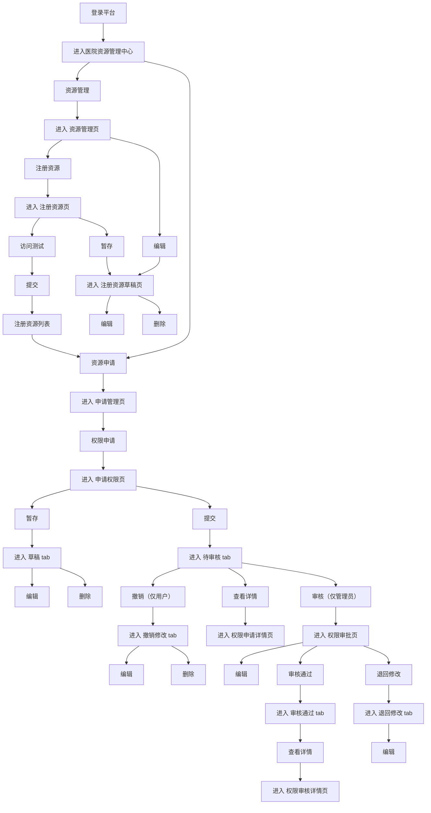

# 医院资源管理中心-需求说明文档

<aside>
🏥

本文档基于《医院资源中心功能清单及交互说明（更新版 v1）》整理，描述「医院资源管理中心」的页面结构、字段定义与交互逻辑，作为产品设计与开发的需求依据。

</aside>

## 一、文档概述

### 1.1 文档目的

医院资源管理中心面向医疗智能体管理平台，统一管理医院各业务系统资源的注册、对接与权限申请审批，确保智能体在受控、可审计的前提下访问院内资源。本文档明确各页面的字段口径、操作按钮及交互规则，供产品、研发、测试团队对齐实现。

### 1.2 功能架构

医院资源管理中心包含两大功能模块：

| 模块 | 子页面 | 核心职责 |
| --- | --- | --- |
| 一、资源管理 | 资源管理页、注册资源页、注册资源草稿页 | 维护院内资源台账，登记资源对接方式与负责人 |
| 二、资源申请 | 申请管理页、申请权限页、权限审批页、权限申请详情页 | 智能体对资源的权限申请、审批与全流程追踪 |

### 1.3 名词术语

| 缩写/术语 | 含义 |
| --- | --- |
| HL7 | 卫生信息交换标准（Health Level 7） |
| FHIR | 快速医疗互操作资源标准 |
| DICOM | 医学数字成像和通信标准 |
| MQ | 消息队列（Message Queue） |
| 对接方式 | 资源与平台之间的接入协议类型 |
| 智能体编号 | 科室编号-准入顺序号（如 XNK-0001） |

### 1.4 角色说明

本系统围继资源管理与权限申请，主要涉及以下角色：

| 角色 | 角色说明 | 核心职责 |
| --- | --- | --- |
| 平台管理员 | 负责资源中心资源维护与权限审批的管理人员 | 注册/编辑/删除资源；审核权限申请（审核通过/退回修改）；填写审核意见与具体说明；可编辑申请信息后重新提交审批 |
| 申请人（所有用户） | 智能体归属科室的业务人员或负责人，为智能体申请资源访问权限 | 发起权限申请、暂存草稿、提交申请、访问测试、撤销申请、修改并重新提交被退回的申请、查看申请详情 |

### 1.5 核心业务流程

核心业务流程覆盖「资源管理」与「资源申请」两条主线：管理员登记院内资源后，用户为智能体发起资源权限申请，经管理员审核通过后权限生效。整体流程如下图（参考上传流程图）：

---

## 二、资源管理

资源管理模块用于登记和维护院内可被智能体调用的系统资源，记录其对接方式、负责人与连通信息。

### 2.1 资源管理页（1.1）

资源列表页，展示全部已注册资源，并提供注册、编辑、删除入口。

**操作按钮与交互**

| 按钮 | 交互说明 |
| --- | --- |
| 注册资源 | 点击进入资源信息编辑（注册资源）页面 |
| 编辑 | 点击进入注册资源编辑页面 |
| 删除 | 点击弹出确认对话框，确认后删除该资源 |

**字段说明**

| 字段 | 说明 |
| --- | --- |
| 资源列表 | 取自注册资源页 |
| 资源负责人 | 取自注册资源页 |
| 联系方式 | 取自注册资源页 |
| 对接方式 | 取自注册资源页，HL7 / FHIR / DICOM / 数据库直连 / MQ 消息队列；不同接入方式动态展示对应子字段 |

**对接方式子字段（按所选协议动态展示）**

| 对接方式 | 子字段 | 取值/说明 |
| --- | --- | --- |
| ① HL7 协议 | HL7 版本 | v2.x / v3 |
|  | 协议类型 | MLLP / HTTP Gateway |
|  | IP 地址 | — |
|  | 端口号 | — |
| ② FHIR 协议 | 接口协议类型 | HTTP / HTTPS / gRPC / WebService |
|  | URL 地址 | — |
|  | 密钥 Key | — |
| ③ DICOM | DICOM 名称 | — |
|  | DICOM IP 地址 | — |
|  | DICOM 端口 | — |
| ④ 数据库直连 | 数据库类型 | MySQL / Oracle / SQLServer / PostgreSQL |
|  | IP 地址 | — |
|  | 端口 | — |
| ⑤ MQ 消息队列 | MQ 类型 | Kafka / RabbitMQ / RocketMQ / ActiveMQ |
|  | Broker 地址 | IP 或域名 |
|  | 端口 | — |
|  | 认证方式 | AK / SK（Access Key）/ SASL 认证（Kafka 常见） |

### 2.2 注册资源页（1.2）

用于新增/编辑资源注册信息，支持访问测试、提交与暂存。

**操作按钮与交互**

| 按钮 | 交互说明 |
| --- | --- |
| 访问测试 | 点击后显示测试中动画；测试通过显示绿色成功标识，失败显示错误提示（含错误代码和错误原因） |
| 提交 | 校验所有必填字段，校验通过后执行提交；校验失败给出气泡提示说明 |
| 暂存 | 资源注册记录自动暂存至「注册资源草稿页」 |

**字段说明**

| 字段 | 说明 |
| --- | --- |
| 资源列表 | 搜索选择，支持多选（见下方资源目录） |
| 资源负责人 | 必填；负责该资源管理的人员姓名；可从已有用户中选择或手动输入 |
| 联系方式 | 资源负责人的手机号码或座机号码 |
| 对接方式 | HL7 / FHIR / DICOM / 数据库直连 / MQ 消息队列；不同接入方式动态展示对应子字段（同 2.1 子字段定义） |

**资源列表可选目录（医院业务系统分类）**

**医院核心业务系统**：HIS（医院信息系统）、EMR（电子病历系统）、LIS（实验室信息系统）、PACS（医学影像存档与通信系统）、RIS（放射信息管理系统）、UIS（超声信息管理系统）、EIS（内镜信息管理系统）、PIS（病理信息管理系统）、BIS/BTMIS（输血管理信息系统）、ORIS/AIMS（手术麻醉信息系统）、CCIS/ICIS（重症监护信息系统）、CSSD（消毒供应中心管理系统）、HISM（院感监测管理系统）、传染病上报管理系统

**信息平台/集成**：CDR（临床数据中心）、ODR（运营数据中心）、EMPI（患者主索引系统）、EDW（医院数据仓库）、BI（医院 BI 决策分析系统）

**门诊业务系统**：ODS（门诊医生工作站）、门诊护士工作站、门诊预约挂号系统、QMS（门诊分诊叫号系统）、门诊收费系统、门诊药房管理系统、门诊输液管理系统、皮肤性病科管理系统、口腔科管理系统、眼科管理系统、耳鼻喉科管理系统

**急诊业务系统**：EIS（急诊信息系统）、急诊预检分诊系统、急诊留观管理系统、急诊抢救管理系统

**住院业务系统**：IDS（住院医生工作站）、住院护士工作站、住院收费管理系统、入出院管理系统、床位管理系统、膳食管理系统

**护理业务系统**：NEMR（护理电子病历系统）、移动护理系统、移动查房系统、护理质控管理系统、护理排班管理系统、压疮管理系统、跌倒管理系统、导管管理系统、疼痛管理系统

**医技系统**：核医学管理系统、心电信息管理系统（ECGEIS）、脑电信息管理系统、肺功能管理系统、胃肠动力检查系统、肌电图管理系统

**药事管理系统**：医院药品管理系统、智能药房系统、智能药柜系统、PIVAS（静脉用药调配中心系统）、处方审核系统、PASS（合理用药监测系统）、抗菌药物管理系统、麻精药品管理系统、ADR（药品不良反应监测系统）、药学门诊管理系统

**科研教学系统**：医院科研管理系统、医学论文管理系统、CTMS（临床试验管理系统）、生物样本库管理系统、医学教学管理系统、住院医师规范化培训系统、继续教育管理系统

### 2.3 注册资源草稿页（1.3）

存放暂存的资源注册记录，支持继续编辑或删除。字段口径与注册资源页一致。

**操作按钮与交互**

| 按钮 | 交互说明 |
| --- | --- |
| 编辑 | 点击进入注册资源编辑页面 |
| 删除 | 点击弹出确认对话框，确认后删除该资源 |

**字段说明**

| 字段 | 说明 |
| --- | --- |
| 资源列表 | 搜索选择，支持多选（同 2.2 资源目录） |
| 资源负责人 | 必填；负责该资源管理的人员姓名；可从已有用户中选择或手动输入 |
| 联系方式 | 资源负责人的手机号码或座机号码 |
| 对接方式 | HL7 / FHIR / DICOM / 数据库直连 / MQ 消息队列；不同接入方式动态展示对应子字段（同 2.1 子字段定义） |

---

## 三、资源申请

资源申请模块管理智能体对资源的权限申请，覆盖申请、审批、撤销、退回与归档的完整生命周期。

### 3.1 申请管理页（2.1）

以 Tab 形式管理不同状态的申请记录。申请状态包括：草稿 / 待审核 / 审核中 / 审核通过 / 退回修改 / 撤销修改。

**各 Tab 操作按钮与交互**

| Tab | 操作按钮 | 交互说明 |
| --- | --- | --- |
| 全部申请 | 权限申请 | 点击【权限申请】进入申请权限页面 |
| 草稿 | 编辑、删除 | 编辑：重新打开申请权限页面并回填已保存内容，可继续编辑提交；删除：二次确认「确认删除该草稿？」后从草稿列表移除 |
| 待审核 | 审核（管理员）、撤销（用户）、查看详情 | 审核：仅管理员可见，进入权限审批页可「审核通过/退回修改」并填写审核意见；撤销：仅申请人可见，确认后进入「撤销修改」Tab；查看详情：进入权限申请详情页（含完整申请信息+审批轨迹） |
| 审核中 | 撤销（用户）、查看详情 | 撤销：仅申请人可见，管理员已开始审核但未出结果前可撤销，审核完成后无法撤销；查看详情：进入权限申请详情页 |
| 撤销修改 | 编辑、删除 | 编辑：回填原内容修改后重新提交审核，提交后进入「待审核」Tab；删除：二次确认后永久删除该撤销记录 |
| 审核通过 | 查看详情 | 查看详情：进入权限申请详情页，展示完整申请信息、审核人、审核意见、生效资源权限明细；审核通过的资源权限自动同步至台账中心智能体详情页「已对接资源列表」Tab |
| 退回修改 | 查看详情、编辑 | 查看详情：查看退回原因及完整审核轨迹；编辑：按退回原因修改后重新提交进入「待审核」Tab；退回后超过 30 天未编辑提交，系统自动归档（不在列表展示，可在「全部申请」Tab 查询） |

**列表公共字段**

| 字段 | 说明 |
| --- | --- |
| 序号 | 系统自动生成，按申请提交时间倒序递增编号；支持翻页连续编号（1、2、3……） |
| 智能体编号 | 取自智能体注册表单自动生成的编号；科室编号-准入顺序号（如 XNK-0001） |
| 智能体名称 | 取自智能体注册表单；点击名称跳转「智能体详情页」；超出 10 字省略处理，悬浮展示完整名称 |
| 所属科室 | 取自智能体注册表单（科室代码+科室名称） |
| 诊疗环节 | 取自智能体注册表单选择项（导诊分诊/预问诊/预约挂号/辅助检查/辅助诊断/辅助治疗/住院/手术/其他（填空）） |
| 功能描述 | 取自智能体注册表单「功能描述」字段；超出 20 字省略号显示，悬浮展示完整内容 |
| 申请资源名称 | 取自申请人选择的资源；超出 15 字省略处理，悬浮展示完整名称 |

**各 Tab 特有字段**

| Tab | 特有字段 |
| --- | --- |
| 全部申请 | 申请状态：草稿/待审核/审核中/审核通过/退回修改/撤销修改 |
| 草稿 | 最后编辑时间（YYYY-MM-DD HH:MM:SS） |
| 待审核 | 提交审核时间（YYYY-MM-DD HH:MM:SS） |
| 审核中 | 提交审核时间（YYYY-MM-DD HH:MM:SS） |
| 撤销修改 | 撤销时间（YYYY-MM-DD HH:MM:SS） |
| 审核通过 | 具体说明（取自管理员通过意见/备注，超出 20 字省略，悬浮展示）、审核通过时间 |
| 退回修改 | 退回原因说明（取自管理员退回原因，超出 20 字省略，悬浮展示）、退回时间 |

### 3.2 申请权限页（2.2）

申请人发起资源权限申请的表单页。

**操作按钮与交互**

| 按钮 | 交互说明 |
| --- | --- |
| 暂存 | 校验必填字段，通过后保存当前填写的申请数据并保持在当前页面，供后续补充修改；可在「草稿」Tab 查看暂存记录 |
| 访问测试 | 发起对申请资源访问 IP 的连通性测试；通过显示绿色成功标识，失败显示错误提示（含错误代码和错误原因） |
| 提交 | 校验所有必填字段，提交成功后跳转「待审核页」，状态变为「待审核」 |

<aside>
⚠️

注：当出现越权访问时，平台将进行告警阻断。

</aside>

**字段说明**

| 字段 | 说明 |
| --- | --- |
| 智能体编号 | 取自智能体注册表单自动生成的编号；科室编号-准入顺序号（如 XNK-0001） |
| 智能体名称 | 取自智能体注册表单；点击名称跳转「智能体详情页」；超出 10 字省略处理，悬浮展示完整名称 |
| 所属科室 | 取自智能体注册表单（科室代码+科室名称） |
| 诊疗环节 | 取自智能体注册表单选择项（导诊分诊/预问诊/预约挂号/辅助检查/辅助诊断/辅助治疗/住院/手术/其他（填空）） |
| 功能描述 | 取自智能体注册表单「功能描述」字段；超出 20 字省略号显示，悬浮展示完整内容 |
| 申请资源名称 | 申请人从已注册资源列表中选择；超出 15 字省略处理，悬浮展示完整名称 |

### 3.3 权限审批页（2.3，仅管理员）

管理员对权限申请进行审批的页面，分为权限申请信息、审核结论、具体说明三部分。

**操作按钮与交互**

| 按钮 | 交互说明 |
| --- | --- |
| 编辑 | 可修改申请的部分信息；修改后需重新提交审批 |
| 审核通过 | 系统弹出确认提示框，确认后提交审批结果，更新权限状态 |
| 退回修改 | 系统带出备注输入框，填写退回原因，提交后将申请退回给用户修改完善 |

**3.3.1 权限申请信息**

| 字段 | 说明 |
| --- | --- |
| 智能体编号 | 取自智能体注册表单自动生成的编号；
科室编号-准入顺序号（如 XNK-0001） |
| 智能体名称 | 取自智能体注册表单；
点击名称跳转「智能体详情页」；
超出 10 字省略，悬浮展示完整名称 |
| 所属科室 | 取自智能体注册表单（科室代码+科室名称） |
| 诊疗环节 | 取自智能体注册表单选择项（导诊分诊/预问诊/预约挂号/辅助检查/辅助诊断/辅助治疗/住院/手术/其他（填空）） |
| 功能描述 | 取自智能体注册表单「功能描述」字段；
超出 20 字省略，悬浮展示完整内容 |
| 申请资源名称 | 取自申请人选择的资源；
超出 15 字省略，悬浮展示完整名称 |

**3.3.2 审核结论**

| 字段 | 说明 |
| --- | --- |
| 审核结论 | 管理员对本次权限申请的审核判定结果；单选项：审核通过 / 退回修改，必填；选择不同结论联动下方「具体说明」提示文案 |

**3.3.3 具体说明**

| 字段 | 说明 |
| --- | --- |
| 具体说明 | 管理员针对审核结论填写的详细意见、退回修改原因；多行文本输入框，字数限制 500 字并实时显示已输入字数；选择「退回修改」时必填，选择「审核通过」时选填；提交后同步至用户端「退回原因说明」或「具体说明」字段 |

### 3.4 权限申请详情页（2.4）

展示申请的完整信息与审批轨迹，供查看（只读）。

**操作按钮与交互**

| 按钮 | 交互说明 |
| --- | --- |
| 返回 | 点击后系统返回原上一级 Tab 页 |

**3.4.1 权限申请信息**

| 字段 | 说明 |
| --- | --- |
| 智能体编号 | 取自智能体注册表单自动生成的编号；科室编号-准入顺序号（如 XNK-0001） |
| 智能体名称 | 取自智能体注册表单；点击名称跳转「智能体详情页」；超出 10 字省略，悬浮展示完整名称 |
| 所属科室 | 取自智能体注册表单（科室代码+科室名称） |
| 诊疗环节 | 取自智能体注册表单选择项（导诊分诊/预问诊/预约挂号/辅助检查/辅助诊断/辅助治疗/住院/手术/其他（填空）） |
| 功能描述 | 取自智能体注册表单「功能描述」字段；超出 20 字省略，悬浮展示完整内容 |
| 申请资源名称 | 取自申请人选择的资源；超出 15 字省略，悬浮展示完整名称 |

**3.4.2 审核结论**

| 字段 | 说明 |
| --- | --- |
| 审核结论 | 管理员对本次权限申请的审核判定结果；单选项：审核通过 / 退回修改，必填；选择不同结论联动下方「具体说明」提示文案 |

**3.4.3 具体说明**

| 字段 | 说明 |
| --- | --- |
| 具体说明 | 管理员针对审核结论填写的详细意见、退回修改原因；多行文本输入框，字数限制 500 字并实时显示已输入字数；选择「退回修改」时必填，选择「审核通过」时选填；提交后同步至用户端「退回原因说明」或「具体说明」字段 |

---

## 四、关键业务规则汇总

- **对接方式动态表单**：选择不同对接协议（HL7/FHIR/DICOM/数据库直连/MQ）时，动态展示对应的连通配置子字段。
- **草稿与暂存**：资源注册与权限申请均支持暂存为草稿，便于后续补充提交。
- **访问测试**：资源注册与权限申请提交前均可发起连通性/访问测试，实时反馈成功或错误信息。
- **状态流转**：权限申请在 草稿 → 待审核 → 审核中 → 审核通过/退回修改 之间流转，用户可在审核出结果前撤销。
- **自动归档**：退回修改后超过 30 天未重新提交，系统自动归档，仅可在「全部申请」Tab 查询。
- **权限同步**：审核通过的资源权限自动同步至台账中心智能体详情页「已对接资源列表」Tab。
- **安全管控**：出现越权访问时，平台进行告警阻断。