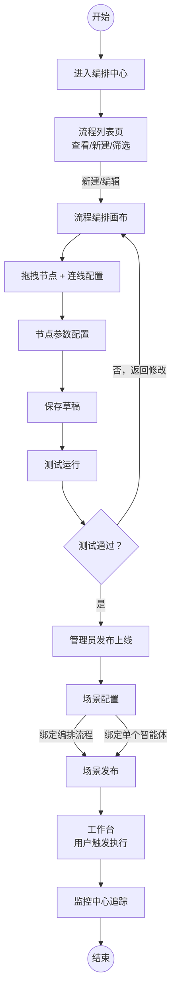
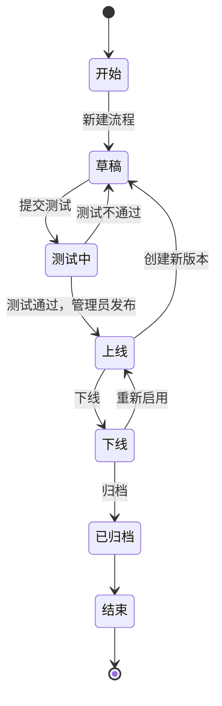

# 智能体流程编排中心——需求说明文档

## 模块介绍

### 1.1 业务背景与痛点

医院已陆续接入多个医疗 AI 智能体（导诊、问诊、影像、诊断、用药等），但在实际使用中面临三大问题：

1. **各自为战**：智能体彼此独立，没有打通的协同链路。
2. **人工串联效率低**：医生需要在多个系统间手动切换、复制结果，耗时且易出错。
3. **流程难标准化**：不同科室、不同就诊类型缺乏可复用的标准诊疗路径。

### 1.2 模块目标与价值

**编排协同中心** 通过一张可视化画布，把已注册的智能体按诊疗流程串联成自动化协同链路，让医生一次点击就能跑通完整流程。

- **统一编排**：拖拽连线即可把多个智能体编排成完整流程，无需编码。
- **灵活适配**：支持条件分支、并行等编排逻辑，覆盖不同科室、不同就诊类型的差异化路径。
- **本期交付**：交付一个**流程清晰、功能闭环**的 Demo 版本，面向客户和管理层直观演示「智能体如何被编排成自动化诊疗链路」的核心能力。

---

## 核心业务流程

| **流程** | **路径** | **关键节点** |
| --- | --- | --- |
| 编排主流程 | 新建 → 画布编排 → 节点配置 → 测试 → 管理员发布 | 无需审批，管理员测试通过后直接发布上线 |
| 场景绑定 | 场景配置 → 绑定单个智能体或编排流程 → 场景发布 → 工作台可用 | 场景入口可绑定单个智能体（无需编排流程）或编排流程，发布后用户即可在工作台触发使用 |
| 运行监控 | 执行 → 链路追踪 → 异常告警 → 监控中心 | 每次执行自动上报数据至监控中心 |

---

### 模块功能说明

| **一级功能** | **二级功能** | **功能说明** | 角色 |
| --- | --- | --- | --- |
| 流程管理 | 流程新建与编辑 | 通过可视化画布新建编排流程，拖拽 6 类节点并连线配置协同链路 | 平台管理员 |
| 流程管理 | 流程列表与筛选 | 查看全部编排流程，支持按状态、名称搜索筛选 | 平台管理员 |
| 画布编排 | 节点体系（6 类节点） | 对标毕昇 Workflow，采用最简 6 类节点（开始 / 输入 / 输出 / Agent / 条件分支 / 结束）覆盖流程入口、人机交互、智能体调度、条件分流、流程出口，实现完整闭环 | 平台管理员 |
| 画布编排 | 节点拖拽与连线 | 左侧面板 6 类节点按 3 大分类（流程控制/智能体调度/人机交互）拖入画布，通过端口连线定义执行路径 | 平台管理员 |
| 画布编排 | 节点参数配置 | 直接在画布节点卡片上展开配置节点参数、超时策略、异常处理、输入输出映射；节点默认展开显示全部配置项，支持收起；节点右上角提供运行此节点、复制、删除操作 | 平台管理员 |
| 画布编排 | 实时校验 | 连线类型校验、必填参数校验、孤立节点检测 | 平台管理员 |
| 场景配置 | 诊疗场景管理 | 按就诊类型 + 阶段配置诊疗场景，绑定**单个智能体**或**编排流程**作为场景入口，发布上线至工作台供用户使用 | 平台管理员（配置）／临床用户（工作台使用） |
| 场景配置 | 场景模板 | 预置医疗场景模板，一键创建 | 平台管理员 |
| 流程调试 | 模拟运行 | 在测试环境模拟运行流程，查看执行结果 | 平台管理员 |
| 流程调试 | 执行日志与报告 | 查看每个节点的执行结果、耗时、输入输出数据 | 平台管理员 |
| 版本管理 | 版本快照与回滚 | 每次发布自动生成版本号（v1.0 / v1.1 / v2.0 …），支持查看任意历史版本的画布快照、版本间差异对比、一键回滚到指定版本 | 平台管理员 |
| 发布上线 | 状态流转与生命周期 | 流程在草稿 / 测试中 / 上线 / 下线 / 已归档之间流转；管理员测试通过后直接发布上线，上线流程自动同步至工作台供用户触发 | 平台管理员 |

---

## 核心页面清单

| **编号** | **页面名称** | **功能概述** | 角色 |
| --- | --- | --- | --- |
| P1 | 流程列表页 | 已配置的编排流程列表，支持新建、搜索、状态筛选、版本管理 | 平台管理员 |
| P2 | 流程编排画布 | 核心页面：可视化拖拽编排，6 类节点，连线配置，实时校验 | 平台管理员 |
| P3 | 节点卡片配置区 | 画布中节点卡片内嵌的配置区域，直接在节点上配置参数、超时、异常处理等；默认展开，支持收起 | 平台管理员 |
| P4 | 场景配置页 | 配置诊疗场景（就诊类型 + 阶段 + 绑定单个智能体或编排流程），场景发布至工作台 | 平台管理员（配置）／临床用户（工作台使用） |
| P5 | 流程测试/调试 | 流程模拟运行，执行日志查看 | 平台管理员 |
| P6 | 工作台对话窗口 | 临床用户端运行界面：场景入口启动后展示对话流（开场白/AI 输出/表单/选项按钮等），按节点逐步推进 | 临床用户 |

---

## 流程列表页 — 字段与交互

### 页面概述

| 属性 | 说明 |
| --- | --- |
| 页面类型 | 列表页 |
| 使用角色 | 平台管理员 |
| 入口 | 侧边栏「编排中心 > 流程管理」 |

### 页面布局

页面整体采用**顶部操作栏 + 中部筛选区 + 底部列表区**三段式布局，参考毕昇 Workflow 技能列表页设计。

### 列表字段

| **字段名** | **字段类型** | **说明** | **排序** |
| --- | --- | --- | --- |
| 流程名称 | 文本+链接 | 点击进入流程编排画布 | 支持 |
| 流程描述 | 文本 | 流程用途简要说明，超长截断显示 | — |
| 状态 | 标签 | 草稿（灰）/ 测试中（蓝）/ 上线（绿）/ 下线（红）/ 已归档（灰） | 支持 |
| 当前版本 | 文本 | 当前发布版本号（如 v1.2），草稿态显示「—」 | — |
| 适用科室 | 标签组 | 流程绑定的科室标签，支持多科室 | — |
| 节点数 | 数字 | 流程包含的节点总数 | 支持 |
| 创建人 | 用户 | 流程创建者姓名 | — |
| 最近编辑时间 | 日期时间 | 最近一次保存/发布时间 | 支持（默认） |
| 操作 | 按钮组 | 编辑 / 复制 / 上线 / 下线 / 归档 / 删除（按状态动态显示可用操作） | — |

### 筛选与搜索

| **筛选项** | **控件类型** | **说明** |
| --- | --- | --- |
| 关键词搜索 | 搜索框 | 按流程名称、描述模糊搜索，输入即搜 |
| 状态筛选 | 下拉多选 | 草稿 / 测试中 / 上线 / 下线 / 已归档，支持多选 |
| 科室筛选 | 下拉多选 | 按适用科室筛选，选项来自平台科室配置 |
| 创建人筛选 | 用户选择 | 按创建人筛选 |
| 时间范围 | 日期范围 | 按最近编辑时间范围筛选 |

### 页面交互说明

| **交互场景** | **说明** |
| --- | --- |
| 新建流程 | 点击右上角「新建流程」按钮，弹出新建弹窗（输入流程名称、描述、适用科室），确认后进入空白画布 |
| 从模板创建 | 新建弹窗中可选择「从模板创建」Tab，展示预置诊疗场景模板卡片列表，选择后自动加载模板画布 |
| 复制流程 | 操作列点击「复制」，生成副本（名称追加「-副本」），状态为草稿 |
| 删除流程 | 仅草稿/已归档状态可删除；上线/测试中状态需先下线再归档；删除前二次确认 |
| 批量操作 | 列表支持复选框多选，顶部出现批量操作栏（批量归档、批量删除） |
| 空状态 | 无流程时显示引导图+「新建第一个编排流程」按钮+「浏览模板库」链接 |
| 分页 | 底部分页器，默认每页 20 条，支持切换 10/20/50/100 |

---

## 节点配置 — 字段与交互

### 配置概述

| 属性 | 说明 |
| --- | --- |
| 配置方式 | 画布节点卡片内嵌配置区（非右侧抽屉面板），参数直接在节点卡片上编辑 |
| 使用角色 | 平台管理员 |
| 默认状态 | 节点拖入画布后默认**展开**显示全部配置项，支持点击**收起**仅显示节点名称和配置摘要 |
| 节点右上角操作 | 每个节点右上角提供三个操作按钮：**▶ 运行此节点**（单独调试该节点）、**📋 复制**、**🗑 删除** |

### 节点体系总览（ 6 类）

<aside>

 **设计原则**：对标毕昇 Workflow 节点体系，采用最简 6 类节点实现完整流程闭环。不设节点分类层级，所有节点平铺展示。面向运维人员以及无需编码能力的用户。

</aside>

| **序号** | **节点名称** | **职责** | **毕昇对标** |
| --- | --- | --- | --- |
| 1 | 开始节点 | 流程入口，定义开场白、引导问题、全局变量。自动拖出，不可删除 | 开始节点 |
| 2 | 输入节点 | 流程中暂停等待用户输入（文本/选择/文件），实现 Human-in-the-Loop | 输入节点 |
| 3 | 输出节点 | 向用户展示中间或最终处理结果，支持变量插值和格式化展示 | 输出节点 |
| 4 | Agent 节点 | 从台账选择已注册智能体并调用，配置输入/输出映射和异常容错 | 助手节点 |
| 5 | 条件分支节点 | 根据条件表达式将流程分流到不同分支 | 条件分支节点 |
| 6 | 结束节点 | 流程出口，标识工作流线程结束（对标毕昇，极简设计仅保留节点名称） | 结束节点 |

### 变量系统

> **参考毕昇定义了变量概念但仅停留在「点击 (x) 按钮在弹出列表中选择变量」的交互层面，没有显式的变量引用语法**。本平台在毕昇基础上明确变量分层、命名规范与引用语法，方便 Demo 落地与运维人员理解。
> 

#### 变量分类

| **变量类型** | **作用域** | **说明 / 示例** |
| --- | --- | --- |
| 系统全局变量 | 整个流程 | 平台自动注入，所有节点均可引用。如 `current_time`、`chat_history`、`user_id`、`flow_id`、`session_id` |
| 节点输出变量 | 所属节点之后的下游节点 | 每个节点执行完成后产出的变量，命名空间为 `{节点ID}.{字段名}`。如输入节点的 `user_input`、Agent 节点输出映射定义的 `diagnosis_result` |
| 用户自定义变量 | 整个流程 | 在输入节点表单项或 Agent 节点输出映射中由用户自行命名的变量（如 `chief_complaint`） |

#### 引用语法

| **场景** | **语法** |
| --- | --- |
| 富文本/Markdown 模板插值（开场白、输出节点内容模板、Agent 请求头等） | `{变量名}` 或在编辑器中输入 `{` 触发变量选择器下拉 |
| 条件分支节点·条件比较值 | 「变量来源」切换为「引用变量」→ 二级下拉展开变量树选择 |
| Agent 节点·输入映射 | 映射表格中「映射来源」选「上游变量」→ 下拉选择具体变量 |
| 调试/工作台输入变量表单 | 变量名 + 类型自动渲染对应输入控件 |

#### 变量选择器交互

> 对标毕昇「点击 (x) 按钮在弹出的变量列表中选择可用的全局变量」。
> 
- 任何支持变量引用的输入框右侧自动展示 `{x}` 按钮
- 点击后弹出变量树面板，按「系统变量 / 开始节点 / 输入节点-A / Agent 节点-B / …」分组展示
- 每个变量项展示：**变量名** + **数据类型** + **来源节点** + **示例值预览**
- 支持搜索、收藏常用变量

#### 命名规范

- 变量名仅允许小写字母、数字、下划线，且必须以字母开头，长度 ≤ 50（正则：`^[a-z][a-z0-9_]{0,49}$`）
- 系统保留变量名：`current_time`、`chat_history`、`user_input`、`dialog_files_content`、`dialog_image_files`、`output_result`、`batch_variable`、`user_question`、`retrieved_result`，用户自定义变量不可与之同名
- 同一流程内变量名不可重复，命名冲突时编辑器实时校验报错

---

### 4.1 开始节点

> 工作流运行的起始节点（创建工作流时会自动拖出，无法复制和删除）。对标毕昇「开始节点」，仅承担流程入口和全局上下文注入两项职责。MVP 版本仅支持手动触发模式（工作台对话式交互启动）。
> 

**配置字段明细**

| **字段名** | **字段类型** | **必填** | **说明 / 取值范围** | **默认值** |
| --- | --- | --- | --- | --- |
| 节点名称 | 文本 | 是 | ≤ 30 字。创建流程时自动生成，不可复制和删除 | 「开始」 |
| 开场白 | 富文本 | 否 | 流程运行开始时自动发送的首条消息，支持 Markdown 格式。在工作台对话窗口中展示，向操作人员说明流程用途。如「您好，我是您的智能诊疗助手——」 | — |
| 引导问题 | 动态列表 | 否 | 在工作台对话窗口左下角展示若干引导问题按钮，引导用户快速输入。每项 ≤ 50 字，最多 6 项，支持拖拽排序 | — |
| **全局变量**（系统自动注入，所有下游节点均可引用） |  |  |  |  |
| ├ 当前时间 | 系统变量 | —（自动） | 流程启动时自动获取，格式 `yyyy-MM-dd HH:mm`。变量名：`current_time` | 自动注入 |
| ├ 最近 N 条聊天记录 | 系统变量 | —（自动） | 记录工作台对话页面中应用与用户的最新聊天记录，可自定义条数 N（1–50）。变量名：`chat_history` | N=10 |

**交互要点**：

- 创建流程时开始节点自动拖出到画布，不可复制和删除
- 开场白编辑器支持 Markdown 实时预览
- 引导问题为可增删的卡片列表，支持拖拽排序
- 全局变量区域显示系统自动注入的变量，各变量带复制变量名按钮供下游节点快速引用
- 节点卡片底部可展开预览区，实时预览工作台对话窗口效果（开场白 + 引导问题 + 输入框）
- 开始节点右上角仅显示「▶ 运行此节点」操作，不可复制和删除
- 成环防护、最大执行次数等引擎级参数在**流程执行引擎 → 系统设置**中统一配置，节点层不暴露

---

### 4.2 输入节点

> 流程执行中暂停，等待用户在工作台对话窗口中输入数据后继续。对标毕昇「输入节点」，支持**对话框输入**和**表单输入**两种方式，实现流程中的 Human-in-the-Loop 交互。
> 

**配置字段明细**

| **字段名** | **字段类型** | **必填** | **说明 / 取值范围** | **默认值** |
| --- | --- | --- | --- | --- |
| 节点名称 | 文本 | 是 | 用户自定义节点显示名称，≤ 30 字 | 「输入」 |
| 输入方式 | 单选 | 是 | 对标毕昇输入节点的两种核心模式：
① **对话框输入**：在工作台对话窗口中接收用户输入（文本/文件/图片），无需配置具体字段，系统自动写入预定义变量
② **表单输入**：弹出表单收集结构化数据，需配置若干表单项 | 对话框输入 |
| **【对话框输入模式】无需任何额外配置** |  |  |  |  |
| ├ user_input | 系统变量 | —（自动） | 用户在对话框输入的文本内容自动写入此变量，供下游节点引用 | 自动注入 |
| ├ dialog_files_content | 系统变量 | —（自动） | 用户在对话框上传的文件（非图片）自动写入此变量 | 自动注入 |
| ├ dialog_image_files | 系统变量 | —（自动） | 用户在对话框上传的图片自动写入此变量 | 自动注入 |
| **【表单输入模式】表单项配置** |  |  |  |  |
| ├ 表单项列表 | 动态列表 | 是 | 可添加多个表单项，支持**拖拽排序**。每个表单项包含以下配置：
① **类型**：文本表单 / 下拉表单 / 文件上传表单
② **显示名称**：在工作台表单中展示的标签文本（≤ 30 字）
③ **变量名**：表单值保存为流程变量的变量名（如 `chief_complaint`），供下游节点引用
④ **是否必填**：开关，开启时该表单项不可跳过
⑤ **类型专属配置**：
  • 文本表单：无额外配置
  • 下拉表单：选项列表（每项 ≤ 30 字，最多 20 项）+ 选择模式（单选/多选）
  • 文件上传表单：允许的文件类型（图片/PDF/Word/Excel/CSV/DICOM） | — |

**交互要点**：

- **对话框输入模式**：节点卡片上仅显示模式选择，无其他配置项；流程执行到此节点时，对话窗口自动激活输入框，用户输入或上传文件后自动写入对应系统变量
- **表单输入模式**：节点卡片上展示表单项编辑器，每个表单项是一张可拖拽排序的卡片；流程执行到此节点时，对话窗口中弹出表单，用户填写并提交后，各表单项值写入对应变量
- 节点卡片显示：输入方式图标 + 表单项数量（表单模式）
- 文件大小限制、超时等技术参数由**平台系统配置**统一管控，节点层不重复暴露

---

### 4.3 输出节点

> 在流程执行过程中向用户展示中间或最终处理结果。对标毕昇「输出节点」，支持变量插值和 Markdown 格式化展示，结果在工作台对话窗口中以消息形式呈现。
> 

**配置字段明细（MVP）**

| **字段名** | **字段类型** | **必填** | **说明 / 取值范围** | **默认值** |
| --- | --- | --- | --- | --- |
| 节点名称 | 文本 | 是 | 用户自定义节点显示名称，≤ 30 字 | 「输出」 |
| 输出内容模板 | 富文本 | 是 | 展示给用户的输出内容模板，支持 Markdown 格式和变量插值。通过 `{变量名}` 引用上游节点输出。如「## 诊断结果n患者：{patientName}n诊断：{diagnosis}n建议用药：{medication}」 | — |
| 输出变量选择 | 变量多选 | 否 | 从上游节点输出变量中选择需要展示的变量。选中后自动插入到输出内容模板中。也可手动在模板中用 `{` 触发变量选择 | — |
| 展示方式 | 单选 | 是 | ① **消息气泡**：在对话窗口中以 AI 消息气泡形式展示 ② **卡片面板**：以结构化卡片形式展示（适合表格/列表数据）③ **流式输出**：逐字流式展示（适合长文本生成结果） | 消息气泡 |
| 交互模式 | 单选 | 是 | ① **无交互**：仅输出消息内容，展示后立即继续流程 ② **确认继续**：展示输出内容后等待用户点击「确认」再继续 ③ **选择型交互**：输出内容后展示若干选项按钮，用户选择后走对应分支（每个选项右侧自动展示输出端口，连接到不同后续节点），可直接实现路由分流，无需额外条件分支节点 ④ **输入型交互**：输出内容后展示文本编辑框，用户可修改/补充后提交 | 无交互 |
| 选项列表 | 动态列表 | 条件必填 | 当交互模式=选择型交互时出现。每项为一条选项文本（≤ 30 字），最多 10 项。每个选项右侧自动展示一个输出端口，可连线到不同的下游节点，实现直接分支路由 | — |
| 编辑框预填内容 | 富文本 | 否 | 当交互模式=输入型交互时出现。编辑框的预填内容，支持引用上游变量，用户可在此基础上修改后提交 | — |
| 交互输出变量名 | 文本 | 条件必填 | 当交互模式=选择型/输入型交互时。用户交互结果保存为流程变量的变量名，供下游节点引用 | output_result |

**交互要点**：

- 流程执行到此节点时，自动在工作台对话窗口中展示格式化后的输出内容
- 输出内容编辑器支持 Markdown 实时预览和 `{` 触发变量插值
- 可在流程中放置多个输出节点，用于展示不同阶段的中间结果
- **选择型交互**（对标毕昇输出节点）：每个选项自动展示独立输出端口，可直接连线到不同分支节点，无需额外条件分支节点即可实现路由分流
- **输入型交互**：用户提交的内容存储在交互输出变量中，供后续节点引用
- 节点卡片显示输出模板摘要（前 30 字）+ 交互模式标签

---

### 4.4 Agent 节点

> **画布核心节点**。从台账中心选择**已注册接入并封装好的**智能体并调用。对标毕昇「助手节点」，但本平台 Agent 在接入时已完成模型、提示词、知识库、工具等内部配置的封装，因此本节点**不再暴露这些内部参数**，只关注「选哪个 Agent + 怎么传参 + 怎么收结果」三件事，保持配置面板的清爽。
> 

<aside>
💡

**为什么没按照毕昇助手节点，增加「模型/温度/提示词/知识库/数据库/工具」等字段？**

毕昇助手节点面向的是「**在画布上现场组装一个 Agent**」的场景，因此需要把大模型选型、温度、System Prompt、知识库挂载、工具列表等内部配置全部暴露在节点参数中。

而本平台的设计前提是 **Agent 在「接入中心」就已经完成封装注册**——每个 Agent 进入台账时，其所使用的**模型、温度、系统/用户提示词、绑定知识库、可调用工具、历史上下文策略**等全部已固化在 Agent 内部，作为一个标准化的黑盒接口对外提供服务。

因此本节点的职责是「**调度一个已经准备好的 Agent**」，而不是「**从零组装一个 Agent**」。基于此：

- ❌ **模型 / 温度**：已在 Agent 注册时配置好，不应在编排层覆盖（如需切换模型，应在台账中心更新 Agent 版本）。
- ❌ **系统提示词 / 用户提示词**：Agent 内部 prompt 已固化，编排层无需也不应该再次配置 prompt，避免破坏 Agent 行为一致性。
- ❌ **知识库 / 数据库 / 工具**：Agent 调用哪些资源属于 Agent 内部实现细节，由接入中心负责，编排层只关心输入输出契约。
- ❌ **历史记录开关**：上下文策略由 Agent 自身决定，避免不同节点配置不一致导致 Agent 行为漂移。
- ✅ **新增 智能体选择 / 版本 / 输入输出映射**：用于对接已封装 Agent 的标准化接口契约。
- ✅ **保留 结果实时展示开关 / 批量运行模式**：对标毕昇核心交互能力，业务层确实需要。
</aside>

**智能体接口契约（Agent Schema）**

> 毕昇助手节点采用「现场组装」模式——模型/prompt/工具直接在节点内配置，**没有显式的接口契约定义**。本平台把 Agent 当作黑盒服务调度，因此必须为「输入映射 / 输出映射」字段提供契约依据。**Agent Schema 由台账中心在智能体注册时维护，编排层只读引用**，是毕昇之上必须补齐的能力。
> 

| **契约字段** | **类型** | **说明** |
| --- | --- | --- |
| agent_id | string | 智能体唯一标识，对应台账中心 ID |
| agent_name | string | 智能体展示名称 |
| version | string | 当前版本号，如 `v1.2` |
| input_schema | JSON Schema | 输入参数定义，每项包含：参数名 / 类型（string/number/boolean/object/array/file）/ 必填 / 默认值 / 取值范围 / 描述 / 示例值 |
| output_schema | JSON Schema | 输出字段定义，每项包含：字段名 / 类型 / 描述 / 示例值。流式输出字段附 `streaming: true` 标识 |
| error_codes | 数组 | 该智能体可能返回的错误码列表（错误码 + 含义 + 是否可重试） |
| timeout_recommend | number | 智能体侧建议的超时时间（秒），用于编排层默认值填充 |
- **输入映射表**「智能体参数名」列下拉项 ← 直接读取 `input_schema`
- **输出映射表**「智能体返回字段名」列下拉项 ← 直接读取 `output_schema`
- 选择智能体后，编排画布通过台账中心接口 `GET /agents/{agent_id}/schema?version=` 拉取本契约 JSON，自动填充映射表
- 契约版本与智能体版本绑定；切换版本时映射表自动重新加载，已有映射保留可复用字段，缺失字段标红提示

**配置字段明细**

| **字段名** | **字段类型** | **必填** | **说明 / 取值范围** | **默认值** |
| --- | --- | --- | --- | --- |
| 节点名称 | 文本 | 是 | ≤ 30 字 | 「智能体调用」 |
| 智能体选择 | 搜索下拉 | 是 | 数据源为台账中心已注册且状态为「已上线」的智能体列表。下拉项展示：智能体名称 + 类型标签 + 所属科室 + 当前版本号 + 在线状态指示灯。支持按名称/类型/科室搜索筛选 | — |
| 智能体版本 | 下拉选择 | 是 | 选择智能体后自动加载该智能体的可用版本列表。选项：latest（始终使用最新版）或指定版本号 | latest |
| 调用方式 | 单选 | 是 | ① **同步调用**：等待智能体返回结果后继续流程 ② **异步调用**：发起请求后立即继续，结果通过回调接收（需配合等待事件节点或结果汇聚节点） | 同步调用 |
| 结果实时展示 | 开关 | 是 | 开启后，智能体返回的结果将实时展示在工作台对话窗口中（支持流式输出），同时存储在输出变量中供下游引用；关闭后仅存储在变量中，不在对话窗口展示。适用于需要向用户透明展示 AI 处理过程的场景。对标毕昇助手节点「将输出结果展示在会话中」开关 | 开启 |
| 输入映射 | 映射表格 | 是 | 将上游节点输出变量映射到智能体输入参数。每行：智能体参数名（自动从接口协议加载）→ 映射来源（上游变量 / 常量 / 表达式）。选择智能体后自动加载其输入参数列表，必填参数标红 | — |
| 输出映射 | 映射表格 | 是 | 将智能体返回字段映射为本节点输出变量。每行：智能体返回字段名 → 输出变量名（自定义）→ 数据类型。选择智能体后自动加载其输出字段列表 | — |
| 超时时间 | 数字（秒） | 是 | 单次调用最大等待时间。范围：1–600 秒 | 30 |
| 重试次数 | 数字 | 是 | 调用失败后自动重试次数。范围：0–5 | 2 |
| 重试间隔 | 数字（秒） | 条件必填 | 当重试次数 > 0 时。范围：1–60 秒 | 5 |
| 失败处理策略 | 单选 | 是 | 所有重试耗尽后的处理：① **跳过继续**：记录失败，继续后续节点 ② **走降级分支**：进入预设的备用流程 ③ **终止流程**：中断流程并告警 | 终止流程 |
| 降级分支 | 连线选择 | 条件必填 | 当策略=走降级分支时。从节点的「降级」输出端口连线到降级处理节点 | — |
| 请求头附加 | 键值对表格 | 否 | 附加到 API 请求头的自定义字段（如 X-Trace-Id、X-Department 等），支持变量插值 | — |

**交互要点**：智能体选择器按科室分组、带搜索和状态指示灯；选择后自动加载接口协议填充输入/输出映射表；节点卡片显示智能体名称+版本+状态灯，右侧有「正常」和「降级」两个输出端口。

### 4.5 条件分支节点

1. 依次判断每个分支的条件是否满足，如果满足则会执行该分支的后续逻辑。
2. 每个分支支持添加多个条件，当有多个条件时，只能进行同时 `and` 或 同时 `or`运算。

| **项目** | **说明** |
| --- | --- |
| 功能说明 | 1. 依次判断每个分支的条件是否满足，如果满足则会执行该分支的后续逻辑。
2. 每个分支支持添加多个条件，当有多个条件时，只能进行同时 and 或 同时 or 运算。 |
| 配置说明 | 1. **添加分支：** 节点包含 if 和 else 两个分支，点击"添加分支"按钮，可以新增"if-else"分支。
2. **添加条件：** 每个条件由以下三部分组成
　a. **选择变量：** 通过下拉框选择全局变量。
　b. **选择条件：** 可以选择的条件类型包括：等于、不等于、包含、不包含、为空、不为空、开始为、结束为、>、<、≥、≤、正则。
　c. **比较值：** 用于与选择变量进行比较。
　　i. 当条件为"正则"时，比较值为正则表达式。
　　ii. 在配置比较值时，需要明确选择**变量来源**，变量来源有两种选择方式：**输入值**和**引用变量**。 |

**交互要点**：分支为可增删卡片，条件构建器自动识别上游变量并按类型切换输入控件；支持医疗模板快速填充；else 默认分支始终置底不可删除。

### 4.6 结束节点

> 流程出口，标识工作流线程结束。**对标毕昇「结束节点」极简设计**——毕昇官方说明为「无需配置」，本平台仅保留节点名称一项最基础字段；原有的执行状态判定、结果汇总、自动归档、通知推送等能力全部下沉至平台层（监控中心、流程执行引擎），保持节点配置面板的清爽。
> 

**配置字段明细**

| **项目** | **说明** |
| --- | --- |
| 功能说明 | 表示工作流的结束，执行到此节点将会结束工作流线程。 |
| 配置说明 | 无需配置，但编排节点时注意：除结束节点外，其余节点的右侧触点必须连接到到下一个节点。 |

**交互要点**：

- 节点卡片上仅展示一个节点名称输入框
- 仅有输入端口，无输出端口；流程执行到此节点即终止
- 一个流程可以有多个结束节点（对应不同结束分支），仅需以节点名称区分

## 流程编排画布 — 字段与交互

### 页面概述

| 属性 | 说明 |
| --- | --- |
| 页面类型 | 可视化编排画布 |
| 使用角色 | 平台管理员 |
| 入口 | 流程列表页点击「新建」或选择已有流程「编辑」 |

### 画布基础交互

| **交互功能** | **说明** |
| --- | --- |
| 拖拽添加节点 | 左侧节点面板平铺展示 6 类节点（开始/输入/输出/Agent/条件分支/结束），拖拽至画布即可添加 |
| 连线 | 从节点输出端口拖拽至下一节点输入端口，自动创建连线；连线支持标注条件/分支名称 |
| 画布操作 | 缩放（滚轮/+- 按钮）、平移（空格+拖拽）、适应画布、网格对齐、小地图导航 |
| 节点操作 | 选中、多选（框选/Ctrl+点击）、撤销/重做、对齐、分组；每个节点右上角提供操作按钮：▶ 运行此节点、📋 复制、🗑 删除 |
| 节点内嵌配置 | 参数配置直接在画布节点卡片上完成（非右侧抽屉面板）；节点默认展开显示全部配置项，可点击收起仅显示摘要；支持参数校验和实时预览 |
| 实时校验 | 连线类型校验（输出类型与输入类型匹配）、必填参数校验、循环检测、孤立节点检测 |
| 快捷键 | Ctrl+S 保存、Ctrl+Z 撤销、Ctrl+Y 重做、Delete 删除、Ctrl+D 复制 |

### 节点视觉规范

| **节点分类** | **主色** | **图标样式** | **节点卡片内容** |
| --- | --- | --- | --- |
| 开始 / 结束 | 灰色 | 圆角矩形（圆形端点） | 节点名称 + 配置摘要 |
| 输入 / 输出 | 蓝色 | 圆角矩形 + 交互标识 | 节点名称 + 输入类型/输出模板摘要 |
| Agent 节点 | 绿色 | 圆角矩形 + AI 标识 | 节点名称 + 智能体名称 + 版本号 + 状态指示灯 |
| 条件分支 | 橙色 | 菱形/圆角矩形 | 节点名称 + 分支数量 + 判断模式 |

---

## 版本管理页 — 字段与交互

### 页面概述

| 属性 | 说明 |
| --- | --- |
| 页面类型 | 列表 + 详情页 |
| 使用角色 | 平台管理员 |
| 入口 | 流程编排画布顶部「版本管理」按钮 |

### 流程状态机

### 版本管理要求

- 每次发布自动生成版本号（v1.0、v1.1、v2.0 等）
- 支持查看任意历史版本的画布快照
- 支持版本间差异对比（高亮新增/修改/删除的节点和连线）
- 支持一键回滚到指定历史版本
- 当前运行中的流程实例使用发布时的版本，新实例使用最新版本

### 归档定义与操作

<aside>

**归档** = 将不再使用的流程从「下线」状态进一步沉淀为「只读历史档案」。归档后流程从工作台彻底不可见，但版本快照与执行记录完整保留，用于医疗合规审计与历史复盘。

</aside>

| **维度** | **说明** |
| --- | --- |
| 触发条件 | 仅「下线」状态的流程可执行归档操作；上线中流程必须先下线方可归档 |
| 归档操作 | 列表页操作列点击「归档」按钮 → 二次确认弹窗（提示「归档后流程不可再被启用，仅保留只读历史，是否继续？」）→ 状态变为「已归档」 |
| 归档后影响 | ① 流程不再出现在工作台 ② 不可再被场景配置绑定 ③ 不可恢复至上线/下线状态（仅可复制为新草稿或永久删除）④ 历史版本快照、执行记录、测试报告全部保留为只读 |
| 可执行操作 | 查看历史版本快照 / 查看执行记录与测试报告 / 复制为新流程（生成草稿副本，状态重置为草稿） / 永久删除（移入回收站） |
| 保留期限 | 归档流程配置默认永久保留；关联执行记录按平台统一策略留存（默认 180 天，可在监控中心系统设置中调整） |
| 合规价值 | 满足《医疗人工智能管理办法》对 AI 辅助诊疗历史版本可追溯的要求，作为医院侧 AI 应用退役留痕的合规凭证 |

---

## 流程测试/调试 — 字段与交互

### 页面概述

| 属性 | 说明 |
| --- | --- |
| 页面类型 | 画布右侧调试弹窗（对标毕昇「点击运行 → 右侧弹窗调试」交互） |
| 使用角色 | 平台管理员 |
| 入口 | 流程编排画布顶部工具栏「运行」按钮 |

<aside>
💡

**对标毕昇调试体系，删除哪些过度设计？**

毕昇官方调试说明仅一句话：「点击【运行】按钮，可在右侧弹窗中进行调试运行」。原设计在此基础上堆叠了测试用例库、历史测试记录、性能饼图、报告导出等能力，**与监控中心职能严重重叠**（监控中心已统一承担执行链路追踪、性能指标、异常事件归档，详见「与其他模块联动接口」中「编排 → 监控」的数据上报约定），且偏离调试核心目标。本次精简：

- ❌ **测试数据来源·导入测试用例 / 使用历史数据**：Demo 阶段无积累场景，删除，仅保留手动填写。
- ❌ **跳过人工节点 / 超时倍率 / 保存为测试用例**：毕昇均无，属于工程师向高阶调参，与本平台「面向运维人员、零编码」定位不符。
- ❌ **测试报告·性能分析饼图 / 异常汇总 / 测试结论自动生成 / PDF·JSON 导出**：与监控中心职能重叠，下沉至监控中心。
- ❌ **历史测试记录入口**：调试只关注当前一次运行；历史执行的查阅统一去监控中心。
- ❌ **连线流动动画 / 分支路径标记**：视觉装饰，对调试核心目标无贡献。
- ✅ **保留单步执行**：医疗场景对可追溯/可控有强需求，是毕昇基础上的合理增强。
- ✅ **保留执行日志 + 实时变量面板 + 节点状态高亮**：调试核心能力，必须保留。
</aside>

### 调试模式

> 对标毕昇 1.1：用户在画布编辑完成后点击「运行」，画布右侧弹出调试弹窗，逐节点执行并实时高亮当前节点、展示中间结果。本平台在此基础上增加单步执行能力，适配医疗场景对可追溯性和可控性的要求。
> 

| **调试模式** | **说明** |
| --- | --- |
| 全流程运行 | 从开始节点到结束节点完整执行，实时高亮当前执行节点（对标毕昇默认行为） |
| 单步执行 | 每执行一个节点后自动暂停，等待用户点击「下一步」继续，适合逐节点排查问题（医疗场景增强） |

### 测试输入配置

> 仅保留手动填写一种方式，参照流程开始节点/输入节点定义的输入变量逐项录入即可触发调试。
> 

| **字段名** | **字段类型** | **必填** | **说明 / 取值范围** | **默认值** |
| --- | --- | --- | --- | --- |
| 输入变量表单 | 动态表单 | 按变量定义 | 根据流程开始节点/输入节点定义的输入变量列表自动生成表单，包含变量名、类型、必填标记、示例值提示 | 示例值 |

### 执行过程可视化

| **交互功能** | **说明** |
| --- | --- |
| 节点状态高亮 | 执行中（蓝色脉冲动画）、已完成（绿色）、失败（红色）、跳过（灰色） |
| 实时变量面板 | 调试弹窗实时展示当前节点的输入/输出变量值，支持 JSON 树形展开和搜索 |
| 执行时间线 | 调试弹窗底部时间线展示各节点执行起止时间和耗时，可点击跳转到对应节点 |

### 执行日志

| **字段名** | **字段类型** | **说明** |
| --- | --- | --- |
| 节点名称 | 文本+链接 | 点击跳转到画布对应节点并高亮 |
| 节点类型 | 标签 | 节点类型标签（开始/输入/输出/Agent/条件分支/结束） |
| 执行状态 | 标签 | 成功（绿）/ 失败（红）/ 跳过（灰）/ 降级（橙）/ 超时（红） |
| 耗时 | 数字（ms） | 节点执行耗时 |
| 输入数据 | JSON | 可展开查看节点接收到的输入数据（JSON 树形展示） |
| 输出数据 | JSON | 可展开查看节点产出的输出数据（JSON 树形展示） |
| 错误信息 | 文本 | 执行失败时的错误详情（错误码 + 错误描述） |

### 执行摘要

> 调试完成后在调试弹窗顶部展示执行摘要（不再生成独立测试报告）。详细的执行链路分析、性能指标、历史归档统一在**监控中心**查阅。
> 

| **摘要内容** | **说明** |
| --- | --- |
| 执行概览 | 总节点数 / 成功数 / 失败数 / 总耗时 / 执行路径 |
| 异常提示 | 若存在失败 / 超时节点，在摘要顶部以红色提示，点击可定位到画布对应节点 |

### 页面交互说明

| **交互场景** | **说明** |
| --- | --- |
| 启动调试 | 点击画布顶部「运行」按钮 → 画布右侧弹出调试弹窗，按开始节点/输入节点定义的输入变量填写测试数据 → 点击「开始」 |
| 调试中操作 | 调试运行时画布进入只读模式（不可编辑节点/连线），调试弹窗顶部工具栏：暂停 / 终止 / 单步 / 查看日志 |
| 调试完成 | 调试弹窗顶部展示执行摘要；画布恢复可编辑状态。如需查看历史执行记录或更深的性能/链路分析，跳转至**监控中心** |

---

## 流程执行引擎要求

### 执行模式

| **模式** | **说明** |
| --- | --- |
| 同步执行 | 流程从触发到结束一次性完成（适用于短流程，如单次问诊） |
| 异步长流程 | 流程可在输入节点处挂起，用户输入后恢复执行（适用于需要多步人机交互的流程） |
| 并行执行 | 从条件分支节点分出的多个分支可并行执行，提高效率 |

### 异常处理机制

| **异常类型** | **处理策略** |
| --- | --- |
| 智能体调用超时 | 按节点配置重试 → 走降级分支 / 跳过继续 / 终止流程 |
| 智能体返回错误 | 记录错误日志 → 按失败处理策略执行（跳过/降级/终止） |
| 用户输入超时 | 发送提醒 → 超时自动使用默认值继续 / 终止流程 |

### 执行数据上报

每次流程执行自动上报以下数据至运行监控中心：

- **执行链路追踪**：每个节点的开始时间、结束时间、耗时、状态
- **智能体调用记录**：调用的智能体名称、版本、输入摘要、输出摘要、响应时间
- **异常事件**：超时、错误、降级、安全拦截等事件详情
- **业务指标**：流程完成率、平均耗时、节点通过率

---

## 场景配置页 — 字段与交互

### 页面概述

| 属性 | 说明 |
| --- | --- |
| 页面类型 | 列表 + 表单页 |
| 使用角色 | 平台管理员 |
| 入口 | 侧边栏「编排中心 > 场景配置」 |

### 场景列表字段

| **字段名** | **字段类型** | **说明** | **排序** |
| --- | --- | --- | --- |
| 场景名称 | 文本+链接 | 点击进入场景编辑表单 | 支持 |
| 就诊类型 | 标签 | 门诊 / 急诊 / 住院 / 体检 / 随访 | 支持 |
| 诊疗阶段 | 标签 | 挂号 / 分诊 / 问诊 / 检查 / 诊断 / 用药 / 复诊 / 其他 | 支持 |
| 绑定类型 | 标签 | 单个智能体（蓝）/ 编排流程（绿） | 支持 |
| 绑定对象 | 文本+链接 | 具体绑定的智能体名称或编排流程名称，点击可跳转至源页面 | — |
| 适用科室 | 标签组 | 场景生效的科室范围，支持多科室 | — |
| 状态 | 标签 | 草稿（灰）/ 上线（绿）/ 下线（红） | 支持 |
| 最近编辑时间 | 日期时间 | 最近一次保存/发布时间 | 支持（默认） |
| 操作 | 按钮组 | 编辑 / 复制 / 上线 / 下线 / 删除 | — |

### 场景配置表单字段

| **字段名** | **字段类型** | **必填** | **说明 / 取值范围** | **默认值** |
| --- | --- | --- | --- | --- |
| 场景名称 | 文本 | 是 | ≤ 30 字，同一工作空间内不可重复 | — |
| 场景图标 | 图标选择 | 否 | 从平台预置医疗图标库中选择，或上传自定义 SVG | 默认图标 |
| 场景描述 | 富文本 | 否 | ≤ 200 字，向用户说明本场景用途 | — |
| 就诊类型 | 单选 | 是 | 门诊 / 急诊 / 住院 / 体检 / 随访 | — |
| 诊疗阶段 | 多选 | 是 | 挂号 / 分诊 / 问诊 / 检查 / 诊断 / 用药 / 复诊 / 其他 | — |
| 适用科室 | 多选 | 是 | 从平台科室字典中选择，支持多科室 | — |
| 绑定类型 | 单选 | 是 | ① **单个智能体**：直接调用单个智能体（适合简单单步场景）
② **编排流程**：调用已发布的编排流程（适合多步协同场景） | 编排流程 |
| 绑定对象 | 搜索下拉 | 是 | 绑定类型=单个智能体时：从台账中心「已上线」智能体中选择；
绑定类型=编排流程时：从已发布编排流程中选择，可指定固定版本号或始终使用 latest | — |
| 入口展示位置 | 多选 | 是 | ① 工作台首页推荐 ② 科室工作台 ③ 患者门户 ④ 仅 API 调用（不显式展示入口） | 工作台首页推荐 |
| 可见范围 | 单选 | 是 | ① 全员可见 ② 指定科室 ③ 指定角色（依赖用户中心，本期预留） | 全员可见 |
| 启用状态 | 开关 | 是 | 关闭时即便已发布也不在工作台展示 | 开启 |

### 页面交互说明

| **交互场景** | **说明** |
| --- | --- |
| 新建场景 | 点击「新建场景」→ 弹出表单 → 填写字段 → 保存为草稿 → 「发布上线」按钮一键上线至工作台 |
| 从模板创建 | 新建弹窗中切换「从模板创建」Tab，选择下方预置医疗场景模板后自动生成编排流程草稿 + 场景配置草稿 |
| 切换绑定类型 | 切换「单个智能体 ↔ 编排流程」时，绑定对象下拉数据源自动刷新；切换前会提示确认（避免丢失已配置内容） |
| 预览 | 表单顶部「预览」按钮：右侧抽屉模拟工作台入口卡片样式 + 点击后的对话窗口启动效果 |
| 下线/删除 | 下线后不再在工作台展示，已挂起的执行实例继续运行至结束；删除需先下线 |

### 预置诊疗场景模板

<aside>

以下为平台预置的医疗场景流程模板，管理员可基于模板快速创建编排流程并进行个性化修改。

</aside>

### 模板列表

| **编号** | **模板名称** | **流程概述** |
| --- | --- | --- |
| T1 | 门诊全流程
**🔒 依赖后续版本** | 导诊 AI → 分诊 → 问诊辅助 AI → 检查检验 → 【等待结果】→ 影像 AI → 检验 AI → 【结果汇聚】→ 诊断辅助 AI → 【医生审核】→ 用药推荐 AI → 【药剂师审核】→ 医保结算 AI → 完成
*依赖：等待事件节点、结果汇聚节点、人工审核节点* |
| T2 | 急诊快速通道
**✅ MVP 可用** | 急诊分级 AI → 【条件路由：危急/急/普通】→ 危急：直接抢救流程 → 急：快速诊断 AI → 普通：转门诊流程 |
| T3 | 影像诊断流程
**🔒 依赖后续版本** | 影像采集通知 → 【等待 PACS 出片】→ 影像 AI 分析 → 【安全护栏】→ 【医生审核】→ 报告生成 AI → 【审核签发】→ 回写 HIS
*依赖：等待事件节点、安全护栏节点、人工审核节点、外部系统对接节点* |
| T4 | 病历质控流程
**🔒 依赖后续版本** | 【定时触发：每日】→ 拉取待质控病历列表 → 【循环遍历】→ 病历质控 AI → 【条件路由：合格/不合格】→ 不合格：通知主治医生修改
*依赖：循环节点、通知推送节点、定时触发能力* |
| T5 | 多科会诊流程
**🔒 依赖后续版本** | 会诊申请 → 各科室诊断 AI **并行** 分析 → 【结果汇聚】→ 综合诊断 AI → 【多科主任会签审核】→ 最终方案确认
*依赖：结果汇聚节点、人工审核节点* |

---

## 工作台对话窗口 — 字段与交互

### 页面概述

| 属性 | 说明 |
| --- | --- |
| 页面类型 | 对话式运行界面（用户端） |
| 使用角色 | 临床用户（医生 / 护士 / 药剂师） |
| 入口 | 工作台 → 场景入口卡片 → 点击进入 |

### 页面布局

整体采用**左侧场景导航 + 中部对话主区 + 右侧上下文面板（可折叠）**三栏布局，对标毕昇会话页面交互。

### 主区分区

| **分区** | **说明** |
| --- | --- |
| 顶部信息栏 | 场景名称 + 图标 + 当前流程版本号 + 「重新开始」按钮 + 「查看执行记录」按钮 |
| 对话主区 | 消息流（开场白、AI 输出气泡、用户输入气泡、表单弹窗、选项按钮、流式输出等按时间顺序展示） |
| 底部输入区 | 对话输入框（含文本/文件/图片上传按钮）+ 引导问题按钮组（首次进入时展示） |
| 右侧上下文面板 | 可折叠，展示当前流程执行进度（节点列表 + 状态高亮 + 当前节点指示） |

### 节点运行时呈现

| **节点类型** | **对话窗口呈现形式** |
| --- | --- |
| 开始节点 | 展示开场白消息（AI 气泡）+ 底部输入区展示引导问题按钮组 |
| 输入节点·对话框输入 | 激活底部输入框，可选文件/图片上传；用户提交后写入对应系统变量并继续 |
| 输入节点·表单输入 | 主区弹出表单卡片（依节点配置渲染文本/下拉/文件项），底部「提交」按钮；提交后表单折叠为已填写摘要消息 |
| Agent 节点 | 「结果实时展示=开」：以 AI 气泡流式打印输出内容，附「调用了 XX 智能体 v1.2」标识；
「结果实时展示=关」：仅顶部状态条提示「XX 智能体处理中…」，消息流无新消息 |
| 输出节点·消息气泡 | 渲染 Markdown 后的 AI 气泡 |
| 输出节点·卡片面板 | 结构化卡片（适合表格/列表数据） |
| 输出节点·选择型交互 | 气泡下方展示选项按钮组，用户点击后高亮所选项并按对应分支端口继续 |
| 输出节点·输入型交互 | 气泡下方展示可编辑文本框（带预填内容）+ 「确认」按钮，确认后写入交互输出变量 |
| 条件分支节点 | 无界面呈现，后台判断后跳转到对应分支的下一个节点 |
| 结束节点 | 顶部信息栏切换为「已完成」状态，底部输入区禁用，提供「重新开始」/「查看执行摘要」按钮 |

### 异常态呈现

| **异常类型** | **呈现方式** |
| --- | --- |
| 智能体调用超时/失败 | 消息流插入红色系统气泡：「XX 节点执行失败（错误码 XXX），正在尝试 N/M 次重试」；耗尽重试后按节点失败策略呈现（跳过/降级/终止） |
| 用户输入超时 | 挂起 N 分钟后插入提醒气泡；最长等待时间可在场景配置中设置 |
| 流程被管理员中止 | 顶部状态栏切换为「已中止」红条 + 灰色蒙层禁用输入 |

### 页面交互说明

| **交互场景** | **说明** |
| --- | --- |
| 启动流程 | 点击场景入口卡片 → 进入对话窗口 → 自动展示开始节点的开场白 + 引导问题按钮 |
| 多轮交互 | 用户与 AI 通过对话框/表单/选项按钮持续交互，每一步均生成消息气泡留痕 |
| 重新开始 | 顶部「重新开始」按钮 → 二次确认 → 关闭当前会话上下文，重新加载流程入口 |
| 查看执行摘要 | 流程结束后顶部「查看执行摘要」展开右侧面板，展示节点执行状态、耗时、调用的智能体信息；更深的链路追踪跳转至**监控中心** |

---

## 与其他模块联动接口

| **联动模块** | **交互方向** | **接口说明** |
| --- | --- | --- |
| 接入中心 | 编排 → 接入 | 通过统一 API Gateway 调用已注册智能体；获取智能体接口协议/认证信息 |
| 台账中心 | 编排 ← 台账 | 拉取已注册智能体列表（名称/类型/版本/状态）供画布选择器使用 |
| 监控中心 | 编排 → 监控 | 流程执行数据实时上报（链路追踪、性能指标、异常事件） |
| 安全治理中心 | 编排 ← 安全 | **【接口预留，本期不实现】** 加载安全护栏策略规则；安全事件上报；PII 脱敏规则获取（依赖后续版本「安全护栏节点」） |
| 审计中心 | 编排 → 审计 | **【本期由平台层统一审计能力承担】** 流程配置变更记录上报；关键操作日志由平台统一采集，本期编排节点不内置审计能力 |
| 用户中心 | 编排 ← 用户 | **【接口预留，本期不实现】** 获取角色/权限信息（依赖后续版本「人工审核节点」的审核人配置） |
| 工作台 | 编排 ← 工作台 | 工作台触发编排流程执行；编排流程执行进度反馈至对话窗口 |

## 非功能性需求

| **维度** | **要求** |
| --- | --- |
| 性能 | 画布节点数 ≤ 200 时操作流畅（拖拽/连线延迟 < 100ms）；流程执行引擎支持 100+ 并发流程实例 |
| 可用性 | 流程执行引擎 SLA ≥ 99.9%；挂起的长流程支持引擎重启后自动恢复 |
| 安全性 | 流程配置变更需操作审计；智能体调用凭据加密存储；传输链路 TLS 加密 |
| 合规性 | 满足《医疗人工智能管理办法》对 AI 辅助决策可追溯性要求；**审计日志由平台层统一采集与留存（≥ 180 天）**，本期编排节点不内置审计能力 |
| 可扩展性 | 节点类型支持插件式扩展，未来可增加新类型节点而无需修改核心引擎 |
| 兼容性 | 画布支持 Chrome/Edge/Firefox 最新两个主版本；最低分辨率 1440×900 |

---

