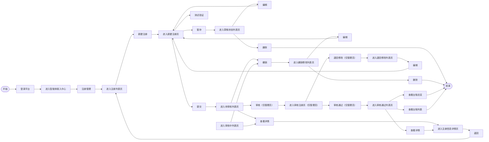

# 接入中心智能化升级-需求说明

<aside>
📌

本文档由《接入中心智能化-业务需求》转化而来，面向研发、设计、测试团队，描述接入中心智能化升级的产品需求、功能规格与验收标准。

</aside>

## 一、项目背景与目标

### 1.1 背景

接入中心是智能体提供方申请接入、管理员审核准入的核心枢纽。当前接入流程存在录入工作量大、信息易出错、连通排障耗时、接入进度不透明等问题，导致提供方与管理员之间频繁来回沟通，效率低下。

### 1.2 目标

通过引入智能助手（Agent），覆盖「填—审—测—察」接入全链路，实现：

- **降门槛**：以对话式、多模态方式自动填表，降低提供方录入成本。
- **提质量**：填写即审查、审核即预审，自动发现并纠正问题。
- **增效率**：自动连通测试与故障诊断，复用历史成功方案。
- **强闭环**：主动洞察接入进度并引导下一步动作，形成完整闭环。

### 1.3 目标用户与角色

| 角色 | 描述 | 核心诉求 |
| --- | --- | --- |
| 智能体提供方
（角色：科室管理员、信息科管理员） | 申请接入智能体的业务方 | 快速、低成本完成信息填报与连通验证 |
| 智能体管理方
（角色：信息科管理员） | 负责审核与准入决策的管理员 | 快速掌握审核态势，高效完成审核决策 |
| 智能助手（Agent） | 贯穿全链路的 AI 能力 | 预填、审查、测试、预审、洞察与引导 |

### 1.4 接入中心的业务流程

### 核心业务流程

用户登录平台进入智能体接入中心 → 注册管理 → 注册列表页;由注册列表页可【新建注册】进入新建注册页(暂存→草稿状态列表页、测试验证、提交→待审核列表页),并按状态进入各列表页完成编辑 / 删除 / 撤销 / 查看详情 / 审核等操作;管理员在审核注册页给出【审核通过】(→审核通过列表页,可查看详情 / 台账)或【退回修改】(→退回修改列表页,可编辑重提)。

### 功能与页面清单

| **一级板块** | **页面** | **页面类型** | 面向群体 |
| --- | --- | --- | --- |
| 1. 注册管理 | 1.1 注册管理页(7 个状态列表页) | 列表页,按注册状态分页：
全部tab
草稿tab
待审核tab
审核中tab
撤销修改tab
退回修改tab
审核通过tab | 所有用户 |
| 1.2 新建注册页 | 表单页 | 填写：备案材料上传、基本信息 、技术信息
操作支持：暂存 / 测试验证 / 提交 | 所有用户 |
| 1.3 注册信息详情页 | 详情页 | 查看：备案材料、基本信息、技术信息 | 所有用户 |
| 1.4 审核注册页 | 审核详情页 | 查看：注册信息并给出审核结论
操作：审核通过 / 退回修改 ，并给出具体说明 | 管理员 |

---

## 二、需求范围总览

本次升级分为**提供方侧**与**管理员侧**两大模块：

**提供方侧（填—审—测—察全链路）**

1. 接入信息智能填写
2. 填写内容智能审查
3. 智能化连通测试
4. 接入结果洞察与汇报

**管理员侧（预审—决策—引导）**

智能助手承担预审与提示，管理员承担确认与决策：

1. 审核态势概览与状态分流
2. 待审信息智能预审
3. 人工二次审核与决策
4. 审核后智能引导

---

## 三、提供方侧详细需求

**面向角色：提供智能体注册的人员，角色不限于科室管理员、信息科管理员。**

### 3.1 接入信息智能填写

**业务价值**

智能体提供方申请接入时需填写大量基本信息、技术信息并上传多格式备案材料。期望像与助手对话一样把材料「丢给」平台，由平台自动识别并填好表单，业务方只需核对确认，大幅降低录入工作量与门槛。

**功能需求**

| 编号 | 功能 | 需求描述 |
| --- | --- | --- |
| P1.1 | Agent对话式接入 | 支持 Agent 以对话方式引导用户提供信息，并将识别结果实时回填到表单 |
| P1.2 | 多模态上传与识别 | 至少覆盖：文件（PDF/Doc/Xlsx/csv 结构化解析提取）、语音（转写+意图识别）、图片（OCR 识别证照/截图/架构图）、文本（描述/参数自动归位）、链接（抓取链接内容辅助提取） |
| P1.3 | 语义联动填充 | 根据已识别内容语义，自动推断并填充相关字段（如由功能描述推断诊疗环节、适用科室） |
| P1.4 | AI 预填标识与溯源 | 自动填充字段高亮标注「AI 预填」，标注来源出处（可溯源）；敏感 / 存疑项标记为「请确认」，由用户人工核对确认 |

**参与角色**

| **角色** | **说明** | **在智能填写中的职责** |
| --- | --- | --- |
| 提供方（普通用户） | 申请接入智能体的业务人员，角色不限于科室管理员、信息科管理员 | 上传多模态材料、核对并采纳/修改 AI 预填、暂存、发起连通测试、提交 |
| 智能助手（Agent） | 贯穿填写环节的 AI 能力 | 识别材料并预填、语义联动推断、标注来源（可溯源）、申请授权纠错；不替代人工最终确认 |

**需求涉及页面**

「接入信息智能填写」围绕 **对话 / 上传入口 → 新建注册页 → 草稿列表页** 三个页面展开：用户以对话 + 多模态把材料交给平台，Agent 自动识别并预填表单，用户核对采纳后暂存或提交。核心约束：**全程仅操作本人数据、AI 预填均可溯源、最终以人工确认为准**。

| **页面** | **页面类型** | **在智能填写中的角色** |
| --- | --- | --- |
| Agent对话入口 | 对话浮层 | 多模态录入入口：上传与识别 |
| 新建注册页 | 表单页 | 主填写场景：预填回填、核对、测试、提交 |
| 草稿列表页 | 列表页 | 暂存草稿的续填入口 |

#### 3.1.1 Agent对话入口

**入口 icon 说明**

入口采用一个**全身立体、拟真的小机器人**形象，作为全局常驻的悬浮入口（**默认位于页面右下角，支持鼠标拖拽自由移动到页面任意位置**）。它不是一个平面图标，而是一个「有生命感、会陪伴用户」的接入小助手，随填报进程给予情绪反馈与引导。

**视觉效果**

- **造型**：**全身立体（3D / C4D 渲染质感）**的拟真小机器人，可站立、拟人比例，具备头部、躯干、双臂与双足；面部有表情（大眼睛 / 发光眼 + 胸前灯带），整体像一个可爱、可交流的桌面伙伴。
- **质感与配色**：金属 + 磨砂塑料质感，带圆润倒角与高光；配色与平台主色一致（科技蓝 + 高光），带柔和光晕 / 投影与地面接触阴影，强化立体悬浮感。
- **陆伴属性**：拟人化微表情与肢体语言（点头、招手、思考挠头、欢呼），会随接入进度 / 操作给予情绪反馈（成功比心 / 庆祝、失败安抚鼓励），形成「全程陪伴的接入小助手」人设。
- **尺寸**：常态约 64×64px 立体站姿形象，hover 放大至 约 72px；底部保留轻微地面阴影与点击热区。
- **位置与拖拽**：默认悬浮于页面右下角；支持鼠标按住机器人拖拽，自由移动到页面任意位置，松开即停靠并记忆位置供后续访问沿用；拖拽过程中略降透明度、跟随光标移动，此时不触发点击唤起，避免误操作。
- **状态徐标**：右上角可叠加未读红点 / 数字角标，提示新消息或待办。

**动画说明**

| **状态** | **动画表现** |
| --- | --- |
| 常态待机 | 站立状态轻微「呼吸」起伏 + 重心小幅晃动（2–3s 循环），偶发眨眼 / 环顾四周 / 胸前灯带呼吸闪烁，像真机器人般灵动待命 |
| 主动气泡欢迎语
（打开列表页 / 新建注册页） | 用户进入注册列表页或新建注册页时，除在对话窗口内展示欢迎语外，机器人旁边同步自动弹出一个指向机器人的对话气泡展示欢迎语（与窗口内一致，如「你好！我是智能助手……」）；气泡以淡入 + 轻微上浮 / 抹动动画出现，停留数秒引导用户上传材料 / 描述需求；点击气泡或机器人可展开完整对话窗口，超时未操作则自动收起为待机态 |
| 悬浮 hover | 轻微跳起 / 上浮并转身朝向用户 + 招手 / 点头问候，光晕增强，提示可点击 |
| 唤起点击 | 机器人点头 / 挪手后，对话窗口从 icon 位置展开（缩放 + 透明度渐入，约 250ms ease-out） |
| 新消息 / 提示 | 原地跳动 / 挫手（bounce）+ 右上角红点放大闪烁，吸引注意 |
| 思考 / 识别中 | 头顶循环省略号或齿轮转动，眼睛转为加载态，表示 Agent 正在识别 / 预填 |
| 情绪反馈 | 陪伴化反馈：填写 / 提交成功时比心 / 鼓掌 / 庆祝，校验失败 / 退回时低头安抚并鼓励重试，增强陪伴感 |
| 收起 | 窗口收拢回机器人位置，其挫手 / 坐下后回到站立待机状态 |

<aside>
⚡

**性能与降级**：动画建议采用 Lottie / SVG 实现；在低性能设备或用户开启「减弱动效」（prefers-reduced-motion）时，降级为静态图标 + 红点提示。

</aside>

**欢迎语说明**

按页面说明 Agent 进入各页面时的欢迎语，文案同时在**对话窗口内**与**机器人旁气泡**展示，`X` 为动态填充的实际数据；每条欢迎语在气泡内附带快捷操作按钮，一键进入下一步，无权限时置灰。

**气泡按钮指向性规则**：列表页（草稿 / 待审核 / 审核中 / 退回修改 / 撤销修改 / 审核通过等）有多条记录时，气泡按钮不直接操作某一条，而是先展开迷你清单（按时间倒序取前 3–5 条，底部附「查看全部」回到对应tab），记录级操作（编辑 / 删除 / 查看详情 / 撤销等）由清单内每条自带的按钮完成；新建注册页、详情页、审核注册页等单记录页面则保留气泡直接操作。

| **页面** | **面向角色** | **触发时机** | **欢迎语文案（窗口内 + 机器人旁气泡）** | **引导动作 / 气泡操作按钮** |
| --- | --- | --- | --- | --- |
| 注册列表页 · 全部tab | 智能体提供方
（角色：科室管理员、信息科管理员） | 进入注册管理 / 全部tab | 你好！我是医小管。点击【新建注册】，把产品说明书 / 技术规格书 PDF（或链接 / 图片）丢给我，我来帮你自动识别并填表～ | 【新建注册】：唤起上传识别，一键建单 |
| 注册列表页 · 草稿tab | 智能体提供方
（角色：科室管理员、信息科管理员） | 进入草稿tab | 你还有 X 条未完成的草稿，需要我帮你继续补全吗？点开任意草稿，我接着帮你填。 | 【去补全 X 条草稿】：展开草稿清单，每条【编辑】续填（PRD 草稿页操作） |
| 注册列表页 · 待审核 / 审核中tab | 智能体提供方
（角色：科室管理员、信息科管理员） | 进入待审核 / 审核中tab | 这里是已提交、正在等待审核的智能体，我会帮你盯进度，有审核结果第一时间提醒你。 | 【查看这 X 条】：展开清单，每条【查看详情】【撤销】，逐条看进度 |
| 注册列表页 · 退回修改tab | 智能体提供方
（角色：科室管理员、信息科管理员） | 进入退回修改tab | 有 X 条被退回啦，别担心～我已整理好退回意见和问题点，点开我陪你逐条改好再提交。 | 【去处理 X 条退回】：展开清单，每条【编辑】重提并附「退回原因说明」（PRD 退回修改页仅【编辑】） |
| 注册列表页 · 撤销修改tab | 智能体提供方
（角色：科室管理员、信息科管理员） | 进入撤销修改tab | 这些是你撤销的注册，需要我帮你快速修改后重新提交吗？ | 【查看 X 条撤销】：展开清单，每条【编辑】【删除】（PRD 撤销修改页操作） |
| 注册列表页 · 审核通过tab | 智能体提供方
（角色：科室管理员、信息科管理员） | 进入审核通过tab | 恭喜！这些智能体已通过接入🎉 需要我带你去完善台账，或发起准入评测吗？ | 【查看 X 条已通过】：展开清单，每条【查看详情】及【完善台账】【发起准入评测】一键直达（需权限） |
| 新建注册页 | 智能体提供方
（角色：科室管理员、信息科管理员） | 进入新建注册页 | 你好！我是医小管。先上传「产品说明书」与「技术规格书」PDF，或直接把链接 / 图片发我，也可以打字描述你想接入的智能体，我自动识别并填到表单，你核对确认即可。 | 【上传】（点击 / 拖拽）+ 语音描述入口，逐区预填（PRD 新建注册页操作） |
| 注册信息详情页 | 智能体提供方
（角色：科室管理员、信息科管理员） | 进入详情页 | 这是该智能体的注册详情，需要我帮你解读某个字段，或对比历史填写版本吗？ | 只读页：【返回】+ 附件预览 / 下载；字段解读在对话内解答，不新增页面写操作 |
| 全部tab页 | 智能体管理方
（角色：信息科管理员） | 管理员进入全部注册状态列表页 | 今日待审查 X 个、准入通过 X 个、退回修改 X 个。在气泡里点对应状态即可直接进入处理～ | 状态分流入口（【待审核】【审核中】【退回修改】【审核通过】切tab，属导航）；单条经清单【查看详情】，待审核tab点【审核】进入审核页（PRD 1.1.1 / 1.1.3） |
| 审核注册页 | 智能体管理方
（角色：信息科管理员） | 管理员进入审核注册页 | 我已完成预审：标注了 X 个疑似问题并跑了连通测试，预审结论为「XX」，供你二次审核参考，最终以你的决策为准。 | 【审核通过】【退回修改】（附【测试验证】复核连通），引导给出审核结论 |

**页面字段**（页面：Agent对话入口 · 对话浮层）

| **字段** | **说明** |
| --- | --- |
| 唤起入口 | 全局常驻的悬浮机器人入口，默认位于页面右下角，支持鼠标拖拽移动到页面任意位置；点击唤起对话窗口，可随时呼出助手 |
| 对话窗口标题 | 标题栏固定显示助手名称，如「医小管」；右侧提供关闭按钮 |
| 对话时间 | 每条消息显示发送时间，格式 HH:MM；跨天时显示 YYYY-MM-DD HH:MM |
| 对话内容 | 以气泡形式按时间顺序展示用户与 Agent 的历史对话及识别 / 预填结果；支持上滑查看历史、自动滚动到最新 |
| 上传入口 | 支持多模态上传——文件（PDF/Word/Excel）、图片、链接；提供两种上传方式：① 点击上传按钮选择文件；② 直接将文件拖拽 / “扔”进对话窗口任意区域，拖入时窗口高亮并提示「松开即可上传」。单文件 ≤30M，超限 / 格式不符时提示 |
| 文本输入框 | 底部常驻，输入自然语言描述或补充信息；支持回车发送，内容为空时发送按钮置灰 |
| 语音输入按钮 | 点击 / 长按进行语音输入，自动转写为文字并做意图识别；转写结果可编辑后发送 |
| 关闭窗口按钮 | 位于标题栏右上角，点击收起对话窗口（不清空会话）；下次唤起可继续 |

**操作按钮与交互**

| **角色** | **操作按钮** | **交互说明** |
| --- | --- | --- |
| 提供方 | 唤起 / 关闭对话窗口 | 点击悬浮入口唤起对话窗口，点击关闭按钮收起；窗口顶部显示标题，消息区按对话时间展示历史对话，收起不清空会话，下次可继续 |
| 提供方 | 文本输入发送 | 在底部文本框输入自然语言描述 / 补充，回车或点击发送；内容为空时发送按钮置灰 |
| 提供方 | 语音输入 | 点击 / 长按语音按钮录入，自动转写为文字并做意图识别，结果可编辑后发送 |
| 提供方 | 上传材料（多模态） | 两种方式提交文件 / 图片 / 链接（单文件 ≤30M）：点击上传入口选择，或直接把文件拖拽 / “扔”进对话窗口任意区域松开上传；上传后由 Agent 实时识别并回填到新建注册页对应字段 |
| 提供方 | 授权自动纠错 | 对可自动修复项授权后由平台纠正并标注「已自动修正」，保留前后对比与回退入口 |
| Agent | 自动唤起并发送欢迎语 / 分步提问 | 用户打开注册列表页 / 新建注册页时主动问候：除在对话窗口内展示欢迎语外，同时在机器人旁以带动画的对话气泡展示欢迎语，分步引导用户上传材料 / 描述需求；点击气泡或机器人可展开完整对话窗口，无需逐字段手填 |
| Agent | 识别材料并预填表单 | 对上传材料实时识别，将结果回填到新建注册页对应字段 |
| Agent | 语义联动推断 | 由功能描述等已识别内容推断诊疗环节、所属科室等关联字段 |
| Agent | 标注来源（溯源） | 回填字段高亮「AI 预填」，悬浮显示来源出处；敏感 / 存疑项标「请确认」供人工核对 |
| Agent | 发起授权纠错请求 | 对可自动修复项向用户申请授权；不替代人工最终确认 |

**数据权限**：Agent 仅在用户授权下读取本次上传材料，识别结果回填至当前用户的当前表单，不跨记录、跨用户访问。

#### 3.1.2 新建注册页

智能填写主场景，自上而下为 **备案材料 → 基本信息 → 技术信息**；底部统一【暂存】【提交】，技术信息区【测试验证】。

底部操作:【暂存】点击后弹「注册表单填写记录已暂存至草稿状态列表页」弹窗;【提交】见下方提交规则。

**3.1.2.1 备案材料上传**

- **上传成功** → 弹「上传成功」弹窗;
- **上传失败** → 弹「上传失败,单文件超过最大限制 30M」或「上传失败,仅支持 PDF 类型文件」。
- **上传要求**:① 限定 PDF 格式;② 支持多文件上传;③ 单文件不超过 30M。

| **材料** | **必填** | **内容要求** | **智能化Agent联动说明** |
| --- | --- | --- | --- |
| 产品说明书 | 必填 | 文档内容需包含:产品名称、产品简介、主要功能、开发单位及技术联系人、产品版本等 | 上传后 Agent 结构化解析，自动提取产品名称、简介、主要功能、版本、技术联系人等并回填至「基本信息」对应字段，标注「AI 预填」与来源出处（可溯源） |
| 技术规格书 | 必填 | 文档内容需包含:接入方式信息,如接口地址、认证方式、请求参数、返回参数、数据格式、请求示例、返回示例、错误码说明等内容 | Agent 解析接口地址、认证方式、请求 / 返回参数等，自动回填至「技术信息」对应字段；密钥类敏感项默认标「请确认」供人工核对 |
| 其他材料 | 可选 | 如安全测试报告、部署环境说明书等 | 作为辅助识别源，Agent 提取可用信息补充预填，并供智能审查交叉校验 |

**3.1.2.2 基本信息**

**3.1.2.2.1 智能体信息**

| **序号** | **字段名称** | **必填** | **说明 / 校验** | **智能化Agent联动说明** |
| --- | --- | --- | --- | --- |
| 1 | 智能体名称 | 是 | 支持 OCR 识别、支持用户修改;限制 2–20 个字符,实时字数提示(X/20);与已有智能体重名时,输入失焦校验提醒「此名称已被使用,请重新命名」 | Agent 从产品说明书 / 图片识别名称并预填，重名时提示确认，可一键采纳或修改 |
| 2 | 智能体编号 | 自动生成 | 按「科室编号-准入顺序号(如 0001)」自动生成 | 系统自动生成，Agent 不参与填写 |
| 3 | 智能体版本 | 是 | 支持 OCR 识别、支持用户修改;格式 1.0 / 1.1 / 2.0 / 2.1……,校验版本号格式(数字.数字) | Agent 从材料识别版本号并预填，校验格式后供用户确认 |
| 4 | 所属科室 | 是 | 字典生成、用户选择;格式为科室代码+科室名称 | Agent 依据功能描述语义联动推荐科室，用户确认选择 |
| 5 | 诊疗环节 | 否 | 用户选择,下拉框(导诊分诊 / 预问诊 / 预约挂号 / 辅助检查 / 辅助诊断 / 辅助治疗 / 住院 / 手术 / 其他(填空));选「其他」时出现文本框,限制 20 字,实时字数提示(X/20) | Agent 依据功能描述语义推断诊疗环节并预选，选「其他」需人工补充 |
| 6 | 功能描述 | 是 | 支持 OCR 识别、支持用户修改;重点说明工作内容、服务对象、输入信息、输出结果;多行文本域默认显示 5 行,超出可滚动;限 500 字以内,实时字数提示(X/500),超 500 字红色提示且不可继续输入;参考示例:「面向门诊患者开展预问诊服务,自动采集主诉、现病史、既往史等信息,形成标准化问诊摘要」 | Agent 汇总材料生成功能描述草稿并预填，超长提示精简，用户确认后生效 |

**3.1.2.2.2 来源与责任信息**

| **序号** | **字段名称** | **必填** | **说明 / 校验** | **智能化Agent联动说明** |
| --- | --- | --- | --- | --- |
| 1 | 智能体来源 | 否 | 用户选择,支持单选;选项:自研 / 第三方 / 合作研发 | Agent 依据材料判断来源类型（自研 / 第三方 / 合作研发）并预选，用户确认 |
| 2 | 供应商名称 | 否 | 支持 OCR 识别、支持用户修改;需填写供应商全称,不超过 30 字,实时字数提示(X/30) | Agent 从材料识别供应商全称并预填 |
| 3 | 技术联系人 | 是 | 支持 OCR 识别、支持用户修改;限制 2–10 个字,实时字数提示(X/10) | Agent 从产品说明书识别联系人姓名并预填 |
| 4 | 联系方式 | 是 | 支持 OCR 识别、支持用户修改;格式校验,限制 11 个数字,失焦校验手机号格式,错误提示「请输入正确的 11 位手机号」 | Agent 识别联系电话并预填，校验 11 位手机号 |

**3.1.2.3 技术信息**

区域操作按钮:【测试验证】(中间过程需要呈现出来)、【获取 SDK】/【获取 OTel】。

**接入方式(必填)**:支持 OCR 识别、支持用户修改选择;下拉框(API / SDK / OTel)。选择不同接入方式动态展示对应子字段。

| **接入方式** | **子字段** | **智能化Agent联动说明** |
| --- | --- | --- |
| ① API 接入 | 接口地址(必填) | Agent 从技术规格书识别接口地址、认证方式、请求 / 返回参数并预填 |
| API key | 支持 OCR 识别、支持用户修改;默认密文显示(`********`);点击 icon1 切换显示 / 隐藏,点击 icon2 复制 | Agent 可从材料识别并预填，属敏感字段、默认标「请确认」供人工核对，默认密文展示 |
| ② SDK 接入 | 平台 URL 地址 | 由平台签发，非 Agent 识别；Agent 仅引导点击【获取 SDK】 |
| 平台密钥 key | 点击【获取 SDK】自动获取 | 平台签发，Agent 不参与识别 |
| 埋点代码生成 | 根据平台 URL 地址和密钥 key 自动生成 | 平台依 URL+密钥自动生成，Agent 不参与 |
| ③ OTel 接入 | 平台 URL 地址 | 由平台签发，Agent 仅引导点击【获取 OTel】 |
| 平台密钥 key | 点击【获取 OTel】自动获取 | 平台签发，Agent 不参与识别 |
| 埋点代码生成 | 根据平台 URL 地址和密钥 key 自动生成 | 平台自动生成，Agent 不参与 |

<aside>
🔁

**接入方式差异**:API 为黑盒端到端接入(用户填接口地址 + Key,平台调出去);SDK / OTel 为白盒埋点接入(点击「获取 SDK / 获取 OTel」由平台自动签发 URL + 密钥并生成埋点代码,用户复制粘贴进 Agent 应用,数据推上来,可获取完整 trace/span)。

</aside>

#### 提交与连通测试规则

- 【测试验证】:点击后呈现连通过程 —— **联通成功** 弹「测试验证正常」弹窗;**联通失败** 弹「测试验证异常,请再次检查技术信息填写内容(错误代码和错误原因返回)」弹窗。
- 【提交】:**提交成功** 弹「提交成功」弹窗,进入审核中状态;**提交失败** 弹「提交失败,请再次检查注册表单填写内容」弹窗。
- **提交前置校验**:未完成测试或测试未通过时,【提交】按钮置灰,并提示「当前无法提交注册,请完成连通测试并确保可正常连通」。

#### 3.1.3 草稿tab列表页

暂存后的预填草稿在此续填，**字段取自草稿表单已填内容，未填项以「--」或占位文案显示**。

**字段（列表列）**

| **列名** | **说明** | **智能化Agent联动说明** |
| --- | --- | --- |
| 序号 | 系统自动生成,按列表展示顺序递增编号;支持翻页连续编号 | 系统生成，Agent 不参与 |
| 智能体编号 | 草稿暂存时尚未生成正式编号则显示「--」;已生成则按「科室编号-准入顺序号」显示 | 系统生成，Agent 不参与 |
| 智能体名称 | 取自草稿表单已填写名称;未填写时显示「未命名草稿」;支持点击继续编辑 | 展示 Agent 在草稿中预填的名称；未命名时点击进入可由 Agent 继续对话补全 |
| 智能体版本 | 取自草稿表单已填写版本号;未填写时显示「--」 | 展示 Agent 预填后暂存的内容，未人工确认项保留「AI 预填」标识；续填时 Agent 可继续识别与语义联动补全 |
| 所属科室 | 取自草稿表单选择的科室(科室代码+科室名称);支持筛选 | 展示 Agent 依据功能描述语义联动推荐并预填的科室，未确认项保留「AI 预填」标识 |
| 诊疗环节 | 取自草稿表单选择项;未填写时显示「--」;支持下拉筛选 | 展示 Agent 依据功能描述语义推断并预选的诊疗环节；选「其他」需人工补充 |
| 智能体来源 | 取自草稿表单选择项(自研 / 第三方 / 合作研发);支持下拉筛选 | 展示 Agent 依据材料判断并预选的来源类型 |
| 供应商名称 | 取自草稿表单填写的供应商全称;未填写时显示「--」 | 展示 Agent 从材料识别并预填的供应商全称 |
| 核心功能 | 取自草稿表单「功能描述」字段;列表中截取前 30 字展示,悬浮 Tooltip 展示完整内容;未填写显示「--」 | 展示 Agent 汇总材料生成并预填的功能描述，未确认项保留「AI 预填」标识 |
| 最后编辑时间 | `YYYY-MM-DD HH:MM:SS` | 由系统记录，含 Agent 自动预填 / 回填引起的更新时间 |

**交互操作按钮:**
1.【编辑】进入新建注册页继续填写;
2.【删除】弹「确认是否删除」

2.1【是】弹「删除成功」并从草稿列表移除该记录
2.2 【否】返回草稿列表页。

**功能权限**：提供方可对**本人草稿**执行编辑、删除、继续提交；不涉及审核。

**数据权限**：草稿为未提交的个人暂存数据，**仅创建者本人可见**；信息管理员也仅能看到本人创建的草稿，不可见他人草稿。

### 3.2 填写内容智能审查

**业务价值**

在填报过程中即获得智能审查，自动发现并定位问题、给出修改建议，并由平台直接纠正明显错误，减少来回沟通。

**功能需求**

| 编号 | 功能 | 需求描述 |
| --- | --- | --- |
| P2.1 | 自动审查 | 对已填写内容进行完整性、规范性、一致性、合规性审查（必填缺失、格式不符、字段矛盾等） |
| P2.2 | 错误定位 | 审查结果精确定位到具体字段/材料，并说明问题原因与影响 |
| P2.3 | 智能化建议 | 对每个问题给出可执行的修改建议或示例值 |
| P2.4 | 申请权限自动纠错 | 对可自动修复项向用户申请授权，授权后自动纠正并标注「已自动修正」，保留前后对比与回退入口 |

**参与角色**

| **角色** | **说明** | **在智能审查中的职责** |
| --- | --- | --- |
| 提供方（普通用户） | 填写并核对信息的业务人员，角色不限于科室管理员、信息科管理员 | 触发 / 查看审查结果、采纳修改建议、授权自动纠错、确认或忽略提示项 |
| 智能助手（Agent） | 贯穿填写环节的审查能力 | 实时审查、定位问题、给出建议、申请授权纠错；不替代人工最终确认 |

**需求涉及页面**

「填写内容智能审查」主要在 **新建注册页** 内进行：用户填写或 Agent 预填后，Agent 实时审查并在对应字段 / 材料旁标注问题与建议，用户采纳建议或授权纠错。核心约束：**审查仅针对已填内容、不新增信息，纠错均需授权并可回退**。

| **页面** | **页面类型** | **在智能审查中的角色** |
| --- | --- | --- |
| Agent对话入口 | 对话浮层 | 审查结果汇总播报与授权交互 |
| 新建注册页 | 表单页 | 主审查场景：实时审查、问题标注、建议与纠错 |

#### 3.2.1 新建注册页

页面定位：用户填写或 Agent 预填后，Agent 实时审查并**就地在对应字段 / 材料上标注**问题（红 / 黄角标 + 波浪下划线 + 悬浮 Tooltip），审查结论与问题清单**汇总在 Agent 对话窗口**呈现（见 3.2.2）；审查在字段失焦 / 暂存 / 提交前自动触发，亦可在对话中主动发起「帮我检查一下」，触发后机器人进入「识别 / 审查中」态；用户采纳建议或授权纠错，全部错误处理后方可提交。（**不在新建注册页新增独立「智能审查 · 实时定位问题」面板 / 状态条卡片）**

**操作交互与影响字段**

| **角色** | **动作 / 步骤** | **操作按钮** | **交互说明** | **影响字段 / 元素** |
| --- | --- | --- | --- | --- |
| 提供方 | 主动发起审查 | 「帮我检查一下」 | 在对话窗口输入「帮我检查一下」，发起对当前已填内容的即时审查并刷新问题清单（字段失焦 / 暂存 / 提交前亦会自动触发） | 对话窗口主动检查入口、对话窗口问题清单 |
| Agent | 实时自动审查 | 自动 | 对已填 / 预填内容做完整性、规范性、一致性、合规性审查（必填缺失、格式不符、字段矛盾等），实时刷新审查结果；审查计数「错误 X / 警告 X」在 Agent 对话窗口汇总播报，问题就地标注在对应字段，不新增独立状态条 / 面板 | 字段就地标注、Agent 对话窗口（审查汇总） |
| Agent | 定位与标注问题 | 自动 | 精确定位到具体字段 / 材料，在其右侧显示红（错误）/ 黄（警告）角标与波浪下划线，悬浮 Tooltip 显示原因、影响与建议摘要，并按严重程度分级 | 问题标注（角标 / 下划线 / Tooltip）、Agent 对话窗口（问题清单） |
| Agent | 给出修改建议 | 自动 | 在字段悬浮 Tooltip 与 Agent 对话窗口内，为每条问题给出可执行的建议值 / 示例值；对话窗口问题清单每条前置勾选框，支持多选后批量采纳（不为每条单独摆放采纳按钮） | 修改建议（Tooltip / 对话窗口） |
| 提供方 | 查看问题与定位 | — | 点击 Agent 对话窗口的问题清单条目或字段角标，页面滚动并高亮定位到对应字段 / 材料，高亮约 2s 后淡出便于核对 | Agent 对话窗口（问题清单）、问题标注（角标 / 下划线） |
| 提供方 | 采纳建议 | 勾选 +「确认采纳」/「忽略」 | 1. 在对话窗口问题清单勾选一条或多条建议（支持全选），点击「确认采纳」批量将建议值填入对应字段，标「AI 预填」可再编辑；
2. 对不采纳的条目勾选后点击「忽略」 | 修改建议（Tooltip / 对话窗口）、目标表单字段 |
| Agent | 申请授权纠错 | 自动 | 对可自动修复项向用户申请授权；授权后自动纠正并标「已自动修正」，保留回退，不替代人工最终确认 | 自动纠错授权入口 |
| 提供方 | 授权自动纠错 | 「授权自动修正」/「回退」 | 1. 对可自动修复项点击「授权自动修正」，平台纠正并标「已自动修正」；
2. 展开可见原值 / 新值对比，点击「回退」恢复原值 | 自动纠错授权入口、目标表单字段 |
| 提供方 | 忽略 / 标记已确认 | 「忽略」/「标记已确认」 | 对提示 / 警告类问题点击「忽略」或「标记已确认」，从待处理计数移除，仍可在「已忽略」中查看 | Agent 对话窗口（问题清单 / 审查汇总计数） |
| 提供方 | 提交校验 | 【提交】 | 存在错误时【提交】置灰并提示「请先处理 X 个错误项」，全部通过显示「✓ 审查通过」后方可提交 | Agent 对话窗口（审查汇总）、提交按钮 |

#### 3.2.2 Agent对话入口

页面定位：在对话窗口集中汇总播报审查结果与问题清单，统一处理修改建议采纳与自动纠错授权，并在用户修改后自动复审。

> 对话窗口的基础结构（窗口标题、对话时间、对话内容、输入 / 上传区等）沿用 3.1.1「页面字段（Agent对话入口）」的定义；此处不再重复字段说明，仅按角色说明审查相关的交互及所影响的窗口元素。
> 

**操作交互与影响字段**

| **角色** | **动作 / 步骤** | **操作按钮** | **交互说明** | **影响字段 / 元素** |
| --- | --- | --- | --- | --- |
| Agent | 审查结果汇总播报 | 自动 | 在对话窗口汇总播报审查结论与「共 X 项：错误 X / 警告 X / 提示 X」按严重程度分级的问题计数 | 审查结果汇总 |
| Agent | 逐条说明与定位 | 自动 | 逐条说明问题原因与影响，并支持跳转定位到表单对应字段 / 材料 | 问题清单卡 |
| 提供方 | 查看审查汇总 | — | 在对话窗口查看审查结论与计数，点击条目跳转定位到表单对应字段 / 材料 | 审查结果汇总、问题清单卡 |
| Agent | 给出修改建议 | 自动 | 对每个问题给出可执行的修改建议或示例值，每条前置勾选框，供用户多选后批量采纳 | 修改建议 |
| 提供方 | 采纳建议 | 勾选 +「确认采纳」 | 在问题清单勾选一条或多条建议（支持全选），点击底部「确认采纳」批量把建议值回填表单并标「AI 预填」可再编辑；不再为每条单独摆放采纳按钮，避免清单过长排布不下 | 问题清单勾选框、确认采纳按钮、目标表单字段 |
| Agent | 发起授权纠错 | 自动 | 对可修复项申请授权，纠正后标「已自动修正」并保留回退；不替代人工最终确认 | 授权请求、纠错对比与回退 |
| 提供方 | 授权自动纠错 | 「授权自动修正」 | 对可修复项点击「授权自动修正」（支持单条 / 批量），平台纠正并标「已自动修正」 | 授权请求、目标表单字段 |
| 提供方 | 回退 / 忽略 | 「回退」/「忽略」 | 1. 查看原值 / 新值对比点击「回退」恢复原值；
2. 对提示类问题可「忽略」，从待处理计数移除 | 纠错对比与回退、问题清单卡 |
| Agent | 修改后自动复审 | 自动 | 用户修改后自动复审并更新问题清单 | 复审播报、问题清单卡 |

**数据权限**：审查仅针对当前用户当前表单的已填内容，不跨记录、跨用户；纠错均需用户授权并保留回退入口。

### 3.3 智能化连通测试

**业务价值**

技术信息填写后需验证接口能否连通。由平台智能助手自动发起连通测试，自动诊断失败原因并给出解决方案；对常见问题复用历史成功方案，减少重复排障。连通测试本身是一条线性流程（发起→过程→结果→诊断→方案→复用→重测）

**功能需求**

| 编号 | 功能 | 需求描述 |
| --- | --- | --- |
| P3.1 | 执行连通测试 | 对已登记的接口信息发起连通性测试 |
| P3.2 | 错误诊断 | 测试失败时自动诊断并定位原因（网络不通、参数不符等） |
| P3.3 | 解决方案建议 | 针对诊断结果给出具体解决步骤 |
| P3.4 | 历史方案复用 | 检索相似历史故障与成功解决方案并推荐复用，记录本次方案沉淀为知识库 |

**参与角色**

| **角色** | **说明** | **在连通测试中的职责** |
| --- | --- | --- |
| 提供方（普通用户） | 填写技术信息的业务人员，角色不限于科室管理员、信息科管理员 | 发起【测试验证】、查看连通过程与诊断、按建议修正后重试 |
| 智能助手（Agent） | 贯穿测试环节的诊断能力 | 自动发起 / 执行测试、诊断失败原因、给出解决步骤、复用并沉淀历史方案 |

**需求涉及页面**

「智能化连通测试」主要在 **新建注册页 · 技术信息区** 进行：用户填好接入方式与接口信息后点击【测试验证】，平台执行连通测试并实时呈现过程，失败时 Agent 自动诊断并给出解决步骤，可复用历史成功方案。核心约束：**测试过程与诊断可视、可复测，提交前置依赖测试通过**。

| **页面** | **页面类型** | **在连通测试中的角色** |
| --- | --- | --- |
| 新建注册页 · 技术信息区 | 表单页 | 主测试场景：发起测试、过程呈现、诊断与修复 |
| Agent对话入口 | 对话浮层 | 诊断结论播报、解决方案推荐与历史方案复用 |

#### 3.3.1 新建注册页 · 技术信息区（连通测试）

页面定位：用户在技术信息区发起连通测试并实时查看**测试过程与结果状态**（步骤条 / 时间线就地呈现）；失败后的诊断结论、解决步骤与历史方案复用**统一由 Agent 对话窗口呈现（见 3.3.2）**通过后方可提交。**（不在新建注册页新增「历史方案复用」等独立卡片）**

**操作交互与影响字段**

| **角色** | **动作 / 步骤** | **操作按钮** | **交互说明** | **影响字段 / 元素** |
| --- | --- | --- | --- | --- |
| 提供方 | 发起测试 | 【测试验证】 | 接口信息（接口地址 / 认证方式 / 密钥等）不完整时按钮置灰并提示「请先补全接口信息」；完整后点击发起连通测试，按钮进入 loading 态 | 测试入口 |
| Agent | 执行与过程呈现 | 自动 | 平台执行连通性测试，以步骤条 / 时间线实时呈现 DNS 解析 → 建连 → 认证 → 请求 → 返回各阶段状态与耗时；机器人同步进入「识别 / 测试中」态 | 测试过程 |
| Agent | 返回测试结果 | 自动 | 联通成功弹「测试验证正常」，失败弹「测试验证异常，请再次检查技术信息填写内容（返回错误代码和错误原因）」；结果同步展示在对话窗口 | 测试结果 |
| Agent | 失败自动诊断 | 自动 | 测试失败时自动定位失败阶段与原因（网络不通 / 认证失败 / 参数不符 / 超时等），附错误代码、原因与影响说明，在 Agent 对话窗口呈现 | Agent 对话窗口（诊断结论） |
| Agent | 给出解决步骤 | 自动 | 针对诊断结果在 Agent 对话窗口给出编号化、可定位到字段的解决步骤，并提供「按建议修改」入口 | Agent 对话窗口（解决步骤） |
| 提供方 | 按建议修改 | 「按建议修改」 | 在对话窗口点击「按建议修改」后定位到对应技术信息字段进行修改 | Agent 对话窗口（解决步骤）、目标技术信息字段 |
| Agent | 推荐历史方案 | 自动 | 检索相似历史故障与成功方案，按匹配度在 Agent 对话窗口推荐并显示匹配度 / 命中场景 | Agent 对话窗口（历史方案推荐） |
| 提供方 | 复用历史方案 | 「复用此方案」 | 在 Agent 对话窗口的推荐列表点击「复用此方案」，一键把历史成功配置应用到当前填写 | Agent 对话窗口（历史方案推荐） |
| 提供方 | 重新测试 | 【重新测试】 | 修正后复用上次接口信息再次发起，直至连通通过；未通过时【提交】保持置灰 | 重新测试、测试结果、提交按钮 |
| Agent | 方案沉淀 | 自动 | 测试通过后将本次成功方案脱敏后沉淀为知识库，供后续复用 | 历史方案复用（知识库） |

#### 3.3.2 Agent对话入口

页面定位：在对话窗口同步播报测试状态、集中呈现诊断结论与解决步骤，并按匹配度推荐复用历史成功方案。

> 对话窗口的基础结构（窗口标题、对话时间、对话内容、输入 / 上传区等）沿用 3.1.1「页面字段（Agent对话入口）」的定义；此处不再重复字段说明，仅按角色说明连通测试相关的交互及所影响的窗口元素。
> 

**操作交互与影响字段**

| **角色** | **动作 / 步骤** | **操作按钮** | **交互说明** | **影响字段 / 元素** |
| --- | --- | --- | --- | --- |
| Agent | 测试状态播报 | 自动 | 实时在对话窗口播报测试进度与结果（测试中 / 通过 / 失败） | 测试状态播报 |
| Agent | 自动诊断与说明 | 自动 | 失败时自动定位失败阶段与原因（网络不通 / 认证失败 / 参数不符 / 超时等）并说明影响 | 诊断结论卡 |
| 提供方 | 查看诊断结论 | — | 在对话窗口查看失败阶段、错误代码与原因及影响说明 | 诊断结论卡 |
| Agent | 给出解决步骤 | 自动 | 输出编号化、可定位到字段的解决步骤，供用户按建议修改 | 解决步骤清单 |
| 提供方 | 按步骤修改 | 「按建议修改」 | 点击解决步骤中的「按建议修改」，定位到对应技术信息字段进行修改 | 解决步骤清单、目标技术信息字段 |
| Agent | 推荐历史方案 | 自动 | 按匹配度推荐历史成功方案供复用，显示匹配度 / 命中场景 | 历史方案推荐 |
| 提供方 | 复用历史方案 | 「复用此方案」 | 从推荐列表点击「复用此方案」，一键把历史成功配置应用到当前填写 | 历史方案推荐 |
| 提供方 | 对话内重新测试 | 【重新测试】 | 在对话窗口点击【重新测试】，复用上次接口信息再次发起 | 重新测试入口、测试状态播报 |
| Agent | 方案沉淀 | 自动 | 测试通过后将本次成功方案脱敏后沉淀为知识库，供后续复用 | 历史方案推荐、知识沉淀提示 |

**数据权限**：测试仅针对当前用户当前表单登记的接口信息发起，过程与诊断结果仅本人可见；历史方案知识库经脱敏后供复用。

### 3.4 接入结果洞察与汇报

**业务价值**

接入完成后提供方常不清楚「接入到哪一步、还有什么待办」。期望平台主动、轻量地汇报关键服务指标，并引导用户完成下一步动作（台账完善），形成闭环。

**功能需求**

| 编号 | 功能 | 需求描述 |
| --- | --- | --- |
| P4.1 | 人工最终确认 | 所有自动填充结果可由用户一键采纳或修改，最终以用户确认为准；人工确认后「AI 预填」标识自动消除 |
| P4.2 | 自动提交 | 人工确认信息后，智能助手完成信息自动提交 |
| P4.3 | 主动指标洞察 | 主动汇报核心服务指标，包括接入进度（信息待审查 → 信息审查中 → 接入成功） |
| P4.4 | 轻量气泡提示 | 采用类「王者荣耀—元宝—气泡提示」的轻量、非打断式提示，推送关键信息与待办 |
| P4.5 | 主动引导动作 | 主动引导用户补全台账信息 |
| P4.6 | 一键直达 | 气泡/提示中提供一键跳转到对应操作（台账完善）的入口 |
| P4.7 | 可关闭 | 用户可关闭单条提示，避免打扰 |

**参与角色**

| **角色** | **说明** | **在洞察与汇报中的职责** |
| --- | --- | --- |
| 提供方（普通用户） | 已提交 / 接入完成的业务人员，角色不限于科室管理员、信息科管理员 | 接收进度与指标气泡、一键跳转完善台账 / 准入评测、关闭提示 |
| 智能助手（Agent） | 贯穿洞察环节的汇报能力 | 主动汇报进度与指标、引导下一步动作、提供一键直达；最终以用户操作为准 |

**需求涉及页面**

「接入结果洞察与汇报」贯穿 **注册列表页 / 注册信息详情页等接入中心页面**，以轻量、非打断的气泡形式主动汇报接入进度与关键指标，并引导用户完成台账完善等下一步动作。核心约束：**提示非打断、可单条关闭，引导动作均提供一键直达入口**。

| **页面** | **页面类型** | **在洞察与汇报中的角色** |
| --- | --- | --- |
| 注册列表页 / 注册信息详情页 | 列表页 / 详情页 | 进度与指标气泡播报、下一步引导 |
| Agent对话入口 | 对话浮层 | 指标洞察详情展示与一键直达入口 |

#### 3.4.1 接入中心页面

「接入结果洞察与汇报」在不同页面以不同形态呈现，下面按页面分别说明 **页面定位 → 各角色动作 / 步骤 → 操作按钮 → 交互说明 → 影响字段 / 元素**。

**3.4.1.1 注册列表页（各状态tab）**

页面定位：全局气泡播报账户整体接入态势与待办，引导分流处理。

**操作交互与影响字段**

| **角色** | **动作 / 步骤** | **操作按钮** | **交互说明** | **影响字段 / 元素** |
| --- | --- | --- | --- | --- |
| Agent | 主动态势播报 | 自动 | 进入列表页主动以轻量非打断气泡，用文字 / 角标播报账户整体接入态势（草稿 X / 待审核 X / 审核中 X / 退回 X / 审核通过 X），停留数秒后收起、可手动关闭；态势在气泡内文字化播报，**不新增与列表状态tab重复的卡片切换组件** | 进度气泡 |
| Agent | 接入进度洞察 | 自动 | 针对最近提交记录汇报「信息待审查 → 信息审查中 → 接入成功」的当前阶段 | 接入进度提示 |
| Agent | 引导下一步 | 自动 | 高亮待处理事项（如「有 X 条被退回待修改」「X 条已通过待完善台账」），主动引导编辑重提、完善台账或发起评测 | 待办引导 |
| 提供方 | 查看态势 / 进度 | — | 点击气泡或机器人展开，查看各状态数量与最近提交项进度 | 进度气泡、接入进度提示 |
| 提供方 | 跳转处理 | 一键直达 | 点击待办项 / 一键直达按钮：多条时跳转到对应状态tab并筛选 / 高亮目标记录，由行内按钮对具体记录操作；单条时可直达该记录编辑页 / 台账完善 / 准入评测；无权限时置灰提示 | 待办引导、一键直达 |
| 提供方 | 关闭提示 | 关闭 | 点击气泡右上角关闭按钮收起当前提示，不再打扰；机器人处可再次查看 | 关闭 |

**3.4.1.2 注册信息详情页**

页面定位：详情页本身为**只读**（仅查看备案材料 / 基本信息 / 技术信息，操作限【返回】与附件在线预览 / 下载）；该条记录的接入进度与核心服务指标洞察**由 Agent 以气泡 / 对话窗口呈现，不在详情页新增嵌入式「接入进度 · 核心指标」卡片**，并据此引导下一步。

**操作交互与影响字段**

| **角色** | **动作 / 步骤** | **操作按钮** | **交互说明** | **影响字段 / 元素** |
| --- | --- | --- | --- | --- |
| Agent | 进度与指标洞察 | 自动 | 针对该条记录以**气泡 / 对话窗口**主动汇报接入进度（「信息待审查 → 信息审查中 → 接入成功」当前阶段并高亮当前节点）与核心服务指标（如接入状态、调用情况等，数值动态填充）；（**不在详情页新增嵌入式卡片）** | Agent 气泡 / 对话窗口（进度与指标播报） |
| 提供方 | 查看本条进度 / 指标 | — | 点击气泡 / 机器人展开对话窗口，查看该记录的接入进度与核心服务指标详情（详情页保持只读、不嵌入卡片） | Agent 气泡 / 对话窗口（洞察详情） |
| Agent | 引导下一步动作 | 自动 | 接入成功后提示「还差台账信息未完善」等下一步动作，主动引导完善台账或发起准入评测，附一键直达入口 | 待办引导、一键直达 |
| 提供方 | 一键直达 | 一键直达 | 点击跳转按钮直达台账完善 / 准入评测沙盒 / 统一台账中心；无权限时置灰提示 | 一键直达 |
| 提供方 | 关闭提示 | 关闭 | 关闭单条提示，不再打扰；机器人处可再次查看 | 关闭 |

**3.4.1.3 Agent对话入口（洞察详情面板）**

页面定位：展开对话窗口后，集中呈现洞察详情、待确认项，并支持人工确认与自动提交。

**操作交互与影响字段**

| **角色** | **动作 / 步骤** | **操作按钮** | **交互说明** | **影响字段 / 元素** |
| --- | --- | --- | --- | --- |
| Agent | 主动指标洞察 | 自动 | 在对话窗口内主动、非打断式集中展示接入进度、核心指标明细与时间线 | 洞察详情卡 |
| 提供方 | 查看洞察详情 | — | 在对话窗口展开洞察详情卡，查看进度、指标与时间线 | 洞察详情卡 |
| Agent | 人工最终确认引导 | 自动 | 列出待人工确认的 AI 预填 / 自动修正项，每条前置勾选框，引导用户多选后批量确认 / 修改，最终以用户确认为准，确认后「AI 预填」标识消除 | 待确认项列表 |
| 提供方 | 确认预填 / 修正 | 勾选 +「确认采纳」 | 在待确认项列表勾选一条或多条（支持全选），点击「确认采纳」批量确认，或逐条修改，确认后「AI 预填」标识消除；不为每条单独摆放采纳按钮 | 待确认项列表（勾选框）、确认采纳按钮 |
| 提供方 | 确认并提交 | 「一键采纳」/「确认并提交」 | 核对无误后点击「确认并提交」，由助手完成自动提交 | 确认与提交 |
| Agent | 自动提交 | 自动 | 人工确认信息后完成信息自动提交并反馈结果 | 确认与提交 |
| Agent | 主动引导动作 | 自动 | 主动引导补全台账信息等下一步动作，并提供一键直达入口 | 一键直达入口 |
| 提供方 | 一键直达 | 一键直达 | 点击面板内入口直达台账完善 / 准入评测沙盒 / 统一台账中心；无权限置灰提示 | 一键直达入口 |

**数据权限**：洞察与汇报仅针对当前用户本人的接入记录与指标，不跨用户展示；一键直达仅在用户具备相应权限时可用。

---

## 四、管理员侧详细需求

> 机制原则：智能助手承担预审与提示，管理员承担确认与决策，**最终决策权始终在管理员**。预审仅针对已填写的信息，不新增内容。
> 

### 4.1 审核态势概览与状态分流

**业务价值**

管理员进入接入中心的全部注册状态列表页（全部tab）时，希望第一眼掌握整体审核态势，并能快速进入需要处理的任务。智能助手以非打断气泡主动汇报关键态势，并在气泡内引导快速进入对应状态列表分流（不单独做看板页面）。

**功能需求**

| 编号 | 功能 | 需求描述 |
| --- | --- | --- |
| M1.1 | 态势主动汇报 | 进入全部注册状态列表页（全部tab）时，智能助手以气泡主动汇报关键态势，至少包括：待审查 X 个、准入通过 X 个、退回修改 X 个 |
| M1.2 | 状态气泡分流 | Agent 在气泡内按状态提供快捷入口引导，点击进入对应状态列表页（待审查/已通过/已退回等），无需单独看板卡片 |
| M1.3 | 状态列表页 | 各列表展示对应智能体备案条目，显示预审建议与状态，支持筛选、检索与排序 |

#### 4.1.1 全部注册状态列表页（管理员总览）

页面定位：管理员进入注册管理的「全部注册状态列表页（全部tab）」作为审核总览入口（可见全部注册记录），第一眼掌握整体审核态势；**态势不单独做看板页面**，改由 Agent 以非打断气泡主动汇报，管理员据此筛选 / 进入对应状态tab处理。

**操作交互与影响字段**

| **角色** | **动作 / 步骤** | **操作按钮** | **交互说明** | **影响字段 / 元素** |
| --- | --- | --- | --- | --- |
| Agent | 态势主动汇报 | 自动 | 进入全部注册状态列表页时，Agent 以非打断气泡主动汇报关键态势（待审查 X / 准入通过 X / 退回修改 X 等），停留数秒后收起、可手动关闭；不额外渲染看板卡片 / 指标面板 | 态势汇报气泡 |
| Agent | 状态分流引导 | 自动 | 气泡内按状态提供快捷入口 / 引导（如「X 条待审查，点此处理」），点击直接跳转对应状态tab | 态势汇报气泡、状态tab |
| 管理员 | 查看态势 | — | 查看 Agent 气泡汇报的关键态势（待审查 / 通过 / 退回等），掌握整体审核情况 | 态势汇报气泡 |
| 管理员 | 检索 / 筛选 | 检索 / 筛选 | 在全部注册状态列表页按科室、提交时间、状态等检索与筛选，快速定位待处理任务 | 检索 / 筛选、注册状态列表 |
| 管理员 | 进入对应状态 | 状态tab /【查看详情】 | 通过气泡引导或列表状态tab进入对应状态列表 / 详情，进行审核处理 | 状态tab、列表条目 |
| 管理员 | 关闭提示 | 关闭 | 关闭态势气泡，不再打扰；机器人处可再次查看 | 态势汇报气泡 |

#### 4.1.2 各注册状态列表页（待审核 / 审核中 / 退回修改 / 审核通过等）

页面定位：管理员从总览分流进入某一注册状态列表页（如待审核列表页 / 审核中列表页），按状态分页查看对应智能体备案条目，筛选检索后点击【审核】进入审核注册页处理。

**操作交互与影响字段**

| **角色** | **动作 / 步骤** | **操作按钮** | **交互说明** | **影响字段 / 元素** |
| --- | --- | --- | --- | --- |
| Agent | 预审建议展示 | 自动 | 在列表中每条以辅助标识 / 提示展示 Agent 预审建议（如「预审：建议通过 / 建议退回」）及当前审核状态（待审查 / 审核中 / 审核通过 / 退回修改），辅助优先级判断；不新增独立卡片 / 页面 | 预审建议标识（列表内辅助）、状态标签 |
| 管理员 | 筛选检索排序 | 筛选 / 检索 / 排序 | 按科室 / 状态 / 时间等筛选、检索、排序列表，快速定位 | 筛选 / 检索 / 排序、列表条目 |
| 管理员 | 查看详情 | — | 点击条目查看注册信息详情（名称、编号、科室、提交人、提交时间等） | 列表条目 |
| 管理员 | 进入审核 | 【审核】 | 点击条目 / 【审核】进入审核注册页进行预审复核 | 进入审核入口 |

**数据权限**：信息科管理员可见全院所有注册与接入记录，态势汇报与状态分流覆盖全院已提交记录（待审核 / 审核中 / 撤销修改 / 退回修改 / 审核通过）；草稿为未提交的个人数据、仅本人可见，态势统计不纳入他人草稿，Agent 仅在管理员可见范围内读取数据。

### 4.2 待审信息智能预审

**业务价值**

智能助手对已注册信息进行预审：在可能有问题的项目上直接标注，同时对技术信息接口执行联通测试，最后综合给出「审核通过/退回修改」的预审结论，供管理员二次审核参考。

**功能需求**

| 编号 | 功能 | 需求描述 |
| --- | --- | --- |
| M2.1 | 逐项预审 | 对待审备案的备案材料、基本信息、技术信息进行预审核查，范围限于已填信息本身 |
| M2.2 | 问题项标注 | 在可能存在问题的项目上直接标注（定位到具体字段/材料），说明问题点（必填缺失、不规范、前后不一致、材料与字段不匹配、时效问题等） |
| M2.3 | 联通测试 | 对技术信息中登记的接口执行联通测试，给出连通是否正常的结果与异常诊断 |
| M2.4 | 预审结论 | 综合信息问题标注与联通测试结果，给出整体「审核通过/退回修改」的预审结论及理由 |
| M2.5 | 集中呈现 | 问题标注就地定位到具体字段 / 材料（角标 / 下划线 / Tooltip）；问题清单汇总、联通结果与预审结论由 Agent 气泡 / 对话窗口集中呈现，问题可按严重程度区分，便于快速核对。（不在审核注册页新增「智能预审 · 问题清单」等独立页面 / 卡片 / 面板 / 状态条） |

#### 4.2.1 审核注册页（智能预审）

页面定位：管理员打开审核注册页时，Agent 已完成逐项预审——标注疑似问题、执行连通测试并给出预审结论。审核注册页仅以**就地字段标注**（角标 / 下划线 / Tooltip，叠加在既有备案材料 / 基本信息 / 技术信息与审核结论区上）定位疑似问题；**预审问题清单汇总、连通测试结果与预审结论统一由 Agent 气泡 / 对话窗口呈现（与欢迎语的预审播报一致），不在审核注册页新增「智能预审 · 问题清单」等独立页面 / 卡片 / 面板 / 状态条**，供二次审核参考。

**操作交互与影响字段**

| **角色** | **动作 / 步骤** | **操作按钮** | **交互说明** | **影响字段 / 元素** |
| --- | --- | --- | --- | --- |
| Agent | 逐项预审标注 | 自动 | 对备案材料 / 基本信息 / 技术信息逐项预审，在疑似问题项（字段 / 材料）直接标注问题点（必填缺失 / 不规范 / 前后不一致 / 材料与字段不匹配 / 时效等）并按严重程度分级；仅针对已填信息本身，不新增内容 | 预审问题标注、预审范围说明 |
| Agent | 执行连通测试 | 自动 | 对技术信息登记接口执行连通测试，在 Agent 气泡 / 对话窗口给出结果（正常 / 异常）与异常诊断 | Agent 气泡 / 对话窗口（连通结果） |
| Agent | 给出预审结论 | 自动 | 综合问题标注与连通结果给出整体「建议通过 / 建议退回」的预审结论及理由，通过 Agent 气泡 / 对话窗口呈现供二次审核参考 | Agent 气泡 / 对话窗口（预审结论） |
| Agent | 集中呈现 | 自动 | 问题就地标注在对应字段 / 材料（角标 / 下划线 / Tooltip），问题清单汇总、连通结果与预审结论在 Agent 气泡 / 对话窗口集中呈现并可按严重程度筛选区分；不新增「智能预审 · 问题清单」独立面板 / 卡片 / 状态条 / 页面 | 字段就地标注、Agent 气泡 / 对话窗口（预审汇总） |
| 管理员 | 查看预审标注 | — | 逐项查看 Agent 标注的疑似问题与定位 | 预审问题标注 |
| 管理员 | 查看连通结果 | — | 查看接口连通测试结果与异常诊断 | 连通测试结果 |
| 管理员 | 查看预审结论 | — | 查看整体预审结论及理由，作为二次审核参考 | 预审结论（页面内辅助提示） |

**数据权限**：预审仅针对管理员可见范围内、已提交待审的注册记录，审核阶段字段只读；Agent 仅读取已填信息，用于预审标注与连通测试，不新增、不修改内容；连通测试基于该记录登记的接口信息发起，预审结果仅在审核链路内可见。

### 4.3 人工二次审核与决策

**业务价值**

管理员在智能助手预审的基础上进行二次审核：逐项复核、采纳或修改，作出最终「审核通过/退回修改」结论；退回时下发退回意见给提供方。

**功能需求**

| 编号 | 功能 | 需求描述 |
| --- | --- | --- |
| M3.1 | 二次审核 | 逐项查看预审标注、联通测试结果与预审结论，支持采纳、忽略或补充人工意见 |
| M3.2 | 最终结论 | 管理员作出「审核通过」或「退回修改」的最终结论 |
| M3.3 | 退回意见 | 退回时系统基于问题标注与连通异常自动汇总退回意见，管理员可编辑确认后下发提供方 |

#### 4.3.1 审核注册页（二次审核与决策）

页面定位：管理员在预审基础上逐项复核、采纳或修改，作出最终「审核通过 / 退回修改」结论；退回时下发退回意见。

**操作交互与影响字段**

| **角色** | **动作 / 步骤** | **操作按钮** | **交互说明** | **影响字段 / 元素** |
| --- | --- | --- | --- | --- |
| Agent | 提供预审依据 | 自动 | 预审标注就地叠加在审核页对应字段 / 材料上，连通结果与预审结论由 Agent 气泡 / 对话窗口提供供管理员复核（不新增独立区域 / 卡片 / 页面） | 就地预审标注、Agent 气泡 / 对话窗口（连通结果 / 预审结论） |
| 管理员 | 逐项复核 | 采纳 / 忽略 | 查看预审标注 / 连通结果 / 结论，采纳、忽略或补充人工审核意见（文本） | 预审标注 / 连通结果、具体说明（人工意见） |
| 管理员 | 审核通过 | 【审核通过】 | 点击【审核通过】并给出具体说明，记录进入审核通过列表页 | 审核结论、决策提交 |
| Agent | 自动汇总退回意见 | 自动 | 退回时基于问题标注与连通异常自动汇总退回意见草稿，填入既有「具体说明」字段供编辑 | 具体说明（退回意见草稿） |
| 管理员 | 编辑退回意见 | — | 对自动汇总的退回意见进行编辑补充后确认 | 具体说明（退回意见） |
| 管理员 | 退回修改 | 【退回修改】 | 点击【退回修改】，编辑确认退回意见后下发提供方（→ 退回修改列表页） | 审核结论、决策提交 |

**数据权限**：审核（通过 / 退回并填写具体说明）为信息科管理员专属操作，普通用户不可审核；管理员在可见范围内复核并作出最终决策，审核结论与具体说明写入该记录，并同步至用户端「退回原因说明 / 具体说明」且仅提交人可见；审核操作自动归档留痕（审计中心）。

### 4.4 审核后智能引导

**业务价值**

审核完成后，智能助手在当前页面主动引导管理员进行下一步动作，形成审核闭环。

**功能需求**

| 编号 | 功能 | 需求描述 |
| --- | --- | --- |
| M4.1 | 通过后引导 | 审核通过后，智能助手在页面引导下一步——发起准入评测、或前往统一台账中心查看该智能体 |
| M4.2 | 一键直达 | 提示中提供一键跳转到准入评测沙盒、统一台账中心的入口 |
| M4.3 | 轻量非打断 | 引导以气泡/提示条形式呈现，可关闭，不打断当前操作 |

#### 4.4.1 审核注册页 / 审核通过tab页（审核后引导）

页面定位：审核完成后，智能助手在当前页面以轻量气泡主动引导管理员进行下一步动作，形成审核闭环。

**操作交互与影响字段**

| **角色** | **动作 / 步骤** | **操作按钮** | **交互说明** | **影响字段 / 元素** |
| --- | --- | --- | --- | --- |
| Agent | 通过后引导 | 自动 | 审核通过后以轻量气泡 / 提示条主动引导发起准入评测或前往统一台账中心查看该智能体，可关闭、不打断当前操作，并提供一键直达入口 | 引导气泡、下一步动作、一键直达 |
| 管理员 | 查看引导 | — | 查看审核通过后的下一步引导提示 | 引导气泡、下一步动作 |
| 管理员 | 一键直达 | 一键直达 | 点击直达准入评测沙盒 / 统一台账中心；无权限时置灰提示 | 一键直达 |
| 管理员 | 关闭提示 | 关闭 | 关闭引导气泡，不打断当前操作 | 关闭 |

**数据权限**：审核后引导仅面向管理员可见范围内的已审结记录；一键直达跳转统一台账中心（同步智能体基础信息）、准入评测沙盒（创建待评测任务）等，仅在管理员具备相应模块权限时可用、无权限置灰，跳转与操作同样归档留痕。

---

## 五、关键交互与设计要求

- **非打断式提示**：全链路提示采用轻量气泡形式，可单条关闭，不阻断用户当前操作。
- **AI 预填可溯源**：所有 AI 生成内容须标注来源出处（可溯源），敏感 / 存疑项标记「请确认」，人工确认后标识消除。
- **人工兜底**：所有自动操作（填写、纠错、提交）均需用户授权或确认，保留前后对比与回退入口。
- **一键直达**：关键引导提供直达入口（台账完善、准入评测沙盒、统一台账中心）。
- **操作指向性（方案 1）**：列表页气泡涉及多条记录时，气泡按钮不承载「针对某条记录」的直接写操作，而是点击后在气泡内**展开迷你清单**（按时间倒序取前 3–5 条，每条展示名称 / 编号并自带行内【编辑】/【删除】/【查看详情】等记录级按钮，底部附「查看全部」回到对应tab），由清单内每条记录自带的按钮完成操作，确保指向明确；聚焦单条记录的页面（新建注册页 / 详情页 / 审核注册页）气泡保留直接操作。

---

## 六、验收标准（摘要）

- [ ]  提供方可通过对话+多模态（文件/语音/图片/文本/链接）完成信息自动填写，准确回填表单
- [ ]  自动审查可定位问题字段并给出修改建议，授权后可自动纠正并保留回退
- [ ]  平台可自动发起连通测试，失败时给出诊断与解决步骤，并复用历史方案
- [ ]  接入进度（待审查/审查中/接入成功）可被主动、非打断式地汇报
- [ ]  管理员在全部注册状态列表页可见 Agent 气泡态势汇报与状态分流引导
- [ ]  智能助手可逐项预审并给出「通过/退回」预审结论，管理员可二次审核并作最终决策
- [ ]  退回意见可自动汇总、可编辑、可下发
- [ ]  审核通过后可一键直达准入评测沙盒/统一台账中心

---

