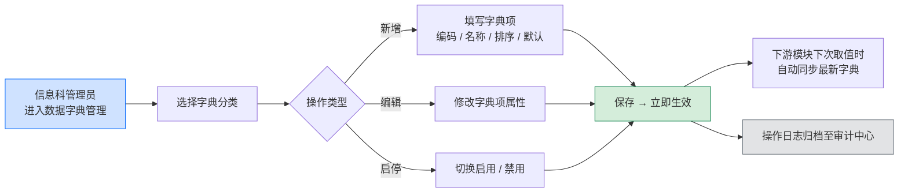

# 数据字典-需求说明书

统一管理智能体接入中心（及后续模块）所引用的所有「字典型」字段，提供信息科管理员可视化配置入口；下游表单、筛选器、状态标签等场景统一从字典服务取值，避免硬编码与多处重复维护。

### 模块目标

- **统一来源**：智能体接入中心、台账、评测、安全治理等模块涉及的下拉选项统一由本模块下发。
- **可配置**：信息科管理员可在 UI 中新增、编辑、排序、启停字典项，无需研发介入。
- **可追溯**：所有字典变更全程留痕，归档至审计中心（模块 12）。
- **可控防错**：对关键字典（如「智能体来源」「接入状态」）设置系统保留项，避免误删导致下游业务异常。

### 系统角色与权限

| **角色** | **可见范围** | **核心操作权限** |
| --- | --- | --- |
| ⭐ 信息科管理员 | 全部字典分类及字典项 | 新增、编辑、排序、启用 / 禁用字典项；新增自定义字典分类（仅非系统内置类）；导出字典 |
| 💻 信息科普通用户 | 仅可读，用于表单录入与下游引用；侧边栏不展示「系统设置 > 数据字典」入口 | 无配置权限 |
| 🩺 科室管理员 | 仅可读，用于表单录入；侧边栏不展示「系统设置 > 数据字典」入口 | 无配置权限 |

### 核心业务流程

### 字典分类清单（汇总）

下表汇总智能体接入中心当前涉及的全部字典分类，作为本模块首批必须支持的字典。后续其他模块新增字典时按相同规范扩展。

| **序号** | **字典分类** | **字典编码** | **分类来源** | **支持自定义** | **默认字典项** | **主要引用场景** |
| --- | --- | --- | --- | --- | --- | --- |
| 1 | 科室 | DEPT | 系统内置 | 否 | 影像科 / 检验科 / 内科 / 外科 / 急诊科 / 门诊办 / 信息科 ……（按医院组织架构） | 注册表单·所属科室；列表筛选·归属科室 |
| 2 | 诊疗环节 | CARE_STAGE | 系统内置 | 是 | 导诊分诊 / 预问诊 / 预约挂号 / 辅助检查 / 辅助诊断 / 辅助治疗 / 住院管理 / 其他 | 注册表单·诊疗环节 |
| 3 | 智能体来源 | AGENT_SOURCE | 系统内置 | 否 | 自研 / 第三方 / 合作研发 | 注册表单·智能体来源 |
| 4 | 智能体类型 | AGENT_TYPE | 系统内置 | 是 | 辅助诊断 / 影像分析 / 病历生成 / 用药审核 / 导诊分诊 / 其他 | 注册表单·智能体类型；列表筛选·智能体类型 |
| 5 | 接口地址 | API_PATH | 系统内置 | 是 | /chat / /predict / 其他（需要自定义填空） | 技术信息·接口地址 |
| 6 | 调用方式 | HTTP_METHOD | 系统内置 | 是 | GET / POST / PUT / DELETE / 其他（需要自定义填空） | 技术信息·调用方式 |
| 7 | 数据格式 | DATA_FORMAT | 系统内置 | 是 | JSON / XML / Form-data / 其他（需要自定义填空） | 技术信息·数据格式 |
| 8 | 认证方式 | AUTH_TYPE | 系统内置 | 是 | 不需要认证 / API Key 认证 / Token 认证 / 其他（需要自定义填空） | 技术信息·认证方式；API 接口管控·认证方式 |
| 9 | 健康检查地址 | HEALTH_CHECK | 系统内置 | 是 | /health / /status / 其他（需要自定义填空） | 技术信息·健康检查地址 |
| 10 | 退回原因（快选） | REJECT_REASON | 系统内置 | 是 | 技术信息不完整 / 备案材料缺失 / 风险评级与功能不匹配 / 命名不规范 / 其他 | 审核抽屉·退回说明常用原因 |

<aside>
💡

**「支持自定义」的含义**：在表单中除选择字典项外，是否允许用户选「其他」并手动填写一项一次性自定义值（不入库为新字典项）。是否允许在字典管理页新增字典项，则统一由「字典分类是否系统内置」决定。

</aside>

### 页面清单

| **页面** | **入口** | **主要用途** |
| --- | --- | --- |
| 字典分类列表页 | 侧边栏「系统设置 > 数据字典」 | 查看全部字典分类、进入字典项管理 |
| 字典项管理页 | 字典分类列表点击行进入 | 对单个字典分类下的字典项进行新增、编辑、排序、启停 |

### 1. 字典分类列表页 — 字段与交互

#### 页面布局

顶部为搜索 + 操作区，下方为字典分类列表。

**顶部操作区**

| **序号** | **元素** | **说明** | **可见角色** |
| --- | --- | --- | --- |
| 1 | 关键字搜索 | 按字典分类名称、编码模糊搜索 | 信息科管理员 |
| 2 | 新增字典分类 | 主操作按钮（Primary），用于扩展非系统内置字典分类；系统内置分类不可由此入口删除 | 信息科管理员 |
| 3 | 导出字典 | 按当前筛选条件导出 Excel（含分类与字典项明细） | 信息科管理员 |

**列表字段**

| **序号** | **列名** | **类型** | **说明** |
| --- | --- | --- | --- |
| 1 | 字典分类名称 | 文本链接 | 点击进入字典项管理页 |
| 2 | 字典编码 | 文本 | 全局唯一，大写字母 / 数字 / 下划线；下游模块通过编码取值 |
| 3 | 分类来源 | 标签 | 系统内置（灰）/ 自定义（蓝） |
| 4 | 启用状态 | 开关 | 禁用后该分类整体不在下游表单中可见（已选值仍保留显示） |
| 5 | 字典项数量 | 数字 | 当前启用 + 禁用字典项总数（鼠标悬浮显示明细） |
| 6 | 最近更新人 | 文本 | 最近一次更新该分类或其下字典项的操作人 |
| 7 | 最近更新时间 | 日期时间 | 精确到分钟 |
| 8 | 操作 | 按钮组 | 查看字典项 / 编辑 / 删除（仅自定义分类且字典项为空时可用） |

### 2. 字典项管理页 — 字段与交互

#### 页面布局

顶部展示**面包屑「数据字典 / {分类名称}」** 与分类基本信息（名称、编码、说明），中部为字典项列表 + 拖拽排序，右上角提供「新增字典项」「批量导入」入口。批量导入支持下载 Excel 模板（列含：字典项名称 / 编码 / 排序 / 是否默认 / 启用状态 / 备注），上传时按编码唯一性、必填项与格式预校验；失败行可下载错误明细 Excel，成功行直接入库并立即生效。

**字典项列表字段**

| **序号** | **列名** | **类型** | **说明** | **交互** |
| --- | --- | --- | --- | --- |
| 1 | 排序 | 拖拽柄 | 列表中字典项的展示顺序 | 鼠标按住拖拽，松开后自动保存 |
| 2 | 字典项名称 | 文本 | 表单中下拉项展示文本 | — |
| 3 | 字典项编码 | 文本 | 同一分类内唯一；下游存储与接口传值使用 | — |
| 4 | 是否默认 | 单选标记 | 一个分类至多一个默认项；下游表单首次打开时预选；系统保留项「其他（需自定义填空）」不可设为默认（开关置灰并提示） | 点击切换 |
| 5 | 是否系统保留 | 标签 | 系统保留项不可删除、不可改编码；可改名称与排序 | — |
| 6 | 启用状态 | 开关 | 禁用后下游表单不再展示，但历史已选值保留 | 点击切换；系统保留项不允许禁用 |
| 7 | 备注 | 文本 | 用途说明、维护备忘等 | — |
| 8 | 最近更新人 / 时间 | 文本 | 归档于操作日志 | 悬浮显示明细 |
| 9 | 操作 | 按钮组 | 编辑 / 删除（系统保留项不可删除） | — |

#### 新增 / 编辑字典项表单

以右侧抽屉形式打开，字段如下：

| **序号** | **字段名称** | **字段类型** | **必填** | **校验规则** |
| --- | --- | --- | --- | --- |
| 1 | 字典项名称 | 文本 | 是 | 2–20 字；同一分类内不可重复 |
| 2 | 字典项编码 | 文本 | 是 | 大写字母 / 数字 / 下划线，长度 2–32；同一分类内唯一；**被下游引用前可修改（操作留痕）**，**被引用后即锁定**；系统保留项编码一律锁定 |
| 3 | 排序 | 数字 | 否 | 非负整数，默认追加到末尾；亦可通过列表拖拽调整 |
| 4 | 是否默认 | 开关 | 否 | 同一分类至多一个默认项；切换默认会自动取消原默认项 |
| 5 | 启用状态 | 开关 | 是 | 默认启用；系统保留项无法关闭 |
| 6 | 备注 | 多行文本 | 否 | ≤200 字 |

抽屉底部按钮：取消 / 保存。保存后立即生效，下游下次取值即同步。

### 通用业务规则

- **系统内置 vs 自定义**：表中标注「支持自定义=否」的分类（如「智能体来源」「科室」）属于系统内置，不允许新增/删除字典项中的系统保留项；其余分类允许信息科管理员按需扩展字典项。
- **「其他（需要自定义填空）」处理**：该项作为字典分类的系统保留项默认存在，不可删除、不可禁用；表单端选中后弹出自定义填空输入框，自定义值仅本次注册有效，不写入字典。
- **启用 vs 删除**：优先采用「禁用」而非删除，避免影响历史数据回显；删除仅允许在无历史引用且非系统保留项时使用。
- **删除拦截**：删除字典项前系统自动校验下游引用，若存在引用则禁止删除并提示「该字典项已被 X 条记录引用（分布于 N 个模块），请改为禁用」；弹窗内提供「查看引用明细」按钮，按模块分组列出前 20 条引用（模块名 + 记录名称 + 链接），便于排查。
- **默认值变更**：切换默认项不影响已提交的历史记录，仅影响新表单的初始预选。
- **编码修改限制**：字典项编码作为下游业务的稳定标识，**被任何下游记录引用前**允许修改（操作留痕），**一旦被引用即锁定**；系统保留项编码一律锁定；如需替换已锁定的编码，请新增字典项后禁用旧项。
- **分类禁用的下游降级**：字典分类被整体禁用后，下游表单对应字段保留展示但下拉置灰不可选，提示「该字段因字典分类停用而暂不可填，请联系信息科管理员」；必填校验自动放行以避免业务断流，审计中心记录一条告警事件；已选历史值正常回显。
- **变更立即生效**：字典更新后下游模块在下次取值时同步最新内容，无需重启或人工通知。

### 字段引用关系

本节列出本期智能体接入中心各字段与字典分类的对应关系，便于排查问题时快速定位字典源头。

| **引用模块 · 字段** | **字典分类** | **取值方式** |
| --- | --- | --- |
| 注册表单·所属科室 | 科室（DEPT） | 下拉单选 |
| 注册表单·诊疗环节 | 诊疗环节（CARE_STAGE） | 下拉单选 + 「其他」自定义 |
| 注册表单·智能体来源 | 智能体来源（AGENT_SOURCE） | 下拉单选 |
| 注册表单·智能体类型 | 智能体类型（AGENT_TYPE） | 下拉单选 |
| 技术信息·接口地址 | 接口地址（API_PATH） | 下拉单选 + 「其他」自定义 |
| 技术信息·调用方式 | 调用方式（HTTP_METHOD） | 下拉单选 + 「其他」自定义 |
| 技术信息·数据格式 | 数据格式（DATA_FORMAT） | 下拉单选 + 「其他」自定义 |
| 技术信息·认证方式 | 认证方式（AUTH_TYPE） | 下拉单选 + 「其他」自定义；选 API Key / Token 时额外填凭据 |
| 技术信息·健康检查地址 | 健康检查地址（HEALTH_CHECK） | 下拉单选 + 「其他」自定义 |
| 审核抽屉·退回说明（快选） | 退回原因（REJECT_REASON） | 标签快选 + 自由输入 |
| 列表筛选·归属科室 / 智能体类型 / 接入状态 | 科室 / 智能体类型（接入状态由系统枚举，不在字典） | 下拉单选 |

<aside>
⚠️

**不入字典管理的枚举**：「接入状态」「对接状态」「风险等级」等属于系统业务状态机的核心枚举，由系统硬编码维护以保障状态流转的稳定性，不在数据字典模块开放配置。

</aside>

### 操作留痕

- 所有「新增 / 编辑 / 删除 / 启用 / 禁用 / 默认切换 / 排序调整」操作均记录操作人、操作时间、变更前后值，自动归档至 **审计中心（模块 12）**。
- 字典项管理页提供「变更历史」入口（默认折叠），展示该分类下最近 50 条变更记录，便于现场快速排查。

### 与其他模块的联动

| **模块** | **联动说明** |
| --- | --- |
| 智能体接入中心（模块 4） | 本期主要消费方，注册表单与列表筛选下拉项全部来源于此 |
| 统一台账中心（模块 5） | 展示字段（科室、智能体类型等）跟随字典最新名称同步刷新 |
| 统一准入评测沙盒（模块 6） | 风险等级（系统枚举）+ 智能体类型（字典）参与评测策略匹配 |
| 统一安全治理中心 / 监控中心 | 规则匹配可按「智能体类型」「诊疗环节」等字典维度配置 |
| 审计中心（模块 12） | 所有字典变更日志自动归档 |