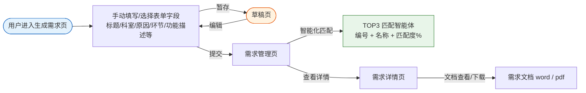

# 智能体建设需求管理-需求说明

面向全院业务方提供**标准化智能体建设需求**的收集、生成、匹配与管理能力：用户通过表单**手动录入/选择**建设诉求，系统将其结构化为规范需求文档，并与院内已纳管的智能体进行**智能化匹配**，自动推荐匹配度 TOP3 的智能体，避免重复建设、加速需求落地。

<aside>
ℹ️

**当前阶段说明**：本文档所有字段均由用户在表单中**手动输入或选择**完成，暂不支持通过智能体对话方式填写表单（后续版本再迭代对话式采集）。

</aside>

### 菜单结构与导航

<aside>
🧭

**目前仅有一个一级菜单入口，没有二级菜单**。点击侧边栏「智能体建设需求管理」（一级菜单）后，默认进入需求管理主页，页面顶部通过 **Tab** 切换以下两个列表：

- **需求管理列表 Tab**（对应 **1.1 需求管理页**）：默认选中，展示已提交的需求。
- **草稿列表 Tab**（对应 **1.3 草稿页**）：展示当前用户暂存的需求草稿。

**1.2 生成需求页** 与 **1.4 需求详情页** 均为页面级子路由，**不出现在菜单中**：

- 通过需求管理列表 Tab 右上角【生成需求】按钮进入 **1.2 生成需求页**。
- 通过需求管理列表 Tab 行内【查看详情】按钮进入 **1.4 需求详情页**。

Demo 路由需严格按此结构实现，避免在侧边栏挂出二级菜单或将 1.2 / 1.4 直接暴露为菜单项。

</aside>

<aside>
🔒

**访问范围**：

1.本模块面向**院内所有已认证用户**（信息科 IT 管理员、科室管理员）开放需求生成与查看能力；

2.「需求紧急程度」的最终核定由填写人员填写；

3.草稿仅创建者本人可见。

4.侧边栏一级入口对所有授权角色可见。

</aside>

### 核心页面清单

| **编号** | **页面名称** | **页面类型** | **主要用途** | **使用角色** |
| --- | --- | --- | --- | --- |
| 1.1 | 需求管理页 | 列表页 | 展示已生成的全部建设需求；页面右上角提供【生成需求】入口，行操作列仅包含【智能化匹配】与【查看详情】两个按钮 | IT 管理员 / 科室管理员 / 普通用户 |
| 1.2 | 生成需求页 | 表单页 | 用户手动填写/选择字段生成标准化需求，支持暂存与提交 | IT 管理员 / 科室管理员 / 普通用户 |
| 1.3 | 草稿页 | 列表页 | 管理当前用户暂存的需求草稿，支持继续编辑或删除 | 草稿创建者本人 |
| 1.4 | 需求详情页 | 详情页 | 查看已提交需求的完整字段与最新匹配结果，支持在编辑态下修改需求信息 | IT 管理员 / 科室管理员 / 普通用户 |

### 需求生成与匹配流程

<aside>
🔄

需求由用户在生成需求页手动填写/选择字段完成录入，可**暂存**至草稿或直接**提交**；提交后可在需求管理页对该需求执行**智能化匹配**，系统输出 TOP3 匹配智能体供参考。

</aside>

---

## 1. 需求管理

### 1.1 需求管理页

<aside>
📋

页面对应一级菜单默认进入后的【需求管理列表 Tab】，**只显示已生成好的需求**，草稿不在此 Tab 展示；支持按需求标题 / 提出科室 / 诊疗环节 / 需求紧急程度筛选与关键词搜索。页面顶部通过 **Tab** 切换【需求管理列表】与【草稿列表】（默认选中【需求管理列表】）；右上角提供【生成需求】主入口。**列表行操作列仅展示 2 个按钮：【智能化匹配】与【查看详情】**；需求文档的查看与下载（Word / PDF）均收拢至需求详情页（1.4）右上角，不在列表行重复曝露。

</aside>

**列表字段**

| **字段** | **说明 / 展示方式** | **备注** |
| --- | --- | --- |
| 序号 | 系统按创建先后自动生成 | — |
| 需求标题 | 用户手动输入，一句话概括需求，≤30 字，如"门诊智能预问诊助手"，避免与已有需求重复 | 主标题字段，支持关键词搜索 |
| 提出科室 | 下拉选择，来源于院内科室字典 | — |
| 提出原因 | 用户手动输入，简述业务背景与痛点，说明"为什么要建"，50-300 字 | 单元格默认省略号，悬浮 tooltip 展示全文 |
| 提出人 | 用户手动输入，支持用户修改 | 限制 2-10 个字，实时字数提示（X/10） |
| 联系方式 | 用户手动输入，支持用户修改 | 格式校验，限制 11 个数字，失焦校验手机号格式，错误提示"请输入正确的 11 位手机号" |
| 诊疗环节 | 用户单选：导诊分诊 / 预问诊 / 预约挂号 / 辅助检查 / 辅助诊断 / 辅助治疗 / 住院 / 手术 / 其他（填空） | "其他"选项，支持填空输入，实时字数提示（X/20） |
| 功能描述 | 用户手动输入，支持用户修改；
重点说明智能体工作内容、服务对象、输入信息、输出结果；
多行文本域，默认显示 5 行，超出可滚动；
字数限制 500 字以内，实时字数提示（X/500），超 500 字红色提示且不可继续输入；
参考示例：面向门诊患者开展预问诊服务，自动采集主诉、现病史、既往史等信息，形成标准化问诊摘要 | 单元格默认省略号，悬浮 tooltip 展示全文 |
| 所需资源 | 业务系统、模型 | 用户多选 |
| 匹配情况 | 执行"智能化匹配"按钮后回填；
系统基于建设需求信息自动匹配平台内已纳管的 3 个匹配度最高的智能体，展示最高的匹配度 | 点击行内【智能化匹配】按钮可查看/刷新 TOP3 匹配详情 |
| 需求紧急程度 | 高 / 中 / 低，可由提出人建议、管理员核定 | 最终由 IT 管理员核定 |
| 提出时间 | 系统自动记录需求提交时间，格式 YYYY-MM-DD HH:MM | — |

**图标/按钮 与 交互说明**

| **位置** | **按钮** | **交互说明** |
| --- | --- | --- |
| 页面级 | 生成需求 | 点击【生成需求】，进入生成需求页（1.2） |
| 列表行操作（操作列） | 智能化匹配 | 点击【智能化匹配】，系统生成平台内已纳管的 3 个匹配度最高的智能体（展示智能体编号、智能体名称及匹配度%），并将「最高匹配度」回填至列表「匹配情况」列 |
| 列表行操作（操作列） | 查看详情 | 点击【查看详情】，进入需求详情页（1.4）；需求文档的查看与下载（Word / PDF）入口不在列表行操作列展示，统一收拢至需求详情页右上角 |

### 1.2 生成需求页

<aside>
📝

页面为**结构化需求表单**，用户按字段说明**手动输入或选择**填写建设需求；表单实时校验字数与格式，校验通过后方可提交。当前阶段暂不支持通过智能体对话方式自动填写表单。

</aside>

**字段**

| **字段** | **说明 / 填写方式** | **备注** |
| --- | --- | --- |
| 需求标题 | 用户手动输入，一句话概括需求，≤30 字，如"门诊智能预问诊助手"，避免与已有需求重复 | — |
| 提出科室 | 下拉选择，来源于院内科室字典 | — |
| 提出原因 | 用户手动输入，简述业务背景与痛点，说明"为什么要建"，50-300 字 | — |
| 提出人 | 用户手动输入，支持用户修改 | 限制 2-10 个字，实时字数提示（X/10） |
| 联系方式 | 用户手动输入，支持用户修改 | 格式校验，限制 11 个数字，失焦校验手机号格式，错误提示"请输入正确的 11 位手机号" |
| 诊疗环节 | 用户单选：导诊分诊 / 预问诊 / 预约挂号 / 辅助检查 / 辅助诊断 / 辅助治疗 / 住院 / 手术 / 其他（填空） | "其他"选项，支持填空输入，实时字数提示（X/20） |
| 功能描述 | 用户手动输入，支持用户修改；
重点说明智能体工作内容、服务对象、输入信息、输出结果；
多行文本域，默认显示 5 行，超出可滚动；
字数限制 500 字以内，实时字数提示（X/500），超 500 字红色提示且不可继续输入；
参考示例：面向门诊患者开展预问诊服务，自动采集主诉、现病史、既往史等信息，形成标准化问诊摘要 | — |
| 所需资源 | 业务系统、模型 | 用户多选 |
| 匹配情况 | 执行"智能化匹配"按钮后回填；
系统基于建设需求信息自动匹配平台内已纳管的 3 个匹配度最高的智能体，展示最高的匹配度 | — |
| 需求紧急程度 | 高 / 中 / 低，可由提出人建议、管理员核定 | 用户建议值，最终由管理员核定 |

**图标/按钮 与 交互说明**

| **按钮** | **交互说明** |
| --- | --- |
| 暂存 | 点击【暂存】，生成需求记录落入草稿页（1.3），不做必填校验；
提示"已暂存到草稿" |
| 提交 | 点击【提交】，弹出"确认是否提交"二次确认弹窗；
确认后校验所有必填字段与格式（联系方式手机号、功能描述字数、提出原因字数等），校验通过完成提交并跳转到需求管理页（1.1），校验失败时定位到首个错误字段并气泡提示 |

### 1.3 草稿页

<aside>
📄

页面对应一级菜单默认进入后的【草稿列表 Tab】，展示当前登录用户暂存的建设需求，仅创建者本人可见与操作；支持按需求标题模糊搜索；可通过顶部 Tab 回到【需求管理列表】。

</aside>

**列表字段**

| **字段** | **说明 / 展示方式** | **备注** |
| --- | --- | --- |
| 序号 | 系统按创建先后自动生成 | — |
| 需求标题 | 用户手动输入，一句话概括需求，≤30 字，如"门诊智能预问诊助手"，避免与已有需求重复 | — |
| 提出科室 | 下拉选择，来源于院内科室字典 | — |
| 提出原因 | 用户手动输入，简述业务背景与痛点，说明"为什么要建"，50-300 字 | — |
| 提出人 | 用户手动输入，支持用户修改 | 限制 2-10 个字，实时字数提示（X/10） |
| 联系方式 | 用户手动输入，支持用户修改 | 格式校验，限制 11 个数字，失焦校验手机号格式，错误提示"请输入正确的 11 位手机号" |
| 诊疗环节 | 用户单选：导诊分诊 / 预问诊 / 预约挂号 / 辅助检查 / 辅助诊断 / 辅助治疗 / 住院 / 手术 / 其他（填空） | "其他"选项，支持填空输入，实时字数提示（X/20） |
| 功能描述 | 用户手动输入，支持用户修改；重点说明智能体工作内容、服务对象、输入信息、输出结果；多行文本域，默认显示 5 行，超出可滚动；字数限制 500 字以内，实时字数提示（X/500），超 500 字红色提示且不可继续输入；参考示例：面向门诊患者开展预问诊服务，自动采集主诉、现病史、既往史等信息，形成标准化问诊摘要 | — |
| 所需资源 | 业务系统、模型 | 用户多选 |
| 匹配情况 | 执行"智能化匹配"按钮后回填；系统基于建设需求信息自动匹配平台内已纳管的 3 个匹配度最高的智能体，展示最高的匹配度 | 草稿阶段未触发匹配时显示"—" |
| 需求紧急程度 | 高 / 中 / 低，可由提出人建议、管理员核定 | — |
| 最后更新时间 | 系统自动记录需求提交时间，格式 YYYY-MM-DD HH:MM | 草稿页记录最近一次暂存时间 |

**图标/按钮 与 交互说明**

| **按钮** | **交互说明** |
| --- | --- |
| 编辑 | 点击【编辑】，进入生成需求页（1.2），带入当前草稿全部已填字段，用户继续手动编辑表单 |
| 删除 | 点击【删除】，弹出"确认是否删除该草稿"二次确认：
·点击【是】草稿记录从草稿列表页删除；
·点击【否】回到草稿页 |

### 1.4 需求详情页

<aside>
🔎

展示已提交需求的完整字段与最新一次智能化匹配结果。页面默认为**只读态**，支持通过【编辑】按钮切换至**编辑态**修改需求信息（除「提出时间」系统字段外，其余字段均可编辑，字段与校验规则与 1.2 生成需求页完全一致）；保存后立即生效并回填至需求管理列表。页面右上角提供【查看需求文档】与【下载需求文档】（下拉选择 Word / PDF）入口。

</aside>

**字段**

| **字段** | **说明 / 展示方式** | **备注** |
| --- | --- | --- |
| 需求标题 | 用户手动输入，一句话概括需求，≤30 字，如"门诊智能预问诊助手"，避免与已有需求重复 | 页面主标题；编辑态下可修改 |
| 提出科室 | 下拉选择，来源于院内科室字典 | 编辑态下可修改 |
| 提出原因 | 用户手动输入，简述业务背景与痛点，说明"为什么要建"，50-300 字 | 编辑态下可修改 |
| 提出人 | 用户手动输入，支持用户修改 | 限制 2-10 个字，实时字数提示（X/10） |
| 联系方式 | 用户手动输入，支持用户修改 | 格式校验，限制 11 个数字，失焦校验手机号格式，错误提示"请输入正确的 11 位手机号" |
| 诊疗环节 | 用户单选：导诊分诊 / 预问诊 / 预约挂号 / 辅助检查 / 辅助诊断 / 辅助治疗 / 住院 / 手术 / 其他（填空） | "其他"选项，支持填空输入，实时字数提示（X/20） |
| 功能描述 | 用户手动输入，支持用户修改；
重点说明智能体工作内容、服务对象、输入信息、输出结果；
多行文本域，默认显示 5 行，超出可滚动；
字数限制 500 字以内，实时字数提示（X/500），超 500 字红色提示且不可继续输入；
参考示例：面向门诊患者开展预问诊服务，自动采集主诉、现病史、既往史等信息，形成标准化问诊摘要 | 只读展示，保留原始换行 |
| 所需资源 | 业务系统、模型 | — |
| 匹配情况 | 执行"智能化匹配"按钮后回填；系统基于建设需求信息自动匹配平台内已纳管的 3 个匹配度最高的智能体（智能体编号 + 智能体名称 + 匹配度%），展示最高的匹配度 | 点击行内智能体可跳转至该智能体的 360 画像视图 |
| 需求紧急程度 | 高 / 中 / 低，可由提出人建议、管理员核定 | 管理员核定后为最终值 |
| 提出时间 | 系统自动记录需求提交时间，格式 YYYY-MM-DD HH:MM | — |

**图标/按钮 与 交互说明**

| **按钮** | **交互说明** |
| --- | --- |
| 查看需求文档 | 页面右上角，只读态与编辑态均展示。点击【查看需求文档】，打开需求文档预览页/弹层，在线预览基于该条需求渲染的标准化需求文档 |
| 下载需求文档 | 页面右上角，只读态与编辑态均展示。**下拉按钮**，点击展开选项：
·【下载 Word】：下载当前需求的标准化需求文档 word 版；
·【下载 PDF】：下载当前需求的标准化需求文档 pdf 版 |
| 编辑 | 只读态展示。
点击【编辑】，页面切换至**编辑态**：除「提出时间」外全部字段变为可编辑控件，字段与校验规则同 1.2 生成需求页；
同时将页面按钮切换为【保存】【取消】 |
| 保存 | 编辑态展示。
点击【保存】，弹出"确认是否保存修改"二次确认弹窗；
确认后校验所有必填字段与格式（联系方式手机号、功能描述字数、提出原因字数等），校验通过完成更新并将修改同步回填至需求管理列表，页面回到只读态；
校验失败时定位到首个错误字段并气泡提示 |
| 取消 | 编辑态展示。
点击【取消】：若字段有改动则弹出"未保存的修改将会丢失，确认取消编辑？"二次确认，确认后放弃修改并回到只读态；
无改动则直接回到只读态 |
| 返回 | 只读态展示。
点击【返回】，回到上一页（来源为需求管理页或草稿页）；编辑态下隐藏该按钮 |

---

## 附录：智能化匹配逻辑说明

<aside>
🧠

智能化匹配为本模块核心能力，用于将当前建设需求与平台已纳管智能体进行相似度评估，输出 TOP3 推荐结果。当前阶段匹配触发均由**用户手动点击【智能化匹配】按钮**发起，不通过对话式交互执行。

</aside>

- **触发时机**：需求管理页行内点击【智能化匹配】按钮**手动触发/刷新**；生成需求页提交前可选点击"智能化匹配"预览 TOP3。
- **匹配维度**（建议权重可配置）：
    1. 诊疗环节一致性；
    2. 功能描述语义相似度（向量召回）；
    3. 所需资源（业务系统、模型）交集；
    4. 提出科室 / 服务对象匹配度。
- **输出**：TOP3 智能体，字段为**智能体编号、智能体名称、匹配度%**；列表列仅回填「最高匹配度」，TOP3 详情在弹层 / 详情页展示。
- **兜底策略**：若平台内无匹配智能体，匹配度均为0%，则展示提示"暂无匹配智能体"并保留匹配结果为空。