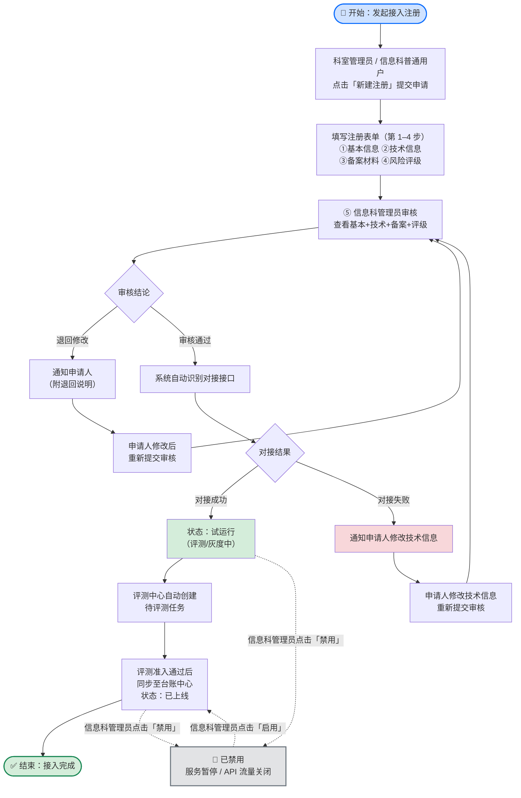
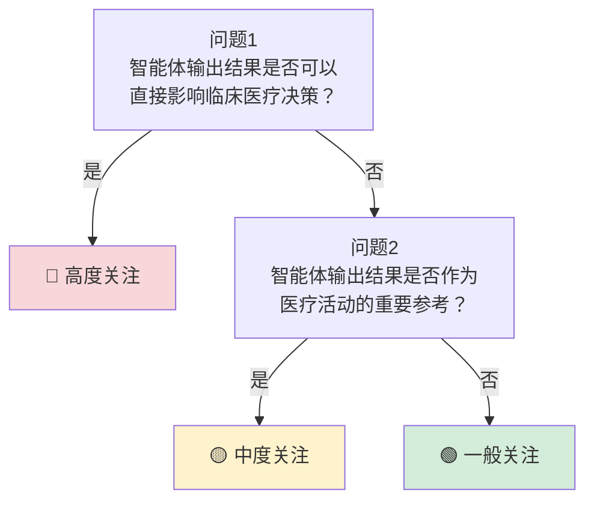
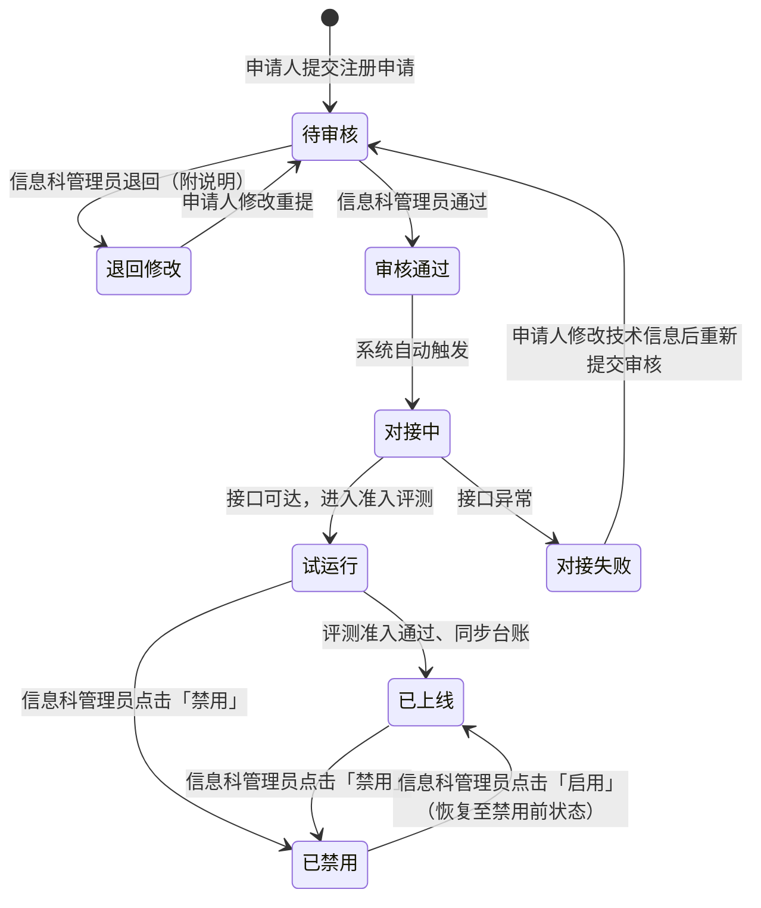

# 智能体接入中心-需求说明书

智能体统一接入门户，含注册录入、API 接口统一管控、启用/禁用管控，支持不同技术架构、供应来源、部署形态的智能体纳管。

### 系统角色说明

本模块涉及 **3 类角色**，分工如下：

| **角色** | **职责** | **典型场景** |
| --- | --- | --- |
| 科室管理员 | 提交本科室临床智能体的注册申请 | 例：影像科申请新的影像分析智能体 |
| 信息科普通用户 | 提交信息科主导类（基础设施、跨科室共用、第三方采购）智能体的注册申请 | 例：信息科为全院引入统一的导诊智能体 |
| 信息科管理员 | 可提交注册申请（同样走审核流程，全程留痕）、审核所有注册申请（通过 / 退回）、禁用 / 启用智能体、全院记录与 API 接口管控 | 例：信息科管理员提交某跨科室共用智能体后由另一位信息科管理员审核 |

### 核心业务流程

**1. 接入流程闭环：** 注册 → 审核 → 自动对接 →（失败回审核 / 成功）→ 试运行（评测中心准入评测）→ 评测通过同步台账并正式上线

**2. 启用/禁用管控：** 信息科管理员对「试运行」或「已上线」记录点击「禁用」→ 服务暂停；对「已禁用」记录点击「启用」→ 服务恢复




### 功能说明

| **一级功能** | **二级功能** | **功能说明** |
| --- | --- | --- |
| 注册备案管理 | 智能体注册录入 | 设置注册表单，支持录入智能体基础信息并批量导入，推进台账同步与归档 |
| 接入管控 | API 接口统一管控 | 统一管理智能体接口方式，支持不同技术架构、供应来源、部署形态的标准化接入 |
| 启用/禁用管控 | 智能体启用与禁用 | 信息科管理员对已接入智能体执行禁用（暂停服务、关闭 API 流量）或启用（恢复服务），台账状态同步，完整记录操作人、时间与原因日志 |

### 核心页面清单（整合后）

| **页面名称** | **对应二级功能** | **页面类型** | **主要用途** | **使用角色** |
| --- | --- | --- | --- | --- |
| 智能体接入管理页 | 智能体注册录入 + 智能体启用/禁用 | 列表 + 表单 + 流程页 | 智能体接入记录列表，右上角「新建注册」发起新接入；信息科管理员可在列表中对已接入智能体点击「禁用/启用」按钮 | 信息科管理员、信息科普通用户、科室管理员 |
| API 接口管控页 | API 接口统一管控 | 列表 + 详情页 | 管理接口配置与对接状态，异常通知修正，成功后同步台账 | 信息科管理员 |

### 设计要点

- **页面主体是列表**：默认展示全部智能体的接入记录（含待审核、试运行、已上线、已禁用等各状态），并通过顶部 Tab 快速切换关注分组
- **新建注册**：页面右上角「新建注册」按钮，点击后弹出注册表单（抽屉或弹窗形式）
- **禁用/启用**：**信息科管理员** 在列表中选择「试运行」或「已上线」的智能体，操作列点击「禁用」按钮（带二次确认）即可暂停服务；对「已禁用」记录点击「启用」可恢复服务
- **减少页面跳转**：用户在一个页面内完成"查看列表→新建注册→跟踪状态→禁用/启用"的完整闭环，无需在多个二级菜单间切换

### 4-1 智能体接入管理页 — 字段与交互

### 页面概述

| 属性 | 说明 |
| --- | --- |
| 页面类型 | 列表 + 表单 + 流程页 |
| 使用角色 | 信息科管理员、信息科普通用户、科室管理员 |
| 对应功能 | 智能体注册录入 + 智能体启用/禁用 |
| 入口 | 侧边栏「智能体接入中心」 |

### 页面布局

页面整体为列表页结构，顶部为 Tab 分组 + 筛选栏 + 操作按钮区，下方为智能体接入记录列表。

**Tab 分组与计数**

页面顶部以 Tab 形式按"用户关注度"组织接入记录，每个 Tab 自带数量角标，避免在长列表中翻找；Tab 之间互斥，Tab 内可继续使用「接入状态」做二级筛选。

| **Tab** | **包含状态** | **用途** |
| --- | --- | --- |
| 全部 | 所有状态 | 完整列表总览 |
| 待审核 | 待审核 | 信息科管理员待办（审核动作） |
| 处理中 | 对接中、对接失败、退回修改 | 在途或需跟进的中间态，集中暴露给申请人与信息科管理员 |
| 试运行 | 试运行 | 对接成功后进入评测中心准入评测 / 灰度阶段，尚未正式上线 |
| 已上线 | 已上线 | 评测准入通过、同步至台账中心、正式对外服务 |
| 已禁用 | 已禁用 | 信息科管理员主动暂停服务 |

说明：所有 Tab 的数量角标统一使用常规样式（与「全部」一致），不再单独对「处理中」「试运行」做红/橙色强调，保持视觉一致；优先级提示通过列表内的「接入状态」标签颜色承载。

**顶部操作区**

| **序号** | **元素** | **说明** | **交互** | **可见角色** |
| --- | --- | --- | --- | --- |
| 1 | 新建注册 | 主操作按钮（Primary），位于页面右上角 | 点击打开注册表单抽屉 | 科室管理员、信息科普通用户、信息科管理员 |
| 2 | 批量导入 | 次操作按钮，位于「新建注册」左侧 | 点击打开批量导入弹窗（下载模板 + 上传文件） | 信息科普通用户、信息科管理员 |
| 3 | 导出列表 | 次操作按钮 | 按当前筛选条件导出 Excel | 信息科管理员 |

**筛选与搜索**

| **序号** | **筛选项** | **类型** | **说明** |
| --- | --- | --- | --- |
| 1 | 关键字搜索 | 文本输入 | 按智能体名称模糊搜索 |
| 2 | 接入状态 | 下拉筛选 | 作为 Tab 内二级筛选，可选：待审核 / 退回修改 / 对接中 / 对接失败 / 试运行 / 已上线 / 已禁用 |
| 3 | 归属科室 | 下拉筛选 | 信息科管理员 / 信息科普通用户可见，按科室过滤；科室管理员自动锁定本科室 |
| 4 | 智能体类型 | 下拉筛选 | 辅助诊断 / 影像分析 / 病历生成 / 用药审核 / 导诊分诊等 |

**列表字段**

| **序号** | **列名** | **类型** | **说明** | **交互** |
| --- | --- | --- | --- | --- |
| 1 | 智能体名称 | 文本链接 | 智能体唯一标识 | 点击打开详情抽屉 |
| 2 | 智能体类型 | 标签 | 辅助诊断 / 影像分析等 | — |
| 3 | 归属科室 | 文本 | 所属科室 | — |
| 4 | 供应商 | 文本 | 供应商/开发方 | — |
| 5 | 接入状态 | 状态标签 | 待审核（蓝）
退回修改（橙）
对接中（蓝）
对接失败（红）
试运行（青）
已上线（绿）
已禁用（灰） | — |
| 6 | 提交时间 | 日期时间 | 注册提交时间 | — |
| 7 | 失败原因 | 文本 | 仅对接失败时显示 | — |
| 8 | 操作 | 按钮组 | 按状态动态显示（见下方操作说明） | — |

**列表操作按钮逻辑**

| **接入状态** | **可用操作** | **说明** |
| --- | --- | --- |
| 待审核 | 查看详情 / 审核（仅信息科管理员） | 等待信息科管理员审核 |
| 退回修改 | 修改重提 / 查看退回说明 | 根据退回说明修改后重新提交审核 |
| 对接中 | 查看详情 | 审核通过，等待系统自动对接 |
| 试运行 | 查看详情 / **禁用（仅信息科管理员）** | 对接成功，处于评测中心准入评测或灰度阶段 |
| 已上线 | 查看详情 / **禁用（仅信息科管理员）** | 评测准入通过、已同步台账，正式对外服务 |
| 对接失败 | 修正重提 / 查看详情 | 修改技术信息后重新提交，再次进入信息科管理员审核环节 |
| 已禁用 | 查看详情 / **启用（仅信息科管理员）** | 已被禁用，信息科管理员可点击「启用」恢复服务 |

### 注册表单与审核流程（5 步）

**第 1 步 基本信息 → 第 2 步 技术信息 → 第 3 步 备案材料 → 第 4 步 风险评级（申请人填写提交）→ 第 5 步 信息科管理员审核**

- **第 1–4 步（申请人）**：**科室管理员**、**信息科普通用户** 或 **信息科管理员** 从页面右上角「新建注册」打开抽屉，按向导逐步填写。抽屉顶部展示步骤条与进度，底部根据所处步骤动态显示「上一步 / 下一步 / 提交注册」按钮。步骤条仅保留序号与步骤名称（基本信息 / 技术信息 / 备案材料 / 风险评级），不在步骤名下方附加任何二级说明（如「11 项字段」「接口与认证」「PDF 上传」「问卷」等），以保持顶部轻量、引导用户聚焦当前表单内容。
- **第 5 步（审核人）**：**信息科管理员** 在列表中筛选「待审核」记录，点击「审核」打开审核抽屉查看注册信息并给出审核结论：审核通过 / 退回修改（附说明）。

<aside>
👥

**填写责任分工**：

1、临床/科室主导的智能体由 **科室管理员** 填写并提交；

2、信息科主导的智能体（如基础设施类、跨科室共用类、第三方采购类）由 **信息科普通用户** 或 **信息科管理员** 填写并提交。

**3、所有注册申请（包括信息科管理员本人提交的）统一进入审核环节**，由信息科管理员审核（建议由另一位信息科管理员审核以避免自审；若仅一名管理员可自审），所有提交与审核行为全程留痕并归档至审计中心。

</aside>

#### 表单交互与布局规范（统一适用于第 1–4 步）

- **栅格布局**：抽屉表单采用 **2 列等宽栅格**（左右各 50%）从上到下、从左到右逆序填入；同一行两列字段的顶部与底部必须对齐，**不允许在中间出现单列空位或“半行”留白**；多行文本框（如「功能描述」）独占整行 100% 宽度。
- **字段名与提示**：必填字段在字段名前显示红色 `*`；如需补充说明（命名规则、字典口径、示例等），在字段名右侧追加灰色 `ⓘ` 图标，鼠标悬浮弹出气泡 Tooltip 呈现详情（最多 2 行，交互参照「统一运行监控中心 → 指标提示」）。
- **输入框下方**：默认不呈现说明性长文案，仅保留两类信息：
    - **Placeholder**：示例值（如「如：导诊智能体」「11 位手机号」），灰色占位，输入后消失。
    - **校验错误提示**：触发校验失败时即时显示红色文案（如「请输入 4–10 字」「手机号格式不正确」）。
- **行高一致**：每行字段底部预留一致高度，避免左右两列因提示行差异产生错位与空白栏位。
- **迁移说明**：下文各步骤表格中「说明」「校验规则」列均为 PRD 编写口径，**最终 UI 上应输出到 `ⓘ` Tooltip / placeholder / 校验错误提示**，不再以输入框下方长文案的形式呈现。
- **步骤性提示语位置**：需要在填写前告知申请人的说明性文案（如“技术信息作为后续接口对接基线参数，提交后可由信息科管理员在「API 接口管控」中调整”）统一以浅色 info Banner（蓝底 + `ⓘ` 图标）**放在步骤标题下方**，不放在表单底部；底部区域仅保留「上一步 / 下一步 / 取消 / 提交注册」操作按钮，避免与提示文案抢焦点或被误认为提交结果提示。

#### 第 1 步｜基本信息填写

基本信息共 11 项字段，其中「所属科室」「诊疗环节」「智能体来源」「智能体类型」统一取「系统字典配置数据」；「智能体编号」由系统自动生成；提交人账号不在表单中展示，提交时隐性归档于审计中心供责任追溯。

**栅格布局**（去除联系人邮箱后的最新排版，左右各 50%，共 6 行）：

- 行 1：智能体名称 ｜ 智能体编号
- 行 2：所属科室 ｜ 诊疗环节
- 行 3：智能体来源 ｜ 供应商名称
- 行 4：智能体联系人 ｜ 联系人手机号
- 行 5：智能体类型 ｜ 智能体版本
- 行 6：功能描述（整行 100% 宽度，多行文本框）

| **序号** | **字段名称** | **字段类型** | **必填** | **校验规则** | **说明** |
| --- | --- | --- | --- | --- | --- |
| 1 | 智能体名称 | 文本 | 是 | ≤20 字；与已纳管智能体重名时自动提醒 | 示例：导诊智能体 / 预问诊智能体（不再强制“核心能力+智能体”命名格式） |
| 2 | 智能体编号 | 只读文本（自动生成） | 是（自动） | 规则“科室编号-准入顺序号”，顺序号 4 位补零；提交后由系统自动生成，不可修改 | 示例：YX-0001（YX 为影像科编号）；作为全院唯一标识贯穿接入 / 评测 / 台账 / 审计全流程 |
| 3 | 所属科室 | 下拉单选（取字典配置数据） | 是 | 科室管理员自动锁定本科室，不可修改；信息科普通用户 / 信息科管理员可选择任意科室 | 字典来源：系统「科室」字典配置 |
| 4 | 诊疗环节 | 下拉单选（取字典配置数据）+ 自定义 | 是 | 选“其他”时需手动填写诊疗环节名称 | 字典示例：导诊分诊 / 预问诊 / 预约挂号 / 辅助检查 / 辅助诊断 / 辅助治疗 / 住院管理 / 其他（填空） |
| 5 | 智能体来源 | 下拉单选（取字典配置数据） | 是 | — | 字典示例：自研 / 第三方 / 合作研发 |
| 6 | 供应商名称 | 文本 | 是 | 必须填写供应商全称 | 自研可填写本院或本科室全称；合作研发填写主要合作方全称 |
| 7 | 智能体联系人 | 文本 | 是 | 2–20 字 | 供应商 / 开发方侧的项目对接人姓名，用于对接异常、问题反馈、版本迭代等场景的快速联系 |
| 8 | 联系人手机号 | 文本 | 是 | 11 位大陆手机号；格式校验 | 智能体联系人的手机号，用于快速联系对接人 |
| 9 | 智能体类型 | 下拉单选（取字典配置数据） | 是 | — | 字典示例：辅助诊断 / 影像分析 / 病历生成 / 用药审核 / 导诊分诊等 |
| 10 | 功能描述 | 多行文本 | 是 | ≤500 字 | 重点说明工作内容、服务对象、输入信息、输出结果。参考示例：“面向门诊患者开展预问诊服务，自动采集主诉、现病史、既往史等信息，形成标准化问诊摘要” |
| 11 | 智能体版本 | 可输入下拉框（AutoComplete） | 是 | 仅允许「数字.数字」格式，如 1.0、1.1、2.3 | 下拉提供常用主版本（1.0、2.0、3.0…）；可手动输入小版本号如 1.1、1.2、1.3 以支持迭代版本 |

#### 第 2 步｜技术信息填写

技术信息共 6 项字段，覆盖智能体服务的访问入口、接口路径、调用方式、数据格式、认证方式与健康检查地址；下拉项统一「取字典配置数据」并支持「其他（需要自定义填空）」，以适配不同技术架构与供应方。

<aside>
ℹ️

**填写前提示**（置于步骤标题下方、表单字段之上，**不放在表单底部**）：

技术信息作为后续接口对接与对接日志的基线参数，提交后可由信息科管理员在「API 接口管控」中调整；填写时如有不确定的取值，可先提交后续调优，不必反复修改。

</aside>

| **序号** | **字段名称** | **字段类型** | **必填** | **校验规则** | **说明** |
| --- | --- | --- | --- | --- | --- |
| 1 | 服务访问地址 | 文本 | 是 | 必须包含“协议 + IP（或域名）+ 端口”三段式；协议限 http/https | 智能体服务在医院内网中的访问地址，示例：[http://10.10.10.20:8080](http://10.10.10.20:8080) |
| 2 | 接口地址 | 下拉单选（取字典配置数据）+ 自定义 | 是 | 选“其他”时需手动填写自定义路径，需以 / 开头 | 字典示例：/chat、/predict、其他（需要自定义填空） |
| 3 | 调用方式 | 下拉单选（取字典配置数据）+ 自定义 | 是 | 选“其他”时需手动填写自定义调用动词 | 字典示例：GET、POST、PUT、DELETE、其他（需要自定义填空） |
| 4 | 数据格式 | 下拉单选（取字典配置数据）+ 自定义 | 是 | 选“其他”时需手动填写自定义格式名 | 字典示例：JSON、XML、Form-data、其他（需要自定义填空） |
| 5 | 认证方式 | 下拉单选（取字典配置数据）+ 自定义 | 是 | 选“API Key 认证 / Token 认证”时需填写认证凭据（加密存储）；选“其他”时需手动填写认证方式名与凭据 | 字典示例：不需要认证、API Key 认证、Token 认证、其他（需要自定义填空） |
| 6 | 健康检查地址 | 下拉单选（取字典配置数据）+ 自定义 | 是 | 选“其他”时需手动填写自定义路径，需以 / 开头 | 字典示例：/health、/status、其他（需要自定义填空） |

#### 第 3 步｜备案材料上传

<aside>
ℹ️

**填写前提示**（位于步骤标题下方、上传区之上，**不放在上传区底部**）：

**必须上传**：产品说明书、技术规格书（含 API 接口文档）

**可补充上传**：安全测试报告、部署环境说明书等其他材料

</aside>

**上传组件**：单个统一的文件上传区（点击或拖拽上传），不按材料名称拆分多个上传槽；申请人一次性选择所有需上传的 PDF，已上传文件以文件名列表呈现，支持逐条删除与重新上传。

**上传规则**：① 仅限 PDF 格式；② 支持多文件上传；③ 单文件 ≤ 50MB。

**材料内容参考**（仅侜 PRD 口径与帮助中心采用，不在上传组件中以表格拆分字段展示）：

- 产品说明书（必须上传）：产品名称、产品简介、主要功能、适用业务场景、开发单位及技术联系人、产品版本等。
- 技术规格书（必须上传）：API 接口文档，包括接口地址、请求方式、请求参数、返回参数、数据格式、请求示例、返回示例、错误码说明、认证方式、健康检查地址等。
- 其他材料（可补充上传）：安全测试报告、部署环境说明书等。

#### 第 4 步｜问卷填写（风险评级）

根据下列 2 道递进式问题自动判定智能体风险等级，评级结果将作为后续准入评测、监控告警与权限管控的关键依据。

**判断逻辑**



**问卷题目（递进式展示）**

问卷采用 2 道递进式问题，UI 上默认仅展示问题1 + 典型场景示例；问题1 选「是」立即判定为高度关注并隐藏问题2，选「否」展开问题2；问题2 选「是」判定为中度关注、选「否」判定为一般关注，问卷至此结束。**选项区域只显示「是 / 否」，不附带任何风险等级标签或 emoji 颜色提示**——评级结果统一在问卷下方的「评级结果卡片」中呈现，避免在用户决策前暴露答案。

下表为 PRD 判定逻辑说明，并非 UI 实际呈现：

| **题号** | **问题** | **典型场景** | **对应风险等级（仅评级结果卡片体现）** |
| --- | --- | --- | --- |
| 问题1 | 智能体输出结果是否可以直接影响临床医疗决策？ | 诊断建议、治疗建议、用药建议、手术方案建议、检查项目推荐等 | 选「是」→ 🔴 高度关注
选「否」→ 展开问题2 |
| 问题2 | 智能体输出结果是否作为医疗活动的重要参考？ | 医学数据分析、医学图像处理、自动测量、自动分割、三维重建等 | 选「是」→ 🟡 中度关注
选「否」→ 🟢 一般关注 |

**交互规则**

- 每题 UI 元素仅包含：**题目文本 → 是 / 否 选项 → 典型场景示例（浅灰小字）**；选项旁不出现风险标签、emoji 或颜色提示，避免决策前暴露答案。
- **问题1 选「是」**：立即判定为 🔴 高度关注，隐藏问题2。
- **问题1 选「否」**：自动展开问题2。
- **问题2 选「是」**：判定为 🟡 中度关注。
- **问题2 选「否」**：判定为 🟢 一般关注。
- 当前题不再追加任何评级标签，评级结果集中在问卷下方「评级结果卡片」中统一展示。
- 已答题目可点击重选，重选后后续题目与评级结果卡片随之刷新。

**评级结果卡片**

- **位置**：问卷下方独立区块，与底部操作栏之间；仅在产生有效评级后出现，未答题时保持隐藏，不占首屏空间。
- **内容**：① 彩色标签（🔴 高度关注 / 🟡 中度关注 / 🟢 一般关注）+ 等级文字；② 一句话说明该等级的关注度与下游影响（如“评级将作为后续准入评测维度与监控告警阈值的依据”）。
- **样式**：浅色背景卡片（绿 / 黄 / 红淡背景对应等级），16–20px 标签字号 + 12–14px 说明文字；不使用大尺寸圆形对勾或动画，保持表单整体节奏。

#### 抽屉底部操作（按所处步骤动态显示）

| **按钮** | **显示步骤** | **说明** |
| --- | --- | --- |
| 上一步 | 第 2 / 3 / 4 步 | 返回上一步，已填写内容保留 |
| 下一步 | 第 1 / 2 / 3 步 | 校验当前步骤必填项后进入下一步 |
| 提交注册 | 仅第 4 步 | 校验全部步骤必填项后提交，状态变为"待审核"，由信息科管理员审核 |
| 取消 | 所有步骤 | 关闭抽屉，已填写内容将丢失（二次确认） |

#### 第 5 步｜信息科管理员审核

申请人（科室管理员 / 信息科普通用户）完成第 1–4 步并提交后，注册记录进入「待审核」状态。**信息科管理员** 在列表中点击「待审核」记录的「审核」按钮，从页面右侧滑出审核抽屉。

**抽屉布局（3 层结构）**

抽屉自上而下分为三层，遵循"先看材料 → 再做决定"的审核心智，避免在 Tab 中嵌入审核操作导致语义混淆。

| **层级** | **内容** | **说明** |
| --- | --- | --- |
| ① Header | 智能体名 · 申请人 · 提交时间 | 一行小字呈现申请上下文，常驻可见，不占独立 banner |
| ② Tab 内容区（主体） | 4 个 Tab：基本信息 / 技术信息 / 备案材料 / 风险评级 | 仅做只读信息查看；审核人查阅过的 Tab 标题旁出现浅色「✓」点，辅助确认 4 项是否都看完；Tab 内容区独立滚动，不被底部操作栏鱼尾 |
| ③ 底部操作栏（常驻） | [暂不处理]　[退回修改]　[审核通过] | 「审核通过」为 Primary Solid；「退回修改」为带警示色边框的 Default 按钮（避免双 Primary）；「暂不处理」为 Text 按钮；底部以浅灰底色或细边框与 Tab 内容区分层 |

说明：**抽屉内不再内嵌「审核结论」单选与输入区**；审核结论仅 **2 种**——审核通过 / 退回修改，由二次确认 Modal 承载说明填写与提交。原「待审核」是状态、不是结论，不在可选项中。

**审核结论与二次确认 Modal**

点击底部「审核通过」或「退回修改」后，弹出对应 Modal 完成二次确认；Modal 关闭后回到审核抽屉，Tab 已查阅状态保留。

| **按钮** | **Modal 标题与提示** | **Modal 字段** | **确认后动作** |
| --- | --- | --- | --- |
| ✅ 审核通过（Primary Solid） | 标题「确认审核通过」；提示“通过后系统将自动进入接口对接流程” | 备注（选填，≤500 字） | 状态变为「审核通过」→ 系统自动进入接口对接；站内通知申请人 |
| ⚠️ 退回修改（Default + 警示色边框） | 标题「退回修改」；提示“退回说明将通过站内 + 邮件发送给申请人” | 退回说明（**必填**，≤500 字，明确指出需修改的字段或材料问题）
备注（选填，≤500 字；更新迭代场景可自动填入历史备注供编辑） | 状态变为「退回修改」→ 站内 + 邮件通知申请人（附退回说明）；申请人在列表中点击「修改重提」回到第 1–4 步表单 |
| 暂不处理（Text） | —（无 Modal，直接关闭抽屉） | — | 关闭抽屉，记录保持「待审核」状态 |

Modal 底部统一以「取消」+「确认通过 / 确认退回」收尾，避免一键提交的误操作。

**视觉与交互细节**

- 风险评级 Tab 内的评级标识使用 16–20px 彩色标签 + 文字（如 🟢 一般关注），不再使用大尺寸圆形对勾，避免与底部主操作按钮抢视觉重心。
- 4 个 Tab 按「基本→技术→备案→风险」顺序默认定位在「基本信息」；未查阅完 4 项即点击「审核通过」时，系统不拦截但在确认 Modal 内以浅色提示“仍有3 个 Tab 未查阅，是否继续」。
- 退回说明输入区提供常用退回原因快选（如“技术信息不完整”“备案材料缺失”“风险评级与功能不匹配”等），点选后自动填入输入框并可继续补充。

**审核时效与提醒**

- 默认审核时效：**3 个工作日**；超时未审核时系统自动向信息科管理员推送站内提醒。
- 退回修改后，申请人需在 **5 个工作日**内完成修改重提，否则系统将向科室管理员推送催办提醒。

**审核留痕**：每次审核结论（通过/退回）均记录审核人、审核时间、审核意见，自动归档至审计中心（模块 12）。**信息科管理员本人提交的注册申请与其他申请同标准进入审核流程，提交人、审核人、审核结论均独立记录，确保全程可追溯与孩审责任边界清晰。**

### 禁用 / 启用操作（仅信息科管理员）

信息科管理员在列表中对状态为「试运行」或「已上线」的智能体点击「禁用」即可暂停服务；对「已禁用」记录点击「启用」可恢复服务。该操作以列表行内按钮 + 二次确认弹窗的形式完成，无独立表单或工作台。

**操作交互**

| **操作** | **触发条件** | **二次确认弹窗** | **后续动作** |
| --- | --- | --- | --- |
| 🚫 禁用 | 列表「试运行」或「已上线」记录，信息科管理员点击「禁用」 | 展示影响范围（关联编排流程数、近 30 天调用量、依赖科室）+ 必填禁用原因 + 输入"禁用"二次确认 | 状态变为"已禁用"；系统关闭 API 流量；台账同步；站内通知归属科室管理员与原申请人 |
| ✅ 启用 | 列表「已禁用」记录，信息科管理员点击「启用」 | 弹窗确认恢复服务 + 备注（可选） | 状态恢复为禁用前的"试运行"或"已上线"；系统恢复 API 流量；台账同步；站内通知归属科室管理员与原申请人 |

**操作留痕**：禁用 / 启用操作均记录操作人、操作时间、原因与备注，自动归档至审计中心（模块 12）。

### 详情抽屉（查看已有记录）

点击列表中任意智能体名称，打开右侧详情抽屉，展示：

- **注册信息**：复用注册表单字段（基本信息 + 技术信息 + 备案材料 + 风险评级），只读展示；其中**风险等级**统一以彩色标签 + 文字呈现（🔴 高度关注 / 🟡 中度关注 / 🟢 一般关注），不使用「高风险 / 中风险 / 低风险」表述
- **审核与对接时间线**：展示从提交 → 审核 → 对接成功/失败的完整时间线
- **禁用 / 启用记录**（如有）：禁用原因、禁用/启用时间、操作人
- **底部操作**：按状态与角色动态显示（修正重提 / 禁用 / 启用等，禁用 / 启用仅信息科管理员可见）

### 状态流转汇总

本节梳理智能体接入全流程的 **3 个阶段 × 8 种状态** 及其流转关系。**审核三态**（待审核 / 审核通过 / 退回修改）是整个接入流程的关键控制环节。

#### 状态流转表

| **阶段** | **状态** | **含义** | **主导角色** | **可执行操作** |
| --- | --- | --- | --- | --- |
| ① 审核环节（核心三态） | 🟦 待审核 | 申请已提交，等待信息科管理员审核 | 信息科管理员 | 审核通过 / 退回修改（附说明）；申请人可查看 |
| ① 审核环节（核心三态） | 🟧 退回修改 | 审核退回（附退回说明），需按说明修改后重提 | 申请人（所有用户） | 修改重提、查看退回说明 |
| ① 审核环节（核心三态） | 🟩 审核通过 | 审核通过，自动进入系统对接 | 系统自动 | 查看 |
| ② 对接环节 | 对接中 | 系统正在识别对接接口 | 系统自动 | 查看 |
| ② 对接环节 | 试运行 | 对接成功后进入评测中心准入评测 / 灰度阶段，尚未正式上线 | 系统自动 → 评测中心 / 信息科管理员 | 查看；信息科管理员可点击「禁用」 |
| ② 对接环节 | 已上线 | 评测准入通过，已同步至台账中心，正式对外服务 | 系统自动 → 全院 | 查看；信息科管理员可点击「禁用」 |
| ② 对接环节 | 对接失败 | 接口异常，需修改技术信息并重新提交审核 | 申请人（所有用户） | 修正重提（回到审核环节）、查看失败原因 |
| ③ 启用/禁用环节 | 🚫 已禁用 | 信息科管理员主动禁用该智能体，服务已暂停，API 流量关闭 | 信息科管理员 | 查看、启用 |

#### 状态流转图（核心主线）



### 权限控制

| **角色** | **可见范围** | **核心操作权限** |
| --- | --- | --- |
| ⭐ 信息科管理员 | 全院所有智能体接入记录 | **新建注册（本人提交同样走审核流程，全程留痕）**、批量导入、**审核注册申请（通过 / 退回修改）**、**禁用 / 启用智能体**、导出列表、进入 API 接口管控页 |
| 💻 信息科普通用户 | 全院智能体接入记录（只读）+ 本人提交记录可编辑 | 新建注册（信息科主导类）、批量导入；不可审核、不可禁用/启用、不可导出、不可进入 API 接口管控页 |
| 🩺 科室管理员 | 仅本科室智能体接入记录 | 新建注册（归属科室自动锁定）；不可审核、不可禁用/启用、不可批量导入、不可导出、不可进入 API 接口管控页 |

### 4-2 API 接口管控页 — 字段与交互

（此页面保持不变，内容同原 4-3 API 接口管控页）

### 页面概述

| 属性 | 说明 |
| --- | --- |
| 页面类型 | 列表 + 详情页 |
| 使用角色 | 信息科管理员 |
| 对应功能 | API 接口统一管控 |
| 入口 | 侧边栏「智能体接入中心 > API 接口管控」 |

### 列表页

**筛选与搜索**

| **序号** | **筛选项** | **类型** | **说明** |
| --- | --- | --- | --- |
| 1 | 关键字搜索 | 文本输入 | 支持按智能体名称、接口地址模糊搜索 |
| 2 | 对接状态 | 下拉筛选 | 全部 / 已提交 / 对接中 / 对接成功 / 对接失败 |
| 3 | 接口协议 | 下拉筛选 | RESTful API / gRPC / WebSocket / HL7/FHIR |
| 4 | 归属科室 | 下拉筛选 | 按科室过滤 |

**列表字段**

| **序号** | **列名** | **类型** | **说明** | **交互** |
| --- | --- | --- | --- | --- |
| 1 | 智能体名称 | 文本链接 | 点击进入接口详情 | 点击跳转详情页 |
| 2 | 接口协议 | 标签 | RESTful / gRPC / WebSocket / HL7 等 | — |
| 3 | 接口地址 | 文本 | API Endpoint URL | — |
| 4 | 认证方式 | 标签 | API Key / OAuth 2.0 / mTLS | — |
| 5 | 对接状态 | 状态标签 | 已提交（灰）/ 对接中（蓝）/ 对接成功（绿）/ 对接失败（红） | — |
| 6 | 归属科室 | 文本 | 智能体归属科室 | — |
| 7 | 最后对接时间 | 日期时间 | 最近一次自动对接的时间 | — |
| 8 | 操作 | 按钮组 | 查看详情 / 重试对接 / 手动配置 | 按状态动态显示 |

### 详情页

**接口配置信息**

| **序号** | **字段名称** | **类型** | **说明** |
| --- | --- | --- | --- |
| 1 | 智能体名称 | 只读文本 | 来自注册表单 |
| 2 | 接口协议 | 只读标签 | 来自注册表单 |
| 3 | 接口地址 | 可编辑文本 | 信息科管理员可修改 |
| 4 | 认证方式 | 可编辑下拉 | 信息科管理员可调整 |
| 5 | 认证凭据 | 密码文本 | 脱敏显示，信息科管理员可更新 |
| 6 | 超时设置 | 数字输入 | 接口调用超时时间（秒），默认 30s |
| 7 | 重试策略 | 下拉单选 | 不重试 / 重试 1 次 / 重试 3 次 |
| 8 | 健康检查地址 | 文本 | 可选，用于接口存活检测 |

**对接日志**

| **序号** | **列名** | **类型** | **说明** |
| --- | --- | --- | --- |
| 1 | 对接时间 | 日期时间 | 每次自动/手动对接的时间 |
| 2 | 触发方式 | 标签 | 自动 / 手动重试 |
| 3 | 结果 | 状态标签 | 成功（绿）/ 失败（红） |
| 4 | 失败原因 | 文本 | 如：连接超时、认证失败、接口返回 500 等 |

**详情页操作**

| **序号** | **操作** | **交互说明** | **后续动作** |
| --- | --- | --- | --- |
| 1 | 重试对接 | 点击后系统重新发起自动对接 | 刷新状态与日志 |
| 2 | 手动配置 | 修改接口地址、认证方式等配置后保存 | 保存后自动触发一次对接验证 |
| 3 | 同步台账 | 对接成功后手动触发台账同步（通常自动完成） | 更新台账中心对应记录 |
| 4 | 通知科室 | 对接失败时发送通知给科室管理员 | 科室管理员收到站内通知 |

### 导航结构（整合后）

```
智能体接入中心（一级菜单）
├── 智能体接入管理（默认页面，列表 + 新建注册 + 禁用/启用操作）
└── API 接口管控（二级菜单，仅信息科管理员可见）
```

### 与其他模块的联动关系

| **数据来源/去向** | **联动说明** |
| --- | --- |
| 接入中心 → 统一台账中心（模块 5） | 评测准入通过后同步智能体信息至台账；禁用 / 启用状态变化同步更新至台账 |
| 接入中心 → 统一准入评测沙盒（模块 6） | 对接成功后自动创建待评测任务；评测准入通过后才同步至台账中心 |
| 统一运行监控中心（模块 8）→ 接入中心 | 优化建议「转交科室」后，科室管理员可跳转接入中心发起新版本注册 |
| 接入中心 → 审计中心（模块 12） | 注册、审核、禁用 / 启用等操作自动归档 |
| 接入中心 → 通知中心 | 对接失败、禁用 / 启用结果等通知推送至相关角色 |