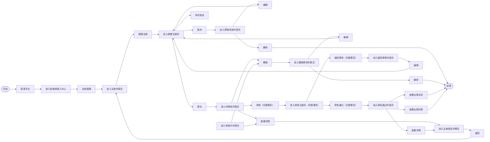

# 智能体接入中心-需求说明书

智能体统一接入门户,覆盖「注册录入 → 审核」全流程。接入中心以 **注册管理** 为核心板块:注册管理负责智能体的注册、暂存、提交、撤销、审核(通过 / 退回)。

### 系统角色说明

本模块涉及 **2 类角色**,在功能清单中分别以「普通用户」与「管理员」体现,分工如下:

| **角色**     | **职责**                                               | **典型场景**                                                   |
| ------------ | ------------------------------------------------------ | -------------------------------------------------------------- |
| 普通用户     | 新建注册、暂存草稿、提交审核、撤销、按退回意见修改重提 | 例:影像科申请新的影像分析智能体;信息科为全院引入统一导诊智能体 |
| 信息科管理员 | 审核注册申请(审核通过 / 退回修改并填写具体说明)        | 例:信息科管理员审核并配置某跨科室共用智能体的接口              |

### 核心业务流程

用户登录平台进入智能体接入中心 → 注册管理 → 注册列表页;由注册列表页可【新建注册】进入新建注册页(暂存→草稿状态列表页、测试验证、提交→待审核列表页),并按状态进入各列表页完成编辑 / 删除 / 撤销 / 查看详情 / 审核等操作;管理员在审核注册页给出【审核通过】(→审核通过列表页,可查看详情 / 台账)或【退回修改】(→退回修改列表页,可编辑重提)。

### 功能与页面清单

| **一级板块**       | **页面**                       | **页面类型**                                                               | **主要用途**                                                                                  |
| ------------------ | ------------------------------ | -------------------------------------------------------------------------- | --------------------------------------------------------------------------------------------- |
| 1. 注册管理        | 1.1 注册管理页(7 个状态列表页) | 列表页                                                                     | 按注册状态分页管理全部注册记录:全部 / 草稿 / 待审核 / 审核中 / 撤销修改 / 退回修改 / 审核通过 |
| 1.2 新建注册页     | 表单页                         | 备案材料上传(OCR 自动填充)+ 基本信息 + 技术信息填写,暂存 / 测试验证 / 提交 | 用户                                                                                          |
| 1.3 注册信息详情页 | 详情页                         | 只读查看备案材料、基本信息、技术信息                                       | 用户、管理员                                                                                  |
| 1.4 审核注册页     | 审核详情页                     | 查看注册信息并给出审核结论(审核通过 / 退回修改 + 具体说明)                 | 管理员                                                                                        |

## 一、注册管理

### 1.1 注册管理页(按状态分页)

注册记录按 **注册状态** 分为 7 个列表页;「全部注册状态列表页」为总览,其余 6 个为按状态过滤的子列表。注册状态包括:**草稿 / 待审核 / 审核中 / 撤销修改 / 审核通过 / 退回修改**。各列表页共用一组核心列(智能体编号、名称、所属科室、诊疗环节、来源、供应商、核心功能、版本),并按状态追加专属列与操作按钮。

<aside>
 📋

**列展示通用规则**:序号系统自动生成、按展示顺序递增并支持翻页连续编号;长文本(供应商名称、核心功能等)超出字数以省略号显示,悬浮 Tooltip 展示全文;时间统一格式 `YYYY-MM-DD HH:MM:SS`。

</aside>

#### 1.1.1 全部注册状态列表页(管理员 / 用户均有)

顶部操作:【新建注册】按钮 —— 点击进入新建注册页。
列表操作：【查看详情】进入注册信息详情页。

数据范围：

1.管理员：展示全部注册记录

2.普通用户：展示用户自己创建的全部注册记录

| **序号** | **列名**   | **说明 / 交互**                                                                                    |
| -------- | ---------- | -------------------------------------------------------------------------------------------------- |
| 1        | 序号       | 系统自动生成,按列表展示顺序递增编号(1、2、3……);支持翻页连续编号                                  |
| 2        | 智能体编号 | 取自注册表单自动生成的编号,格式「科室编号-准入顺序号(如 0001)」;支持点击跳转至详情页               |
| 3        | 智能体名称 | 取自注册表单填写的名称;支持模糊搜索、点击进入详情                                                  |
| 4        | 所属科室   | 取自注册表单选择的科室(科室代码+科室名称);支持筛选                                                 |
| 5        | 诊疗环节   | 取自注册表单选择项(字典生成);支持下拉筛选                                                          |
| 6        | 智能体来源 | 取自注册表单选择项(自研 / 第三方 / 合作研发);支持下拉筛选                                          |
| 7        | 供应商名称 | 取自注册表单填写的供应商全称;超过 15 字省略号显示,悬浮 Tooltip 展示全称                            |
| 8        | 核心功能   | 取自注册表单「功能描述」字段;列表中截取前 30 字,超出显示「...」,悬浮展示完整内容                   |
| 9        | 智能体版本 | 取自注册表单填写的版本号(如 1.0 / 1.1 / 2.0 / 2.1……);支持按版本号排序                            |
| 10       | 注册状态   | 系统根据流程节点自动展示,选项:草稿 / 待审核 / 审核中 / 撤销修改 / 审核通过 / 退回修改;支持下拉筛选 |

#### 1.1.2 草稿状态列表页(管理员/用户均匀)

操作按钮:
1.【编辑】进入新建注册页继续填写;
2.【删除】弹「确认是否删除」

2.1【是】弹「删除成功」并从草稿列表移除该记录
2.3 【否】返回草稿列表页。

数据范围：

1.管理员：展示自己创建的草稿数据

2.普通用户：展示自己创建的草稿数据

| **列名**     | **说明**                                                                                       |
| ------------ | ---------------------------------------------------------------------------------------------- |
| 序号         | 系统自动生成,按列表展示顺序递增编号;支持翻页连续编号                                           |
| 智能体编号   | 草稿暂存时尚未生成正式编号则显示「--」;已生成则按「科室编号-准入顺序号」显示                   |
| 智能体名称   | 取自草稿表单已填写名称;未填写时显示「未命名草稿」;支持点击继续编辑                             |
| 智能体版本   | 取自草稿表单已填写版本号;未填写时显示「--」                                                    |
| 所属科室     | 取自草稿表单选择的科室(科室代码+科室名称);支持筛选                                             |
| 诊疗环节     | 取自草稿表单选择项;未填写时显示「--」;支持下拉筛选                                             |
| 智能体来源   | 取自草稿表单选择项(自研 / 第三方 / 合作研发);支持下拉筛选                                      |
| 供应商名称   | 取自草稿表单填写的供应商全称;未填写时显示「--」                                                |
| 核心功能     | 取自草稿表单「功能描述」字段;列表中截取前 30 字展示,悬浮 Tooltip 展示完整内容;未填写显示「--」 |
| 最后编辑时间 | `YYYY-MM-DD HH:MM:SS`                                                                          |

#### 1.1.3 待审核列表页(管理员 / 用户)

操作按钮:
1.【审核】(管理员)进入审核注册页;
2.【撤销】(所有用户)弹「确认是否撤销」
2.1【是】弹「撤销成功」并将记录移至撤销修改列表页
2.2【否】返回待审核列表页;
3.【查看详情】进入注册信息详情页。

数据范围：

1.管理员：展示全部待审核记录

2.普通用户：展示用户自己申请注册的待审核记录

| **列名**     | **说明**                                                                      |
| ------------ | ----------------------------------------------------------------------------- |
| 序号         | 系统自动生成,按列表展示顺序递增编号;支持翻页连续编号                          |
| 智能体编号   | 取自注册表单自动生成的编号,格式「科室编号-准入顺序号」;支持点击进入审核详情页 |
| 智能体名称   | 取自用户提交的注册表单;支持搜索、点击查看详情                                 |
| 智能体版本   | 取自注册表单填写的版本号;支持排序                                             |
| 所属科室     | 取自注册表单(科室代码+科室名称);支持下拉筛选                                  |
| 诊疗环节     | 取自注册表单选择项;支持下拉筛选                                               |
| 智能体来源   | 取自注册表单选择项(自研 / 第三方 / 合作研发);支持下拉筛选                     |
| 供应商名称   | 取自注册表单;超出 10 字则省略号显示,悬浮展示全称                              |
| 核心功能     | 取自注册表单「功能描述」字段;超出 20 字则省略号显示,悬浮展示完整内容          |
| 提交审核时间 | `YYYY-MM-DD HH:MM:SS`                                                         |

#### 1.1.4 审核中列表页(用户)

说明:用户仅可在管理员审核完成前撤销修改。
操作按钮:
1.【查看详情】进入注册信息详情页;
2.【撤销】弹「确认是否撤销」
2.1【是】弹「撤销成功」并移至撤销修改列表页
2.2【否】返回审核中列表页。
3.【审核】(管理员)进入审核注册页;

数据范围：

1.管理员：展示全部审核中记录

2.普通用户：展示用户自己申请注册的审核中记录

| **列名**     | **说明**                                                             |
| ------------ | -------------------------------------------------------------------- |
| 序号         | 系统自动生成,按提交时间倒序递增编号;支持翻页连续编号                 |
| 智能体编号   | 取自注册表单自动生成的编号;支持点击查看审核进度                      |
| 智能体名称   | 取自已提交的注册表单;只读展示,不可编辑                               |
| 智能体版本   | 取自注册表单填写的版本号                                             |
| 所属科室     | 取自注册表单(科室代码+科室名称);支持筛选                             |
| 诊疗环节     | 取自注册表单选择项;支持下拉筛选                                      |
| 智能体来源   | 取自注册表单选择项(自研 / 第三方 / 合作研发);支持下拉筛选            |
| 供应商名称   | 取自注册表单填写的供应商全称;超出 10 字则省略号显示,悬浮展示全称     |
| 核心功能     | 取自注册表单「功能描述」字段;超出 20 字则省略号显示,悬浮展示完整内容 |
| 提交审核时间 | `YYYY-MM-DD HH:MM:SS`                                                |

#### 1.1.5 撤销修改列表页(用户)

操作按钮:
1.【编辑】进入新建注册页修改注册表单信息;
2.【删除】弹「确认是否删除」
2.1【是】弹「删除成功」并从撤销修改列表页移除该记录
2.2【否】返回撤销修改列表页。

数据范围：

1.管理员：展示全部撤销修改记录

2.普通用户：展示用户自己申请注册的撤销修改记录

| **列名**   | **说明**                                                                  |
| ---------- | ------------------------------------------------------------------------- |
| 序号       | 系统自动生成,按撤销时间倒序递增编号;支持翻页连续编号                      |
| 智能体编号 | 取自原注册表单自动生成的编号,格式「科室编号-准入顺序号」;支持点击查看详情 |
| 智能体名称 | 取自原注册表单填写的名称;支持搜索、点击查看详情                           |
| 智能体版本 | 取自原注册表单填写的版本号;支持排序                                       |
| 所属科室   | 取自原注册表单(科室代码+科室名称);支持筛选                                |
| 诊疗环节   | 取自原注册表单选择项;支持下拉筛选                                         |
| 智能体来源 | 取自原注册表单选择项(自研 / 第三方 / 合作研发);支持下拉筛选               |
| 供应商名称 | 取自原注册表单填写的供应商全称;超长省略号显示,悬浮 Tooltip 展示全称       |
| 核心功能   | 取自原注册表单「功能描述」字段;超出 20 字则省略号显示,悬浮展示完整内容    |
| 撤销时间   | `YYYY-MM-DD HH:MM:SS`                                                     |

#### 1.1.6 退回修改列表页(管理员 / 用户均有)

操作按钮:
【编辑】进入新建注册页修改注册表单信息。

数据范围：

1.管理员：展示全部退回修改记录

2.普通用户：展示用户自己申请注册的退回修改记录

| **列名**     | **说明**                                                               |
| ------------ | ---------------------------------------------------------------------- |
| 序号         | 系统自动生成,按退回时间倒序递增编号;支持翻页连续编号                   |
| 智能体编号   | 取自原注册表单自动生成的编号;支持点击进入编辑 / 查看详情页             |
| 智能体名称   | 取自原注册表单;支持搜索、点击进入详情                                  |
| 智能体版本   | 取自原注册表单填写的版本号;支持排序                                    |
| 所属科室     | 取自原注册表单(科室代码+科室名称);支持筛选                             |
| 诊疗环节     | 取自原注册表单选择项;支持下拉筛选                                      |
| 智能体来源   | 取自原注册表单选择项(自研 / 第三方 / 合作研发);支持下拉筛选            |
| 供应商名称   | 取自原注册表单填写的供应商全称;超长省略号显示                          |
| 核心功能     | 取自原注册表单「功能描述」字段;超出 20 字则省略号显示,悬浮展示完整内容 |
| 退回原因说明 | 取自管理员审核时填写的退回原因;超出 20 字则省略号显示,悬浮展示完整原因 |
| 退回时间     | `YYYY-MM-DD HH:MM:SS`                                                  |

#### 1.1.7 审核通过列表页(管理员 / 用户均有)

操作按钮:
【查看详情】进入注册信息详情页。

数据范围：

1.管理员：展示全部审核通过记录

2.普通用户：展示用户自己申请注册的审核通过记录

| **列名**     | **说明**                                                                                             |
| ------------ | ---------------------------------------------------------------------------------------------------- |
| 序号         | 系统自动生成,按审核通过时间倒序递增编号;支持翻页连续编号                                             |
| 智能体编号   | 取自注册表单自动生成的编号;支持点击查看详情                                                          |
| 智能体名称   | 取自注册表单填写的名称;支持搜索、点击进入详情                                                        |
| 智能体版本   | 取自注册表单填写的版本号;支持排序                                                                    |
| 所属科室     | 取自注册表单(科室代码+科室名称);支持筛选                                                             |
| 诊疗环节     | 取自注册表单选择项;支持下拉筛选                                                                      |
| 智能体来源   | 取自注册表单选择项(自研 / 第三方 / 合作研发);支持下拉筛选                                            |
| 供应商名称   | 取自注册表单填写的供应商全称;超长省略号显示,悬浮展示全称                                             |
| 核心功能     | 取自注册表单「功能描述」字段;超出 20 字则省略号显示,悬浮展示完整内容                                 |
| 具体说明     | 取自管理员审核时填写的通过意见或备注说明(如有条件通过的备注);超出 20 字则省略号显示,悬浮展示完整内容 |
| 审核通过时间 | `YYYY-MM-DD HH:MM:SS`                                                                                |

### 1.2 新建注册页

新建注册页自上而下分为三部分:**1.2.1 备案材料上传(OCR 自动填充)→ 1.2.2 基本信息 → 1.2.3 技术信息**。页面底部统一提供【暂存】【提交】操作,技术信息区提供【测试验证】连通自检。

<aside>
 🤖

**OCR 自动填充**:先上传备案材料(产品说明书 / 技术规格书),系统 OCR 识别后自动填充「基本信息」与「技术信息」中标注「支持 OCR 识别」的字段,用户可在此基础上修改确认,减少手填。

</aside>

#### 1.2.1 备案材料上传

操作按钮:【上传】点击上传文件材料。

* **上传成功** → 弹「上传成功」弹窗;
* **上传失败** → 弹「上传失败,单文件超过最大限制 30M」或「上传失败,仅支持 PDF 类型文件」。

| **材料**   | **必填** | **内容要求**                                                                                                         |
| ---------- | -------- | -------------------------------------------------------------------------------------------------------------------- |
| 产品说明书 | 必填     | 文档内容需包含:产品名称、产品简介、主要功能、开发单位及技术联系人、产品版本等                                        |
| 技术规格书 | 必填     | 文档内容需包含:接入方式信息,如接口地址、认证方式、请求参数、返回参数、数据格式、请求示例、返回示例、错误码说明等内容 |
| 其他材料   | 可选     | 如安全测试报告、部署环境说明书等                                                                                     |

**上传要求**:① 限定 PDF 格式;② 支持多文件上传;③ 单文件不超过 30M。

#### 1.2.2 基本信息

底部操作:【暂存】点击后弹「注册表单填写记录已暂存至草稿状态列表页」弹窗;【提交】见下方提交规则。

**1.2.2.1 智能体信息**

| **序号** | **字段名称** | **必填** | **说明 / 校验**                                                                                                                                                                                                                                                               |
| -------- | ------------ | -------- | ----------------------------------------------------------------------------------------------------------------------------------------------------------------------------------------------------------------------------------------------------------------------------- |
| 1        | 智能体名称   | 是       | 支持 OCR 识别、支持用户修改;限制 2–20 个字符,实时字数提示(X/20);与已有智能体重名时,输入失焦校验提醒「此名称已被使用,请重新命名」                                                                                                                                             |
| 2        | 智能体编号   | 自动生成 | 按「科室编号-准入顺序号(如 0001)」自动生成                                                                                                                                                                                                                                    |
| 3        | 智能体版本   | 是       | 支持 OCR 识别、支持用户修改;格式 1.0 / 1.1 / 2.0 / 2.1……,校验版本号格式(数字.数字)                                                                                                                                                                                          |
| 4        | 所属科室     | 是       | 字典生成、用户选择;格式为科室代码+科室名称                                                                                                                                                                                                                                    |
| 5        | 诊疗环节     | 否       | 用户选择,下拉框(导诊分诊 / 预问诊 / 预约挂号 / 辅助检查 / 辅助诊断 / 辅助治疗 / 住院 / 手术 / 其他(填空));选「其他」时出现文本框,限制 20 字,实时字数提示(X/20)                                                                                                                |
| 6        | 功能描述     | 是       | 支持 OCR 识别、支持用户修改;重点说明工作内容、服务对象、输入信息、输出结果;多行文本域默认显示 5 行,超出可滚动;限 500 字以内,实时字数提示(X/500),超 500 字红色提示且不可继续输入;参考示例:「面向门诊患者开展预问诊服务,自动采集主诉、现病史、既往史等信息,形成标准化问诊摘要」 |

**1.2.2.2 来源与责任信息**

| **序号** | **字段名称** | **必填** | **说明 / 校验**                                                                                             |
| -------- | ------------ | -------- | ----------------------------------------------------------------------------------------------------------- |
| 1        | 智能体来源   | 否       | 用户选择,支持单选;选项:自研 / 第三方 / 合作研发                                                             |
| 2        | 供应商名称   | 否       | 支持 OCR 识别、支持用户修改;需填写供应商全称,不超过 30 字,实时字数提示(X/30)                                |
| 3        | 技术联系人   | 是       | 支持 OCR 识别、支持用户修改;限制 2–10 个字,实时字数提示(X/10)                                              |
| 4        | 联系方式     | 是       | 支持 OCR 识别、支持用户修改;格式校验,限制 11 个数字,失焦校验手机号格式,错误提示「请输入正确的 11 位手机号」 |

#### 1.2.3 技术信息

区域操作按钮:【测试验证】(中间过程需要呈现出来)、【获取 SDK】/【获取 OTel】。

**接入方式(必填)**:支持 OCR 识别、支持用户修改选择;下拉框(API / SDK / OTel)。选择不同接入方式动态展示对应子字段。

| **接入方式** | **子字段**                                                                                      |
| ------------ | ----------------------------------------------------------------------------------------------- |
| ① API 接入  | 接口地址(必填)                                                                                  |
| API key      | 支持 OCR 识别、支持用户修改;默认密文显示(`********`);点击 icon1 切换显示 / 隐藏,点击 icon2 复制 |
| ② SDK 接入  | 平台 URL 地址                                                                                   |
| 平台密钥 key | 点击【获取 SDK】自动获取                                                                        |
| 埋点代码生成 | 根据平台 URL 地址和密钥 key 自动生成                                                            |
| ③ OTel 接入 | 平台 URL 地址                                                                                   |
| 平台密钥 key | 点击【获取 OTel】自动获取                                                                       |
| 埋点代码生成 | 根据平台 URL 地址和密钥 key 自动生成                                                            |

<aside>
 🔁

**接入方式差异**:API 为黑盒端到端接入(用户填接口地址 + Key,平台调出去);SDK / OTel 为白盒埋点接入(点击「获取 SDK / 获取 OTel」由平台自动签发 URL + 密钥并生成埋点代码,用户复制粘贴进 Agent 应用,数据推上来,可获取完整 trace/span)。

</aside>

#### 提交与连通测试规则

* 【测试验证】:点击后呈现连通过程 —— **联通成功** 弹「测试验证正常」弹窗;**联通失败** 弹「测试验证异常,请再次检查技术信息填写内容(错误代码和错误原因返回)」弹窗。
* 【提交】:**提交成功** 弹「提交成功」弹窗,进入审核中状态;**提交失败** 弹「提交失败,请再次检查注册表单填写内容」弹窗。
* **提交前置校验**:未完成测试或测试未通过时,【提交】按钮置灰,并提示「当前无法提交注册,请完成连通测试并确保可正常连通」。

### 1.3 注册信息详情页

只读查看已提交的注册信息,自上而下分为 备案材料 / 基本信息 / 技术信息 三部分。顶部操作:【返回】点击后回到待审核列表页、审核中列表页或审核通过列表页。

#### 1.3.1 备案材料

| **附件**          | **说明**                                                                      |
| ----------------- | ----------------------------------------------------------------------------- |
| 附件 1:产品说明书 | PDF 格式展示;支持在线预览(点击文件名打开预览弹窗);支持下载;管理员只读不可修改 |
| 附件 2:技术规格书 | PDF 格式展示;支持在线预览与下载;管理员只读不可修改                            |
| 附件 3:其他材料 1 | PDF 格式展示;支持在线预览与下载;按上传顺序编号                                |
| ……:其他材料 N   | PDF 格式展示;支持在线预览与下载;附件数量根据用户实际上传动态展示              |

说明:支持文件在线预览。

#### 1.3.2 基本信息(只读)

| **字段**             | **说明**                                                                                             |
| -------------------- | ---------------------------------------------------------------------------------------------------- |
| 智能体名称(必有)     | 取自用户提交的注册表单;文本只读展示,管理员审核阶段不可编辑                                           |
| 智能体编号(自动生成) | 系统自动分配的唯一编码,格式「科室编号-准入顺序号」;只读展示,不可编辑                                 |
| 所属科室(必有)       | 取自注册表单选择的科室(科室代码+科室名称);文本只读展示                                               |
| 诊疗环节             | 取自注册表单选择项(选项来源字典);文本只读展示,多选时以逗号分隔                                       |
| 智能体来源           | 取自注册表单选择项(自研 / 第三方 / 合作研发);文本只读展示                                            |
| 供应商名称           | 取自注册表单填写的供应商全称;文本只读展示,当来源为「自研」时显示「--」                               |
| 技术联系人(必有)     | 取自注册表单填写的技术对接人姓名;文本只读展示                                                        |
| 联系方式(必有)       | 取自注册表单填写的电话;文本只读展示                                                                  |
| 功能描述(必有)       | 取自注册表单填写的智能体核心功能、应用场景说明;多行文本只读展示,支持滚动查看全部内容,字数上限 500 字 |
| 智能体版本(必有)     | 取自注册表单填写的版本号(如 1.0 / 1.1 / 2.0 / 2.1……);文本只读展示                                  |

#### 1.3.3 技术信息(只读)

按注册时选择的接入方式动态展示对应子字段;密钥类字段默认掩码显示(如 `sk-****`),点击 icon 可展示明文密钥。

| **字段**            | **说明**                                                                                  |
| ------------------- | ----------------------------------------------------------------------------------------- |
| 接入方式(API 接入)  | 取自注册表单选择的接入方式;文本只读展示,不同接入方式动态展示对应子字段                    |
| 接口地址            | API 接入方式下填写的接口 URL 地址;文本只读展示,支持点击复制                               |
| API key             | API 接入方式下的鉴权密钥;文本只读展示,默认掩码显示(如`sk-****`),点击 icon 可展示明文密钥  |
| 接入方式(SDK 接入)  | 取自注册表单选择的接入方式;文本只读展示,不同接入方式动态展示对应子字段                    |
| 平台 URL 地址       | SDK 接入方式下的平台 URL 地址;文本只读展示,支持点击复制                                   |
| 平台密钥 key        | SDK 接入方式下的鉴权密钥;文本只读展示,默认掩码显示(如`sk-****`),点击 icon 可展示明文密钥  |
| 埋点代码生成        | 根据平台 URL 地址和密钥 key 自动生成的代码                                                |
| 接入方式(OTel 接入) | 取自注册表单选择的接入方式;文本只读展示,不同接入方式动态展示对应子字段                    |
| 平台 URL 地址       | OTel 接入方式下的平台 URL 地址;文本只读展示,支持点击复制                                  |
| 平台密钥 key        | OTel 接入方式下的鉴权密钥;文本只读展示,默认掩码显示(如`sk-****`),点击 icon 可展示明文密钥 |
| 埋点代码生成        | 根据平台 URL 地址和密钥 key 自动生成的代码                                                |

### 1.4 审核注册页

管理员在「待审核列表页」点击【审核】进入,自上而下查看 备案材料 / 基本信息 / 技术信息,并在底部给出审核结论。底部操作:

* 【审核通过】弹「确认是否审核通过」——【是】审核通过,记录移至审核通过列表页;【否】返回审核注册页。
* 【退回修改】弹「确认是否退回修改」——【是】退回修改,记录移至退回修改列表页;【否】返回审核注册页。

#### 1.4.1 备案材料

同 1.3.1,管理员只读查看产品说明书、技术规格书、其他材料,支持在线预览与下载,不可修改。

#### 1.4.2 基本信息

同 1.3.2,字段只读展示,管理员审核阶段不可编辑。

#### 1.4.3 技术信息

同 1.3.3,字段只读展示(密钥掩码 + 可查看明文);本步骤提供【测试验证】(中间过程需要呈现出来),供管理员复核连通性。

#### 1.4.4 审核结论

| **字段** | **说明**                                                                                                    |
| -------- | ----------------------------------------------------------------------------------------------------------- |
| 审核结论 | 管理员对本次注册申请的审核判定结果;单选项:审核通过 / 退回修改,必填;选择不同结论联动下方「具体说明」提示文案 |

#### 1.4.5 具体说明

| **字段** | **说明**                                                                                                                                                                                             |
| -------- | ---------------------------------------------------------------------------------------------------------------------------------------------------------------------------------------------------- |
| 具体说明 | 管理员针对审核结论填写的详细意见、退回修改原因;多行文本输入框,字数限制 500 字并实时显示已输入字数;选择「退回修改」时必填,选择「审核通过」时选填;提交后同步至用户端「退回原因说明」或「具体说明」字段 |

## 二、权限控制

| **角色**                                | **可见范围**                                                                | **核心操作权限**                                                                                   |
| --------------------------------------- | --------------------------------------------------------------------------- | -------------------------------------------------------------------------------------------------- |
| ⭐ 管理员(信息科管理员)                 | 全院所有注册与接入记录                                                      | 审核注册申请(审核通过 / 退回修改 + 具体说明);也可作为申请人新建注册,本人提交的申请同样需走审核流程 |
| 💻 用户(申请人:所有用户,含信息科管理员) | 本人提交的注册记录(草稿 / 待审核 / 审核中 / 撤销修改 / 退回修改 / 审核通过) | 新建注册、暂存草稿、提交审核、撤销、按退回意见编辑重提、删除草稿 / 撤销记录;不可审核               |

## 三、与其他模块的联动关系

| **数据来源 / 去向**          | **联动说明**                                                                          |
| ---------------------------- | ------------------------------------------------------------------------------------- |
| 接入中心 → 统一台账中心     | 审核通过后同步智能体基础信息至台账;后续试运行 / 已上线及禁用 / 启用由台账中心承接管理 |
| 接入中心 → 统一准入评测沙盒 | 审核通过后可创建待评测任务,由评测中心承接准入评测                                     |
| 接入中心 → 审计中心         | 注册、提交、撤销、审核(通过 / 退回)等操作自动归档,全程留痕                            |
| 接入中心 → 通知中心         | 提交成功、退回修改、审核通过等通知推送至相关角色                                      |

智能体统一接入门户,覆盖「注册录入 → 审核」全流程。接入中心以 **注册管理** 为核心板块:注册管理负责智能体的注册、暂存、提交、撤销、审核(通过 / 退回)。

### 系统角色说明

本模块涉及 **2 类角色**,在功能清单中分别以「普通用户」与「管理员」体现,分工如下:

| **角色**     | **职责**                                               | **典型场景**                                                   |
| ------------ | ------------------------------------------------------ | -------------------------------------------------------------- |
| 普通用户     | 新建注册、暂存草稿、提交审核、撤销、按退回意见修改重提 | 例:影像科申请新的影像分析智能体;信息科为全院引入统一导诊智能体 |
| 信息科管理员 | 审核注册申请(审核通过 / 退回修改并填写具体说明)        | 例:信息科管理员审核并配置某跨科室共用智能体的接口              |

### 核心业务流程

用户登录平台进入智能体接入中心 → 注册管理 → 注册列表页;由注册列表页可【新建注册】进入新建注册页(暂存→草稿状态列表页、测试验证、提交→待审核列表页),并按状态进入各列表页完成编辑 / 删除 / 撤销 / 查看详情 / 审核等操作;管理员在审核注册页给出【审核通过】(→审核通过列表页,可查看详情 / 台账)或【退回修改】(→退回修改列表页,可编辑重提)。

### 功能与页面清单

| **一级板块**       | **页面**                       | **页面类型**                                                               | **主要用途**                                                                                  |
| ------------------ | ------------------------------ | -------------------------------------------------------------------------- | --------------------------------------------------------------------------------------------- |
| 1. 注册管理        | 1.1 注册管理页(7 个状态列表页) | 列表页                                                                     | 按注册状态分页管理全部注册记录:全部 / 草稿 / 待审核 / 审核中 / 撤销修改 / 退回修改 / 审核通过 |
| 1.2 新建注册页     | 表单页                         | 备案材料上传(OCR 自动填充)+ 基本信息 + 技术信息填写,暂存 / 测试验证 / 提交 | 用户                                                                                          |
| 1.3 注册信息详情页 | 详情页                         | 只读查看备案材料、基本信息、技术信息                                       | 用户、管理员                                                                                  |
| 1.4 审核注册页     | 审核详情页                     | 查看注册信息并给出审核结论(审核通过 / 退回修改 + 具体说明)                 | 管理员                                                                                        |

## 一、注册管理

### 1.1 注册管理页(按状态分页)

注册记录按 **注册状态** 分为 7 个列表页;「全部注册状态列表页」为总览,其余 6 个为按状态过滤的子列表。注册状态包括:**草稿 / 待审核 / 审核中 / 撤销修改 / 审核通过 / 退回修改**。各列表页共用一组核心列(智能体编号、名称、所属科室、诊疗环节、来源、供应商、核心功能、版本),并按状态追加专属列与操作按钮。

<aside>
 📋

**列展示通用规则**:序号系统自动生成、按展示顺序递增并支持翻页连续编号;长文本(供应商名称、核心功能等)超出字数以省略号显示,悬浮 Tooltip 展示全文;时间统一格式 `YYYY-MM-DD HH:MM:SS`。

</aside>

#### 1.1.1 全部注册状态列表页(管理员 / 用户均有)

顶部操作:【新建注册】按钮 —— 点击进入新建注册页。
列表操作：【查看详情】进入注册信息详情页。

| **序号** | **列名**   | **说明 / 交互**                                                                                    |
| -------- | ---------- | -------------------------------------------------------------------------------------------------- |
| 1        | 序号       | 系统自动生成,按列表展示顺序递增编号(1、2、3……);支持翻页连续编号                                  |
| 2        | 智能体编号 | 取自注册表单自动生成的编号,格式「科室编号-准入顺序号(如 0001)」;支持点击跳转至详情页               |
| 3        | 智能体名称 | 取自注册表单填写的名称;支持模糊搜索、点击进入详情                                                  |
| 4        | 所属科室   | 取自注册表单选择的科室(科室代码+科室名称);支持筛选                                                 |
| 5        | 诊疗环节   | 取自注册表单选择项(字典生成);支持下拉筛选                                                          |
| 6        | 智能体来源 | 取自注册表单选择项(自研 / 第三方 / 合作研发);支持下拉筛选                                          |
| 7        | 供应商名称 | 取自注册表单填写的供应商全称;超过 15 字省略号显示,悬浮 Tooltip 展示全称                            |
| 8        | 核心功能   | 取自注册表单「功能描述」字段;列表中截取前 30 字,超出显示「...」,悬浮展示完整内容                   |
| 9        | 智能体版本 | 取自注册表单填写的版本号(如 1.0 / 1.1 / 2.0 / 2.1……);支持按版本号排序                            |
| 10       | 注册状态   | 系统根据流程节点自动展示,选项:草稿 / 待审核 / 审核中 / 撤销修改 / 审核通过 / 退回修改;支持下拉筛选 |

#### 1.1.2 草稿状态列表页(仅展示用户自己的草稿数据)

操作按钮:
1.【编辑】进入新建注册页继续填写;
2.【删除】弹「确认是否删除」

2.1【是】弹「删除成功」并从草稿列表移除该记录
2.3 【否】返回草稿列表页。

| **列名**     | **说明**                                                                                       |
| ------------ | ---------------------------------------------------------------------------------------------- |
| 序号         | 系统自动生成,按列表展示顺序递增编号;支持翻页连续编号                                           |
| 智能体编号   | 草稿暂存时尚未生成正式编号则显示「--」;已生成则按「科室编号-准入顺序号」显示                   |
| 智能体名称   | 取自草稿表单已填写名称;未填写时显示「未命名草稿」;支持点击继续编辑                             |
| 智能体版本   | 取自草稿表单已填写版本号;未填写时显示「--」                                                    |
| 所属科室     | 取自草稿表单选择的科室(科室代码+科室名称);支持筛选                                             |
| 诊疗环节     | 取自草稿表单选择项;未填写时显示「--」;支持下拉筛选                                             |
| 智能体来源   | 取自草稿表单选择项(自研 / 第三方 / 合作研发);支持下拉筛选                                      |
| 供应商名称   | 取自草稿表单填写的供应商全称;未填写时显示「--」                                                |
| 核心功能     | 取自草稿表单「功能描述」字段;列表中截取前 30 字展示,悬浮 Tooltip 展示完整内容;未填写显示「--」 |
| 最后编辑时间 | `YYYY-MM-DD HH:MM:SS`                                                                          |

#### 1.1.3 待审核列表页(管理员 / 用户)

操作按钮:
1.【审核】(管理员)进入审核注册页;
2.【撤销】(所有用户)弹「确认是否撤销」
2.1【是】弹「撤销成功」并将记录移至撤销修改列表页
2.2【否】返回待审核列表页;
3.【查看详情】进入注册信息详情页。

| **列名**     | **说明**                                                                      |
| ------------ | ----------------------------------------------------------------------------- |
| 序号         | 系统自动生成,按列表展示顺序递增编号;支持翻页连续编号                          |
| 智能体编号   | 取自注册表单自动生成的编号,格式「科室编号-准入顺序号」;支持点击进入审核详情页 |
| 智能体名称   | 取自用户提交的注册表单;支持搜索、点击查看详情                                 |
| 智能体版本   | 取自注册表单填写的版本号;支持排序                                             |
| 所属科室     | 取自注册表单(科室代码+科室名称);支持下拉筛选                                  |
| 诊疗环节     | 取自注册表单选择项;支持下拉筛选                                               |
| 智能体来源   | 取自注册表单选择项(自研 / 第三方 / 合作研发);支持下拉筛选                     |
| 供应商名称   | 取自注册表单;超出 10 字则省略号显示,悬浮展示全称                              |
| 核心功能     | 取自注册表单「功能描述」字段;超出 20 字则省略号显示,悬浮展示完整内容          |
| 提交审核时间 | `YYYY-MM-DD HH:MM:SS`                                                         |

#### 1.1.4 审核中列表页(用户)

说明:用户仅可在管理员审核完成前撤销修改。
操作按钮:
1.【查看详情】进入注册信息详情页;
2.【撤销】弹「确认是否撤销」
2.1【是】弹「撤销成功」并移至撤销修改列表页
2.2【否】返回审核中列表页。
3.【审核】(管理员)进入审核注册页;

| **列名**     | **说明**                                                             |
| ------------ | -------------------------------------------------------------------- |
| 序号         | 系统自动生成,按提交时间倒序递增编号;支持翻页连续编号                 |
| 智能体编号   | 取自注册表单自动生成的编号;支持点击查看审核进度                      |
| 智能体名称   | 取自已提交的注册表单;只读展示,不可编辑                               |
| 智能体版本   | 取自注册表单填写的版本号                                             |
| 所属科室     | 取自注册表单(科室代码+科室名称);支持筛选                             |
| 诊疗环节     | 取自注册表单选择项;支持下拉筛选                                      |
| 智能体来源   | 取自注册表单选择项(自研 / 第三方 / 合作研发);支持下拉筛选            |
| 供应商名称   | 取自注册表单填写的供应商全称;超出 10 字则省略号显示,悬浮展示全称     |
| 核心功能     | 取自注册表单「功能描述」字段;超出 20 字则省略号显示,悬浮展示完整内容 |
| 提交审核时间 | `YYYY-MM-DD HH:MM:SS`                                                |

#### 1.1.5 撤销修改列表页(用户)

操作按钮:
1.【编辑】进入新建注册页修改注册表单信息;
2.【删除】弹「确认是否删除」
2.1【是】弹「删除成功」并从撤销修改列表页移除该记录
2.2【否】返回撤销修改列表页。

| **列名**   | **说明**                                                                  |
| ---------- | ------------------------------------------------------------------------- |
| 序号       | 系统自动生成,按撤销时间倒序递增编号;支持翻页连续编号                      |
| 智能体编号 | 取自原注册表单自动生成的编号,格式「科室编号-准入顺序号」;支持点击查看详情 |
| 智能体名称 | 取自原注册表单填写的名称;支持搜索、点击查看详情                           |
| 智能体版本 | 取自原注册表单填写的版本号;支持排序                                       |
| 所属科室   | 取自原注册表单(科室代码+科室名称);支持筛选                                |
| 诊疗环节   | 取自原注册表单选择项;支持下拉筛选                                         |
| 智能体来源 | 取自原注册表单选择项(自研 / 第三方 / 合作研发);支持下拉筛选               |
| 供应商名称 | 取自原注册表单填写的供应商全称;超长省略号显示,悬浮 Tooltip 展示全称       |
| 核心功能   | 取自原注册表单「功能描述」字段;超出 20 字则省略号显示,悬浮展示完整内容    |
| 撤销时间   | `YYYY-MM-DD HH:MM:SS`                                                     |

#### 1.1.6 退回修改列表页(管理员 / 用户均有)

操作按钮:
【编辑】进入新建注册页修改注册表单信息。

| **列名**     | **说明**                                                               |
| ------------ | ---------------------------------------------------------------------- |
| 序号         | 系统自动生成,按退回时间倒序递增编号;支持翻页连续编号                   |
| 智能体编号   | 取自原注册表单自动生成的编号;支持点击进入编辑 / 查看详情页             |
| 智能体名称   | 取自原注册表单;支持搜索、点击进入详情                                  |
| 智能体版本   | 取自原注册表单填写的版本号;支持排序                                    |
| 所属科室     | 取自原注册表单(科室代码+科室名称);支持筛选                             |
| 诊疗环节     | 取自原注册表单选择项;支持下拉筛选                                      |
| 智能体来源   | 取自原注册表单选择项(自研 / 第三方 / 合作研发);支持下拉筛选            |
| 供应商名称   | 取自原注册表单填写的供应商全称;超长省略号显示                          |
| 核心功能     | 取自原注册表单「功能描述」字段;超出 20 字则省略号显示,悬浮展示完整内容 |
| 退回原因说明 | 取自管理员审核时填写的退回原因;超出 20 字则省略号显示,悬浮展示完整原因 |
| 退回时间     | `YYYY-MM-DD HH:MM:SS`                                                  |

#### 1.1.7 审核通过列表页(管理员 / 用户均有)

操作按钮:
【查看详情】进入注册信息详情页。

| **列名**     | **说明**                                                                                             |
| ------------ | ---------------------------------------------------------------------------------------------------- |
| 序号         | 系统自动生成,按审核通过时间倒序递增编号;支持翻页连续编号                                             |
| 智能体编号   | 取自注册表单自动生成的编号;支持点击查看详情                                                          |
| 智能体名称   | 取自注册表单填写的名称;支持搜索、点击进入详情                                                        |
| 智能体版本   | 取自注册表单填写的版本号;支持排序                                                                    |
| 所属科室     | 取自注册表单(科室代码+科室名称);支持筛选                                                             |
| 诊疗环节     | 取自注册表单选择项;支持下拉筛选                                                                      |
| 智能体来源   | 取自注册表单选择项(自研 / 第三方 / 合作研发);支持下拉筛选                                            |
| 供应商名称   | 取自注册表单填写的供应商全称;超长省略号显示,悬浮展示全称                                             |
| 核心功能     | 取自注册表单「功能描述」字段;超出 20 字则省略号显示,悬浮展示完整内容                                 |
| 具体说明     | 取自管理员审核时填写的通过意见或备注说明(如有条件通过的备注);超出 20 字则省略号显示,悬浮展示完整内容 |
| 审核通过时间 | `YYYY-MM-DD HH:MM:SS`                                                                                |

### 1.2 新建注册页

新建注册页自上而下分为三部分:**1.2.1 备案材料上传(OCR 自动填充)→ 1.2.2 基本信息 → 1.2.3 技术信息**。页面底部统一提供【暂存】【提交】操作,技术信息区提供【测试验证】连通自检。

<aside>
 🤖

**OCR 自动填充**:先上传备案材料(产品说明书 / 技术规格书),系统 OCR 识别后自动填充「基本信息」与「技术信息」中标注「支持 OCR 识别」的字段,用户可在此基础上修改确认,减少手填。

</aside>

#### 1.2.1 备案材料上传

操作按钮:【上传】点击上传文件材料。

* **上传成功** → 弹「上传成功」弹窗;
* **上传失败** → 弹「上传失败,单文件超过最大限制 30M」或「上传失败,仅支持 PDF 类型文件」。

| **材料**   | **必填** | **内容要求**                                                                                                         |
| ---------- | -------- | -------------------------------------------------------------------------------------------------------------------- |
| 产品说明书 | 必填     | 文档内容需包含:产品名称、产品简介、主要功能、开发单位及技术联系人、产品版本等                                        |
| 技术规格书 | 必填     | 文档内容需包含:接入方式信息,如接口地址、认证方式、请求参数、返回参数、数据格式、请求示例、返回示例、错误码说明等内容 |
| 其他材料   | 可选     | 如安全测试报告、部署环境说明书等                                                                                     |

**上传要求**:① 限定 PDF 格式;② 支持多文件上传;③ 单文件不超过 30M。

#### 1.2.2 基本信息

底部操作:【暂存】点击后弹「注册表单填写记录已暂存至草稿状态列表页」弹窗;【提交】见下方提交规则。

**1.2.2.1 智能体信息**

| **序号** | **字段名称** | **必填** | **说明 / 校验**                                                                                                                                                                                                                                                               |
| -------- | ------------ | -------- | ----------------------------------------------------------------------------------------------------------------------------------------------------------------------------------------------------------------------------------------------------------------------------- |
| 1        | 智能体名称   | 是       | 支持 OCR 识别、支持用户修改;限制 2–20 个字符,实时字数提示(X/20);与已有智能体重名时,输入失焦校验提醒「此名称已被使用,请重新命名」                                                                                                                                             |
| 2        | 智能体编号   | 自动生成 | 按「科室编号-准入顺序号(如 0001)」自动生成                                                                                                                                                                                                                                    |
| 3        | 智能体版本   | 是       | 支持 OCR 识别、支持用户修改;格式 1.0 / 1.1 / 2.0 / 2.1……,校验版本号格式(数字.数字)                                                                                                                                                                                          |
| 4        | 所属科室     | 是       | 字典生成、用户选择;格式为科室代码+科室名称                                                                                                                                                                                                                                    |
| 5        | 诊疗环节     | 否       | 用户选择,下拉框(导诊分诊 / 预问诊 / 预约挂号 / 辅助检查 / 辅助诊断 / 辅助治疗 / 住院 / 手术 / 其他(填空));选「其他」时出现文本框,限制 20 字,实时字数提示(X/20)                                                                                                                |
| 6        | 功能描述     | 是       | 支持 OCR 识别、支持用户修改;重点说明工作内容、服务对象、输入信息、输出结果;多行文本域默认显示 5 行,超出可滚动;限 500 字以内,实时字数提示(X/500),超 500 字红色提示且不可继续输入;参考示例:「面向门诊患者开展预问诊服务,自动采集主诉、现病史、既往史等信息,形成标准化问诊摘要」 |

**1.2.2.2 来源与责任信息**

| **序号** | **字段名称** | **必填** | **说明 / 校验**                                                                                             |
| -------- | ------------ | -------- | ----------------------------------------------------------------------------------------------------------- |
| 1        | 智能体来源   | 否       | 用户选择,支持单选;选项:自研 / 第三方 / 合作研发                                                             |
| 2        | 供应商名称   | 否       | 支持 OCR 识别、支持用户修改;需填写供应商全称,不超过 30 字,实时字数提示(X/30)                                |
| 3        | 技术联系人   | 是       | 支持 OCR 识别、支持用户修改;限制 2–10 个字,实时字数提示(X/10)                                              |
| 4        | 联系方式     | 是       | 支持 OCR 识别、支持用户修改;格式校验,限制 11 个数字,失焦校验手机号格式,错误提示「请输入正确的 11 位手机号」 |

#### 1.2.3 技术信息

区域操作按钮:【测试验证】(中间过程需要呈现出来)、【获取 SDK】/【获取 OTel】。

**接入方式(必填)**:支持 OCR 识别、支持用户修改选择;下拉框(API / SDK / OTel)。选择不同接入方式动态展示对应子字段。

| **接入方式** | **子字段**                                                                                      |
| ------------ | ----------------------------------------------------------------------------------------------- |
| ① API 接入  | 接口地址(必填)                                                                                  |
| API key      | 支持 OCR 识别、支持用户修改;默认密文显示(`********`);点击 icon1 切换显示 / 隐藏,点击 icon2 复制 |
| ② SDK 接入  | 平台 URL 地址                                                                                   |
| 平台密钥 key | 点击【获取 SDK】自动获取                                                                        |
| 埋点代码生成 | 根据平台 URL 地址和密钥 key 自动生成                                                            |
| ③ OTel 接入 | 平台 URL 地址                                                                                   |
| 平台密钥 key | 点击【获取 OTel】自动获取                                                                       |
| 埋点代码生成 | 根据平台 URL 地址和密钥 key 自动生成                                                            |

<aside>
 🔁

**接入方式差异**:API 为黑盒端到端接入(用户填接口地址 + Key,平台调出去);SDK / OTel 为白盒埋点接入(点击「获取 SDK / 获取 OTel」由平台自动签发 URL + 密钥并生成埋点代码,用户复制粘贴进 Agent 应用,数据推上来,可获取完整 trace/span)。

</aside>

#### 提交与连通测试规则

* 【测试验证】:点击后呈现连通过程 —— **联通成功** 弹「测试验证正常」弹窗;**联通失败** 弹「测试验证异常,请再次检查技术信息填写内容(错误代码和错误原因返回)」弹窗。
* 【提交】:**提交成功** 弹「提交成功」弹窗,进入审核中状态;**提交失败** 弹「提交失败,请再次检查注册表单填写内容」弹窗。
* **提交前置校验**:未完成测试或测试未通过时,【提交】按钮置灰,并提示「当前无法提交注册,请完成连通测试并确保可正常连通」。

### 1.3 注册信息详情页

只读查看已提交的注册信息,自上而下分为 备案材料 / 基本信息 / 技术信息 三部分。顶部操作:【返回】点击后回到待审核列表页、审核中列表页或审核通过列表页。

#### 1.3.1 备案材料

| **附件**          | **说明**                                                                      |
| ----------------- | ----------------------------------------------------------------------------- |
| 附件 1:产品说明书 | PDF 格式展示;支持在线预览(点击文件名打开预览弹窗);支持下载;管理员只读不可修改 |
| 附件 2:技术规格书 | PDF 格式展示;支持在线预览与下载;管理员只读不可修改                            |
| 附件 3:其他材料 1 | PDF 格式展示;支持在线预览与下载;按上传顺序编号                                |
| ……:其他材料 N   | PDF 格式展示;支持在线预览与下载;附件数量根据用户实际上传动态展示              |

说明:支持文件在线预览。

#### 1.3.2 基本信息(只读)

| **字段**             | **说明**                                                                                             |
| -------------------- | ---------------------------------------------------------------------------------------------------- |
| 智能体名称(必有)     | 取自用户提交的注册表单;文本只读展示,管理员审核阶段不可编辑                                           |
| 智能体编号(自动生成) | 系统自动分配的唯一编码,格式「科室编号-准入顺序号」;只读展示,不可编辑                                 |
| 所属科室(必有)       | 取自注册表单选择的科室(科室代码+科室名称);文本只读展示                                               |
| 诊疗环节             | 取自注册表单选择项(选项来源字典);文本只读展示,多选时以逗号分隔                                       |
| 智能体来源           | 取自注册表单选择项(自研 / 第三方 / 合作研发);文本只读展示                                            |
| 供应商名称           | 取自注册表单填写的供应商全称;文本只读展示,当来源为「自研」时显示「--」                               |
| 技术联系人(必有)     | 取自注册表单填写的技术对接人姓名;文本只读展示                                                        |
| 联系方式(必有)       | 取自注册表单填写的电话;文本只读展示                                                                  |
| 功能描述(必有)       | 取自注册表单填写的智能体核心功能、应用场景说明;多行文本只读展示,支持滚动查看全部内容,字数上限 500 字 |
| 智能体版本(必有)     | 取自注册表单填写的版本号(如 1.0 / 1.1 / 2.0 / 2.1……);文本只读展示                                  |

#### 1.3.3 技术信息(只读)

按注册时选择的接入方式动态展示对应子字段;密钥类字段默认掩码显示(如 `sk-****`),点击 icon 可展示明文密钥。

| **字段**            | **说明**                                                                                  |
| ------------------- | ----------------------------------------------------------------------------------------- |
| 接入方式(API 接入)  | 取自注册表单选择的接入方式;文本只读展示,不同接入方式动态展示对应子字段                    |
| 接口地址            | API 接入方式下填写的接口 URL 地址;文本只读展示,支持点击复制                               |
| API key             | API 接入方式下的鉴权密钥;文本只读展示,默认掩码显示(如`sk-****`),点击 icon 可展示明文密钥  |
| 接入方式(SDK 接入)  | 取自注册表单选择的接入方式;文本只读展示,不同接入方式动态展示对应子字段                    |
| 平台 URL 地址       | SDK 接入方式下的平台 URL 地址;文本只读展示,支持点击复制                                   |
| 平台密钥 key        | SDK 接入方式下的鉴权密钥;文本只读展示,默认掩码显示(如`sk-****`),点击 icon 可展示明文密钥  |
| 埋点代码生成        | 根据平台 URL 地址和密钥 key 自动生成的代码                                                |
| 接入方式(OTel 接入) | 取自注册表单选择的接入方式;文本只读展示,不同接入方式动态展示对应子字段                    |
| 平台 URL 地址       | OTel 接入方式下的平台 URL 地址;文本只读展示,支持点击复制                                  |
| 平台密钥 key        | OTel 接入方式下的鉴权密钥;文本只读展示,默认掩码显示(如`sk-****`),点击 icon 可展示明文密钥 |
| 埋点代码生成        | 根据平台 URL 地址和密钥 key 自动生成的代码                                                |

### 1.4 审核注册页

管理员在「待审核列表页」点击【审核】进入,自上而下查看 备案材料 / 基本信息 / 技术信息,并在底部给出审核结论。底部操作:

* 【审核通过】弹「确认是否审核通过」——【是】审核通过,记录移至审核通过列表页;【否】返回审核注册页。
* 【退回修改】弹「确认是否退回修改」——【是】退回修改,记录移至退回修改列表页;【否】返回审核注册页。

#### 1.4.1 备案材料

同 1.3.1,管理员只读查看产品说明书、技术规格书、其他材料,支持在线预览与下载,不可修改。

#### 1.4.2 基本信息

同 1.3.2,字段只读展示,管理员审核阶段不可编辑。

#### 1.4.3 技术信息

同 1.3.3,字段只读展示(密钥掩码 + 可查看明文);本步骤提供【测试验证】(中间过程需要呈现出来),供管理员复核连通性。

#### 1.4.4 审核结论

| **字段** | **说明**                                                                                                    |
| -------- | ----------------------------------------------------------------------------------------------------------- |
| 审核结论 | 管理员对本次注册申请的审核判定结果;单选项:审核通过 / 退回修改,必填;选择不同结论联动下方「具体说明」提示文案 |

#### 1.4.5 具体说明

| **字段** | **说明**                                                                                                                                                                                             |
| -------- | ---------------------------------------------------------------------------------------------------------------------------------------------------------------------------------------------------- |
| 具体说明 | 管理员针对审核结论填写的详细意见、退回修改原因;多行文本输入框,字数限制 500 字并实时显示已输入字数;选择「退回修改」时必填,选择「审核通过」时选填;提交后同步至用户端「退回原因说明」或「具体说明」字段 |

## 二、权限控制

| **角色**                                | **可见范围**                                                                | **核心操作权限**                                                                                   |
| --------------------------------------- | --------------------------------------------------------------------------- | -------------------------------------------------------------------------------------------------- |
| ⭐ 管理员(信息科管理员)                 | 全院所有注册与接入记录                                                      | 审核注册申请(审核通过 / 退回修改 + 具体说明);也可作为申请人新建注册,本人提交的申请同样需走审核流程 |
| 💻 用户(申请人:所有用户,含信息科管理员) | 本人提交的注册记录(草稿 / 待审核 / 审核中 / 撤销修改 / 退回修改 / 审核通过) | 新建注册、暂存草稿、提交审核、撤销、按退回意见编辑重提、删除草稿 / 撤销记录;不可审核               |

## 三、与其他模块的联动关系

| **数据来源 / 去向**          | **联动说明**                                                                          |
| ---------------------------- | ------------------------------------------------------------------------------------- |
| 接入中心 → 统一台账中心     | 审核通过后同步智能体基础信息至台账;后续试运行 / 已上线及禁用 / 启用由台账中心承接管理 |
| 接入中心 → 统一准入评测沙盒 | 审核通过后可创建待评测任务,由评测中心承接准入评测                                     |
| 接入中心 → 审计中心         | 注册、提交、撤销、审核(通过 / 退回)等操作自动归档,全程留痕                            |
| 接入中心 → 通知中心         | 提交成功、退回修改、审核通过等通知推送至相关角色                                      |

智能体统一接入门户,覆盖「注册录入 → 审核」全流程。接入中心以 **注册管理** 为核心板块:注册管理负责智能体的注册、暂存、提交、撤销、审核(通过 / 退回)。

### 系统角色说明

本模块涉及 **2 类角色**,在功能清单中分别以「普通用户」与「管理员」体现,分工如下:

| **角色**     | **职责**                                               | **典型场景**                                                   |
| ------------ | ------------------------------------------------------ | -------------------------------------------------------------- |
| 普通用户     | 新建注册、暂存草稿、提交审核、撤销、按退回意见修改重提 | 例:影像科申请新的影像分析智能体;信息科为全院引入统一导诊智能体 |
| 信息科管理员 | 审核注册申请(审核通过 / 退回修改并填写具体说明)        | 例:信息科管理员审核并配置某跨科室共用智能体的接口              |

### 核心业务流程

用户登录平台进入智能体接入中心 → 注册管理 → 注册列表页;由注册列表页可【新建注册】进入新建注册页(暂存→草稿状态列表页、测试验证、提交→待审核列表页),并按状态进入各列表页完成编辑 / 删除 / 撤销 / 查看详情 / 审核等操作;管理员在审核注册页给出【审核通过】(→审核通过列表页,可查看详情 / 台账)或【退回修改】(→退回修改列表页,可编辑重提)。

### 功能与页面清单

| **一级板块**       | **页面**                       | **页面类型**                                                               | **主要用途**                                                                                  |
| ------------------ | ------------------------------ | -------------------------------------------------------------------------- | --------------------------------------------------------------------------------------------- |
| 1. 注册管理        | 1.1 注册管理页(7 个状态列表页) | 列表页                                                                     | 按注册状态分页管理全部注册记录:全部 / 草稿 / 待审核 / 审核中 / 撤销修改 / 退回修改 / 审核通过 |
| 1.2 新建注册页     | 表单页                         | 备案材料上传(OCR 自动填充)+ 基本信息 + 技术信息填写,暂存 / 测试验证 / 提交 | 用户                                                                                          |
| 1.3 注册信息详情页 | 详情页                         | 只读查看备案材料、基本信息、技术信息                                       | 用户、管理员                                                                                  |
| 1.4 审核注册页     | 审核详情页                     | 查看注册信息并给出审核结论(审核通过 / 退回修改 + 具体说明)                 | 管理员                                                                                        |

## 一、注册管理

### 1.1 注册管理页(按状态分页)

注册记录按 **注册状态** 分为 7 个列表页;「全部注册状态列表页」为总览,其余 6 个为按状态过滤的子列表。注册状态包括:**草稿 / 待审核 / 审核中 / 撤销修改 / 审核通过 / 退回修改**。各列表页共用一组核心列(智能体编号、名称、所属科室、诊疗环节、来源、供应商、核心功能、版本),并按状态追加专属列与操作按钮。

<aside>
 📋

**列展示通用规则**:序号系统自动生成、按展示顺序递增并支持翻页连续编号;长文本(供应商名称、核心功能等)超出字数以省略号显示,悬浮 Tooltip 展示全文;时间统一格式 `YYYY-MM-DD HH:MM:SS`。

</aside>

#### 1.1.1 全部注册状态列表页(管理员 / 用户均有)

顶部操作:【新建注册】按钮 —— 点击进入新建注册页。
列表操作：【查看详情】进入注册信息详情页。

| **序号** | **列名**   | **说明 / 交互**                                                                                    |
| -------- | ---------- | -------------------------------------------------------------------------------------------------- |
| 1        | 序号       | 系统自动生成,按列表展示顺序递增编号(1、2、3……);支持翻页连续编号                                  |
| 2        | 智能体编号 | 取自注册表单自动生成的编号,格式「科室编号-准入顺序号(如 0001)」;支持点击跳转至详情页               |
| 3        | 智能体名称 | 取自注册表单填写的名称;支持模糊搜索、点击进入详情                                                  |
| 4        | 所属科室   | 取自注册表单选择的科室(科室代码+科室名称);支持筛选                                                 |
| 5        | 诊疗环节   | 取自注册表单选择项(字典生成);支持下拉筛选                                                          |
| 6        | 智能体来源 | 取自注册表单选择项(自研 / 第三方 / 合作研发);支持下拉筛选                                          |
| 7        | 供应商名称 | 取自注册表单填写的供应商全称;超过 15 字省略号显示,悬浮 Tooltip 展示全称                            |
| 8        | 核心功能   | 取自注册表单「功能描述」字段;列表中截取前 30 字,超出显示「...」,悬浮展示完整内容                   |
| 9        | 智能体版本 | 取自注册表单填写的版本号(如 1.0 / 1.1 / 2.0 / 2.1……);支持按版本号排序                            |
| 10       | 注册状态   | 系统根据流程节点自动展示,选项:草稿 / 待审核 / 审核中 / 撤销修改 / 审核通过 / 退回修改;支持下拉筛选 |

#### 1.1.2 草稿状态列表页(用户)

操作按钮:
1.【编辑】进入新建注册页继续填写;
2.【删除】弹「确认是否删除」

2.1【是】弹「删除成功」并从草稿列表移除该记录
2.3 【否】返回草稿列表页。

| **列名**     | **说明**                                                                                       |
| ------------ | ---------------------------------------------------------------------------------------------- |
| 序号         | 系统自动生成,按列表展示顺序递增编号;支持翻页连续编号                                           |
| 智能体编号   | 草稿暂存时尚未生成正式编号则显示「--」;已生成则按「科室编号-准入顺序号」显示                   |
| 智能体名称   | 取自草稿表单已填写名称;未填写时显示「未命名草稿」;支持点击继续编辑                             |
| 智能体版本   | 取自草稿表单已填写版本号;未填写时显示「--」                                                    |
| 所属科室     | 取自草稿表单选择的科室(科室代码+科室名称);支持筛选                                             |
| 诊疗环节     | 取自草稿表单选择项;未填写时显示「--」;支持下拉筛选                                             |
| 智能体来源   | 取自草稿表单选择项(自研 / 第三方 / 合作研发);支持下拉筛选                                      |
| 供应商名称   | 取自草稿表单填写的供应商全称;未填写时显示「--」                                                |
| 核心功能     | 取自草稿表单「功能描述」字段;列表中截取前 30 字展示,悬浮 Tooltip 展示完整内容;未填写显示「--」 |
| 最后编辑时间 | `YYYY-MM-DD HH:MM:SS`                                                                          |

#### 1.1.3 待审核列表页(管理员 / 用户)

操作按钮:
1.【审核】(管理员)进入审核注册页;
2.【撤销】(所有用户)弹「确认是否撤销」
2.1【是】弹「撤销成功」并将记录移至撤销修改列表页
2.2【否】返回待审核列表页;
3.【查看详情】进入注册信息详情页。

| **列名**     | **说明**                                                                      |
| ------------ | ----------------------------------------------------------------------------- |
| 序号         | 系统自动生成,按列表展示顺序递增编号;支持翻页连续编号                          |
| 智能体编号   | 取自注册表单自动生成的编号,格式「科室编号-准入顺序号」;支持点击进入审核详情页 |
| 智能体名称   | 取自用户提交的注册表单;支持搜索、点击查看详情                                 |
| 智能体版本   | 取自注册表单填写的版本号;支持排序                                             |
| 所属科室     | 取自注册表单(科室代码+科室名称);支持下拉筛选                                  |
| 诊疗环节     | 取自注册表单选择项;支持下拉筛选                                               |
| 智能体来源   | 取自注册表单选择项(自研 / 第三方 / 合作研发);支持下拉筛选                     |
| 供应商名称   | 取自注册表单;超出 10 字则省略号显示,悬浮展示全称                              |
| 核心功能     | 取自注册表单「功能描述」字段;超出 20 字则省略号显示,悬浮展示完整内容          |
| 提交审核时间 | `YYYY-MM-DD HH:MM:SS`                                                         |

#### 1.1.4 审核中列表页(用户)

说明:用户仅可在管理员审核完成前撤销修改。
操作按钮:
1.【查看详情】进入注册信息详情页;
2.【撤销】弹「确认是否撤销」
2.1【是】弹「撤销成功」并移至撤销修改列表页
2.2【否】返回审核中列表页。

| **列名**     | **说明**                                                             |
| ------------ | -------------------------------------------------------------------- |
| 序号         | 系统自动生成,按提交时间倒序递增编号;支持翻页连续编号                 |
| 智能体编号   | 取自注册表单自动生成的编号;支持点击查看审核进度                      |
| 智能体名称   | 取自已提交的注册表单;只读展示,不可编辑                               |
| 智能体版本   | 取自注册表单填写的版本号                                             |
| 所属科室     | 取自注册表单(科室代码+科室名称);支持筛选                             |
| 诊疗环节     | 取自注册表单选择项;支持下拉筛选                                      |
| 智能体来源   | 取自注册表单选择项(自研 / 第三方 / 合作研发);支持下拉筛选            |
| 供应商名称   | 取自注册表单填写的供应商全称;超出 10 字则省略号显示,悬浮展示全称     |
| 核心功能     | 取自注册表单「功能描述」字段;超出 20 字则省略号显示,悬浮展示完整内容 |
| 提交审核时间 | `YYYY-MM-DD HH:MM:SS`                                                |

#### 1.1.5 撤销修改列表页(用户)

操作按钮:
1.【编辑】进入新建注册页修改注册表单信息;
2.【删除】弹「确认是否删除」
2.1【是】弹「删除成功」并从撤销修改列表页移除该记录
2.2【否】返回撤销修改列表页。

| **列名**   | **说明**                                                                  |
| ---------- | ------------------------------------------------------------------------- |
| 序号       | 系统自动生成,按撤销时间倒序递增编号;支持翻页连续编号                      |
| 智能体编号 | 取自原注册表单自动生成的编号,格式「科室编号-准入顺序号」;支持点击查看详情 |
| 智能体名称 | 取自原注册表单填写的名称;支持搜索、点击查看详情                           |
| 智能体版本 | 取自原注册表单填写的版本号;支持排序                                       |
| 所属科室   | 取自原注册表单(科室代码+科室名称);支持筛选                                |
| 诊疗环节   | 取自原注册表单选择项;支持下拉筛选                                         |
| 智能体来源 | 取自原注册表单选择项(自研 / 第三方 / 合作研发);支持下拉筛选               |
| 供应商名称 | 取自原注册表单填写的供应商全称;超长省略号显示,悬浮 Tooltip 展示全称       |
| 核心功能   | 取自原注册表单「功能描述」字段;超出 20 字则省略号显示,悬浮展示完整内容    |
| 撤销时间   | `YYYY-MM-DD HH:MM:SS`                                                     |

#### 1.1.6 退回修改列表页(管理员 / 用户均有)

操作按钮:
【编辑】进入新建注册页修改注册表单信息。

| **列名**     | **说明**                                                               |
| ------------ | ---------------------------------------------------------------------- |
| 序号         | 系统自动生成,按退回时间倒序递增编号;支持翻页连续编号                   |
| 智能体编号   | 取自原注册表单自动生成的编号;支持点击进入编辑 / 查看详情页             |
| 智能体名称   | 取自原注册表单;支持搜索、点击进入详情                                  |
| 智能体版本   | 取自原注册表单填写的版本号;支持排序                                    |
| 所属科室     | 取自原注册表单(科室代码+科室名称);支持筛选                             |
| 诊疗环节     | 取自原注册表单选择项;支持下拉筛选                                      |
| 智能体来源   | 取自原注册表单选择项(自研 / 第三方 / 合作研发);支持下拉筛选            |
| 供应商名称   | 取自原注册表单填写的供应商全称;超长省略号显示                          |
| 核心功能     | 取自原注册表单「功能描述」字段;超出 20 字则省略号显示,悬浮展示完整内容 |
| 退回原因说明 | 取自管理员审核时填写的退回原因;超出 20 字则省略号显示,悬浮展示完整原因 |
| 退回时间     | `YYYY-MM-DD HH:MM:SS`                                                  |

#### 1.1.7 审核通过列表页(管理员 / 用户均有)

操作按钮:
【查看详情】进入注册信息详情页。

| **列名**     | **说明**                                                                                             |
| ------------ | ---------------------------------------------------------------------------------------------------- |
| 序号         | 系统自动生成,按审核通过时间倒序递增编号;支持翻页连续编号                                             |
| 智能体编号   | 取自注册表单自动生成的编号;支持点击查看详情                                                          |
| 智能体名称   | 取自注册表单填写的名称;支持搜索、点击进入详情                                                        |
| 智能体版本   | 取自注册表单填写的版本号;支持排序                                                                    |
| 所属科室     | 取自注册表单(科室代码+科室名称);支持筛选                                                             |
| 诊疗环节     | 取自注册表单选择项;支持下拉筛选                                                                      |
| 智能体来源   | 取自注册表单选择项(自研 / 第三方 / 合作研发);支持下拉筛选                                            |
| 供应商名称   | 取自注册表单填写的供应商全称;超长省略号显示,悬浮展示全称                                             |
| 核心功能     | 取自注册表单「功能描述」字段;超出 20 字则省略号显示,悬浮展示完整内容                                 |
| 具体说明     | 取自管理员审核时填写的通过意见或备注说明(如有条件通过的备注);超出 20 字则省略号显示,悬浮展示完整内容 |
| 审核通过时间 | `YYYY-MM-DD HH:MM:SS`                                                                                |

### 1.2 新建注册页

新建注册页自上而下分为三部分:**1.2.1 备案材料上传(OCR 自动填充)→ 1.2.2 基本信息 → 1.2.3 技术信息**。页面底部统一提供【暂存】【提交】操作,技术信息区提供【测试验证】连通自检。

<aside>
 🤖

**OCR 自动填充**:先上传备案材料(产品说明书 / 技术规格书),系统 OCR 识别后自动填充「基本信息」与「技术信息」中标注「支持 OCR 识别」的字段,用户可在此基础上修改确认,减少手填。

</aside>

#### 1.2.1 备案材料上传

操作按钮:【上传】点击上传文件材料。

* **上传成功** → 弹「上传成功」弹窗;
* **上传失败** → 弹「上传失败,单文件超过最大限制 30M」或「上传失败,仅支持 PDF 类型文件」。

| **材料**   | **必填** | **内容要求**                                                                                                         |
| ---------- | -------- | -------------------------------------------------------------------------------------------------------------------- |
| 产品说明书 | 必填     | 文档内容需包含:产品名称、产品简介、主要功能、开发单位及技术联系人、产品版本等                                        |
| 技术规格书 | 必填     | 文档内容需包含:接入方式信息,如接口地址、认证方式、请求参数、返回参数、数据格式、请求示例、返回示例、错误码说明等内容 |
| 其他材料   | 可选     | 如安全测试报告、部署环境说明书等                                                                                     |

**上传要求**:① 限定 PDF 格式;② 支持多文件上传;③ 单文件不超过 30M。

#### 1.2.2 基本信息

底部操作:【暂存】点击后弹「注册表单填写记录已暂存至草稿状态列表页」弹窗;【提交】见下方提交规则。

**1.2.2.1 智能体信息**

| **序号** | **字段名称** | **必填** | **说明 / 校验**                                                                                                                                                                                                                                                               |
| -------- | ------------ | -------- | ----------------------------------------------------------------------------------------------------------------------------------------------------------------------------------------------------------------------------------------------------------------------------- |
| 1        | 智能体名称   | 是       | 支持 OCR 识别、支持用户修改;限制 2–20 个字符,实时字数提示(X/20);与已有智能体重名时,输入失焦校验提醒「此名称已被使用,请重新命名」                                                                                                                                             |
| 2        | 智能体编号   | 自动生成 | 按「科室编号-准入顺序号(如 0001)」自动生成                                                                                                                                                                                                                                    |
| 3        | 智能体版本   | 是       | 支持 OCR 识别、支持用户修改;格式 1.0 / 1.1 / 2.0 / 2.1……,校验版本号格式(数字.数字)                                                                                                                                                                                          |
| 4        | 所属科室     | 是       | 字典生成、用户选择;格式为科室代码+科室名称                                                                                                                                                                                                                                    |
| 5        | 诊疗环节     | 否       | 用户选择,下拉框(导诊分诊 / 预问诊 / 预约挂号 / 辅助检查 / 辅助诊断 / 辅助治疗 / 住院 / 手术 / 其他(填空));选「其他」时出现文本框,限制 20 字,实时字数提示(X/20)                                                                                                                |
| 6        | 功能描述     | 是       | 支持 OCR 识别、支持用户修改;重点说明工作内容、服务对象、输入信息、输出结果;多行文本域默认显示 5 行,超出可滚动;限 500 字以内,实时字数提示(X/500),超 500 字红色提示且不可继续输入;参考示例:「面向门诊患者开展预问诊服务,自动采集主诉、现病史、既往史等信息,形成标准化问诊摘要」 |

**1.2.2.2 来源与责任信息**

| **序号** | **字段名称** | **必填** | **说明 / 校验**                                                                                             |
| -------- | ------------ | -------- | ----------------------------------------------------------------------------------------------------------- |
| 1        | 智能体来源   | 否       | 用户选择,支持单选;选项:自研 / 第三方 / 合作研发                                                             |
| 2        | 供应商名称   | 否       | 支持 OCR 识别、支持用户修改;需填写供应商全称,不超过 30 字,实时字数提示(X/30)                                |
| 3        | 技术联系人   | 是       | 支持 OCR 识别、支持用户修改;限制 2–10 个字,实时字数提示(X/10)                                              |
| 4        | 联系方式     | 是       | 支持 OCR 识别、支持用户修改;格式校验,限制 11 个数字,失焦校验手机号格式,错误提示「请输入正确的 11 位手机号」 |

#### 1.2.3 技术信息

区域操作按钮:【测试验证】(中间过程需要呈现出来)、【获取 SDK】/【获取 OTel】。

**接入方式(必填)**:支持 OCR 识别、支持用户修改选择;下拉框(API / SDK / OTel)。选择不同接入方式动态展示对应子字段。

| **接入方式** | **子字段**                                                                                      |
| ------------ | ----------------------------------------------------------------------------------------------- |
| ① API 接入  | 接口地址(必填)                                                                                  |
| API key      | 支持 OCR 识别、支持用户修改;默认密文显示(`********`);点击 icon1 切换显示 / 隐藏,点击 icon2 复制 |
| ② SDK 接入  | 平台 URL 地址                                                                                   |
| 平台密钥 key | 点击【获取 SDK】自动获取                                                                        |
| 埋点代码生成 | 根据平台 URL 地址和密钥 key 自动生成                                                            |
| ③ OTel 接入 | 平台 URL 地址                                                                                   |
| 平台密钥 key | 点击【获取 OTel】自动获取                                                                       |
| 埋点代码生成 | 根据平台 URL 地址和密钥 key 自动生成                                                            |

<aside>
 🔁

**接入方式差异**:API 为黑盒端到端接入(用户填接口地址 + Key,平台调出去);SDK / OTel 为白盒埋点接入(点击「获取 SDK / 获取 OTel」由平台自动签发 URL + 密钥并生成埋点代码,用户复制粘贴进 Agent 应用,数据推上来,可获取完整 trace/span)。

</aside>

#### 提交与连通测试规则

* 【测试验证】:点击后呈现连通过程 —— **联通成功** 弹「测试验证正常」弹窗;**联通失败** 弹「测试验证异常,请再次检查技术信息填写内容(错误代码和错误原因返回)」弹窗。
* 【提交】:**提交成功** 弹「提交成功」弹窗,进入审核中状态;**提交失败** 弹「提交失败,请再次检查注册表单填写内容」弹窗。
* **提交前置校验**:未完成测试或测试未通过时,【提交】按钮置灰,并提示「当前无法提交注册,请完成连通测试并确保可正常连通」。

### 1.3 注册信息详情页

只读查看已提交的注册信息,自上而下分为 备案材料 / 基本信息 / 技术信息 三部分。顶部操作:【返回】点击后回到待审核列表页、审核中列表页或审核通过列表页。

#### 1.3.1 备案材料

| **附件**          | **说明**                                                                      |
| ----------------- | ----------------------------------------------------------------------------- |
| 附件 1:产品说明书 | PDF 格式展示;支持在线预览(点击文件名打开预览弹窗);支持下载;管理员只读不可修改 |
| 附件 2:技术规格书 | PDF 格式展示;支持在线预览与下载;管理员只读不可修改                            |
| 附件 3:其他材料 1 | PDF 格式展示;支持在线预览与下载;按上传顺序编号                                |
| ……:其他材料 N   | PDF 格式展示;支持在线预览与下载;附件数量根据用户实际上传动态展示              |

说明:支持文件在线预览。

#### 1.3.2 基本信息(只读)

| **字段**             | **说明**                                                                                             |
| -------------------- | ---------------------------------------------------------------------------------------------------- |
| 智能体名称(必有)     | 取自用户提交的注册表单;文本只读展示,管理员审核阶段不可编辑                                           |
| 智能体编号(自动生成) | 系统自动分配的唯一编码,格式「科室编号-准入顺序号」;只读展示,不可编辑                                 |
| 所属科室(必有)       | 取自注册表单选择的科室(科室代码+科室名称);文本只读展示                                               |
| 诊疗环节             | 取自注册表单选择项(选项来源字典);文本只读展示,多选时以逗号分隔                                       |
| 智能体来源           | 取自注册表单选择项(自研 / 第三方 / 合作研发);文本只读展示                                            |
| 供应商名称           | 取自注册表单填写的供应商全称;文本只读展示,当来源为「自研」时显示「--」                               |
| 技术联系人(必有)     | 取自注册表单填写的技术对接人姓名;文本只读展示                                                        |
| 联系方式(必有)       | 取自注册表单填写的电话;文本只读展示                                                                  |
| 功能描述(必有)       | 取自注册表单填写的智能体核心功能、应用场景说明;多行文本只读展示,支持滚动查看全部内容,字数上限 500 字 |
| 智能体版本(必有)     | 取自注册表单填写的版本号(如 1.0 / 1.1 / 2.0 / 2.1……);文本只读展示                                  |

#### 1.3.3 技术信息(只读)

按注册时选择的接入方式动态展示对应子字段;密钥类字段默认掩码显示(如 `sk-****`),点击 icon 可展示明文密钥。

| **字段**            | **说明**                                                                                  |
| ------------------- | ----------------------------------------------------------------------------------------- |
| 接入方式(API 接入)  | 取自注册表单选择的接入方式;文本只读展示,不同接入方式动态展示对应子字段                    |
| 接口地址            | API 接入方式下填写的接口 URL 地址;文本只读展示,支持点击复制                               |
| API key             | API 接入方式下的鉴权密钥;文本只读展示,默认掩码显示(如`sk-****`),点击 icon 可展示明文密钥  |
| 接入方式(SDK 接入)  | 取自注册表单选择的接入方式;文本只读展示,不同接入方式动态展示对应子字段                    |
| 平台 URL 地址       | SDK 接入方式下的平台 URL 地址;文本只读展示,支持点击复制                                   |
| 平台密钥 key        | SDK 接入方式下的鉴权密钥;文本只读展示,默认掩码显示(如`sk-****`),点击 icon 可展示明文密钥  |
| 埋点代码生成        | 根据平台 URL 地址和密钥 key 自动生成的代码                                                |
| 接入方式(OTel 接入) | 取自注册表单选择的接入方式;文本只读展示,不同接入方式动态展示对应子字段                    |
| 平台 URL 地址       | OTel 接入方式下的平台 URL 地址;文本只读展示,支持点击复制                                  |
| 平台密钥 key        | OTel 接入方式下的鉴权密钥;文本只读展示,默认掩码显示(如`sk-****`),点击 icon 可展示明文密钥 |
| 埋点代码生成        | 根据平台 URL 地址和密钥 key 自动生成的代码                                                |

### 1.4 审核注册页

管理员在「待审核列表页」点击【审核】进入,自上而下查看 备案材料 / 基本信息 / 技术信息,并在底部给出审核结论。底部操作:

* 【审核通过】弹「确认是否审核通过」——【是】审核通过,记录移至审核通过列表页;【否】返回审核注册页。
* 【退回修改】弹「确认是否退回修改」——【是】退回修改,记录移至退回修改列表页;【否】返回审核注册页。

#### 1.4.1 备案材料

同 1.3.1,管理员只读查看产品说明书、技术规格书、其他材料,支持在线预览与下载,不可修改。

#### 1.4.2 基本信息

同 1.3.2,字段只读展示,管理员审核阶段不可编辑。

#### 1.4.3 技术信息

同 1.3.3,字段只读展示(密钥掩码 + 可查看明文);本步骤提供【测试验证】(中间过程需要呈现出来),供管理员复核连通性。

#### 1.4.4 审核结论

| **字段** | **说明**                                                                                                    |
| -------- | ----------------------------------------------------------------------------------------------------------- |
| 审核结论 | 管理员对本次注册申请的审核判定结果;单选项:审核通过 / 退回修改,必填;选择不同结论联动下方「具体说明」提示文案 |

#### 1.4.5 具体说明

| **字段** | **说明**                                                                                                                                                                                             |
| -------- | ---------------------------------------------------------------------------------------------------------------------------------------------------------------------------------------------------- |
| 具体说明 | 管理员针对审核结论填写的详细意见、退回修改原因;多行文本输入框,字数限制 500 字并实时显示已输入字数;选择「退回修改」时必填,选择「审核通过」时选填;提交后同步至用户端「退回原因说明」或「具体说明」字段 |

## 二、权限控制

| **角色**                                | **可见范围**                                                                | **核心操作权限**                                                                                   |
| --------------------------------------- | --------------------------------------------------------------------------- | -------------------------------------------------------------------------------------------------- |
| ⭐ 管理员(信息科管理员)                 | 全院所有注册与接入记录                                                      | 审核注册申请(审核通过 / 退回修改 + 具体说明);也可作为申请人新建注册,本人提交的申请同样需走审核流程 |
| 💻 用户(申请人:所有用户,含信息科管理员) | 本人提交的注册记录(草稿 / 待审核 / 审核中 / 撤销修改 / 退回修改 / 审核通过) | 新建注册、暂存草稿、提交审核、撤销、按退回意见编辑重提、删除草稿 / 撤销记录;不可审核               |

## 三、与其他模块的联动关系

| **数据来源 / 去向**          | **联动说明**                                                                          |
| ---------------------------- | ------------------------------------------------------------------------------------- |
| 接入中心 → 统一台账中心     | 审核通过后同步智能体基础信息至台账;后续试运行 / 已上线及禁用 / 启用由台账中心承接管理 |
| 接入中心 → 统一准入评测沙盒 | 审核通过后可创建待评测任务,由评测中心承接准入评测                                     |
| 接入中心 → 审计中心         | 注册、提交、撤销、审核(通过 / 退回)等操作自动归档,全程留痕                            |
| 接入中心 → 通知中心         | 提交成功、退回修改、审核通过等通知推送至相关角色                                      |

智能体统一接入门户,覆盖「注册录入 → 审核」全流程。接入中心以 **注册管理** 为核心板块:注册管理负责智能体的注册、暂存、提交、撤销、审核(通过 / 退回)。

### 系统角色说明

本模块涉及 **2 类角色**,在功能清单中分别以「普通用户」与「管理员」体现,分工如下:

本模块涉及 **2 类角色**,在功能清单中分别以「普通用户」与「管理员」体现,分工如下:

| **角色**     | **职责**                                               | **典型场景**                                                   |
| ------------ | ------------------------------------------------------ | -------------------------------------------------------------- |
| 普通用户     | 新建注册、暂存草稿、提交审核、撤销、按退回意见修改重提 | 例:影像科申请新的影像分析智能体;信息科为全院引入统一导诊智能体 |
| 信息科管理员 | 审核注册申请(审核通过 / 退回修改并填写具体说明)        | 例:信息科管理员审核并配置某跨科室共用智能体的接口              |

| **角色**     | **职责**                                               | **典型场景**                                                   |
| ------------ | ------------------------------------------------------ | -------------------------------------------------------------- |
|              |                                                        |                                                                |
| 普通用户     | 新建注册、暂存草稿、提交审核、撤销、按退回意见修改重提 | 例:影像科申请新的影像分析智能体;信息科为全院引入统一导诊智能体 |
| 信息科管理员 | 审核注册申请(审核通过 / 退回修改并填写具体说明)        | 例:信息科管理员审核并配置某跨科室共用智能体的接口              |

### 核心业务流程

用户登录平台进入智能体接入中心 → 注册管理 → 注册列表页;由注册列表页可【新建注册】进入新建注册页(暂存→草稿状态列表页、测试验证、提交→待审核列表页),并按状态进入各列表页完成编辑 / 删除 / 撤销 / 查看详情 / 审核等操作;管理员在审核注册页给出【审核通过】(→审核通过列表页,可查看详情 / 台账)或【退回修改】(→退回修改列表页,可编辑重提)。

### 功能与页面清单

| **一级板块**       | **页面**                       | **页面类型**                                                               | **主要用途**                                                                                  |
| ------------------ | ------------------------------ | -------------------------------------------------------------------------- | --------------------------------------------------------------------------------------------- |
| 1. 注册管理        | 1.1 注册管理页(7 个状态列表页) | 列表页                                                                     | 按注册状态分页管理全部注册记录:全部 / 草稿 / 待审核 / 审核中 / 撤销修改 / 退回修改 / 审核通过 |
| 1.2 新建注册页     | 表单页                         | 备案材料上传(OCR 自动填充)+ 基本信息 + 技术信息填写,暂存 / 测试验证 / 提交 | 用户                                                                                          |
| 1.3 注册信息详情页 | 详情页                         | 只读查看备案材料、基本信息、技术信息                                       | 用户、管理员                                                                                  |
| 1.4 审核注册页     | 审核详情页                     | 查看注册信息并给出审核结论(审核通过 / 退回修改 + 具体说明)                 | 管理员                                                                                        |

## 一、注册管理

### 1.1 注册管理页(按状态分页)

注册记录按 **注册状态** 分为 7 个列表页;「全部注册状态列表页」为总览,其余 6 个为按状态过滤的子列表。注册状态包括:**草稿 / 待审核 / 审核中 / 撤销修改 / 审核通过 / 退回修改**。各列表页共用一组核心列(智能体编号、名称、所属科室、诊疗环节、来源、供应商、核心功能、版本),并按状态追加专属列与操作按钮。

<aside>
 📋

**列展示通用规则**:序号系统自动生成、按展示顺序递增并支持翻页连续编号;长文本(供应商名称、核心功能等)超出字数以省略号显示,悬浮 Tooltip 展示全文;时间统一格式 `YYYY-MM-DD HH:MM:SS`。

</aside>

#### 1.1.1 全部注册状态列表页(管理员 / 用户均有)

顶部操作:【新建注册】按钮 —— 点击进入新建注册页。
列表操作：【查看详情】进入注册信息详情页。

| **序号** | **列名**   | **说明 / 交互**                                                                                    |
| -------- | ---------- | -------------------------------------------------------------------------------------------------- |
| 1        | 序号       | 系统自动生成,按列表展示顺序递增编号(1、2、3……);支持翻页连续编号                                  |
| 2        | 智能体编号 | 取自注册表单自动生成的编号,格式「科室编号-准入顺序号(如 0001)」;支持点击跳转至详情页               |
| 3        | 智能体名称 | 取自注册表单填写的名称;支持模糊搜索、点击进入详情                                                  |
| 4        | 所属科室   | 取自注册表单选择的科室(科室代码+科室名称);支持筛选                                                 |
| 5        | 诊疗环节   | 取自注册表单选择项(字典生成);支持下拉筛选                                                          |
| 6        | 智能体来源 | 取自注册表单选择项(自研 / 第三方 / 合作研发);支持下拉筛选                                          |
| 7        | 供应商名称 | 取自注册表单填写的供应商全称;超过 15 字省略号显示,悬浮 Tooltip 展示全称                            |
| 8        | 核心功能   | 取自注册表单「功能描述」字段;列表中截取前 30 字,超出显示「...」,悬浮展示完整内容                   |
| 9        | 智能体版本 | 取自注册表单填写的版本号(如 1.0 / 1.1 / 2.0 / 2.1……);支持按版本号排序                            |
| 10       | 注册状态   | 系统根据流程节点自动展示,选项:草稿 / 待审核 / 审核中 / 撤销修改 / 审核通过 / 退回修改;支持下拉筛选 |

#### 1.1.2 草稿状态列表页(用户)

操作按钮:
1.【编辑】进入新建注册页继续填写;
2.【删除】弹「确认是否删除」

2.1【是】弹「删除成功」并从草稿列表移除该记录
2.3 【否】返回草稿列表页。

| **列名**     | **说明**                                                                                       |
| ------------ | ---------------------------------------------------------------------------------------------- |
| 序号         | 系统自动生成,按列表展示顺序递增编号;支持翻页连续编号                                           |
| 智能体编号   | 草稿暂存时尚未生成正式编号则显示「--」;已生成则按「科室编号-准入顺序号」显示                   |
| 智能体名称   | 取自草稿表单已填写名称;未填写时显示「未命名草稿」;支持点击继续编辑                             |
| 智能体版本   | 取自草稿表单已填写版本号;未填写时显示「--」                                                    |
| 所属科室     | 取自草稿表单选择的科室(科室代码+科室名称);支持筛选                                             |
| 诊疗环节     | 取自草稿表单选择项;未填写时显示「--」;支持下拉筛选                                             |
| 智能体来源   | 取自草稿表单选择项(自研 / 第三方 / 合作研发);支持下拉筛选                                      |
| 供应商名称   | 取自草稿表单填写的供应商全称;未填写时显示「--」                                                |
| 核心功能     | 取自草稿表单「功能描述」字段;列表中截取前 30 字展示,悬浮 Tooltip 展示完整内容;未填写显示「--」 |
| 最后编辑时间 | `YYYY-MM-DD HH:MM:SS`                                                                          |

#### 1.1.3 待审核列表页(管理员 / 用户)

操作按钮:
1.【审核】(管理员)进入审核注册页;
2.【撤销】(所有用户)弹「确认是否撤销」
2.1【是】弹「撤销成功」并将记录移至撤销修改列表页
2.2【否】返回待审核列表页;
3.【查看详情】进入注册信息详情页。

| **列名**     | **说明**                                                                      |
| ------------ | ----------------------------------------------------------------------------- |
| 序号         | 系统自动生成,按列表展示顺序递增编号;支持翻页连续编号                          |
| 智能体编号   | 取自注册表单自动生成的编号,格式「科室编号-准入顺序号」;支持点击进入审核详情页 |
| 智能体名称   | 取自用户提交的注册表单;支持搜索、点击查看详情                                 |
| 智能体版本   | 取自注册表单填写的版本号;支持排序                                             |
| 所属科室     | 取自注册表单(科室代码+科室名称);支持下拉筛选                                  |
| 诊疗环节     | 取自注册表单选择项;支持下拉筛选                                               |
| 智能体来源   | 取自注册表单选择项(自研 / 第三方 / 合作研发);支持下拉筛选                     |
| 供应商名称   | 取自注册表单;超出 10 字则省略号显示,悬浮展示全称                              |
| 核心功能     | 取自注册表单「功能描述」字段;超出 20 字则省略号显示,悬浮展示完整内容          |
| 提交审核时间 | `YYYY-MM-DD HH:MM:SS`                                                         |

#### 1.1.4 审核中列表页(用户)

说明:用户仅可在管理员审核完成前撤销修改。
操作按钮:
1.【查看详情】进入注册信息详情页;
2.【撤销】弹「确认是否撤销」
2.1【是】弹「撤销成功」并移至撤销修改列表页
2.2【否】返回审核中列表页。

| **列名**     | **说明**                                                             |
| ------------ | -------------------------------------------------------------------- |
| 序号         | 系统自动生成,按提交时间倒序递增编号;支持翻页连续编号                 |
| 智能体编号   | 取自注册表单自动生成的编号;支持点击查看审核进度                      |
| 智能体名称   | 取自已提交的注册表单;只读展示,不可编辑                               |
| 智能体版本   | 取自注册表单填写的版本号                                             |
| 所属科室     | 取自注册表单(科室代码+科室名称);支持筛选                             |
| 诊疗环节     | 取自注册表单选择项;支持下拉筛选                                      |
| 智能体来源   | 取自注册表单选择项(自研 / 第三方 / 合作研发);支持下拉筛选            |
| 供应商名称   | 取自注册表单填写的供应商全称;超出 10 字则省略号显示,悬浮展示全称     |
| 核心功能     | 取自注册表单「功能描述」字段;超出 20 字则省略号显示,悬浮展示完整内容 |
| 提交审核时间 | `YYYY-MM-DD HH:MM:SS`                                                |

#### 1.1.5 撤销修改列表页(用户)

操作按钮:
1.【编辑】进入新建注册页修改注册表单信息;
2.【删除】弹「确认是否删除」
2.1【是】弹「删除成功」并从撤销修改列表页移除该记录
2.2【否】返回撤销修改列表页。

| **列名**   | **说明**                                                                  |
| ---------- | ------------------------------------------------------------------------- |
| 序号       | 系统自动生成,按撤销时间倒序递增编号;支持翻页连续编号                      |
| 智能体编号 | 取自原注册表单自动生成的编号,格式「科室编号-准入顺序号」;支持点击查看详情 |
| 智能体名称 | 取自原注册表单填写的名称;支持搜索、点击查看详情                           |
| 智能体版本 | 取自原注册表单填写的版本号;支持排序                                       |
| 所属科室   | 取自原注册表单(科室代码+科室名称);支持筛选                                |
| 诊疗环节   | 取自原注册表单选择项;支持下拉筛选                                         |
| 智能体来源 | 取自原注册表单选择项(自研 / 第三方 / 合作研发);支持下拉筛选               |
| 供应商名称 | 取自原注册表单填写的供应商全称;超长省略号显示,悬浮 Tooltip 展示全称       |
| 核心功能   | 取自原注册表单「功能描述」字段;超出 20 字则省略号显示,悬浮展示完整内容    |
| 撤销时间   | `YYYY-MM-DD HH:MM:SS`                                                     |

#### 1.1.6 退回修改列表页(管理员 / 用户均有)

操作按钮:
【编辑】进入新建注册页修改注册表单信息。

| **列名**     | **说明**                                                               |
| ------------ | ---------------------------------------------------------------------- |
| 序号         | 系统自动生成,按退回时间倒序递增编号;支持翻页连续编号                   |
| 智能体编号   | 取自原注册表单自动生成的编号;支持点击进入编辑 / 查看详情页             |
| 智能体名称   | 取自原注册表单;支持搜索、点击进入详情                                  |
| 智能体版本   | 取自原注册表单填写的版本号;支持排序                                    |
| 所属科室     | 取自原注册表单(科室代码+科室名称);支持筛选                             |
| 诊疗环节     | 取自原注册表单选择项;支持下拉筛选                                      |
| 智能体来源   | 取自原注册表单选择项(自研 / 第三方 / 合作研发);支持下拉筛选            |
| 供应商名称   | 取自原注册表单填写的供应商全称;超长省略号显示                          |
| 核心功能     | 取自原注册表单「功能描述」字段;超出 20 字则省略号显示,悬浮展示完整内容 |
| 退回原因说明 | 取自管理员审核时填写的退回原因;超出 20 字则省略号显示,悬浮展示完整原因 |
| 退回时间     | `YYYY-MM-DD HH:MM:SS`                                                  |

#### 1.1.7 审核通过列表页(管理员 / 用户均有)

操作按钮:
【查看详情】进入注册信息详情页。

| **列名**     | **说明**                                                                                             |
| ------------ | ---------------------------------------------------------------------------------------------------- |
| 序号         | 系统自动生成,按审核通过时间倒序递增编号;支持翻页连续编号                                             |
| 智能体编号   | 取自注册表单自动生成的编号;支持点击查看详情                                                          |
| 智能体名称   | 取自注册表单填写的名称;支持搜索、点击进入详情                                                        |
| 智能体版本   | 取自注册表单填写的版本号;支持排序                                                                    |
| 所属科室     | 取自注册表单(科室代码+科室名称);支持筛选                                                             |
| 诊疗环节     | 取自注册表单选择项;支持下拉筛选                                                                      |
| 智能体来源   | 取自注册表单选择项(自研 / 第三方 / 合作研发);支持下拉筛选                                            |
| 供应商名称   | 取自注册表单填写的供应商全称;超长省略号显示,悬浮展示全称                                             |
| 核心功能     | 取自注册表单「功能描述」字段;超出 20 字则省略号显示,悬浮展示完整内容                                 |
| 具体说明     | 取自管理员审核时填写的通过意见或备注说明(如有条件通过的备注);超出 20 字则省略号显示,悬浮展示完整内容 |
| 审核通过时间 | `YYYY-MM-DD HH:MM:SS`                                                                                |

### 1.2 新建注册页

新建注册页自上而下分为三部分:**1.2.1 备案材料上传(OCR 自动填充)→ 1.2.2 基本信息 → 1.2.3 技术信息**。页面底部统一提供【暂存】【提交】操作,技术信息区提供【测试验证】连通自检。

<aside>
 🤖

**OCR 自动填充**:先上传备案材料(产品说明书 / 技术规格书),系统 OCR 识别后自动填充「基本信息」与「技术信息」中标注「支持 OCR 识别」的字段,用户可在此基础上修改确认,减少手填。

</aside>

#### 1.2.1 备案材料上传

操作按钮:【上传】点击上传文件材料。

* **上传成功** → 弹「上传成功」弹窗;
* **上传失败** → 弹「上传失败,单文件超过最大限制 30M」或「上传失败,仅支持 PDF 类型文件」。

| **材料**   | **必填** | **内容要求**                                                                                                         |
| ---------- | -------- | -------------------------------------------------------------------------------------------------------------------- |
| 产品说明书 | 必填     | 文档内容需包含:产品名称、产品简介、主要功能、开发单位及技术联系人、产品版本等                                        |
| 技术规格书 | 必填     | 文档内容需包含:接入方式信息,如接口地址、认证方式、请求参数、返回参数、数据格式、请求示例、返回示例、错误码说明等内容 |
| 其他材料   | 可选     | 如安全测试报告、部署环境说明书等                                                                                     |

**上传要求**:① 限定 PDF 格式;② 支持多文件上传;③ 单文件不超过 30M。

#### 1.2.2 基本信息

底部操作:【暂存】点击后弹「注册表单填写记录已暂存至草稿状态列表页」弹窗;【提交】见下方提交规则。

**1.2.2.1 智能体信息**

| **序号** | **字段名称** | **必填** | **说明 / 校验**                                                                                                                                                                                                                                                               |
| -------- | ------------ | -------- | ----------------------------------------------------------------------------------------------------------------------------------------------------------------------------------------------------------------------------------------------------------------------------- |
| 1        | 智能体名称   | 是       | 支持 OCR 识别、支持用户修改;限制 2–20 个字符,实时字数提示(X/20);与已有智能体重名时,输入失焦校验提醒「此名称已被使用,请重新命名」                                                                                                                                             |
| 2        | 智能体编号   | 自动生成 | 按「科室编号-准入顺序号(如 0001)」自动生成                                                                                                                                                                                                                                    |
| 3        | 智能体版本   | 是       | 支持 OCR 识别、支持用户修改;格式 1.0 / 1.1 / 2.0 / 2.1……,校验版本号格式(数字.数字)                                                                                                                                                                                          |
| 4        | 所属科室     | 是       | 字典生成、用户选择;格式为科室代码+科室名称                                                                                                                                                                                                                                    |
| 5        | 诊疗环节     | 否       | 用户选择,下拉框(导诊分诊 / 预问诊 / 预约挂号 / 辅助检查 / 辅助诊断 / 辅助治疗 / 住院 / 手术 / 其他(填空));选「其他」时出现文本框,限制 20 字,实时字数提示(X/20)                                                                                                                |
| 6        | 功能描述     | 是       | 支持 OCR 识别、支持用户修改;重点说明工作内容、服务对象、输入信息、输出结果;多行文本域默认显示 5 行,超出可滚动;限 500 字以内,实时字数提示(X/500),超 500 字红色提示且不可继续输入;参考示例:「面向门诊患者开展预问诊服务,自动采集主诉、现病史、既往史等信息,形成标准化问诊摘要」 |

**1.2.2.2 来源与责任信息**

| **序号** | **字段名称** | **必填** | **说明 / 校验**                                                                                             |
| -------- | ------------ | -------- | ----------------------------------------------------------------------------------------------------------- |
| 1        | 智能体来源   | 否       | 用户选择,支持单选;选项:自研 / 第三方 / 合作研发                                                             |
| 2        | 供应商名称   | 否       | 支持 OCR 识别、支持用户修改;需填写供应商全称,不超过 30 字,实时字数提示(X/30)                                |
| 3        | 技术联系人   | 是       | 支持 OCR 识别、支持用户修改;限制 2–10 个字,实时字数提示(X/10)                                              |
| 4        | 联系方式     | 是       | 支持 OCR 识别、支持用户修改;格式校验,限制 11 个数字,失焦校验手机号格式,错误提示「请输入正确的 11 位手机号」 |

#### 1.2.3 技术信息

区域操作按钮:【测试验证】(中间过程需要呈现出来)、【获取 SDK】/【获取 OTel】。

**接入方式(必填)**:支持 OCR 识别、支持用户修改选择;下拉框(API / SDK / OTel)。选择不同接入方式动态展示对应子字段。

| **接入方式** | **子字段**                                                                                      |
| ------------ | ----------------------------------------------------------------------------------------------- |
| ① API 接入  | 接口地址(必填)                                                                                  |
| API key      | 支持 OCR 识别、支持用户修改;默认密文显示(`********`);点击 icon1 切换显示 / 隐藏,点击 icon2 复制 |
| ② SDK 接入  | 平台 URL 地址                                                                                   |
| 平台密钥 key | 点击【获取 SDK】自动获取                                                                        |
| 埋点代码生成 | 根据平台 URL 地址和密钥 key 自动生成                                                            |
| ③ OTel 接入 | 平台 URL 地址                                                                                   |
| 平台密钥 key | 点击【获取 OTel】自动获取                                                                       |
| 埋点代码生成 | 根据平台 URL 地址和密钥 key 自动生成                                                            |

<aside>
 🔁

**接入方式差异**:API 为黑盒端到端接入(用户填接口地址 + Key,平台调出去);SDK / OTel 为白盒埋点接入(点击「获取 SDK / 获取 OTel」由平台自动签发 URL + 密钥并生成埋点代码,用户复制粘贴进 Agent 应用,数据推上来,可获取完整 trace/span)。

</aside>

#### 提交与连通测试规则

* 【测试验证】:点击后呈现连通过程 —— **联通成功** 弹「测试验证正常」弹窗;**联通失败** 弹「测试验证异常,请再次检查技术信息填写内容(错误代码和错误原因返回)」弹窗。
* 【提交】:**提交成功** 弹「提交成功」弹窗,进入审核中状态;**提交失败** 弹「提交失败,请再次检查注册表单填写内容」弹窗。
* **提交前置校验**:未完成测试或测试未通过时,【提交】按钮置灰,并提示「当前无法提交注册,请完成连通测试并确保可正常连通」。

### 1.3 注册信息详情页

只读查看已提交的注册信息,自上而下分为 备案材料 / 基本信息 / 技术信息 三部分。顶部操作:【返回】点击后回到待审核列表页、审核中列表页或审核通过列表页。

#### 1.3.1 备案材料

| **附件**          | **说明**                                                                      |
| ----------------- | ----------------------------------------------------------------------------- |
| 附件 1:产品说明书 | PDF 格式展示;支持在线预览(点击文件名打开预览弹窗);支持下载;管理员只读不可修改 |
| 附件 2:技术规格书 | PDF 格式展示;支持在线预览与下载;管理员只读不可修改                            |
| 附件 3:其他材料 1 | PDF 格式展示;支持在线预览与下载;按上传顺序编号                                |
| ……:其他材料 N   | PDF 格式展示;支持在线预览与下载;附件数量根据用户实际上传动态展示              |

说明:支持文件在线预览。

#### 1.3.2 基本信息(只读)

| **字段**             | **说明**                                                                                             |
| -------------------- | ---------------------------------------------------------------------------------------------------- |
| 智能体名称(必有)     | 取自用户提交的注册表单;文本只读展示,管理员审核阶段不可编辑                                           |
| 智能体编号(自动生成) | 系统自动分配的唯一编码,格式「科室编号-准入顺序号」;只读展示,不可编辑                                 |
| 所属科室(必有)       | 取自注册表单选择的科室(科室代码+科室名称);文本只读展示                                               |
| 诊疗环节             | 取自注册表单选择项(选项来源字典);文本只读展示,多选时以逗号分隔                                       |
| 智能体来源           | 取自注册表单选择项(自研 / 第三方 / 合作研发);文本只读展示                                            |
| 供应商名称           | 取自注册表单填写的供应商全称;文本只读展示,当来源为「自研」时显示「--」                               |
| 技术联系人(必有)     | 取自注册表单填写的技术对接人姓名;文本只读展示                                                        |
| 联系方式(必有)       | 取自注册表单填写的电话;文本只读展示                                                                  |
| 功能描述(必有)       | 取自注册表单填写的智能体核心功能、应用场景说明;多行文本只读展示,支持滚动查看全部内容,字数上限 500 字 |
| 智能体版本(必有)     | 取自注册表单填写的版本号(如 1.0 / 1.1 / 2.0 / 2.1……);文本只读展示                                  |

#### 1.3.3 技术信息(只读)

按注册时选择的接入方式动态展示对应子字段;密钥类字段默认掩码显示(如 `sk-****`),点击 icon 可展示明文密钥。

| **字段**            | **说明**                                                                                  |
| ------------------- | ----------------------------------------------------------------------------------------- |
| 接入方式(API 接入)  | 取自注册表单选择的接入方式;文本只读展示,不同接入方式动态展示对应子字段                    |
| 接口地址            | API 接入方式下填写的接口 URL 地址;文本只读展示,支持点击复制                               |
| API key             | API 接入方式下的鉴权密钥;文本只读展示,默认掩码显示(如`sk-****`),点击 icon 可展示明文密钥  |
| 接入方式(SDK 接入)  | 取自注册表单选择的接入方式;文本只读展示,不同接入方式动态展示对应子字段                    |
| 平台 URL 地址       | SDK 接入方式下的平台 URL 地址;文本只读展示,支持点击复制                                   |
| 平台密钥 key        | SDK 接入方式下的鉴权密钥;文本只读展示,默认掩码显示(如`sk-****`),点击 icon 可展示明文密钥  |
| 埋点代码生成        | 根据平台 URL 地址和密钥 key 自动生成的代码                                                |
| 接入方式(OTel 接入) | 取自注册表单选择的接入方式;文本只读展示,不同接入方式动态展示对应子字段                    |
| 平台 URL 地址       | OTel 接入方式下的平台 URL 地址;文本只读展示,支持点击复制                                  |
| 平台密钥 key        | OTel 接入方式下的鉴权密钥;文本只读展示,默认掩码显示(如`sk-****`),点击 icon 可展示明文密钥 |
| 埋点代码生成        | 根据平台 URL 地址和密钥 key 自动生成的代码                                                |

### 1.4 审核注册页

管理员在「待审核列表页」点击【审核】进入,自上而下查看 备案材料 / 基本信息 / 技术信息,并在底部给出审核结论。底部操作:

* 【审核通过】弹「确认是否审核通过」——【是】审核通过,记录移至审核通过列表页;【否】返回审核注册页。
* 【退回修改】弹「确认是否退回修改」——【是】退回修改,记录移至退回修改列表页;【否】返回审核注册页。

#### 1.4.1 备案材料

同 1.3.1,管理员只读查看产品说明书、技术规格书、其他材料,支持在线预览与下载,不可修改。

#### 1.4.2 基本信息

同 1.3.2,字段只读展示,管理员审核阶段不可编辑。

#### 1.4.3 技术信息

同 1.3.3,字段只读展示(密钥掩码 + 可查看明文);本步骤提供【测试验证】(中间过程需要呈现出来),供管理员复核连通性。

#### 1.4.4 审核结论

| **字段** | **说明**                                                                                                    |
| -------- | ----------------------------------------------------------------------------------------------------------- |
| 审核结论 | 管理员对本次注册申请的审核判定结果;单选项:审核通过 / 退回修改,必填;选择不同结论联动下方「具体说明」提示文案 |

#### 1.4.5 具体说明

| **字段** | **说明**                                                                                                                                                                                             |
| -------- | ---------------------------------------------------------------------------------------------------------------------------------------------------------------------------------------------------- |
| 具体说明 | 管理员针对审核结论填写的详细意见、退回修改原因;多行文本输入框,字数限制 500 字并实时显示已输入字数;选择「退回修改」时必填,选择「审核通过」时选填;提交后同步至用户端「退回原因说明」或「具体说明」字段 |

## 二、权限控制

| **角色**                                | **可见范围**                                                                | **核心操作权限**                                                                                   |
| --------------------------------------- | --------------------------------------------------------------------------- | -------------------------------------------------------------------------------------------------- |
| ⭐ 管理员(信息科管理员)                 | 全院所有注册与接入记录                                                      | 审核注册申请(审核通过 / 退回修改 + 具体说明);也可作为申请人新建注册,本人提交的申请同样需走审核流程 |
| 💻 用户(申请人:所有用户,含信息科管理员) | 本人提交的注册记录(草稿 / 待审核 / 审核中 / 撤销修改 / 退回修改 / 审核通过) | 新建注册、暂存草稿、提交审核、撤销、按退回意见编辑重提、删除草稿 / 撤销记录;不可审核               |

## 三、与其他模块的联动关系

| **数据来源 / 去向**          | **联动说明**                                                                          |
| ---------------------------- | ------------------------------------------------------------------------------------- |
| 接入中心 → 统一台账中心     | 审核通过后同步智能体基础信息至台账;后续试运行 / 已上线及禁用 / 启用由台账中心承接管理 |
| 接入中心 → 统一准入评测沙盒 | 审核通过后可创建待评测任务,由评测中心承接准入评测                                     |
| 接入中心 → 审计中心         | 注册、提交、撤销、审核(通过 / 退回)等操作自动归档,全程留痕                            |
| 接入中心 → 通知中心         | 提交成功、退回修改、审核通过等通知推送至相关角色                                      |

智能体统一接入门户,覆盖「注册录入 → 审核」全流程。接入中心以 **注册管理** 为核心板块:注册管理负责智能体的注册、暂存、提交、撤销、审核(通过 / 退回)。

### 系统角色说明

本模块涉及 **2 类角色**,在功能清单中分别以「用户(申请人)」与「管理员」体现,分工如下:

| **角色**     | **职责**                                               | **典型场景**                                                   |
| ------------ | ------------------------------------------------------ | -------------------------------------------------------------- |
| 用户(申请人) |                                                        |                                                                |
| 所有用户     | 新建注册、暂存草稿、提交审核、撤销、按退回意见修改重提 | 例:影像科申请新的影像分析智能体;信息科为全院引入统一导诊智能体 |
| 信息科管理员 | 审核注册申请(审核通过 / 退回修改并填写具体说明)        | 例:信息科管理员审核并配置某跨科室共用智能体的接口              |

### 核心业务流程

用户登录平台进入智能体接入中心 → 注册管理 → 注册列表页;由注册列表页可【新建注册】进入新建注册页(暂存→草稿状态列表页、测试验证、提交→待审核列表页),并按状态进入各列表页完成编辑 / 删除 / 撤销 / 查看详情 / 审核等操作;管理员在审核注册页给出【审核通过】(→审核通过列表页,可查看详情 / 台账)或【退回修改】(→退回修改列表页,可编辑重提)。

### 功能与页面清单

| **一级板块**       | **页面**                       | **页面类型**                                                               | **主要用途**                                                                                  |
| ------------------ | ------------------------------ | -------------------------------------------------------------------------- | --------------------------------------------------------------------------------------------- |
| 1. 注册管理        | 1.1 注册管理页(7 个状态列表页) | 列表页                                                                     | 按注册状态分页管理全部注册记录:全部 / 草稿 / 待审核 / 审核中 / 撤销修改 / 退回修改 / 审核通过 |
| 1.2 新建注册页     | 表单页                         | 备案材料上传(OCR 自动填充)+ 基本信息 + 技术信息填写,暂存 / 测试验证 / 提交 | 用户                                                                                          |
| 1.3 注册信息详情页 | 详情页                         | 只读查看备案材料、基本信息、技术信息                                       | 用户、管理员                                                                                  |
| 1.4 审核注册页     | 审核详情页                     | 查看注册信息并给出审核结论(审核通过 / 退回修改 + 具体说明)                 | 管理员                                                                                        |

## 一、注册管理

### 1.1 注册管理页(按状态分页)

注册记录按 **注册状态** 分为 7 个列表页;「全部注册状态列表页」为总览,其余 6 个为按状态过滤的子列表。注册状态包括:**草稿 / 待审核 / 审核中 / 撤销修改 / 审核通过 / 退回修改**。各列表页共用一组核心列(智能体编号、名称、所属科室、诊疗环节、来源、供应商、核心功能、版本),并按状态追加专属列与操作按钮。

<aside>
📋

**列展示通用规则**:序号系统自动生成、按展示顺序递增并支持翻页连续编号;长文本(供应商名称、核心功能等)超出字数以省略号显示,悬浮 Tooltip 展示全文;时间统一格式 `YYYY-MM-DD HH:MM:SS`。

</aside>

#### 1.1.1 全部注册状态列表页(管理员 / 用户均有)

顶部操作:【新建注册】按钮 —— 点击进入新建注册页。

| **序号** | **列名**   | **说明 / 交互**                                                                                    |
| -------- | ---------- | -------------------------------------------------------------------------------------------------- |
| 1        | 序号       | 系统自动生成,按列表展示顺序递增编号(1、2、3……);支持翻页连续编号                                  |
| 2        | 智能体编号 | 取自注册表单自动生成的编号,格式「科室编号-准入顺序号(如 0001)」;支持点击跳转至详情页               |
| 3        | 智能体名称 | 取自注册表单填写的名称;支持模糊搜索、点击进入详情                                                  |
| 4        | 所属科室   | 取自注册表单选择的科室(科室代码+科室名称);支持筛选                                                 |
| 5        | 诊疗环节   | 取自注册表单选择项(字典生成);支持下拉筛选                                                          |
| 6        | 智能体来源 | 取自注册表单选择项(自研 / 第三方 / 合作研发);支持下拉筛选                                          |
| 7        | 供应商名称 | 取自注册表单填写的供应商全称;超过 15 字省略号显示,悬浮 Tooltip 展示全称                            |
| 8        | 核心功能   | 取自注册表单「功能描述」字段;列表中截取前 30 字,超出显示「...」,悬浮展示完整内容                   |
| 9        | 智能体版本 | 取自注册表单填写的版本号(如 1.0 / 1.1 / 2.0 / 2.1……);支持按版本号排序                            |
| 10       | 注册状态   | 系统根据流程节点自动展示,选项:草稿 / 待审核 / 审核中 / 撤销修改 / 审核通过 / 退回修改;支持下拉筛选 |

#### 1.1.2 草稿状态列表页(用户)

操作按钮:【编辑】进入新建注册页继续填写;【删除】弹「确认是否删除」——【是】弹「删除成功」并从草稿列表移除该记录,【否】返回草稿列表页。

| **列名**     | **说明**                                                                                       |
| ------------ | ---------------------------------------------------------------------------------------------- |
| 序号         | 系统自动生成,按列表展示顺序递增编号;支持翻页连续编号                                           |
| 智能体编号   | 草稿暂存时尚未生成正式编号则显示「--」;已生成则按「科室编号-准入顺序号」显示                   |
| 智能体名称   | 取自草稿表单已填写名称;未填写时显示「未命名草稿」;支持点击继续编辑                             |
| 智能体版本   | 取自草稿表单已填写版本号;未填写时显示「--」                                                    |
| 所属科室     | 取自草稿表单选择的科室(科室代码+科室名称);支持筛选                                             |
| 诊疗环节     | 取自草稿表单选择项;未填写时显示「--」;支持下拉筛选                                             |
| 智能体来源   | 取自草稿表单选择项(自研 / 第三方 / 合作研发);支持下拉筛选                                      |
| 供应商名称   | 取自草稿表单填写的供应商全称;未填写时显示「--」                                                |
| 核心功能     | 取自草稿表单「功能描述」字段;列表中截取前 30 字展示,悬浮 Tooltip 展示完整内容;未填写显示「--」 |
| 最后编辑时间 | `YYYY-MM-DD HH:MM:SS`                                                                          |

#### 1.1.3 待审核列表页(管理员 / 用户)

操作按钮:【审核】(管理员)进入审核注册页;【撤销】(用s户)弹「确认是否撤销」——【是】弹「撤销成功」并将记录移至撤销修改列表页,【否】返回待审核列表页;【查看详情】进入注册信息详情页。

| **列名**     | **说明**                                                                      |
| ------------ | ----------------------------------------------------------------------------- |
| 序号         | 系统自动生成,按列表展示顺序递增编号;支持翻页连续编号                          |
| 智能体编号   | 取自注册表单自动生成的编号,格式「科室编号-准入顺序号」;支持点击进入审核详情页 |
| 智能体名称   | 取自用户提交的注册表单;支持搜索、点击查看详情                                 |
| 智能体版本   | 取自注册表单填写的版本号;支持排序                                             |
| 所属科室     | 取自注册表单(科室代码+科室名称);支持下拉筛选                                  |
| 诊疗环节     | 取自注册表单选择项;支持下拉筛选                                               |
| 智能体来源   | 取自注册表单选择项(自研 / 第三方 / 合作研发);支持下拉筛选                     |
| 供应商名称   | 取自注册表单;超出 10 字则省略号显示,悬浮展示全称                              |
| 核心功能     | 取自注册表单「功能描述」字段;超出 20 字则省略号显示,悬浮展示完整内容          |
| 提交审核时间 | `YYYY-MM-DD HH:MM:SS`                                                         |

#### 1.1.4 审核中列表页(用户)

说明:用户仅可在管理员审核完成前撤销修改。操作按钮:【查看详情】进入注册信息详情页;【撤销】弹「确认是否撤销」——【是】弹「撤销成功」并移至撤销修改列表页,【否】返回审核中列表页。

| **列名**     | **说明**                                                             |
| ------------ | -------------------------------------------------------------------- |
| 序号         | 系统自动生成,按提交时间倒序递增编号;支持翻页连续编号                 |
| 智能体编号   | 取自注册表单自动生成的编号;支持点击查看审核进度                      |
| 智能体名称   | 取自已提交的注册表单;只读展示,不可编辑                               |
| 智能体版本   | 取自注册表单填写的版本号                                             |
| 所属科室     | 取自注册表单(科室代码+科室名称);支持筛选                             |
| 诊疗环节     | 取自注册表单选择项;支持下拉筛选                                      |
| 智能体来源   | 取自注册表单选择项(自研 / 第三方 / 合作研发);支持下拉筛选            |
| 供应商名称   | 取自注册表单填写的供应商全称;超出 10 字则省略号显示,悬浮展示全称     |
| 核心功能     | 取自注册表单「功能描述」字段;超出 20 字则省略号显示,悬浮展示完整内容 |
| 提交审核时间 | `YYYY-MM-DD HH:MM:SS`                                                |

#### 1.1.5 撤销修改列表页(用户)

操作按钮:【编辑】进入新建注册页修改注册表单信息;【删除】弹「确认是否删除」——【是】弹「删除成功」并从撤销修改列表页移除该记录,【否】返回撤销修改列表页。

| **列名**   | **说明**                                                                  |
| ---------- | ------------------------------------------------------------------------- |
| 序号       | 系统自动生成,按撤销时间倒序递增编号;支持翻页连续编号                      |
| 智能体编号 | 取自原注册表单自动生成的编号,格式「科室编号-准入顺序号」;支持点击查看详情 |
| 智能体名称 | 取自原注册表单填写的名称;支持搜索、点击查看详情                           |
| 智能体版本 | 取自原注册表单填写的版本号;支持排序                                       |
| 所属科室   | 取自原注册表单(科室代码+科室名称);支持筛选                                |
| 诊疗环节   | 取自原注册表单选择项;支持下拉筛选                                         |
| 智能体来源 | 取自原注册表单选择项(自研 / 第三方 / 合作研发);支持下拉筛选               |
| 供应商名称 | 取自原注册表单填写的供应商全称;超长省略号显示,悬浮 Tooltip 展示全称       |
| 核心功能   | 取自原注册表单「功能描述」字段;超出 20 字则省略号显示,悬浮展示完整内容    |
| 撤销时间   | `YYYY-MM-DD HH:MM:SS`                                                     |

#### 1.1.6 退回修改列表页(管理员 / 用户均有)

操作按钮:【编辑】进入新建注册页修改注册表单信息。

| **列名**     | **说明**                                                               |
| ------------ | ---------------------------------------------------------------------- |
| 序号         | 系统自动生成,按退回时间倒序递增编号;支持翻页连续编号                   |
| 智能体编号   | 取自原注册表单自动生成的编号;支持点击进入编辑 / 查看详情页             |
| 智能体名称   | 取自原注册表单;支持搜索、点击进入详情                                  |
| 智能体版本   | 取自原注册表单填写的版本号;支持排序                                    |
| 所属科室     | 取自原注册表单(科室代码+科室名称);支持筛选                             |
| 诊疗环节     | 取自原注册表单选择项;支持下拉筛选                                      |
| 智能体来源   | 取自原注册表单选择项(自研 / 第三方 / 合作研发);支持下拉筛选            |
| 供应商名称   | 取自原注册表单填写的供应商全称;超长省略号显示                          |
| 核心功能     | 取自原注册表单「功能描述」字段;超出 20 字则省略号显示,悬浮展示完整内容 |
| 退回原因说明 | 取自管理员审核时填写的退回原因;超出 20 字则省略号显示,悬浮展示完整原因 |
| 退回时间     | `YYYY-MM-DD HH:MM:SS`                                                  |

#### 1.1.7 审核通过列表页(管理员 / 用户均有)

操作按钮:【查看详情】进入注册信息详情页。

| **列名**     | **说明**                                                                                             |
| ------------ | ---------------------------------------------------------------------------------------------------- |
| 序号         | 系统自动生成,按审核通过时间倒序递增编号;支持翻页连续编号                                             |
| 智能体编号   | 取自注册表单自动生成的编号;支持点击查看详情                                                          |
| 智能体名称   | 取自注册表单填写的名称;支持搜索、点击进入详情                                                        |
| 智能体版本   | 取自注册表单填写的版本号;支持排序                                                                    |
| 所属科室     | 取自注册表单(科室代码+科室名称);支持筛选                                                             |
| 诊疗环节     | 取自注册表单选择项;支持下拉筛选                                                                      |
| 智能体来源   | 取自注册表单选择项(自研 / 第三方 / 合作研发);支持下拉筛选                                            |
| 供应商名称   | 取自注册表单填写的供应商全称;超长省略号显示,悬浮展示全称                                             |
| 核心功能     | 取自注册表单「功能描述」字段;超出 20 字则省略号显示,悬浮展示完整内容                                 |
| 具体说明     | 取自管理员审核时填写的通过意见或备注说明(如有条件通过的备注);超出 20 字则省略号显示,悬浮展示完整内容 |
| 审核通过时间 | `YYYY-MM-DD HH:MM:SS`                                                                                |

### 1.2 新建注册页

新建注册页自上而下分为三部分:**1.2.1 备案材料上传(OCR 自动填充)→ 1.2.2 基本信息 → 1.2.3 技术信息**。页面底部统一提供【暂存】【提交】操作,技术信息区提供【测试验证】连通自检。

<aside>
🤖

**OCR 自动填充**:先上传备案材料(产品说明书 / 技术规格书),系统 OCR 识别后自动填充「基本信息」与「技术信息」中标注「支持 OCR 识别」的字段,用户可在此基础上修改确认,减少手填。

</aside>

#### 1.2.1 备案材料上传

操作按钮:【上传】点击上传文件材料。

- **上传成功** → 弹「上传成功」弹窗;
- **上传失败** → 弹「上传失败,单文件超过最大限制 30M」或「上传失败,仅支持 PDF 类型文件」。

| **材料**   | **必填** | **内容要求**                                                                                                         |
| ---------- | -------- | -------------------------------------------------------------------------------------------------------------------- |
| 产品说明书 | 必填     | 文档内容需包含:产品名称、产品简介、主要功能、开发单位及技术联系人、产品版本等                                        |
| 技术规格书 | 必填     | 文档内容需包含:接入方式信息,如接口地址、认证方式、请求参数、返回参数、数据格式、请求示例、返回示例、错误码说明等内容 |
| 其他材料   | 可选     | 如安全测试报告、部署环境说明书等                                                                                     |

**上传要求**:① 限定 PDF 格式;② 支持多文件上传;③ 单文件不超过 30M。

#### 1.2.2 基本信息

底部操作:【暂存】点击后弹「注册表单填写记录已暂存至草稿状态列表页」弹窗;【提交】见下方提交规则。

**1.2.2.1 智能体信息**

| **序号** | **字段名称** | **必填** | **说明 / 校验**                                                                                                                                                                                                                                                               |
| -------- | ------------ | -------- | ----------------------------------------------------------------------------------------------------------------------------------------------------------------------------------------------------------------------------------------------------------------------------- |
| 1        | 智能体名称   | 是       | 支持 OCR 识别、支持用户修改;限制 2–20 个字符,实时字数提示(X/20);与已有智能体重名时,输入失焦校验提醒「此名称已被使用,请重新命名」                                                                                                                                             |
| 2        | 智能体编号   | 自动生成 | 按「科室编号-准入顺序号(如 0001)」自动生成                                                                                                                                                                                                                                    |
| 3        | 智能体版本   | 是       | 支持 OCR 识别、支持用户修改;格式 1.0 / 1.1 / 2.0 / 2.1……,校验版本号格式(数字.数字)                                                                                                                                                                                          |
| 4        | 所属科室     | 是       | 字典生成、用户选择;格式为科室代码+科室名称                                                                                                                                                                                                                                    |
| 5        | 诊疗环节     | 否       | 用户选择,下拉框(导诊分诊 / 预问诊 / 预约挂号 / 辅助检查 / 辅助诊断 / 辅助治疗 / 住院 / 手术 / 其他(填空));选「其他」时出现文本框,限制 20 字,实时字数提示(X/20)                                                                                                                |
| 6        | 功能描述     | 是       | 支持 OCR 识别、支持用户修改;重点说明工作内容、服务对象、输入信息、输出结果;多行文本域默认显示 5 行,超出可滚动;限 500 字以内,实时字数提示(X/500),超 500 字红色提示且不可继续输入;参考示例:「面向门诊患者开展预问诊服务,自动采集主诉、现病史、既往史等信息,形成标准化问诊摘要」 |

**1.2.2.2 来源与责任信息**

| **序号** | **字段名称** | **必填** | **说明 / 校验**                                                                                             |
| -------- | ------------ | -------- | ----------------------------------------------------------------------------------------------------------- |
| 1        | 智能体来源   | 否       | 用户选择,支持单选;选项:自研 / 第三方 / 合作研发                                                             |
| 2        | 供应商名称   | 否       | 支持 OCR 识别、支持用户修改;需填写供应商全称,不超过 30 字,实时字数提示(X/30)                                |
| 3        | 技术联系人   | 是       | 支持 OCR 识别、支持用户修改;限制 2–10 个字,实时字数提示(X/10)                                              |
| 4        | 联系方式     | 是       | 支持 OCR 识别、支持用户修改;格式校验,限制 11 个数字,失焦校验手机号格式,错误提示「请输入正确的 11 位手机号」 |

#### 1.2.3 技术信息

区域操作按钮:【测试验证】(中间过程需要呈现出来)、【获取 SDK】/【获取 OTel】。

**接入方式(必填)**:支持 OCR 识别、支持用户修改选择;下拉框(API / SDK / OTel)。选择不同接入方式动态展示对应子字段。

| **接入方式** | **子字段**                                                                                      |
| ------------ | ----------------------------------------------------------------------------------------------- |
| ① API 接入  | 接口地址(必填)                                                                                  |
| API key      | 支持 OCR 识别、支持用户修改;默认密文显示(`********`);点击 icon1 切换显示 / 隐藏,点击 icon2 复制 |
| ② SDK 接入  | 平台 URL 地址                                                                                   |
| 平台密钥 key | 点击【获取 SDK】自动获取                                                                        |
| 埋点代码生成 | 根据平台 URL 地址和密钥 key 自动生成                                                            |
| ③ OTel 接入 | 平台 URL 地址                                                                                   |
| 平台密钥 key | 点击【获取 OTel】自动获取                                                                       |
| 埋点代码生成 | 根据平台 URL 地址和密钥 key 自动生成                                                            |

<aside>
🔁

**接入方式差异**:API 为黑盒端到端接入(用户填接口地址 + Key,平台调出去);SDK / OTel 为白盒埋点接入(点击「获取 SDK / 获取 OTel」由平台自动签发 URL + 密钥并生成埋点代码,用户复制粘贴进 Agent 应用,数据推上来,可获取完整 trace/span)。

</aside>

#### 提交与连通测试规则

- 【测试验证】:点击后呈现连通过程 —— **联通成功** 弹「测试验证正常」弹窗;**联通失败** 弹「测试验证异常,请再次检查技术信息填写内容(错误代码和错误原因返回)」弹窗。
- 【提交】:**提交成功** 弹「提交成功」弹窗,进入审核中状态;**提交失败** 弹「提交失败,请再次检查注册表单填写内容」弹窗。
- **提交前置校验**:未完成测试或测试未通过时,【提交】按钮置灰,并提示「当前无法提交注册,请完成连通测试并确保可正常连通」。

### 1.3 注册信息详情页

只读查看已提交的注册信息,自上而下分为 备案材料 / 基本信息 / 技术信息 三部分。顶部操作:【返回】点击后回到待审核列表页、审核中列表页或审核通过列表页。

#### 1.3.1 备案材料

| **附件**          | **说明**                                                                      |
| ----------------- | ----------------------------------------------------------------------------- |
| 附件 1:产品说明书 | PDF 格式展示;支持在线预览(点击文件名打开预览弹窗);支持下载;管理员只读不可修改 |
| 附件 2:技术规格书 | PDF 格式展示;支持在线预览与下载;管理员只读不可修改                            |
| 附件 3:其他材料 1 | PDF 格式展示;支持在线预览与下载;按上传顺序编号                                |
| ……:其他材料 N   | PDF 格式展示;支持在线预览与下载;附件数量根据用户实际上传动态展示              |

说明:支持文件在线预览。

#### 1.3.2 基本信息(只读)

| **字段**             | **说明**                                                                                             |
| -------------------- | ---------------------------------------------------------------------------------------------------- |
| 智能体名称(必有)     | 取自用户提交的注册表单;文本只读展示,管理员审核阶段不可编辑                                           |
| 智能体编号(自动生成) | 系统自动分配的唯一编码,格式「科室编号-准入顺序号」;只读展示,不可编辑                                 |
| 所属科室(必有)       | 取自注册表单选择的科室(科室代码+科室名称);文本只读展示                                               |
| 诊疗环节             | 取自注册表单选择项(选项来源字典);文本只读展示,多选时以逗号分隔                                       |
| 智能体来源           | 取自注册表单选择项(自研 / 第三方 / 合作研发);文本只读展示                                            |
| 供应商名称           | 取自注册表单填写的供应商全称;文本只读展示,当来源为「自研」时显示「--」                               |
| 技术联系人(必有)     | 取自注册表单填写的技术对接人姓名;文本只读展示                                                        |
| 联系方式(必有)       | 取自注册表单填写的电话;文本只读展示                                                                  |
| 功能描述(必有)       | 取自注册表单填写的智能体核心功能、应用场景说明;多行文本只读展示,支持滚动查看全部内容,字数上限 500 字 |
| 智能体版本(必有)     | 取自注册表单填写的版本号(如 1.0 / 1.1 / 2.0 / 2.1……);文本只读展示                                  |

#### 1.3.3 技术信息(只读)

按注册时选择的接入方式动态展示对应子字段;密钥类字段默认掩码显示(如 `sk-****`),点击 icon 可展示明文密钥。

| **字段**            | **说明**                                                                                  |
| ------------------- | ----------------------------------------------------------------------------------------- |
| 接入方式(API 接入)  | 取自注册表单选择的接入方式;文本只读展示,不同接入方式动态展示对应子字段                    |
| 接口地址            | API 接入方式下填写的接口 URL 地址;文本只读展示,支持点击复制                               |
| API key             | API 接入方式下的鉴权密钥;文本只读展示,默认掩码显示(如`sk-****`),点击 icon 可展示明文密钥  |
| 接入方式(SDK 接入)  | 取自注册表单选择的接入方式;文本只读展示,不同接入方式动态展示对应子字段                    |
| 平台 URL 地址       | SDK 接入方式下的平台 URL 地址;文本只读展示,支持点击复制                                   |
| 平台密钥 key        | SDK 接入方式下的鉴权密钥;文本只读展示,默认掩码显示(如`sk-****`),点击 icon 可展示明文密钥  |
| 埋点代码生成        | 根据平台 URL 地址和密钥 key 自动生成的代码                                                |
| 接入方式(OTel 接入) | 取自注册表单选择的接入方式;文本只读展示,不同接入方式动态展示对应子字段                    |
| 平台 URL 地址       | OTel 接入方式下的平台 URL 地址;文本只读展示,支持点击复制                                  |
| 平台密钥 key        | OTel 接入方式下的鉴权密钥;文本只读展示,默认掩码显示(如`sk-****`),点击 icon 可展示明文密钥 |
| 埋点代码生成        | 根据平台 URL 地址和密钥 key 自动生成的代码                                                |

### 1.4 审核注册页

管理员在「待审核列表页」点击【审核】进入,自上而下查看 备案材料 / 基本信息 / 技术信息,并在底部给出审核结论。底部操作:

- 【审核通过】弹「确认是否审核通过」——【是】审核通过,记录移至审核通过列表页;【否】返回审核注册页。
- 【退回修改】弹「确认是否退回修改」——【是】退回修改,记录移至退回修改列表页;【否】返回审核注册页。

#### 1.4.1 备案材料

同 1.3.1,管理员只读查看产品说明书、技术规格书、其他材料,支持在线预览与下载,不可修改。

#### 1.4.2 基本信息

同 1.3.2,字段只读展示,管理员审核阶段不可编辑。

#### 1.4.3 技术信息

同 1.3.3,字段只读展示(密钥掩码 + 可查看明文);本步骤提供【测试验证】(中间过程需要呈现出来),供管理员复核连通性。

#### 1.4.4 审核结论

| **字段** | **说明**                                                                                                    |
| -------- | ----------------------------------------------------------------------------------------------------------- |
| 审核结论 | 管理员对本次注册申请的审核判定结果;单选项:审核通过 / 退回修改,必填;选择不同结论联动下方「具体说明」提示文案 |

#### 1.4.5 具体说明

| **字段** | **说明**                                                                                                                                                                                             |
| -------- | ---------------------------------------------------------------------------------------------------------------------------------------------------------------------------------------------------- |
| 具体说明 | 管理员针对审核结论填写的详细意见、退回修改原因;多行文本输入框,字数限制 500 字并实时显示已输入字数;选择「退回修改」时必填,选择「审核通过」时选填;提交后同步至用户端「退回原因说明」或「具体说明」字段 |

## 二、权限控制

| **角色**                                | **可见范围**                                                                | **核心操作权限**                                                                                   |
| --------------------------------------- | --------------------------------------------------------------------------- | -------------------------------------------------------------------------------------------------- |
| ⭐ 管理员(信息科管理员)                 | 全院所有注册与接入记录                                                      | 审核注册申请(审核通过 / 退回修改 + 具体说明);也可作为申请人新建注册,本人提交的申请同样需走审核流程 |
| 💻 用户(申请人:所有用户,含信息科管理员) | 本人提交的注册记录(草稿 / 待审核 / 审核中 / 撤销修改 / 退回修改 / 审核通过) | 新建注册、暂存草稿、提交审核、撤销、按退回意见编辑重提、删除草稿 / 撤销记录;不可审核               |

## 三、与其他模块的联动关系

| **数据来源 / 去向**          | **联动说明**                                                                          |
| ---------------------------- | ------------------------------------------------------------------------------------- |
| 接入中心 → 统一台账中心     | 审核通过后同步智能体基础信息至台账;后续试运行 / 已上线及禁用 / 启用由台账中心承接管理 |
| 接入中心 → 统一准入评测沙盒 | 审核通过后可创建待评测任务,由评测中心承接准入评测                                     |
| 接入中心 → 审计中心         | 注册、提交、撤销、审核(通过 / 退回)等操作自动归档,全程留痕                            |
| 接入中心 → 通知中心         | 提交成功、退回修改、审核通过等通知推送至相关角色                                      |
