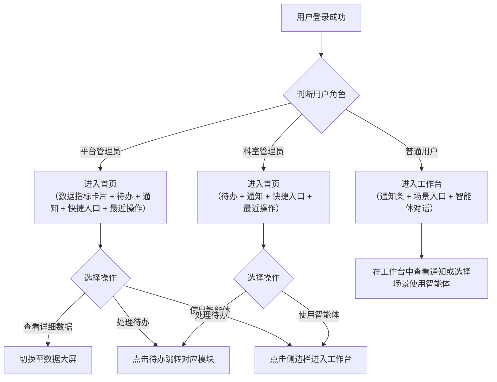

# 智能体管理平台首页-需求说明文档

## 2. 首页

登录后的管理主界面，按角色差异化展示待办事项、快捷入口、最近操作记录、系统公告与通知，平台管理员额外可见轻量数据指标卡片。数据大屏作为二级子菜单，为平台管理员提供全局态势感知与跨模块数据汇总。

本菜单仅对平台管理员和科室管理员可见，普通用户侧边栏不展示此菜单项。

### 核心业务流程



### 设计要点

- **仅管理角色可见**：首页仅对平台管理员和科室管理员展示，普通用户侧边栏不渲染此菜单项，避免出现内容空洞的页面
- **按角色差异化落地页**：平台管理员和科室管理员登录后默认进入首页（有待办需处理），普通用户登录后默认进入工作台（直接用智能体）
- **首页与数据大屏分离**：首页聚焦"我要做什么"（高频、快进快出），数据大屏聚焦"系统怎么样了"（按需、深度分析），两者使用场景和停留时长不同，独立为二级子菜单
- **首页保留轻量数据指标**：平台管理员首页顶部放 3-4 个关键数字卡片（告警数、异常数、今日调用量），不切页面也能感知紧急问题
- **通知触达分层设计**：管理角色通过首页通知模块查看；普通用户通过工作台顶部通知条触达，确保在主要使用页面即可感知系统消息

### 导航结构

<aside>
✅

**导航调整**：取消「首页」下的二级子菜单，将「首页」一级菜单直接作为**首页概览**的入口（可点击导航，无 SubMenu 展开/收起冲突）。**数据大屏**不再作为供边栏菜单项，改为首页右上角的「数据大屏」按钮入口，点击后直接进入全屏数据大屏。

</aside>

```
平台管理员侧边栏：
├── 首页（一级菜单，点击直接进入首页概览，路由 /app/home/overview，无二级子菜单）
├── 工作台（一级菜单）
├── 智能体接入中心
├── 统一台账中心
├── ...

科室管理员侧边栏：
├── 首页（一级菜单，点击直接进入首页概览，无数据大屏入口）
├── 工作台（一级菜单）
├── 智能体接入中心（部分功能）
├── ...

普通用户侧边栏：
├── 工作台（一级菜单，默认落地页）
├── 通知列表（独立页面，从顶部铃铛或工作台通知条进入）
├── （其他已授权模块）
```

**路由规则**：「首页」一级菜单直接映射到路由 `/app/home/overview`（也可使用 `/app/home` 同义，两者渲染同一页面）。数据大屏路由 `/app/home/dashboard` 仅通过首页右上角「数据大屏」按钮入口跳转（仅平台管理员可见），点击后默认以全屏模式进入。

### 功能说明

| **一级功能** | **二级功能** | **功能说明** |
| --- | --- | --- |
| 首页 | 数据指标卡片 | 平台管理员可见的轻量关键指标（待处理告警、异常智能体、今日调用量），不切页面即可感知紧急问题 |
| 首页 | 待办事项 | 按角色展示待处理任务，按紧急程度排序，点击跳转对应处理页面 |
| 首页 | 系统通知 | 展示系统公告、告警通知、审批结果等最新通知 |
| 首页 | 快捷入口 | 按角色动态展示常用功能入口卡片 |
| 首页 | 最近操作 | 展示用户最近操作记录，支持快速回溯 |
| 数据大屏 | 统计卡片 | 全局关键指标卡片（告警、状态分布、调用量、智能体总数、评测通过率、成本） |
| 数据大屏 | 趋势图表 | 调用量趋势、科室排行、类型分布、安全风险概览、响应时长分布、评测趋势 |
| 数据大屏 | 筛选与全屏 | 时间范围与科室筛选、全屏投屏模式 |

### 核心页面清单

| **页面名称** | **对应功能** | **页面类型** | **主要用途** | **使用角色** |
| --- | --- | --- | --- | --- |
| 首页 | 数据指标卡片 + 待办事项 + 系统通知 + 快捷入口 + 最近操作 | 综合信息页 | 登录后默认落地页（管理员），按角色差异化展示待办、快捷入口与轻量数据指标 | 平台管理员、科室管理员 |
| 数据大屏 | 统计卡片 + 趋势图表 + 筛选与全屏 | 数据可视化页 | 全局态势感知，支持深度分析、筛选下钻、全屏投屏 | 仅平台管理员 |

### 2-1 首页 — 字段与交互

### 页面概述

| 属性 | 说明 |
| --- | --- |
| 页面类型 | 综合信息页 |
| 使用角色 | 平台管理员、科室管理员（普通用户不可见此页面） |
| 入口 | 平台管理员/科室管理员登录后默认落地页；侧边栏「首页」（一级菜单点击直接进入，无二级子菜单） |

### 页面布局

页面由左侧导航栏 + 右侧内容区组成。**「数据大屏」按钮嵌入顶部导航栏右侧区域**（与铃铛、用户头像同行），不占用主内容区高度。主体内容区采用 **「上 + 下左右」三大区域** 布局，所有内容在首屏内完整展示，避免页面过长需滚动。

<aside>
🔘

**「数据大屏」按钮（顶部导航栏内）**：

- **位置**：嵌入全局顶部导航栏（Header）右侧区域，与顶部铃铛、用户头像同一行，**不另起一行**。
- **可见性**：仅平台管理员可见，科室管理员不展示。
- **交互**：点击后跳转 `/app/home/dashboard` 并默认进入全屏投屏模式（深色主题、隐藏侧边栏与顶部导航、自动轮播）；ESC 退出全屏后返回首页。
- **样式**：使用主色调描边按钮（AntD `Button type="primary" ghost`）+ 图标（`FundOutlined` 或 `DashboardOutlined`），文案：「数据大屏」。
- **实现提示**：在 ProLayout/Header 的 `rightContentRender` 中插入该按钮，置于铃铛图标左侧。
</aside>

<aside>
📐

**布局结构（首屏内完整展示，无多余留白）**：

- **区域一 · 数据指标（顶部，占内容区 100% 宽度）**：模块 A 数据指标卡片，位置不变，横向铺满；高度按内容自适应（约 120–140px）。
- **区域二 · 快捷入口（左下，占内容区 40% 宽度）**：模块 D 快捷入口卡片，纵向排列于左下角。
- **区域三 · 待办/通知/最近操作（右下，占内容区 60% 宽度）**：模块 B、C、E 以 **3 个 Tab 页切换展示**，默认选中「待办事项」。
</aside>

<aside>
📏

**高度规则：内容驱动 + 最小高度兑底（避免强制拉伸造成卡片内部空旷）**：

- **主内容区总高度**：使用 `min-height: calc(100vh - 顶部导航高度 - 主内容上下 padding)`，**只兑底不封顶**；低分辨率下保证填满首屏，高分辨率下允许内容自然生长、不被强制拉高。
- **下半区高度取“两者较高”**：区域二、区域三各自按内容自然高度渲染，两者以 `max(区域二高, 区域三高)` 对齐，**不强制拉伸到视口高**。如果两者高度之和 < 首屏可用高度，底部留白可接受；若超出首屏则在**卡片内部滚动**，不让页面整体滚动。
- **对齐方式**：外层 `Row` 使用 `align="top"`（顶部对齐）而非 `stretch`；两侧卡片底部不要求严格齐平——让快捷入口、待办列表以自然高度呈现，视觉上更舒适。
- **内部滚动仅在必要时**：快捷入口固定 8 个入口不会超出、无需滚动；Tab 内列表默认展示 5–6 条，超出部分不滚动而是在列表底部以「查看全部 →」链接引导跳转完整页，避免首页出现滚动条。
- **快捷入口卡片改用 2 列网格**：40% 宽度下，3 列会使单卡片过窄（图标与文字拥挤）；改为 **`Col span={12}` 两列 × 四行**（平台管理员 8 个入口刚好 4 行），卡片宽高比更接近正方形，与右侧 Tab 区高度贴合。
- **Tab 内列表项高度**：默认 5–6 条 × 单项约 56–64px，使 Tab 容器总高接近快捷入口卡片总高，自然对齐。

**代码实现示例（AntD + CSS）**：

```tsx
<div style= display: 'flex', flexDirection: 'column', minHeight: 'calc(100vh - 64px - 32px)', gap: 16 >
  <div>{/* 区域一 · 88-96px 高 */}</div>
  <Row gutter={16} align="top">
    <Col span={10}>
      <Card title="快捷入口">
        <Row gutter={[12, 12]}>
          {entries.map(e => (
            <Col span={12} key={e.key}>{/* 2 列网格入口卡 */}</Col>
          ))}
        </Row>
      </Card>
    </Col>
    <Col span={14}>
      <Card bodyStyle= padding: 0 >
        <Tabs defaultActiveKey="todo">
          {/* 默认展示 5-6 条，底部「查看全部 →」 */}
        </Tabs>
      </Card>
    </Col>
  </Row>
</div>
```

</aside>

**模块 A：数据指标卡片（仅平台管理员可见）— 区域一：顶部 100% 宽**

首页顶部轻量指标区，让管理员不切页面即可感知紧急问题。

| **序号** | **元素** | **说明** | **交互** |
| --- | --- | --- | --- |
| 1 | 待处理告警 | 未处理告警数量，红色高亮 | 点击跳转数据大屏或监控中心 |
| 2 | 异常智能体 | 当前处于异常状态的智能体数量 | 点击跳转数据大屏 |
| 3 | 今日调用量 | 全院智能体今日总调用次数 | 点击跳转数据大屏 |
| 4 | 查看详细数据 | 文字链接 | 跳转数据大屏页面 |

**模块 D：快捷入口（平台管理员、科室管理员可见）— 区域二：左下 40% 宽**

以卡片形式展示常用功能入口，按角色动态显示，置于左下角。内部采用 **2 列网格**（`Col span={12}`）× 多行排列：平台管理员 8 个入口 = 4 行，科室管理员 6 个入口 = 3 行；单卡片宽高比接近正方形，图标 + 文字不拥挤。各角色快捷入口清单见后表。

**区域三：右下 60% 宽 — Tab 切换容器**

使用 AntD `<Tabs>` 将以下三个模块以 Tab 页的形式切换展示，默认选中「待办事项」：

| **Tab 顺序** | **Tab 名称** | **对应模块** | **默认激活** | **Tab 项额外元素** |
| --- | --- | --- | --- | --- |
| 1 | 待办事项 | 模块 B | 是（`defaultActiveKey="todo"`） | Tab 文字后附未处理数量徽标（`<Badge count={n}/>`） |
| 2 | 系统通知 | 模块 C | 否 | Tab 文字后附未读数量徽标 |
| 3 | 最近操作 | 模块 E | 否 | 无徽标 |

Tab 容器右上角保留「查看全部 / 查看已处理」链接，随当前选中 Tab 动态切换跳转目标。

**模块 B：待办事项（平台管理员、科室管理员可见）— 区域三 / Tab 1（默认）**

| **序号** | **元素** | **说明** | **交互** |
| --- | --- | --- | --- |
| 1 | 待办列表 | 按角色展示待处理任务，按紧急程度排序 | 点击跳转对应处理页面 |
| 2 | 待办数量徽标 | 未处理数量 | — |
| 3 | 查看已处理 | 文字链接 | 跳转已处理待办历史列表 |

各角色待办事项类型：

| **角色** | **待办事项类型** |
| --- | --- |
| 平台管理员 | 待审批注册申请、待处理告警、待审批注销、待审批数据共享、待评测任务、待处理用户反馈工单 |
| 科室管理员 | 对接失败待修正、转交的优化建议、本科室告警通知 |

**模块 C：系统通知（平台管理员、科室管理员可见）— 区域三 / Tab 2**

| **序号** | **元素** | **说明** | **交互** |
| --- | --- | --- | --- |
| 1 | 通知列表 | 最新系统公告、告警通知、审批结果通知等（最近 5 条） | 点击查看通知详情 |
| 2 | 查看全部 | 链接 | 跳转通知列表页 |

**模块 D 快捷入口角色清单**

| **角色** | **快捷入口** |
| --- | --- |
| 平台管理员 | 接入中心、台账中心、评测沙盒、监控中心、安全治理、数据资产、用户中心、审计中心 |
| 科室管理员 | 新增注册、本科室台账、本科室监控、优化建议、用户中心、审计中心 |

**模块 E：最近操作（平台管理员、科室管理员可见）— 区域三 / Tab 3**

| **序号** | **元素** | **说明** | **交互** |
| --- | --- | --- | --- |
| 1 | 操作记录列表 | 展示用户最近 10 条操作记录（操作时间、操作内容、操作对象） | 点击跳转对应页面 |

### 各角色可见模块汇总

| **角色** | **可见模块** | **是否为默认落地页** |
| --- | --- | --- |
| 平台管理员 | 区域一 A（数据指标卡片，顶部满宽）+ 区域二 D（快捷入口，左下 40%）+ 区域三 B/C/E Tab（待办/通知/最近操作，右下 60%，默认待办事项 Tab） | 是 |
| 科室管理员 | 区域二 D（快捷入口，左下 40%）+ 区域三 B/C/E Tab（待办/通知/最近操作，右下 60%，默认待办事项 Tab） | 是 |
| 普通用户 | 不可见此页面（侧边栏不展示） | — |

### 2-2 数据大屏 — 字段与交互

### 页面概述

| 属性 | 说明 |
| --- | --- |
| 页面类型 | 数据可视化页 |
| 使用角色 | 仅平台管理员 |
| 入口 | 首页右上角「数据大屏」按钮（仅平台管理员可见，点击后直接进入全屏）/ 首页数据指标卡片区「查看详细数据」链接 |

### 页面布局

页面自上而下分为：筛选栏 → 统计卡片区 → 图表区。

**筛选栏**

<aside>
⚠️

**全屏按钮唯一性约束**：整个数据大屏页面有且仅有 **一个** 全屏投屏按钮，位于筛选栏右侧。页面标题区域、卡片区域、图表区域均 **不得** 重复放置全屏按钮。生成代码时需确认页面内不存在第二个全屏入口。

</aside>

| **序号** | **元素** | **说明** | **交互** |
| --- | --- | --- | --- |
| 1 | 时间范围 | 下拉选择：今日 / 近 7 天 / 近 30 天 / 自定义 | 选择后全页数据刷新 |
| 2 | 科室筛选 | 下拉多选，支持搜索 | 选择后按科室过滤数据 |
| 3 | 全屏按钮（唯一） | 进入全屏投屏模式（深色背景、自动轮播）。**全页面仅此一处**，禁止在页面标题区或其他位置重复放置 | 点击进入全屏，ESC 退出 |
| 4 | 刷新按钮 | 手动刷新数据 | 点击后重新拉取最新数据 |
| 5 | 自动刷新开关 | 开启后每 5 分钟自动刷新 | Toggle 开关 |

**统计卡片区（按优先级排序）**

排序逻辑：首要关注"有没有问题需要立即处理"（告警、异常），其次关注"系统整体运行情况"（调用量、状态），最后关注"中长期治理指标"（评测、成本）。

<aside>
📐

**布局约束（修正）**：6 个统计卡片采用 **两行三列** 布局（`Row > Col span={8}`，每列宽度 = 页面 1/3），不得 6 个一行横排。每个卡片内部设置 `overflow: hidden`、文字使用 `ellipsis` 截断 + `Tooltip` 展示完整内容，数值字号不超过 30px。卡片最小宽度 200px，低于此宽度时自动换行。

</aside>

| **序号** | **卡片名称** | **数据说明** | **交互** |
| --- | --- | --- | --- |
| 1 | 待处理告警 | 未处理告警数量（按严重/警告/提示分级显示） | 点击跳转监控中心统一告警 |
| 2 | 在线 / 离线 / 异常 | 运行状态分布统计（环形微图） | 点击跳转监控中心状态总览 |
| 3 | 今日调用量 | 全院智能体今日总调用次数（含环比昨日） | 点击跳转监控中心业务监控 |
| 4 | 智能体总数 | 全院已纳入台账的智能体数量（含本月新增） | 点击跳转台账中心 |
| 5 | 评测通过率 | 近 30 天评测通过率（含环比上月） | 点击跳转评测沙盒 |
| 6 | 本月成本 | 本月累计资源成本（含环比上月） | 点击跳转监控中心成本监控 |

**图表区**

| **序号** | **图表名称** | **图表类型** | **说明** | **交互** |
| --- | --- | --- | --- | --- |
| 1 | 调用量趋势 | 折线图 | 按筛选时间范围展示每日调用量趋势 | 悬浮显示详情，点击跳转监控中心业务监控 |
| 2 | 科室使用排行 | 横向柱状图 | Top 10 科室调用量排行 | 点击柱状条跳转该科室详情 |
| 3 | 智能体类型分布 | 饼图 | 按类型分布（辅助诊断/影像分析/病历生成/用药审核等） | 点击扇区跳转台账中心对应分类 |
| 4 | 安全风险概览 | 雷达图 | 六维风险指数概览（数据安全/模型安全/接口安全/合规/权限/审计） | 点击跳转安全治理中心首页 |
| 5 | 响应时长分布 | 直方图 | 智能体响应时长分布（<1s / 1-3s / 3-5s / >5s） | 点击跳转监控中心性能监控 |
| 6 | 评测趋势 | 折线图 | 近 30 天评测通过率变化趋势 | 点击跳转评测沙盒 |

**全屏投屏模式**

| **序号** | **差异点** | **说明** |
| --- | --- | --- |
| 1 | 背景 | 切换为深色主题 |
| 2 | 布局 | 卡片与图表重新排列为大屏比例（16:9 适配） |
| 3 | 自动轮播 | 图表区自动轮播切换，每 10 秒切换一组 |
| 4 | 隐藏导航 | 隐藏侧边栏和顶部导航，仅保留退出按钮 |
| 5 | 数据刷新 | 强制开启自动刷新（每 5 分钟） |

### 数据大屏与监控首页的边界说明

| **维度** | **数据大屏（2-2）** | **监控首页（8-1）** |
| --- | --- | --- |
| 定位 | 跨模块全局概览，管理者视角 | 运行监控维度深度专题大盘，运维视角 |
| 数据范围 | 接入数量 + 评测通过率 + 科室排行 + 安全风险 + 调用量 + 成本 | 仅聚焦性能/状态/业务/成本四维运行指标 |
| 数据粒度 | 汇总级（数字 + 简单趋势 + 环比） | 明细级（可按时间/科室/智能体下钻） |
| 使用场景 | 管理者全局态势感知、汇报投屏 | 运维人员深入排查问题 |
| 筛选能力 | 时间范围 + 科室（粗粒度） | 时间 + 科室 + 智能体 + 指标类型（细粒度） |
| 跳转关系 | 大屏中各卡片/图表点击后跳转至对应模块详情页 | — |

### 与其他模块的联动关系

| **数据来源/去向** | **联动说明** |
| --- | --- |
| 统一台账中心（模块 5）→ 数据大屏 | 读取智能体总数与状态分布 |
| 统一运行监控中心（模块 8）→ 首页 + 数据大屏 | 读取调用量、告警数、响应时长等指标 |
| 统一准入评测沙盒（模块 6）→ 数据大屏 | 读取评测通过率与趋势 |
| 统一安全治理中心（模块 9）→ 数据大屏 | 读取六维安全风险指数 |
| 各模块 → 首页待办 | 各模块产生的待办事项汇聚至首页待办列表 |
| 各模块 → 通知中心 | 各模块产生的通知推送至首页通知模块（管理员）和工作台通知条（普通用户） |