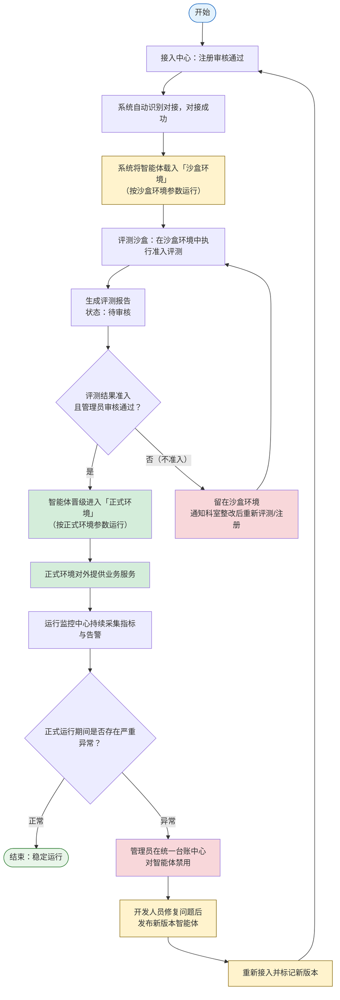

# 环境配置-需求说明文档

为接入、评测、监控的智能体提供「沙盒环境」与「正式环境」两套运行环境，本模块是统一管理这两个环境的入口，分别对两个环境进行参数配置（计算资源、网络隔离、数据策略、安全认证、流量与灰度、监控告警等）。接入中心审核通过、系统自动对接成功的智能体首先进入沙盒环境进行准入评测；在沙盒环境中评测报告结果为「准入」且经管理员审核通过的智能体，晋级进入正式环境对外提供业务服务。

### 模块定位与范围

<aside>
🧭

**定位**：环境配置是平台的「环境管理入口」，对外提供两套标准化运行环境——**沙盒环境**（隔离、用于评测/灰度、使用脱敏或模拟数据、不对外服务）与**正式环境**（对外提供真实业务服务、使用生产数据、全量监控告警）。

**核心职责**：①集中配置与维护两个环境的运行参数；②呈现每个环境内的智能体分布；③承接智能体在「接入 → 沙盒 → 正式」全生命周期中的环境流转与晋级。

**范围边界**：本模块只负责「环境的参数配置与智能体所在环境的流转」；评测执行由「统一准入评测沙盒」承接，运行指标采集与告警由「统一运行监控中心」承接，台账状态由「统一台账中心」承接。

</aside>

### 核心业务流程



### 环境流转与准入机制

<aside>
🔄

智能体在接入中心审核通过、系统对接成功后，由系统自动载入**沙盒环境**，按沙盒环境参数（隔离网络、脱敏/模拟数据）运行并接受准入评测。评测完成后报告进入「待审核」，平台管理员审核为「准入」的智能体，满足晋级门槛后晋级进入**正式环境**，按正式环境参数（生产数据、对外流量、全量监控）运行；评测「不准入」的智能体留在沙盒环境，通知科室整改后重新评测或在接入中心重新注册。正式运行期间发现严重异常时，管理员在**统一台账中心**对智能体禁用；后续由开发人员修复问题、发布新版本智能体，并**重新接入（标记新版本）后重新评测**。如仅需重新验证而无需重新发版，也可将智能体退回沙盒环境复测。

</aside>

**主流程：** 接入审核通过 → 对接成功 → 载入沙盒环境 → 沙盒评测 → 评测准入 + 管理员审核通过 → 晋级正式环境 → 对外服务 + 全量监控

**异常分支：** 评测不准入（留在沙盒，整改后重测）｜ 正式运行异常（统一台账中心禁用 → 开发修复并发布新版本 → 重新接入标记新版本 → 重新评测；或退回沙盒复测）

| **所处环境** | **说明** | **进入 / 离开条件** |
| --- | --- | --- |
| 未入环境 | 智能体已在接入中心注册，但尚未通过审核或尚未对接成功 | 审核通过且系统对接成功 → 进入沙盒环境 |
| 沙盒环境 | 隔离环境，使用脱敏/模拟数据，用于准入评测与灰度验证，不对外提供业务服务 | 进入：对接成功自动载入；离开：评测准入 + 管理员审核通过后晋级正式环境 |
| 正式环境 | 对外提供真实业务服务，使用生产数据，接受运行监控中心全量监控告警 | 进入：沙盒评测准入 + 管理员审核通过；离开：禁用（统一台账中心）或退回沙盒复测 |

<aside>
⚠️

**范围说明**：本模块负责定义两个环境的运行参数，并记录/流转「智能体当前所处环境」。评测「待评测 → 评测中 → 待审核 → 已审核（准入/不准入）」由「统一准入评测沙盒」负责；台账「试运行中 → 已上线」状态由「统一台账中心」负责；运行指标采集与告警由「统一运行监控中心」负责。环境配置仅提供这些动作发生的「环境上下文与参数基线」。

</aside>

### 沙盒环境 vs 正式环境 对比

| **对比维度** | **沙盒环境（Sandbox）** | **正式环境（Production）** |
| --- | --- | --- |
| 用途 | 准入评测、灰度验证、问题复现 | 对外提供真实业务服务 |
| 数据来源 | 脱敏数据 / 模拟数据 / 评测数据集 | 生产真实数据（HIS、EMR 等） |
| 网络 | 隔离网络，默认禁止出网，仅白名单可达 | 生产网络，按业务需要开放 |
| 对外服务 | 否（不承接真实业务流量） | 是（对外提供业务流量） |
| 流量策略 | 评测/灰度流量，可按比例放量 | 全量业务流量 + 限流 / 熔断保护 |
| 监控强度 | 评测过程监控，采集评测相关指标 | 全量运行监控 + 告警 + SLA 看护 |
| 进入条件 | 接入审核通过 + 对接成功（系统自动载入） | 沙盒评测准入 + 管理员审核通过（晋级） |

### 导航结构

```
环境配置（一级菜单，DeploymentUnitOutlined 图标）【平台管理员】
├── 沙盒环境（二级菜单，默认落地页，路由 /app/environment/sandbox）
│   ├── Tab 1：沙盒环境配置（默认）
│   └── Tab 2：沙盒环境内智能体
└── 正式环境（二级菜单，路由 /app/environment/production）
    ├── Tab 1：正式环境配置（默认）
    └── Tab 2：正式环境内智能体
```

### 功能说明

| **二级入口** | **Tab 页** | **功能说明** |
| --- | --- | --- |
| 沙盒环境 | 沙盒环境配置 | 按参数分组（运行环境管理、虚拟环境安装、运行资源配置、网络资源配置、虚拟权限配置）配置沙盒环境运行基线，保存后对该环境内全部智能体生效 |
| 沙盒环境 | 沙盒环境内智能体 | 展示当前处于沙盒环境的智能体列表，支持查看评测状态、发起/查看评测、对准入智能体执行「晋级正式环境」 |
| 正式环境 | 正式环境配置 | 配置正式环境运行基线（含灰度比例、限流熔断、生产数据源、全量监控告警等），保存后对该环境内全部智能体生效 |
| 正式环境 | 正式环境内智能体 | 展示当前处于正式环境的智能体列表，支持查看运行状态、跳转监控、执行「退回沙盒复测」 |
| 通用（两页共用） | 晋级 / 退回弹窗 | 对沙盒环境内评测准入且审核通过的智能体执行晋级；对正式环境异常智能体执行退回沙盒复测；全程留痕归档审计中心 |

### 核心页面清单

| **页面名称** | **页面类型** | **主要用途** | **使用角色** |
| --- | --- | --- | --- |
| 沙盒环境页 | 双 Tab 页（配置 + 列表） | 含「沙盒环境配置」「沙盒环境内智能体」两个 Tab，配置沙盒参数并管理环境内智能体与晋级 | 平台管理员 |
| 正式环境页 | 双 Tab 页（配置 + 列表） | 含「正式环境配置」「正式环境内智能体」两个 Tab，配置正式参数并管理环境内智能体与退回复测 | 平台管理员 |
| 智能体晋级 / 退回弹窗 | 弹窗（Modal） | 校验晋级门槛、确认环境流转、填写原因并留痕 | 平台管理员 |

---

### 模块页面总览

<aside>
🗂️

环境配置为**一级菜单**，下设**两个二级功能入口**——「沙盒环境」（默认落地页）与「正式环境」，二者为各自独立的页面，不再用顶部 Tab 切换。每个二级页面内部各含 2 个 Tab：「环境配置」（参数配置，Collapse 折叠分组 + 底部保存/重置操作栏）与「环境内智能体」（ProTable）。

</aside>

---

### 1 沙盒环境页 — 字段与交互

#### 页面概述

| 属性 | 说明 |
| --- | --- |
| 页面类型 | 双 Tab 页（配置 + 列表） |
| 使用角色 | 平台管理员 |
| 入口 | 侧边栏「环境配置 > 沙盒环境」（默认落地页） |
| 路由 | /app/environment/sandbox |
| 面包屑 | 环境配置 > 沙盒环境 |
| 页面结构 | Tab 1「沙盒环境配置」（默认）+ Tab 2「沙盒环境内智能体」 |

#### Tab 1：沙盒环境配置

<aside>
⚙️

**配置生效范围**：沙盒环境参数为该环境的「运行基线」，保存后对当前及后续载入沙盒环境的全部智能体统一生效；涉及资源、网络的关键变更，保存时 Modal.confirm 二次确认并提示影响范围（当前环境内 N 个智能体）。

</aside>

#### 参数分组 1：运行环境管理

| **序号** | **字段** | **Antd 组件** | **必填** | **说明** |
| --- | --- | --- | --- | --- |
| 1 | 运行环境 | [Radio.Group](http://Radio.Group) | 是 | 提供「虚拟沙盒环境」「正式运行环境」，管理员选择「虚拟沙盒环境」 |

#### 参数分组 2：虚拟环境安装

| **序号** | **字段** | **Antd 组件** | **必填** | **说明** |
| --- | --- | --- | --- | --- |
| 1 | Docker 版本 | Input | 是 | 如 Docker 26.1.4 及以上 |
| 2 | Docker Compose 版本 | Input | 是 | 如 Docker Compose 2.27.1 及以上 |

#### 参数分组 3：运行资源配置

<aside>
🧮

根据智能体注册信息中填写的资源需求进行配置。

</aside>

| **序号** | **字段** | **Antd 组件** | **必填** | **说明** |
| --- | --- | --- | --- | --- |
| 1 | CPU | InputNumber（Core） | 是 | 根据注册信息中填写的需求配置，如 CPU ≥ 4 Core |
| 2 | RAM 内存 | InputNumber（GB） | 是 | 根据注册信息中填写的需求配置，如 RAM ≥ 16 GB |
| 3 | Disk 磁盘 | InputNumber（GB） | 是 | 根据注册信息中填写的需求配置，如 Disk ≥ 50 GB |

#### 参数分组 4：网络资源配置

| **序号** | **字段** | **Antd 组件** | **必填** | **说明** |
| --- | --- | --- | --- | --- |
| 1 | 网络地址 | Input | 是 | 接入虚拟内网 IP 地址，如 [http://127.0.0.1](http://127.0.0.1) |
| 2 | 端口分配 | Select mode="tags" | 是 | 如 80、443、8080 端口 |
| 3 | 登录认证方式 | Select | 是 | 配置 SSH 密钥登录，禁用 root 直接登录 |

#### 参数分组 5：虚拟权限配置

<aside>
🔐

根据权限审批结果配置虚拟权限；不同业务系统所提供的接口地址、操作权限与数据范围权限各不相同。

</aside>

| **序号** | **字段** | **Antd 组件** | **必填** | **说明** |
| --- | --- | --- | --- | --- |
| 1 | 医院业务系统 | Select | 是 | 根据权限审批结果配置虚拟权限 |
| 2 | 数据授权范围 | Select | 是 | 根据权限审批结果配置虚拟权限 |
| 3 | 操作权限类型 | Select | 是 | 根据权限审批结果配置虚拟权限 |
| 4 | 权限接口地址 | Input | 是 | 虚拟权限地址；不同系统所提供的接口地址不同 |
| 5 | 权限认证方式 | Select | 是 | 如 API Key；不同系统的操作权限和数据范围权限不同 |

#### 底部操作栏

| **序号** | **操作** | **Antd 组件** | **说明** |
| --- | --- | --- | --- |
| 1 | 保存 | Button type="primary" | 校验各分组必填项 → Modal.confirm 提示影响范围 → 保存并对环境内智能体生效 → message.success |
| 2 | 重置 | Button type="default" | 恢复为上次保存的值（Modal.confirm 二次确认） |

#### Tab 2：沙盒环境内智能体（ProTable）

| **序号** | **列名** | **类型** | **说明** | **交互** |
| --- | --- | --- | --- | --- |
| 1 | 智能体名称 | 文本链接 | 当前处于沙盒环境的智能体 | 点击查看详情 |
| 2 | 版本号 / 供应商 / 归属科室 | 文本 + Tag | 从接入中心同步 | — |
| 3 | 评测状态 | Tag（状态色） | 待评测 / 评测中 / 待审核 / 已审核·准入 / 已审核·不准入 | — |
| 4 | 评测得分 | 数字 | 评测综合总分（评测完成后展示） | — |
| 5 | 是否满足晋级门槛 | Tag | 满足（success）/ 不满足（default），按晋级规则自动判定 | — |
| 6 | 操作 | Space + Button type="link" | fixed: 'right' | 查看评测报告 / 晋级正式环境（仅评测准入且满足门槛时可用） |

<aside>
💡

**晋级入口**：仅当智能体「评测结论=准入」且「满足晋级门槛」时，「晋级正式环境」按钮才可点击；点击后打开「智能体晋级弹窗」（见第 3 节）。不满足条件时按钮置灰并 Tooltip 说明原因。

</aside>

---

### 2 正式环境页 — 字段与交互

#### 页面概述

| 属性 | 说明 |
| --- | --- |
| 页面类型 | 双 Tab 页（配置 + 列表） |
| 使用角色 | 平台管理员 |
| 入口 | 侧边栏「环境配置 > 正式环境」 |
| 路由 | /app/environment/production |
| 面包屑 | 环境配置 > 正式环境 |
| 页面结构 | Tab 1「正式环境配置」（默认）+ Tab 2「正式环境内智能体」 |

#### Tab 1：正式环境配置

与沙盒环境页的「沙盒环境配置」Tab 结构一致（5 个折叠分组 + 底部保存/重置栏），差异集中在各分组的取值与约束：运行环境选择「正式运行环境」、真实环境安装、接入医院内网、按权限审批结果配置真实权限。

<aside>
⚠️

**生产慎重**：正式环境直接对外提供业务服务，保存涉及资源、网络、权限的变更时，除 Modal.confirm 影响范围确认外，必须填写「变更原因」并归档审计中心；建议在低峰期变更。

</aside>

#### 参数分组 1：运行环境管理

| **序号** | **字段** | **Antd 组件** | **必填** | **说明** |
| --- | --- | --- | --- | --- |
| 1 | 运行环境 | [Radio.Group](http://Radio.Group) | 是 | 提供「虚拟沙盒环境」「正式运行环境」，用户选择「正式运行环境」 |

#### 参数分组 2：真实环境安装

| **序号** | **字段** | **Antd 组件** | **必填** | **说明** |
| --- | --- | --- | --- | --- |
| 1 | Docker 版本 | Input | 是 | 如 Docker 26.1.4 及以上 |
| 2 | Docker Compose 版本 | Input | 是 | 如 Docker Compose 2.27.1 及以上 |

#### 参数分组 3：运行资源配置

<aside>
🧮

根据智能体注册信息中填写的资源需求进行配置。

</aside>

| **序号** | **字段** | **Antd 组件** | **必填** | **说明** |
| --- | --- | --- | --- | --- |
| 1 | CPU | InputNumber（Core） | 是 | 根据注册信息中填写的需求配置，如 CPU ≥ 4 Core |
| 2 | RAM 内存 | InputNumber（GB） | 是 | 根据注册信息中填写的需求配置，如 RAM ≥ 16 GB |
| 3 | Disk 磁盘 | InputNumber（GB） | 是 | 根据注册信息中填写的需求配置，如 Disk ≥ 50 GB |

#### 参数分组 4：网络资源配置

| **序号** | **字段** | **Antd 组件** | **必填** | **说明** |
| --- | --- | --- | --- | --- |
| 1 | 网络地址 | Input | 是 | 接入医院内网 IP 地址，如 [http://127.0.0.1](http://127.0.0.1) |
| 2 | 端口分配 | Select mode="tags" | 是 | 如 80、443、8080 端口 |
| 3 | 登录认证方式 | Select | 是 | 配置 SSH 密钥登录，禁用 root 直接登录 |

#### 参数分组 5：权限配置

<aside>
🔐

根据权限审批结果配置权限；每个系统的操作权限和数据范围权限不同，不同系统所提供的接口地址也不同。

</aside>

| **序号** | **字段** | **Antd 组件** | **必填** | **说明** |
| --- | --- | --- | --- | --- |
| 1 | 医院业务系统 | Select | 是 | 根据权限审批结果配置权限 |
| 2 | 数据授权范围 | Select | 是 | 根据权限审批结果配置权限 |
| 3 | 操作权限类型 | Select | 是 | 根据权限审批结果配置权限 |
| 4 | 接口地址 | Input | 是 | 各业务系统权限地址；不同系统所提供的接口地址不同 |
| 5 | 认证方式 | Select | 是 | 如 API Key；每个系统的操作权限和数据范围权限不同 |

#### Tab 2：正式环境内智能体（ProTable）

| **序号** | **列名** | **类型** | **说明** | **交互** |
| --- | --- | --- | --- | --- |
| 1 | 智能体名称 | 文本链接 | 当前处于正式环境的智能体 | 点击查看详情 |
| 2 | 版本号 / 供应商 / 归属科室 | 文本 + Tag | 从接入中心 / 台账同步 | — |
| 3 | 运行状态 | Tag（状态色） | 运行中（success）/ 告警中（warning）/ 异常（error） | — |
| 4 | 晋级时间 | 日期时间 | 从沙盒晋级进入正式环境的时间 | 支持 sorter 排序 |
| 5 | 操作 | Space + Button type="link" | fixed: 'right' | 查看监控（跳转运行监控中心）/ 退回沙盒复测 |

<aside>
↩️

**退回沙盒复测**：正式环境智能体出现严重异常或需重新验证时，平台管理员可执行「退回沙盒复测」，智能体回到沙盒环境重新评测；退回需填写原因并归档审计中心，并站内通知归属科室管理员与供应商联系人。严重故障需立即停服时，应在统一台账中心执行「禁用」；禁用后由开发人员修复问题、发布新版本智能体，重新接入（标记新版本）并重新评测。

</aside>

---

### 3 智能体晋级 / 退回弹窗 — 字段与交互

#### 晋级正式环境弹窗（Modal 520px）

<aside>
⬆️

**触发位置**：沙盒环境页「沙盒环境内智能体」Tab 列表中，对评测准入且满足晋级门槛的智能体点击「晋级正式环境」。

</aside>

| **序号** | **元素 / 字段** | **Antd 组件** | **必填** | **说明** |
| --- | --- | --- | --- | --- |
| 1 | 晋级对象信息 | Descriptions size="small" | — | 智能体名称 / 版本 / 归属科室 / 评测总分 / 评测结论 |
| 2 | 门槛校验结果 | Result / Alert | — | 逐条展示晋级规则校验：总分门槛、各维度最低分、评测结论=准入，全部通过显示 success |
| 3 | 晋级说明 | Input.TextArea | 否 | ≤500 字，记录晋级决策说明 |
| 4 | 确认晋级 | Button type="primary" | — | 确认后：智能体所处环境由「沙盒」变更为「正式」，按正式环境参数运行；台账中心状态联动「试运行中/已上线」；站内通知归属科室管理员；操作归档审计中心 |
| 5 | 取消 | Button type="default" | — | 关闭弹窗，不执行晋级 |

#### 退回沙盒复测弹窗（Modal 520px）

| **序号** | **元素 / 字段** | **Antd 组件** | **必填** | **说明** |
| --- | --- | --- | --- | --- |
| 1 | 退回对象信息 | Descriptions size="small" | — | 智能体名称 / 版本 / 当前运行状态 |
| 2 | 退回原因 | Input.TextArea | 是 | ≤500 字，明确退回原因（如运行异常、需重新验证） |
| 3 | 是否停止对外服务 | Switch | 是 | 开启则退回同时关闭正式流量（默认开启） |
| 4 | 确认退回 | Button danger | — | 确认后：智能体所处环境由「正式」变更为「沙盒」，重新进入评测流程；台账状态联动；站内通知归属科室管理员与供应商联系人；操作归档审计中心 |

---

### 附录 A：环境配置参数清单

<aside>
📌

以下为两个环境的参数项汇总，作为系统初始化预置配置项。平台管理员可在对应环境配置页调整具体取值。

</aside>

| **参数分组** | **参数项** | **沙盒环境默认** | **正式环境默认** |
| --- | --- | --- | --- |
| 运行环境管理 | 运行环境 | 虚拟沙盒环境 | 正式运行环境 |
| 环境安装（虚拟 / 真实） | Docker 版本 | 26.1.4 及以上 | 26.1.4 及以上 |
| 环境安装（虚拟 / 真实） | Docker Compose 版本 | 2.27.1 及以上 | 2.27.1 及以上 |
| 运行资源配置 | CPU | ≥ 4 Core（按注册需求） | ≥ 4 Core（按注册需求） |
| 运行资源配置 | RAM 内存 | ≥ 16 GB（按注册需求） | ≥ 16 GB（按注册需求） |
| 运行资源配置 | Disk 磁盘 | ≥ 50 GB（按注册需求） | ≥ 50 GB（按注册需求） |
| 网络资源配置 | 网络地址 | 接入虚拟内网 IP（如 [http://127.0.0.1）](http://127.0.0.1）) | 接入医院内网 IP（如 [http://127.0.0.1）](http://127.0.0.1）) |
| 网络资源配置 | 端口分配 | 80、443、8080 | 80、443、8080 |
| 网络资源配置 | 登录认证方式 | SSH 密钥登录，禁用 root 直接登录 | SSH 密钥登录，禁用 root 直接登录 |
| 权限配置 | 医院业务系统 | 按权限审批结果配置虚拟权限 | 按权限审批结果配置权限 |
| 权限配置 | 数据授权范围 | 按权限审批结果配置虚拟权限 | 按权限审批结果配置权限 |
| 权限配置 | 操作权限类型 | 按权限审批结果配置虚拟权限 | 按权限审批结果配置权限 |
| 权限配置 | 接口地址 | 虚拟权限地址 | 各业务系统权限地址 |
| 权限配置 | 认证方式 | API Key | API Key |

---

### 附录 B：与其他模块联动关系

| **源模块** | **触发点** | **目标模块** | **联动说明** |
| --- | --- | --- | --- |
| 接入中心 | 审核通过 + 对接成功 | 环境配置 | 系统自动将智能体载入沙盒环境，按沙盒环境参数运行 |
| 环境配置 | 智能体载入沙盒 | 评测沙盒 | 智能体载入沙盒环境后，评测沙盒在该环境内创建准入评测任务并执行评测 |
| 评测沙盒 | 评测准入 + 管理员审核通过 | 环境配置 | 满足晋级门槛的智能体可在环境配置中晋级进入正式环境 |
| 环境配置 | 晋级正式环境 | 台账中心 + 运行监控中心 | 晋级后台账状态联动（试运行中/已上线），运行监控中心按正式环境参数启动全量监控 |
| 环境配置 | 退回沙盒复测 | 评测沙盒 + 台账中心 | 正式环境异常智能体退回沙盒重新评测，台账状态同步回退 |
| 运行监控中心 | 正式运行严重异常 | 统一台账中心 / 环境配置 | 在统一台账中心对智能体禁用（修复后发布新版本，重新接入并标记新版本、重新评测），或在环境配置执行退回沙盒复测 |
| 安全治理中心 | 权限审批结果 | 环境配置 | 权限配置分组（医院业务系统、数据授权范围、操作权限类型、接口地址、认证方式）按权限审批结果配置；不同系统的接口地址与权限范围各不相同 |
| 环境配置 | 参数变更 / 环境流转 | 审计中心 | 环境参数变更、晋级、退回等操作均记录操作人、时间、原因并归档 |