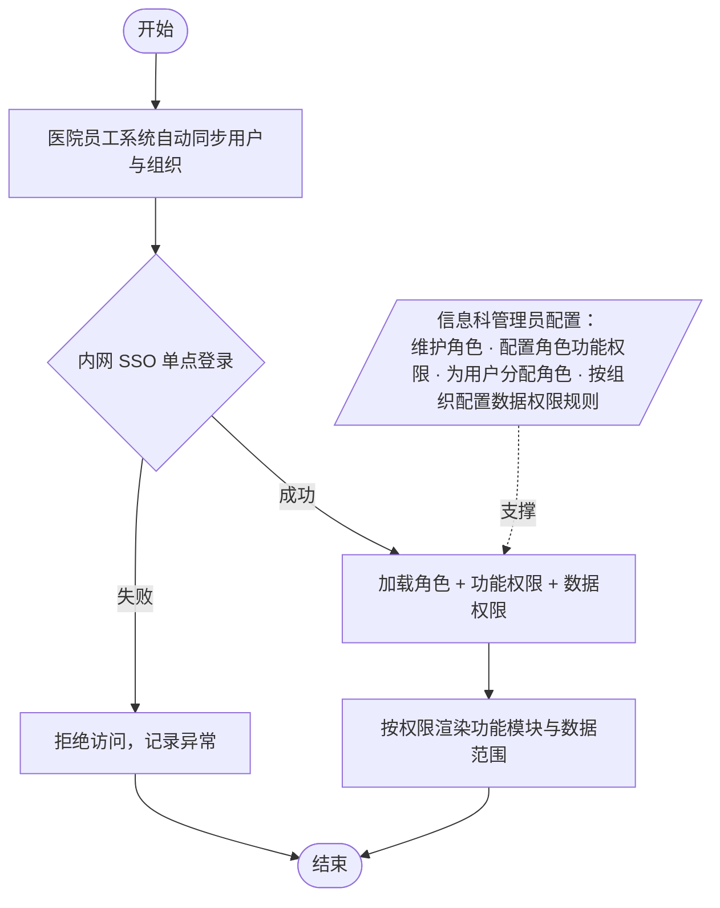

# 用户中心-需求说明文档

对接医院员工系统自助同步用户与组织信息，结合医院内网 SSO 单点登录，实现身份免注册、角色可配置、功能权限按角色配、数据权限按组织配（用户继承所属科室规则）的统一身份与权限中心。

**设计要点**

**身份免维护**：通过医院员工/组织系统自动同步用户基础信息（姓名、工号、所属组织），平台管理员无需手工维护用户基本信息，仅负责角色与数据权限分配

**SSO 单点登录**：用户通过医院内网单点登录直接进入平台，无需在平台单独注册或维护密码

**角色可扩展**：系统默认提供「信息科管理员、信息科普通用户、科室管理员」三类角色，管理员可新增自定义角色，用户可同时拥有多个角色

**功能权限按角色 / 数据权限按组织**：功能权限以角色为单位配置「能做什么」；数据权限以组织（科室）为单位配置「能看哪些数据」，用户通过医院系统同步的「所属组织」自动继承本科室的数据范围，转岗时随同步自动切换；少数跨科室或特殊用户通过「用户级覆盖」作为例外通道，两条线相互独立

**仅信息科管理员可访问**：用户中心模块仅对信息科管理员开放，其他角色在侧边栏及路由上都不可见；普通用户如需调整权限，需线下联系信息科管理员处理

**与安全治理联动**：身份风险治理（模块 8）依赖用户中心的身份与权限数据进行异常登录检测、越权审计

### **核心流程**

| **阶段** | **做什么** | **谁来做** |
| --- | --- | --- |
| 员工同步 | 定时/实时从医院员工系统同步员工与组织信息 → 平台用户库自动新增/更新/停用 | 系统自动（管理员可手动触发） |
| 登录使用 | 医院内网点击平台入口 → SSO 自动认证 → 自动识别身份与组织 → 按角色加载功能与数据权限 | 全部用户 |
| 角色与功能权限配置 | 新增/编辑角色 → 配置角色的功能权限矩阵 | 信息科管理员 |
| 用户角色分配 | 为同步过来的用户分配一个或多个角色 | 信息科管理员 |
| 组织数据权限配置 | 按科室/组织配置可见智能体范围与数据分级，用户自动继承本科室规则；例外用户做用户级覆盖 | 信息科管理员 |

### **功能说明**

| **一级功能** | **二级功能** | **功能说明** |
| --- | --- | --- |
| 身份认证管理 | SSO 单点登录 | 对接医院内网统一身份认证（SSO），用户在医院内网点击平台入口即可免注册、免密码直接登录；登录后平台自动获取用户姓名与所属组织 |
| 用户同步 | 员工信息自动同步 | 对接医院员工/组织系统，定时或实时同步员工的姓名、工号、所属组织、在职状态；离职或停用员工自动停用平台账号，无需管理员手工维护 |
| 用户管理 | 用户查看与角色分配 | 管理员仅查看同步过来的用户列表，支持按组织、角色、状态筛选与搜索；可为用户分配一个或多个角色，不能修改用户的姓名、工号、组织等基础信息 |
| 角色管理 | 角色管理 | 系统默认包含「信息科管理员、信息科普通用户、科室管理员」三类角色（不可删除）；管理员可新增/编辑/删除自定义角色，配置角色名称、描述 |
| 权限配置 | 功能权限配置 | 以角色为单位，按模块-页面-操作三级结构配置可访问的功能范围，支持矩阵式勾选；同一用户拥有多角色时取并集 |
| 权限配置 | 组织数据权限配置 | 以组织（科室）为单位配置可见的智能体范围、数据分级；用户通过医院系统同步的「所属组织」自动继承对应规则，无需逐人配置；提供「全院默认规则」作为兄弟免配科室的免配兑底 |
| 权限配置 | 用户级数据权限覆盖 | 极少数跨科室、临时调研或特殊审计的用户可在「用户级覆盖」中单独配置数据范围，覆盖优先级高于组织默认；支持随转岗/离职自动失效或设定截止日期 |

### **核心页面清单**

本模块下所有页面仅对**信息科管理员**开放，其他角色无访问入口。

| **编号** | **页面名称** | **对应二级功能** | **页面类型** | **需求编号** | **主要用途** | **使用角色** |
| --- | --- | --- | --- | --- | --- | --- |
| 10-1 | 用户列表页 | 用户查看与角色分配 / 员工信息自动同步 | 列表+抽屉页 | PC103002 | 查看同步过来的用户，按组织/角色/状态筛选；为用户分配角色、查看同步状态、手动触发同步 | 信息科管理员 |
| 10-2 | 角色管理页 | 角色管理 | 列表+详情页 | PC103003 | 查看默认与自定义角色，新增/编辑/删除自定义角色，查看角色绑定用户数与权限概览 | 信息科管理员 |
| 10-3 | 功能权限配置页 | 功能权限配置 | 矩阵配置页 | PC103004 | 以角色×功能矩阵形式配置功能权限，支持模块-页面-操作三级展开与批量勾选 | 信息科管理员 |
| 10-4 | 数据权限配置页 | 组织数据权限配置 / 用户级数据权限覆盖 | 双 Tab 配置页 | PC103005 | 按组织为单位配置可见智能体范围与数据分级；独立管理用户级覆盖记录 | 信息科管理员 |

### **11-1 用户列表页 — 字段与交互**

### **页面概述**

| **属性** | **说明** |
| --- | --- |
| 页面类型 | 列表 + 抽屉页 |
| 使用角色 | 信息科管理员 |
| 入口 | 平台首页侧边栏「用户中心」→「用户列表」 |
| 数据来源 | 由医院员工/组织系统自动同步，平台不允许手工新增、编辑姓名/工号/组织等基础字段 |

### **同步状态条**

页面顶部显示同步状态条：上次同步时间、本次同步新增/更新/停用人数、同步结果（成功/部分失败/失败）、「立即同步」按钮（手动触发一次全量同步）、「查看同步日志」入口。

### **筛选与搜索**

| **序号** | **筛选项** | **类型** | **说明** |
| --- | --- | --- | --- |
| 1 | 关键字搜索 | 文本输入 | 按姓名、工号模糊搜索 |
| 2 | 所属组织 | 树形下拉 | 按医院组织树筛选（信息科 / 各临床科室等） |
| 3 | 角色 | 下拉多选 | 全部 / 信息科管理员 / 信息科普通用户 / 科室管理员 / 自定义角色… |
| 4 | 状态 | 下拉筛选 | 全部 / 在职 / 已停用（已停用 = 医院侧离职或停用，平台自动同步） |
| 5 | 是否已分配角色 | 下拉筛选 | 全部 / 已分配 / 未分配（用于快速发现尚未授权的新员工） |

### **用户列表字段**

| **序号** | **列名** | **类型** | **说明** | **交互** |
| --- | --- | --- | --- | --- |
| 1 | 姓名 | 文本链接 | 从医院系统同步 | 点击打开用户详情抽屉 |
| 2 | 工号 | 文本 | 从医院系统同步，唯一标识 | — |
| 3 | 所属组织 | 文本 | 从医院系统同步 | — |
| 4 | 角色 | 标签组 | 该用户当前拥有的角色（可多个） | — |
| 5 | 数据权限 | 文本摘要 + 标签 | 显示当前生效的数据范围摘要，并标注「继承自 XX 科室」或「用户级覆盖」 | 点击查看生效详情，可进入用户级覆盖配置 |
| 6 | 状态 | 状态标签 | 在职（绿）/ 已停用（灰，由医院系统同步） | — |
| 7 | 最后登录 | 日期时间 | 最近一次 SSO 登录时间 | — |
| 8 | 同步时间 | 日期时间 | 最近一次从医院系统同步该用户的时间 | — |
| 9 | 操作 | 按钮组 | 分配角色 / 配置用户级覆盖 / 查看权限详情 | 「配置用户级覆盖」为例外通道，默认收起在「更多」中；无「新增」「编辑基础信息」「重置密码」等操作 |

### **用户详情抽屉**

点击姓名后以右侧抽屉形式展示，分为三块：

**基础信息**（只读，来源于医院系统）：姓名、工号、所属组织、手机号、邮箱、状态、同步时间。所有字段均为只读，下方提示「以上信息由医院员工系统同步，如需修改请联系医院信息科」。

**角色分配**：当前角色标签列表 + 「分配角色」按钮，弹窗内多选角色后保存，支持同时拥有多个角色。

**数据权限**：显示当前生效的数据范围摘要及来源（如「继承自 心内科」或「用户级覆盖」），下方提示「数据权限默认按组织配置，请在 10-4 数据权限配置页统一维护」；如确需对该用户单独调整，点击「配置用户级覆盖」按钮，在弹窗内设置该用户专属的智能体范围与数据分级，并填写覆盖原因与失效策略。

### **批量操作**

页面顶部提供批量操作按钮（仅围绕授权，不涉及用户基础信息）：

**批量分配角色**：勾选多个用户后选择目标角色进行批量分配（覆盖或追加二选一）

**导出**：按当前筛选条件导出用户清单（含角色与生效的数据权限摘要）

说明：数据权限不在用户列表上做批量配置，请前往 10-4 数据权限配置页按组织统一维护。

### **11-2 角色管理页 — 字段与交互**

### **页面概述**

| **属性** | **说明** |
| --- | --- |
| 页面类型 | 列表 + 详情页 |
| 使用角色 | 信息科管理员 |
| 入口 | 平台首页侧边栏「用户中心」→「角色管理」 |

### **角色列表字段**

| **序号** | **列名** | **类型** | **说明** | **交互** |
| --- | --- | --- | --- | --- |
| 1 | 角色名称 | 文本链接 | 系统默认角色：信息科管理员、信息科普通用户、科室管理员；其余为自定义角色 | 点击查看角色详情 |
| 2 | 角色描述 | 文本 | 角色职责简述 | — |
| 3 | 用户数 | 数字 | 该角色下的用户数量 | 点击跳转用户列表（预筛角色） |
| 4 | 类型 | 标签 | 系统默认（不可删除）/ 自定义 | — |
| 5 | 操作 | 按钮组 | 编辑 / 删除（仅自定义角色）/ 配置功能权限 | 系统默认角色不可删除，但功能权限可编辑 |

### **新增/编辑角色表单**

| **序号** | **字段名称** | **字段类型** | **必填** | **说明** |
| --- | --- | --- | --- | --- |
| 1 | 角色名称 | 文本 | 是 | 角色名称，不可与已有角色重名 |
| 2 | 角色描述 | 多行文本 | 否 | 角色职责说明 |
| 3 | 基于已有角色复制 | 下拉单选 | 否 | 可选择基于现有角色复制功能权限作为起始模板 |

### **角色详情抽屉**

点击角色名称后以右侧抽屉形式展示：角色名称、角色描述、类型（默认/自定义）、已分配用户列表（可分页）、功能权限概览（可点击跳转 10-3）。底部操作按钮：编辑角色信息 / 配置功能权限 / 删除角色（仅自定义角色，且需该角色无绑定用户）。

### **11-3 功能权限配置页 — 字段与交互**

### **页面概述**

| **属性** | **说明** |
| --- | --- |
| 页面类型 | 矩阵配置页 |
| 使用角色 | 信息科管理员 |
| 入口 | 用户中心侧边栏「功能权限配置」/ 角色详情「配置功能权限」按钮 |
| 授权粒度 | 角色 × 模块 × 页面 × 操作 |

### **矩阵结构**

横轴为角色（含系统默认 3 类与自定义角色），纵轴为功能模块-页面-操作三级树形结构。

| **功能模块 / 页面 / 操作** | **信息科管理员** | **信息科普通用户** | **科室管理员** | **自定义角色…** |
| --- | --- | --- | --- | --- |
| 接入中心 > 注册表单页 > 查看 | ☑️ | ☑️ | ☑️ | … |
| 接入中心 > 注册表单页 > 提交 | ☑️ | ☐ | ☑️ | … |
| 监控中心 > 监控首页 > 查看 | ☑️ | ☑️ | ☑️（本科室） | … |
| 用户中心 > 用户列表 > 分配角色 | ☑️ | ☐ | ☐ | … |
| …（以此类推） | … | … | … | … |

**交互说明**：顶部下拉选择一个或多个角色，左侧树形展开功能模块，交叉单元格以复选框勾选授权。支持「全选模块」「全选页面」快捷操作。同一用户拥有多个角色时，运行时取并集。修改后点击「保存」生效，保存前支持「重置」撤销本次修改；保存动作记入审计日志。

### **11-4 数据权限配置页 — 字段与交互**

### **页面概述**

| **属性** | **说明** |
| --- | --- |
| 页面类型 | 双 Tab 配置页（组织数据权限规则 / 用户级覆盖） |
| 使用角色 | 信息科管理员 |
| 入口 | 用户中心侧边栏「数据权限配置」 |
| 配置粒度 | 以组织（科室）为主，用户级覆盖为补充 |
| 生效优先级 | 用户级覆盖 > 用户所属组织规则 > 全院默认规则 |

### **Tab 1：组织数据权限规则**

以组织/科室为单元，一行一条规则。列表第一行固定为「全院默认规则」，作为未单独配置的组织的兑底规则，可编辑但不可删除。

#### **筛选与搜索**

| **序号** | **筛选项** | **类型** | **说明** |
| --- | --- | --- | --- |
| 1 | 关键字 | 文本 | 按组织名称搜索 |
| 2 | 组织节点 | 树形下拉 | 按医院组织树定位 |
| 3 | 是否已单独配置 | 下拉 | 已配置 / 沿用全院默认 |

#### **组织规则列表字段**

| **序号** | **列名** | **类型** | **说明** | **交互** |
| --- | --- | --- | --- | --- |
| 1 | 组织/科室 | 文本链接 | 从医院组织树同步 | 点击进入规则编辑 |
| 2 | 智能体范围 | 文本 | 本科室智能体 / 全部智能体 / 指定智能体 | — |
| 3 | 数据分级 | 标签组 | 一般 / 重要 / 核心 / 敏感 | — |
| 4 | 继承用户数 | 数字 | 当前继承该规则的用户数量 | 点击跳转 10-1 用户列表预筛该组织 |
| 5 | 用户级覆盖数 | 数字 | 该组织下被用户级覆盖的用户数 | 点击跳转 Tab 2 并预筛该组织 |
| 6 | 规则来源 | 标签 | 已单独配置 / 沿用全院默认 | — |
| 7 | 最近更新 | 日期时间 | 规则最近一次修改时间 | — |
| 8 | 操作 | 按钮组 | 编辑 / 重置为全院默认 | 「全院默认」行不可重置 |

#### **新增/编辑组织规则表单**

| **序号** | **字段名称** | **字段类型** | **必填** | **说明** |
| --- | --- | --- | --- | --- |
| 1 | 适用组织 | 组织树多选 | 是 | 可一次为一个或多个科室配置同一规则；选中后为该等科室创建或覆盖规则 |
| 2 | 智能体范围 | 单选 + 多选 | 是 | 本科室智能体 / 全部智能体 / 指定智能体（多选） |
| 3 | 数据分级 | 多选复选框 | 是 | 一般 / 重要 / 核心 / 敏感 |
| 4 | 规则说明 | 多行文本 | 否 | 规则用途备注，便于审计 |

### **Tab 2：用户级覆盖**

仅作为例外通道，列出所有「突破所属组织默认规则」的用户。

#### **筛选与搜索**

按姓名/工号、所属组织、覆盖原因、失效策略筛选。

#### **用户覆盖列表字段**

| **序号** | **列名** | **类型** | **说明** | **交互** |
| --- | --- | --- | --- | --- |
| 1 | 姓名 | 文本链接 | 被覆盖用户 | 点击编辑覆盖 |
| 2 | 工号 / 所属组织 | 文本 | — | — |
| 3 | 角色 | 标签组 | 当前用户的角色 | — |
| 4 | 组织默认范围 | 文本 | 该用户所属组织的默认数据范围（对照参考） | — |
| 5 | 用户级范围 | 文本 + 差异标记 | 覆盖后的实际范围，以颜色/角标标出与默认的差异 | — |
| 6 | 覆盖原因 | 文本 | 新建时必填，便于审计 | — |
| 7 | 失效策略 | 标签 | 随组织变动失效 / 截止日期到期失效 / 长期有效 | — |
| 8 | 创建/更新时间 | 日期时间 | — | — |
| 9 | 操作 | 按钮组 | 编辑 / 取消覆盖（回归组织默认） | — |

#### **新增/编辑用户级覆盖表单**

| **序号** | **字段名称** | **字段类型** | **必填** | **说明** |
| --- | --- | --- | --- | --- |
| 1 | 覆盖用户 | 用户多选 | 是 | 从用户列表选择一个或多个用户 |
| 2 | 智能体范围 | 单选 + 多选 | 是 | 本科室 / 全部 / 指定智能体；可在组织默认基础上按「添加/移除」增量调整 |
| 3 | 数据分级 | 多选复选框 | 是 | 一般 / 重要 / 核心 / 敏感 |
| 4 | 覆盖原因 | 多行文本 | 是 | 例如：MDT 多学科会诊 / 跨科调研 / 信息科测试 |
| 5 | 失效策略 | 单选 | 是 | 随组织变动失效（推荐） / 截止日期到期失效（需填日期） / 长期有效 |

**生效规则说明**：用户最终的数据范围 = 用户级覆盖（如有） > 用户所属组织规则 > 全院默认规则。所有组织规则变更、用户级覆盖的新增/编辑/取消均记入审计日志。