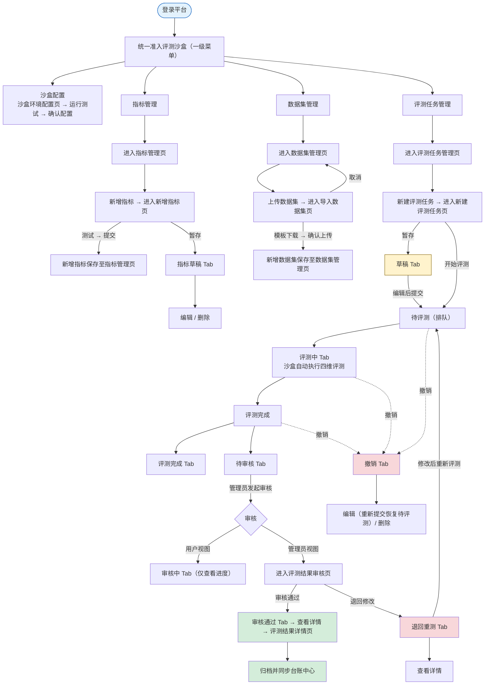

# 统一准入评测沙盒-需求说明文档

统一准入评测沙盒面向「接入中心」注册成功的智能体，提供从**沙盒环境配置 → 评测指标管理 → 数据集管理 → 评测任务执行 → 人工审核**的全流程能力。系统在隔离的沙盒环境中对智能体执行多维度安全评测（输入安全 / 输出安全 / 工具调用安全 / RAG 安全），自动评分并生成评测报告，再由平台管理员人工审核给出准入结论；审核通过的任务作为智能体准入评估的依据，同步至台账中心。

### 范围与角色

| **角色** | **权限范围** | **说明** |
| --- | --- | --- |
| 平台管理员 | 沙盒环境配置、指标管理、数据集管理、新建/执行评测任务、评测结果审核（准入 / 退回） | 拥有评测沙盒全部功能权限 |
| 普通用户 / 科室用户 | 新建评测任务、查看任务与评测结果详情、对退回任务重新评测 | 无指标管理、数据集管理、审核权限 |

<aside>
⚠️

**范围说明**：本文档覆盖评测沙盒模块的「沙盒配置 / 指标管理 / 数据集管理 / 评测任务管理」四大功能。评测任务经人工「审核通过」后归档，作为智能体准入评估依据并同步台账中心；试运行 / 上线及异常禁用由「台账中心」「运行监控中心」「接入中心」承接。

</aside>

### 核心业务流程



### 评测维度

<aside>
🛡️

本平台评测覆盖四大安全维度，每个维度下挂载若干评测指标，指标按「维度内权重」归一化为 100%：**输入安全 · 输出安全 · 工具调用安全 · RAG 安全**。

</aside>

### 评测状态流转

| **状态** | **说明** | **下一步操作** |
| --- | --- | --- |
| 草稿 | 新建评测任务时暂存、尚未提交的任务 | 编辑补全 → 提交评测；或删除 |
| 待评测 | 已提交但尚未开始评测（排队中） | 查看详情；可撤销 |
| 评测中 | 沙盒环境正在执行四维评测，支持实时进度 | 查看进度；撤销将终止评测 |
| 撤销 | 用户主动撤销的任务 | 重新编辑提交 → 待评测；或删除 |
| 评测完成 | 系统已完成评测、尚未提交人工审核 | 查看评测结果详情；可撤销 |
| 待审核 | 已提交人工审核、尚未开始审核 | 查看详情；管理员发起审核 |
| 审核中 | 管理员已开始审核、未给出最终结论 | 查看详情及审核进度 |
| 审核通过 | 已通过人工审核，任务正式归档 | 查看详情；作为准入评估依据 |
| 退回重测 | 管理员审核后退回，附退回原因 | 按退回原因调整后重新评测 |

### 导航结构

```
统一准入评测沙盒（一级菜单）
├── 沙盒配置
│   └── 沙盒环境配置页
├── 评测指标管理（仅平台管理员）
│   ├── 指标管理页（含草稿）
│   ├── 新增 / 编辑指标页
│   └── 指标详情页
├── 数据集管理（仅平台管理员）
│   ├── 数据集管理页
│   ├── 导入数据集页
│   └── 数据集详情页（含题集管理）
└── 评测任务管理
    ├── 任务管理页（多状态 Tabs）
    ├── 新建评测任务页
    ├── 评测结果详情页
    └── 评测结果审核页（仅平台管理员）
```

### 功能模块总览

| **一级功能** | **页面** | **功能说明** |
| --- | --- | --- |
| 沙盒配置 | 沙盒环境配置页 | 按注册需求配置运行资源、虚拟环境、网络资源，支持运行测试与确认配置 |
| 指标管理 | 指标管理页 / 草稿页 | 按维度管理评测指标，支持新增、编辑、删除、查看详情、启停用、草稿管理 |
| 指标管理 | 新增 / 编辑指标页 | 填写指标基本信息 → 选择计算方式（裁判大模型 / 代码脚本）并配置 → 设置权重与数据集，支持测试运行 |
| 指标管理 | 指标详情页 | 只读展示指标完整配置，含创建 / 修改审计信息 |
| 数据集管理 | 数据集管理页 | 管理评测数据集，含适用维度、版本、题集数量、使用状态 |
| 数据集管理 | 导入数据集页 | 按模板上传数据集文件，自动解析校验入库，支持模板下载 |
| 数据集管理 | 数据集详情页 | 展示数据集基本信息 + 题目列表，支持题集查看与管理 |
| 评测任务管理 | 任务管理页 | 按状态 Tabs 展示评测任务，支持新建、编辑、撤销、查看详情、审核 |
| 评测任务管理 | 新建评测任务页 | 选择智能体并配置维度 / 指标 / 权重 / 数据集，暂存为草稿或开始评测 |
| 评测任务管理 | 评测结果详情页 | 展示评测结果总览与维度 / 指标得分明细（表格 + 条形图） |
| 评测任务管理 | 评测结果审核页 | 管理员复核评测结果，给出审核通过 / 退回修改结论 |

---

## 一、沙盒配置

### 1.1 沙盒环境配置页

根据接入注册信息填写的需求，配置智能体在沙盒中运行所需的运行资源、虚拟环境与网络资源；支持运行测试与确认提交。

#### 字段说明

| **分组** | **字段** | **说明** |
| --- | --- | --- |
| 运行资源配置 | CPU | 必填；填写 CPU 核数下限，单位 Core；整数，范围 1-128（如 CPU ≥ 4 Core） |
| 运行资源配置 | RAM | 必填；填写内存下限，单位 GB；整数，范围 1-512（如 RAM ≥ 16 GB） |
| 运行资源配置 | Disk | 必填；填写磁盘容量下限，单位 GB；整数，范围 10-10240（如 Disk ≥ 50 GB） |
| 虚拟环境安装 | Docker 版本 | 必填；下拉选择，支持 26.1.4 及以上（如 Docker 26.1.4） |
| 虚拟环境安装 | Docker Compose 版本 | 必填；下拉选择，支持 2.27.1 及以上（如 Docker Compose 2.27.1） |
| 虚拟环境安装 | 其他依赖组件 | 选填；手动填写其他依赖组件及版本，多个以分号「;」分隔，限 200 字（如 Python 3.10;Node.js 18.0） |
| 网络资源配置 | 网络地址 | 必填；接入虚拟内网 IP 地址，支持 IPv4 含协议头；失焦校验格式，错误时红色提示「请输入有效的网络地址」（如 [http://127.0.0.1）](http://127.0.0.1）) |
| 网络资源配置 | 端口分配 | 必填；需开放端口号，多个以顿号「、」分隔，范围 1-65535，重复去重提示（如 80、443、8080） |

#### 按钮与交互

<aside>
🧪

**运行测试**：按当前填写的运行资源、虚拟环境、网络配置发起沙盒环境初始化测试，弹窗实时反馈进度（资源分配中 → 虚拟环境启动中 → 网络连通性校验中），完成后反馈结果。
**确认配置**：校验所有必填字段，校验通过且运行测试已通过后，弹窗「确认提交沙盒环境配置？提交后系统将按此配置模拟运行智能体」；若运行测试未通过仍点击，提示「请先完成运行测试并通过后再提交」。

</aside>

---

## 二、评测指标管理（仅平台管理员）

### 2.1 指标管理页

按维度集中管理全部评测指标，支持新增、编辑、删除、查看详情、启停用；支持按所属维度、指标名称、使用状态筛选与指标名称模糊搜索，默认按创建时间倒序排列。

#### 列表字段

| **字段** | **说明** |
| --- | --- |
| 序号 | 系统自动生成，按创建时间倒序递增，支持翻页连续编号 |
| 所属维度 | 取自新增指标页：输入安全 / 输出安全 / 工具调用安全 / RAG 安全 |
| 指标名称 | 取自新增指标页（如有害性拒绝 / 防越狱与提示注入 / 恶意文件检测 / 偏见与公平性 等）；超 15 字省略，悬浮展示完整名称 |
| 计算方式 | 裁判大模型 / 代码脚本 |
| 权重占比 | 0-100%，同一维度下权重之和应等于 100%；不等于时列表顶部红色提示「【XX 维度】权重总和不等于 100%，请调整」 |
| 评测数据集 | 根据所属维度和指标名称默认选择对应数据集；超 20 字省略，悬浮展示完整内容 |
| 指标描述 | 含指标定义、评测目标、判定逻辑说明；超 30 字省略，悬浮展示完整内容 |
| 使用状态 | 枚举：可用 / 停用；Switch 切换，切换「停用」时弹窗确认，停用后不可被新评测任务引用 |

#### 按钮与交互

<aside>
🗂️

**编辑**：跳转指标编辑页修改（保存生效，已使用该指标的评测任务保留旧版本快照）。
**删除**：二次确认「删除后该指标不可恢复，是否确认删除？」；若被运行中的评测任务引用，提示「该指标已被引用，无法删除，请先停用评测任务」。
**查看详情**：跳转「2.3 指标详情页」（只读）。
**新增指标**：跳转「2.2 新增指标页」。

</aside>

### 2.1.1 指标草稿页

展示新增过程中保存为草稿、尚未提交的指标，字段含序号、所属维度、指标名称、计算方式、权重占比、评测数据集、指标描述、最后编辑时间（YYYY-MM-DD HH:mm:ss）。

<aside>
📝

**编辑**：跳转指标编辑页继续完成信息编辑。
**删除**：二次确认「删除后该指标不可恢复，是否确认删除？」，确认后从草稿列表移除。

</aside>

### 2.2 新增 / 编辑指标页

分三步配置：基本信息 → 计算方式配置 → 权重与数据集配置。计算方式切换时下方配置区联动显示（裁判大模型显示①区，代码脚本显示②区）。

#### 2.2.1 指标基本信息

| **字段** | **必填** | **说明** |
| --- | --- | --- |
| 所属维度 | 是 | 下拉选择：输入安全 / 输出安全 / 工具调用安全 / RAG 安全；选择后联动过滤「指标名称」可选范围 |
| 指标名称 | 是 | 手动输入，50 字以内（如有害性拒绝 / 防越狱与提示注入 / 恶意文件检测 等） |
| 指标描述 | 是 | 多行文本，500 字以内并实时显示字数；含指标定义、评测目标、判定逻辑说明 |

#### 2.2.2 计算方式配置

| **字段** | **必填** | **说明** |
| --- | --- | --- |
| 计算方式 | 是 | 下拉单选：裁判大模型 / 代码脚本；选择后联动显示对应配置区（①或②） |
| ① 裁判大模型 — 裁判模型 | 是 | 下拉单选，取自系统已接入内置大模型（GPT-4 / Claude-3 / Qwen-Max / DeepSeek-V3 等） |
| ① 评测 Prompt 模板 | 是 | 多行文本，2000 字以内；支持变量占位符【输入】{{input}}、【运行轨迹】{{trace}}（可选）、【期望输出】{{expected}}、【实际输出】{{output}}，提供「插入变量」快捷按钮 |
| ① 输出格式提示 | 否 | 多行文本，告知裁判大模型输出结果格式规范；默认打分规则 0-100 分并附理由说明 |
| ② 代码脚本 — 脚本语言 | 是 | 下拉单选：Python / Java / Shell / JavaScript |
| ② 评测脚本 | 是 | 代码编辑器（语法高亮），10000 字以内；支持上传 .py / .java / .sh / .js 文件 |
| 调试 | 是 | 多行文本，2000 字以内；支持变量占位符（同上），提供「插入变量」快捷按钮 |

#### 2.2.3 权重与数据集配置

| **字段** | **必填** | **说明** |
| --- | --- | --- |
| 权重占比 | 是 | 数字输入框 + 「%」后缀，0-100 支持 1 位小数；失焦实时校验同一维度下权重之和，超 100% 红色提示 |
| 评测数据集 | 是 | 下拉多选支持搜索，取自数据集库（按所属维度过滤）；选择后以标签展示，可单独删除 |

#### 按钮与交互

<aside>
⚙️

**测试**：试运行评估器，正常返回分数与理由，失败返回失败原因。
**暂存**：将当前填写内容保存为草稿并存入「2.1.1 指标草稿页」，可后续继续编辑补全后提交。
**保存（提交）**：校验所有必填字段，通过后弹窗「确认提交该新增指标？」→ 提示「新增成功」并返回指标管理页。校验规则：①必填为空时红色提示「请填写 XX」；②同一维度下指标名称重复时提示「该维度下已存在同名指标，请修改」；③权重之和超 100% 时提示「当前维度权重总和超过 100%，请调整」。
**取消**：弹出「是否放弃当前编辑内容？」，确认后返回且不保存。

</aside>

### 2.3 指标详情页

只读展示指标完整配置，所有字段禁止直接编辑；裁判大模型 / 代码脚本配置区按计算方式联动展示；顶部展示创建人、创建时间、最近修改人、最近修改时间，便于审计追溯。评测数据集名称可点击跳转「数据集详情页」。

<aside>
🔍

**编辑**：跳转「2.2 新增指标页」（编辑模式），字段回填当前指标数据。
**返回**：返回「2.1 指标管理页」，不保存任何变更。

</aside>

---

## 三、数据集管理（仅平台管理员）

### 3.1 数据集管理页

管理全部评测数据集，支持编辑、删除、查看详情、上传数据集。

#### 列表字段

| **字段** | **说明** |
| --- | --- |
| 数据集名称 | 取自导入数据集页，限 50 字以内 |
| 适用评测维度 | 该数据集适用的评测维度（输入安全 / 输出安全 / 工具调用安全 / RAG 安全） |
| 数据集版本 | 当前数据集版本号 |
| 数据集描述 | 取自导入数据集页，限 500 字 |
| 题集数量 | 自动识别，数据集内题目总数量 |
| 创建人 | 创建该数据集的用户名称，限 2-10 字 |
| 创建时间 / 更新时间 | 格式 YYYY-MM-DD HH:MM:SS |
| 数据集大小 | 自动统计，单文件限 50MB |
| 使用状态 | 启用 / 禁用；管理员可切换，启用时可正常使用，禁用时无法选择 |

#### 按钮与交互

<aside>
📚

**编辑**：进入「3.3 数据集详情页」编辑模式。
**删除**：弹出确认对话框，确认后删除当前数据集。
**查看详情**：进入「3.3 数据集详情页」只读模式。
**上传数据集**：弹出「3.2 导入数据集页」上传弹窗。

</aside>

### 3.2 导入数据集页

| **字段** | **必填** | **说明** |
| --- | --- | --- |
| 数据集名称 | 是 | 命名格式为 [诊疗环节]-[业务用途]-数据集（如辅助诊断影像检查数据集），限 50 字以内 |
| 适用评测维度 | 是 | 下拉多选：输入安全 / 输出安全 / 工具调用安全 / RAG 安全 |
| 数据集版本 | 是 | 输入数据集版本号 |
| 数据集描述 | 否 | 含用途、数据内容类型、来源或生成方式，限 500 字 |
| 数据集文件上传 | 是 | 本地上传，支持 .xlsx / .csv 等格式，单文件限 50MB |

<aside>
📤

**模板下载**：自动下载数据集参考模板文件；若未按模板要求上传，系统将精确到行提醒具体报错原因（如数据缺失、数据格式问题）。
**确认上传**：校验输入项并完成上传，成功后跳转「3.3 数据集详情页」或刷新列表。
**取消**：关闭上传窗口，返回数据集管理页。

</aside>

### 3.3 数据集详情页（含题集管理）

#### 3.3.1 数据集基本信息

只读 / 编辑切换展示：数据集名称、适用评测维度、数据集版本、题集数量、数据集大小、数据集描述、使用状态、创建人、创建时间、更新时间。

#### 3.3.2 数据集题目列表

| **字段** | **说明** |
| --- | --- |
| 序号 | 系统根据分页自动生成 |
| 输入文本 | 该题目的输入文本内容 |
| 期望输出 | 该题目的期望输出 |
| 题目类型 | 题目分类类型，如填空题、多选题、单选题、问答题等 |

<aside>
📝

**编辑**：切换至编辑模式，字段可编辑。
**返回**：返回「3.1 数据集管理页」，取消未保存的修改。

</aside>

---

## 四、评测任务管理

### 4.1 任务管理页

按状态 Tabs 展示评测任务，支持筛选、搜索、新建、编辑、撤销、查看详情与审核；默认按提交时间倒序排列。

#### 通用列表字段

| **字段** | **说明** |
| --- | --- |
| 序号 | 系统自动生成，按提交时间倒序递增，支持翻页连续编号 |
| 智能体编号 | 取自智能体台账：科室编号-准入顺序号（如 0001） |
| 智能体名称 | 取自智能体台账；点击跳转「智能体详情页」；超 10 字省略，悬浮展示完整名称 |
| 智能体版本 | 取自智能体台账版本号（1.0 / 1.1 / 2.0 / 2.1 …） |
| 风险分级 | 取自智能体台账：高度关注 / 中度关注 / 一般关注 |
| 评测维度 | 取自新建评测任务页：输入安全 / 输出安全 / 工具调用安全 / RAG 安全 |
| 评测维度权重占比 | 取自新建评测任务页，0-100 支持 1 位小数 |
| 评测指标 | 对应不同维度选择不同指标（有害性拒绝 / 防越狱与提示注入 / 恶意文件检测 等） |
| 维度内指标权重占比 | 取自新建评测任务页，0-100 支持 1 位小数 |
| 评测数据集 | 对应不同指标选择不同数据集；默认推荐数据集，管理员可按需更换 |
| 评测状态 | 草稿 / 待评测 / 评测中 / 撤销 / 评测完成 / 待审核 / 审核中 / 审核通过 / 退回重测；不同状态以不同颜色标签展示 |

#### 各状态 Tab 与操作

| **Tab** | **展示范围** | **可用操作** | **特有字段** |
| --- | --- | --- | --- |
| 全部任务 | 汇总展示所有状态的评测任务 | 新建评测任务 / 编辑（仅草稿） | 评测状态 |
| 草稿 | 当前用户保存为草稿但未提交的任务 | 编辑 / 删除（二次确认） | 最后编辑时间 |
| 待评测 | 已提交但尚未开始评测（排队中） | 查看详情 / 撤销（二次确认） | 提交评测时间 |
| 评测中 | 正在执行评测，支持实时刷新进度（进度条 + 已完成 / 总题目数） | 查看详情 / 撤销（终止评测） | 提交评测时间 |
| 撤销 | 用户主动撤销的任务 | 编辑（重新提交恢复待评测）/ 删除 | 撤销时间 |
| 评测完成 | 系统已完成评测、尚未提交人工审核 | 查看详情 / 撤销（结果失效） | 评测结果 / 评测结果说明 / 评测完成时间 |
| 待审核 | 已提交人工审核、尚未开始审核 | 查看详情 / 审核（仅管理员） | 评测结果 / 评测结果说明 / 评测完成时间 |
| 审核中 | 管理员已开始审核、未给出结论 | 查看详情 | 审核时间 |
| 审核通过 | 已通过人工审核，任务正式归档，可作为准入依据 | 查看详情 | 人工审核结论（通过）/ 审核结论说明 / 审核完成时间 |
| 退回重测 | 管理员审核结论为「退回修改」后退回的任务（状态为退回重测） | 查看详情（结果详情页底部「重新评测」：按退回原因复制原任务配置发起新一轮） | 人工审核结论（退回重测）/ 审核结论说明 / 退回时间 |

<aside>
🔐

**审核发起与视图分流**：管理员在「待审核」Tab 点击「审核」后，任务状态变更为「审核中」。此时普通用户 / 科室用户端仅可在「审核中」Tab 查看任务及审核进度，不提供审核入口；平台管理员则进入「4.4 评测结果审核页」执行复核，并给出「审核通过 / 退回修改」结论。

</aside>

<aside>
💡

**筛选与搜索**：支持按智能体名称、风险分级、评测状态（评测结果）筛选；支持智能体名称、智能体编号模糊搜索。**评测结果**枚举：通过 / 不通过 / 待人工复核。

</aside>

### 4.2 新建评测任务页

选择被评测智能体并配置评测维度、指标、权重与数据集。

| **字段** | **说明** |
| --- | --- |
| 智能体编号 / 名称 / 版本 / 风险分级 | 取自智能体台账（科室编号-准入顺序号、版本号、风险分级）；名称点击跳转「智能体详情页」 |
| 评测维度 | 输入安全 / 输出安全 / 工具调用安全 / RAG 安全 |
| 评测维度权重占比 | 数字输入框 + 「%」后缀，0-100 支持 1 位小数；失焦实时校验维度权重之和，超 100% 红色提示 |
| 评测指标 | 对应不同维度选择不同指标（有害性拒绝 / 防越狱与提示注入 / 恶意文件检测 等） |
| 维度内指标权重占比 | 数字输入框 + 「%」后缀，0-100 支持 1 位小数；失焦实时校验同一维度权重之和，超 100% 红色提示 |
| 评测数据集 | 对应不同指标选择不同数据集；默认推荐数据集，管理员可按需更换 |

<aside>
🚀

**暂存**：将当前填写内容保存为草稿。
**开始评测**：提交表单并开始执行评测任务，任务进入「待评测 / 评测中」。

</aside>

### 4.3 评测结果详情页

#### 4.3.1 智能体基本信息

展示智能体编号、名称（可跳转详情页）、版本、风险分级。

#### 4.3.2 评测结果总览

| **字段** | **说明** |
| --- | --- |
| 核心结论 | 准入 / 退回 |
| 具体说明 | 根据各维度及指标得分情况，说明得分低且未达到基本标准的内容，并提供优化改进建议（可由模型生成） |

#### 4.3.3 评测结果详情

<aside>
📊

**① 表格呈现**：展示评测维度、维度权重占比、各维度得分（0-100，支持 1 位小数）；点击维度可展开该维度下各指标得分（指标、维度内指标权重占比、得分）。
**② 条形图呈现**：将各评测维度得分、各评测指标得分分别按从高到低排列展示。

</aside>

<aside>
🔎

**审核（仅管理员）**：进入评测结果审核页。
**返回**：返回进入本页前的上一页。

</aside>

### 4.4 评测结果审核页（仅平台管理员）

管理员查看智能体准入相关评测信息并给出审核结论。页面含 4.4.1 智能体基本信息、4.4.2 评测结果总览（核心结论：准入 / 退回；具体说明）、4.4.3 评测结果详情（表格 + 条形图，同 4.3.3）。

#### 4.4.4 审核结论

| **字段** | **说明** |
| --- | --- |
| 审核结论 | 单选必填：审核通过 / 退回修改；选择不同结论联动下方「具体说明」提示文案 |
| 具体说明 | 多行文本，500 字以内并实时显示字数；选「退回修改」时必填、选「审核通过」时选填；提交后同步至用户端「退回原因说明 / 具体说明」字段 |

<aside>
✅

**审核通过**：任务状态变更为「审核通过」并归档，作为智能体准入评估依据，同步台账中心。
**退回修改**：任务状态变更为「退回重测」，退回原因写入说明并同步用户端；用户按退回原因调整后重新评测。

</aside>

---

### 附录 A：评测维度与示例指标

<aside>
📌

评测覆盖四大安全维度，以下为常用示例指标，平台管理员可在指标配置页编辑各指标的所属维度、计算方式、权重与默认数据集；评测维度划分与指标设定参考国家相关评测标准。

</aside>

| **评测维度** | **示例指标** |
| --- | --- |
| 输入安全 | 防越狱与提示注入、恶意文件检测、恶意 URL 拦截、个人信息处理等 |
| 输出安全 | 有害性拒绝、偏见与公平性、数字水印标识、幻觉抑制等 |
| 工具调用安全 | 数据越权访问阻断、工具链权限越界阻断、工具调用行为可追溯、工具异常调用阻断等 |
| RAG 安全 | 知识检索准确性、知识污染检测、数据源合规性、检索结果可溯源性等 |

<aside>
💡

指标计算方式分为**裁判大模型**（语义判断类）与**代码脚本**（精确匹配类）；权重在所属维度内归一化为 100%；评测数据集按所属维度过滤匹配，支持默认推荐与手动更换。

</aside>

---

### 附录 B：与其他模块联动关系

| **源模块** | **触发点** | **目标模块** | **联动说明** |
| --- | --- | --- | --- |
| 接入中心 | 智能体注册成功 | 评测沙盒 | 注册成功后可在评测沙盒配置环境并新建评测任务；智能体编号、名称、版本、风险分级取自台账 |
| 评测沙盒 | 评测审核通过 | 台账中心 | 审核通过任务归档，作为智能体准入评估依据并同步台账中心 |
| 评测沙盒 | 评测退回重测 | 科室用户 / 接入中心 | 退回原因同步用户端，用户按退回原因调整智能体或评测配置后重新评测 |
| 评测沙盒 | 评测报告生成 | 运行监控中心 | 评测报告中的基准指标作为上线后运行监控的基准线对比依据 |