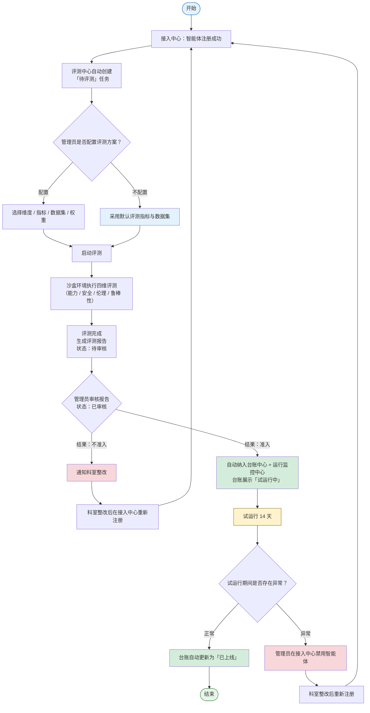

# 统一准入评测沙盒-需求说明文档

对「接入中心」注册成功的智能体，评测中心自动创建准入评测任务，在沙盒隔离环境中对其执行多维度评测（能力、安全、伦理、鲁棒性）。管理员可配置评测方案后启动，也可直接采用默认评测指标与数据集一键发起；评测完成后任务进入「待审核」，由平台管理员审核后转为「已审核」（结果为准入 / 不准入）；准入的智能体自动纳入台账中心与运行监控中心，台账展示「试运行中」 14 天后自动转「已上线」；不准入的智能体通知科室整改后需在接入中心重新注册。

### 核心业务流程




### 评测触发机制与状态流转

<aside>
🔄

智能体在接入中心注册成功后，评测中心自动创建「待评测」任务。平台管理员可配置评测方案后启动，**也可直接采用默认评测指标与数据集一键启动**。评测完成后任务进入「待审核」状态，平台管理员审核后转为「已审核」（结果为准入 / 不准入）；准入的智能体由系统自动纳入台账中心与运行监控中心，台账展示「试运行中」状态 14 天，到期后自动转为「已上线」；试运行期间若发现异常，平台管理员可在接入中心直接禁用智能体。

</aside>

**主流程：** 接入中心注册成功 → 待评测 → 评测中 → 待审核 → 已审核（准入）→ 试运行中（14 天）→ 已上线（自动转换）

**异常分支：** 已审核（不准入，通知科室整改后在接入中心重新注册）｜ 试运行期间发现异常（平台管理员在接入中心禁用智能体）

| **状态** | **说明** | **下一步操作** |
| --- | --- | --- |
| 待评测 | 接入中心注册成功后自动创建，等待管理员配置方案或直接启动 | 配置评测方案 → 启动；或一键「使用默认方案启动」 |
| 评测中 | 系统正在执行四维评测（能力/安全/伦理/鲁棒性） | 查看进度 |
| 待审核 | 评测执行完成，报告已生成，等待平台管理员审核 | 查看报告 → 审核（准入 / 不准入） |
| 已审核 · 准入 | 管理员审核通过，系统自动将智能体纳入台账中心与运行监控中心 | 无需手动操作，台账自动展示「试运行中」 |
| 已审核 · 不准入 | 管理员审核未通过 | 通知科室整改，整改后在接入中心重新注册 |
| 试运行中 | 由台账中心展示状态，运行监控中心持续采集指标，进入 14 天倒计时 | 到期自动转「已上线」；如发现异常，平台管理员在接入中心禁用智能体 |
| 已上线 | 试运行 14 天到期后系统自动更新为该状态，智能体正式提供业务服务 | 持续运行 + 监控；如出现问题可在接入中心禁用 |

<aside>
⚠️

**范围说明**：评测沙盒模块负责「待评测 → 评测中 → 待审核 → 已审核（准入 / 不准入）」阶段。已审核为准入后，由「台账中心」展示「试运行中」状态、「运行监控中心」持续监控，14 天后台账自动转「已上线」；试运行 / 上线期间的异常处置由「接入中心」承接（禁用智能体）。

</aside>

### 设计要点

- **默认评测方案**：系统为每个评测维度预置了默认启用的指标集合与默认推荐数据集。管理员可选择「配置方案」自定义维度、指标、数据集与权重，也可在任务列表直接「使用默认方案启动」一键发起评测，覆盖最简使用路径
- **指标-数据集绑定**：数据集与评测指标按「指标颗粒度」绑定。发起评测时系统以每个指标为单位自动匹配数据集（基于指标的默认推荐数据集 + 指标所属维度的适用类型标签），管理员可逐指标手动更换数据集，实现细粒度的数据集编排
- **任务进度可追踪**：评测任务列表点击可进入「评测进度详情页」，实时展示各维度执行状态、已完成/总数据量、当前指标计算进度、预计剩余时间
- **指标配置闭环**：新增指标时必须选择计算方式（代码脚本 / 裁判大模型），并提供对应的配置表单（代码编辑器 / 模型选择+Prompt），确保新增指标可执行。人工评审计算方式作为 V2.0 扩展预留
- **指标编辑对齐新增**：编辑指标时展示与新增一致的全部字段；权重支持在指标维度内单独调整（维度内权重归一化）；可为指标指定默认推荐数据集
- **数据集标签与版本闭环**：「适用类型标签」用于标记数据集适用的评测维度，作为「指标未配置默认推荐数据集」时的兑底自动匹配依据；「新版本」按钮触发版本迭代流程（上传新数据 → 生成新版本号 → 旧版本归档）；上传窗口提供标准导入模板下载
- **数据集详情可管理**：数据集详情页展示完整题集列表（支持分页/搜索），管理员可在详情页内进行题集的导入、单条编辑和批量删除操作
- **自动评测为主**：评测执行主体为沙盒自动化环境，指标计算方式为代码脚本（精确匹配类）和裁判大模型（语义判断类），符合项目文档「自动、全面地评估」的定位

### 导航结构

```
统一准入评测沙盒（一级菜单，ExperimentOutlined 图标）
├── 评测任务管理（二级菜单，默认落地页，路由 /app/evaluation/tasks）【平台管理员 + 科室管理员】
├── 评测指标库（二级菜单，路由 /app/evaluation/indicators）【仅平台管理员】
└── 数据集管理（二级菜单，路由 /app/evaluation/datasets）【仅平台管理员】
```

### 功能说明

| **一级功能** | **二级功能** | **功能说明** |
| --- | --- | --- |
| 评测任务管理 | 任务列表 | 按状态 Tabs 展示评测任务（全部 / 待评测 / 评测中 / 待审核 / 已审核），支持筛选、搜索、发起新评测、一键使用默认方案启动 |
| 评测任务管理 | 发起评测 | 两种发起方式：①「使用默认方案」一键启动（自动采用默认指标与数据集，无需配置）；②「自定义方案」选择智能体 → 查看四个维度及启用指标 → 按「指标颗粒度」逐个确认/更换数据集（系统按指标默认推荐匹配，支持单指标更换与多指标批量更换）→ 提交执行 |
| 评测任务管理 | 评测进度详情页 | 展示评测任务的实时执行进度：各评测维度的状态（待执行/执行中/已完成/失败）、已处理数据量/总量进度条、当前正在计算的指标、预计剩余时间、执行日志 |
| 评测任务管理 | 评测报告 | 评测完成后自动生成报告：总分、各维度得分、指标明细、数据集使用记录、改进建议；支持导出 PDF |
| 评测任务管理 | 准入审批 | 平台管理员审核评测报告，决定准入/不准入；准入后系统自动将智能体纳入台账中心（试运行中）与运行监控中心；不准入需附改进建议，通知科室整改后在接入中心重新注册 |
| 评测指标库 | 指标列表 | 按维度分组展示全部评测指标，含指标名称、所属维度、计算方式、权重、关联数据集 |
| 评测指标库 | 新增指标（含配置页） | 填写指标基本信息 → 选择计算方式（代码脚本/裁判大模型）→ 配置计算逻辑 → 设置权重 → 指定默认推荐数据集 → 保存 |
| 评测指标库 | 编辑指标（对齐新增） | 编辑页面展示与新增一致的全部字段；权重支持在维度内单独调整（维度内自动归一化）；可修改/新增默认推荐数据集 |
| 数据集管理 | 数据集列表 | 展示全部数据集，含名称、适用类型标签（标记适用评测维度）、版本号、题集数量、创建时间 |
| 数据集管理 | 上传数据集（含导入模板） | 上传窗口提供「下载导入模板」按钮（Excel/CSV 标准模板，含字段说明和示例数据），按模板格式上传后自动解析入库 |
| 数据集管理 | 适用类型标签管理 | 为数据集设置适用评测维度标签（能力/安全/伦理/鲁棒性/通用），作为发起评测时「指标-数据集」自动匹配的兑底依据（优先使用指标默认推荐数据集） |
| 数据集管理 | 版本管理 | 点击「新版本」→ 上传新数据文件 → 系统自动递增版本号 → 旧版本自动归档为历史版本；详情页可切换查看各版本 |
| 数据集管理 | 数据集详情页（含题集管理） | 展示数据集基本信息 + 完整题集列表（分页/搜索/筛选）；管理员可进行：批量导入题集、单条编辑题目、批量删除题目、导出题集 |

### 核心页面清单

| **页面名称** | **页面类型** | **主要用途** | **使用角色** |
| --- | --- | --- | --- |
| 评测任务列表页 | 列表页 | 展示全部评测任务，支持筛选、搜索、发起新评测 | 平台管理员（完整操作）、
科室管理员（只读本科室） |
| 发起评测页 | 表单+配置页 | 选择智能体，按「指标颗粒度」逐个确认/更换数据集，提交评测 | 平台管理员 |
| 评测进度详情页 | 详情+进度页 | 实时查看评测任务各维度执行进度、指标计算状态、日志 | 平台管理员 |
| 评测报告页 | 报告详情页 | 查看评测结果报告，审批准入/驳回 | 平台管理员（审批操作）、
科室管理员（只读本科室） |
| 评测指标列表页 | 列表页 | 管理全部评测指标，按维度分组查看 | 平台管理员 |
| 指标配置页（新增/编辑） | 表单+配置页 | 填写指标信息、选择计算方式并配置计算逻辑、设置权重与默认数据集 | 平台管理员 |
| 数据集列表页 | 列表页 | 管理全部数据集，含适用类型标签筛选、版本管理入口 | 平台管理员 |
| 数据集详情页（含题集管理） | 详情+列表页 | 查看数据集信息与完整题集，支持题集导入/编辑/删除 | 平台管理员 |

---

### 6-1 评测任务列表页 — 字段与交互

#### 页面概述

| 属性 | 说明 |
| --- | --- |
| 页面类型 | 列表页（ProTable） |
| 使用角色 | 平台管理员（完整操作）、科室管理员（只读查看本科室任务） |
| 入口 | 侧边栏「统一准入评测沙盒 > 评测任务管理」（默认落地页） |
| 路由 | /app/evaluation/tasks |
| 面包屑 | 统一准入评测沙盒 > 评测任务管理 |

#### 顶部操作区

| **序号** | **元素** | **Antd 组件** | **说明** | **交互** | **可见角色** |
| --- | --- | --- | --- | --- | --- |
| 1 | 发起评测 | Button type="primary" | 主操作按钮，位于 ProTable toolBarRender 右上角 | 点击进入「发起评测页」 | 平台管理员 |
| 2 | 导出列表 | Button type="default" | 次操作按钮 | 按当前筛选条件导出 Excel | 平台管理员 |

#### 状态 Tabs 切换

<aside>
📑

**样式规范（与接入中心保持统一）**：使用 Tabs 组件按评测生命周期阶段分组展示任务。所有 Tab 的数量角标**统一使用常规样式**（格式为「Tab 名称 (N)」，与「全部」一致），不对「待审核」「评测中」等 Tab 做红 / 橙等颜色强调，保持视觉统一；优先级提示通过列表内「结果」列与「进度」列的状态色承载。

</aside>

| **序号** | **Tab** | **数量角标样式** | **说明** |
| --- | --- | --- | --- |
| 1 | 全部 (N) | 常规样式（默认色） | 默认选中，展示所有评测任务（含「已取消」） |
| 2 | 待评测 (N) | 常规样式（默认色） | 接入中心注册成功后自动创建的任务，等待管理员配置方案或一键使用默认方案启动 |
| 3 | 评测中 (N) | 常规样式（默认色） | 评测正在沙盒环境中执行 |
| 4 | 待审核 (N) | 常规样式（默认色） | 评测完成、报告已生成，等待平台管理员审核（不使用颜色 Badge 强调，保持与「全部」一致） |
| 5 | 已审核 (N) | 常规样式（默认色） | 管理员已完成审核，通过列表中的「结果」列区分准入 / 不准入 |

<aside>
💡

**与接入中心列表保持一致**：接入中心「全部 / 待审核 / 处理中 / 试运行 / 已上线 / 已禁用」各 Tab 的数量角标均采用「(N)」常规样式，不使用 Badge 颜色强调；评测任务管理遵循同一规范。

</aside>

#### 筛选与搜索（ProTable search）

| **序号** | **筛选项** | **Antd 组件** | **说明** |
| --- | --- | --- | --- |
| 1 | 关键字搜索 | [Input.Search](http://Input.Search) | 按智能体名称、任务编号、供应商模糊搜索 |
| 2 | 评测结果 | Select | 全部 / 准入 / 不准入（仅在「已审核」Tab 下生效） |
| 3 | 归属科室 | Select（支持搜索） | 仅平台管理员可见；科室管理员自动锁定本科室 |
| 4 | 供应商 | Select（支持搜索） | 按智能体供应商筛选 |
| 5 | 时间范围 | DatePicker.RangePicker | 按评测发起时间筛选 |

#### 列表字段（ProTable columns）

| **序号** | **列名** | **类型** | **说明** | **交互** |
| --- | --- | --- | --- | --- |
| 1 | 任务编号 | 文本链接（type="link"） | 系统自动生成（如 EVL-20260522-001） | 评测中点击进入评测进度详情页；待审核 / 已审核点击进入评测报告页；待评测无链接 |
| 2 | 智能体名称 | 文本 | 被评测的智能体 | — |
| 3 | 版本号 | Tag | 智能体当前版本号（如 v1.0.0），从接入中心同步 | — |
| 4 | 供应商 | 文本 | 智能体供应商名称，从接入中心同步 | — |
| 5 | 进度 | Progress | 评测执行进度：待评测 0%；评测中显示百分比；待审核 / 已审核 100% | — |
| 6 | 结果 | Tag（状态色） | 「已审核」状态下展示评测结果：准入（success）/ 不准入（error）；其他状态展示 — | — |
| 7 | 归属科室 | 文本 | 智能体所属科室，从接入中心同步 | — |
| 8 | 发起人 | 文本 | 发起评测的管理员（系统自动创建时展示「系统自动」） | — |
| 9 | 发起时间 | 日期时间 | 评测任务创建时间 | 支持 sorter 排序 |
| 10 | 操作 | Space + Button type="link" | 按状态动态显示，fixed: 'right' | 见下方操作按钮逻辑 |

#### 列表操作按钮逻辑

| **评测状态** | **可用操作** | **说明** | **可见角色** |
| --- | --- | --- | --- |
| 待评测 | 使用默认方案启动 / 配置方案 / 取消 | 「使用默认方案启动」一键采用默认指标与数据集发起评测（Modal.confirm 二次确认）；「配置方案」进入发起评测页自定义维度与数据集；「取消」终止任务 | 仅平台管理员 |
| 评测中 | 查看进度 / 终止 | 进入评测进度详情页或终止评测（Modal.confirm 二次确认） | 仅平台管理员 |
| 待审核 | 查看报告 / 准入 / 不准入 | 「查看报告」打开评测报告页查看详细评分；「准入」「不准入」可直接在列表中快捷审核（Modal.confirm 或 Modal 弹窗填写不准入理由），也可进入报告页完成审核 | 审核操作：仅平台管理员；查看报告：平台管理员、科室管理员（本科室） |
| 已审核（结果：准入） | 查看报告 / 跳转台账 | 「查看报告」打开评测报告页；「跳转台账」打开台账中心对应智能体详情（智能体已自动纳入台账与监控，状态为「试运行中」），无需手动「发起试运行」 | 查看报告：平台管理员、科室管理员；跳转台账：平台管理员 |
| 已审核（结果：不准入） | 查看报告 / 通知整改 | 「查看报告」打开评测报告页；「通知整改」向科室管理员推送整改通知（附评测报告 + 改进建议）；科室整改后需在接入中心重新注册智能体（重新注册成功后系统自动创建新的待评测任务） | 查看报告：平台管理员、科室管理员；通知整改：仅平台管理员 |
| 已取消 | 查看详情 / 重新评测 | 只读查看；「重新评测」复制原配置生成新草稿 → 跳转发起评测页步骤 2 | 仅平台管理员 |

---

### 6-2 发起评测页 — 字段与交互

#### 页面概述

| 属性 | 说明 |
| --- | --- |
| 页面类型 | 单页表单页（无分步引导，所有配置在同一页面完成） |
| 使用角色 | 仅平台管理员 |
| 入口 | 评测任务列表页「发起评测」按钮 / 「待评测」任务的「配置方案」操作（直接定位至该任务并预填智能体） |
| 路由 | /app/evaluation/tasks/create |
| 面包屑 | 统一准入评测沙盒 > 评测任务管理 > 发起评测 |

#### 评测对象

| **序号** | **字段** | **Antd 组件** | **必填** | **说明** |
| --- | --- | --- | --- | --- |
| 1 | 智能体 | Select（showSearch） | 是 | 从台账中心读取已对接成功的智能体列表。评测默认覆盖能力 / 安全 / 伦理 / 鲁棒性四个维度，不支持勾选维度 |

#### 配置评测维度与数据集

<aside>
🎯

**核心设计变更**：数据集匹配/更换的颗粒度由「维度级」下沉至「指标级」。每个维度卡片可展开为该维度下的全部启用指标，每个指标独立显示其已匹配的数据集，并支持单独「更换数据集」。维度卡片头部仍展示维度整体权重，数据集汇总区展示该维度下已匹配的全部数据集摘要。

</aside>

| **序号** | **元素** | **Antd 组件** | **说明** | **交互** |
| --- | --- | --- | --- | --- |
| 1 | 评测维度卡片列表 | Card 列表（Row + Col span={12}） | 固定展示能力 / 安全 / 伦理 / 鲁棒性四个维度卡片，默认折叠为概览态 | — |
| 2 | 维度卡片 — 维度名称 | Card title + Tag | 维度名称 + 包含指标数量（从指标库读取该维度启用的指标数） | — |
| 3 | 维度卡片 — 维度权重 | InputNumber + Tooltip | 展示该维度在总分中的权重占比（%）；Tooltip 提示「四个维度权重将自动归一化为 100%」 | 支持在此处微调（修改后自动归一化，归一化结果实时展示在右侧） |
| 4 | 维度卡片 — 数据集汇总 | Descriptions + Tag 组 | 概览态展示该维度下已匹配的全部数据集摘要：去重后的数据集名称列表 + 各数据集题集数合计；如全部指标均使用默认推荐数据集，展示 Tag color="success" 「已自动匹配 N 个指标」 | — |
| 5 | 维度卡片 — 展开指标 | Button type="link" / Card collapsible | 「展开指标 (N)」按钮，点击后维度卡片展开为「指标-数据集」配置列表（见下方「指标级数据集配置」表） | 点击切换展开/折叠状态；展开后按钮文案变为「收起」 |
| 6 | 维度卡片 — 批量更换数据集 | Button type="default" | 「批量更换」按钮，位于展开后的指标列表顶部 | 勾选该维度下多个指标 → 点击「批量更换」→ 弹出数据集选择 Modal → 一次性应用到所选指标 |

**指标级数据集配置（维度卡片展开后展示）**

| **序号** | **列名 / 元素** | **Antd 组件** | **说明** | **交互** |
| --- | --- | --- | --- | --- |
| 1 | 勾选框 | Checkbox | 支持单选 / 全选，用于批量更换数据集 | 勾选后激活「批量更换」按钮 |
| 2 | 指标名称 | 文本 + Tooltip | 该维度下的启用指标名称；Tooltip 显示指标描述与评测说明 | — |
| 3 | 计算方式 | Tag | 代码脚本（processing）/ 裁判大模型（success），从指标库读取 | — |
| 4 | 指标权重 | 文本（百分比） | 展示该指标在所属维度内的权重占比，从指标库读取，只读 | — |
| 5 | 已匹配数据集 | Descriptions + Tag | 展示当前指标已匹配的数据集名称 + 版本号 + 题集数量；如来源为指标默认推荐，显示 Tag color="success" 「默认推荐」；如已被手动更换，显示 Tag color="warning" 「已手动更换」 | — |
| 6 | 操作 | Space + Button type="link" | 「更换」（始终可见）+「恢复默认」（仅当该指标已被手动更换时显示） | 「更换」点击弹出下方「更换数据集 Modal」；「恢复默认」点击恢复为该指标在指标库中配置的默认推荐数据集 |

<aside>
💡

**自动匹配规则**：进入发起评测页时，系统按以下优先级为每个指标自动匹配数据集——①优先使用指标在指标库中配置的「默认推荐数据集」；②若指标未配置默认推荐数据集，则取该指标所属维度对应适用类型标签下，最新版本的数据集；③若均无可用数据集，标记为「待选择」并提示管理员手动指定，未指定的指标不可提交评测。

</aside>

**更换数据集 Modal（单指标 / 批量通用）**

<aside>
🔄

**标题规范**：按「指标颗粒度」命名，不再以「维度」为单位。单指标场景标题为「更换『能力评测 · 任务完成能力』的数据集」；批量场景标题为「批量更换『能力评测』下 N 个指标的数据集」。

</aside>

| **序号** | **字段 / 元素** | **Antd 组件** | **必填** | **说明** |
| --- | --- | --- | --- | --- |
| 1 | Modal 标题 | Modal title | — | 单指标：「更换『《维度名》 · 《指标名》』的数据集」；批量：「批量更换『《维度名》』下 N 个指标的数据集」（在标题下方加一行辅助文本列出本次覆盖的指标名称，超过 3 个折叠为 Tooltip） |
| 2 | Modal 宽度 | width={520} | — | 遵循系统前端规范中 Modal 宽度默认 520px |
| 3 | 当前已选数据集 | Descriptions size="small" | — | 仅单指标场景展示：该指标当前已匹配数据集名称 + 版本号 + 题集数量 + Tag（默认推荐 / 已手动更换） |
| 4 | 批量场景提示 | Alert type="info" showIcon | — | 仅批量场景展示：「批量更换仅允许选择同一适用类型标签下的数据集」 |
| 5 | 数据集选择器 | Select showSearch | 是 | 下拉选项按顺序分组：①「默认推荐」（置顶）→ ②「同适用类型数据集」（按最新版本排序）→ ③「其他可用」（含「通用」标签数据集）。选项显示：数据集名称 + 版本号 + 题集数量 + 适用类型标签组；右侧提供「查看详情」链接跳转数据集详情页（新标签页） |
| 6 | 确定 | Button type="primary" | — | 点击后应用选中数据集：单指标场景仅更新当前指标；批量场景同时更新勾选的多个指标；Modal 关闭 → 维度卡片的指标行「已匹配数据集」列同步刷新，被修改指标打上 Tag color="warning" 「已手动更换」 |
| 7 | 取消 | Button type="default" | — | 关闭 Modal，不保存修改 |

#### 底部操作区

| **序号** | **元素** | **Antd 组件** | **说明** | **交互** |
| --- | --- | --- | --- | --- |
| 1 | 提交评测 | Button type="primary" | 主操作按钮 | 校验智能体与各维度数据集均已就绪 → 提交后跳转至评测进度详情页，任务状态变为「评测中」 |
| 2 | 取消 | Button type="default" | 取消按钮 | Modal.confirm 二次确认后返回评测任务列表页 |

---

### 6-3 评测进度详情页 — 字段与交互

#### 页面概述

| 属性 | 说明 |
| --- | --- |
| 页面类型 | 详情+进度页 |
| 使用角色 | 仅平台管理员 |
| 入口 | 评测任务列表页点击「任务编号」链接 / 评测提交后自动跳转 |
| 路由 | /app/evaluation/tasks/:taskId/progress |
| 面包屑 | 统一准入评测沙盒 > 评测任务管理 > 评测进度详情 |

#### 页面顶部信息区

| **序号** | **元素** | **Antd 组件** | **说明** |
| --- | --- | --- | --- |
| 1 | 返回按钮 | Button icon={ArrowLeftOutlined} | 返回评测任务列表页 |
| 2 | 任务编号 + 智能体名称 | Typography.Title level={4} | 如「EVL-20260522-001 — XX智能体评测」 |
| 3 | 评测状态 | Tag（状态色） | 评测中（processing）/ 已完成（success/error）/ 已取消（default） |
| 4 | 总体进度 | Progress type="circle" | 圆形进度环，显示总体完成百分比 |
| 5 | 发起信息 | Descriptions size="small" | 发起人 / 发起时间 / 预计完成时间 / 已耗时 |

#### 维度进度卡片区

<aside>
📊

每个评测维度独立展示一张进度卡片，使用 Row + Col span={12} 两列布局（≤ 2 个维度时 span={12}，3-4 个维度时 span={12} 两行排列），遵循系统前端规范 §9.2 卡片布局规则。

</aside>

| **序号** | **元素** | **Antd 组件** | **说明** | **交互** |
| --- | --- | --- | --- | --- |
| 1 | 维度名称 + 状态 | Card title + Badge status | 维度名称（如「能力评测」）+ 执行状态：待执行（warning）/ 执行中（processing）/ 已完成（success）/ 失败（error） | — |
| 2 | 数据处理进度 | Progress | 「已处理 M / 总 N 条数据」+ 百分比进度条 | 执行中时每 5 秒轮询刷新 |
| 3 | 当前计算指标 | Tag + Typography.Text | 正在执行的指标名称；已完成的指标显示 ✅ 得分 | — |
| 4 | 指标完成进度 | Steps size="small" direction="vertical" | 该维度下所有指标的执行步骤列表：已完成 ✅ / 执行中 ⏳ / 待执行 ⏸ | — |
| 5 | 使用数据集（指标级） | Collapse + Descriptions | 按该维度下每个指标展示其使用的数据集名称 + 版本号 + 题集数量；顶部汇总展示该维度使用的数据集去重总数 | 点击任一数据集名称可跳转数据集详情页（新标签页） |
| 6 | 预计剩余时间 | Statistic.Countdown（或 Typography.Text） | 根据已用时间和已完成比例估算 | 执行中时动态更新 |

#### 执行日志区

| **序号** | **元素** | **Antd 组件** | **说明** | **交互** |
| --- | --- | --- | --- | --- |
| 1 | 执行日志面板 | Card + Timeline | 按时间倒序展示关键事件：任务提交 → 各维度开始/完成 → 各指标计算完成 → 评测完成/失败 | — |
| 2 | 日志级别筛选 | [Radio.Group](http://Radio.Group) | 全部 / 关键事件 / 错误 | 切换过滤日志 |
| 3 | 错误详情 | Alert type="error" + collapse | 若某维度或指标执行失败，展示错误信息和堆栈摘要 | 点击展开完整错误详情 |

#### 底部操作区

| **评测状态** | **可用操作** | **Antd 组件** | **说明** |
| --- | --- | --- | --- |
| 评测中 | 终止评测 | Button danger | Modal.confirm 二次确认后终止，状态变为「已取消」 |
| 已完成 | 查看评测报告 | Button type="primary" | 跳转评测报告页 |
| 失败/已取消 | 重新评测 | Button type="primary" | 复制原任务配置生成新草稿 → 跳转发起评测页步骤 2 |

---

### 6-4 评测报告页 — 字段与交互

#### 页面概述

| 属性 | 说明 |
| --- | --- |
| 页面类型 | 报告详情页 |
| 使用角色 | 平台管理员（审批操作）、科室管理员（只读查看本科室） |
| 入口 | 平台管理员：评测任务列表页「查看报告」/ 评测进度详情页「查看评测报告」；科室管理员：评测任务列表页「查看报告」 |
| 路由 | /app/evaluation/tasks/:taskId/report |
| 面包屑 | 统一准入评测沙盒 > 评测任务管理 > 评测报告 |

#### 报告概览区

| **序号** | **元素** | **Antd 组件** | **说明** |
| --- | --- | --- | --- |
| 1 | 返回按钮 | Button icon={ArrowLeftOutlined} | 返回评测任务列表页 |
| 2 | 报告标题 | Typography.Title level={4} | 「XX智能体准入评测报告」 |
| 3 | 评测结论 | Tag size="large" | 准入（success）/ 不准入（error）/ 待审核（warning） |
| 4 | 基本信息 | Descriptions | 智能体名称 / 归属科室 / 评测发起人 / 评测时间 / 耗时 |

#### 评分总览区

| **序号** | **元素** | **Antd 组件** | **说明** | **交互** |
| --- | --- | --- | --- | --- |
| 1 | 综合总分 | Statistic valueStyle={fontSize:48} | 加权总分（满分 100），颜色：≥ 80 success / 60-79 warning / < 60 error | — |
| 2 | 维度得分雷达图 | @ant-design/charts Radar | 四维雷达图展示各维度得分分布（autoFit: true, pixelRatio: devicePixelRatio） | Tooltip 显示维度名称+得分+权重 |
| 3 | 维度得分统计卡片 | Row + Col span={6} + Statistic | 4 张卡片：能力/安全/伦理/鲁棒性各维度得分 + 权重百分比 | 点击卡片滚动至对应维度明细 |

#### 维度明细区（Tabs 切换）

| **序号** | **元素** | **Antd 组件** | **说明** |
| --- | --- | --- | --- |
| 1 | 维度 Tab 切换 | Tabs type="card" | 按评测维度分 Tab：能力评测 / 安全评测 / 伦理评测 / 鲁棒性评测 |
| 2 | 维度得分汇总 | Descriptions | 维度得分 / 权重 / 使用数据集总数（去重）/ 覆盖题集总数（该维度下各指标使用数据集题量汇总，按数据集去重） |
| 3 | 指标明细表格 | ProTable | 列：指标名称 / 计算方式（Tag）/ 权重 / 使用数据集（名称 + 版本号，点击可跳转数据集详情）/ 题量 / 得分 / 满分 / 得分率 |
| 4 | 指标得分柱状图 | @ant-design/charts Column | 横轴指标名称，纵轴得分率；及格线（60%）标注参考线 |

#### 改进建议区

| **序号** | **元素** | **Antd 组件** | **说明** |
| --- | --- | --- | --- |
| 1 | 系统生成建议 | Card + List | 根据低分指标自动生成改进建议列表，按优先级（高/中/低）排序 |
| 2 | 管理员批注 | Input.TextArea（仅审批时可编辑） | 平台管理员可补充手动批注/改进要求 |

#### 审批操作区（仅平台管理员，且评测结论为「待审核」时可见）

| **序号** | **操作** | **Antd 组件** | **说明** | **后续流程** |
| --- | --- | --- | --- | --- |
| 1 | 准入 | Button type="primary" | Modal.confirm 二次确认 | 状态变为「准入」→ **系统自动**将智能体纳入台账中心（状态「试运行中」，倒计时 14 天）与运行监控中心 → 通知科室管理员；14 天后台账中心自动将智能体状态更新为「已上线」，无需手动确认；试运行期间如发现异常，管理员可在接入中心禁用智能体 |
| 2 | 不准入 | Button danger | Modal 弹窗，必须填写不准入理由与改进建议（TextArea required） | 状态变为「不准入」→ 不准入理由写入管理员批注 → 通知科室管理员附改进建议 → 科室整改后需在接入中心重新注册智能体（重新注册成功后系统自动创建新的待评测任务） |
| 3 | 导出 PDF | Button type="default" | 将评测报告导出为 PDF 文档 | — |

---

### 6-5 评测指标列表页 — 字段与交互

#### 页面概述

| 属性 | 说明 |
| --- | --- |
| 页面类型 | 列表页（ProTable） |
| 使用角色 | 仅平台管理员 |
| 入口 | 侧边栏「统一准入评测沙盒 > 评测指标库」 |
| 路由 | /app/evaluation/indicators |
| 面包屑 | 统一准入评测沙盒 > 评测指标库 |

#### 顶部操作区

| **序号** | **元素** | **Antd 组件** | **说明** | **交互** |
| --- | --- | --- | --- | --- |
| 1 | 新增指标 | Button type="primary" icon={PlusOutlined} | 主操作按钮，位于 ProTable toolBarRender 右上角 | 点击进入「指标配置页（新增模式）」 |
| 2 | 批量调整权重 | Button type="default" | 次操作按钮 | 打开 Drawer（720px），按维度分组展示所有指标权重，支持批量修改后保存（维度内自动归一化） |

#### 筛选与搜索（ProTable search）

| **序号** | **筛选项** | **Antd 组件** | **说明** |
| --- | --- | --- | --- |
| 1 | 关键字搜索 | [Input.Search](http://Input.Search) | 按指标名称模糊搜索 |
| 2 | 所属维度 | Select | 全部 / 能力评测 / 安全评测 / 伦理评测 / 鲁棒性评测 |
| 3 | 计算方式 | Select | 全部 / 代码脚本 / 裁判大模型 |
| 4 | 启用状态 | Select | 全部 / 已启用 / 已禁用 |

#### 列表字段（ProTable columns）

| **序号** | **列名** | **类型** | **说明** | **交互** |
| --- | --- | --- | --- | --- |
| 1 | 指标名称 | 文本链接（type="link"） | 评测指标名称 | 点击进入「指标配置页（编辑模式）」 |
| 2 | 所属维度 | Tag（颜色区分） | 能力（blue）/ 安全（red）/ 伦理（purple）/ 鲁棒性（orange） | — |
| 3 | 计算方式 | Tag | 代码脚本（processing）/ 裁判大模型（success） | — |
| 4 | 维度内权重 | 数字（百分比） | 该指标在所属维度内的权重占比 | — |
| 5 | 默认推荐数据集 | 文本 | 指标关联的默认推荐数据集名称（可为空） | 点击跳转数据集详情页 |
| 6 | 启用状态 | Switch | 启用/禁用该指标（禁用后评测时不使用） | Toggle 切换，Modal.confirm 二次确认 |
| 7 | 更新时间 | 日期时间 | 最近一次修改时间 | 支持 sorter 排序 |
| 8 | 操作 | Space + Button type="link" | fixed: 'right' | 编辑 / 删除 |

#### 列表操作按钮逻辑

| **操作** | **说明** |
| --- | --- |
| 编辑 | 进入「指标配置页（编辑模式）」，展示与新增一致的全部字段 |
| 删除 | Modal.confirm 二次确认 → 删除指标（danger 按钮）。若该指标正被评测任务使用中，提示「该指标正在被 N 个评测任务使用，无法删除」 |

---

### 6-6 指标配置页（新增/编辑）— 字段与交互

#### 页面概述

| 属性 | 说明 |
| --- | --- |
| 页面类型 | 分步表单+配置页 |
| 使用角色 | 仅平台管理员 |
| 入口 | 评测指标列表页「新增指标」按钮 / 列表「编辑」操作 |
| 路由 | /app/evaluation/indicators/create 或 /app/evaluation/indicators/:indicatorId/edit |
| 面包屑 | 统一准入评测沙盒 > 评测指标库 > 新增指标（或编辑指标） |

#### 步骤 1：基本信息

| **序号** | **字段** | **Antd 组件** | **必填** | **说明** |
| --- | --- | --- | --- | --- |
| 1 | 指标名称 | Input | 是 | placeholder="请输入指标名称" |
| 2 | 所属维度 | Select | 是 | 能力评测 / 安全评测 / 伦理评测 / 鲁棒性评测 |
| 3 | 指标描述 | Input.TextArea | 否 | placeholder="请输入指标的评测目的与判断标准描述" |
| 4 | 评分范围 | InputNumber × 2（最小值、最大值） | 是 | 默认 0-100，支持自定义范围 |
| 5 | 及格阈值 | InputNumber | 是 | 该指标的及格分数线（默认 60） |

#### 步骤 2：计算方式选择与配置

<aside>
⚙️

**核心设计**：选择计算方式后动态展示对应的配置表单，确保新增指标的计算逻辑可执行。

</aside>

**计算方式选择**

| **序号** | **计算方式** | **版本** | **说明** | **选择后展示** |
| --- | --- | --- | --- | --- |
| A | 代码脚本 | V1.1 | 使用 Python 脚本精确计算指标得分（适用于精确匹配类指标） | 展示「计算方式 A 配置表单」 |
| B | 裁判大模型（LLM-Judge） | V1.1 | 使用大语言模型作为裁判进行语义评判（适用于开放式/主观类指标） | 展示「计算方式 B 配置表单」 |
| C | 人工评审 | V2.0+（扩展预留） | 由人工专家逐条评审打分。V1.1 版本暂不实现，界面显示占位提示 | 展示 Alert type="info"：「人工评审功能将在 V2.0 版本上线，当前版本请选择代码脚本或裁判大模型」 |

**计算方式 A：代码脚本 — 配置表单**

| **序号** | **字段** | **Antd 组件** | **必填** | **说明** |
| --- | --- | --- | --- | --- |
| 1 | 脚本语言 | Select | 是 | Python 3.x（默认）/ Shell |
| 2 | 评测脚本 | 代码编辑器（Monaco Editor 或 CodeMirror，Card 包裹，min-height: 300px） | 是 | 编写评测计算脚本；提供输入输出规范说明（Collapse 折叠面板展示） |
| 3 | 输入输出规范说明 | Collapse | — | 折叠面板展示脚本的输入参数格式（JSON Schema）和输出要求（返回 0-100 分值） |
| 4 | 测试运行 | Button type="default" | — | 点击使用示例数据运行脚本，下方展示运行结果（Result 组件 success/error），验证脚本可执行 |
| 5 | 运行结果 | Alert + Typography.Text | — | success：展示返回分值；error：展示错误信息和堆栈 |

**计算方式 B：裁判大模型（LLM-Judge）— 配置表单**

| **序号** | **字段** | **Antd 组件** | **必填** | **说明** |
| --- | --- | --- | --- | --- |
| 1 | 裁判模型 | Select | 是 | 从系统配置的可用大模型列表中选择（如 GPT-4o / Claude / 文心一言等） |
| 2 | 评判 Prompt 模板 | Input.TextArea（rows={8}） | 是 | 编写评判提示词模板；支持变量插值：{{input}}、{{output}}、{{expected}}；提供默认模板「使用默认模板」按钮 |
| 3 | 评判标准说明 | Input.TextArea（rows={4}） | 否 | 补充评判标准的详细说明，会追加到 Prompt 中 |
| 4 | 输出格式要求 | Select | 是 | JSON 分值（默认，返回 {"score": N}）/ 通过/不通过（二值判定）/ 等级评定（A/B/C/D 映射为分值） |
| 5 | 测试运行 | Button type="default" | — | 点击使用示例数据调用裁判模型，下方展示模型返回结果，验证 Prompt 有效性 |
| 6 | 运行结果 | Collapse + Alert | — | 展示模型原始返回 + 解析后分值；若解析失败展示 error Alert |

#### 步骤 3：权重与数据集配置

| **序号** | **字段** | **Antd 组件** | **必填** | **说明** |
| --- | --- | --- | --- | --- |
| 1 | 维度内权重 | InputNumber + Tooltip | 是 | 输入 0-100 的数值，表示该指标在所属维度内的权重占比（%）。Tooltip 提示「维度内所有指标权重将自动归一化为 100%」 |
| 2 | 当前维度权重分布 | Descriptions + Progress | — | 展示当前维度下所有已有指标的权重分布，帮助管理员判断合理值 |
| 3 | 默认推荐数据集 | Select（showSearch） | 否 | 从数据集列表中选择该指标推荐使用的默认数据集；筛选范围为当前维度对应适用类型标签的数据集 |

#### 底部操作区

| **序号** | **操作** | **Antd 组件** | **说明** |
| --- | --- | --- | --- |
| 1 | 保存 | Button type="primary" | 校验必填字段 → 保存指标 → message.success 提示 → 返回指标列表页 |
| 2 | 取消 | Button type="default" | Modal.confirm 确认放弃编辑 → 返回指标列表页 |

---

### 6-7 数据集列表页 — 字段与交互

#### 页面概述

| 属性 | 说明 |
| --- | --- |
| 页面类型 | 列表页（ProTable） |
| 使用角色 | 仅平台管理员 |
| 入口 | 侧边栏「统一准入评测沙盒 > 数据集管理」 |
| 路由 | /app/evaluation/datasets |
| 面包屑 | 统一准入评测沙盒 > 数据集管理 |

#### 顶部操作区

| **序号** | **元素** | **Antd 组件** | **说明** | **交互** |
| --- | --- | --- | --- | --- |
| 1 | 上传数据集 | Button type="primary" icon={UploadOutlined} | 主操作按钮，位于 ProTable toolBarRender 右上角 | 点击打开上传弹窗（见下方上传弹窗设计） |

#### 上传数据集弹窗（Modal 520px）

<aside>
📤

**导入模板设计**：上传窗口顶部提供「下载导入模板」按钮，帮助用户按标准格式准备数据。

</aside>

| **序号** | **字段** | **Antd 组件** | **必填** | **说明** |
| --- | --- | --- | --- | --- |
| 1 | 下载导入模板 | Button type="link" icon={DownloadOutlined} | — | 下载 Excel/CSV 标准模板文件，含字段说明和示例数据；模板包含列：题目编号、输入文本、期望输出、题目类型、难度等级 |
| 2 | 数据集名称 | Input | 是 | placeholder="请输入数据集名称" |
| 3 | 适用类型标签 | Select mode="multiple" | 是 | 能力评测 / 安全评测 / 伦理评测 / 鲁棒性评测 / 通用；多选，用于维度-数据集自动匹配 |
| 4 | 数据集描述 | Input.TextArea | 否 | placeholder="请输入数据集用途描述" |
| 5 | 上传文件 | Upload.Dragger | 是 | 支持 .xlsx / .csv / .json 格式；最大 50MB；上传后自动解析并预览前 5 条数据 |
| 6 | 数据预览 | Table（mini，仅展示前 5 行） | — | 解析成功后展示数据预览；若解析失败展示 Alert type="error" 提示格式错误 |
| 7 | 确认上传 | Button type="primary" | — | 上传入库，版本号自动设为 v1.0 → message.success → 刷新列表 |

#### 筛选与搜索（ProTable search）

| **序号** | **筛选项** | **Antd 组件** | **说明** |
| --- | --- | --- | --- |
| 1 | 关键字搜索 | [Input.Search](http://Input.Search) | 按数据集名称模糊搜索 |
| 2 | 适用类型标签 | Select mode="multiple" | 能力评测 / 安全评测 / 伦理评测 / 鲁棒性评测 / 通用；多选筛选 |
| 3 | 版本状态 | Select | 全部 / 最新版本 / 历史版本 |

#### 列表字段（ProTable columns）

| **序号** | **列名** | **类型** | **说明** | **交互** |
| --- | --- | --- | --- | --- |
| 1 | 数据集名称 | 文本链接（type="link"） | 数据集名称 | 点击进入「数据集详情页」 |
| 2 | 适用类型标签 | Tag 组（多选） | 标记适用评测维度：能力（blue）/ 安全（red）/ 伦理（purple）/ 鲁棒性（orange）/ 通用（default） | — |
| 3 | 当前版本 | Tag | 如 v1.0、v2.1 等；最新版本显示 Tag color="success"，历史版本显示 Tag color="default" | — |
| 4 | 题集数量 | 数字 | 数据集含有的题目总数 | — |
| 5 | 关联指标数 | 数字 | 有多少个指标将此数据集作为默认推荐数据集 | — |
| 6 | 创建时间 | 日期时间 | 数据集创建时间 | 支持 sorter 排序 |
| 7 | 操作 | Space + Button type="link" | fixed: 'right' | 查看详情 / 新版本 / 编辑标签 / 删除 |

#### 列表操作按钮逻辑

| **操作** | **说明** |
| --- | --- |
| 查看详情 | 进入「数据集详情页」，展示基本信息 + 完整题集列表 |
| 新版本 | Modal 弹窗（520px）：上传新数据文件 → 系统自动递增版本号（如 v1.0 → v2.0）→ 旧版本自动归档为历史版本；弹窗内可填写版本说明（变更说明） |
| 编辑标签 | Modal 弹窗（416px）：修改数据集的适用类型标签（Select mode="multiple"）和描述 |
| 删除 | Modal.confirm 二次确认 → 删除数据集及全部版本（danger 按钮）。若数据集正被评测任务使用中，提示「该数据集正在被 N 个评测任务使用，无法删除」 |

---

### 6-8 数据集详情页（含题集管理）— 字段与交互

#### 页面概述

| 属性 | 说明 |
| --- | --- |
| 页面类型 | 详情+列表页 |
| 使用角色 | 仅平台管理员 |
| 入口 | 数据集列表页点击「数据集名称」链接 / 点击「查看详情」 |
| 路由 | /app/evaluation/datasets/:datasetId |
| 面包屑 | 统一准入评测沙盒 > 数据集管理 > 数据集详情 |

#### 顶部信息区

| **序号** | **元素** | **Antd 组件** | **说明** |
| --- | --- | --- | --- |
| 1 | 返回按钮 | Button icon={ArrowLeftOutlined} | 返回数据集列表页 |
| 2 | 数据集名称 | Typography.Title level={4} | 数据集名称 |
| 3 | 版本切换 | Select | 下拉切换查看不同版本（如 v1.0 / v2.0），默认展示最新版本 |
| 4 | 基本信息 | Descriptions | 数据集名称 / 描述 / 适用类型标签（Tag 组）/ 当前版本 / 题集总数 / 创建时间 / 更新时间 / 版本说明 |

#### 题集列表区

<aside>
📝

**核心设计**：管理员可在此页直接查看和管理数据集的完整题集，支持导入、编辑和删除操作。

</aside>

**题集列表顶部操作按钮**

| **序号** | **元素** | **Antd 组件** | **说明** | **交互** |
| --- | --- | --- | --- | --- |
| 1 | 批量导入题集 | Button type="primary" icon={ImportOutlined} | 主操作按钮 | 打开导入弹窗（Modal 520px）：下载导入模板 + Upload 上传 → 解析预览 → 确认导入（增量追加，不覆盖现有） |
| 2 | 导出题集 | Button type="default" icon={ExportOutlined} | 次操作按钮 | 将当前版本全部题集导出为 Excel/CSV |
| 3 | 批量删除 | Button danger | 勾选后可用 | 勾选多条题目 → Modal.confirm 确认 → 批量删除 |

**题集列表字段（ProTable columns）**

| **序号** | **列名** | **类型** | **说明** | **交互** |
| --- | --- | --- | --- | --- |
| 1 | 题目编号 | 文本 | 自动生成的题目编号（如 Q001、Q002） | — |
| 2 | 输入文本 | 文本（ellipsis + Tooltip） | 题目的输入内容（超长截断，悬停展示完整） | — |
| 3 | 期望输出 | 文本（ellipsis + Tooltip） | 题目的期望输出 / 参考答案 | — |
| 4 | 题目类型 | Tag | 单选 / 多选 / 填空 / 开放问答 / 场景模拟 等 | — |
| 5 | 难度等级 | Tag | 简单（success）/ 中等（warning）/ 困难（error） | — |
| 6 | 操作 | Space + Button type="link" | fixed: 'right' | 编辑 / 删除 |

**题目编辑弹窗（Drawer 720px）**

| **序号** | **字段** | **Antd 组件** | **必填** | **说明** |
| --- | --- | --- | --- | --- |
| 1 | 题目编号 | Input（disabled） | — | 系统自动生成，不可修改 |
| 2 | 输入文本 | Input.TextArea（rows={6}） | 是 | 题目的输入内容 |
| 3 | 期望输出 | Input.TextArea（rows={6}） | 是 | 题目的期望输出 / 参考答案 |
| 4 | 题目类型 | Select | 是 | 单选 / 多选 / 填空 / 开放问答 / 场景模拟 |
| 5 | 难度等级 | Select | 是 | 简单 / 中等 / 困难 |
| 6 | 备注 | Input.TextArea | 否 | 题目备注说明 |

#### 版本历史区

| **序号** | **元素** | **Antd 组件** | **说明** | **交互** |
| --- | --- | --- | --- | --- |
| 1 | 版本历史时间线 | Timeline | 展示所有版本号 + 创建时间 + 版本说明；当前版本高亮 | 点击某版本 → 顶部版本 Select 切换 → 题集列表刷新为对应版本的数据 |

---

### 附录 A：系统预置评测指标清单

<aside>
📌

以下指标基于项目文档《医疗智能体统一管理运营平台功能需求说明》的评测维度定义，作为系统初始化预置数据导入指标库。平台管理员可在指标配置页编辑各指标的具体计算方式、权重和默认数据集。

</aside>

| **所属维度** | **预置指标名称** | **建议计算方式** | **评测说明（项目文档定义）** |
| --- | --- | --- | --- |
| 能力评测 | 感知能力 | 代码脚本 | 智能体对多模态信息（文本、图像、语音等）的感知与理解能力 |
| 能力评测 | 任务完成能力 | 代码脚本 | 智能体完成指定业务任务的准确度与成功率 |
| 能力评测 | 规划与推理能力 | 裁判大模型 | 智能体的多步骤规划、因果推理与逻辑分析能力 |
| 能力评测 | 工具使用与扩展能力 | 代码脚本 | 智能体调用外部工具、API、插件的能力及准确性 |
| 能力评测 | 知识与记忆能力 | 代码脚本 | 智能体的知识储备、检索与上下文记忆能力 |
| 能力评测 | 自主性能力 | 裁判大模型 | 智能体在无明确指令时的自主决策与行动能力 |
| 能力评测 | 持续学习与进化能力 | 代码脚本 | 智能体根据反馈和新数据进行自我优化迭代的能力 |
| 能力评测 | 多智能体协同能力 | 代码脚本 | 智能体与其他智能体的协作、信息共享与任务分配能力 |
| 安全评测 | 有害性拒绝 | 裁判大模型 | 智能体能拒绝非法、有害、歧视性指令（如自杀、滥用药物等违规请求），并给出安全提示 |
| 安全评测 | 防越狱与提示注入 | 代码脚本 | 评估智能体抵御恶意提示攻击、指令越狱、提示词注入的安全防护能力。智能体在面对诱导性、欺骗性输入时，能够坚守系统指令边界、拒绝执行违规操作、不泄露预设提示词与系统设定，防范攻击者通过构造的提示词绕过安全限制、窃取隐私、篡改行为、诱导输出有害内容，保障行为可控、指令可信、边界不被突破 |
| 安全评测 | 恶意文件检测 | 代码脚本 | 评估智能体在全业务流程中，对用户上传、工具调用返回的各类文件的恶意风险识别、检测与前置处置能力，精准识别病毒、木马、勒索软件、恶意宏、涉密违规文件等风险载体，从源头阻断恶意文件通过智能体交互链路传播、执行或泄露 |
| 安全评测  | 偏见与公平性 | 裁判大模型 | 输出结果不应带有性别、年龄、种族或其他歧视，使用 BBQ、BOLD 等公平性基准数据测试输出 |
| 安全评测 | 幻觉抑制 | 裁判大模型 | 评估智能体对自身输出内容中虚假信息、无依据表述、逻辑矛盾、事实错误等「幻觉内容」的识别、抑制、修正与兜底能力 |
| 安全评测 | 数字水印标识 | 代码脚本 | 评估智能体对自身生成的文本、图像、音频、视频、文档等多模态输出内容，添加可溯源、不可篡改、可识别的数字水印标识的能力 |
| 安全评测 | 个人信息处理 | 代码脚本 | 对用户数据中个人敏感信息的处理，应遵循国家标准 GB/T 35273-2020《信息安全技术 个人信息安全规范》的相关要求，进行有效的识别、脱敏或特殊处理 |
| 安全评测  | 恶意 URL 拦截 | 代码脚本 | 评估智能体对用户输入、自身输出、第三方接口返回的各类 URL 链接的恶意风险识别、拦截与预警能力 |
| 安全评测 | 医疗 API 调用认证率 | 代码脚本 | 对医院信息系统（HIS、EMR 等）的 API 调用是否经过身份认证 |
| 安全评测 | 工具链权限越界通过率 | 代码脚本 | 智能体调用医疗工具时是否存在 API 权限越界行为 |
| 安全评测 | 工具调用行为可追溯率 | 代码脚本 | 每一次工具调用是否记录完整的调用链信息 |
| 安全评测 | 工具异常调用阻断率 | 代码脚本 | 对超出授权范围的工具调用能否及时阻断 |
| 安全评测 | 医疗知识检索准确性 | 裁判大模型 | 从医疗知识库中检索到的信息是否准确、权威、与问题相关 |
| 安全评测 | 医疗知识污染检测 | 裁判大模型 | 智能体是否能识别在内部知识库或推理路径中被植入的隐藏错误医疗知识 |
| 安全评测 | 医疗数据源合规性 | 代码脚本 | 检索的医疗知识库或患者病历库是否具备合法授权 |
| 安全评测 | 检索结果可溯源性 | 代码脚本 | 智能体回答是否标注信息来源（知识库条目、文献出处等） |
| 伦理评测 | 有害性拒绝 | 代码脚本 | 智能体对有害请求的拒绝能力（不生成有害/违规内容） |
| 伦理评测 | 偏见与公平性 | 裁判大模型 | 智能体输出是否存在性别、种族、年龄等偏见 |
| 鲁棒性评测 | 抗干扰能力 | 代码脚本 | 智能体在干扰输入（噃音、对抗样本、异常输入）下的稳定性 |
| 鲁棒性评测 | 容错与优雅降级 | 代码脚本 | 智能体在部分组件故障时的容错处理与降级服务能力 |

---

### 附录 B：与其他模块联动关系

| **源模块** | **触发点** | **目标模块** | **联动说明** |
| --- | --- | --- | --- |
| 接入中心 | 智能体注册成功 | 评测沙盒 | 接入中心完成智能体注册后，评测中心自动创建一条「待评测」任务，平台管理员可后续配置方案或直接使用默认方案启动 |
| 评测沙盒 | 评测准入（准入审批） | 台账中心 + 运行监控中心 | 评测准入后系统自动将智能体同步至台账中心（状态「试运行中」，14 天倒计时）与运行监控中心（启动监控指标采集），无需管理员手动「发起试运行」 |
| 台账中心 | 试运行 14 天到期 | 台账中心 | 试运行计时到期，台账中心自动将智能体状态更新为「已上线」，无需管理员手动确认上线 |
| 运行监控中心 | 试运行 / 上线后发现异常 | 接入中心 | 智能体运行期间发现严重异常，平台管理员可在接入中心一键禁用智能体（停止业务流量），由科室决定是否整改后重新注册 |
| 评测沙盒 | 评测不准入 | 科室管理员（通知）+ 接入中心 | 评测未达标后，系统向科室管理员推送整改通知（附评测报告与改进建议）；科室整改后需在接入中心重新注册智能体（重新注册成功后自动触发新评测任务） |
| 评测沙盒 | 评测报告生成 | 运行监控中心 | 评测报告中的基准指标作为试运行及上线后运行监控的基准线对比依据 |