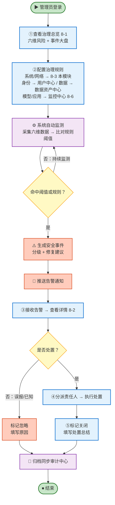

# 统一安全治理中心-需求说明文档

## 模块定位

平台建立覆盖系统、网络、身份、数据、模型、应用的全维度安全治理体系，确保智能体从准入到运行的全过程均处于可感、可知、可控的安全状态。

## 核心业务流程

<aside>
🔗

**告警规则就近配置：数据在哪里采，规则就在哪里配；但告警事件统一回本模块 8-2**

- **本模块 8-3 配**：系统 / 网络 两维（仅针对智能体管理平台自身；智能体侧引接入中心登记信息）
- **用户中心配**：身份维（账号/角色/密钥/登录日志由用户中心采集）
- **数据资产中心配**：数据维（资产元数据/分级分类/隔离配置由数据资产中心采集）
- **监控中心 8-6 配**：模型 / 应用 两维（请求响应流/智能体行为数据由监控中心采集）
- **告警事件统一回本模块 8-2 告警事件处置**：管理员只需去 8-2 一个页面就能看到所有告警并处置；处置记录自动同步审计中心（模块 12）
- **配置范式一致**：六条主线都按「基本信息 / 告警指标 / 规则配置 / 通知配置」四块填写
</aside>

## 设计要点

- **六维独立管控**：系统/网络/身份/数据/模型/应用各设独立检查项与风险等级，互不耦合
- **规则就近配置**：数据在哪里采，规则就在哪里配（系统/网络在 8-3；身份/数据/模型/应用在各源模块），避免重复采集与跨模块维护
- **告警事件统一处置**：六维告警统一回 8-2 告警事件处置，管理员只在一个页面看与处置
- **闭环可追溯**：事件从发现到关闭全程留痕，自动归档同步已关闭事件

## 治理对象与数据来源

安全治理中心的 6 类治理风险中，**4 类（身份/数据/模型/应用）的数据由其他模块采集**，本模块不重复采集；只有**2 类（系统/网络）**由本模块自己采集。

**采集与规则归属原则：**

- **系统/网络两维（本模块自采）**：仅采集**智能体管理平台自身**（服务器配置 + 对外端口）；智能体侧的部署架构与服务地址直接引用**接入中心**的登记信息，不重复扫描。
- **其他四维（借用各源模块）**：身份借用户中心、数据借数据资产中心、模型/应用借运行监控中心。
- **告警规则就近配置**：数据在哪里采，告警规则就在哪里配；告警事件统一回本模块 8-2 处置。

| **治理维度** | **我们管什么** | **数据从哪儿来** | **怎么用：判断 + 处置** |
| --- | --- | --- | --- |
| 系统风险 | **智能体管理平台自身**的服务器：配置项、权限设置、服务间通信是否加密（智能体侧部署架构引接入中心登记信息） | **本模块自采**
读平台运维登记的部署清单 | 与安全基线比对：服务间通信必须加密、禁止明文存放密码、内部访问必须认证 → 不达标自动标红 → 推送至「告警事件处置」 |
| 网络风险 | **智能体管理平台自身**对外暴露的端口/地址：**有没有不该开的端口开着**（智能体接口地址引接入中心登记信息） | **本模块自采**
每 6 小时扫描一次平台 IP | 对照"高危端口黑名单"（SSH、远程桌面、数据库端口等）→ 发现违规自动标红、提醒关闭 → 推送至「告警事件处置」 |
| 身份风险 | **谁能登录、能操作什么、密钥有没有过期** | **用户中心**
的账号台账、角色权限、登录日志信息 | 识别越权操作、异常登录、密钥过期 → 出告警 → 推送至「告警事件处置」
（此类告警规则在用户中心配置） |
| 数据风险 | 患者/业务数据**从产生到删除全流程**是否合规：分级分类、加密、脱敏、备份、访问审计 | **数据资产中心**
资产元数据 、平台运维登记的数据隔离配置。 | 数据资产中心比对合规标准 → 未合规自动出告警 → 推送至「告警事件处置」
（此类告警规则在数据资产中心配置） |
| 模型风险 | 大模型的**输入和输出有没有问题**：提示词攻击、敏感信息泄露、模型越狱、幻觉、不合规输出 | **运行监控中心**
模型请求/响应流 | 识别异常 → 给输出加数字水印 → 出告警 → 推送至「告警事件处置」
（此类告警规则在监控中心配置） |
| 应用风险 | 智能体本身的**运行行为**：调用了什么工具、有没有越权、有没有死循环 | **运行监控中心**
智能体行为数据：工具调用、循环深度、输入验证失败等 | 识别异常调用、越权访问、工具滥用 → 出告警 → 推送至「告警事件处置」
（此类告警规则在监控中心配置） |

## 导航结构

统一安全治理中心采用 **3 个二级入口**，覆盖「看 → 处理 → 配」完整闭环：**安全治理总览**（看大盘 + 6 维度风险）、**告警事件处置**（处理告警事件）、**治理规则管理**（仅配系统 / 网络 两维规则，其余四维在各源模块配置）。

| **编号** | **导航项** | **页面类型** | **主要用途** |
| --- | --- | --- | --- |
| 8-1 | 安全治理总览 | 统计 + Tab + 列表 + 详情 | **上半部**：六维风险指数 + 安全事件统计 + 风险趋势图表；**下半部**：Tab 切换 6 维度（系统/网络/身份/数据/模型/应用）查看检查项列表与详情，支持手动触发检查 |
| 8-2 | 告警事件处置 | 列表 + 详情 + 流程页 | 查看与处置全部告警事件：按状态（全部 / 待处理 / 处理中 / 已关闭 / 已忽略）和级别筛选，支持事件分派、处置、关闭全流程跟踪；处置记录归档至审计中心 |
| 8-3 | 治理规则管理 | 配置页 | **6 个一级 Tab（系统 / 网络 / 身份 / 数据 / 模型 / 应用）统一入口**：系统 / 网络 可配置（采集 + 告警）；身份 / 数据 只读内置规则；模型 / 应用 同步监控中心、可跳转到监控中心-**告警配置处理** |

## 模块功能说明

| **一级功能** | **二级功能** | **功能说明** |
| --- | --- | --- |
| 安全治理总览 | 六维风险与事件大盘 | 六维风险指数、安全事件统计（待处理 / 紧急 / 本月已关闭）、风险趋势图表（雷达图 + 折线图）；快捷跳转告警事件处置与治理规则管理 |
| 系统风险治理 | 部署环境合规检查 | 自动核查智能体部署环境、服务配置、权限配置、内部流量认证策略，不达标即出告警 |
| 网络风险治理 | 暴露面与内网隔离 | 每 6 小时扫描公网暴露端口，识别高危端口并提醒关闭，实施内网微隔离防护 |
| 身份风险治理 | 权限审计与密钥管理 | 身份权限审计、越权检测、密钥生命周期管理（生成/轮换/吊销）、异常登录检测 |
| 数据风险治理 | 数据全生命周期保护 | 覆盖采集、传输、存储、访问、处理、删除全流程，通过分级分类、脱敏、加密、备份、隔离实现安全保护 |
| 模型风险治理 | 提示词与内容防护 | 提示词攻击防御、敏感信息防护、模型越狱检测、内容合规审核、幻觉抑制、数字水印 |
| 应用风险治理 | 输入验证与最小权限 | 输入严格验证、输出上下文编码、智能体及工具调用遵循最小权限原则 |
| 告警事件管理 | 事件处置与闭环跟踪 | 告警事件的接收、分级（紧急/重要/一般）、通知、分派、处置、验证全流程管理，支持处置时间线与审计归档 |
| 治理规则管理 | 规则配置 | 六维告警规则统一入口：系统 / 网络 在本页配置（采集 + 告警）；身份 / 数据 展示内置只读规则；模型 / 应用 同步监控中心-告警管理（只读与跳转编辑） |

## 核心页面清单

| **编号** | **页面名称** | **对应二级功能** | **页面类型** | **主要用途** | **使用角色** |
| --- | --- | --- | --- | --- | --- |
| 8-1 | 安全治理总览 | 六维风险与事件大盘 + 六维风险治理 | 统计 + Tab + 列表 + 详情 | **上半部**：六维风险指数卡片 + 安全事件统计（待处理 / 处理中 / 已关闭） + 风险趋势图表。**下半部**：6 维度 Tab 切换（系统/网络/身份/数据/模型/应用），每个 Tab 显示检查项列表、风险等级与详情；支持手动触发检查 | 平台管理员 |
| 8-2 | 告警事件处置页 | 事件处置与闭环跟踪 | 列表 + 详情 + 流程页 | 告警事件列表含来源维度、事件级别（紧急 / 重要 / 一般）、事件类型、处置状态（全部 / 待处理 / 处理中 / 已关闭 / 已忽略）；事件详情含风险描述、影响范围、处置建议、操作记录时间线 | 平台管理员 |
| 8-3 | 治理规则管理页 | 规则配置 | 配置页 | **6 个一级 Tab 统一入口、三种治理模式差异化呈现**：
**模式 A**（系统 / 网络）可配置：子 Tab 采集配置 + 告警规则
**模式 B**（身份 / 数据）内置只读：展示平台内置规则集，不可配置
**模式 C**（模型 / 应用）同步监控中心：只读快照 + 一键跳转监控中心-告警管理编辑
**告警事件统一回本模块 8-2 处理** | 平台管理员 |

### 8-1 安全治理总览 — 字段与交互

#### 页面概述

| 属性 | 说明 |
| --- | --- |
| 页面类型 | 统计 + Tab + 列表 + 详情页 |
| 使用角色 | 平台管理员 |
| 入口 | 平台首页侧边栏「统一安全治理中心」 |
| 页面结构 | **上半部 · 风险大盘**：六维风险指数 + 安全事件统计 + 风险趋势图表；**下半部 · 六维度风险监测**：顶部 Tab 切换 6 维度（**系统** | **网络** | **身份** | **数据** | **模型** | **应用**），查看检查项列表、风险等级与详情，支持手动触发检查 |

#### 上半部 · 风险大盘

**区域 1：安全事件统计**

<aside>
💡

**设计说明**：采用 4 张卡片并排，按「总量 → 待接手 → 进行中 → 本月收尾」的管理语义从左到右呈现，让管理员一眼看清安全事件的全量与各阶段存量。

</aside>

| **序号** | **卡片名称** | **数据说明** | **交互** |
| --- | --- | --- | --- |
| 1 | 全部事件 | 平台迄今产生的**告警事件总数**（不区分处置状态，含已关闭 / 已忽略） | 点击跳转 8-2（预筛「处置状态 = 全部」） |
| 2 | 待处理事件 | 处置状态为「待处理」的事件数量（尚未分派责任人或尚未开始处置） | 点击跳转 8-2（预筛「处置状态 = 待处理」） |
| 3 | 处理中的事件 | 处置状态为「处理中」的事件数量（已分派责任人、进入处置流程但未关闭） | 点击跳转 8-2（预筛「处置状态 = 处理中」） |
| 4 | 本月已关闭 | 当月自然月内「已关闭 + 已忽略」的事件总数（处置闭环成果指标） | 点击跳转 8-2（预筛「处置状态 = 已关闭 / 已忽略」 + 「关闭时间 = 本月」） |

**说明**：4 张卡片平均占据顶部一行，从左到右呈递进关系：**全部 ⊇ 待处理 + 处理中 + 已关闭/已忽略**；本月已关闭为处置成果类指标，与前三者不重叠统计。

**区域 2：六维待处理事件卡片**

<aside>
💡

**展示逻辑说明**：每张卡片采用「**超大数字 + 三色比例条**」结构展示该维度当前「待处理 + 处理中」状态的告警事件总数与分级分布——大数字直接传达工作量；其下一条等宽的**横向三色堆叠比例条**按红/橙/蓝三色占比反映紧急/重要/一般的事件构成，比例条下方用一行小字「紧急 N · 重要 N · 一般 N」读出明细，避免三个独立标签对齐不齐的问题。数据源直接来自 8-2 告警事件处置，口径统一、易向客户解释。

</aside>

**组件布局规格**（单张卡片由上到下共 4 行）：

| **行** | **元素** | **规格** | **说明** |
| --- | --- | --- | --- |
| 1 | 顶部题头区 | 图标 24px + 标题 14px Medium | 左侧维度图标（使用安装的图标色调）+ 右侧「系统风险 / 网络风险 / …」文字 |
| 2 | **超大数字区** | 数字 40px Bold + 单位「件」12px 灰 右下角下标 | 数字颜色随最高级别动态联动：紧急→红 / 重要→橙 / 一般→蓝 / 为 0 → 主文本色（不用灰色） |
| 3 | **三色堆叠比例条** | 高 8px、全宽、圆角 4px | 红/橙/蓝 三段按事件数量占比填充；某级别为 0 则不出现该色段；全部为 0 时显示为一条貌灰背景条（不填色） |
| 4 | 明细读数行 | 一行 12px 文字 | 格式「● 紧急 N · ● 重要 N · ● 一般 N」；N 为 0 时数字用灰色但不隐藏，保持三个小节永远对齐 |

| **序号** | **卡片名称** | **主数据（大数字）** | **分级明细（三色比例条 + 读数）** | **交互** |
| --- | --- | --- | --- | --- |
| 1 | 系统风险 | 该维度待处理事件总数 | ● 紧急 N / ● 重要 N / ● 一般 N | 点击卡片：跳转 8-2 告警事件处置（预筛「来源维度 = 系统风险」+「处置状态 ≠ 已关闭/已忽略」）；点击任一颜色标签：在跳转基础上再叠加对应级别筛选 |
| 2 | 网络风险 | 该维度待处理事件总数 | ● 紧急 N / ● 重要 N / ● 一般 N | 同上（预筛「来源维度 = 网络风险」） |
| 3 | 身份风险 | 该维度待处理事件总数 | ● 紧急 N / ● 重要 N / ● 一般 N | 同上（预筛「来源维度 = 身份风险」） |
| 4 | 数据风险 | 该维度待处理事件总数 | ● 紧急 N / ● 重要 N / ● 一般 N | 同上（预筛「来源维度 = 数据风险」） |
| 5 | 模型风险 | 该维度待处理事件总数 | ● 紧急 N / ● 重要 N / ● 一般 N | 同上（预筛「来源维度 = 模型风险」） |
| 6 | 应用风险 | 该维度待处理事件总数 | ● 紧急 N / ● 重要 N / ● 一般 N | 同上（预筛「来源维度 = 应用风险」） |

**颜色与级别对应规范**（与 8-2 事件列表「事件级别」标签保持一致）：

- **红色 ● 紧急**：需立即处置，可能造成数据泄露 / 服务中断 / 合规违规
- **橙色 ● 重要**：需尽快处置，存在明显风险但暂未造成实质影响
- **蓝色 ● 一般**：建议处置，属于提示性风险

**展示规则补充**：

- **零事件态不降饱和**：某维度待处理总数为 0 时，卡片**保持与其他卡片一致的背景与边框**（不置灰、不降透明度）；主数字显示「0」使用主文本色；比例条仅顯示一条貌灰空背景条；下方读数行保留「紧急 0 · 重要 0 · 一般 0」占位，使六张卡片高度与轴线完全一致。
- **大数字动态变色**：含紧急事件 → 红色；无紧急但含重要 → 橙色；仅有一般 → 蓝色；**为 0 → 主文本色**（黑/深灰，不用浅灰，以免被误读为「禁用」）。
- **比例条填色规则**：某级别数量 > 0 才填充该颜色段；三个级别同时为 0 时整条为貌灰背景条，区分于「边框被填满」的状态。
- **读数行位置固定**：N 为 0 时该节点的数字颜色变灰，但「紧急/重要/一般」三个节点始终保留且位置固定，保证 6 张卡片水平对齐、不出现二行 / 一行高低不一的问题。
- **数据实时刷新**：与 8-2 告警事件处置同步（事件状态变更为「已关闭 / 已忽略」后立即从计数中剔除）。

**区域 3：风险趋势图表**

| **序号** | **图表名称** | **图表类型** | **说明** |
| --- | --- | --- | --- |
| 1 | 六维风险指数雷达图 | 雷达图 | 各维度风险指数综合展示，直观反映安全短板 |
| 2 | 安全事件趋势 | 折线图 | 近 30 天安全事件发生数量趋势 |

---

### 8-2 告警事件处置页 — 字段与交互

#### 页面概述

| 属性 | 说明 |
| --- | --- |
| 页面类型 | 列表 + 详情 + 流程页 |
| 使用角色 | 平台管理员 |
| 入口 | 安全治理总览「告警事件处置」卡片 / 侧边栏 |

#### 页面布局顺序（从上到下）

<aside>
📍

**Tab 位于筛选组件上方**，作为一级范围限定。选中 Tab 后的数据集才进入下方筛选器进一步过滤，最后呈现在事件列表中。

</aside>

| **层级** | **区域** | **组件** | **作用** |
| --- | --- | --- | --- |
| ① 顶部 | 面包屑 + 页面标题 | 面包屑导航、页面主标题「告警事件处置」、副标题说明 | 定位与简要说明 |
| ② 上层 | **Tab 切换区** | **全部事件 | 我的事件**（Ant Design Tabs，下划线样式） | **一级范围**：先确定取哪一部分事件（全局 vs 与我相关） |
| ③ 中层 | **筛选与搜索区** | 关键字搜索 + 来源维度 + 事件级别 + 处置状态 + 重置按钮 | **二级过滤**：在选中 Tab 的范围内，按字段进一步过滤 |
| ④ 下层 | 事件列表区 | 表格 + 分页 | 呈现最终过滤后的事件结果 |

**数据过滤顺序**：全量告警事件 → 按 **Tab** 取一级集合（全部 / 我的）→ 按 **筛选器**取二级子集（维度 / 级别 / 状态 / 关键字）→ 呈现于**列表**。

#### 上层 Tab 切换：全部事件 | 我的事件

Tab 控件位于筛选区正上方、与面包屑 / 页面标题隔一条细线，采用 Ant Design 下划线式 Tabs；默认进入页面时选中「我的事件」（优先处理责任人任务）。

| **序号** | **Tab 名称** | **默认选中** | **数据口径** | **计数徽标** |
| --- | --- | --- | --- | --- |
| 1 | 全部事件 | 否 | 全平台所有告警事件，不区分责任人；供管理员总览、查询他人任务、定期复盘使用 | 全局未关闭事件总数 |
| 2 | 我的事件 | **是** | 满足以下任一条件的事件：① 责任人 = 当前登录用户；② 创建人 / 发起人 = 当前登录用户（由本人手动建单或分派）；③ 关注人 = 当前登录用户（预留扩展） | 上述条件汇总后去重 |

**Tab 与筛选器的上下关系与联动规则**：

- **位置**：Tab 始终位于筛选区正上方，是列表页的「一级范围」；筛选器位于 Tab 下方，是「二级过滤」。两者顺序**不可调换**。
- **优先级**：先生效 Tab 取数据集，再在该数据集上叠加筛选器条件。切换 Tab 会**重新加载数据**但**保留下方筛选器的当前选项**（例如从「我的事件 + 紧急」切到「全部事件」后，仍默认保留「紧急」筛选，方便横向对比）。
- **计数徽标**：Tab 名称右侧显示未关闭事件计数，例：「我的事件 (3)」「全部事件 (7)」；**计数仅受 Tab 本身口径控制，不受下方筛选器影响**，避免用户误以为徽标随筛选变动。
- **重置按钮**作用范围仅限事件列表上方的「筛选器」，**不会重置 Tab 选中项**。
- **跳转默认**：从 8-1 六维卡片进入 → 默认「全部事件」Tab（保留预筛的维度范围）；从侧边栏直接进入 → 默认「我的事件」Tab。
- 「我的事件」Tab 下的列表默认按「事件级别 降序 + 发现时间 升序」排序，超期未处置、紧急级别事件额外突出显示。

#### 筛选与搜索

| **序号** | **筛选项** | **类型** | **说明** |
| --- | --- | --- | --- |
| 1 | 关键字搜索 | 文本输入 | 按事件标题、智能体名称模糊搜索 |
| 2 | 来源维度 | 下拉筛选 | 全部 / 系统风险 / 网络风险 / 身份风险 / 数据风险 / 模型风险 / 应用风险 |
| 3 | 事件级别 | 下拉筛选 | 全部 / 紧急 / 重要 / 一般 |
| 4 | 处置状态 | 下拉筛选 | 全部 / 待处理 / 处理中 / 已关闭 / 已忽略 |

#### 事件列表字段

| **序号** | **列名** | **类型** | **说明** | **交互** |
| --- | --- | --- | --- | --- |
| 1 | 事件标题 | 文本链接 | 安全事件的标题描述 | 点击打开详情抽屉 |
| 2 | 来源维度 | 标签 | 全部 / 系统风险 / 网络风险 / 身份风险 / 数据风险 / 模型风险 / 应用风险 | — |
| 3 | 事件级别 | 状态标签 | 紧急(红)/ 重要(黄)/ 一般(蓝) | — |
| 4 | 关联智能体 | 文本 | 受影响的智能体名称 | 点击跳转台账详情 |
| 5 | 发现时间 | 日期时间 | 事件触发时间 | — |
| 6 | 处置状态 | 状态标签 | 待处理(红)/ 处理中(黄)/ 已关闭(绿)/ 已忽略(灰) | — |
| 7 | 操作 | 按钮组 | 查看详情 / 开始处置 / 忽略 | 按状态动态显示 |

#### 事件详情抽屉

点击事件标题打开右侧抽屉，展示以下内容：

| **序号** | **字段名称** | **类型** | **说明** |
| --- | --- | --- | --- |
| 1 | 事件标题 | 文本 | 安全事件的标题 |
| 2 | 风险描述 | 多行文本 | 详细描述风险内容与发现方式 |
| 3 | 影响范围 | 列表 | 受影响的智能体、科室、服务 |
| 4 | 处置建议 | 多行文本 | 系统自动生成的处置建议 |
| 5 | 处置记录时间线 | 时间轴 | 处置操作的完整时间线（发现 → 分派 → 处置 → 关闭） |

底部操作按钮：开始处置 / 标记已关闭 / 忽略事件 / 升级事件级别。处置关闭后自动同步审计中心（模块 12）。

---

### 8-3 治理规则管理页 — 字段与交互

#### 页面概述

| 属性 | 说明 |
| --- | --- |
| 页面类型 | 配置 + 查看页（6 个一级 Tab：系统 | 网络 | 身份 | 数据 | 模型 | 应用，按治理模式分 3 类呈现） |
| 使用角色 | 平台管理员 |
| 入口 | 侧边栏「治理规则管理」 / 安全治理总览快捷入口 / 总览页六维 Tab 检查项详情「编辑策略」按钮（带参跳转到对应维度 Tab） |
| 页面结构 | 顶部「面包屑 + 页面标题」→ 一级 Tab「系统 | 网络 | 身份 | 数据 | 模型 | 应用」→ Tab 内容区按治理模式渲染（可配置 / 内置只读 / 同步监控中心）。**不展示顶部 4 卡片跳转区**（该区已合并到对应 Tab 顶部按钮） |

#### 六维 Tab 治理模式总览

<aside>
🎯

**统一入口、差异化呈现**：6 个 Tab 将六维告警规则的查看入口完全统一在本页；但因「数据归属」与「规则归属」不同，Tab 内容区分为 3 种模式，引导管理员到正确的位置完成操作。

</aside>

<aside>
⚠️

**取消顶部 4 卡片跳转区**：旧版页面顶部的「身份风险 / 数据风险 / 模型风险 / 应用风险」4 个跳转卡片已**合并到 6 个一级 Tab 中**（跳转按钮放在对应 Tab 的顶部区），**本页不再展示该区域**，避免与 Tab 入口重复、页面信息重载。

</aside>

| **序号** | **一级 Tab** | **治理模式** | **Tab 内容结构** | **说明** |
| --- | --- | --- | --- | --- |
| 1 | 系统 | **A · 本模块可配置** | 子 Tab：采集配置 | 告警规则 | 平台自采 + 本模块完整闭环；支持新建 / 编辑 / 启停 / 删除 |
| 2 | 网络 | **A · 本模块可配置** | 子 Tab：采集配置 | 告警规则 | 同上；默认每 6 小时扫描 |
| 3 | 身份 | **B · 内置只读** | 内置规则列表（只读） | 平台内置身份风险规则集，基于用户中心账号/角色/密钥/登录日志自动判定，不支持自定义 |
| 4 | 数据 | **B · 内置只读** | 内置规则列表（只读） | 平台内置数据风险规则集，基于数据资产中心分级分类/加密/脱敏/审计字段自动判定，不支持自定义 |
| 5 | 模型 | **C · 同步监控中心** | 同步规则列表（只读） | 实时镜像监控中心 8-6「告警管理」中标签 = 「模型」的规则；启停 / 阈值随监控中心变更立即反映，本页不可改 |
| 6 | 应用 | **C · 同步监控中心** | 同步规则列表（只读） | 实时镜像监控中心 8-6「告警管理」中标签 = 「应用」的规则，本页不可改 |

**默认 Tab**：进入页面默认选中「系统」；从总览页某维度 Tab 的「编辑策略」入口进入时，带参直接跳转到对应 Tab。

#### 模式 A · 系统 / 网络（可配置）

每个 A 类 Tab 包含两个二级子 Tab：**采集配置 | 告警规则** — 先配采集才能拿到指标，再配告警才能产生事件。

#### 子 Tab A1 · 采集配置

配置「采什么、多频繁采、采集白名单」等参数；采集对象仅限**智能体管理平台自身**，智能体侧的部署架构与接口地址直接引用接入中心登记信息，不重复扫描。

| **序号** | **字段名称** | **字段类型** | **必填** | **说明** |
| --- | --- | --- | --- | --- |
| 1 | 采集对象清单 | 多选列表 | 是 | 从接入中心登记的部署清单中勾选要采集的服务器 / IP，可选「全部」 |
| 2 | 采集频率 | 下拉单选 | 是 | 实时 / 每小时 / 每 6 小时 / 每日 / 每周（系统默认每日，网络默认每 6 小时） |
| 3 | 采集项 | 多选清单 | 是 | 系统：配置项 / 权限 / 加密状态 / 服务间通信；网络：端口扫描 / 公网开放面 / 内网隔离状态 |
| 4 | 扫描白名单 | 多行文本 | 否 | 仅网络维度：跳过扫描的 IP / 端口（如运维堡垒机），避免误报 |
| 5 | 扫描超时 | 数字（秒） | 否 | 单次扫描最长执行时长，默认 600 秒 |
| 6 | 启用状态 | 开关 | 是 | 启用 / 停用该采集任务 |

<aside>
🔄

采集到的指标自动汇入 8-1 安全治理总览对应 Tab 的检查项；**同时作为子 Tab B 告警规则的判定来源**。未启用采集的采集项，其告警规则会被自动置灰并提示「先去采集配置启用」。

</aside>

#### 子 Tab A2 · 告警规则 · 筛选与搜索

| **序号** | **筛选项** | **类型** | **说明** |
| --- | --- | --- | --- |
| 1 | 关键字搜索 | 文本输入 | 按规则名称模糊搜索 |
| 2 | 风险等级 | 下拉筛选 | 全部 / 低 / 中 / 高 |
| 3 | 启用状态 | 下拉筛选 | 全部 / 启用 / 停用 |

#### 子 Tab A2 · 告警规则列表字段

| **序号** | **列名** | **类型** | **说明** | **交互** |
| --- | --- | --- | --- | --- |
| 1 | 规则名称 | 文本链接 | 规则的名称 | 点击打开编辑抽屉 |
| 2 | 检查频率 | 文本 | 实时 / 每小时 / 每 6 小时 / 每日 / 每周 | — |
| 3 | 风险阈值 | 文本 | 触发条件摘要（如：高危端口数 > 0） | — |
| 4 | 风险等级 | 状态标签 | 低（蓝）/ 中（黄）/ 高（红） | — |
| 5 | 响应动作 | 标签组 | 告警通知 / 自动阻断 / 服务隔离 / 仅记录 | — |
| 6 | 启用状态 | 开关 | 启用 / 停用 | 点击切换 |
| 7 | 最近触发时间 | 日期时间 | 最近一次该规则被触发的时间 | — |
| 8 | 操作 | 按钮组 | 编辑 / 删除 | — |

#### 子 Tab A2 · 新建 / 编辑告警规则 · 表单字段

点击「新建规则」按钮或规则名称后，以右侧抽屉形式展示表单。

| **序号** | **字段名称** | **字段类型** | **必填** | **说明** |
| --- | --- | --- | --- | --- |
| 1 | 规则名称 | 文本 | 是 | 安全检查规则名称 |
| 2 | 所属 Tab | 下拉单选 | 是 | 系统 / 网络（默认随当前 Tab） |
| 3 | 检查频率 | 下拉单选 | 是 | 实时 / 每小时 / 每 6 小时 / 每日 / 每周 |
| 4 | 风险阈值 | 数字 / 配置项 | 是 | 触发风险的阈值条件（如：高危端口暴露数 > 0、服务间未加密通信数 > 0） |
| 5 | 风险等级 | 下拉单选 | 是 | 触发后的风险分级：低 / 中 / 高 |
| 6 | 自动响应动作 | 下拉多选 | 是 | 告警通知 / 自动阻断 / 服务隔离 / 仅记录 |
| 7 | 通知渠道 | 下拉多选 | 否 | 站内信 / 短信 / 邮件 |
| 8 | 启用状态 | 开关 | 是 | 启用 / 停用该规则 |

#### 模式 A 操作行为

- **新建规则**：子 Tab A2 右上角「新建规则」按钮，打开右侧抽屉填写表单，保存后规则自动归入当前 Tab。
- **编辑规则**：点击规则名称或操作列「编辑」，打开抽屉修改后保存。
- **删除规则**：操作列「删除」二次确认后删除；仅停用 ≥ 30 天且无关联未关闭告警的规则可删除。
- **启停规则**：列表内开关一键切换；停用后规则不再触发新告警，已产生告警不受影响。

#### 模式 B · 身份 / 数据（内置只读）

<aside>
🔒

**内置只读说明**：身份 / 数据 两维的告警规则由平台基于法规与最佳实践内置，**不支持新建 / 编辑 / 删除**。规则运行依赖的字段（账号台账、角色权限、登录日志、数据分级分类、加密脱敏配置等）由对应源模块维护；告警事件统一回 8-2 处置。

</aside>

#### Tab 顶部区（身份 / 数据）

- 左侧：维度图标 + Tab 名称 + 内置规则数量（如「内置规则 12 条」）
- 右侧按钮：
    - **「查看本维度告警事件」** → 跳 8-2 并预筛该维度
    - **「去 [用户中心 / 数据资产中心] 查看采集字段」** → 新开标签页跳源模块

#### 内置规则列表字段（只读）

| **序号** | **规则名称** | **风险等级** | **默认响应** | **规则说明** |
| --- | --- | --- | --- | --- |
| — | （内置规则名） | 低 / 中 / 高状态标签 | 告警通知 / 仅记录 | 触发条件、判定字段、修复建议 |

**典型规则示例**：

- 身份：账号长期未登录、超级权限账号超阈值、密钥即将过期 / 已过期、异地异常登录、暴力破解尝试、角色权限越权
- 数据：未分级数据被访问、敏感字段未脱敏、跨库未加密传输、审计日志缺失、备份失败、数据违规出域

**交互**：点击规则名称打开**只读详情抽屉**，展示完整规则定义 / 判定逻辑 / 关联字段；抽屉底部**无操作按钮**。

#### 模式 C · 模型 / 应用（同步监控中心）

<aside>
🔗

**同步规则说明**：模型 / 应用 两维的告警规则**实时同步自「运行监控中心 8-6 → 告警管理」**中标签为「模型」「应用」的规则集，**本页仅展示快照**；所有新建 / 编辑 / 启停操作必须在监控中心完成。

</aside>

#### Tab 顶部区（模型 / 应用）

- 左侧：维度图标 + Tab 名称 + 同步规则数量 + 「最后同步时间：YYYY-MM-DD HH:mm」
- 右侧按钮：
    - **「去监控中心 → 告警管理」**（主按钮，突出色调，新开标签页，带参跳到对应维度的告警规则列表）
    - 「查看本维度告警事件」 → 跳 8-2 并预筛该维度

#### 同步规则列表字段（只读）

| **序号** | **规则名称** | **风险等级** | **启用状态** | **阈值摘要** | **监控中心规则 ID** |
| --- | --- | --- | --- | --- | --- |
| — | （同步自监控中心的规则名） | 低 / 中 / 高 | 启用 / 停用（同步状态） | 简要阈值描述 | 点击直接跳监控中心该规则 |

#### 与监控中心的同步约定

- **同步频率**：实时增量（规则变更立即推送）+ 每 5 分钟兜底全量校准
- **同步范围**：监控中心「告警管理」中标签为「模型」或「应用」的全部规则
- **显示口径**：启用与停用规则均展示，与监控中心保持一致
- **字段映射**：规则名称 / 风险等级 / 阈值摘要 / 响应动作 / 启用状态 / 最近触发时间 / 监控中心规则 ID
- **失联兜底**：若与监控中心连接异常，Tab 顶部红色 banner 提示「同步异常，数据为 X 分钟前快照」，数据仍可查阅但标注时效

**交互**：点击规则名称打开**只读详情抽屉**，抽屉底部仅一个按钮**「去监控中心编辑此规则」**（主按钮，新开标签页带规则 ID 跳转）。

#### 跨模块跳转汇总

| **维度** | **模式** | **目标模块** | **跳转目的** |
| --- | --- | --- | --- |
| 身份 | B | 用户中心（模块 11） | 查看账号 / 角色 / 密钥 / 登录审计采集字段 |
| 数据 | B | 数据资产中心（模块 10） | 查看分级分类 / 加密脱敏 / 备份 / 访问审计采集字段 |
| 模型 | C | 运行监控中心 8-6 → 告警管理 | 新建 / 编辑 / 启停模型类告警规则 |
| 应用 | C | 运行监控中心 8-6 → 告警管理 | 新建 / 编辑 / 启停应用类告警规则 |

<aside>
💡

**统一回口**：无论规则在哪里维护，**所有维度产生的告警事件统一回 8-2 告警事件处置 查看与处置**，管理员只需在 8-2 一个页面完成日常处置工作。

</aside>