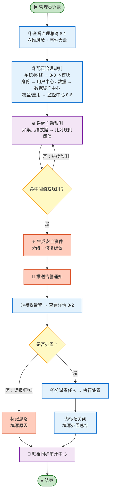

# 统一安全治理中心-需求说明文档

## 模块定位

平台建立覆盖系统、网络、身份、数据、模型、应用的全维度安全治理体系，确保智能体从准入到运行的全过程均处于可感、可知、可控的安全状态。

## 核心业务流程

<aside>
🔗

**告警规则就近配置：数据在哪里采，规则就在哪里配；但告警事件统一回本模块 8-2**

- **本模块 8-3 配**：系统 / 网络 两维（仅针对智能体管理平台自身；智能体侧引接入中心登记信息）
- **用户中心配**：身份维（账号/角色/密钥/登录日志由用户中心采集）
- **数据资产中心配**：数据维（资产元数据/分级分类/隔离配置由数据资产中心采集）
- **监控中心 8-6 配**：模型 / 应用 两维（请求响应流/智能体行为数据由监控中心采集）
- **告警事件统一回本模块 8-2 告警事件处置**：管理员只需去 8-2 一个页面就能看到所有告警并处置；处置记录自动同步审计中心（模块 12）
- **配置范式一致**：六条主线都按「基本信息 / 告警指标 / 规则配置 / 通知配置」四块填写
</aside>

## 设计要点

- **六维独立管控**：系统/网络/身份/数据/模型/应用各设独立检查项与风险等级，互不耦合
- **规则就近配置**：数据在哪里采，规则就在哪里配（系统/网络在 8-3；身份/数据/模型/应用在各源模块），避免重复采集与跨模块维护
- **告警事件统一处置**：六维告警统一回 8-2 告警事件处置，管理员只在一个页面看与处置
- **闭环可追溯**：事件从发现到关闭全程留痕，自动归档同步已关闭事件

## 治理对象与数据来源

安全治理中心的 6 类治理风险中，**4 类（身份/数据/模型/应用）的数据由其他模块采集**，本模块不重复采集；只有**2 类（系统/网络）**由本模块自己采集。

**采集与规则归属原则：**

- **系统/网络两维（本模块自采）**：仅采集**智能体管理平台自身**（服务器配置 + 对外端口）；智能体侧的部署架构与服务地址直接引用**接入中心**的登记信息，不重复扫描。
- **其他四维（借用各源模块）**：身份借用户中心、数据借数据资产中心、模型/应用借运行监控中心。
- **告警规则就近配置**：数据在哪里采，告警规则就在哪里配；告警事件统一回本模块 8-2 处置。

| **治理维度** | **我们管什么** | **数据从哪儿来** | **怎么用：判断 + 处置** |
| --- | --- | --- | --- |
| 系统风险 | **智能体管理平台自身**的服务器：配置项、权限设置、服务间通信是否加密（智能体侧部署架构引接入中心登记信息） | **本模块自采**
读平台运维登记的部署清单 | 与安全基线比对：服务间通信必须加密、禁止明文存放密码、内部访问必须认证 → 不达标自动标红 → 推送至「告警事件处置」 |
| 网络风险 | **智能体管理平台自身**对外暴露的端口/地址：**有没有不该开的端口开着**（智能体接口地址引接入中心登记信息） | **本模块自采**
每 6 小时扫描一次平台 IP | 对照"高危端口黑名单"（SSH、远程桌面、数据库端口等）→ 发现违规自动标红、提醒关闭 → 推送至「告警事件处置」 |
| 身份风险 | **谁能登录、能操作什么、密钥有没有过期** | **用户中心**
的账号台账、角色权限、登录日志信息 | 识别越权操作、异常登录、密钥过期 → 出告警 → 推送至「告警事件处置」
（此类告警规则在用户中心配置） |
| 数据风险 | 患者/业务数据**从产生到删除全流程**是否合规：分级分类、加密、脱敏、备份、访问审计 | **数据资产中心**
资产元数据 、平台运维登记的数据隔离配置。 | 数据资产中心比对合规标准 → 未合规自动出告警 → 推送至「告警事件处置」
（此类告警规则在数据资产中心配置） |
| 模型风险 | 大模型的**输入和输出有没有问题**：提示词攻击、敏感信息泄露、模型越狱、幻觉、不合规输出 | **运行监控中心**
模型请求/响应流 | 识别异常 → 给输出加数字水印 → 出告警 → 推送至「告警事件处置」
（此类告警规则在监控中心配置） |
| 应用风险 | 智能体本身的**运行行为**：调用了什么工具、有没有越权、有没有死循环 | **运行监控中心**
智能体行为数据：工具调用、循环深度、输入验证失败等 | 识别异常调用、越权访问、工具滥用 → 出告警 → 推送至「告警事件处置」
（此类告警规则在监控中心配置） |

## 导航结构

统一安全治理中心采用 **3 个二级入口**，覆盖「看 → 处理 → 配」完整闭环：**安全治理总览**（看大盘 + 6 维度风险）、**告警事件处置**（处理告警事件）、**治理规则管理**（仅配系统 / 网络 两维规则，其余四维在各源模块配置）。

| **编号** | **导航项** | **页面类型** | **主要用途** |
| --- | --- | --- | --- |
| 8-1 | 安全治理总览 | 统计 + Tab + 列表 + 详情 | **上半部**：六维风险指数 + 安全事件统计 + 风险趋势图表；**下半部**：Tab 切换 6 维度（系统/网络/身份/数据/模型/应用）查看检查项列表与详情，支持手动触发检查 |
| 8-2 | 告警事件处置 | 列表 + 详情 + 流程页 | 查看与处置全部告警事件：按状态（全部 / 待处理 / 处理中 / 已关闭 / 已忽略）和级别筛选，支持事件分派、处置、关闭全流程跟踪；处置记录归档至审计中心 |
| 8-3 | 治理规则管理 | 配置页 | **仅配置系统 / 网络 两维的告警规则**：检查频率、阈值、响应动作、通知渠道。其余四维就近配置：身份→用户中心、数据→数据资产中心、模型/应用→监控中心 8-6；**但告警事件统一回 8-2 处理** |

## 模块功能说明

| **一级功能** | **二级功能** | **功能说明** |
| --- | --- | --- |
| 安全治理总览 | 六维风险与事件大盘 | 六维风险指数、安全事件统计（待处理 / 紧急 / 本月已关闭）、风险趋势图表（雷达图 + 折线图）；快捷跳转告警事件处置与治理规则管理 |
| 系统风险治理 | 部署环境合规检查 | 自动核查智能体部署环境、服务配置、权限配置、内部流量认证策略，不达标即出告警 |
| 网络风险治理 | 暴露面与内网隔离 | 每 6 小时扫描公网暴露端口，识别高危端口并提醒关闭，实施内网微隔离防护 |
| 身份风险治理 | 权限审计与密钥管理 | 身份权限审计、越权检测、密钥生命周期管理（生成/轮换/吊销）、异常登录检测 |
| 数据风险治理 | 数据全生命周期保护 | 覆盖采集、传输、存储、访问、处理、删除全流程，通过分级分类、脱敏、加密、备份、隔离实现安全保护 |
| 模型风险治理 | 提示词与内容防护 | 提示词攻击防御、敏感信息防护、模型越狱检测、内容合规审核、幻觉抑制、数字水印 |
| 应用风险治理 | 输入验证与最小权限 | 输入严格验证、输出上下文编码、智能体及工具调用遵循最小权限原则 |
| 告警事件管理 | 事件处置与闭环跟踪 | 告警事件的接收、分级（紧急/重要/一般）、通知、分派、处置、验证全流程管理，支持处置时间线与审计归档 |
| 治理规则管理 | 规则配置 | 仅配置系统 / 网络 两维告警规则：检查频率、风险阈值、自动响应动作（告警/阻断/隔离）、通知渠道。其余四维就近配置：身份→用户中心、数据→数据资产中心、模型/应用→监控中心 8-6 |

## 核心页面清单

| **编号** | **页面名称** | **对应二级功能** | **页面类型** | **主要用途** | **使用角色** |
| --- | --- | --- | --- | --- | --- |
| 8-1 | 安全治理总览 | 六维风险与事件大盘 + 六维风险治理 | 统计 + Tab + 列表 + 详情 | **上半部**：六维风险指数卡片 + 安全事件统计（待处理 / 处理中 / 已关闭） + 风险趋势图表。**下半部**：6 维度 Tab 切换（系统/网络/身份/数据/模型/应用），每个 Tab 显示检查项列表、风险等级与详情；支持手动触发检查 | 平台管理员 |
| 8-2 | 告警事件处置页 | 事件处置与闭环跟踪 | 列表 + 详情 + 流程页 | 告警事件列表含来源维度、事件级别（紧急 / 重要 / 一般）、事件类型、处置状态（全部 / 待处理 / 处理中 / 已关闭 / 已忽略）；事件详情含风险描述、影响范围、处置建议、操作记录时间线 | 平台管理员 |
| 8-3 | 治理规则管理页 | 规则配置 | 配置页 | **仅配置系统 / 网络 两维的告警规则**：分 Tab 配置检查频率、风险阈值、自动响应动作（告警/阻断/隔离）、通知渠道。
**其余四维就近配置**：身份→用户中心、数据→数据资产中心、模型/应用→监控中心 8-6（页面顶部提供跳转按钮）；**但告警事件统一回本模块 8-2 处理** | 平台管理员 |

### 8-1 安全治理总览 — 字段与交互

#### 页面概述

| 属性 | 说明 |
| --- | --- |
| 页面类型 | 统计 + Tab + 列表 + 详情页 |
| 使用角色 | 平台管理员 |
| 入口 | 平台首页侧边栏「统一安全治理中心」 |
| 页面结构 | **上半部 · 风险大盘**：六维风险指数 + 安全事件统计 + 风险趋势图表；**下半部 · 六维度风险监测**：顶部 Tab 切换 6 维度（**系统** | **网络** | **身份** | **数据** | **模型** | **应用**），查看检查项列表、风险等级与详情，支持手动触发检查 |

#### 上半部 · 风险大盘

**区域 1：六维风险指数卡片**

| **序号** | **卡片名称** | **数据说明** | **交互** |
| --- | --- | --- | --- |
| 1 | 系统风险 | 配置合规检查通过率 + 异常项数 | 点击切换至本页「系统」Tab |
| 2 | 网络风险 | 公网暴露端口数 + 高危端口数 | 点击切换至本页「网络」Tab |
| 3 | 身份风险 | 异常登录次数 + 越权检测数 | 点击切换至本页「身份」Tab |
| 4 | 数据风险 | 数据安全合规率 + 待处理风险数 | 点击切换至本页「数据」Tab |
| 5 | 模型风险 | 提示词攻击拦截数 + 内容审核异常数 | 点击切换至本页「模型」Tab |
| 6 | 应用风险 | 输入验证失败数 + 权限越界次数 | 点击切换至本页「应用」Tab |

**区域 2：安全事件统计**

| **序号** | **卡片名称** | **数据说明** | **交互** |
| --- | --- | --- | --- |
| 1 | 待处理事件 | 处置状态为「待处理」的事件数量 | 点击跳转 8-2（预筛「待处理」） |
| 2 | 紧急事件 | 级别为「紧急」的未关闭事件数 | 点击跳转 8-2（预筛「紧急」） |
| 3 | 本月已关闭 | 本月关闭的事件总数 | 点击跳转 8-2（预筛「已关闭」） |

**区域 3：风险趋势图表**

| **序号** | **图表名称** | **图表类型** | **说明** |
| --- | --- | --- | --- |
| 1 | 六维风险指数雷达图 | 雷达图 | 各维度风险指数综合展示，直观反映安全短板 |
| 2 | 安全事件趋势 | 折线图 | 近 30 天安全事件发生数量趋势 |

**区域 4：快捷入口**

以卡片形式展示两大子页面入口：告警事件处置（8-2）、治理规则管理（8-3）。

#### 下半部 · 六维度风险监测

**Tab 维度设计**

| **序号** | **Tab 名称** | **检查项示例** | **说明** |
| --- | --- | --- | --- |
| 1 | 系统 | 部署环境合规、服务配置审计、内部流量认证 | 检查智能体部署环境、服务配置、权限配置的合规性 |
| 2 | 网络 | 公网端口扫描、内网微隔离状态、高危端口检测 | 监测公网暴露面与内网隔离状态 |
| 3 | 身份 | 异常登录检测、越权操作审计、密钥过期检查 | 身份认证与权限管控风险 |
| 4 | 数据 | 数据分级合规、脱敏执行、加密状态、备份完整性 | 数据全生命周期安全保护状态 |
| 5 | 模型 | 提示词攻击防御、越狱检测、内容合规审核、水印标识 | 模型层安全风险防范状态 |
| 6 | 应用 | 输入验证规则、输出编码检查、最小权限审计 | 应用层安全控制状态 |

**筛选与搜索**

| **序号** | **筛选项** | **类型** | **说明** |
| --- | --- | --- | --- |
| 1 | 关键字搜索 | 文本输入 | 按检查项名称、智能体名称模糊搜索 |
| 2 | 风险等级 | 下拉筛选 | 全部 / 无风险 / 低风险 / 中风险 / 高风险 |
| 3 | 检查结果 | 下拉筛选 | 全部 / 通过 / 未通过 / 待检查 |

**检查项列表字段（各 Tab 通用）**

| **序号** | **列名** | **类型** | **说明** | **交互** |
| --- | --- | --- | --- | --- |
| 1 | 检查项名称 | 文本链接 | 检查项的名称 | 点击查看详情 |
| 2 | 风险等级 | 状态标签 | 无风险（绿）/ 低风险（蓝）/ 中风险（黄）/ 高风险（红） | — |
| 3 | 最近检查时间 | 日期时间 | 上次自动/手动检查的时间 | — |
| 4 | 检查结果 | 标签 | 通过 / 未通过 / 待检查 | — |
| 5 | 影响智能体 | 数字 | 受影响的智能体数量 | — |
| 6 | 操作 | 按钮组 | 查看详情 / 立即检查 / 创建事件 | 按状态动态显示 |

**检查项详情抽屉**

点击检查项名称后以右侧抽屉形式展示：规则名称与说明、检查频率、当前风险等级、最近检查结果明细、历史检查记录时间线、处置建议。底部操作按钮：立即检查 / 创建安全事件 / 编辑策略。

---

### 8-2 告警事件处置页 — 字段与交互

#### 页面概述

| 属性 | 说明 |
| --- | --- |
| 页面类型 | 列表 + 详情 + 流程页 |
| 使用角色 | 平台管理员 |
| 入口 | 安全治理总览「告警事件处置」卡片 / 侧边栏 |

#### 筛选与搜索

| **序号** | **筛选项** | **类型** | **说明** |
| --- | --- | --- | --- |
| 1 | 关键字搜索 | 文本输入 | 按事件标题、智能体名称模糊搜索 |
| 2 | 来源维度 | 下拉筛选 | 全部 / 系统风险 / 网络风险 / 身份风险 / 数据风险 / 模型风险 / 应用风险 |
| 3 | 事件级别 | 下拉筛选 | 全部 / 紧急 / 重要 / 一般 |
| 4 | 处置状态 | 下拉筛选 | 全部 / 待处理 / 处理中 / 已关闭 / 已忽略 |

#### 事件列表字段

| **序号** | **列名** | **类型** | **说明** | **交互** |
| --- | --- | --- | --- | --- |
| 1 | 事件标题 | 文本链接 | 安全事件的标题描述 | 点击打开详情抽屉 |
| 2 | 来源维度 | 标签 | 全部 / 系统风险 / 网络风险 / 身份风险 / 数据风险 / 模型风险 / 应用风险 | — |
| 3 | 事件级别 | 状态标签 | 紧急(红)/ 重要(黄)/ 一般(蓝) | — |
| 4 | 关联智能体 | 文本 | 受影响的智能体名称 | 点击跳转台账详情 |
| 5 | 发现时间 | 日期时间 | 事件触发时间 | — |
| 6 | 处置状态 | 状态标签 | 待处理(红)/ 处理中(黄)/ 已关闭(绿)/ 已忽略(灰) | — |
| 7 | 操作 | 按钮组 | 查看详情 / 开始处置 / 忽略 | 按状态动态显示 |

#### 事件详情抽屉

点击事件标题打开右侧抽屉，展示以下内容：

| **序号** | **字段名称** | **类型** | **说明** |
| --- | --- | --- | --- |
| 1 | 事件标题 | 文本 | 安全事件的标题 |
| 2 | 风险描述 | 多行文本 | 详细描述风险内容与发现方式 |
| 3 | 影响范围 | 列表 | 受影响的智能体、科室、服务 |
| 4 | 处置建议 | 多行文本 | 系统自动生成的处置建议 |
| 5 | 处置记录时间线 | 时间轴 | 处置操作的完整时间线（发现 → 分派 → 处置 → 关闭） |

底部操作按钮：开始处置 / 标记已关闭 / 忽略事件 / 升级事件级别。处置关闭后自动同步审计中心（模块 12）。

---

### 8-3 治理规则管理页 — 字段与交互

#### 页面概述

| 属性 | 说明 |
| --- | --- |
| 页面类型 | 配置页（顶部跳转卡片 + 一级 Tab：系统 | 网络；每个一级 Tab 下含 2 个二级子 Tab：采集配置 | 告警规则） |
| 使用角色 | 平台管理员 |
| 入口 | 安全治理总览「治理规则管理」卡片 / 侧边栏 / 总览页「系统 / 网络」Tab 检查项详情「编辑策略」按钮（仅系统 / 网络；身份 / 数据 / 模型 / 应用的「编辑策略」会直接跳转到各源模块） |
| 页面结构 | 顶部 **跳转卡片区**（身份 / 数据 / 模型 / 应用 4 个跳转入口）→ 中部 **一级 Tab：系统 | 网络** → 每个一级 Tab 下含 **二级子 Tab：采集配置 | 告警规则**（先配采集拿到指标、再配告警产生事件） |

#### 顶部跳转区 · 其余四维配置入口

本模块仅配置**系统 / 网络**两维；其余四维的告警规则由源模块就近配置（数据在哪里采、规则就在哪里配）。页面顶部以卡片形式提供 4 个跳转入口。

| **序号** | **维度** | **目标模块** | **跳转后所在页面** |
| --- | --- | --- | --- |
| 1 | 身份 | 用户中心（模块 11） | 账号 / 角色 / 密钥 / 登录审计 — 告警规则配置页 |
| 2 | 数据 | 数据资产中心（模块 10） | 分级分类 / 加密脱敏 / 备份 / 访问审计 — 告警规则配置页 |
| 3 | 模型 | 运行监控中心 8-6 | 提示词 / 内容审核 / 越狱 / 水印 — 告警规则配置页 |
| 4 | 应用 | 运行监控中心 8-6 | 输入验证 / 工具调用 / 最小权限 — 告警规则配置页 |

<aside>
💡

跳转后管理员在各源模块独立配置告警规则；但**所有维度产生的告警事件统一回本模块 8-2 告警事件处置 查看与处置**。

</aside>

#### Tab 切换设计 · 本模块自管两维

**一级 Tab**：系统 | 网络（本模块自采的两个维度）。

**二级子 Tab**：每个一级 Tab 下都含「采集配置」「告警规则」两个子 Tab——**先配采集才能拿到指标，再配告警才能产生事件**。

| **序号** | **一级 Tab** | **采集对象（子 Tab A）** | **告警规则示例（子 Tab B）** | **默认采集频率** |
| --- | --- | --- | --- | --- |
| 1 | 系统 | 智能体管理平台部署清单（服务配置 / 权限 / 加密 / 基线） | 服务间通信加密、密码明文存放检测、内部访问鉴权、配置项基线合规 | 每日 |
| 2 | 网络 | 智能体管理平台 IP / 对外端口（公网扫描 + 内网微隔离状态） | 高危端口暴露检测、公网开放面扫描、内网微隔离状态 | 每 6 小时 |

#### 子 Tab A · 采集配置（系统 / 网络 两维自采）

配置「采什么、多频繁采、采集白名单」等参数——拿到指标后才能进入子 Tab B 进行告警判定。采集对象仅限**智能体管理平台自身**；智能体侧的部署架构与接口地址直接引用接入中心的登记信息，不重复扫描。

| **序号** | **字段名称** | **字段类型** | **必填** | **说明** |
| --- | --- | --- | --- | --- |
| 1 | 采集对象清单 | 多选列表 | 是 | 从接入中心登记的部署清单中勾选要采集的服务器 / IP，可选「全部」 |
| 2 | 采集频率 | 下拉单选 | 是 | 实时 / 每小时 / 每 6 小时 / 每日 / 每周（系统默认每日，网络默认每 6 小时） |
| 3 | 采集项 | 多选清单 | 是 | 系统：配置项 / 权限 / 加密状态 / 服务间通信；网络：端口扫描 / 公网开放面 / 内网隔离状态 |
| 4 | 扫描白名单 | 多行文本 | 否 | 仅网络维度：跳过扫描的 IP / 端口（如运维堡垒机），避免误报 |
| 5 | 扫描超时 | 数字（秒） | 否 | 单次扫描最长执行时长，默认 600 秒 |
| 6 | 启用状态 | 开关 | 是 | 启用 / 停用该采集任务 |

<aside>
🔄

采集到的指标自动汇入 8-1 安全治理总览对应 Tab 的检查项；**同时作为子 Tab B 告警规则的判定来源**。未启用采集的采集项，其告警规则会被自动置灰并提示「先去采集配置启用」。

</aside>

#### 子 Tab B · 告警规则 · 筛选与搜索

| **序号** | **筛选项** | **类型** | **说明** |
| --- | --- | --- | --- |
| 1 | 关键字搜索 | 文本输入 | 按规则名称模糊搜索 |
| 2 | 风险等级 | 下拉筛选 | 全部 / 低 / 中 / 高 |
| 3 | 启用状态 | 下拉筛选 | 全部 / 启用 / 停用 |

#### 子 Tab B · 告警规则列表字段

| **序号** | **列名** | **类型** | **说明** | **交互** |
| --- | --- | --- | --- | --- |
| 1 | 规则名称 | 文本链接 | 规则的名称 | 点击打开编辑抽屉 |
| 2 | 检查频率 | 文本 | 实时 / 每小时 / 每 6 小时 / 每日 / 每周 | — |
| 3 | 风险阈值 | 文本 | 触发条件摘要（如：高危端口数 > 0） | — |
| 4 | 风险等级 | 状态标签 | 低（蓝）/ 中（黄）/ 高（红） | — |
| 5 | 响应动作 | 标签组 | 告警通知 / 自动阻断 / 服务隔离 / 仅记录 | — |
| 6 | 启用状态 | 开关 | 启用 / 停用 | 点击切换 |
| 7 | 最近触发时间 | 日期时间 | 最近一次该规则被触发的时间 | — |
| 8 | 操作 | 按钮组 | 编辑 / 删除 | — |

#### 子 Tab B · 新建 / 编辑告警规则 · 表单字段

点击「新建规则」按钮或规则名称后，以右侧抽屉形式展示表单。

| **序号** | **字段名称** | **字段类型** | **必填** | **说明** |
| --- | --- | --- | --- | --- |
| 1 | 规则名称 | 文本 | 是 | 安全检查规则名称 |
| 2 | 所属 Tab | 下拉单选 | 是 | 系统 / 网络（默认随当前 Tab） |
| 3 | 检查频率 | 下拉单选 | 是 | 实时 / 每小时 / 每 6 小时 / 每日 / 每周 |
| 4 | 风险阈值 | 数字 / 配置项 | 是 | 触发风险的阈值条件（如：高危端口暴露数 > 0、服务间未加密通信数 > 0） |
| 5 | 风险等级 | 下拉单选 | 是 | 触发后的风险分级：低 / 中 / 高 |
| 6 | 自动响应动作 | 下拉多选 | 是 | 告警通知 / 自动阻断 / 服务隔离 / 仅记录 |
| 7 | 通知渠道 | 下拉多选 | 否 | 站内信 / 短信 / 邮件 |
| 8 | 启用状态 | 开关 | 是 | 启用 / 停用该规则 |

#### 操作行为（子 Tab B 告警规则 + 顶部跳转）

- **新建规则**：右上角「新建规则」按钮，打开右侧抽屉填写表单，保存后规则自动归入当前 Tab。
- **编辑规则**：点击规则名称或操作列「编辑」，打开抽屉修改后保存。
- **删除规则**：操作列「删除」二次确认后删除；仅停用 ≥ 30 天且无关联未关闭告警的规则可删除。
- **启停规则**：列表内开关一键切换；停用后规则不再触发新告警，已产生告警不受影响。
- **跨模块跳转**：顶部 4 个跳转卡片点击后新开标签页跳转到对应模块的告警规则配置页。