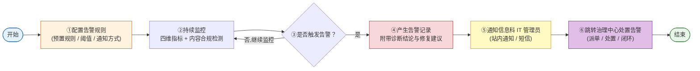

# 统一运行监控中心-需求说明文档

实时监控全院智能体的业务指标、性能、运行状态与资源成本，异常自动告警并通知 IT 管理员；趋势性优化建议归治理中心生成与承载，本模块不设建议入口。

监控数据由各业务模块在正常业务流程中自动写入（工作台写入调用次数与响应时长、接入中心写入对接状态、安全治理中心写入安全事件），本模块不提供用户侧的数据采集配置页面，采集策略由系统预置并随版本迭代调整。

<aside>
🔒

**访问范围**：本模块**仅面向医院信息科 IT 管理员**，不对科室管理员与普通用户开放。所有页面、功能、数据均以 IT 管理员视角呈现；侧边栏入口对非授权角色不可见，直接访问 URL 时返回无权限提示。

</aside>

### 核心业务流程

本模块面向**医院信息科 IT 管理员**(不开放给科室管理员与普通用户)。流程聚焦七环:**开始 → 配置告警 → 持续监控 → 产生告警 → 通知 IT 管理员 → 跳转治理中心处置 → 结束**。

**本模块责任边界止于告警规则配置与告警事件上报**;告警记录的查看与处置、派单与闭环,以及**趋势性优化建议的生成、采纳、忽略**统一在**治理中心模块**查看和处置,本模块不再展示告警记录页。




**流程说明**

| **阶段** | **路径** | **模块归属 / 关键节点** |
| --- | --- | --- |
| ① 配置告警 | IT 管理员预置/调整告警规则,或按需新建/编辑/删除自定义规则 → 系统保存生效 | **本模块**· 支持新建、编辑、删除自定义告警规则;阈值/启停/通知方式可调;管理入口位于 8-6 告警管理页 |
| ② 持续监控 | 各模块自动写入数据 → 引擎实时计算四维指标 + 内容合规检测 | **本模块**· 数据写入与计算全自动 |
| ③ 触发判定 | 指标超阈或命中规则 → 进入告警分支;未触发则回到持续监控 | **本模块**· 判定逻辑由预置规则驱动 |
| ④ 产生告警 | 触发告警事件 → 附带诊断结论与修复建议 → 上报治理中心 | **本模块**· 仅生成告警事件并向治理中心上报,**告警记录不在本模块留档**;上报负载含规则ID/级别/触发现场/关联智能体/诊断与修复建议 |
| ⑤ 通知 IT 管理员 | 按告警级别分发(站内通知 / 短信)→ 推送至 IT 管理员首页待办 | **本模块责任边界**· 仅通知信息科 IT 管理员,不下发到科室或终端用户 |
| ⑥ 治理中心查看与处置 | IT 管理员从首页待办或治理中心告警记录入口进入 → 派单 / 处置 / 闭环 | **治理中心模块**统一承载告警记录的查看与处置,本模块不展示告警记录页;闭环数据(处置人/时间/处置说明/是否采纳修复建议)在治理中心留档 |

### 设计要点

- **四维全覆盖** ：业务、性能、状态、成本一站监控全院智能体运行
- **采集零配置** ：各模块业务流程自动写入数据,IT 管理员无需操作
- **告警自定义灵活** ：支持新建、编辑、删除告警规则,阈值/启停/通知方式可灵活配置
- **告警自带诊断与修复建议** ： 缩短 IT 管理员排障路径(规则配置时可填写「可能原因 + 处置建议」,告警触发时自动附上)
- **职责边界清晰** ：本模块只做发现告警与通知,**优化建议与处置闭环统一归治理中心**(本模块不设建议入口)

### 导航结构

```
统一运行监控中心（一级菜单）
├── 监控总览（一屏看清全院智能体运行健康度）
├── 性能监控（智能体响应快不快、工具调用顺不顺）
├── 状态监控（哪些智能体在线、哪些异常需排查）
├── 业务监控（智能体回答合不合规、有没有过度承诺或语气不当）
├── 成本监控（智能体花了多少钱、花在哪里）
└── 告警管理（什么情况自动预警、通知谁、怎么通知）
```

### 功能说明

| **一级功能** | **二级功能** | **功能说明** |
| --- | --- | --- |
| 监控总览 | 四维指标大盘 | 以卡片 + 图表形式展示业务、性能、状态、成本四个维度的核心运行指标，支持按时间/科室/智能体筛选下钻 |
| 监控总览 | 实时告警横幅 | 页面顶部展示当前未处理告警数量与最高级别，点击跳转治理中心告警记录 |
| 性能监控 | 性能指标明细 | 展示各智能体的响应时长（P50/P95/P99）、吞吐量（QPS）、错误率，支持按时间范围筛选与趋势对比 |
| 状态监控 | 运行状态总览 | 展示全院智能体的在线/离线/异常状态列表，异常项高亮并关联最近告警记录；支持按科室、类型筛选 |
| 业务监控 | 业务指标分析 | 展示调用量趋势、用户满意度（好评率）、场景覆盖率、活跃用户数等业务指标，支持按科室与智能体下钻 |
| 成本监控 | 资源成本分析 | 展示各智能体的 API 调用费用、算力资源费用、总成本趋势，支持按科室汇总与环比分析 |
| 告警管理 | 告警规则配置 | 展示已配置的全部告警规则，支持新建、编辑、删除、启用/停用、复制；每条规则包含「告警基本信息 / 告警指标 / 告警规则配置 / 告警通知」四大核心配置块。入口位于侧边栏「统一运行监控中心 > 告警管理」，或监控总览页右上角告警横幅。**告警记录与处置统一在治理中心查看，本模块不展示告警记录页** |

### 核心页面清单

| **页面编号** | **页面名称** | **对应功能** | **页面类型** | **主要用途** | **使用角色** |
| --- | --- | --- | --- | --- | --- |
| 8-1 | 监控总览页 | 四维指标大盘 + 实时告警横幅 + 告警管理入口 | 数据可视化页 | 运行监控默认落地页，四维指标一览 + 告警快速感知 + 告警管理入口 | IT 管理员 |
| 8-2 | 性能监控页 | 性能指标明细 | 图表 + 列表页 | 查看各智能体响应时长、吞吐量、错误率的明细数据与趋势 | IT 管理员 |
| 8-3 | 状态监控页 | 运行状态总览 | 列表页 | 查看全院/本科室智能体在线、离线、异常状态，快速定位异常项 | IT 管理员 |
| 8-4 | 业务监控页 | 业务指标分析 | 图表 + 列表页 | 查看调用量、满意度、场景覆盖率等业务指标与趋势 | IT 管理员 |
| 8-5 | 成本监控页 | 资源成本分析 | 图表 + 列表页 | 查看各智能体与科室的资源成本明细与趋势 | IT 管理员 |
| 8-6 | 告警管理页 | 告警规则配置 | 列表 + 详情/编辑页 | 管理告警规则（新建/编辑/删除/启停/复制）；告警记录与处置由治理中心承载 | IT 管理员 |

### 数据采集策略说明

<aside>
📋

本模块不设置用户侧的数据采集配置页面。监控数据的采集完全由系统自动完成，以下为预置采集策略：

</aside>

| **数据类别** | **数据来源** | **采集方式** | **采集频率** | **保留策略** |
| --- | --- | --- | --- | --- |
| 性能数据 | 接入中心 API 网关 | 每次 API 调用自动记录响应时长、状态码、错误信息 | 实时（每次调用） | 原始数据 90 天，分钟级聚合 1 年 |
| 状态数据 | 接入中心心跳探测 | 系统定时对已接入智能体发送健康检查请求 | 每 60 秒 | 状态变更事件永久保留 |
| 业务数据 | 工作台对话模块 | 每次对话自动记录调用次数、用户反馈（👍👎）、对话时长 | 实时（每次对话） | 原始数据 90 天，日级聚合 1 年 |
| 成本数据 | 接入中心 API 网关 + 基础设施计量 | 按调用次数和资源使用量自动计费 | 实时（每次调用） | 日级聚合永久保留 |
| 安全事件 | 安全治理中心（模块 9） | 安全模块检测到风险事件时自动推送 | 事件驱动 | 随安全模块策略 |

### 明细表组件规范

<aside>
📋

本规范适用于本模块下所有二级页面（8-2 ~ 8-5）的明细表，目的是在保证多列指标完整展示的同时维持页面美观清晰。规范由前端组件统一实现，各页明细表只需声明列定义即可，不重复说明样式细节。

</aside>

| **项** | **规则** | **目的** |
| --- | --- | --- |
| 冻结列 | 前 2 列（智能体名称、归属科室）默认冻结，横向滚动时保持可见 | 10+ 列宽表横滑后仍能识别行归属 |
| 横向滚动 | 表格宽度超出容器时启用横向滚动条，不强制压缩列宽 | 避免单元格内容截断 |
| 列显隐 | 表头右侧提供「列设置」按钮，用户可自定义显示/隐藏列，选择保留在用户偏好中 | 不同角色按需聚焦，避免一刀切默认隐藏 |
| 表头吸顶 | 纵向滚动时表头固定吸顶 | 长列表场景下保持列名可见 |
| 对齐与排版 | 文本列左对齐、数值/百分比右对齐、状态标签居中；单行高度 40px；表格边缝内边距 12px | 数值列纵向扫读时小数点对齐，节奏统一 |
| 排序 | 支持排序的列表头显示双向箭头图标，当前排序列高亮箭头并显示升/降序状态 | 明确可交互列与当前排序状态 |
| 阈值高亮 | 仅对超过[医疗智能体监控指标体系V1.1](https://www.notion.so/V1-1-670e66730f8843f4b56bad59b20cee43?pvs=21)阈值的单元格上红色字/浅红底，不对整行染色 | 避免视觉过载，问题定位更精准 |
| 趋势缩略图列 | 所有明细表末列统一为「趋势」迷你折线图/柱状图，列宽固定 80px | 统一末列收口，视觉节奏一致 |
| 分页与加载 | 默认每页 20 行，支持跳页与每页行数切换（20/50/100）；超 100 行不一次加载 | 全院多智能体场景下避免首屏加载过重 |

### 图表区布局规范

<aside>
📐

本规范仅明确图表之间的排列原则，不规定卷卡片尺寸、间距、配色、字号等具体视觉 token——后者交由设计系统 / 组件库统一定义。

</aside>

| **项** | **规则** |
| --- | --- |
| 网格基准 | 24 栅格系统，与 KPI 卡片同源 |
| 默认排列 | Tab 内图表默认 **2 列网格**（8-2/8-3/8-4/8-5 统一）：4 图 = 2×2、6 图 = 3×2、7 图 = 3 行 + 1 图占整行 |
| 例外：占整行 | 仅当指标为 P0 核心 + 大数字 KPI 类时占整行，在该指标行的「图表类型」列中注明「占整行」即可，无需另立清单 |

### 8-1 监控总览页 — 字段与交互

### 页面概述

| 属性 | 说明 |
| --- | --- |
| 页面类型 | 数据可视化页 |
| 使用角色 | IT 管理员 |
| 入口 | 侧边栏「统一运行监控中心」默认落地页 |

### 页面布局（紧凑一屏版）

<aside>
📐

**一屏可见预算**（基准视口 1280 × 800，平台/浏览器头部预留 ~120px）：顶部信息条 48px + KPI 卡 88px + 图表区 ≥ 520px + 卡片间距 24px ≈ 680px，**1280 × 800 视口下无需滚动**即可看到全部核心信息（告警 + 筛选 + KPI + 6 个图表）。所有图表固定高度 240px，禁止动态拉伸。

</aside>

页面自上而下分为：① 顶部信息条（合并告警横幅 + 筛选栏，48px）→ ② KPI 卡片区（88px）→ ③ 图表区（3 列 × 2 行 = 6 图，单图 240px）。智能体健康排行降级为图表网格末位的紧凑列表，完整 Top 10 / Bottom 10 通过「查看详情」跳转独立页。

**① 顶部信息条（高度 48px，左右两段）**

左段：告警状态（仅在有未处理告警时展示，否则左段留空）

| **序号** | **元素** | **说明** | **交互** |
| --- | --- | --- | --- |
| 1 | 告警状态点 + 数量 | 圆点按最高级别着色（严重=红 / 警告=橙 / 提示=蓝）+ 「N 个未处理告警」+ 级别标签 | 点击跳转治理中心告警记录 |
| 2 | 最新告警摘要 | 「最新：智能体名 — 告警摘要」单行省略，悬浮气泡显示完整描述 | 点击查看告警详情 |
| 3 | 「查看详情」链接 | 文字链接，紧跟摘要右侧 | 点击跳转治理中心告警记录 |

右段：筛选与全局操作（紧凑控件单行排列，控件之间间隔 8px）

| **序号** | **元素** | **说明** | **交互** |
| --- | --- | --- | --- |
| 1 | 时间范围 | 下拉：今日 / 近 7 天 / 近 30 天 / 自定义，控件宽度 ~120px | 选择后全页数据刷新 |
| 2 | 科室筛选 | 下拉多选，宽度 ~140px；选项＝台账已登记科室，默认全部可选 | 按科室过滤 |
| 3 | 智能体筛选 | 下拉多选，宽度 ~160px；选项随科室联动，支持按名称搜索 | 按智能体过滤 |
| 4 | 刷新 | 仅图标按钮（无文字），32 × 32px | 点击重新拉取 |
| 5 | 告警管理 | 齿轮图标 + 「告警管理」文字，固定在最右侧 | 点击跳转至 8-6 告警管理页 |

顶部信息条说明：

- 整条固定高度 48px，左段最大占 60% 宽度、右段紧靠右对齐；左右段之间存在弹性间隔。
- 1280px 视口下完整一行可容；视口宽度 < 1024px 时筛选控件自动换行至第二行（仅在该断点下），但告警管理按钮仍固定在右上。
- 无未处理告警时左段不渲染，右段保持原位，整条仍按 48px 高度占位以避免页面跳动。

**② KPI 卡片区（一行 5 卡，等宽，高度 88px）**

<aside>
📐

**布局约束**：5 个统计卡片采用 **一行五列等宽** 布局，卡片内紧凑排版（标题 12px + 主指标 28px 加粗 + 环比 12px 同一行紧邻），**不含趋势缩略图与环形微图**（趋势统一放到下方图表区）。卡片最小宽度 180px，1280px 视口下单卡宽度 ≈ 220px；视口宽度 < 1024px 时降级为一行三卡 + 一行两卡。

</aside>

| **序号** | **卡片名称** | **数据说明** | **交互** |
| --- | --- | --- | --- |
| 1 | 今日调用量 | 筛选范围内总调用次数 + 环比（环比数字加箭头，无迷你图） | 点击跳转业务监控页 |
| 2 | 平均响应时长 | 筛选范围内平均响应时长（ms）+ 环比 | 点击跳转性能监控页 |
| 3 | 运行状态分布 | 纯文字「在线 N / 离线 N / 异常 N」三色点，**不使用环形微图** | 点击跳转状态监控页 |
| 4 | 本月成本 | 本月累计资源成本（元）+ 环比上月 | 点击跳转成本监控页 |
| 5 | 待查看优化建议 | 由治理中心生成、待处置的建议条数 + 环比；建议本身由治理中心承载 | 点击跳转治理中心 / 优化建议 |

**③ 图表区（3 列 × 2 行 = 6 图，单图固定 240px 高）**

<aside>
📐

**布局约束**：图表区采用 **3 列 × 2 行** 等宽栅格，单图固定高度 240px、内边距 12px。卡片标题与「查看详情」链接置于卡片顶部同一行（左标题、右链接）。视口宽度 < 1024px 时降级为 2 列 × 3 行；图表内容自适应卡片宽度但**不改变高度**，保证一屏 6 图始终可见。

</aside>

| **序号** | **位置** | **图表名称** | **图表类型** | **交互** |
| --- | --- | --- | --- | --- |
| 1 | 第 1 行 / 第 1 列 | 调用量趋势 | 折线图（按筛选时间粒度） | 悬浮详情，点击跳转业务监控 |
| 2 | 第 1 行 / 第 2 列 | 响应时长趋势 | 折线图（P50 / P95 双线） | 悬浮详情，点击跳转性能监控 |
| 3 | 第 1 行 / 第 3 列 | 错误率趋势 | 面积图 | 悬浮详情，点击跳转性能监控 |
| 4 | 第 2 行 / 第 1 列 | 成本趋势 | 柱状图（按日 / 周切换） | 悬浮详情，点击跳转成本监控 |
| 5 | 第 2 行 / 第 2 列 | 告警趋势 | 堆叠柱状图（按级别 P0/P1/P2） | 点击跳转治理中心告警记录 |
| 6 | 第 2 行 / 第 3 列 | 智能体健康排行（Top 7） | 紧凑列表，单行 28px：「排名 + 名称 + 健康度 + 状态」 | 点击行跳转对应智能体；点击卡片右上「查看详情」跳转 Top 10 / Bottom 10 独立页 |

**布局调整说明（与旧版差异）**

- **告警横幅 + 筛选栏合并** 为顶部信息条，从「48px + 独立筛选区」压缩为单行 48px，节省 ~56px 纵向空间。
- **KPI 卡片** 高度从「自适应（含环形微图）」改为固定 88px、纯数字版式，节省 ~40px 纵向空间。
- **图表区** 从「单列 6 行」改为「3 列 × 2 行」，单图高度从「自适应 ~320px」固定为 240px；6 图可一屏并列，无需向下滚动。
- **智能体健康排行** 从独立明细表降级为图表网格末位的紧凑列表（Top 7），完整 Top 10 / Bottom 10 通过「查看详情」跳转独立页查看；监控总览页一屏内不再承载长列表。

**Mock 数据样例（页面专属）**

统计卡片区接口返回示例：

```json
{
  "todayCalls": { "value": 12834, "wow": 0.082 },
  "avgResponseTime": { "value": 1820, "unit": "ms", "wow": -0.034 },
  "runStatus": { "online": 12, "offline": 1, "abnormal": 1 },
  "monthCost": { "value": 45620, "unit": "元", "wow": 0.06 },
  "pendingSuggestions": { "value": 3, "wow": -1 }
}
```

### 8-2 性能监控页 — 字段与交互

### 页面概述

| 属性 | 说明 |
| --- | --- |
| 页面类型 | 图表 + 列表页 |
| 使用角色 | IT 管理员 |
| 入口 | 侧边栏「统一运行监控中心 > 性能监控」/ 监控总览卡片点击 |
| 指标依据 | [医疗智能体监控指标体系V1.1](https://www.notion.so/V1-1-670e66730f8843f4b56bad59b20cee43?pvs=21) §二 性能监控（18 项指标，分 4 组） |

### 页面布局（紧凑一屏版）

<aside>
📐

**一屏可见预算**（基准视口 1280 × 800，平台/浏览器头部预留 ~120px）：顶部信息条 48px + KPI 卡 88px + Tab 栏 36px + 图表区 460px + 卡片间距 24px ≈ 656px，**1280 × 800 视口下当前 Tab 的「筛选 + KPI + 图表」无需滚动**即可完整可见。所有图表固定高度 220px，禁止动态拉伸；**智能体性能明细表降级为右下角悬浮按钮「📊 查看明细」唤起的右侧抽屉**，不再占用首屏纵向空间。

</aside>

页面自上而下分为：① 顶部信息条（合并筛选栏，48px）→ ② 关键 KPI 卡片区（88px）→ ③ Tab 栏（36px，响应时延 / 并发吞吐 / 准确率与稳定性 / 智能体行为，4 个 Tab 不变）→ ④ 当前 Tab 图表区（4 项指标用 2×2 网格、6 项指标用 3×2 网格，单图固定 220px）。智能体性能明细表通过右下角悬浮按钮唤起 800px 宽的右侧抽屉，含「明细高级筛选（默认折叠）+ 多列指标表」。

**① 顶部信息条（高度 48px，左右两段）**

左段：页面标题区（标题「性能监控」+ 副标题「智能体响应快不快、工具调用顺不顺」单行排列，标题 16px 加粗、副标题 12px 灰字，标题副标题之间间隔 12px）。

右段：全局筛选与刷新（紧凑控件单行排列，控件之间间隔 8px）

| **序号** | **元素** | **说明** | **交互** |
| --- | --- | --- | --- |
| 1 | 时间范围 | 下拉：今日 / 近 7 天 / 近 30 天 / 自定义，控件宽度 ~120px | 选择后全页数据刷新 |
| 2 | 科室筛选 | 下拉多选，宽度 ~140px；选项＝台账已登记科室 | 按科室过滤 |
| 3 | 智能体筛选 | 下拉多选，宽度 ~160px；随科室联动，支持名称搜索 | 按智能体过滤 |
| 4 | 刷新 | 仅图标按钮（无文字），32 × 32px | 点击重新拉取 |

顶部信息条说明：整条固定高度 48px；视口宽度 < 1024px 时筛选控件自动换行至第二行，标题副标题始终保留在左上。

**② 关键 KPI 卡片区（一行 4 卡，等宽，高度 88px）**

<aside>
📐

**布局约束**：4 个 KPI 卡片采用 **一行四列等宽** 布局，卡片内紧凑排版（标题 12px + 主指标 28px 加粗 + 阈值/环比 12px 同一行紧邻），**不含趋势缩略图**（趋势统一放到下方对应 Tab 的图表区）。1280px 视口下单卡宽度 ≈ 290px；视口宽度 < 1024px 时降级为一行两卡。

</aside>

| **序号** | **卡片名称** | **说明 / 阈值** |
| --- | --- | --- |
| 1 | 平均响应时延 | 筛选范围内全部智能体平均响应时长（含环比）；阈值 ≤ 2000 ms |
| 2 | P95 响应时延 | 95 分位响应时长；阈值 ≤ 5000 ms |
| 3 | 回答准确率 | 基于评测样本与抽检反馈；阈值 ≥ 95%（P0 核心） |
| 4 | 服务可用率（SLA） | 统计周期内正常可用时长占比；阈值 ≥ 99.9% |

**Tab 1：响应时延类（4 项指标）**

| **序号** | **指标名称** | **图表类型** | **说明 / 阈值** |
| --- | --- | --- | --- |
| 1 | 平均响应时延 | 折线图（5min/1h 粒度） | ≤ 2000 ms；红色阈值线，超阈区段填充浅红 |
| 2 | P95 响应时延 | 多线折线图（与 P50 / P99 同图三线，蓝/橙/红色区分） | ≤ 5000 ms；红色虚线阈值 |
| 3 | P99 响应时延 | 与 P95 同图叠加（见上行） | ≤ 8000 ms；红色虚线阈值 |
| 4 | 首 Token 时延（TTFT） | 左右双视图：均值折线 + 耗时分布直方图 | ≤ 800 ms；红色阈值线；仅流式输出场景展示 |

**Tab 2：并发与吞吐类（4 项指标）**

| **序号** | **指标名称** | **图表类型** | **说明 / 阈值** |
| --- | --- | --- | --- |
| 1 | 峰值并发数（QPS） | 面积折线图 | 设计容量 80% 橙色虚线参考，超容量预警 |
| 2 | 平均吞吐量（req/s） | 折线图（叠加 7 日同环比浅色对比） | 按业务约定阈值 |
| 3 | 排队等待时长 | 折线图（均值 + P95 双线） | 500ms 红色阈值线 |
| 4 | 请求拒绝率 | 柱状图按 5min 粒度 | 超 0.5% 柱体红色高亮 |

**Tab 3：准确率与稳定性类（4 项指标）**

| **序号** | **指标名称** | **图表类型** | **说明 / 阈值** |
| --- | --- | --- | --- |
| 1 | 回答准确率 | 大数字 KPI + 折线趋势 | 95% 下限红线（P0 核心） |
| 2 | 幻觉率 | 折线图 | 2% 红线，超阈区段填充浅红 |
| 3 | 错误率 | 折线图 + 按错误码堆叠柱状图（下钻） | 0.5% 红线 |
| 4 | 服务可用率（SLA） | 仪表盘环形图 + 迷你折线 | 99.9% 目标，红/黄/绿三档 |

**Tab 4：智能体行为类（6 项指标，5.29 演示重点补充）**

<aside>
🤖

本 Tab 承载吴老师 5.29 演示中明确要求的「智能体侧运行行为监控」，覆盖工具调用循环、调用失败、推理步数等智能体特有异常模式，区别于传统应用监控。

</aside>

| **序号** | **指标名称** | **图表类型** | **说明 / 阈值** |
| --- | --- | --- | --- |
| 1 | 平均工具调用次数 | 箱线图（每个智能体一列）+ 整体均值横线 | 按业务约定 |
| 2 | 工具调用循环深度 | 直方图（x=循环层数 y=会话数） | >5 层柱体红色高亮 |
| 3 | 循环超限率 | 折线图 + 下钻到会话清单 | 1% 红线 |
| 4 | 工具调用失败率 | 堆叠柱状图（按工具拆分）+ 总失败率折线（双轴） | 2% 红线 |
| 5 | 工具调用 P95 耗时 | 横向条形图（按耗时降序） | 超阈工具红色高亮 |
| 6 | 推理步数超限率 | 折线图 + 推理步数分布直方图 | 2% 红线 |

**③ Tab 栏 + ④ 当前 Tab 图表区（布局约束）**

<aside>
📐

**Tab 栏**：高度 36px，4 个 Tab 平铺左对齐（响应时延 / 并发与吞吐 / 准确率与稳定性 / 智能体行为），选中态下划线 2px 主题色，文字 14px。**图表区**：紧贴 Tab 栏下方，4 项指标 Tab 用 **2×2** 等宽网格，6 项指标 Tab（智能体行为）用 **3×2** 等宽网格；单图固定高度 220px，内边距 12px，卡片标题与「查看详情」链接置于卡片顶部同一行。视口宽度 < 1024px 时降级：2×2 → 1×4 横向滚动 / 3×2 → 2×3。Tab 切换仅替换图表区内容，顶部信息条与 KPI 卡片保持不变。

</aside>

下方各 Tab 的指标定义（图表类型 / 阈值）保持不变，仅在前端实现时把图表卡片统一约束为 220px 固定高度。

**⑤ 智能体性能明细表（抽屉式，不占首屏）**

<aside>
📋

明细表通过页面右下角悬浮按钮「📊 查看明细」（56 × 56px 圆形按钮，固定在视口右下，主题色填充）唤起 **800px 宽右侧抽屉**。抽屉自上而下 = 抽屉头部（标题「智能体性能明细」+ 关闭按钮）+ 明细高级筛选（默认折叠，含「展开筛选 ▾ / 收起 ▴」切换）+ 明细表。抽屉内的明细表延续模块通用「明细表组件规范」（前 2 列冻结、表头吸顶、阈值高亮、末列趋势缩略图、20 行/页）。

</aside>

**明细高级筛选（默认折叠，展开后栅格排列）**

| 7 | 回答准确率 | 百分比范围 |
| --- | --- | --- |
| 6 | 错误率 | 百分比范围 |
| 5 | 调用总量 | 数字范围 |
| 3 | 平均响应时延 (ms) | 数字范围（>= / <= / 区间） |
| 4 | P95 响应时延 (ms) | 数字范围 |
| 2 | 归属科室 | 下拉多选，选项＝台账已登记科室 |
| 1 | 智能体名称 | 文本输入，支持名称模糊匹配 |
| **序号** | **字段** | **类型 / 说明** |
| 8 | 工具调用失败率 | 百分比范围 |
| 9 | 循环超限率 | 百分比范围 |
| 10 | 操作 | 「重置」次按钮 + 「查询」主按钮 + 「收起 ▴ / 展开 ▾」切换 |

**抽屉内明细表列定义**

| **序号** | **列名** | **类型** | **说明** | **交互** |
| --- | --- | --- | --- | --- |
| 1 | 智能体名称 | 文本链接 | 智能体名称 | 点击查看该智能体性能详情 |
| 2 | 归属科室 | 文本 | 所属科室 | — |
| 3 | 平均响应时延 | 数字（ms） | 筛选范围内平均响应时长 | 支持排序 |
| 4 | P95 响应时延 | 数字（ms） | 95 分位响应时长，超 5000ms 红色高亮 | 支持排序 |
| 5 | 调用总量 | 数字 | 筛选范围内总调用次数 | 支持排序 |
| 6 | 错误率 | 百分比 | 调用失败率，超 0.5% 红色高亮 | 支持排序 |
| 7 | 回答准确率 | 百分比 | 基于评测样本，低于 95% 红色高亮 | 支持排序 |
| 8 | 工具调用失败率 | 百分比 | 工具/外部 API 失败占比，超 2% 红色高亮 | 支持排序 |
| 9 | 循环超限率 | 百分比 | 循环深度或推理步数超阈值会话占比，超 1% 红色高亮 | 支持排序 |
| 10 | 趋势 | 迷你折线图 | 近 7 天 P95 响应时延趋势缩略图 | — |

**布局调整说明（与旧版差异）**

- **筛选栏** 从「独立横栏」改为顶部信息条左右分段，整条固定 48px，节省 ~40px 纵向空间。
- **关键 KPI 卡片** 高度从「自适应（含阈值/环比/迷你图）」改为固定 88px、纯数字 + 阈值/环比，节省 ~30px 纵向空间。
- **图表区** 单图高度从「自适应 ~440px」固定为 220px；4 项指标 Tab（响应时延 / 并发吞吐 / 准确率与稳定性）采用 2×2 网格，6 项指标 Tab（智能体行为）采用 3×2 网格；当前 Tab 全部图表在 1280 × 800 视口下一屏并列可见，无需滚动。
- **智能体性能明细表** 从「页面底部独立长表」改为「右下角悬浮按钮唤起的右侧抽屉（800px 宽）」，明细高级筛选默认折叠在抽屉内；首屏内不再承载长表与多字段筛选。

**Mock 数据样例（页面专属）**

性能时序点接口返回示例（折线图原始数据）：

```json
[
  { "ts": "2026-05-31T10:00:00+08:00", "avg": 1750, "p50": 1500, "p95": 4200, "p99": 6800 },
  { "ts": "2026-05-31T10:05:00+08:00", "avg": 1820, "p50": 1550, "p95": 4450, "p99": 7100 },
  { "ts": "2026-05-31T10:10:00+08:00", "avg": 1980, "p50": 1700, "p95": 5210, "p99": 7900 }
]
```

### 8-3 状态监控页 — 字段与交互

### 页面概述

| 属性 | 说明 |
| --- | --- |
| 页面类型 | 列表 + 图表页 |
| 使用角色 | IT 管理员 |
| 入口 | 侧边栏「统一运行监控中心 > 状态监控」/ 监控总览卡片点击 |
| 指标依据 | [医疗智能体监控指标体系V1.1](https://www.notion.so/V1-1-670e66730f8843f4b56bad59b20cee43?pvs=21) §三 状态监控（10 项指标，分 3 组） |

### 页面布局（紧凑一屏版）

<aside>
📐

**一屏可见预算**（基准视口 1280 × 800，平台/浏览器头部预留 ~120px）：顶部信息条 48px + KPI 卡 88px + Tab 栏 36px + 当前 Tab 内容区 460px + 卡片间距 24px ≈ 656px，**1280 × 800 视口下当前 Tab 的「筛选 + KPI + 列表/图表」无需滚动**即可完整可见。列表行高固定 40px、图表固定高度 220px，禁止动态拉伸；**列表高级筛选默认折叠**（列表上方「展开筛选 ▾」切换）；**异常事件与依赖服务降级为右下角悬浮按钮「📡 异常与依赖」唤起的右侧抽屉**，不再占用首屏纵向空间。

</aside>

页面自上而下分为：① 顶部信息条（合并筛选栏，48px）→ ② 关键 KPI 卡片区（88px）→ ③ Tab 栏（36px，2 个 Tab：状态总览 / 资源健康检查）→ ④ 当前 Tab 内容区（460px）。异常事件与依赖服务通过右下角悬浮按钮唤起 800px 宽的右侧抽屉。

**① 顶部信息条（高度 48px，左右两段）**

左段：页面标题区（标题「状态监控」+ 副标题「哪些智能体在线、哪些异常需排查」单行排列，标题 16px 加粗、副标题 12px 灰字）。

右段：全局筛选与刷新（紧凑控件单行排列，控件之间间隔 8px）

| **序号** | **元素** | **说明** | **交互** |
| --- | --- | --- | --- |
| 1 | 时间范围 | 下拉：今日 / 近 7 天 / 近 30 天 / 自定义，控件宽度 ~120px | 选择后全页数据刷新 |
| 2 | 科室筛选 | 下拉多选，宽度 ~140px；选项＝台账已登记科室 | 按科室过滤 |
| 3 | 智能体筛选 | 下拉多选，宽度 ~160px；随科室联动，支持名称搜索 | 按智能体过滤 |
| 4 | 状态筛选 | 下拉多选，宽度 ~120px；选项：运行中 / 暂停 / 异常 / 离线 | 过滤列表运行状态 |
| 5 | 刷新 | 仅图标按钮（无文字），32 × 32px | 点击重新拉取 |

顶部信息条说明：整条固定高度 48px；视口宽度 < 1024px 时筛选控件自动换行至第二行，标题副标题始终保留在左上。

**② 关键 KPI 卡片区（一行 4 卡，等宽，高度 88px）**

<aside>
📐

**布局约束**：4 个 KPI 卡片采用 **一行四列等宽** 布局，卡片内紧凑排版（标题 12px + 主指标 28px 加粗 + 阈值/补充信息 12px 同一行紧邻），**不含趋势缩略图**。1280px 视口下单卡宽度 ≈ 290px；视口宽度 < 1024px 时降级为一行两卡。原 PRD 中「实例在线率 / 版本一致性 / 暂停实例数」不再占用 KPI 位，可在运行状态列表列中查看。

</aside>

| **序号** | **卡片名称** | **数据说明** | **交互** |
| --- | --- | --- | --- |
| 1 | 运行中实例数 | 筛选范围内运行中的智能体实例总数（绿色大数字，下方「个智能体」补充信息） | 点击跳转 Tab1 列表并预设状态筛选 = 运行中 |
| 2 | 异常实例数 | 筛选范围内异常状态实例总数（红色大数字） | 点击跳转 Tab1 列表并预设状态筛选 = 异常 |
| 3 | 离线实例数 | 筛选范围内离线状态实例总数（灰色大数字） | 点击跳转 Tab1 列表并预设状态筛选 = 离线 |
| 4 | 心跳成功率 | 全平台心跳请求成功率（蓝色百分比）；阈值 ≥ 99.95%，跌破红字 | 点击跳转 Tab2 资源健康检查 |

**③ Tab 栏 + ④ 当前 Tab 内容区（布局约束）**

<aside>
📐

**Tab 栏**：高度 36px，2 个 Tab 平铺左对齐（状态总览 / 资源健康检查），选中态下划线 2px 主题色，文字 14px。**Tab 内容区**：紧贴 Tab 栏下方，高度 460px（顶部信息条 + KPI + Tab 栏 后的剩余一屏预算）。Tab 切换仅替换内容区，顶部信息条与 KPI 卡片保持不变。

</aside>

**Tab 1：状态总览（默认 Tab）**

内容：智能体运行状态列表占满整个 Tab 内容区，上方嵌入「高级筛选」（默认折叠，展开后栅格排列）。

**智能体运行状态列表嵌入高级筛选（默认折叠）**

| **序号** | **字段** | **类型 / 说明** |
| --- | --- | --- |
| 1 | 智能体名称 | 文本输入，支持名称模糊匹配 |
| 2 | 归属科室 | 下拉多选，选项＝台账已登记科室 |
| 3 | 运行状态 | 下拉多选：运行中 / 暂停 / 异常 / 离线 |
| 4 | 心跳成功率 | 百分比范围（>= / <= / 区间） |
| 5 | 最后心跳时间 | 日期时间范围 |
| 6 | 持续时长 | 数字范围（分钟） |
| 7 | 关联告警 | 下拉：有/无关联告警 |
| 8 | 操作 | 「重置」次按钮 + 「查询」主按钮 + 「收起 ▴ / 展开 ▾」切换 |

**智能体运行状态列表列定义**

| **序号** | **列名** | **类型** | **说明** | **交互** |
| --- | --- | --- | --- | --- |
| 1 | 智能体名称 | 文本链接 | 智能体名称 | 点击查看实例详情 |
| 2 | 归属科室 | 文本 | 所属科室 | — |
| 3 | 运行状态 | 状态标签 | 运行中（绿）/ 暂停（黄）/ 异常（红）/ 离线（灰） | — |
| 4 | 实例数（在线/应在线） | 文本 | 如「3 / 3」，不足时红色高亮 | — |
| 5 | 心跳成功率 | 百分比 | 跌破 99.95% 红色高亮 | 支持排序 |
| 6 | 最近心跳时间 | 日期时间 | 最后一次心跳成功上报时间 | — |
| 7 | 运行版本 / 台账版本 | 文本 | 实际运行版本与台账登记版本对照，不一致行红色高亮并出现 ❌ 图标 | — |
| 8 | 持续时长 | 文本 | 当前状态持续时长（如「异常 2h15m」） | — |
| 9 | 关联告警 | 文本链接 | 最近一条关联告警的简要描述（无则显示「—」） | 点击跳转告警详情 |
| 10 | 操作 | 按钮 | 手动重试健康检查 / 同步台账版本 | 点击触发健康检查或版本同步，结果实时更新 |

列表布局约束：表头 40px + 默认 ≥8 行 × 40px + 底部分页 32px，总高 ~412px；超出列表区宽度启用横向滚动，前 2 列（智能体名称 / 归幾科室）默认冻结；高级筛选展开后占 ~120px，此时列表高度自动压缩至 ~340px。

**Tab 2：资源健康检查**

内容：4 项资源指标用 **2×2 等宽网格**（CPU 使用率 / 内存使用率 / GPU 显存使用率 / 磁盘使用率），单图固定高度 220px，内边距 12px，卡片标题与「查看详情」链接置于卡片顶部同一行。视口宽度 < 1024px 时降级为 1×4 横向滚动。

| **序号** | **位置** | **图表名称** | **图表类型** | **说明 / 阈值** |
| --- | --- | --- | --- | --- |
| 1 | 第 1 行 / 第 1 列 | CPU 使用率 | 多线折线图（每实例一线） | 80% 红色阈值线，超阈红字 |
| 2 | 第 1 行 / 第 2 列 | 内存使用率 | 多线折线图，与 CPU 联动展示 | 80% 红色阈值线 |
| 3 | 第 2 行 / 第 1 列 | GPU 显存使用率 | 多线折线图 + OOM 事件红色标点叠加 | 85% 红色阈值线 |
| 4 | 第 2 行 / 第 2 列 | 磁盘使用率 | 横向条形图（按使用率降序） | <60% 绿 / 60–80% 黄 / >80% 红 |

**⑤ 异常事件与依赖服务（抽屉式，不占首屏）**

<aside>
📡

右下角悬浮按钮「📡 异常与依赖」（56 × 56px 圆形按钮，固定在视口右下，主题色填充）唤起 **800px 宽右侧抽屉**。抽屉内自上而下：异常事件次数（堆叠柱状图按 P0/P1/P2 三色堆叠 + 事件流时间线，点击跳转治理中心告警记录）+ 依赖服务可用率（热力图 y=依赖项（含底座模型、知识库、工具 API）x=时间 5min 粒度，阈值 ≥ 99.9%，颜色 红→绿 表示可用率）。

</aside>

**布局调整说明（与旧版差异）**

- **筛选栏** 从「独立横栏」改为顶部信息条右段，整条固定 48px；节省 ~40px 纵向空间。
- **状态概要 / 实例在线率 / 版本一致性 / 暂停实例数** 原本 7 项 KPI 压缩为 4 卡（运行中 / 异常 / 离线 / 心跳成功率）高度固定 88px；实例在线率 / 版本一致性 / 暂停实例下沉至列表列查看。
- **页面重构为 2 个 Tab**（状态总览 / 资源健康检查）；Tab 1 以智能体运行状态列表为主，高级筛选默认折叠；Tab 2 以 4 项资源图表 2×2 网格展示。
- **异常事件与依赖服务** 从页面底部独立图表区降级为右下角悬浮按钮唤起的右侧抽屉，首屏不再承载。

**Mock 数据样例（页面专属）**

智能体运行状态列表行接口返回示例：

```json
{
  "agentId": "agent-001",
  "name": "导诊智能体",
  "department": "门诊部",
  "status": "abnormal",
  "instances": { "online": 2, "expected": 3 },
  "heartbeatSuccessRate": 0.9982,
  "lastHeartbeatAt": "2026-05-31T12:32:10+08:00",
  "runVersion": "v1.2.3",
  "registryVersion": "v1.2.4",
  "statusDurationMinutes": 135,
  "relatedAlert": { "eventId": "evt-20260531-00123", "summary": "P95 响应时延 6.2s" }
}
```

### 8-4 业务监控页 — 字段与交互

### 页面概述

| 属性 | 说明 |
| --- | --- |
| 页面类型 | 图表 + 列表页 |
| 使用角色 | IT 管理员 |
| 入口 | 侧边栏「统一运行监控中心 > 业务监控」/ 监控总览卡片点击 |
| 指标依据 | [医疗智能体监控指标体系V1.1](https://www.notion.so/V1-1-670e66730f8843f4b56bad59b20cee43?pvs=21) §四 业务监控（15 项指标，分 3 组） |

### 页面布局（紧凑一屏版）

<aside>
📐

**一屏可见预算**（基准视口 1280 × 800，平台/浏览器头部预留 ~120px）：顶部信息条 48px + KPI 卡 88px + Tab 栏 36px + 当前 Tab 图表区 460px + 卡片间距 24px ≈ 656px，**1280 × 800 视口下当前 Tab 的「筛选 + KPI + 图表」无需滚动**即可完整可见。所有图表固定高度 220px，禁止动态拉伸；**业务指标明细表降级为右下角悬浮按钮「📊 查看明细」唤起的右侧抽屉**，不再占用首屏纵向空间。

</aside>

页面自上而下分为：① 顶部信息条（合并筛选栏，48px）→ ② 关键 KPI 卡片区（88px）→ ③ Tab 栏（36px，3 个 Tab：调用与任务 / 内容输出质量 / 用户反馈与协同）→ ④ 当前 Tab 图表区（460px，6 项指标用 3×2 网格、5 项指标用 3×2 网格末位跨列大 KPI、4 项指标用 2×2 网格，单图固定 220px）。业务指标明细表通过右下角悬浮按钮唤起 800px 宽的右侧抽屉。

**① 顶部信息条（高度 48px，左右两段）**

左段：页面标题区（标题「业务监控」+ 副标题「智能体回答合不合规、有没有过度承诺或语气不当」单行排列，标题 16px 加粗、副标题 12px 灰字）。

右段：全局筛选与刷新（紧凑控件单行排列，控件之间间隔 8px）

| **序号** | **元素** | **说明** | **交互** |
| --- | --- | --- | --- |
| 1 | 时间范围 | 下拉：今日 / 近 7 天 / 近 30 天 / 自定义，控件宽度 ~120px | 选择后全页数据刷新 |
| 2 | 科室筛选 | 下拉多选，宽度 ~140px；选项＝台账已登记科室 | 按科室过滤 |
| 3 | 智能体筛选 | 下拉多选，宽度 ~160px；随科室联动，支持名称搜索 | 按智能体过滤 |
| 4 | 刷新 | 仅图标按钮（无文字），32 × 32px | 点击重新拉取 |

顶部信息条说明：整条固定高度 48px；视口宽度 < 1024px 时筛选控件自动换行至第二行，标题副标题始终保留在左上。

**② 关键 KPI 卡片区（一行 4 卡，等宽，高度 88px）**

<aside>
📐

**布局约束**：4 个 KPI 卡片采用 **一行四列等宽** 布局，卡片内紧凑排版（标题 12px + 主指标 28px 加粗 + 阈值/环比 12px 同一行紧邻），**不含趋势缩略图**（趋势统一放到下方对应 Tab 的图表区）。1280px 视口下单卡宽度 ≈ 290px；视口宽度 < 1024px 时降级为一行两卡。

</aside>

| **序号** | **卡片名称** | **说明 / 阈值** | **交互** |
| --- | --- | --- | --- |
| 1 | 业务调用总量 | 筛选范围内调用总次数（含环比） | 点击跳转 Tab1 调用与任务 |
| 2 | 活跃用户数 | 当日 / 当月去重用户数（双值并列） | 点击跳转 Tab1 活跃用户图表 |
| 3 | 任务完成率 | 阈值 ≥ 95%，跌破红字 | 点击跳转 Tab1 任务完成率图表 |
| 4 | 不合规回答率 | 阈值 ≤ 0.5%（P0 核心指标） | 点击跳转 Tab2 内容输出质量 |

**③ Tab 栏 + ④ 当前 Tab 图表区（布局约束）**

<aside>
📐

**Tab 栏**：高度 36px，3 个 Tab 平铺左对齐（调用与任务 / 内容输出质量 / 用户反馈与协同），选中态下划线 2px 主题色，文字 14px。**图表区**：紧贴 Tab 栏下方，6 项指标 Tab 用 **3×2** 等宽网格，5 项指标 Tab 用 **3×2** 网格 + 末位大 KPI 跨 2 列，4 项指标 Tab 用 **2×2** 等宽网格；单图固定高度 220px，内边距 12px，卡片标题与「查看详情」链接置于卡片顶部同一行。视口宽度 < 1024px 时降级：3×2 → 2×3、2×2 → 1×4 横向滚动。Tab 切换仅替换图表区内容，顶部信息条与 KPI 卡片保持不变。

</aside>

**Tab 1：调用与任务完成类（6 项指标，3×2 网格）**

| **序号** | **位置** | **指标名称** | **图表类型** | **说明 / 阈值** |
| --- | --- | --- | --- | --- |
| 1 | 第 1 行 / 第 1 列 | 业务调用总量 | 柱状图按日（双轴叠加累计折线） | 可切换日/周/月粒度 |
| 2 | 第 1 行 / 第 2 列 | 活跃用户数（DAU / MAU） | 双线折线图 + 大数字 KPI 当前值 | 按业务约定 |
| 3 | 第 1 行 / 第 3 列 | 科室覆盖数 | 横向条形图（TOP 10 高亮，可叠加院区分组） | 按推广目标 |
| 4 | 第 2 行 / 第 1 列 | 任务完成率 | 环形进度图 + 折线趋势 | 95% 下限红线 |
| 5 | 第 2 行 / 第 2 列 | 任务中断率 | 折线图 + 按中断原因堆叠柱状图 | 5% 红线（原因：异常 / 用户放弃 / 超时） |
| 6 | 第 2 行 / 第 3 列 | 平均会话轮次 | 直方图（x=轮次 y=会话数）+ 均值标线 | 超长会话（>20 轮）红色高亮 |

**Tab 2：内容输出质量类（5 项指标，3×2 网格 + 末位「高风险拦截数」大 KPI 跨列，5.29 演示重点）**

<aside>
🛡️

本 Tab 承载吴老师 5.29 演示中明确要求的「自动内容检测」主路径（过度承诺 / 语气 / 用词等），与统一安全治理中心的实时阻断能力联动；用户主动反馈类指标因可得性低已降级为 Tab 3 辅助参考。

</aside>

| **序号** | **位置** | **指标名称** | **图表类型** | **说明 / 阈值** |
| --- | --- | --- | --- | --- |
| 1 | 第 1 行 / 第 1 列 | 不合规回答率 | 折线图（下钻列表通过卡片右上「查看详情」打开） | 0.5% 红线（P0 核心） |
| 2 | 第 1 行 / 第 2 列 | 过度承诺 / 绝对化表述率 | 折线图（命中样本 TOP 10 列表通过详情打开） | 0.5% 红线；高频词：一定 / 绝对 / 根治 / 100% |
| 3 | 第 1 行 / 第 3 列 | 不当语气 / 态度异常率 | 折线图 + 分类细分饼图 | 1% 红线；分类：冷漠 / 强硬 / 不耐烦 / 其它 |
| 4 | 第 2 行 / 第 1 列 | 用词不当率 | 折线图（命中样本 TOP 10 列表通过详情打开） | 1% 红线（按命中频次降序） |
| 5 | 第 2 行 / 第 2-3 列（跨 2 列） | 高风险输出拦截数 | 大数字 KPI（当日 / 累计）+ 日历热力图 | 与安全治理中心联动，记录并复盘 |

**Tab 3：用户反馈与协同类（4 项指标，2×2 网格，含辅助指标）**

<aside>
⚠️

吴老师 5.29 演示明确质疑用户主动反馈的可获得性（原话：「用户反馈，你怎么拿得到呢？」）。「满意度评分」「正向反馈率」已降级为**辅助参考**，仅在反馈数据可得时展示；内容质量主路径请使用 Tab 2 的自动检测指标。

</aside>

| **序号** | **位置** | **指标名称** | **图表类型** | **说明 / 阈值** |
| --- | --- | --- | --- | --- |
| 1 | 第 1 行 / 第 1 列 | 满意度评分（辅助） | 5 星可视化 + 折线趋势 | 4.2 下限红线，数据缺失时显示「数据不足」 |
| 2 | 第 1 行 / 第 2 列 | 正向反馈率（辅助） | 环形图 + 折线趋势 + 总反馈量小字 | 90% 下限红线 |
| 3 | 第 2 行 / 第 1 列 | 投诉与工单数 | 堆叠柱状图按状态分层 | 新建 / 处理中 / 已闭环（红 / 黄 / 绿） |
| 4 | 第 2 行 / 第 2 列 | 协同任务成功率 | 折线图 + 编排节点失败率横向条形图 | 95% 红线；TOP 失败节点红色高亮 |

**⑤ 业务指标明细表（抽屉式，不占首屏）**

<aside>
📋

明细表通过页面右下角悬浮按钮「📊 查看明细」（56 × 56px 圆形按钮，固定在视口右下，主题色填充）唤起 **800px 宽右侧抽屉**。抽屉自上而下 = 抽屉头部（标题「业务指标明细」+ 关闭按钮）+ 明细高级筛选（默认折叠，含「展开筛选 ▾ / 收起 ▴」切换）+ 明细表。抽屉内的明细表延续模块通用「明细表组件规范」（前 2 列冻结、表头吸顶、阈值高亮、末列趋势缩略图、20 行/页）。

</aside>

**明细高级筛选（默认折叠，展开后栅格排列）**

| **序号** | **字段** | **类型 / 说明** |
| --- | --- | --- |
| 1 | 智能体名称 | 文本输入，支持名称模糊匹配 |
| 2 | 归属科室 | 下拉多选，选项＝台账已登记科室 |
| 3 | 调用总量 | 数字范围（>= / <= / 区间） |
| 4 | 活跃用户数 | 数字范围 |
| 5 | 任务完成率 | 百分比范围 |
| 6 | 不合规回答率 | 百分比范围 |
| 7 | 过度承诺率 | 百分比范围 |
| 8 | 高风险拦截数 | 数字范围 |
| 9 | 投诉工单数 | 数字范围 |
| 10 | 趋势 | 下拉：上升 / 下降 / 平稳 |
| 11 | 操作 | 「重置」次按钮 + 「查询」主按钮 + 「收起 ▴ / 展开 ▾」切换 |

**抽屉内明细表列定义**

| **序号** | **列名** | **类型** | **说明** | **交互** |
| --- | --- | --- | --- | --- |
| 1 | 智能体名称 | 文本链接 | 智能体名称 | 点击查看详情 |
| 2 | 归属科室 | 文本 | 所属科室 | — |
| 3 | 调用总量 | 数字 | 筛选范围内总调用次数 | 支持排序 |
| 4 | 活跃用户数 | 数字 | 独立用户数 | 支持排序 |
| 5 | 任务完成率 | 百分比 | 低于 95% 红色高亮 | 支持排序 |
| 6 | 不合规回答率 | 百分比 | 超 0.5% 红色高亮 | 支持排序 |
| 7 | 过度承诺率 | 百分比 | 超 0.5% 红色高亮 | 支持排序 |
| 8 | 高风险拦截数 | 数字 | 筛选范围内被实时阻断的输出条数 | 支持排序 |
| 9 | 投诉工单数 | 数字 | 关联工单总数 | 支持排序 |
| 10 | 趋势 | 迷你折线图 | 近 7 天调用量趋势缩略图 | — |

**布局调整说明（与旧版差异）**

- **筛选栏** 从「同监控总览」改为顶部信息条左右分段，整条固定 48px，节省 ~40px 纵向空间。
- **关键 KPI 卡片** 高度从「自适应」改为固定 88px、纯数字 + 阈值/环比，节省 ~30px 纵向空间。
- **图表区** 单图高度从「自适应 ~440px」固定为 220px；6 项指标 Tab 采用 3×2 网格，4 项指标 Tab 采用 2×2 网格，5 项指标 Tab 用 3×2 网格 + 末位大 KPI 跨 2 列；当前 Tab 全部图表在 1280 × 800 视口下一屏并列可见，无需滚动。
- **业务指标明细表** 从「页面底部独立长表」改为「右下角悬浮按钮唤起的右侧抽屉（800px 宽）」，明细高级筛选默认折叠在抽屉内；首屏内不再承载长表与多字段筛选。

**Mock 数据样例（页面专属）**

业务明细行接口返回示例：

```json
{
  "agentId": "agent-001",
  "name": "心电图智能辅助诊断系统",
  "department": "心内科",
  "calls": 15680,
  "activeUsers": 856,
  "taskCompletionRate": 0.985,
  "noncomplianceRate": 0.0012,
  "overpromiseRate": 0.0005,
  "blockedCount": 12,
  "complaintTickets": 1
}
```

### 8-5 成本监控页 — 字段与交互

### 页面概述

| 属性 | 说明 |
| --- | --- |
| 页面类型 | 图表 + 列表页 |
| 使用角色 | IT 管理员 |
| 入口 | 侧边栏「统一运行监控中心 > 成本监控」/ 监控总览卡片点击 |
| 指标依据 | [医疗智能体监控指标体系V1.1](https://www.notion.so/V1-1-670e66730f8843f4b56bad59b20cee43?pvs=21) §五 成本监控（16 项指标，分 3 组） |

<aside>
💰

**计量口径**：医院侧底座模型、云资源单价尚未确认前，本页**以消耗量（核·h、GB·月、GB、tokens、次）为主口径**采集与展示；金额视图（元、元/次、元/1k tokens）作为可配置项保留，待单价配置后由平台 `金额 = 消耗量 × 单价` 自动启用。页面顶部提供「消耗量 / 金额」视图切换开关。

</aside>

### 页面布局（紧凑一屏版）

<aside>
📐

**一屏可见预算**（基准视口 1280 × 800，平台/浏览器头部预留 ~120px）：顶部信息条 48px + KPI 卡 88px + Tab 栏 36px + 当前 Tab 图表区 460px + 卡片间距 24px ≈ 656px，**1280 × 800 视口下当前 Tab 的「筛选 + 粒度/视图切换 + KPI + 图表」无需滚动**即可完整可见。所有图表固定高度 220px，禁止动态拉伸；**成本明细表降级为右下角悬浮按钮「📊 查看明细」唤起的右侧抽屉**，不再占用首屏纵向空间。Tab 1「资源消耗」原 7 项指标按 4 类资源（算力 / 存储 / 流量 / 模型 Token）合并为 4 张聚合图，Token 详细划分上提至 Tab 3。

</aside>

页面自上而下分为：① 顶部信息条（合并筛选栏 + 时间粒度 + 视图切换，48px）→ ② 关键 KPI 卡片区（88px）→ ③ Tab 栏（36px，3 个 Tab：资源消耗 / 资源利用 / 汇总与趋势）→ ④ 当前 Tab 图表区（460px，按 Tab 选用 2×2 或 3×2 网格，单图固定 220px）。成本明细表通过右下角悬浮按钮唤起 800px 宽的右侧抽屉。

**① 顶部信息条（高度 48px，左右两段）**

左段：页面标题区（标题「成本监控」+ 副标题「智能体花了多少钱、花在哪里」单行排列，标题 16px 加粗、副标题 12px 灰字）+ 时间粒度分段控件「日 / 周 / 月 / 年」（紧贴副标题右侧，单段 36×28px，选中态主题色填充）。

右段：全局筛选 + 视图切换 + 刷新（紧凑控件单行排列，控件之间间隔 8px）

| **序号** | **元素** | **说明** | **交互** |
| --- | --- | --- | --- |
| 1 | 时间范围 | 日期选择器（默认本月），与左段时间粒度联动，控件宽度 ~140px | 选择后全页数据刷新 |
| 2 | 科室筛选 | 下拉多选，宽度 ~120px；选项＝台账已登记科室；默认全部 | 按科室过滤 |
| 3 | 智能体筛选 | 下拉多选，宽度 ~140px；随科室联动，支持名称搜索 | 按智能体过滤 |
| 4 | 视图切换 | 「消耗量 / 金额」分段控件；金额视图在单价未配置时禁用并显示 ⓘ 提示「待单价配置后启用」 | 切换全页数值口径 |
| 5 | 刷新 | 仅图标按钮（无文字），32 × 32px | 点击重新拉取 |

顶部信息条说明：整条固定高度 48px；视口宽度 < 1024px 时右段筛选控件自动换行至第二行，标题副标题与时间粒度始终保留在左上。

**② 关键 KPI 卡片区（一行 4 卡，等宽，高度 88px）**

<aside>
📐

**布局约束**：4 个 KPI 卡片采用 **一行四列等宽** 布局，卡片内紧凑排版（标题 12px + 主指标 28px 加粗 + 单位/环比 12px 同一行紧邻），**不含趋势缩略图**（趋势统一放到 Tab 3 汇总与趋势里看）。1280px 视口下单卡宽度 ≈ 290px；视口宽度 < 1024px 时降级为一行两卡。

</aside>

| **序号** | **卡片名称** | **说明 / 阈值** | **交互** |
| --- | --- | --- | --- |
| 1 | 周期总消耗 / 总成本 | 按所选粒度汇总；消耗量视图展示 4 类资源原生单位汇总，金额视图展示总金额（含环比） | 点击跳转 Tab3 汇总与趋势 |
| 2 | 单次调用 Token 消耗 | 当前均值 + 环比箭头，与 7 日基线对比（不依赖单价） | 点击跳转 Tab3 单次调用 Token 图表 |
| 3 | 实例闲置率 | 阈值 ≤ 15%，超阈红色高亮 | 点击跳转 Tab2 资源利用 |
| 4 | 超量 / 超支预警次数 | 当日 / 累计预警次数，目标 = 0 | 点击跳转 Tab3 预警事件列表 |

**③ Tab 栏 + ④ 当前 Tab 图表区（布局约束）**

<aside>
📐

**Tab 栏**：高度 36px，3 个 Tab 平铺左对齐（资源消耗 / 资源利用 / 汇总与趋势），选中态下划线 2px 主题色，文字 14px。**图表区**：紧贴 Tab 栏下方，4 项指标 Tab 用 **2×2** 等宽网格，6 项指标 Tab 用 **3×2** 等宽网格；单图固定高度 220px，内边距 12px，卡片标题与「查看详情」链接置于卡片顶部同一行。视口宽度 < 1024px 时降级：2×2 → 1×4 横向滚动 / 3×2 → 2×3。Tab 切换仅替换图表区内容，顶部信息条与 KPI 卡片保持不变。

</aside>

**Tab 1：资源消耗类（4 类资源聚合，2×2 网格）**

<aside>
💡

**聚合策略**：原 7 项指标按 4 类资源（算力 / 存储 / 流量 / 模型 Token）合并为 4 张聚合图，避免首屏滚动。算力卡通过卡内分段控件切换「CPU 核时 / GPU 卡时」；存储卡通过卡内分段控件切换「块/云盘 / 对象/向量库」；模型 Token 卡仅展示总量趋势，输入/输出 Token 明细上提至 Tab 3 查看。

</aside>

| **序号** | **位置** | **图表名称** | **图表类型** | **说明** |
| --- | --- | --- | --- | --- |
| 1 | 第 1 行 / 第 1 列 | 算力消耗（CPU 核时 / GPU 卡时） | 堆叠面积图 + 卡内分段控件「CPU·h / GPU·h」 | 切换查看 CPU 核时 或 GPU 卡时；可按智能体或科室堆叠；GPU 视图叠加 TOP 5 智能体横向条形图 |
| 2 | 第 1 行 / 第 2 列 | 存储用量（块/云盘 / 对象/向量库） | 面积折线图 + 卡内分段控件「块·云盘 / 对象·向量库」 | 块/云盘按系统盘/数据盘/快照三层，对象/向量按对象存储/向量索引/模型权重三层堆叠 |
| 3 | 第 2 行 / 第 1 列 | 出向网络流量 | 柱状图按日 + 双轴累计折线 | 多数云厂商按出向计费；粒度跟随顶部时间粒度切换 |
| 4 | 第 2 行 / 第 2 列 | 模型 Token 总消耗 | 折线图（叠加 7 日基线浅色对比）+ 大数字 KPI 当前值 | 仅展示总量趋势；输入/输出 Token 明细见 Tab 3「Token 消耗（输入 + 输出）」 |

**Tab 2：资源利用类（4 项指标，2×2 网格）**

| **序号** | **位置** | **指标名称** | **图表类型** | **说明 / 阈值** |
| --- | --- | --- | --- | --- |
| 1 | 第 1 行 / 第 1 列 | 实例闲置率 | 折线图 + 闲置实例 TOP 10 横向条形图 | 15% 红线；支持一键导出实例清单便于回收 |
| 2 | 第 1 行 / 第 2 列 | 低负载时长占比 | 折线图 + 24h 热力图（小时 × 日） | 20% 红线；负载阈值 < 20% |
| 3 | 第 2 行 / 第 1 列 | 无效调用占比 | 折线图 + 无效原因分类饼图 | 3% 红线；原因：参数错误 / 超时 / 空回 / 重复 |
| 4 | 第 2 行 / 第 2 列 | GPU 平均利用率 | 多线折线图（每卡一线） | 60% 下限红线，低于 60% 区段填充黄色提醒 |

**Tab 3：汇总与趋势类（6 项指标，3×2 网格，对应「日 / 周 / 月 / 年」项目要求）**

| **序号** | **位置** | **指标名称** | **图表类型** | **说明 / 阈值** |
| --- | --- | --- | --- | --- |
| 1 | 第 1 行 / 第 1 列 | 单次调用 Token 消耗 | 大数字 KPI + 折线趋势（叠加 7 日基线浅色对比） | 按基线对比；不依赖单价，可立即启用 |
| 2 | 第 1 行 / 第 2 列 | Token 消耗（输入 + 输出） | 堆叠柱状图（按模型堆叠 + 输入/输出双层） | 多数厂商 output 单价高于 input；可切换日/周/月粒度；承接 Tab 1 上提的 Token 明细 |
| 3 | 第 1 行 / 第 3 列 | 周期总消耗 / 总成本 | 堆叠柱状图（按 4 类资源 4 色堆叠）+ 顶部 4 张分类 KPI | 支持日 / 周 / 月 / 年切换 |
| 4 | 第 2 行 / 第 1 列 | 各维度成本占比 | 环形（甜甜圈）图 4 类资源占比 + 4 张数字卡（百分比 + 环比变化） | 消耗量口径下各资源按原生单位独立展示；金额口径切换后做加权占比 |
| 5 | 第 2 行 / 第 2 列 | 消耗 / 成本波动率 | 双向柱状图（0% 基准线，正绿负红） | |波动| ≤ 20% 阈值，超阈高亮 |
| 6 | 第 2 行 / 第 3 列 | 超量 / 超支预警次数 | 大数字 KPI + 日历热力图 + 预警事件列表 | 目标 = 0；事件列表支持跳转告警详情 |

**⑤ 成本明细表（抽屉式，不占首屏）**

<aside>
📋

明细表通过页面右下角悬浮按钮「📊 查看明细」（56 × 56px 圆形按钮，固定在视口右下，主题色填充）唤起 **800px 宽右侧抽屉**。抽屉自上而下 = 抽屉头部（标题「成本明细」+ 关闭按钮）+ 明细高级筛选（默认折叠，含「展开筛选 ▾ / 收起 ▴」切换）+ 明细表。抽屉内的明细表延续模块通用「明细表组件规范」（前 2 列冻结、表头吸顶、阈值高亮、末列趋势缩略图、20 行/页）。

</aside>

**明细高级筛选（默认折叠，展开后栅格排列）**

| **序号** | **字段** | **类型 / 说明** |
| --- | --- | --- |
| 1 | 智能体名称 | 文本输入，支持名称模糊匹配 |
| 2 | 归属科室 | 下拉多选，选项＝台账已登记科室 |
| 3 | 资源类型 | 多选：算力 / 存储 / 流量 / 模型 Token |
| 4 | CPU 核时 / GPU 卡时 | 数字范围（>= / <= / 区间） |
| 5 | 存储用量 (GB·月) | 数字范围 |
| 6 | 出向流量 (GB) | 数字范围 |
| 7 | Token 消耗 | 数字范围 |
| 8 | 单次调用 Token | 数字范围 |
| 9 | 实例闲置率 | 百分比范围 |
| 10 | 环比变化 | 百分比范围 |
| 11 | 趋势 | 下拉：上升 / 下降 / 平稳 |
| 12 | 操作 | 「重置」次按钮 + 「查询」主按钮 + 「收起 ▴ / 展开 ▾」切换 |

**抽屉内明细表列定义**

| **序号** | **列名** | **类型** | **说明** | **交互** |
| --- | --- | --- | --- | --- |
| 1 | 智能体名称 | 文本链接 | 智能体名称 | 点击查看详情 |
| 2 | 归属科室 | 文本 | 所属科室 | — |
| 3 | CPU 核时 / GPU 卡时 | 数字 | 周期内算力消耗（vCPU·h / 卡·h） | 支持排序 |
| 4 | 存储用量 | 数字 | 块 / 对象 / 向量库合计（GB·月） | 支持排序 |
| 5 | 出向流量 | 数字 | 周期内出向流量（GB） | 支持排序 |
| 6 | Token 消耗 | 数字 | 输入 + 输出 Token 合计 | 支持排序 |
| 7 | 单次调用 Token | 数字 | Token 总消耗 / 调用总次数 | 支持排序 |
| 8 | 实例闲置率 | 百分比 | 超 15% 红色高亮 | 支持排序 |
| 9 | 环比变化 | 百分比 | 较上期变化率，超 ±20% 高亮 | — |
| 10 | 金额（待单价启用） | 数字 | 单价配置后由平台自动换算；未启用时显示「—」 | 支持排序 |
| 11 | 趋势 | 迷你柱状图 | 近 7 天日消耗趋势缩略图 | — |

**布局调整说明（与旧版差异）**

- **筛选栏 + 时间粒度** 从「独立横栏 + 单独粒度下拉」改为顶部信息条左右分段（标题区紧贴「日/周/月/年」分段控件、右段含视图切换），整条固定 48px，节省 ~40px 纵向空间。
- **关键 KPI 卡片** 高度从「自适应」改为固定 88px、纯数字 + 阈值/环比，**不含趋势缩略图**（趋势统一放到 Tab 3），节省 ~30px 纵向空间。
- **Tab 1 资源消耗** 从「7 项独立指标」按 4 类资源（算力 / 存储 / 流量 / 模型 Token）合并为 4 张聚合图 2×2 网格；CPU/GPU 通过卡内分段切换、块/对象存储通过卡内分段切换，Token 输入/输出明细上提至 Tab 3 查看。
- **Tab 2 资源利用** 维持 4 项 2×2 网格，单图固定 220px。
- **Tab 3 汇总与趋势** 由 5 项扩为 6 项 3×2 网格，新增「Token 消耗（输入 + 输出）」承接 Tab 1 上提的 Token 明细，与单次调用 Token 形成「均值 + 总量」双视角。
- **成本明细表** 从「页面底部独立长表」改为「右下角悬浮按钮唤起的右侧抽屉（800px 宽）」，明细高级筛选默认折叠在抽屉内；首屏内不再承载长表与多字段筛选。

**Mock 数据样例（页面专属）**

成本明细行接口返回示例：

```json
{
  "agentId": "agent-001",
  "name": "心电图智能辅助诊断系统",
  "department": "心内科",
  "cpuCoreHours": 1280.5,
  "gpuCardHours": 64.2,
  "storageGbMonth": 320.0,
  "egressGb": 18.4,
  "tokenTotal": 2840000,
  "tokenPerCall": 1820,
  "idleRate": 0.082,
  "wow": 0.06,
  "amount": null
}
```

### 8-6 告警管理页 — 字段与交互

### 页面概述

| 属性 | 说明 |
| --- | --- |
| 页面类型 | 列表 + 详情/编辑页 |
| 使用角色 | IT 管理员 |
| 入口 | 侧边栏「统一运行监控中心 > 告警管理」/ 监控总览页右上角「告警管理」入口 |

<aside>
📌

**范围说明**：本页仅承载「告警规则配置」相关功能（新建/编辑/删除/启停/复制规则）。**告警事件触发后产生的告警记录、处置工单与闭环数据，统一由治理中心查看和处置**，本模块不再展示告警记录页。

</aside>

### 页面布局

页面自上而下分为：操作栏 → 告警规则列表。

**操作栏**

| **序号** | **元素** | **说明** | **交互** |
| --- | --- | --- | --- |
| 1 | 新建告警规则 | 主按钮 | 点击跳转至「新建告警规则」独立页面（下转页，非弹窗/抽屉） |
| 2 | 关键字搜索 | 按规则名称、监控指标模糊搜索 | 实时筛选列表 |
| 3 | 监控维度 | 下拉筛选：全部 / 业务 / 性能 / 状态 / 成本 | 选择后列表过滤 |
| 4 | 告警级别 | 下拉筛选：全部 / 严重 / 警告 / 提示 | 选择后列表过滤 |
| 5 | 启用状态 | 下拉筛选：全部 / 启用 / 停用 | 选择后列表过滤 |

**告警规则列表**

| **序号** | **列名** | **类型** | **说明** | **交互** |
| --- | --- | --- | --- | --- |
| 1 | 规则名称 | 文本链接 | 规则名称 + 描述摘要（鼠标悬浮显示完整描述） | 点击跳转至「规则详情/编辑」独立页面 |
| 2 | 监控维度 | 标签 | 业务 / 性能 / 状态 / 成本 | — |
| 3 | 监控指标 | 文本 | 规则绑定的具体指标（如「P95 响应时长」「调用失败率」） | — |
| 4 | 告警级别 | 标签 | 严重（红）/ 警告（橙）/ 提示（黄） | — |
| 5 | 触发条件 | 文本 | 运算符 + 阈值 + 统计窗口（如「> 3s，5 分钟窗口，连续 2 次」） | — |
| 6 | 通知方式 | 图标组 | 站内通知 / 短信 / 邮件 等图标 | — |
| 7 | 状态 | Toggle 开关 | 启用 / 停用 | 点击切换实时生效；停用后该规则不再触发告警 |
| 8 | 最近触发时间 | 日期时间 | 该规则最后一次触发告警的时间；从未触发显示「—」 | 点击跳转治理中心告警记录并按本规则过滤 |
| 9 | 7 日触发次数 | 数字 | 近 7 日该规则触发次数；过高时（> 50）红色高亮 | 支持排序 |
| 10 | 操作 | 按钮组 | 编辑 / 复制 / 删除 | 点击触发对应操作；删除需二次确认 |

### 新建 / 编辑告警规则 — 独立页面（下转页）

<aside>
📋

点击「新建告警规则」或列表行「编辑」后**跳转至独立的下转页面**（非弹窗或抽屉），原告警管理页通过页面顶部「← 返回告警管理」面包屑或浏览器后退回到列表。新建与编辑共用同一表单，编辑模式下字段预填当前规则配置。页面按以下四大核心配置块从上至下展开，每块可折叠；表单较长时左侧提供锚点导航（基本信息 / 告警指标 / 规则配置 / 告警通知），支持快速跳转。

</aside>

**① 告警基本信息**

| **序号** | **字段** | **类型** | **必填** | **说明** |
| --- | --- | --- | --- | --- |
| 1 | 规则名称 | 文本输入（≤ 50 字） | 是 | 同一工作区内唯一，重名时实时校验提示 |
| 2 | 规则描述 | 多行文本（≤ 200 字） | 否 | 说明规则的业务含义、适用场景，用于团队协同理解 |
| 3 | 告警级别 | 单选（严重 / 警告 / 提示） | 是 | 影响通知策略与首页待办优先级 |
| 4 | 生效范围 | 多选下拉（全院 / 指定科室 / 指定智能体） | 是 | 选「指定科室」时联动展示科室多选（选项＝台账中心已登记科室）；选「指定智能体」时联动展示智能体多选（选项＝台账中心已登记智能体）；三种范围可叠加；默认「全院」 |
| 5 | 规则负责人 | 人员选择 | 是 | 默认为创建人；负责人会收到该规则触发的全部告警副本 |
| 6 | 启用状态 | Toggle 开关（启用 / 停用） | 是 | 默认启用；停用时该规则不触发告警 |

**② 告警指标**

| **序号** | **字段** | **类型** | **必填** | **说明** |
| --- | --- | --- | --- | --- |
| 1 | 监控维度 | 单选（业务 / 性能 / 状态 / 成本） | 是 | 选择后下方「监控指标」列表按维度筛选 |
| 2 | 监控指标 | 单选下拉（指标库） | 是 | 从 [医疗智能体监控指标体系V1.1](https://www.notion.so/V1-1-670e66730f8843f4b56bad59b20cee43?pvs=21) 已定义的指标库中选择；展示指标名 + 单位 + 默认阈值参考 |
| 3 | 聚合方式 | 单选（求和 / 平均 / 最大 / 最小 / P95 / P99 / 计数 / 占比） | 是 | 不同指标可用的聚合方式不同（如响应时长支持 P95/P99/平均；调用量支持求和/计数） |
| 4 | 统计窗口 | 下拉 + 数字输入 | 是 | 滚动窗口长度（1 分钟 / 5 分钟 / 15 分钟 / 1 小时 / 自定义） |
| 5 | 过滤条件 | 条件构造器（可选，多条件 AND 组合） | 否 | 可选字段：科室 / 智能体 / 智能体类型 / 模型 / 调用渠道；运算符：等于 / 不等于 / 包含 / 不包含；如「仅统计科室=心内科 且 模型=GPT-4」 |

**③ 告警规则配置**

| **序号** | **字段** | **类型** | **必填** | **说明** |
| --- | --- | --- | --- | --- |
| 1 | 触发条件 | 运算符 + 阈值 | 是 | 运算符：> / ≥ / < / ≤ / = / ≠ / 环比变化 / 同比变化；阈值含单位，与监控指标的单位联动 |
| 2 | 连续触发次数 ⓘ | 数字输入 | 是 | 避免「狼来了」式误报。指标需连续 N 次窗口都超阈才告警，过滤一两次偼发抖动。例：设为 2 次 + 5 分钟窗口 = 连续 10 分钟都超阈才报警（默认 1 次即即时告警，最大 10 次）。字段标题旁 ⓘ 鼠标悬浮查看详细说明 |
| 3 | 静默时间 ⓘ | 数字输入（分钟） | 是 | 避免告警刷屏。同一条告警发出后，在静默时间内不再重复推送。例：设为 30 分钟，告警发出后 30 分钟内不会被同样的问题反复告警反复推送；静默期后若仍超阈会再发一次（默认 30 分钟，最小 5 分钟）。字段标题旁 ⓘ 鼠标悬浮查看详细说明 |
| 4 | 自动恢复 ⓘ | Toggle 开关（开启 / 关闭） | 否 | 指标自己好了，告警自动关。开启后指标回落到正常范围时，系统自动把告警置为「已恢复」，IT 管理员不用手动关闭；关闭时需到治理中心手动闭环。默认关闭。字段标题旁 ⓘ 鼠标悬浮查看详细说明 |
| 5 | 恢复窗口数 ⓘ | 数字输入 | 否 | 避免「假恢复」。指标需连续 N 次窗口都回落达标才算「真的恢复」，防止指标在阈值附近抖动、告警反复开关。例：设为 2 次 + 5 分钟窗口 = 连续 10 分钟达标才自动恢复（N 取值 1–10，默认 2 次）。仅在「自动恢复」开启时可编辑。字段标题旁 ⓘ 鼠标悬浮查看详细说明 |
| 6 | 修复建议（可能原因 ↔ 处置动作） | 动态行编辑器（默认 1 行，可增删） | 否 | 每行一组「可能原因 → 处置动作」一一对应关系；点击「+ 添加一行」可继续追加；触发告警时按行序号成对上报治理中心；详见下方「动态行编辑器」说明 |
| 7 | 规则预览 | 只读区域 | — | 实时根据上方字段拼接出自然语言描述（如「当 P95 响应时长在 5 分钟窗口内 > 3s，连续 2 次触发严重告警」），便于自检 |

**字段悬浮气泡说明（鼠标悬停 ⓘ 图标时展示）**

| **字段** | **气泡内容** |
| --- | --- |
| 连续触发次数 | **一句话**：避免「狼来了」式误报。
**怎么用**：指标需连续 N 次窗口都超阈才会告警，过滤掉一两次偼发抖动。
**举例**：设为 2 次、窗口 5 分钟 → 需连续 10 分钟都超阈才报警。
**心得**：设小了容易象「报警刷屏」，设大了发现问题会变慢，推荐 2–3 次。 |
| 静默时间 | **一句话**：同一个问题，不要在短时间内反复推送。
**怎么用**：告警发出后，在静默时间内不重复推送同样的告警通知。
**举例**：设为 30 分钟 → 告警发出后 30 分钟内不会被同一个问题反复吃短信；30 分钟后若仍未恢复，会再发一次。
**心得**：防止半夜被同一个问题反复君醒；严重问题建议设短，一般问题可设长。 |
| 自动恢复 | **一句话**：指标自己好了，告警自动关闭，人不用管。
**怎么用**：开启后，指标回落到阈值以下时系统自动把告警置为「已恢复」，发一条站内恢复通知（不发短信）。
**关闭时**：IT 管理员需到治理中心手动点「处置闭环」，告警才会关闭。
**心得**：波动较大的指标（如响应时长）建议开启；重要事件需人工复盘的指标（如安全告警）建议关闭。 |
| 恢复窗口数 | **一句话**：避免「假恢复」后告警反复开关。
**怎么用**：指标要连续 N 次窗口都达标，系统才认可「真的恢复」。
**举例**：设为 2 次、窗口 5 分钟 → 连续 10 分钟都达标才自动恢复，避免指标在阈值上下披动导致告警反复报 / 恢复。
**设置**：N 取值 1–10，推荐 2 次；仅在「自动恢复」开启时生效。 |

**「可能原因 ↔ 处置动作」动态行编辑器**

- 默认渲染 **1 行空白对应关系**：[可能原因输入框] → [处置动作输入框] [✕ 删除]
- 行下方提供「+ 添加一行」次按钮，点击在末尾追加一行；无最大行数限制
- 行尾「✕」删除当前行；**最后 1 行不可删除**（始终保留至少 1 行模板，但允许两个字段均为空）
- 单行内「可能原因」与「处置动作」一一对应；告警触发时按行序号成对上报治理中心（保持顺序）
- 单行任一字段非空即视为有效行；保存时整行均为空的会自动忽略
- 字段长度限制：可能原因 ≤ 50 字，处置动作 ≤ 100 字；超出实时红字提示
- 编辑模式下回显已有行数据；行序号可通过拖拽手柄调整（影响上报顺序）

**④ 告警通知**

| **序号** | **字段** | **类型** | **必填** | **说明** |
| --- | --- | --- | --- | --- |
| 1 | 通知方式 | 多选（站内通知 / 短信 / 邮件） | 是 | 至少选一项；严重级别默认勾选站内通知 + 短信 |
| 2 | 通知对象 | 多选下拉 | 是 | IT 管理员（默认）/ 规则负责人 / 自定义用户或用户组 |
| 3 | 通知模板 | 单选下拉（系统预置：严重告警模板 / 警告模板 / 提示模板）+ 预览 | 是 | 默认按所选告警级别自动匹配同名系统模板，可手动改选；预览区域展示填充后的通知文案示例 |
| 4 | 通知频率限制 | 数字输入（次/小时） | 否 | 同一规则同一对象的最大通知频率，超过则合并；默认 6 次/小时 |
| 5 | 免打扰时段 | 时间段选择 | 否 | 在此时段内仅记录告警，不发送通知（严重级别忽略该设置）；默认关闭 |
| 6 | 升级策略 | 条件构造器（可选）：触发条件单选 + 升级对象多选 | 否 | 触发条件选项：未处置超时（可设分钟数）/ 重复触发达 N 次；升级对象选项：上级管理员 / 信息科主管 / 自定义用户或用户组；例如「告警 30 分钟未处置时，追加通知到上级管理员」；默认关闭 |

**页面底部操作栏（吸底固定）**

| **序号** | **按钮** | **说明** |
| --- | --- | --- |
| 1 | 保存并启用 | 主按钮；校验通过后保存规则并设置为启用状态，保存成功后返回 8-6 告警管理列表页 |
| 2 | 保存为草稿 | 次按钮；保存规则但停用，可后续启用，保存成功后返回 8-6 告警管理列表页 |
| 3 | 测试规则 | 文本链接；以最近 24 小时历史数据回放，预估该规则会触发多少次告警，辅助调参 |
| 4 | 取消 | 返回 8-6 告警管理列表页（有未保存变更时二次确认） |

底部操作栏在长表单滚动时**固定吸底**，避免反复滚动到页面末尾才能保存；按钮顺序遵循「主操作右、取消左」的产品规范。

### 页面通用状态规范（空 / 加载 / 错误 / 权限态）

<aside>
🧩

本规范适用于本模块所有页面、KPI 卡、图表、明细表、抽屉表单，由前端组件库统一实现。各页面直接复用，不重复定义。

</aside>

**1. 加载态（Loading）**

| **场景** | **展示形态** | **约束** |
| --- | --- | --- |
| 首屏加载 | 骨架屏（Skeleton）：结构与正式布局一致——KPI 卡 4 块灰底矩形、图表区 2×2 灰底矩形、表格 5 行行骨架 | 不出现空白页；骨架颜色 #F0F2F5 |
| 筛选切换 / 刷新 / 分页 | 局部加载：目标区域上方覆盖半透明遮罩 + 居中转圈，原数据保留可见 | 避免闪烁，保证操作连贯 |
| 图表载入 | 图表区中心显示 24×24 转圈 + 灰字「加载中」 | 不阻塞其他图表渲染 |
| 规则页面保存中 | 页面底部吸底主按钮变为「保存中…」并禁用，其他按钮一并禁用 | 防止重复提交 |
| 加载缓慢（>10s） | 自动切换为「数据量较大，仍在加载…」+ 「取消」按钮 | 10s 阈值；30s 触发超时错误态 |

**2. 空数据态（Empty）**

| **场景** | **展示形态** | **引导文案 / 按钮** |
| --- | --- | --- |
| 全院尚未接入任何智能体 | 主插画 + 主文案 | 「尚未有智能体接入，请联系信息科完成接入中心配置」+ 按钮「前往接入中心」 |
| 筛选条件无匹配数据 | 简版插画 + 副文案 | 「当前筛选条件下无数据」+ 按钮「清空筛选条件」 |
| 时间范围内无数据点 | 图表区灰字 | 「该时间段暂无数据」 |
| 告警规则列表为空 | 插画 + 引导 | 「尚未配置任何告警规则，规则可在指标超阈时自动通知 IT 管理员」+ 主按钮「新建告警规则」 |
| 告警横幅无数据 | 不渲染整个横幅 | — |
| 明细表无行 | 表头保留 + 行区中心提示「暂无数据」 | — |
| 评测样本不足（满意度评分等辅助指标） | 卡片内灰字 | 「数据不足」 |

空状态插画统一使用四套主图（监控仪表盘 / 空文件夹 / 数据点 / 告警灯），由设计系统提供。

**3. 错误态（Error）**

| **错误类别** | **触发** | **展示形态** | **行为** |
| --- | --- | --- | --- |
| 接口 5xx / 网络错误 | 数据接口失败 | 目标区域插画 + 「数据加载失败」+「重试」按钮 + 可折叠「错误详情（含 traceId）」 | 点击「重试」只重发当前请求；不刷新整页 |
| 接口 4xx 业务错误 | 后端业务校验失败 | 顶部红色 toast（4s 自动消失）+ 对应字段下显示具体提示 | 保留用户已填内容，不刷新页面 |
| 加载超时（>30s） | 接口未返回 | 区域内插画 + 「请求超时，请稍后重试」 | 自动重试 1 次；仍失败转人工重试 |
| 部分数据失败 | 多卡片 / 图表中部分接口失败 | 只在失败块内显示错误占位，其他正常块照常渲染 | 单块独立重试 |
| 规则页面保存失败 | 提交校验或后端失败 | 页面顶部红色 banner + 字段级提示，保留已填内容，不跳转 | 用户修正后再次保存 |
| 数据源延迟告警 | 心跳数据 >5 分钟未更新 | 页面顶部黄色 banner「监控数据更新延迟，请联系系统管理员排查」 | 不阻塞页面阅读 |

全局规则：错误态不能丢失用户已操作的筛选条件 / 表单内容；所有可恢复错误必须提供「重试」入口。

**4. 权限态（Permission）**

| **场景** | **展示形态** |
| --- | --- |
| 非 IT 管理员通过侧边栏访问 | 侧边栏完全不显示「统一运行监控中心」入口 |
| 非 IT 管理员通过 URL 直接访问 | 路由守卫拦截，跳转 403 页面：「您当前的角色无权访问运行监控中心，如有需要请联系信息科」+ 按钮「返回首页」 |
| 未登录 / token 失效 | 拦截到登录页；登录成功后回跳原请求 URL |
| 接口层鉴权失败 | 后端返回 401 / 403，前端弹窗提示「会话已失效，请重新登录」或「无权访问该资源」并跳登录页 / 首页 |
| 数据范围越权 | 后端按 IT 管理员可见范围（全院）下发；前端不做字段隐藏；未来如扩展受限角色，再在此补充字段级权限 |

### 与其他模块的联动关系

| **数据来源/去向** | **联动说明** |
| --- | --- |
| 工作台（模块 3）→ 监控中心 | 写入调用次数、响应时长、用户反馈（👍👎）数据 |
| 智能体接入中心（模块 4）→ 监控中心 | 写入对接状态、API 调用日志；提供心跳探测通道 |
| 统一台账中心（模块 5）→ 监控中心 | 读取智能体基本信息（名称、科室、类型）用于监控视图展示 |
| 统一安全治理中心（模块 9）→ 监控中心 | 推送安全事件触发告警规则 |
| 监控中心 → 首页（模块 2） | 提供告警数、调用量、响应时长等数据给首页指标卡片和数据大屏 |
| 监控中心 → 官网门户（模块 1） | 提供累计调用次数等统计数据给官网数据亮点区 |
| 监控中心 → 治理中心 | **告警记录与优化建议均由治理中心承载**；本模块在规则命中后上报告警事件（含规则ID/级别/触发现场/关联智能体/诊断与修复建议），治理中心据此生成告警记录与处置工单；趋势信号亦供治理中心生成优化建议 |
| 治理中心 → 监控中心 | 本模块不接收处置闭环回写；告警记录在治理中心独立留档。监控总览的「告警横幅」「告警趋势」仅展示汇总指标，点击下钻跳转至治理中心告警记录 |
| 治理中心 → 首页待办 | 未处理告警与优化建议待办**由治理中心统一推送**；本模块不直接推送告警待办 |
| 监控中心 → 通知中心 | 告警通知按级别和通知方式分发（站内通知 / 短信） |

### 边界说明

| **维度** | **本模块（统一运行监控中心）** | **不属于本模块** |
| --- | --- | --- |
| 数据采集 | 接收并存储各模块自动写入的监控数据 | 不提供用户侧采集配置页面；数据采集由各源头模块在业务流程中完成 |
| 告警规则 | 支持 IT 管理员新建、编辑、删除告警规则；规则配置覆盖告警基本信息、告警指标、告警规则配置、告警通知四大块；系统上线阶段不提供出厂预置规则，后续可根据客户业务需求补充 | 规则触发后的派单、处置、闭环统一归治理中心；本模块不承担告警处置 |
| 告警记录 | 仅在规则命中时生成告警事件并上报治理中心；可在规则列表中查看「最近触发时间」「7 日触发次数」等汇总指标 | **告警记录页不在本模块展示**；告警记录的查看、详情、处置、导出等能力由治理中心承载 |
| 优化建议 | 仅在监控总览展示「待查看优化建议」KPI 卡片（点击跳转治理中心） | **优化建议的生成、列表、详情、采纳/忽略、处置统一归治理中心**；本模块不设建议入口与详情页 |
| 安全监控 | 接收安全治理中心推送的安全事件并触发告警 | 安全风险的检测、分析、处置属于安全治理中心（模块 9） |
| 数据分析 | 运行指标的实时展示与趋势分析 | 跨模块全局概览属于数据大屏（2-2）；深度数据挖掘与报表属于后续迭代 |
| 智能体管理 | 展示智能体运行状态与健康度 | 智能体的注册、编辑、注销属于接入中心（模块 4）和台账中心（模块 5） |