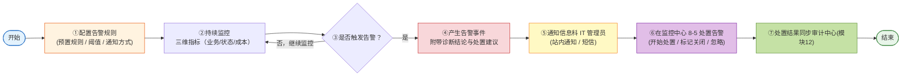

# 统一运行监控中心-需求说明文档

实时监控全院智能体的业务运行、状态健康与资源成本，异常自动告警并通知 IT 管理员；告警事件的发现、处置与闭环统一在本模块内完成。

监控数据由各业务模块在正常业务流程中自动写入（工作台写入调用次数与用户反馈、接入中心写入对接状态、台账中心同步智能体基本信息），本模块不提供用户侧的数据采集配置页面，采集策略由系统预置并随版本迭代调整。

<aside>
🔒

**访问范围**：本模块**仅面向医院信息科 IT 管理员**，不对科室管理员与普通用户开放。所有页面、功能、数据均以 IT 管理员视角呈现；侧边栏入口对非授权角色不可见，直接访问 URL 时返回无权限提示。

</aside>

### 核心业务流程

本模块面向**医院信息科 IT 管理员**（不开放给科室管理员与普通用户）。流程聚焦七环：**开始 → 配置告警 → 持续监控 → 产生告警 → 通知 IT 管理员 → 在监控中心处置告警 → 处置结果归档审计 → 结束**。

**本模块承担告警全生命周期闭环**：告警规则配置、告警事件上报、告警记录的查看与处置、派单与关闭均在本模块内完成；处置结果（处置人/时间/处置说明/最终状态）同步审计中心（模块 12）留档。




**流程说明**

| **阶段** | **路径** | **模块归属 / 关键节点** |
| --- | --- | --- |
| ① 配置告警 | IT 管理员预置/调整告警规则，或按需新建/编辑/删除自定义规则 → 系统保存生效 | **本模块**· 支持新建、编辑、删除自定义告警规则；阈值/启停/通知方式可调；管理入口位于 8-6 告警管理页 |
| ② 持续监控 | 各模块自动写入数据 → 引擎实时计算三维指标（业务/状态/成本） | **本模块**· 数据写入与计算全自动 |
| ③ 触发判定 | 指标超阈或命中规则 → 进入告警分支；未触发则回到持续监控 | **本模块**· 判定逻辑由预置规则驱动 |
| ④ 产生告警 | 触发告警事件 → 自动命名「规则名 - 监测对象 - yyyymmddhhmmss」 → 附带诊断结论与处置建议 → 写入 8-5 告警事件处置列表 | **本模块**· 告警事件由本模块完整留档；负载含规则 ID / 级别 / 触发现场 / 关联智能体 / 诊断与处置建议 |
| ⑤ 通知 IT 管理员 | 按告警级别分发（站内通知 / 短信）→ 推送至 IT 管理员首页待办 | **本模块**· 仅通知信息科 IT 管理员，不下发到科室或终端用户 |
| ⑥ 在监控中心处置 | IT 管理员从首页待办或 8-5 告警事件处置入口进入 → 开始处置 / 标记已关闭 / 忽略事件 | **本模块**· 8-5 告警事件处置页承载查看、详情、处置、闭环全链路 |
| ⑦ 处置结果归档 | 处置完成后系统自动把闭环数据（处置人 / 时间 / 处置说明 / 最终状态）同步至审计中心（模块 12） | **审计中心模块**· 仅做留档，不参与处置操作 |

### 设计要点

- **三维聚焦**：业务、状态、成本三维一站监控全院智能体运行，去除冗余维度，聚焦业务可见价值
- **采集零配置**：各模块业务流程自动写入数据，IT 管理员无需操作
- **告警自定义灵活**：支持新建、编辑、删除告警规则，阈值/启停/通知方式可灵活配置
- **告警发现 + 处置一站式闭环**：告警事件在本模块内完成命中 → 通知 → 处置 → 关闭 → 审计归档全链路，无需跳转外部模块
- **告警自带诊断与处置建议**：缩短 IT 管理员排障路径（规则配置时可填写「可能原因 + 处置建议」，告警触发时自动附上）

### 导航结构

```
统一运行监控中心（一级菜单）
├── 监控总览（一屏看清全院智能体运行健康度）
├── 业务监控（智能体回答合不合规、有没有过度承诺或语气不当）
├── 状态监控（哪些智能体在线、哪些异常需排查）
├── 成本监控（智能体花了多少钱、花在哪里）
├── 告警事件处置（发现 + 处置 + 闭环一站式）
└── 告警管理（什么情况自动预警、通知谁、怎么通知）
```

### 功能说明

| **一级功能** | **二级功能** | **功能说明** |
| --- | --- | --- |
| 监控总览 | 三维指标大盘 | 以卡片 + 图表形式展示业务、状态、成本三个维度的核心运行指标，支持按时间/科室/智能体筛选下钻 |
| 监控总览 | 实时告警横幅 | 页面顶部展示当前未处理告警数量与最高级别，点击跳转 8-5 告警事件处置页 |
| 业务监控 | 业务指标分析 | 展示调用量趋势、任务完成率、不合规回答率、用户反馈等业务指标，支持按科室与智能体下钻 |
| 状态监控 | 运行状态总览 | 展示全院智能体的在线/离线/异常状态列表，异常项高亮并关联最近告警；支持按科室、类型筛选 |
| 成本监控 | 资源成本分析 | 展示各智能体的算力、存储、流量、Token 消耗量与总成本趋势，支持按科室汇总与环比分析 |
| 告警事件处置 | 事件列表 + 处置闭环 | 展示已触发的告警事件列表，支持按维度/级别/状态筛选；提供事件详情抽屉与「开始处置 / 标记已关闭 / 忽略事件」处置操作；处置结果同步审计中心归档 |
| 告警管理 | 告警规则配置 | 展示已配置的全部告警规则，支持新建、编辑、删除、启用/停用、复制；每条规则包含「告警基本信息 / 告警指标 / 告警规则配置 / 告警通知」四大核心配置块。入口位于侧边栏「统一运行监控中心 > 告警管理」，或监控总览页右上角告警横幅。规则触发后的告警事件统一在 8-5 告警事件处置页查看与处置 |

### 核心页面清单

| **页面编号** | **页面名称** | **对应功能** | **页面类型** | **主要用途** | **使用角色** |
| --- | --- | --- | --- | --- | --- |
| 8-1 | 监控总览页 | 三维指标大盘 + 实时告警横幅 + 告警管理入口 | 数据可视化页 | 运行监控默认落地页，三维指标一览 + 告警快速感知 + 告警管理入口 | IT 管理员 |
| 8-2 | 业务监控页 | 业务指标分析 | 图表 + 列表页 | 查看调用量、任务完成率、不合规回答率等业务指标与趋势 | IT 管理员 |
| 8-3 | 状态监控页 | 运行状态总览 | 列表页 | 查看全院/本科室智能体在线、离线、异常状态，快速定位异常项 | IT 管理员 |
| 8-4 | 成本监控页 | 资源成本分析 | 图表 + 列表页 | 查看各智能体与科室的资源成本明细与趋势 | IT 管理员 |
| 8-5 | 告警事件处置页 | 告警事件列表 + 详情 + 处置闭环 | 列表 + 详情抽屉页 | 查看已触发告警事件、进入处置、记录处置结果并归档审计中心 | IT 管理员 |
| 8-6 | 告警管理页 | 告警规则配置 | 列表 + 详情/编辑页 | 管理告警规则（新建/编辑/删除/启停/复制） | IT 管理员 |

### 数据采集策略说明

<aside>
📋

本模块不设置用户侧的数据采集配置页面。监控数据的采集完全由系统自动完成，以下为预置采集策略：

</aside>

| **数据类别** | **数据来源** | **采集方式** | **采集频率** | **保留策略** |
| --- | --- | --- | --- | --- |
| 业务数据 | 工作台对话模块 | 每次对话自动记录调用次数、用户反馈（👍👎）、对话时长、任务完成状态 | 实时（每次对话） | 原始数据 90 天，日级聚合 1 年 |
| 状态数据 | 接入中心心跳探测 | 系统定时对已接入智能体发送健康检查请求 | 每 60 秒 | 状态变更事件永久保留 |
| 成本数据 | 接入中心 API 网关 + 基础设施计量 | 按调用次数和资源使用量自动计费 | 实时（每次调用） | 日级聚合永久保留 |
| 告警事件 | 告警规则引擎 | 规则命中后自动生成事件并写入 8-5 告警事件处置列表 | 事件驱动 | 事件永久保留，处置结果同步审计中心 |

### 明细表组件规范

<aside>
📋

本规范适用于本模块下所有二级页面（8-2 ~ 8-5）的明细表，目的是在保证多列指标完整展示的同时维持页面美观清晰。规范由前端组件统一实现，各页明细表只需声明列定义即可，不重复说明样式细节。

</aside>

| **项** | **规则** | **目的** |
| --- | --- | --- |
| 冻结列 | 前 2 列（智能体名称、归属科室）默认冻结，横向滚动时保持可见 | 10+ 列宽表横滑后仍能识别行归属 |
| 横向滚动 | 表格宽度超出容器时启用横向滚动条，不强制压缩列宽 | 避免单元格内容截断 |
| 列显隐 | 表头右侧提供「列设置」按钮，用户可自定义显示/隐藏列，选择保留在用户偏好中 | 不同角色按需聚焦，避免一刀切默认隐藏 |
| 表头吸顶 | 纵向滚动时表头固定吸顶 | 长列表场景下保持列名可见 |
| 对齐与排版 | 文本列左对齐、数值/百分比右对齐、状态标签居中；单行高度 40px；表格边缝内边距 12px | 数值列纵向扫读时小数点对齐，节奏统一 |
| 排序 | 支持排序的列表头显示双向箭头图标，当前排序列高亮箭头并显示升/降序状态 | 明确可交互列与当前排序状态 |
| 阈值高亮 | 仅对超过[医疗智能体监控指标体系V1.1](https://app.notion.com/p/V1-1-670e66730f8843f4b56bad59b20cee43?pvs=21)阈值的单元格上红色字/浅红底，不对整行染色 | 避免视觉过载，问题定位更精准 |
| 趋势缩略图列 | 所有明细表末列统一为「趋势」迷你折线图/柱状图，列宽固定 80px | 统一末列收口，视觉节奏一致 |
| 分页与加载 | 默认每页 20 行，支持跳页与每页行数切换（20/50/100）；超 100 行不一次加载 | 全院多智能体场景下避免首屏加载过重 |

### 图表区布局规范

<aside>
📐

本规范仅明确图表之间的排列原则，不规定卷卡片尺寸、间距、配色、字号等具体视觉 token——后者交由设计系统 / 组件库统一定义。

</aside>

| **项** | **规则** |
| --- | --- |
| 网格基准 | 24 栅格系统，与 KPI 卡片同源 |
| 默认排列 | Tab 内图表默认 **2 列网格**（8-2/8-3/8-4 统一）：4 图 = 2×2、6 图 = 3×2、7 图 = 3 行 + 1 图占整行 |
| 例外：占整行 | 仅当指标为 P0 核心 + 大数字 KPI 类时占整行，在该指标行的「图表类型」列中注明「占整行」即可，无需另立清单 |

### 指标气泡（ⓘ Tooltip）规范

<aside>
ℹ️

**适用范围**：本模块全部页面（8-1 监控总览 / 8-2 业务监控 / 8-3 状态监控 / 8-4 成本监控）中所有 **KPI 卡片**、**图表卡片**、**明细表列头** 上出现的指标名称，名称右侧紧邻加一个 ⓘ 图标；鼠标悬浮后弹出 Tooltip 气泡展示该指标的完整说明。**指标本身不新增，仅增加描述交互**。

</aside>

#### 气泡交互规格

| **项** | **规则** |
| --- | --- |
| 触发区域 | 指标名称右侧紧邻 12px 浅灰色 ⓘ 图标（与文字间距 4px）；鼠标悬浮图标或指标名称任一区域均可触发气泡 |
| 触发延迟 | 悬浮 300ms 后弹出，鼠标离开 100ms 后收起（避免误触发与闪烁） |
| 气泡位置 | 默认弹出于图标上方（top）；空间不足时自动翻转至 bottom / right / left（Ant Design Tooltip 默认行为） |
| 最大宽度 | 320px；超出自动换行；建议不超过 6 行，如超过需精简文案 |
| 样式 | 深色背景（#1F1F1F）白字，字号 12px，行高 1.6；圆角 4px；轻投阴影；与 Ant Design Tooltip 默认主题保持一致 |
| 可选中 | 气泡内容可拖选复制（便于客户沟通中引用指标描述）；鼠标进入气泡区域不会提前收起 |
| 不带 ⓘ 的场景 | 表格中的序号、操作列、状态标签、趋势缩略图末列等「非指标」字段不加 ⓘ；筛选器 / 简单文本字段（如「智能体名称」「归属科室」）也不加 ⓘ |

#### 气泡内容结构（统一模板）

<aside>
📦

气泡文案统一按下述四行模板生成，超出项为空时自动隐藏（不留空行）。全部文案源字段直接从 [医疗智能体监控指标体系V1.1](https://app.notion.com/p/V1-1-670e66730f8843f4b56bad59b20cee43?pvs=21) 中对应指标表行拉取，不在本 PRD 中重复维护。

</aside>

| **行** | **字段** | **文案模板** | **指标体系取数字段** |
| --- | --- | --- | --- |
| 第 1 行 | 一句话定义 | 「{定义与计算口径}」 | 「定义与计算口径」列 |
| 第 2 行 | 单位 | 「单位：{单位}」 | 「单位」列 |
| 第 3 行 | 建议阈值 | 「建议阈值：{阈值}」（无阈值时整行隐藏） | 「建议阈值」列 |
| 第 4 行 | 分级 | 「指标分级：P0 核心 / P1 重要 / P2 一般」（仅在指标体系 §6.2 明确分级的指标上呈现） | 指标体系 §6.2 分级表 |

**文案示例（以「任务完成率」为例，气泡填充后实际呈现）**

<aside>
💬

**任务完成率**
用户发起的智能体任务在不中断、不失败的前提下成功完成的占比。
单位：%
建议阈值：≥ 95%
指标分级：P0 核心

</aside>

#### 指标描述与指标体系的数据联动

- **唯一文案源**：气泡内容 100% 来自 [医疗智能体监控指标体系V1.1](https://app.notion.com/p/V1-1-670e66730f8843f4b56bad59b20cee43?pvs=21)（医疗智能体监控指标体系 V1.1），不在本 PRD 重复记录。
- **名称匹配规则**：前端采用「页面指标 key → 指标体系指标 key」映射表联动。页面上的指标名称可以略有简化（如「平均会话轮次」↔ 指标体系「平均会话轮次」），但后台统一维护一份映射表，保证气泡文案始终取到正确条目。
- **版本漂移控制**：指标体系升级（如 V1.2）后，所有页面气泡内容随之刷新，无需重新发版 PRD 或前端代码。
- **指标体系中不存在的指标**（如该指标仅在本 PRD 中提及但未在指标体系登记）：气泡内容提示「指标描述待补充，请联系指标体系维护者」，同时本 PRD 中该指标名称需同步补录入指标体系。

#### 适用于下列位置（逐页清单）

| **页面** | **需加 ⓘ 的位置** |
| --- | --- |
| 8-1 监控总览 | 4 张 KPI 卡片标题 + 6 张图表卡片标题（智能体健康排行除外） |
| 8-2 业务监控 | 4 张 KPI 卡片标题 + 3 个 Tab 内所有图表卡片标题（调用与任务 6 项 + 内容输出质量 5 项 + 用户反馈与协同 4 项，共 15 项）+ 抽屉内明细表列头 |
| 8-3 状态监控 | 4 张 KPI 卡片标题 + Tab2 资源健康检查 4 项图表标题 + 抽屉「异常与依赖」中 2 项图表标题 + Tab1 列表列头（心跳成功率 / 运行版本台账版本等指标列） |
| 8-4 成本监控 | 4 张 KPI 卡片标题 + 3 个 Tab 内所有图表卡片标题（资源消耗 4 类 + 资源利用 4 项 + 汇总与趋势 6 项）+ 抽屉内明细表列头 |
| 8-5 告警事件处置 | 列表列头中的指标列（事件级别、触发条件、关联对象等不加 ⓘ；触发条件涉及具体指标时，该指标名右侧加 ⓘ）+ 详情抽屉内的指标字段 |
| 8-6 告警管理 | 「告警规则表单 / 告警指标」块中「监控指标」下拉选项右侧加 ⓘ；鼠标悬浮单个选项时弹出该指标的描述气泡，辅助管理员选择。选择后表单字段不再重复呈现 |

#### 前端实现提示

- 由组件库提供统一的 `<MetricLabel>` 封装：入参 `metricKey`（映射到指标体系条目），自动渲染「名称 + ⓘ 图标 + Tooltip 内容」，不需各页重复实现。
- KPI 卡片 / 图表卡片只需在渲染标题位置使用 `<MetricLabel metricKey="taskCompletionRate" />`，后台返回映射后的 Tooltip 文案。
- 映射表、Tooltip 文案以 JSON 维护于前端实例 config 中；后期可演进为后台下发、指标体系表直连的方式，免指标变动后发版前端代码。

### 8-1 监控总览页 — 字段与交互

### 页面概述

| 属性 | 说明 |
| --- | --- |
| 页面类型 | 数据可视化页 |
| 使用角色 | IT 管理员 |
| 入口 | 侧边栏「统一运行监控中心」默认落地页 |

### 页面布局（紧凑一屏版）

<aside>
📐

**一屏可见预算**（基准视口 1280 × 800，平台/浏览器头部预留 ~120px）：顶部信息条 48px + KPI 卡 88px + 图表区 ≥ 520px + 卡片间距 24px ≈ 680px，**1280 × 800 视口下无需滚动**即可看到全部核心信息（告警 + 筛选 + KPI + 6 个图表）。所有图表固定高度 240px，禁止动态拉伸。

</aside>

页面自上而下分为：① 顶部信息条（合并告警横幅 + 筛选栏，48px）→ ② KPI 卡片区（88px）→ ③ 图表区（3 列 × 2 行 = 6 图，单图 240px）。智能体健康排行降级为图表网格末位的紧凑列表，完整 Top 10 / Bottom 10 通过「查看详情」跳转独立页。

**① 顶部信息条（高度 48px，左右两段）**

左段：告警状态（仅在有未处理告警时展示，否则左段留空）

| **序号** | **元素** | **说明** | **交互** |
| --- | --- | --- | --- |
| 1 | 告警状态点 + 数量 | 圆点按最高级别着色（严重=红 / 警告=橙 / 提示=蓝）+ 「N 个未处理告警」+ 级别标签 | 点击跳转 8-5 告警事件处置页（默认筛选「待处理」） |
| 2 | 最新告警摘要 | 「最新：智能体名 — 告警摘要」单行省略，悬浮气泡显示完整描述 | 点击跳转 8-5 告警事件处置页并打开该事件详情抽屉 |
| 3 | 「查看详情」链接 | 文字链接，紧跟摘要右侧 | 点击跳转 8-5 告警事件处置页 |

右段：筛选与全局操作（紧凑控件单行排列，控件之间间隔 8px）

| **序号** | **元素** | **说明** | **交互** |
| --- | --- | --- | --- |
| 1 | 时间范围 | 下拉：今日 / 近 7 天 / 近 30 天 / 自定义，控件宽度 ~120px | 选择后全页数据刷新 |
| 2 | 科室筛选 | 下拉多选，宽度 ~140px；选项＝台账已登记科室，默认全部可选 | 按科室过滤 |
| 3 | 智能体筛选 | 下拉多选，宽度 ~160px；选项随科室联动，支持按名称搜索 | 按智能体过滤 |
| 4 | 刷新 | 仅图标按钮（无文字），32 × 32px | 点击重新拉取 |
| 5 | 告警管理 | 齿轮图标 + 「告警管理」文字，固定在最右侧 | 点击跳转至 8-6 告警管理页 |

顶部信息条说明：

- 整条固定高度 48px，左段最大占 60% 宽度、右段紧靠右对齐；左右段之间存在弹性间隔。
- 1280px 视口下完整一行可容；视口宽度 < 1024px 时筛选控件自动换行至第二行（仅在该断点下），但告警管理按钮仍固定在右上。
- 无未处理告警时左段不渲染，右段保持原位，整条仍按 48px 高度占位以避免页面跳动。

**② KPI 卡片区（一行 4 卡，等宽，高度 88px）**

<aside>
📐

**布局约束**：4 个统计卡片采用 **一行四列等宽** 布局，卡片内紧凑排版（标题 12px + 主指标 28px 加粗 + 环比 12px 同一行紧邻），**不含趋势缩略图与环形微图**（趋势统一放到下方图表区）。卡片最小宽度 220px，1280px 视口下单卡宽度 ≈ 290px；视口宽度 < 1024px 时降级为一行两卡。

</aside>

| **序号** | **卡片名称** | **数据说明** | **交互** |
| --- | --- | --- | --- |
| 1 | 今日调用量 | 筛选范围内总调用次数 + 环比（环比数字加箭头，无迷你图） | 点击跳转业务监控页 |
| 2 | 运行状态分布 | 纯文字「在线 N / 离线 N / 异常 N」三色点，**不使用环形微图** | 点击跳转状态监控页 |
| 3 | 本月成本 | 本月累计资源成本（元）+ 环比上月 | 点击跳转成本监控页 |
| 4 | 待处理告警数 | 未处理告警事件总数 + 最高级别标签 + 环比；红字醒目 | 点击跳转 8-5 告警事件处置页（默认筛选「待处理」） |

**③ 图表区（3 列 × 2 行 = 6 图，单图固定 240px 高）**

<aside>
📐

**布局约束**：图表区采用 **3 列 × 2 行** 等宽栅格，单图固定高度 240px、内边距 12px。卡片标题与「查看详情」链接置于卡片顶部同一行（左标题、右链接）。视口宽度 < 1024px 时降级为 2 列 × 3 行；图表内容自适应卡片宽度但**不改变高度**，保证一屏 6 图始终可见。

</aside>

| **序号** | **位置** | **图表名称** | **图表类型** | **交互** |
| --- | --- | --- | --- | --- |
| 1 | 第 1 行 / 第 1 列 | 调用量趋势 | 折线图（按筛选时间粒度） | 悬浮详情，点击跳转业务监控 |
| 2 | 第 1 行 / 第 2 列 | 任务完成率趋势 | 折线图 + 95% 阈值线 | 悬浮详情，点击跳转业务监控 |
| 3 | 第 1 行 / 第 3 列 | 运行状态分布趋势 | 堆叠面积图（在线 / 离线 / 异常 三色堆叠） | 悬浮详情，点击跳转状态监控 |
| 4 | 第 2 行 / 第 1 列 | 成本趋势 | 柱状图（按日 / 周切换） | 悬浮详情，点击跳转成本监控 |
| 5 | 第 2 行 / 第 2 列 | 告警趋势 | 堆叠柱状图（按级别 严重/警告/提示） | 点击跳转 8-5 告警事件处置页 |
| 6 | 第 2 行 / 第 3 列 | 智能体健康排行（Top 7） | 紧凑列表，单行 28px：「排名 + 名称 + 健康度 + 状态」 | 点击行跳转对应智能体；点击卡片右上「查看详情」跳转 Top 10 / Bottom 10 独立页 |

**布局调整说明（与旧版差异）**

- **告警横幅 + 筛选栏合并** 为顶部信息条，从「48px + 独立筛选区」压缩为单行 48px，节省 ~56px 纵向空间。
- **KPI 卡片** 由 5 张精简为 4 张：去掉「平均响应时长」（性能维度已下线）与「待查看优化建议」（不依赖治理中心），新增「待处理告警数」直连 8-5。
- **图表区** 从「单列 6 行」改为「3 列 × 2 行」，单图高度从「自适应 ~320px」固定为 240px；6 图可一屏并列，无需向下滚动。
- **图表区指标** 去掉「响应时长趋势」「错误率趋势」（性能维度已下线），改为「任务完成率趋势」「运行状态分布趋势」，与三维口径对齐。
- **智能体健康排行** 从独立明细表降级为图表网格末位的紧凑列表（Top 7），完整 Top 10 / Bottom 10 通过「查看详情」跳转独立页查看；监控总览页一屏内不再承载长列表。

**Mock 数据样例（页面专属）**

统计卡片区接口返回示例：

```json
{
  "todayCalls": { "value": 12834, "wow": 0.082 },
  "runStatus": { "online": 12, "offline": 1, "abnormal": 1 },
  "monthCost": { "value": 45620, "unit": "元", "wow": 0.06 },
  "pendingAlerts": { "value": 4, "highestLevel": "严重", "wow": 1 }
}
```

### 8-2 业务监控页 — 字段与交互

### 页面概述

| 属性 | 说明 |
| --- | --- |
| 页面类型 | 图表 + 列表页 |
| 使用角色 | IT 管理员 |
| 入口 | 侧边栏「统一运行监控中心 > 业务监控」/ 监控总览卡片点击 |
| 指标依据 | [医疗智能体监控指标体系V1.1](https://app.notion.com/p/V1-1-670e66730f8843f4b56bad59b20cee43?pvs=21) §四 业务监控（15 项指标，分 3 组） |

### 页面布局（紧凑一屏版）

<aside>
📐

**一屏可见预算**（基准视口 1280 × 800，平台/浏览器头部预留 ~120px）：顶部信息条 48px + KPI 卡 88px + Tab 栏 36px + 当前 Tab 图表区 460px + 卡片间距 24px ≈ 656px，**1280 × 800 视口下当前 Tab 的「筛选 + KPI + 图表」无需滚动**即可完整可见。所有图表固定高度 220px，禁止动态拉伸；**业务指标明细表降级为右下角悬浮按钮「📊 查看明细」唤起的右侧抽屉**，不再占用首屏纵向空间。

</aside>

页面自上而下分为：① 顶部信息条（合并筛选栏，48px）→ ② 关键 KPI 卡片区（88px）→ ③ Tab 栏（36px，3 个 Tab：调用与任务 / 内容输出质量 / 用户反馈与协同）→ ④ 当前 Tab 图表区（460px，6 项指标用 3×2 网格、5 项指标用 3×2 网格末位跨列大 KPI、4 项指标用 2×2 网格，单图固定 220px）。业务指标明细表通过右下角悬浮按钮唤起 800px 宽的右侧抽屉。

**① 顶部信息条（高度 48px，左右两段）**

左段：页面标题区（标题「业务监控」+ 副标题「智能体回答合不合规、有没有过度承诺或语气不当」单行排列，标题 16px 加粗、副标题 12px 灰字）。

右段：全局筛选与刷新（紧凑控件单行排列，控件之间间隔 8px）

| **序号** | **元素** | **说明** | **交互** |
| --- | --- | --- | --- |
| 1 | 时间范围 | 下拉：今日 / 近 7 天 / 近 30 天 / 自定义，控件宽度 ~120px | 选择后全页数据刷新 |
| 2 | 科室筛选 | 下拉多选，宽度 ~140px；选项＝台账已登记科室 | 按科室过滤 |
| 3 | 智能体筛选 | 下拉多选，宽度 ~160px；随科室联动，支持名称搜索 | 按智能体过滤 |
| 4 | 刷新 | 仅图标按钮（无文字），32 × 32px | 点击重新拉取 |

顶部信息条说明：整条固定高度 48px；视口宽度 < 1024px 时筛选控件自动换行至第二行，标题副标题始终保留在左上。

**② 关键 KPI 卡片区（一行 4 卡，等宽，高度 88px）**

| **序号** | **卡片名称** | **说明 / 阈值** | **交互** |
| --- | --- | --- | --- |
| 1 | 业务调用总量 | 筛选范围内调用总次数（含环比） | 点击跳转 Tab1 调用与任务 |
| 2 | 活跃用户数 | 当日 / 当月去重用户数（双值并列） | 点击跳转 Tab1 活跃用户图表 |
| 3 | 任务完成率 | 阈值 ≥ 95%，跌破红字 | 点击跳转 Tab1 任务完成率图表 |
| 4 | 不合规回答率 | 阈值 ≤ 0.5%（P0 核心指标） | 点击跳转 Tab2 内容输出质量 |

**Tab 1：调用与任务完成类（6 项指标，3×2 网格）**

| **序号** | **位置** | **指标名称** | **图表类型** | **说明 / 阈值** |
| --- | --- | --- | --- | --- |
| 1 | 第 1 行 / 第 1 列 | 业务调用总量 | 柱状图按日（双轴叠加累计折线） | 可切换日/周/月粒度 |
| 2 | 第 1 行 / 第 2 列 | 活跃用户数（DAU / MAU） | 双线折线图 + 大数字 KPI 当前值 | 按业务约定 |
| 3 | 第 1 行 / 第 3 列 | 科室覆盖数 | 横向条形图（TOP 10 高亮，可叠加院区分组） | 按推广目标 |
| 4 | 第 2 行 / 第 1 列 | 任务完成率 | 环形进度图 + 折线趋势 | 95% 下限红线 |
| 5 | 第 2 行 / 第 2 列 | 任务中断率 | 折线图 + 按中断原因堆叠柱状图 | 5% 红线（原因：异常 / 用户放弃 / 超时） |
| 6 | 第 2 行 / 第 3 列 | 平均会话轮次 | 直方图（x=轮次 y=会话数）+ 均值标线 | 超长会话（>20 轮）红色高亮 |

**Tab 2：内容输出质量类（5 项指标，3×2 网格 + 末位「高风险拦截数」大 KPI 跨列）**

<aside>
🛡️

本 Tab 承载吴老师 5.29 演示中明确要求的「自动内容检测」主路径（过度承诺 / 语气 / 用词等）；用户主动反馈类指标因可得性低已降级为 Tab 3 辅助参考。

</aside>

| **序号** | **位置** | **指标名称** | **图表类型** | **说明 / 阈值** |
| --- | --- | --- | --- | --- |
| 1 | 第 1 行 / 第 1 列 | 不合规回答率 | 折线图（下钻列表通过卡片右上「查看详情」打开） | 0.5% 红线（P0 核心） |
| 2 | 第 1 行 / 第 2 列 | 过度承诺 / 绝对化表述率 | 折线图（命中样本 TOP 10 列表通过详情打开） | 0.5% 红线；高频词：一定 / 绝对 / 根治 / 100% |
| 3 | 第 1 行 / 第 3 列 | 不当语气 / 态度异常率 | 折线图 + 分类细分饼图 | 1% 红线；分类：冷漠 / 强硬 / 不耐烦 / 其它 |
| 4 | 第 2 行 / 第 1 列 | 用词不当率 | 折线图（命中样本 TOP 10 列表通过详情打开） | 1% 红线（按命中频次降序） |
| 5 | 第 2 行 / 第 2-3 列（跨 2 列） | 高风险输出拦截数 | 大数字 KPI（当日 / 累计）+ 日历热力图 | 记录并复盘高风险拦截事件 |

**Tab 3：用户反馈与协同类（4 项指标，2×2 网格，含辅助指标）**

<aside>
⚠️

吴老师 5.29 演示明确质疑用户主动反馈的可获得性（原话：「用户反馈，你怎么拿得到呢？」）。「满意度评分」「正向反馈率」已降级为**辅助参考**，仅在反馈数据可得时展示；内容质量主路径请使用 Tab 2 的自动检测指标。

</aside>

| **序号** | **位置** | **指标名称** | **图表类型** | **说明 / 阈值** |
| --- | --- | --- | --- | --- |
| 1 | 第 1 行 / 第 1 列 | 满意度评分（辅助） | 5 星可视化 + 折线趋势 | 4.2 下限红线，数据缺失时显示「数据不足」 |
| 2 | 第 1 行 / 第 2 列 | 正向反馈率（辅助） | 环形图 + 折线趋势 + 总反馈量小字 | 90% 下限红线 |
| 3 | 第 2 行 / 第 1 列 | 投诉与工单数 | 堆叠柱状图按状态分层 | 新建 / 处理中 / 已闭环（红 / 黄 / 绿） |
| 4 | 第 2 行 / 第 2 列 | 协同任务成功率 | 折线图 + 编排节点失败率横向条形图 | 95% 红线；TOP 失败节点红色高亮 |

**⑤ 业务指标明细表（抽屉式，不占首屏）**

<aside>
📋

明细表通过页面右下角悬浮按钮「📊 查看明细」（56 × 56px 圆形按钮，固定在视口右下，主题色填充）唤起 **800px 宽右侧抽屉**。抽屉自上而下 = 抽屉头部（标题「业务指标明细」+ 关闭按钮）+ 明细高级筛选（默认折叠）+ 明细表（前 2 列冻结、表头吸顶、阈值高亮、末列趋势缩略图、20 行/页）。明细字段包含：智能体名称、归属科室、调用总量、活跃用户数、任务完成率、不合规回答率、过度承诺率、高风险拦截数、投诉工单数、近 7 日趋势缩略图。

</aside>

### 8-3 状态监控页 — 字段与交互

### 页面概述

| 属性 | 说明 |
| --- | --- |
| 页面类型 | 列表 + 图表页 |
| 使用角色 | IT 管理员 |
| 入口 | 侧边栏「统一运行监控中心 > 状态监控」/ 监控总览卡片点击 |
| 指标依据 | [医疗智能体监控指标体系V1.1](https://app.notion.com/p/V1-1-670e66730f8843f4b56bad59b20cee43?pvs=21) §三 状态监控（10 项指标，分 3 组） |

### 页面布局（紧凑一屏版）

<aside>
📐

**一屏可见预算**（基准视口 1280 × 800，平台/浏览器头部预留 ~120px）：顶部信息条 48px + KPI 卡 88px + Tab 栏 36px + 当前 Tab 内容区 460px + 卡片间距 24px ≈ 656px。列表行高固定 40px、图表固定高度 220px；**列表高级筛选默认折叠**；**异常事件与依赖服务降级为右下角悬浮按钮「📡 异常与依赖」唤起的右侧抽屉**。

</aside>

页面自上而下分为：① 顶部信息条（合并筛选栏，48px）→ ② 关键 KPI 卡片区（88px）→ ③ Tab 栏（36px，2 个 Tab：状态总览 / 资源健康检查）→ ④ 当前 Tab 内容区（460px）。

**① 顶部信息条（高度 48px）**

左段：页面标题区（标题「状态监控」+ 副标题「哪些智能体在线、哪些异常需排查」）。

右段：时间范围 / 科室 / 智能体 / 状态筛选 + 刷新（与其他页面保持一致）。

**② 关键 KPI 卡片区（一行 4 卡，等宽，高度 88px）**

按「**全部 → 运行中 → 异常 → 离线**」实例状态语义从左到右呈现，让 IT 管理员一眼判断全院智能体在线健康分布。

| **序号** | **卡片名称** | **数据说明** | **交互** |
| --- | --- | --- | --- |
| 1 | 全部实例数 | 筛选范围内**全部智能体实例总数**（不区分状态） | 点击跳转 Tab1 列表并清空状态筛选 |
| 2 | 运行中实例数 | **运行中**实例总数（绿色） | 点击跳转 Tab1 列表并预设状态筛选 = 运行中 |
| 3 | 异常实例数 | **异常状态**实例总数（红色） | 点击跳转 Tab1 列表并预设状态筛选 = 异常 |
| 4 | 离线实例数 | **离线状态**实例总数（灰色） | 点击跳转 Tab1 列表并预设状态筛选 = 离线 |

**③ Tab 栏 + ④ 当前 Tab 内容区**

**Tab 1：状态总览（默认 Tab）**

智能体运行状态列表占满整个 Tab 内容区，上方嵌入「高级筛选」（默认折叠）。

**智能体运行状态列表列定义**

| **序号** | **列名** | **类型** | **说明** | **交互** |
| --- | --- | --- | --- | --- |
| 1 | 智能体名称 | 文本链接 | 智能体名称 | 点击查看实例详情 |
| 2 | 归属科室 | 文本 | 所属科室 | — |
| 3 | 运行状态 | 状态标签 | 运行中（绿）/ 暂停（黄）/ 异常（红）/ 离线（灰） | — |
| 4 | 实例数（在线/应在线） | 文本 | 如「3 / 3」，不足时红色高亮 | — |
| 5 | 心跳成功率 | 百分比 | 跌破 99.95% 红色高亮 | 支持排序 |
| 6 | 最近心跳时间 | 日期时间 | 最后一次心跳成功上报时间 | — |
| 7 | 运行版本 / 台账版本 | 文本 | 实际运行版本与台账登记版本对照，不一致红色高亮 + ❌ 图标 | — |
| 8 | 持续时长 | 文本 | 当前状态持续时长（如「异常 2h15m」） | — |
| 9 | 关联告警 | 文本链接 | 最近一条关联告警的简要描述（无则显示「—」） | 点击跳转 8-5 告警事件处置页并打开该事件详情抽屉 |
| 10 | 操作 | 按钮 | 手动重试健康检查 / 同步台账版本 | 点击触发，结果实时更新 |

**Tab 2：资源健康检查**

4 项资源指标用 **2×2 等宽网格**（CPU 使用率 / 内存使用率 / GPU 显存使用率 / 磁盘使用率），单图固定高度 220px。

| **序号** | **位置** | **图表名称** | **图表类型** | **说明 / 阈值** |
| --- | --- | --- | --- | --- |
| 1 | 第 1 行 / 第 1 列 | CPU 使用率 | 多线折线图（每实例一线） | 80% 红色阈值线，超阈红字 |
| 2 | 第 1 行 / 第 2 列 | 内存使用率 | 多线折线图，与 CPU 联动展示 | 80% 红色阈值线 |
| 3 | 第 2 行 / 第 1 列 | GPU 显存使用率 | 多线折线图 + OOM 事件红色标点叠加 | 85% 红色阈值线 |
| 4 | 第 2 行 / 第 2 列 | 磁盘使用率 | 横向条形图（按使用率降序） | <60% 绿 / 60–80% 黄 / >80% 红 |

**⑤ 异常事件与依赖服务（抽屉式）**

<aside>
📡

右下角悬浮按钮「📡 异常与依赖」唤起 **800px 宽右侧抽屉**。抽屉内自上而下：异常事件次数（堆叠柱状图按 严重/警告/提示 三色堆叠 + 事件流时间线，点击跳转 8-5 告警事件处置页）+ 依赖服务可用率（热力图 y=依赖项（含底座模型、知识库、工具 API）x=时间 5min 粒度，阈值 ≥ 99.9%，颜色 红→绿 表示可用率）。

</aside>

### 8-4 成本监控页 — 字段与交互

### 页面概述

| 属性 | 说明 |
| --- | --- |
| 页面类型 | 图表 + 列表页 |
| 使用角色 | IT 管理员 |
| 入口 | 侧边栏「统一运行监控中心 > 成本监控」/ 监控总览卡片点击 |
| 指标依据 | [医疗智能体监控指标体系V1.1](https://app.notion.com/p/V1-1-670e66730f8843f4b56bad59b20cee43?pvs=21) §五 成本监控（16 项指标，分 3 组） |

<aside>
💰

**计量口径**：医院侧底座模型、云资源单价尚未确认前，本页**以消耗量（核·h、GB·月、GB、tokens、次）为主口径**采集与展示；金额视图（元、元/次、元/1k tokens）作为可配置项保留，待单价配置后由平台 `金额 = 消耗量 × 单价` 自动启用。页面顶部提供「消耗量 / 金额」视图切换开关。

</aside>

### 页面布局（紧凑一屏版）

页面自上而下分为：① 顶部信息条（合并筛选栏 + 时间粒度 + 视图切换，48px）→ ② 关键 KPI 卡片区（88px）→ ③ Tab 栏（36px，3 个 Tab：资源消耗 / 资源利用 / 汇总与趋势）→ ④ 当前 Tab 图表区（460px）。成本明细表通过右下角悬浮按钮唤起右侧抽屉。

**② 关键 KPI 卡片区（一行 4 卡）**

| **序号** | **卡片名称** | **说明 / 阈值** | **交互** |
| --- | --- | --- | --- |
| 1 | 周期总消耗 / 总成本 | 按所选粒度汇总；消耗量视图展示 4 类资源原生单位汇总，金额视图展示总金额（含环比） | 点击跳转 Tab3 汇总与趋势 |
| 2 | 单次调用 Token 消耗 | 当前均值 + 环比箭头，与 7 日基线对比（不依赖单价） | 点击跳转 Tab3 单次调用 Token 图表 |
| 3 | 实例闲置率 | 阈值 ≤ 15%，超阈红色高亮 | 点击跳转 Tab2 资源利用 |
| 4 | 超量 / 超支预警次数 | 当日 / 累计预警次数，目标 = 0 | 点击跳转 Tab3 预警事件列表 |

**Tab 1：资源消耗类（4 类资源聚合，2×2 网格）**

| **序号** | **位置** | **图表名称** | **图表类型** | **说明** |
| --- | --- | --- | --- | --- |
| 1 | 第 1 行 / 第 1 列 | 算力消耗（CPU 核时 / GPU 卡时） | 堆叠面积图 + 卡内分段控件「CPU·h / GPU·h」 | 切换查看 CPU 核时 或 GPU 卡时；可按智能体或科室堆叠；GPU 视图叠加 TOP 5 智能体横向条形图 |
| 2 | 第 1 行 / 第 2 列 | 存储用量（块/云盘 / 对象/向量库） | 面积折线图 + 卡内分段控件「块·云盘 / 对象·向量库」 | 块/云盘按系统盘/数据盘/快照三层，对象/向量按对象存储/向量索引/模型权重三层堆叠 |
| 3 | 第 2 行 / 第 1 列 | 出向网络流量 | 柱状图按日 + 双轴累计折线 | 多数云厂商按出向计费；粒度跟随顶部时间粒度切换 |
| 4 | 第 2 行 / 第 2 列 | 模型 Token 总消耗 | 折线图（叠加 7 日基线浅色对比）+ 大数字 KPI 当前值 | 仅展示总量趋势；输入/输出 Token 明细见 Tab 3「Token 消耗（输入 + 输出）」 |

**Tab 2：资源利用类（4 项指标，2×2 网格）**

| **序号** | **位置** | **指标名称** | **图表类型** | **说明 / 阈值** |
| --- | --- | --- | --- | --- |
| 1 | 第 1 行 / 第 1 列 | 实例闲置率 | 折线图 + 闲置实例 TOP 10 横向条形图 | 15% 红线；支持一键导出实例清单便于回收 |
| 2 | 第 1 行 / 第 2 列 | 低负载时长占比 | 折线图 + 24h 热力图（小时 × 日） | 20% 红线；负载阈值 < 20% |
| 3 | 第 2 行 / 第 1 列 | 无效调用占比 | 折线图 + 无效原因分类饼图 | 3% 红线；原因：参数错误 / 超时 / 空回 / 重复 |
| 4 | 第 2 行 / 第 2 列 | GPU 平均利用率 | 多线折线图（每卡一线） | 60% 下限红线，低于 60% 区段填充黄色提醒 |

**Tab 3：汇总与趋势类（6 项指标，3×2 网格）**

| **序号** | **位置** | **指标名称** | **图表类型** | **说明 / 阈值** |
| --- | --- | --- | --- | --- |
| 1 | 第 1 行 / 第 1 列 | 单次调用 Token 消耗 | 大数字 KPI + 折线趋势（叠加 7 日基线浅色对比） | 按基线对比；不依赖单价 |
| 2 | 第 1 行 / 第 2 列 | Token 消耗（输入 + 输出） | 堆叠柱状图（按模型堆叠 + 输入/输出双层） | 可切换日/周/月粒度 |
| 3 | 第 1 行 / 第 3 列 | 周期总消耗 / 总成本 | 堆叠柱状图（按 4 类资源 4 色堆叠）+ 顶部 4 张分类 KPI | 支持日 / 周 / 月 / 年切换 |
| 4 | 第 2 行 / 第 1 列 | 各维度成本占比 | 环形（甜甜圈）图 4 类资源占比 + 4 张数字卡（百分比 + 环比变化） | 消耗量口径下各资源按原生单位独立展示；金额口径切换后做加权占比 |
| 5 | 第 2 行 / 第 2 列 | 消耗 / 成本波动率 | 双向柱状图（0% 基准线，正绿负红） | |波动| ≤ 20% 阈值，超阈高亮 |
| 6 | 第 2 行 / 第 3 列 | 超量 / 超支预警次数 | 大数字 KPI + 日历热力图 + 预警事件列表 | 目标 = 0；事件列表支持跳转 8-5 告警事件处置页 |

**⑤ 成本明细表（抽屉式）**

<aside>
📋

明细表通过页面右下角悬浮按钮「📊 查看明细」唤起 800px 宽右侧抽屉，含明细高级筛选（默认折叠）+ 明细表。明细字段包含：智能体名称、归属科室、CPU 核时 / GPU 卡时、存储用量、出向流量、Token 消耗、单次调用 Token、实例闲置率、环比变化、金额（待单价启用）、近 7 日趋势。

</aside>

### 8-5 告警事件处置页 — 字段与交互

<aside>
🚨

**本页是告警事件全生命周期的承载页**：从规则命中产生事件 → IT 管理员查看 → 进入处置 → 标记关闭 / 忽略 → 处置结果同步审计中心（模块 12）。本模块不再依赖外部模块查看与处置告警。

</aside>

### 页面概述

| 属性 | 说明 |
| --- | --- |
| 页面类型 | 列表 + 详情抽屉页 |
| 使用角色 | IT 管理员 |
| 入口 | 侧边栏「统一运行监控中心 > 告警事件处置」/ 监控总览页告警横幅 / 监控总览 KPI「待处理告警数」点击 / 状态监控「关联告警」点击 / 首页待办告警条目点击 |

### 页面布局

页面自上而下分为：① 顶部 Tab 栏（全部事件 / 我的事件，默认「我的事件」）→ ② 筛选区（关键字 + 来源维度 + 事件级别 + 处置状态）→ ③ 事件列表 → ④ 详情抽屉（点击列表行从右侧展开）。

**① Tab 栏**

| **Tab** | **说明** | **默认** |
| --- | --- | --- |
| 全部事件 | 展示当前 IT 管理员可见范围内的全部告警事件（全院维度） | — |
| 我的事件 | 仅展示「负责人 = 当前用户」或「负责科室 = 当前用户负责科室」的告警事件 | ✅ 默认 |

**② 筛选区（紧凑控件单行排列）**

| **序号** | **字段** | **类型** | **说明** |
| --- | --- | --- | --- |
| 1 | 关键字 | 文本输入 | 按事件标题、规则名称、监测对象模糊搜索 |
| 2 | 来源维度 | 单选下拉 | 固定为「应用」（仅本模块的应用层告警事件；治理中心的数据/算法/合规/安全/伦理等其他维度不在本模块呈现） |
| 3 | 事件级别 | 多选下拉 | 严重（红）/ 警告（橙）/ 提示（蓝） |
| 4 | 处置状态 | 多选下拉 | 全部 / 待处理 / 处理中 / 已关闭 / 已忽略 |
| 5 | 触发时间 | 日期范围 | 默认近 7 天 |
| 6 | 操作 | 按钮 | 「重置」次按钮 + 「查询」主按钮 |

<aside>
💡

**事件命名规则**：每条告警事件自动按「**告警规则名 - 监测对象 - yyyymmddhhmmss**」格式生成事件标题。例：「P95 响应时延超阈 - 心电图智能辅助诊断系统 - 20260608143215」。

</aside>

**③ 事件列表（10 列）**

| **序号** | **列名** | **类型** | **说明** | **交互** |
| --- | --- | --- | --- | --- |
| 1 | 事件标题 | 文本链接 | 「规则名 - 监测对象 - yyyymmddhhmmss」自动命名 | 点击右侧抽屉展开详情 |
| 2 | 来源维度 | 标签 | 固定显示「应用」 | — |
| 3 | 事件级别 | 标签 | 严重（红）/ 警告（橙）/ 提示（蓝） | — |
| 4 | 规则名称 | 文本 | 触发该事件的告警规则名 | 点击跳转 8-6 告警管理 规则详情 |
| 5 | 监测对象 | 文本 | 命中的智能体或科室 | 点击查看智能体台账 |
| 6 | 触发条件 | 文本 | 触发当时的运算符 + 阈值 + 实际值（如「P95 > 5000ms，实际 6.2s」） | — |
| 7 | 关联对象 | 文本 | 规则配置中的「关联对象」字段透传（如关联工单 / 关联会话） | 点击跳转关联对象详情 |
| 8 | 发现时间 | 日期时间 | 事件首次触发的精确时间 | 支持排序 |
| 9 | 处置状态 | 状态标签 | 待处理（红）/ 处理中（黄）/ 已关闭（绿）/ 已忽略（灰） | — |
| 10 | 操作 | 按钮组 | 「查看」（打开详情抽屉）/ 「处置」（直接进入处置流程） | 点击触发对应操作 |

列表样式遵循模块通用「明细表组件规范」（前 2 列冻结、表头吸顶、20 行/页）。

**④ 事件详情抽屉（800px 宽，从右侧展开）**

抽屉自上而下排列以下 13 个字段：

| **序号** | **字段** | **说明** |
| --- | --- | --- |
| 1 | 事件标题 | 自动命名（规则名 - 监测对象 - yyyymmddhhmmss），抽屉头部加粗显示 |
| 2 | 事件级别 | 严重 / 警告 / 提示（带颜色标签） |
| 3 | 来源维度 | 应用 |
| 4 | 处置状态 | 待处理 / 处理中 / 已关闭 / 已忽略 |
| 5 | 触发规则 | 规则名称 + 链接（跳转 8-6 告警管理 规则详情） |
| 6 | 监测对象 | 智能体名称 + 归属科室 + 链接（跳转台账详情） |
| 7 | 触发条件与实际值 | 规则的运算符 + 阈值 + 触发当时的实际值（如「P95 > 5000ms，实际 6200ms」） |
| 8 | 风险描述 | 从告警规则配置时填写的「可能原因」列表中按行序号自动带出 |
| 9 | 处置建议 | 从告警规则配置时填写的「处置动作」列表中按行序号自动带出，与「可能原因」一一对应展示 |
| 10 | 关联对象 | 关联工单 / 关联会话 / 关联日志链接（如有） |
| 11 | 发现时间 | 事件首次触发时间（精确到秒） |
| 12 | 处置记录（时间线） | 按时间倒序展示处置动作（开始处置时间 / 处置人 / 处置说明 / 最终状态变更等），每条记录附操作人头像和时间戳 |
| 13 | 负责人 | 当前事件的处置负责人（默认 = 规则负责人，可手动转交其他 IT 管理员） |

**抽屉底部按钮（吸底固定）**

| **按钮** | **说明** | **前置条件 / 后置动作** |
| --- | --- | --- |
| 开始处置 | 主按钮，点击后状态变为「处理中」，弹出处置说明输入框（必填，≤ 200 字） | 处置状态 = 待处理 时可见；点击后追加一条处置记录，进入处置中 |
| 标记已关闭 | 主按钮，点击后状态变为「已关闭」，弹出处置结果输入框（必填，≤ 500 字）+ 是否采纳处置建议（是 / 否 / 部分）单选 | 处置状态 ∈ {待处理, 处理中} 时可见；点击并提交后状态变更 + 同步审计中心 |
| 忽略事件 | 次按钮，点击后状态变为「已忽略」，弹出忽略原因输入框（必填，≤ 200 字） | 处置状态 = 待处理 时可见；点击并提交后状态变更 + 同步审计中心 |
| 转交他人 | 文本链接，点击弹出人员选择器更换负责人 | 任意处置状态均可见（已关闭 / 已忽略 除外） |

<aside>
⚖️

**取消「升级事件级别」按钮**：事件级别在规则配置时已定，本页不允许 IT 管理员临时改级别，避免「调整级别绕过处置」的合规风险。如确需调整，请回 8-6 告警管理修改规则后由后续命中事件生效。

</aside>

**⑤ 处置闭环与审计中心联动**

- 处置状态每次变更（待处理 → 处理中、处理中 → 已关闭、待处理 → 已忽略 等），系统自动写一条审计记录至**审计中心（模块 12）**，载荷包含：事件 ID / 规则 ID / 监测对象 / 操作人 / 操作时间 / 前后状态 / 处置说明全文 / 是否采纳处置建议。
- 审计中心仅做留档，不参与本模块处置操作；如需调阅历史处置记录，IT 管理员可直接在事件详情抽屉的「处置记录（时间线）」中查看，也可前往审计中心按事件 ID 检索。

**Mock 数据样例（事件列表行）**

```json
{
  "eventId": "evt-20260608-00123",
  "title": "P95 响应时延超阈 - 心电图智能辅助诊断系统 - 20260608143215",
  "sourceDimension": "应用",
  "level": "严重",
  "ruleName": "P95 响应时延超阈",
  "target": { "agentId": "agent-001", "name": "心电图智能辅助诊断系统", "department": "心内科" },
  "trigger": "P95 > 5000ms，实际 6200ms",
  "relatedObject": { "type": "session", "id": "sess-xxx" },
  "discoveredAt": "2026-06-08T14:32:15+08:00",
  "status": "待处理",
  "owner": { "userId": "u-it-01", "name": "黄帅帅" }
}
```

### 8-5 告警管理页 — 字段与交互

### 页面概述

| 属性 | 说明 |
| --- | --- |
| 页面类型 | 列表 + 详情/编辑页 |
| 使用角色 | IT 管理员 |
| 入口 | 侧边栏「统一运行监控中心 > 告警管理」/ 监控总览页右上角「告警管理」入口 |

<aside>
📌

**范围说明**：本页仅承载「告警规则配置」相关功能（新建/编辑/删除/启停/复制规则）。**告警事件触发后产生的告警记录、处置工单与闭环数据，统一由 8-6 告警事件处置页查看与处置**。

</aside>

### 页面布局

页面自上而下分为：操作栏 → 告警规则列表。

**操作栏**

| **序号** | **元素** | **说明** | **交互** |
| --- | --- | --- | --- |
| 1 | 新建告警规则 | 主按钮 | 点击跳转至「新建告警规则」独立页面（下转页，非弹窗/抽屉） |
| 2 | 关键字搜索 | 按规则名称、监控指标模糊搜索 | 实时筛选列表 |
| 3 | 监控维度 | 下拉筛选：全部 / 业务 / 状态 / 成本 | 选择后列表过滤 |
| 4 | 告警级别 | 下拉筛选：全部 / 严重 / 警告 / 提示 | 选择后列表过滤 |
| 5 | 启用状态 | 下拉筛选：全部 / 启用 / 停用 | 选择后列表过滤 |

**告警规则列表**

| **序号** | **列名** | **类型** | **说明** | **交互** |
| --- | --- | --- | --- | --- |
| 1 | 规则名称 | 文本链接 | 规则名称 + 描述摘要（鼠标悬浮显示完整描述） | 点击跳转至「规则详情/编辑」独立页面 |
| 2 | 监控维度 | 标签 | 业务 / 状态 / 成本 | — |
| 3 | 监控指标 | 文本 | 规则绑定的具体指标（如「任务完成率」「调用失败率」） | — |
| 4 | 告警级别 | 标签 | 严重（红）/ 警告（橙）/ 提示（黄） | — |
| 5 | 触发条件 | 文本 | 运算符 + 阈值 + 统计窗口（如「> 5%，5 分钟窗口，连续 2 次」） | — |
| 6 | 通知方式 | 图标组 | 站内通知 / 短信 / 邮件 等图标 | — |
| 7 | 状态 | Toggle 开关 | 启用 / 停用 | 点击切换实时生效；停用后该规则不再触发告警 |
| 8 | 最近触发时间 | 日期时间 | 该规则最后一次触发告警的时间；从未触发显示「—」 | 点击跳转 8-6 告警事件处置页并按本规则过滤 |
| 9 | 7 日触发次数 | 数字 | 近 7 日该规则触发次数；过高时（> 50）红色高亮 | 支持排序 |
| 10 | 操作 | 按钮组 | 编辑 / 复制 / 删除 | 点击触发对应操作；删除需二次确认 |

### 新建 / 编辑告警规则 — 独立页面（下转页）

<aside>
📋

点击「新建告警规则」或列表行「编辑」后**跳转至独立的下转页面**，按以下四大核心配置块从上至下展开。表单较长时左侧提供锚点导航（基本信息 / 告警指标 / 规则配置 / 告警通知）。

</aside>

**① 告警基本信息**

| **序号** | **字段** | **类型** | **必填** | **说明** |
| --- | --- | --- | --- | --- |
| 1 | 规则名称 | 文本输入（≤ 50 字） | 是 | 同一工作区内唯一，重名时实时校验提示 |
| 2 | 规则描述 | 多行文本（≤ 200 字） | 否 | 说明规则的业务含义、适用场景，用于团队协同理解 |
| 3 | 告警级别 | 单选（严重 / 警告 / 提示） | 是 | 影响通知策略与首页待办优先级 |
| 4 | 生效范围 | 多选下拉（全院 / 指定科室 / 指定智能体） | 是 | 选「指定科室」时联动展示科室多选；选「指定智能体」时联动展示智能体多选；三种范围可叠加；默认「全院」 |
| 5 | 规则负责人 | 人员选择 | 是 | 默认为创建人；负责人会收到该规则触发的全部告警副本，并默认成为 8-5 中事件的处置负责人 |
| 6 | 启用状态 | Toggle 开关（启用 / 停用） | 是 | 默认启用；停用时该规则不触发告警 |

**② 告警指标**

| **序号** | **字段** | **类型** | **必填** | **说明** |
| --- | --- | --- | --- | --- |
| 1 | 监控维度 | 单选（业务 / 状态 / 成本） | 是 | 选择后下方「监控指标」列表按维度筛选 |
| 2 | 监控指标 | 单选下拉（指标库） | 是 | 从 [医疗智能体监控指标体系V1.1](https://app.notion.com/p/V1-1-670e66730f8843f4b56bad59b20cee43?pvs=21) 已定义的指标库中选择；展示指标名 + 单位 + 默认阈值参考 |
| 3 | 聚合方式 | 单选（求和 / 平均 / 最大 / 最小 / P95 / P99 / 计数 / 占比） | 是 | 不同指标可用的聚合方式不同（如调用量支持求和/计数；任务完成率支持平均/占比） |
| 4 | 统计窗口 | 下拉 + 数字输入 | 是 | 滚动窗口长度（1 分钟 / 5 分钟 / 15 分钟 / 1 小时 / 自定义） |
| 5 | 过滤条件 | 条件构造器（可选，多条件 AND 组合） | 否 | 可选字段：科室 / 智能体 / 智能体类型 / 模型 / 调用渠道 |

**③ 告警规则配置**

| **序号** | **字段** | **类型** | **必填** | **说明** |
| --- | --- | --- | --- | --- |
| 1 | 触发条件 | 运算符 + 阈值 | 是 | 运算符：> / ≥ / < / ≤ / = / ≠ / 环比变化 / 同比变化 |
| 2 | 连续触发次数 ⓘ | 数字输入 | 是 | 指标需连续 N 次窗口都超阈才告警，过滤偶发抖动（默认 1，最大 10） |
| 3 | 静默时间 ⓘ | 数字输入（分钟） | 是 | 同一告警在静默时间内不重复推送（默认 30 分钟，最小 5） |
| 4 | 自动恢复 ⓘ | Toggle 开关 | 否 | 指标回落至阈值以下时自动把事件置「已关闭」并写一条恢复处置记录至审计中心；默认关闭 |
| 5 | 恢复窗口数 ⓘ | 数字输入 | 否 | 仅在自动恢复开启时生效；连续 N 次达标才算「真的恢复」（1–10，默认 2） |
| 6 | 修复建议（可能原因 ↔ 处置动作） | 动态行编辑器（默认 1 行，可增删） | 否 | 每行一组「可能原因 → 处置动作」一一对应；触发事件时按行序号成对带入 8-6 详情抽屉的「风险描述」与「处置建议」字段 |
| 7 | 规则预览 | 只读区域 | — | 实时根据上方字段拼接出自然语言描述（如「当任务完成率在 5 分钟窗口内 < 95%，连续 2 次触发严重告警」），便于自检 |

**④ 告警通知**

| **序号** | **字段** | **类型** | **必填** | **说明** |
| --- | --- | --- | --- | --- |
| 1 | 通知方式 | 多选（站内通知 / 短信 / 邮件） | 是 | 至少选一项；严重级别默认勾选站内通知 + 短信 |
| 2 | 通知对象 | 多选下拉 | 是 | IT 管理员（默认）/ 规则负责人 / 自定义用户或用户组 |
| 3 | 通知模板 | 单选下拉（系统预置：严重告警模板 / 警告模板 / 提示模板）+ 预览 | 是 | 默认按所选告警级别自动匹配同名系统模板，可手动改选 |
| 4 | 通知频率限制 | 数字输入（次/小时） | 否 | 同一规则同一对象的最大通知频率，超过则合并；默认 6 次/小时 |
| 5 | 免打扰时段 | 时间段选择 | 否 | 在此时段内仅记录告警，不发送通知（严重级别忽略该设置）；默认关闭 |
| 6 | 升级策略 | 条件构造器（可选） | 否 | 触发条件：未处置超时（可设分钟数）/ 重复触发达 N 次；升级对象：上级管理员 / 信息科主管 / 自定义用户或用户组；默认关闭 |

**页面底部操作栏（吸底固定）**

| **序号** | **按钮** | **说明** |
| --- | --- | --- |
| 1 | 保存并启用 | 主按钮；校验通过后保存规则并设置为启用状态，保存成功后返回 8-6 告警管理列表页 |
| 2 | 保存为草稿 | 次按钮；保存规则但停用，可后续启用 |
| 3 | 测试规则 | 文本链接；以最近 24 小时历史数据回放，预估该规则会触发多少次告警 |
| 4 | 取消 | 返回 8-5 告警管理列表页（有未保存变更时二次确认） |

### 8-6 告警事件处置页 — 字段与交互

<aside>
🚨

**本页是告警事件全生命周期的承载页**：从规则命中产生事件 → IT 管理员查看 → 进入处置 → 标记关闭 / 忽略 → 处置结果同步审计中心（模块 12）。本模块不再依赖外部模块查看与处置告警。

</aside>

### 页面概述

| 属性 | 说明 |
| --- | --- |
| 页面类型 | 列表 + 详情抽屉页 |
| 使用角色 | IT 管理员 |
| 入口 | 侧边栏「统一运行监控中心 > 告警事件处置」/ 监控总览页告警横幅 / 监控总览 KPI「待处理告警数」点击 / 状态监控「关联告警」点击 / 首页待办告警条目点击 |

### 页面布局

页面自上而下分为：① 顶部 Tab 栏（全部事件 / 我的事件，默认「我的事件」）→ ② 筛选区（关键字 + 来源维度 + 事件级别 + 处置状态）→ ③ 事件列表 → ④ 详情抽屉（点击列表行从右侧展开）。

**① Tab 栏**

| **Tab** | **说明** | **默认** |
| --- | --- | --- |
| 全部事件 | 展示当前 IT 管理员可见范围内的全部告警事件（全院维度） | — |
| 我的事件 | 仅展示「负责人 = 当前用户」或「负责科室 = 当前用户负责科室」的告警事件 | ✅ 默认 |

**② 筛选区（紧凑控件单行排列）**

| **序号** | **字段** | **类型** | **说明** |
| --- | --- | --- | --- |
| 1 | 关键字 | 文本输入 | 按事件标题、规则名称、监测对象模糊搜索 |
| 2 | 来源维度 | 单选下拉 | 固定为「应用」（仅本模块的应用层告警事件；治理中心的数据/算法/合规/安全/伦理等其他维度不在本模块呈现） |
| 3 | 事件级别 | 多选下拉 | 严重（红）/ 警告（橙）/ 提示（蓝） |
| 4 | 处置状态 | 多选下拉 | 全部 / 待处理 / 处理中 / 已关闭 / 已忽略 |
| 5 | 触发时间 | 日期范围 | 默认近 7 天 |
| 6 | 操作 | 按钮 | 「重置」次按钮 + 「查询」主按钮 |

<aside>
💡

**事件命名规则**：每条告警事件自动按「**告警规则名 - 监测对象 - yyyymmddhhmmss**」格式生成事件标题。例：「P95 响应时延超阈 - 心电图智能辅助诊断系统 - 20260608143215」。

</aside>

**③ 事件列表（10 列）**

| **序号** | **列名** | **类型** | **说明** | **交互** |
| --- | --- | --- | --- | --- |
| 1 | 事件标题 | 文本链接 | 「规则名 - 监测对象 - yyyymmddhhmmss」自动命名 | 点击右侧抽屉展开详情 |
| 2 | 来源维度 | 标签 | 固定显示「应用」 | — |
| 3 | 事件级别 | 标签 | 严重（红）/ 警告（橙）/ 提示（蓝） | — |
| 4 | 规则名称 | 文本 | 触发该事件的告警规则名 | 点击跳转 8-6 告警管理 规则详情 |
| 5 | 监测对象 | 文本 | 命中的智能体或科室 | 点击查看智能体台账 |
| 6 | 触发条件 | 文本 | 触发当时的运算符 + 阈值 + 实际值（如「P95 > 5000ms，实际 6.2s」） | — |
| 7 | 关联对象 | 文本 | 规则配置中的「关联对象」字段透传（如关联工单 / 关联会话） | 点击跳转关联对象详情 |
| 8 | 发现时间 | 日期时间 | 事件首次触发的精确时间 | 支持排序 |
| 9 | 处置状态 | 状态标签 | 待处理（红）/ 处理中（黄）/ 已关闭（绿）/ 已忽略（灰） | — |
| 10 | 操作 | 按钮组 | 「查看」（打开详情抽屉）/ 「处置」（直接进入处置流程） | 点击触发对应操作 |

列表样式遵循模块通用「明细表组件规范」（前 2 列冻结、表头吸顶、20 行/页）。

**④ 事件详情抽屉（800px 宽，从右侧展开）**

抽屉自上而下排列以下 13 个字段：

| **序号** | **字段** | **说明** |
| --- | --- | --- |
| 1 | 事件标题 | 自动命名（规则名 - 监测对象 - yyyymmddhhmmss），抽屉头部加粗显示 |
| 2 | 事件级别 | 严重 / 警告 / 提示（带颜色标签） |
| 3 | 来源维度 | 应用 |
| 4 | 处置状态 | 待处理 / 处理中 / 已关闭 / 已忽略 |
| 5 | 触发规则 | 规则名称 + 链接（跳转 8-5 告警管理 规则详情） |
| 6 | 监测对象 | 智能体名称 + 归属科室 + 链接（跳转台账详情） |
| 7 | 触发条件与实际值 | 规则的运算符 + 阈值 + 触发当时的实际值（如「P95 > 5000ms，实际 6200ms」） |
| 8 | 风险描述 | 从告警规则配置时填写的「可能原因」列表中按行序号自动带出 |
| 9 | 处置建议 | 从告警规则配置时填写的「处置动作」列表中按行序号自动带出，与「可能原因」一一对应展示 |
| 10 | 关联对象 | 关联工单 / 关联会话 / 关联日志链接（如有） |
| 11 | 发现时间 | 事件首次触发时间（精确到秒） |
| 12 | 处置记录（时间线） | 按时间倒序展示处置动作（开始处置时间 / 处置人 / 处置说明 / 最终状态变更等），每条记录附操作人头像和时间戳 |
| 13 | 负责人 | 当前事件的处置负责人（默认 = 规则负责人，可手动转交其他 IT 管理员） |

**抽屉底部按钮（吸底固定）**

| **按钮** | **说明** | **前置条件 / 后置动作** |
| --- | --- | --- |
| 开始处置 | 主按钮，点击后状态变为「处理中」，弹出处置说明输入框（必填，≤ 200 字） | 处置状态 = 待处理 时可见；点击后追加一条处置记录，进入处置中 |
| 标记已关闭 | 主按钮，点击后状态变为「已关闭」，弹出处置结果输入框（必填，≤ 500 字）+ 是否采纳处置建议（是 / 否 / 部分）单选 | 处置状态 ∈ {待处理, 处理中} 时可见；点击并提交后状态变更 + 同步审计中心 |
| 忽略事件 | 次按钮，点击后状态变为「已忽略」，弹出忽略原因输入框（必填，≤ 200 字） | 处置状态 = 待处理 时可见；点击并提交后状态变更 + 同步审计中心 |
| 转交他人 | 文本链接，点击弹出人员选择器更换负责人 | 任意处置状态均可见（已关闭 / 已忽略 除外） |

<aside>
⚖️

**取消「升级事件级别」按钮**：事件级别在规则配置时已定，本页不允许 IT 管理员临时改级别，避免「调整级别绕过处置」的合规风险。如确需调整，请回 8-5 告警管理修改规则后由后续命中事件生效。

</aside>

**⑤ 处置闭环与审计中心联动**

- 处置状态每次变更（待处理 → 处理中、处理中 → 已关闭、待处理 → 已忽略 等），系统自动写一条审计记录至**审计中心（模块 12）**，载荷包含：事件 ID / 规则 ID / 监测对象 / 操作人 / 操作时间 / 前后状态 / 处置说明全文 / 是否采纳处置建议。
- 审计中心仅做留档，不参与本模块处置操作；如需调阅历史处置记录，IT 管理员可直接在事件详情抽屉的「处置记录（时间线）」中查看，也可前往审计中心按事件 ID 检索。

**Mock 数据样例（事件列表行）**

```json
{
  "eventId": "evt-20260608-00123",
  "title": "P95 响应时延超阈 - 心电图智能辅助诊断系统 - 20260608143215",
  "sourceDimension": "应用",
  "level": "严重",
  "ruleName": "P95 响应时延超阈",
  "target": { "agentId": "agent-001", "name": "心电图智能辅助诊断系统", "department": "心内科" },
  "trigger": "P95 > 5000ms，实际 6200ms",
  "relatedObject": { "type": "session", "id": "sess-xxx" },
  "discoveredAt": "2026-06-08T14:32:15+08:00",
  "status": "待处理",
  "owner": { "userId": "u-it-01", "name": "黄帅帅" }
}
```

### 页面通用状态规范（空 / 加载 / 错误 / 权限态）

<aside>
🧩

本规范适用于本模块所有页面、KPI 卡、图表、明细表、抽屉表单，由前端组件库统一实现。各页面直接复用，不重复定义。

</aside>

**1. 加载态（Loading）**首屏加载采用骨架屏（骨架色 #F0F2F5）；筛选切换 / 刷新 / 分页采用局部加载（半透明遮罩 + 转圈）；图表载入居中 24×24 转圈 + 「加载中」；规则页面保存中时吸底主按钮变为「保存中…」并禁用；加载超 10s 提示「数据量较大，仍在加载…」 + 「取消」按钮，30s 触发超时错误态。

**2. 空数据态（Empty）**

| **场景** | **展示形态 / 引导** |
| --- | --- |
| 全院尚未接入任何智能体 | 插画 + 「尚未有智能体接入，请联系信息科完成接入中心配置」 + 「前往接入中心」 |
| 筛选条件无匹配数据 | 「当前筛选条件下无数据」 + 「清空筛选条件」 |
| 时间范围内无数据点 | 图表区灰字「该时间段暂无数据」 |
| 告警规则列表为空 | 插画 + 「尚未配置任何告警规则」 + 主按钮「新建告警规则」 |
| 8-5 告警事件列表为空 | 「当前无未处理告警事件，智能体运行健康」 |
| 告警横幅无数据 | 不渲染整个横幅 |
| 明细表无行 | 表头保留 + 行区中心提示「暂无数据」 |

**3. 错误态（Error）**接口 5xx / 网络错误 → 区域插画 + 「数据加载失败」 + 「重试」按钮 + 可折叠 traceId；接口 4xx 业务错误 → 顶部红色 toast + 字段级提示保留已填内容；加载超时（>30s）→ 插画提示 + 自动重试 1 次；部分数据失败 → 只在失败块内显示错误占位，其他正常块照常渲染；规则页面保存失败 → 顶部红色 banner + 字段级提示保留已填内容；数据源延迟（心跳数据 >5 分钟未更新）→ 黄色 banner 提示。

**4. 权限态（Permission）**非 IT 管理员从侧边栏访问 → 侧边栏不显示「统一运行监控中心」入口；非 IT 管理员通过 URL 直接访问 → 403 页面「您当前的角色无权访问运行监控中心」 + 「返回首页」；未登录 / token 失效 → 拦截到登录页，登录后回跳原请求 URL。

### 与其他模块的联动关系

| **数据来源/去向** | **联动说明** |
| --- | --- |
| 工作台（模块 3）→ 监控中心 | 写入调用次数、任务完成状态、用户反馈（👍👎）数据 |
| 智能体接入中心（模块 4）→ 监控中心 | 写入对接状态、API 调用日志；提供心跳探测通道 |
| 统一台账中心（模块 5）→ 监控中心 | 读取智能体基本信息（名称、科室、类型、负责人）用于监控视图与告警事件标签 |
| 监控中心 → 首页（模块 2） | 推送未处理告警数、调用量、任务完成率等数据给首页指标卡片与数据大屏；未处理告警项点击跳转 8-5 |
| 监控中心 → 首页待办 | 未处理告警直接推送至 IT 管理员首页待办，点击待办跳转 8-5 告警事件处置页并打开详情抽屉 |
| 监控中心 → 通知中心 | 告警通知按级别和通知方式分发（站内通知 / 短信 / 邮件） |
| 监控中心 → 审计中心（模块 12） | **8-5 告警事件处置的每一次状态变更（开始处置 / 标记关闭 / 忽略 / 转交）同步写入审计中心留档**；载荷含事件 ID / 规则 ID / 监测对象 / 操作人 / 操作时间 / 前后状态 / 处置说明 / 是否采纳处置建议 |

### 边界说明

| **维度** | **本模块（统一运行监控中心）** | **不属于本模块** |
| --- | --- | --- |
| 监控维度 | 业务、状态、成本三个维度的实时展示与趋势分析 | 性能、安全等维度不在本模块呈现 |
| 数据采集 | 接收并存储各模块自动写入的监控数据 | 不提供用户侧采集配置页面；数据采集由各源头模块在业务流程中完成 |
| 告警规则 | 支持 IT 管理员新建、编辑、删除告警规则；规则配置覆盖告警基本信息、告警指标、告警规则配置、告警通知四大块；系统上线阶段不提供出厂预置规则 | — |
| 告警记录与处置 | **本模块 8-5 页承载告警事件的查看、详情、处置、关闭、忽略、转交全生命周期闭环**；处置结果同步审计中心归档 | 审计中心（模块 12）仅做留档，不参与处置操作 |
| 数据分析 | 运行指标的实时展示与趋势分析 | 跨模块全局概览属于数据大屏（2-2）；深度数据挖掘与报表属于后续迭代 |
| 智能体管理 | 展示智能体运行状态与健康度 | 智能体的注册、编辑、注销属于接入中心（模块 4）和台账中心（模块 5） |