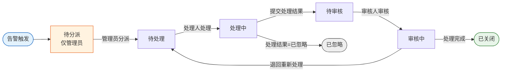

# 统一运行监控中心-需求说明文档

实时监控全院智能体的**业务、状态、成本**三维运行情况，对异常自动产生告警，并在本模块内完成「**待分派 → 待处理 → 处理中 → 待审核 → 审核中 → 已关闭 / 已忽略**」的告警事件全生命周期闭环。本文档依据《统一运行监控中心功能清单及交互说明》重置全部页面、字段与交互。

<aside>
🔒

**访问范围**：本模块**仅面向医院信息科 IT 管理员**，不对科室管理员与普通用户开放；其中「告警规则管理」与「待分派事件」**仅管理员可见**。侧边栏入口对非授权角色不可见，直接访问 URL 时返回无权限提示。

</aside>

### 导航结构

```
统一运行监控中心（一级菜单）
├── 1. 监控告警总览
├── 2. 业务监控
├── 3. 状态监控
├── 4. 成本监控
├── 5. 告警规则管理（仅管理员）
│   ├── 5.1 规则管理页
│   ├── 5.2 新建规则页
│   └── 5.3 规则详情页
└── 6. 告警事件处置
    ├── 6.1 事件管理列表页（全部 / 待分派 / 待处理 / 处理中 / 待审核 / 审核中 / 已关闭 / 已忽略，共 8 个 Tab）
    ├── 6.2 事件分派页
    ├── 6.3 事件处理页
    ├── 6.4 处理审核页
    └── 6.5 事件详情页
```

### 核心页面清单

| **编号** | **页面名称** | **页面类型** | **主要用途** | **使用角色** |
| --- | --- | --- | --- | --- |
| 1.1 | 监控告警总览页 | 数据可视化页 | 总览当日/未处理/已处理告警数量与告警次数日/周/月趋势 | IT 管理员 |
| 2.1 | 业务监控页 | 图表 + 卡片页 | 调用量、成功率、并发/吞吐、响应时间、超时率、采纳率与用户反馈 | IT 管理员 |
| 3.1 | 状态监控页 | 卡片 + 图表页 | 在线/离线/禁用/异常智能体数量与占比，科室分布 | IT 管理员 |
| 4.1 | 成本监控页 | 卡片 + 图表页 | CPU/GPU/内存/Token 累计与当日用量及 TOP5 消耗排行 | IT 管理员 |
| 5.1 | 规则管理页 | 列表页 | 告警规则的查看、新建、编辑、删除入口 | IT 管理员（仅管理员） |
| 5.2 | 新建规则页 | 表单页 | 新建告警规则，支持暂存、模板下载、提交校验 | IT 管理员（仅管理员） |
| 5.3 | 规则详情页 | 详情/编辑页 | 查看规则配置、规则内容库与规则文件，支持编辑/删除 | IT 管理员（仅管理员） |
| 6.1 | 事件管理列表页 | 列表（8 Tab）页 | 按状态分 Tab 管理全部告警事件，提供查看/分派/处理/审核入口 | IT 管理员 |
| 6.2 | 事件分派页 | 操作页 | 管理员将待分派事件分派至处理人（进入待处理） | IT 管理员（仅管理员） |
| 6.3 | 事件处理页 | 操作页 | 处理人填写处理方案并处理事件（进入处理中/待审核） | IT 管理员 |
| 6.4 | 处理审核页 | 操作页 | 审核人审核处理结果，处理完成或退回重新处理 | IT 管理员 |
| 6.5 | 事件详情页 | 详情页 | 查看事件全量信息、审核意见与智能体告警关联拓扑图 | IT 管理员 |

### 告警事件状态流转

<aside>
🔄

告警事件由规则命中后自动产生，按下述状态机流转；其中**「待分派」状态仅管理员可见与操作**。处理过程支持「处理 → 退回 → 再次处理」，退回时需展示退回处理的具体说明。

</aside>



### 字段结构统一说明

- 📦 告警规则配置 / 触发告警内容 — 字段结构（统一说明）
    
    事件页中的「触发告警内容」与规则详情页中的「规则配置」均采用以下统一结构展示，下文相应字段不再重复列举。
    
    ```
    1. rule_name（规则名称）：唯一标识该告警规则，示例「智能体Token异常增长告警」
    2. trigger_time（触发时间）：YYYY-MM-DD HH:MM:SS
    3. trigger_condition（触发条件）
       - metric：指标（CPU / Token / 成功率 等）
       - operator：> / < / >= / <= / =
       - threshold：阈值
       - sustain_duration：持续时间（如连续3分钟）
       示例：Token使用量 > 10000 且持续5分钟
    4. trigger_action（触发动作）：notify(通知) / warn(预警) / throttle(限流智能体) / degrade(降级模型) / disable(停用智能体)
    5. output_prompt（输出提示词）：可配置提示词模板，例如
       智能体【{agent_name}】在{time_window}内出现异常：
       指标：{metric}；当前值：{current_value}；阈值：{threshold}；建议处理：{suggestion}
    ```
    

---

## 1. 监控告警总览

### 1.1 监控告警总览页

<aside>
🔁

页面支持**自动刷新（默认 60s）+ 手动【刷新】**；趋势数据与总览数据同步实时刷新。

</aside>

| **字段** | **统计口径 / 展示方式** | **图标/按钮** | **交互说明** |
| --- | --- | --- | --- |
| 当日告警总数 | 当天 00:00:00 至当前时间产生的所有告警数量（含未处理+已处理）；大数字卡片展示 | 刷新 | 点击卡片进入告警事件管理页 |
| 未处理告警数 | 当前系统中未完成闭环的告警总数；与总览同步实时刷新；大数字卡片，红色强调数字（突出风险） | — | 点击进入待处理告警事件页 |
| 已处理告警数 | 当日已完成处理闭环的告警数量；与总览同步实时刷新；大数字卡片，绿色数字 | — | 点击进入已处理告警事件页 |
| 告警次数日趋势 | 近 15 天每日告警总量；折线图 | — | 点击【刷新】，告警数据按最新实时数据更新 |
| 告警次数周趋势 | 近 15 周每周告警总量；折线图 | — | — |
| 告警次数月趋势 | 近 12 个月每月告警总量；折线图 | — | — |

## 2. 业务监控

### 2.1 业务监控页

<aside>
🔁

页面支持**自动刷新（默认 60s）+ 手动【刷新】**；趋势/排行数据与总览数据同步实时刷新。

</aside>

| **字段** | **统计口径 / 展示方式** | **交互说明** |
| --- | --- | --- |
| 智能体累计调用次数 | 系统上线至今所有调用请求总次数（含成功+失败）；指标卡片（大数字） | 点击进入智能体审计日志页 |
| 智能体成功调用率 | 成功调用次数 / 总调用次数 × 100%；百分比 + 颜色状态（≥95% 绿、<95% 黄、<90% 红） | 点击【刷新】，业务监控数据按最新实时数据更新 |
| 当日调用次数 | 当天 00:00 至当前时间所有调用次数；卡片数字 + 当日趋势辅助标识（↑↓） | — |
| 当日成功调用率 | 当日成功调用次数 / 当日总调用次数 × 100%；百分比 + 颜色状态（≥95% 绿、<95% 黄、<90% 红） | — |
| 调用次数日趋势 | 近 15 天每日调用次数；折线图 | — |
| 调用次数周趋势 | 近 15 周每周调用次数；折线图 | — |
| 调用次数月趋势 | 近 12 个月每月调用次数；折线图 | — |
| 高频调用智能体（TOP5）/ 科室排行 | 调用次数排名前 5 的智能体；横向柱状图 / 排行榜，同步显示所属科室 | — |
| 并发数 | 当前同时由该智能体处理的请求数量；实时数值 + 峰值标识 + 动态波动图 | — |
| 吞吐量 | 单位时间内智能体完成的「完整任务数」；实时数值 + 峰值标识 + 动态波动图 | — |
| 平均响应时间 | 所有调用平均耗时（ms/s），响应时间 = 返回时间 − 请求开始时间；数值卡片 + 性能等级（≤1s 优秀绿 / 1–10s 正常黄 / >10s 异常红） | 点击查看各智能体平均响应时间 |
| 响应超时率 | 响应时间超过系统设定阈值（如 10s，可配置）的调用次数 / 总调用次数 × 100%；百分比卡 + 风险颜色（≤1% 正常绿 / 1%–5% 关注黄 / >5% 异常红） | 点击查看响应超时具体情况 |
| 医生采纳率 | 被医生采纳的智能体输出 / 总输出次数；百分比 + 趋势图 | — |
| 用户反馈意见 | 用户提交的评价与反馈汇总；饼图，正负面占比（满意 / 一般 / 不满意） | 点击进入反馈详情列表 |

## 3. 状态监控

### 3.1 状态监控页

<aside>
🔁

各状态数量卡片含实时刷新标识，与总览数据同步实时刷新。

</aside>

| **字段** | **统计口径 / 展示方式** | **交互说明** |
| --- | --- | --- |
| 在线智能体数量 | 当前状态为「在线」的智能体总数；大数字卡片 + 实时刷新标识 | 点击进入按「在线」运行状态筛选的台账列表页 |
| 智能体在线率 | 在线智能体数 ÷ 全部已接入智能体数 × 100%；大数字卡片，百分比 | 点击【刷新】，状态监控数据按最新实时数据更新 |
| 离线智能体数量 | 当前状态为「离线」的智能体总数；大数字卡片 + 实时刷新标识 | 点击进入按「离线」运行状态筛选的台账列表页 |
| 智能体离线率 | 离线智能体数 ÷ 全部已接入智能体数 × 100%；大数字卡片，百分比 | — |
| 禁用智能体数量 | 当前状态为「禁用」的智能体总数；大数字卡片 + 实时刷新标识 | 点击进入按「禁用」运行状态筛选的台账列表页 |
| 异常智能体数量 | 当前状态为「异常」的智能体总数；大数字卡片 + 实时刷新标识 | 点击进入按「异常」运行状态筛选的台账列表页 |
| 各运行状态科室智能体数量比例 | 不同运行状态（在线/离线/禁用/异常）智能体数量 / 该科室智能体总数 × 100%；百分比，饼状图 | — |

## 4. 成本监控

### 4.1 成本监控页

<aside>
🔁

页面支持手动【刷新】，与总览数据同步实时刷新；累计类按「自上线以来」累计，当日类按「当天 00:00 至当前」统计。

</aside>

| **字段** | **统计口径 / 展示方式** |
| --- | --- |
| CPU 累计使用量 | 智能体自上线以来消耗的 CPU 总使用量；累计卡片 |
| 当日 CPU 使用量 | 当日 CPU 总消耗；卡片 + 日趋势对比（↑↓） |
| GPU 累计使用量 | 智能体累计 GPU 使用量；累计卡片 |
| 当日 GPU 使用量 | 当日 GPU 总消耗；卡片 + 日趋势对比（↑↓） |
| 内存累计使用量 | 智能体累计内存使用量；累计卡片 |
| 当日内存使用量 | 当日内存总消耗；卡片 + 日趋势对比（↑↓） |
| Token 累计使用量 | 智能体累计 Token 使用量；累计卡片 |
| 当日 Token 使用量 | 当日 Token 总消耗；卡片 + 日趋势对比（↑↓） |
| CPU 累计使用量消耗排行 TOP5 | CPU 累计使用量排行前 5 的智能体；横向柱状图 / 排行榜，同步显示所属科室 |
| GPU 累计使用量消耗排行 TOP5 | GPU 累计使用量排行前 5 的智能体；横向柱状图 / 排行榜，同步显示所属科室 |
| 内存累计使用量消耗排行 TOP5 | 内存累计使用量排行前 5 的智能体；横向柱状图 / 排行榜，同步显示所属科室 |
| Token 累计使用量消耗排行 TOP5 | Token 累计使用量排行前 5 的智能体；横向柱状图 / 排行榜，同步显示所属科室 |
| CPU 当日使用量消耗排行 TOP5 | CPU 当日使用量排行前 5 的智能体；横向柱状图 / 排行榜，同步显示所属科室 |
| GPU 当日使用量消耗排行 TOP5 | GPU 当日使用量排行前 5 的智能体；横向柱状图 / 排行榜，同步显示所属科室 |
| 内存当日使用量消耗排行 TOP5 | 内存当日使用量排行前 5 的智能体；横向柱状图 / 排行榜，同步显示所属科室 |
| Token 当日使用量消耗排行 TOP5 | Token 当日使用量排行前 5 的智能体；横向柱状图 / 排行榜，同步显示所属科室 |

## 5. 告警规则管理（仅管理员）

<aside>
🔑

本一级功能**仅 IT 管理员可见与操作**。规则类型统一为：**业务监控告警规则 / 状态监控告警规则 / 成本监控告警规则 / 安全监控告警规则**。

</aside>

### 5.1 规则管理页

| **字段** | **说明 / 展示方式** |
| --- | --- |
| 规则名称 | 告警规则的唯一业务标识名称（示例：智能体CPU使用率过高告警 / Token异常增长告警）；主标题字段，支持模糊搜索 / 关键词过滤 |
| 规则类型 | 业务监控告警规则 / 状态监控告警规则 / 成本监控告警规则 / 安全监控告警规则 |
| 触发条件 | 规则核心判断逻辑，形式为「指标 + 运算符 + 阈值 + 时间窗口」；示例：CPU使用率 > 80% 持续5分钟、Token增长率 > 50%（10分钟窗口）；结构化表达 + 可折叠 |
| 规则内容 | 来源于内置「告警规则内容库」四大类（详见下方共用清单） |

**按钮与交互**

| **按钮** | **交互说明** |
| --- | --- |
| 新建规则 | 点击进入新建规则页（5.2） |
| 查看详情 | 点击进入规则详情页（5.3） |
| 编辑 | 点击进入规则详情页编辑状态 |
| 删除 | 弹出「确认是否删除」：点击【是】删除此条规则；点击【否】回到规则管理页 |
- 📚 告警规则内容库（四大类，5.1 / 5.2 / 5.3 共用，点击展开）
    
    **一、业务执行类**
    
    - 任务执行成功率低于95%触发业务异常告警，提示核心能力交付下降
    - 任务完成时间超过SLA阈值触发延迟告警，提示服务效率下降
    - 任务中断率超过5%触发流程异常告警，提示执行链不稳定
    - 业务接口调用失败率超过阈值触发服务异常告警，提示依赖不可靠
    - 任务重复执行率异常升高触发业务异常告警，提示调度逻辑错误
    - 任务未完成但状态已结束触发状态异常告警，提示流程不一致
    - 任务成功率持续下降触发业务退化告警，提示能力衰减
    - 用户请求未被正确响应触发服务异常告警，提示交互失败
    - 多轮任务无法闭环触发流程异常告警，提示任务规划失败
    - 业务输出为空率超过阈值触发输出异常告警，提示能力失效
    - API调用结果与预期不一致触发结果异常告警，提示逻辑错误
    - 任务分发失败率上升触发调度异常告警，提示分配系统不稳定
    - 内存持续增长触发内存异常告警，提示泄漏风险
    - GPU使用率长期100%触发算力瓶颈告警，提示推理受限
    - 请求队列积压超过阈值触发性能告警，提示处理能力不足
    - 吞吐量下降超过30%触发性能退化告警，提示系统能力下降
    - GC频繁触发性能抖动告警，提示服务不稳定
    - 磁盘IO异常升高触发存储性能告警，提示系统压力
    - 网络延迟异常升高触发通信性能告警，提示链路瓶颈
    - 线程池耗尽触发资源枯竭告警，提示无法响应请求
    - API延迟波动过大触发性能抖动告警，提示服务不稳定
    - 并发超过承载能力触发性能过载告警，提示系统崩溃风险
    - 缓存命中率下降触发性能异常告警，提示访问压力增加
    - 资源利用率持续偏高触发性能风险告警，提示系统压力过大
    - P95响应时间超过阈值触发性能告警，提示系统延迟升高
    - 平均响应时间超过设定值触发性能异常告警，提示效率下降
    - 请求超时率超过5%触发性能告警，提示服务不稳定
    - CPU使用率持续超过90%触发资源过载告警，提示性能下降
    
    **二、运行状态类**
    
    - 实例心跳失败连续3次触发节点离线告警，提示服务不可用
    - 容器频繁重启触发运行不稳定告警，提示服务异常
    - 服务健康检查失败触发状态异常告警，提示系统不可用风险
    - 注册实例数量低于预期触发容量不足告警，提示服务不可用风险
    - 服务发现失败触发注册异常告警，提示调用链断裂
    - 部署失败率升高触发发布异常告警，提示系统不稳定
    - 配置未生效触发状态异常告警，提示行为不一致
    - 服务降级频繁触发状态告警，提示系统压力过高
    - 节点不可达触发运行异常告警，提示服务离线
    - 版本回滚频繁触发稳定性告警，提示发布风险
    - 服务冻结或暂停触发状态异常告警，提示能力不可用
    - 实例负载持续不均触发状态异常告警，提示调度失衡
    
    **三、成本与资源类**
    
    - token消耗超过历史基线3倍触发成本异常告警，提示资源浪费
    - 单任务成本超过阈值触发成本告警，提示执行效率低
    - API费用超过预算触发成本超支告警，提示费用失控
    - 无请求仍发生模型调用触发空转成本告警，提示资源浪费
    - 长文本生成占比过高触发成本异常告警，提示效率低下
    - 重复计算比例过高触发成本浪费告警，提示冗余执行
    - 高成本模型调用频率过高触发成本异常告警，提示策略失衡
    - 单服务成本持续TOP1触发成本集中告警，提示资源分布不均
    - 日成本增长异常触发成本趋势告警，提示运营风险
    - 任务失败重试导致成本增加触发成本异常告警，提示浪费资源
    - 会话平均成本上升触发成本异常告警，提示效率下降
    - 低价值任务占比过高触发成本低效告警，提示资源浪费
    
    **四、安全类**
    
    - 输入包含提示词注入特征触发输入安全告警，提示攻击风险
    - 输入包含越权访问意图触发输入安全告警，提示潜在违规行为
    - 输入包含敏感信息泄露风险触发输入安全告警，提示隐私风险
    - 输入包含恶意脚本触发输入安全告警，提示攻击行为
    - 输入频率异常增长触发输入安全告警，提示自动化攻击风险
    - 输入结构异常触发输入安全告警，提示异常请求
    - 输入包含非法操作指令触发输入安全告警，提示违规风险
    - 输入内容与任务无关比例过高触发输入安全告警，提示干扰行为
    - 输出包含未经授权建议触发输出安全告警，提示合规风险
    - 输出包含医疗/金融等高风险决策建议触发高危输出告警，提示误导风险
    - 输出缺乏不确定性声明触发输出安全告警，提示风险控制不足
    - 输出与规则/政策冲突触发输出安全告警，提示违规风险
    - 输出包含虚假信息触发幻觉告警，提示模型不可靠
    - 输出结构错误率高触发输出异常告警，提示不规范
    - 输出包含敏感信息触发数据泄露告警，提示安全风险
    - 输出存在逻辑矛盾触发输出异常告警，提示推理错误
    - 输出内容重复率过高触发生成异常告警，提示模型退化
    - 输出为空或无意义触发输出失败告警，提示能力异常
    - 工具调用失败率超过阈值触发工具异常告警，提示依赖不可用
    - 工具调用未授权接口触发工具安全告警，提示越权行为
    - 工具调用深度超过限制触发递归告警，提示调用链风险
    - 工具调用频率异常升高触发工具风暴告警，提示滥用风险
    - 工具返回数据格式异常触发工具异常告警，提示结果不可靠
    - 非白名单工具调用触发安全告警，提示违规调用
    - 外部API失败率升高触发工具异常告警，提示依赖不稳定
    - 工具链路中断触发工具告警，提示执行失败
    - 工具响应延迟过高触发工具性能告警，提示效率下降
    - 工具调用结果冲突触发工具一致性告警，提示逻辑异常
    - 访问未授权数据触发数据安全告警，提示越权风险
    - 数据批量导出触发数据泄露告警，提示高风险行为
    - 敏感字段未脱敏输出触发数据泄露告警，提示隐私风险
    - 跨租户访问数据触发数据隔离告警，提示严重违规
    - 数据访问频率异常触发数据安全告警，提示潜在攻击
    - API异常读取数据触发数据访问告警，提示行为异常
    - 数据回流失败触发数据一致性告警，提示同步错误
    - 审计日志缺失触发安全盲区告警，提示无法追踪行为
    - 非白名单数据访问触发访问违规告警，提示权限失效
    - 数据接口异常响应触发数据异常告警，提示系统不稳定
    - 敏感数据外泄检测触发严重安全告警，提示泄露风险
    - 数据访问路径异常触发安全告警，提示可能绕过权限

### 5.2 新建规则页

| **字段** | **说明 / 展示方式** |
| --- | --- |
| 规则名称 | 告警规则的唯一业务标识名称（示例：智能体CPU使用率过高告警 / Token异常增长告警）；主标题字段，支持模糊搜索 / 关键词过滤 |
| 规则类型 | 业务监控告警规则 / 状态监控告警规则 / 成本监控告警规则 / 安全监控告警规则 |
| 触发条件 | 「指标 + 运算符 + 阈值 + 时间窗口」；示例：CPU使用率 > 80% 持续5分钟、Token增长率 > 50%（10分钟窗口）；结构化表达 + 可折叠 |
| 规则内容 | 来源于内置「告警规则内容库」四大类（见 5.1 共用清单） |
| 规则文件上传 | 选择本地文件上传，支持 .xlsx、.csv 等格式；单文件限制 50MB |

**按钮与交互**

| **按钮** | **交互说明** |
| --- | --- |
| 暂存 | 点击后新建规则记录自动暂存至注册资源草稿页 |
| 模板下载 | 系统自动下载告警规则参考模板文件；若未按模板要求上传，系统将精确到行自动提醒「具体报错原因」（如规则部分内容缺失、存在规则内容格式问题） |
| 提交 | 校验所有必填字段，校验通过后执行提交动作；校验失败时给出气泡提示说明 |

### 5.3 规则详情页

| **字段** | **说明 / 展示方式** |
| --- | --- |
| 规则名称 | 告警规则的唯一业务标识名称；主标题字段，支持模糊搜索 / 关键词过滤 |
| 规则类型 | 业务监控告警规则 / 状态监控告警规则 / 成本监控告警规则 / 安全监控告警规则 |
| 触发条件 | 「指标 + 运算符 + 阈值 + 时间窗口」；结构化表达 + 可折叠 |
| 规则配置 | 包含 rule_name / trigger_time / trigger_condition / trigger_action / output_prompt（结构见上方「字段结构统一说明」） |
| 规则内容库 | 内置四大类规则库（见 5.1 共用清单） |
| 规则文件 | .xlsx、.csv 等格式；单文件限制 50MB |

**按钮与交互**

| **按钮** | **交互说明** |
| --- | --- |
| 规则文件查看 / 下载 | 在线查看或下载该规则关联的规则文件 |
| 编辑 | 进入编辑状态修改规则配置 |
| 删除 | 二次确认后删除该规则 |

## 6. 告警事件处置

<aside>
🚨

**本一级功能承载告警事件全生命周期闭环**：6.1 事件管理列表页按状态分 8 个 Tab 管理事件，6.2~6.4 承载分派/处理/审核操作，6.5 提供全量详情。各事件页中「事件类型」固定取值为「业务监控 / 状态监控 / 成本监控 / 安全监控告警规则」，「触发告警内容」结构见上方「字段结构统一说明」。

</aside>

### 6.1 事件管理列表页（8 个 Tab）

<aside>
📑

Tab 顺序：**全部事件 / 待分派事件（仅管理员）/ 待处理事件 / 处理中事件 / 待审核事件 / 审核中事件 / 已关闭事件 / 已忽略事件**。除「全部事件」外，各 Tab 列表默认按触发时间排序。

</aside>

**6.1.1 全部事件**

| **字段** | **说明** |
| --- | --- |
| 序号 | 列表行序号 |
| 事件类型 | 业务监控 / 状态监控 / 成本监控 / 安全监控告警规则 |
| 关联智能体 | 触发该事件的智能体名称 |
| 触发告警内容 | 事件触发时对应的告警描述内容（结构见「字段结构统一说明」） |
| 通知对象 | 关联账户及技术负责人 |
| 通知方式 | 系统通知、短信通知 / 邮箱通知 |
| 当前状态 | 待分派 / 待处理 / 处理中 / 待审核 / 审核中 / 已关闭 / 已忽略 |

按钮：查看详情 / 分派 / 处理 / 审核。点击【查看详情】进入事件详情页（6.5）。

**6.1.2 待分派事件（仅管理员）**

| **字段** | **说明** |
| --- | --- |
| 序号 | 按触发时间排序 |
| 事件类型 | 业务监控 / 状态监控 / 成本监控 / 安全监控告警规则 |
| 关联智能体 | 触发该事件的智能体名称 |
| 触发告警内容 | 事件触发时对应的告警描述内容（结构见「字段结构统一说明」） |
| 通知对象 | 关联账户及技术负责人 |
| 通知方式 | 系统通知、短信通知 / 邮箱通知 |
| 触发时间 | YYYY-MM-DD HH:MM:SS |

按钮：分派（仅管理员）。点击【分派】，告警事件记录到待处理事件页。

**6.1.3 待处理事件**

| **字段** | **说明** |
| --- | --- |
| 序号 | 按触发时间排序 |
| 事件类型 | 业务监控 / 状态监控 / 成本监控 / 安全监控告警规则 |
| 关联智能体 | 触发该事件的智能体名称 |
| 触发告警内容 | 事件触发时对应的告警描述内容（结构见「字段结构统一说明」） |
| 通知对象 | 关联账户及技术负责人 |
| 通知方式 | 系统通知、短信通知 / 邮箱通知 |
| 处理时间线 | 处理 - 退回 - 再次处理；退回处理的事件需展示退回处理的具体说明 |
| 触发时间 | YYYY-MM-DD HH:MM:SS |
| 分派时间 | YYYY-MM-DD HH:MM:SS |

按钮：处理。点击【处理】，告警事件记录到处理中事件页。

**6.1.4 处理中事件**

| **字段** | **说明** |
| --- | --- |
| 序号 | 按触发时间排序 |
| 事件类型 | 业务监控 / 状态监控 / 成本监控 / 安全监控告警规则 |
| 关联智能体 | 触发该事件的智能体名称 |
| 触发告警内容 | 事件触发时对应的告警描述内容（结构见「字段结构统一说明」） |
| 处理人 | 关联账户及技术负责人 |
| 通知方式 | 系统通知、短信通知 / 邮箱通知 |
| 触发时间 | YYYY-MM-DD HH:MM:SS |
| 处理结果 | 已处理 / 已忽略 |
| 处理方案 | 详细说明告警事件的处理过程 |
| 开始处理时间 | YYYY-MM-DD HH:MM:SS |

按钮：查看详情。点击【查看详情】进入事件详情页（6.5）。

**6.1.5 待审核事件**

| **字段** | **说明** |
| --- | --- |
| 序号 | 按触发时间排序 |
| 事件类型 | 业务监控 / 状态监控 / 成本监控 / 安全监控告警规则 |
| 关联智能体 | 触发该事件的智能体名称 |
| 触发告警内容 | 事件触发时对应的告警描述内容（结构见「字段结构统一说明」） |
| 处理人 | 关联账户及技术负责人 |
| 通知方式 | 系统通知、短信通知 / 邮箱通知 |
| 触发时间 | YYYY-MM-DD HH:MM:SS |
| 处理结果 | 已处理 / 已忽略 |
| 处理方案 | 详细说明告警事件的处理过程 |
| 处理完成时间 | YYYY-MM-DD HH:MM:SS |

按钮：审核。点击【审核】进入处理审核页（6.4）。

**6.1.6 审核中事件**

| **字段** | **说明** |
| --- | --- |
| 序号 | 按触发时间排序 |
| 事件类型 | 业务监控 / 状态监控 / 成本监控 / 安全监控告警规则 |
| 关联智能体 | 触发该事件的智能体名称 |
| 触发告警内容 | 事件触发时对应的告警描述内容（结构见「字段结构统一说明」） |
| 处理人 | 关联账户及技术负责人 |
| 通知方式 | 系统通知、短信通知 / 邮箱通知 |
| 处理结果 | 已处理 / 已忽略 |
| 处理方案 | 详细说明告警事件的处理过程 |
| 触发时间 | YYYY-MM-DD HH:MM:SS |
| 处理完成时间 | YYYY-MM-DD HH:MM:SS |

按钮：查看详情。点击【查看详情】进入事件详情页（6.5）。

**6.1.7 已关闭事件**

| **字段** | **说明** |
| --- | --- |
| 序号 | 按触发时间排序 |
| 事件类型 | 业务监控 / 状态监控 / 成本监控 / 安全监控告警规则 |
| 关联智能体 | 触发该事件的智能体名称 |
| 触发告警内容 | 事件触发时对应的告警描述内容（结构见「字段结构统一说明」） |
| 处理人 | 关联账户及技术负责人 |
| 处理人联系方式 | 系统通知、短信通知 / 邮箱通知 |
| 处理结果 | 已处理 / 已忽略 |
| 处理方案 | 详细说明告警事件的处理过程 |
| 触发时间 | YYYY-MM-DD HH:MM:SS |
| 处理完成时间 | YYYY-MM-DD HH:MM:SS |

按钮：查看详情。点击【查看详情】进入事件详情页（6.5）。

**6.1.8 已忽略事件**

| **字段** | **说明** |
| --- | --- |
| 序号 | 按触发时间排序 |
| 事件类型 | 业务监控 / 状态监控 / 成本监控 / 安全监控告警规则 |
| 关联智能体 | 触发该事件的智能体名称 |
| 触发告警内容 | 事件触发时对应的告警描述内容（结构见「字段结构统一说明」） |
| 处理人 | 关联账户及技术负责人 |
| 通知方式 | 系统通知、短信通知 / 邮箱通知 |
| 处理结果 | 已处理 / 已忽略 |
| 处理方案 | 详细说明告警事件的处理过程 |
| 触发时间 | YYYY-MM-DD HH:MM:SS |
| 处理完成时间 | YYYY-MM-DD HH:MM:SS |

按钮：查看详情。点击【查看详情】进入事件详情页（6.5）。

### 6.2 事件分派页

| **字段** | **说明** |
| --- | --- |
| 序号 | 按触发时间排序 |
| 事件类型 | 业务监控 / 状态监控 / 成本监控 / 安全监控告警规则 |
| 关联智能体 | 触发该事件的智能体名称 |
| 触发告警内容 | 事件触发时对应的告警描述内容（结构见「字段结构统一说明」） |
| 处理人 | 关联账户及技术负责人 |
| 通知方式 | 系统通知、短信通知 / 邮箱通知 |
| 触发告警时间 | YYYY-MM-DD HH:MM:SS |

按钮：分派。点击【分派】，告警事件记录到待处理事件页。

### 6.3 事件处理页

| **字段** | **说明** |
| --- | --- |
| 序号 | 按触发时间排序 |
| 事件类型 | 业务监控 / 状态监控 / 成本监控 / 安全监控告警规则 |
| 关联智能体 | 触发该事件的智能体名称 |
| 触发告警内容 | 事件触发时对应的告警描述内容（结构见「字段结构统一说明」） |
| 处理人 | 关联账户及技术负责人 |
| 通知方式 | 系统通知、短信通知 / 邮箱通知 |
| 触发时间 | YYYY-MM-DD HH:MM:SS |
| 处理时间记录线 | 处理 - 退回 - 再次处理 |
| 处理结果 | 已处理 / 已忽略 |
| 处理方案 | 详细说明告警事件的处理过程 |
| 开始处理时间 | YYYY-MM-DD HH:MM:SS |

按钮：处理 / 返回。点击【处理】，告警事件记录到处理中事件页。

### 6.4 处理审核页

| **字段** | **说明** |
| --- | --- |
| 序号 | 按触发时间排序 |
| 事件类型 | 业务监控 / 状态监控 / 成本监控 / 安全监控告警规则 |
| 关联智能体 | 触发该事件的智能体名称 |
| 触发告警内容 | 事件触发时对应的告警描述内容（结构见「字段结构统一说明」） |
| 触发告警时间 | YYYY-MM-DD HH:MM:SS |
| 处理结果 | 已处理 / 已忽略 |
| 处理方案 | 详细说明告警事件的处理过程 |
| 审核意见 | 处理完成 / 退回重新处理 |
| 审核说明 | 阐述具体审核说明 |

按钮：处理完成 / 退回重新处理。点击【处理完成】，告警事件记录至已关闭事件；点击【退回重新处理】，告警事件记录至待处理事件。

### 6.5 事件详情页

| **字段** | **说明** |
| --- | --- |
| 序号 | 按触发时间排序 |
| 事件类型 | 业务监控 / 状态监控 / 成本监控 / 安全监控告警规则 |
| 关联智能体 | 触发该事件的智能体名称 |
| 触发告警内容 | 事件触发时对应的告警描述内容（结构见「字段结构统一说明」） |
| 触发告警时间 | YYYY-MM-DD HH:MM:SS |
| 处理结果 | 已处理 / 已忽略 |
| 处理方案 | 详细说明告警事件的处理过程 |
| 审核意见 | 处理完成，关闭该告警事项 / 退回重新处理 |
| 审核说明 | 阐述具体审核说明 |
| 智能体告警关联拓扑图 | 以拓扑图形式展示该告警事件关联的智能体及其依赖关系 |

按钮：返回。点击【返回】回到来源列表页。